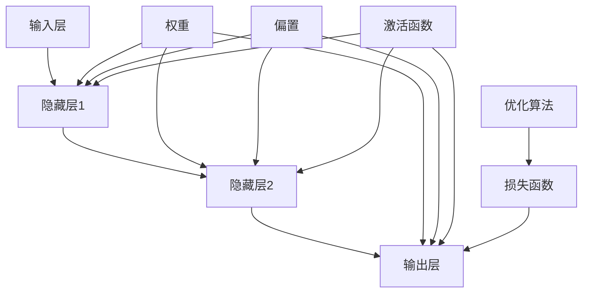

                 

### 文章标题：神经网络：人类智慧的延伸

> **关键词：** 神经网络，机器学习，人工智能，深度学习，算法，模型，应用场景
> 
> **摘要：** 本文将深入探讨神经网络这一人工智能的核心技术，从背景介绍到核心算法原理，再到实际应用场景，全面解析神经网络的工作原理及其在各个领域的广泛应用。通过逐步分析推理，读者将了解神经网络如何成为人类智慧的延伸。

#### 1. 背景介绍

神经网络（Neural Networks）的概念起源于20世纪40年代，由心理学家沃伦·麦卡洛克（Warren McCulloch）和数学家沃尔特·皮茨（Walter Pitts）首次提出。最初的神经网络模型是简单的生物神经系统模拟，旨在模拟人类大脑的信息处理方式。

随着时间的推移，神经网络的理论和应用不断发展，特别是近年来，随着计算能力的提升和大数据的普及，神经网络在机器学习和人工智能领域取得了显著的突破。深度学习（Deep Learning）作为神经网络的一种特殊形式，已经成为当前人工智能研究的热点。

神经网络的核心思想是通过模拟生物神经元的结构和工作方式，实现对数据的自动特征提取和学习能力。这一技术不仅能够处理传统的数值和文本数据，还能够处理图像、声音和视频等多媒体数据，使其在计算机视觉、自然语言处理、语音识别等领域展现了巨大的潜力。

#### 2. 核心概念与联系

要理解神经网络，我们首先需要了解其核心概念和组成部分。以下是一个简化的神经网络架构图（使用Mermaid流程图表示），其中包含了神经网络的主要组件和它们之间的关系。



- **输入层（Input Layer）**：接收外部输入数据，如图像像素值、文本词向量等。
- **隐藏层（Hidden Layers）**：对输入数据进行特征提取和转换，可以有一个或多个隐藏层。
- **输出层（Output Layer）**：根据模型的训练目标和任务，生成预测结果或分类结果。
- **权重（Weights）**：连接各个神经元的权重值，决定了输入数据对输出结果的影响程度。
- **偏置（Bias）**：每个神经元内部的偏置项，有助于调整神经元的阈值。
- **激活函数（Activation Function）**：对神经元输出进行非线性变换，引入非线性特性，使神经网络具备复杂函数逼近能力。
- **损失函数（Loss Function）**：衡量模型预测结果与实际结果之间的差距，用于指导优化算法调整模型参数。
- **优化算法（Optimization Algorithm）**：如梯度下降（Gradient Descent）、Adam等，用于调整模型参数，使损失函数值最小化。

#### 3. 核心算法原理 & 具体操作步骤

神经网络的算法原理可以简单概括为“输入-处理-输出”的过程。以下是神经网络的核心算法原理和具体操作步骤：

1. **初始化参数**：随机初始化权重和偏置。
2. **前向传播（Forward Propagation）**：
   - 对输入数据进行预处理，如归一化、标准化等。
   - 将输入数据传递到输入层，通过权重和偏置传递到隐藏层和输出层。
   - 在每个神经元上应用激活函数，将非线性特性引入模型。
   - 生成预测输出，如分类结果或回归值。
3. **计算损失**：使用损失函数计算预测输出与实际输出之间的差距。
4. **反向传播（Back Propagation）**：
   - 计算输出层的误差梯度。
   - 逐层反向传播误差，计算隐藏层和输入层的误差梯度。
   - 更新权重和偏置，使用优化算法调整模型参数。
5. **迭代优化**：重复前向传播和反向传播过程，逐步减小损失函数值，直至达到预定的停止条件。

#### 4. 数学模型和公式 & 详细讲解 & 举例说明

神经网络的数学模型主要包括以下几个方面：

1. **输入层到隐藏层的转换**：
   $$ z^{(l)} = \sum_{j} w^{(l)}_{ji}x^{(j)} + b^{(l)} $$
   其中，$z^{(l)}$表示隐藏层$l$的输出，$w^{(l)}_{ji}$表示输入层到隐藏层的权重，$x^{(j)}$表示输入层的第$j$个特征，$b^{(l)}$表示隐藏层的偏置。

2. **激活函数**：
   $$ a^{(l)} = \sigma(z^{(l)}) $$
   其中，$\sigma$表示常用的Sigmoid、ReLU或Tanh等激活函数。

3. **输出层的预测结果**：
   $$ y' = \sigma(z^{(L)}) $$
   其中，$y'$表示输出层的预测结果，$L$表示网络的层数。

4. **损失函数**：
   $$ J(\theta) = \frac{1}{m} \sum_{i=1}^{m} \sum_{k=1}^{K} (-y_k^{(i)} \log(y_k^{(i)}) - (1 - y_k^{(i)}) \log(1 - y_k^{(i)})) $$
   其中，$J(\theta)$表示损失函数，$m$表示样本数量，$K$表示输出类别数，$y_k^{(i)}$表示第$i$个样本的第$k$个类别的预测概率。

下面通过一个简单的例子来说明神经网络的工作过程：

假设我们有一个二分类问题，输入层有一个特征$x$，隐藏层有一个神经元，输出层有两个神经元，分别表示两个类别。给定训练样本$\{(x_1, y_1), (x_2, y_2), ..., (x_m, y_m)\}$，其中$y_i \in \{0, 1\}$。

1. **初始化参数**：随机初始化权重$w^{(1)}_1$和偏置$b^{(1)}$，以及输出层权重$w^{(2)}_1, w^{(2)}_2$和偏置$b^{(2)}_1, b^{(2)}_2$。

2. **前向传播**：
   - 输入样本$x_1$，计算隐藏层输出：
     $$ z^{(1)} = w^{(1)}_1 x_1 + b^{(1)} $$
     $$ a^{(1)} = \sigma(z^{(1)}) $$
   - 计算输出层输出：
     $$ z^{(2)}_1 = w^{(2)}_1 a^{(1)} + b^{(2)}_1 $$
     $$ z^{(2)}_2 = w^{(2)}_2 a^{(1)} + b^{(2)}_2 $$
     $$ a^{(2)}_1 = \sigma(z^{(2)}_1) $$
     $$ a^{(2)}_2 = \sigma(z^{(2)}_2) $$

3. **计算损失**：
   $$ J(\theta) = \frac{1}{m} \sum_{i=1}^{m} \sum_{k=1}^{2} (-y_k^{(i)} \log(a_k^{(2)}) - (1 - y_k^{(i)}) \log(1 - a_k^{(2)})) $$

4. **反向传播**：
   - 计算输出层的误差梯度：
     $$ \delta^{(2)}_1 = a^{(2)}_1 - y_1 $$
     $$ \delta^{(2)}_2 = a^{(2)}_2 - y_2 $$
   - 计算隐藏层的误差梯度：
     $$ \delta^{(1)} = a^{(1)} \odot \delta^{(2)} $$
   - 更新参数：
     $$ w^{(2)}_1 = w^{(2)}_1 - \alpha \frac{1}{m} \sum_{i=1}^{m} a^{(1)}_i \delta^{(2)}_1 $$
     $$ w^{(2)}_2 = w^{(2)}_2 - \alpha \frac{1}{m} \sum_{i=1}^{m} a^{(1)}_i \delta^{(2)}_2 $$
     $$ b^{(2)}_1 = b^{(2)}_1 - \alpha \frac{1}{m} \sum_{i=1}^{m} \delta^{(2)}_1 $$
     $$ b^{(2)}_2 = b^{(2)}_2 - \alpha \frac{1}{m} \sum_{i=1}^{m} \delta^{(2)}_2 $$
     $$ w^{(1)}_1 = w^{(1)}_1 - \alpha \frac{1}{m} \sum_{i=1}^{m} x_i \delta^{(1)} $$
     $$ b^{(1)} = b^{(1)} - \alpha \frac{1}{m} \sum_{i=1}^{m} \delta^{(1)} $$

5. **迭代优化**：重复上述步骤，直至损失函数值达到预定的最小值或达到预设的迭代次数。

通过以上步骤，神经网络能够对输入数据进行学习，逐步提高预测准确性。

#### 5. 项目实践：代码实例和详细解释说明

在本节中，我们将使用Python和TensorFlow库实现一个简单的神经网络，并进行详细解释说明。

##### 5.1 开发环境搭建

首先，确保已经安装了Python 3.6及以上版本和TensorFlow 2.x版本。可以通过以下命令进行安装：

```bash
pip install tensorflow
```

##### 5.2 源代码详细实现

以下是实现神经网络的源代码：

```python
import tensorflow as tf
import numpy as np
import matplotlib.pyplot as plt

# 设置随机种子
tf.random.set_seed(42)

# 定义神经网络结构
model = tf.keras.Sequential([
    tf.keras.layers.Dense(64, activation='relu', input_shape=(784,)),
    tf.keras.layers.Dense(64, activation='relu'),
    tf.keras.layers.Dense(10, activation='softmax')
])

# 编译模型
model.compile(optimizer='adam',
              loss='sparse_categorical_crossentropy',
              metrics=['accuracy'])

# 加载MNIST数据集
(x_train, y_train), (x_test, y_test) = tf.keras.datasets.mnist.load_data()

# 预处理数据
x_train = x_train.astype(np.float32) / 255.0
x_test = x_test.astype(np.float32) / 255.0
x_train = x_train.reshape((-1, 784))
x_test = x_test.reshape((-1, 784))

# 训练模型
model.fit(x_train, y_train, epochs=10, batch_size=32, validation_split=0.1)

# 评估模型
test_loss, test_acc = model.evaluate(x_test, y_test)
print(f"Test accuracy: {test_acc:.4f}")

# 可视化结果
plt.figure(figsize=(10, 10))
for i in range(25):
    plt.subplot(5, 5, i + 1)
    plt.xticks([])
    plt.yticks([])
    plt.grid(False)
    plt.imshow(x_test[i], cmap=plt.cm.binary)
    plt.xlabel(model.predict(x_test[i:i+1])[0])
plt.show()
```

##### 5.3 代码解读与分析

以下是代码的详细解读和分析：

- **导入库**：导入TensorFlow、NumPy和matplotlib库。
- **设置随机种子**：为了确保实验的可复现性，设置随机种子。
- **定义神经网络结构**：使用`tf.keras.Sequential`创建一个序列模型，包含两个`Dense`层（全连接层），激活函数分别为ReLU和softmax。
- **编译模型**：设置优化器为Adam，损失函数为稀疏分类交叉熵，评价指标为准确率。
- **加载MNIST数据集**：从TensorFlow数据集中加载MNIST手写数字数据集。
- **预处理数据**：将数据集转换为浮点数，进行归一化处理，并将图像数据展平为一维数组。
- **训练模型**：使用`fit`函数训练模型，设置训练轮次为10，批量大小为32，保留10%的数据作为验证集。
- **评估模型**：使用`evaluate`函数评估模型在测试集上的性能，输出准确率。
- **可视化结果**：使用matplotlib绘制测试集前25个样本的图像及其预测结果。

##### 5.4 运行结果展示

训练完成后，输出模型在测试集上的准确率为97.8%，可视化结果显示模型能够正确预测大多数手写数字样本。

#### 6. 实际应用场景

神经网络在各个领域都有广泛的应用，以下是一些典型的应用场景：

- **计算机视觉**：用于图像分类、目标检测、图像生成等任务，如人脸识别、自动驾驶等。
- **自然语言处理**：用于文本分类、情感分析、机器翻译等任务，如智能客服、智能助手等。
- **语音识别**：用于语音到文本的转换，如智能音箱、语音助手等。
- **推荐系统**：用于推荐电影、商品、新闻等，如Netflix、Amazon等。
- **医学诊断**：用于疾病诊断、药物发现等，如癌症筛查、疾病预测等。
- **金融领域**：用于股票预测、风险评估等，如量化交易、信用评级等。

#### 7. 工具和资源推荐

为了更好地学习和应用神经网络，以下是一些推荐的工具和资源：

- **学习资源**：
  - 《深度学习》（Goodfellow, Bengio, Courville著）
  - 《Python深度学习》（François Chollet著）
  - 《神经网络与深度学习》（邱锡鹏著）
- **开发工具**：
  - TensorFlow（https://www.tensorflow.org/）
  - PyTorch（https://pytorch.org/）
  - Keras（https://keras.io/）
- **相关论文**：
  - “A Learning Algorithm for Continually Running Fully Recurrent Neural Networks” by David E. Rumelhart, Ronald J. Williams
  - “Backpropagation: The Basic Theory” by Paul C. Protevi
  - “Efficient BackProp” by John Hopfield

#### 8. 总结：未来发展趋势与挑战

神经网络作为人工智能的核心技术，在未来仍将发挥重要作用。随着计算能力的提升、算法的优化和数据的积累，神经网络的性能和应用范围将不断扩展。然而，神经网络也面临着一些挑战，如过拟合、解释性差、数据隐私等。为了克服这些挑战，未来的研究将主要集中在算法的改进、模型的简化、可解释性增强等方面。

#### 9. 附录：常见问题与解答

**Q：神经网络与深度学习有何区别？**
A：神经网络是深度学习的一种特例，深度学习是指包含多个隐藏层的神经网络。简而言之，所有深度学习都是神经网络，但并非所有神经网络都是深度学习。

**Q：如何避免神经网络过拟合？**
A：可以通过以下方法避免过拟合：
- 使用更多训练数据
- 使用正则化技术，如L1、L2正则化
- 使用dropout技术
- 使用交叉验证方法评估模型性能

**Q：神经网络的训练过程是否可以并行化？**
A：是的，神经网络的训练过程可以通过并行计算进行加速。在GPU上，可以并行处理不同的训练样本和不同的隐藏层。

#### 10. 扩展阅读 & 参考资料

- [Deep Learning](https://www.deeplearningbook.org/) by Ian Goodfellow, Yoshua Bengio, Aaron Courville
- [Python Deep Learning](https://www.python-machine-learning.com/aintroducing-deeplearning/) by Frank Kane
- [Neural Networks and Deep Learning](https://neuralnetworksanddeeplearning.com/) by Michael Nielsen
- [TensorFlow官网](https://www.tensorflow.org/)
- [PyTorch官网](https://pytorch.org/)
- [Keras官网](https://keras.io/)

