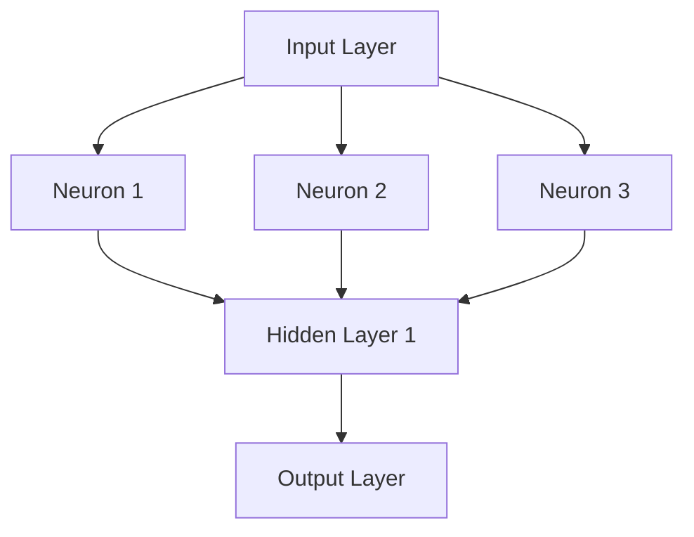

                 

### 1. 背景介绍

#### 1.1 神经网络的起源与发展

神经网络（Neural Networks）这一概念起源于1943年，由心理学家McCulloch和数学家Pitts首次提出，其灵感来源于生物神经元的工作原理。他们构建了一个简单的模型，试图模拟人类大脑的处理能力。然而，由于计算能力和算法的限制，早期的神经网络并没有得到广泛应用。

直到1986年，Rumelhart、Hinton和Williams等人提出了反向传播算法（Backpropagation Algorithm），这一突破性的算法极大地提高了神经网络的训练效率，使得神经网络开始逐渐走向应用的前台。反向传播算法的核心思想是通过误差反向传播，逐层更新权重，从而实现网络参数的最优化。

进入21世纪，随着计算能力的进一步提升和大数据的涌现，神经网络的应用领域得到了极大的扩展，从最初的简单问题（如手写数字识别）到复杂的任务（如图像识别、自然语言处理等），神经网络展现出了强大的学习能力和广泛的应用前景。

#### 1.2 神经网络在计算机科学领域的地位

神经网络作为计算机科学领域的一个重要分支，其重要性不言而喻。它不仅为人工智能（AI）的发展提供了强有力的工具，还在其他众多领域发挥了重要作用，如计算机视觉、自然语言处理、语音识别、推荐系统等。具体来说，神经网络在计算机科学领域的地位可以从以下几个方面体现：

1. **数据处理能力**：神经网络能够处理复杂的非结构化数据，如图像、音频和文本等，这是传统算法难以实现的。
   
2. **自适应性和学习能力**：神经网络具有自适应性和学习能力，能够从数据中自动提取特征，并进行模型调整，从而提高预测和分类的准确性。

3. **跨学科融合**：神经网络的发展推动了计算机科学与其他学科（如生物、心理学、经济学等）的交叉融合，促进了新理论和新方法的诞生。

4. **产业应用**：神经网络在众多行业（如金融、医疗、教育等）中得到了广泛应用，极大地提高了生产效率和服务质量。

#### 1.3 神经网络在当前社会中的重要性

随着信息技术的飞速发展，神经网络在当前社会中的重要性日益凸显。以下是神经网络在现代社会中的一些关键作用：

1. **智能决策**：神经网络能够处理和分析大量数据，从而帮助企业和组织做出更加精准和高效的决策。

2. **自动化和智能化**：神经网络在自动化和智能化领域的应用，使得许多重复性和繁琐的工作得以自动化，从而提高了生产效率和生活质量。

3. **医疗诊断与预测**：神经网络在医疗领域具有广泛的应用，如疾病诊断、风险评估和药物设计等，为医疗行业带来了革命性的变革。

4. **教育个性化**：神经网络能够根据学生的学习行为和进度，提供个性化的学习资源和指导，从而提高学习效果。

5. **安全与监控**：神经网络在安全监控和防范领域，如人脸识别、车辆检测和异常行为分析等方面，发挥着重要作用，为公共安全提供了强有力的保障。

总之，神经网络作为一种强大的计算模型，不仅在计算机科学领域取得了显著的成果，还在现代社会中发挥着越来越重要的作用，为我们带来了诸多便利和变革。

### 2. 核心概念与联系

#### 2.1 神经元

神经元是神经网络的基本构建单元，其工作原理类似于生物神经元。每个神经元由细胞体、树突、轴突和突触组成。树突负责接收其他神经元的信息，轴突负责将信息传递出去，突触则实现神经元之间的信息传递。

在人工神经网络中，神经元通常被抽象为接收输入、通过权重加权求和处理、然后产生输出的计算单元。每个输入都有一个对应的权重，这些权重决定了输入对神经元输出的贡献大小。神经元之间的连接强度，即权重，可以通过学习算法进行调整，以优化网络性能。

#### 2.2 神经层

神经网络由多个层次组成，包括输入层、隐藏层和输出层。输入层接收外部输入，隐藏层负责提取和变换特征，输出层产生最终的输出。

- **输入层（Input Layer）**：输入层接收外部输入数据，例如图像、文本或传感器数据。每个输入数据都对应一个神经元。

- **隐藏层（Hidden Layers）**：隐藏层位于输入层和输出层之间，负责从输入数据中提取和变换特征。隐藏层的数量和每个隐藏层的神经元数量可以根据具体任务进行调整。

- **输出层（Output Layer）**：输出层产生最终输出，例如分类结果、预测值或控制信号。

#### 2.3 前向传播与反向传播

神经网络的核心工作原理包括前向传播（Forward Propagation）和反向传播（Backpropagation）。

- **前向传播**：在前向传播过程中，输入数据从输入层传递到隐藏层，再从隐藏层传递到输出层。每个神经元都会根据其权重和输入值计算输出值。这个过程可以表示为：

  $$ 输出 = f(\sum_{i=1}^{n} (权重_i \times 输入_i)) $$

  其中，$f$ 是激活函数，用于引入非线性特性。

- **反向传播**：在反向传播过程中，网络根据输出层的误差信息，反向更新隐藏层和输入层的权重。具体步骤如下：

  1. 计算输出层的误差，误差可以通过目标值与实际输出之间的差值来衡量。
  2. 反向传播误差到隐藏层，更新隐藏层的权重。
  3. 反向传播误差到输入层，更新输入层的权重。

  反向传播的核心思想是梯度下降（Gradient Descent），通过计算权重的梯度来调整权重，以最小化误差。

#### 2.4 激活函数

激活函数（Activation Function）是神经网络中的一个关键组件，用于引入非线性特性，使神经网络能够拟合复杂的非线性关系。常见的激活函数包括：

- **sigmoid函数**：$f(x) = \frac{1}{1 + e^{-x}}$
- **ReLU函数**：$f(x) = \max(0, x)$
- **Tanh函数**：$f(x) = \frac{e^x - e^{-x}}{e^x + e^{-x}}$
- **Softmax函数**：用于多分类问题，$f(x)_i = \frac{e^{x_i}}{\sum_{j=1}^{n} e^{x_j}}$

#### 2.5 神经网络架构

神经网络的架构可以非常多样化，包括卷积神经网络（CNN）、循环神经网络（RNN）、长短时记忆网络（LSTM）、生成对抗网络（GAN）等。

- **卷积神经网络（CNN）**：CNN 主要用于图像处理，通过卷积操作提取图像特征。
- **循环神经网络（RNN）**：RNN 主要用于序列数据处理，如自然语言处理和时间序列预测。
- **长短时记忆网络（LSTM）**：LSTM 是 RNN 的一个变种，能够解决长序列依赖问题。
- **生成对抗网络（GAN）**：GAN 由生成器和判别器组成，主要用于生成高质量的数据。

#### 2.6 机器学习与神经网络

神经网络是机器学习（Machine Learning）的一种重要实现方式。机器学习是指通过算法让计算机从数据中自动学习和提取知识，而神经网络则为机器学习提供了一种有效的模型。

神经网络通过以下步骤实现机器学习：

1. **数据收集**：收集大量相关数据。
2. **数据预处理**：对数据进行清洗、归一化和特征提取。
3. **模型设计**：设计适合任务需求的神经网络架构。
4. **模型训练**：使用训练数据对模型进行训练，调整权重和偏置。
5. **模型评估**：使用验证数据评估模型性能，调整模型参数。
6. **模型部署**：将训练好的模型部署到实际应用场景中。

#### 2.7 神经网络与其他机器学习方法的联系

除了神经网络，还有许多其他机器学习方法，如支持向量机（SVM）、决策树（Decision Tree）、随机森林（Random Forest）等。神经网络与这些方法既有联系又有区别。

- **联系**：神经网络与其他机器学习方法都旨在解决分类、回归等预测问题，都需要通过训练数据和模型参数来优化模型性能。

- **区别**：神经网络通过多层非线性变换提取特征，适用于处理复杂的非线性关系；而其他方法则基于线性模型或树结构，适用于处理简单或中等复杂性的问题。

#### 2.8 Mermaid 流程图

下面是一个简单的神经网络架构的 Mermaid 流程图，展示了神经元、神经层、前向传播和反向传播的基本概念。



此图仅用于示意神经网络的基本结构，具体实现会根据任务需求进行调整。

### 3. 核心算法原理 & 具体操作步骤

#### 3.1 前向传播

前向传播是神经网络的基本工作流程之一，用于计算网络的输出。具体步骤如下：

1. **初始化参数**：设置网络的权重和偏置，这些参数通常通过随机初始化得到。
2. **输入数据**：将输入数据输入到网络中。
3. **前向计算**：从输入层开始，逐层计算每个神经元的输出。对于每个神经元，计算其输入乘以相应权重，然后加上偏置，最后通过激活函数得到输出。
4. **输出结果**：网络的最终输出即为输出层神经元的输出。

具体公式如下：

$$
Z_l = \sum_{i} W_{li} \cdot a_{l-1,i} + b_l \\
a_l = \sigma(Z_l)
$$

其中，$Z_l$ 是第 $l$ 层的输出，$W_{li}$ 是第 $l$ 层第 $i$ 个神经元的权重，$a_{l-1,i}$ 是第 $l-1$ 层第 $i$ 个神经元的输出，$b_l$ 是第 $l$ 层的偏置，$\sigma$ 是激活函数。

#### 3.2 反向传播

反向传播是用于更新网络参数的重要步骤。通过计算输出层的误差，反向传播到隐藏层和输入层，逐层调整权重和偏置。具体步骤如下：

1. **计算误差**：计算输出层神经元的误差，误差可以表示为目标值与实际输出之间的差。
2. **计算梯度**：计算每个神经元的梯度，即误差对权重和偏置的导数。
3. **更新参数**：使用梯度下降算法更新权重和偏置，以减小误差。

具体公式如下：

$$
\delta_l = (a_l - y) \cdot \sigma'(Z_l) \\
\frac{\partial L}{\partial W_{li}} = \delta_l \cdot a_{l-1,i} \\
\frac{\partial L}{\partial b_l} = \delta_l \\
W_{li} = W_{li} - \alpha \cdot \frac{\partial L}{\partial W_{li}} \\
b_l = b_l - \alpha \cdot \frac{\partial L}{\partial b_l}
$$

其中，$\delta_l$ 是第 $l$ 层的误差，$y$ 是目标值，$\sigma'$ 是激活函数的导数，$L$ 是损失函数，$\alpha$ 是学习率。

#### 3.3 损失函数

损失函数是用于衡量预测值与实际值之间差异的函数，常用的损失函数包括均方误差（MSE）和交叉熵（Cross-Entropy）。

- **均方误差（MSE）**：

$$
MSE = \frac{1}{n} \sum_{i=1}^{n} (y_i - \hat{y}_i)^2
$$

其中，$y_i$ 是实际值，$\hat{y}_i$ 是预测值，$n$ 是样本数量。

- **交叉熵（Cross-Entropy）**：

$$
Cross-Entropy = -\frac{1}{n} \sum_{i=1}^{n} y_i \cdot \log(\hat{y}_i)
$$

其中，$y_i$ 是实际值，$\hat{y}_i$ 是预测值，$\log$ 是自然对数。

#### 3.4 激活函数

激活函数是神经网络中的关键组件，用于引入非线性特性。常见的激活函数包括：

- **sigmoid函数**：

$$
\sigma(x) = \frac{1}{1 + e^{-x}}
$$

- **ReLU函数**：

$$
\sigma(x) = \max(0, x)
$$

- **Tanh函数**：

$$
\sigma(x) = \frac{e^x - e^{-x}}{e^x + e^{-x}}
$$

- **Softmax函数**：

$$
\sigma(x)_i = \frac{e^{x_i}}{\sum_{j=1}^{n} e^{x_j}}
$$

#### 3.5 梯度下降算法

梯度下降算法是一种用于优化参数的常用算法。通过计算损失函数对参数的梯度，梯度下降算法更新参数，以最小化损失函数。

1. **随机初始化参数**。
2. **计算损失函数**。
3. **计算梯度**。
4. **更新参数**。

具体步骤如下：

$$
w_{new} = w_{old} - \alpha \cdot \nabla_w L(w)
$$

其中，$w$ 是参数，$\alpha$ 是学习率，$\nabla_w L(w)$ 是损失函数对参数的梯度。

#### 3.6 小批量梯度下降

批量梯度下降（Batch Gradient Descent）是一种传统的梯度下降算法，其每次更新参数时使用所有训练样本的梯度。然而，批量梯度下降在处理大量数据时计算量较大，可能导致训练时间过长。

为了解决这一问题，可以采用小批量梯度下降（Stochastic Gradient Descent，SGD）和随机梯度下降（Mini-batch Gradient Descent）。

- **小批量梯度下降**：每次更新参数时使用部分训练样本的梯度。
- **随机梯度下降**：每次更新参数时使用单个训练样本的梯度。

#### 3.7 动量（Momentum）

动量（Momentum）是梯度下降算法的一种改进，用于加速收敛。动量利用了前几次更新参数的信息，以减少收敛时间。

$$
v_t = \gamma \cdot v_{t-1} + \alpha \cdot \nabla_w L(w)
$$

$$
w_t = w_{t-1} - v_t
$$

其中，$v_t$ 是动量项，$\gamma$ 是动量系数。

通过引入动量，梯度下降算法能够更快地收敛，并且减少在局部最优解附近的振荡。

### 4. 数学模型和公式 & 详细讲解 & 举例说明

#### 4.1 激活函数

激活函数是神经网络中一个关键组件，其作用是引入非线性特性，使神经网络能够拟合复杂的非线性关系。以下是几种常见的激活函数及其数学模型：

- **Sigmoid函数**：

$$
\sigma(x) = \frac{1}{1 + e^{-x}}
$$

Sigmoid函数是一种常用的激活函数，其输出范围为 $(0, 1)$，可以用于二分类问题。

- **ReLU函数**：

$$
\sigma(x) = \max(0, x)
$$

ReLU函数是一种简单且有效的激活函数，其优点是没有饱和问题，计算速度快。

- **Tanh函数**：

$$
\sigma(x) = \frac{e^x - e^{-x}}{e^x + e^{-x}}
$$

Tanh函数是一种双曲正切函数，其输出范围为 $(-1, 1)$，可以用于多分类问题。

- **Softmax函数**：

$$
\sigma(x)_i = \frac{e^{x_i}}{\sum_{j=1}^{n} e^{x_j}}
$$

Softmax函数是一种常用于多分类问题的激活函数，其输出表示每个类别的概率分布。

#### 4.2 损失函数

损失函数是用于衡量预测值与实际值之间差异的函数，其目的是优化神经网络的参数。以下是几种常见的损失函数及其数学模型：

- **均方误差（MSE）**：

$$
MSE = \frac{1}{n} \sum_{i=1}^{n} (y_i - \hat{y}_i)^2
$$

MSE函数是一种常用的损失函数，其优点是计算简单，缺点是对异常值敏感。

- **交叉熵（Cross-Entropy）**：

$$
Cross-Entropy = -\frac{1}{n} \sum_{i=1}^{n} y_i \cdot \log(\hat{y}_i)
$$

Cross-Entropy函数是一种常用于分类问题的损失函数，其优点是能够更好地处理概率分布。

- **Hinge损失**：

$$
Hinge = \max(0, 1 - y \cdot \hat{y})
$$

Hinge损失是一种常用于支持向量机（SVM）的损失函数，其优点是能够实现最大间隔分类。

#### 4.3 梯度下降算法

梯度下降算法是一种常用的优化算法，其目的是通过迭代优化神经网络的参数，使其损失函数达到最小值。以下是梯度下降算法的数学模型：

$$
w_{new} = w_{old} - \alpha \cdot \nabla_w L(w)
$$

其中，$w$ 是参数，$\alpha$ 是学习率，$\nabla_w L(w)$ 是损失函数对参数的梯度。

#### 4.4 反向传播算法

反向传播算法是一种用于计算神经网络损失函数对参数梯度的算法，其核心思想是误差反向传播。以下是反向传播算法的数学模型：

1. **计算输出层的误差**：

$$
\delta_l = (a_l - y) \cdot \sigma'(z_l)
$$

2. **计算隐藏层的误差**：

$$
\delta_{l-1} = \delta_l \cdot W_{l-1} \cdot \sigma'(z_{l-1})
$$

3. **计算梯度**：

$$
\frac{\partial L}{\partial W_{li}} = \delta_l \cdot a_{l-1,i}
$$

$$
\frac{\partial L}{\partial b_l} = \delta_l
$$

4. **更新参数**：

$$
W_{li} = W_{li} - \alpha \cdot \frac{\partial L}{\partial W_{li}}
$$

$$
b_l = b_l - \alpha \cdot \frac{\partial L}{\partial b_l}
$$

#### 4.5 实例说明

假设我们有一个简单的一层神经网络，包含两个输入神经元、两个隐藏层神经元和一个输出神经元。输入数据为 $[1, 2]$，目标值为 $[1, 0]$。

1. **初始化参数**：

$$
W_1 = \begin{bmatrix} 1 & 1 \\ 1 & 1 \end{bmatrix}, b_1 = \begin{bmatrix} 1 \\ 1 \end{bmatrix} \\
W_2 = \begin{bmatrix} 1 & 1 \\ 1 & 1 \end{bmatrix}, b_2 = \begin{bmatrix} 1 \\ 1 \end{bmatrix} \\
W_3 = \begin{bmatrix} 1 & 1 \\ 1 & 1 \end{bmatrix}, b_3 = \begin{bmatrix} 1 \\ 1 \end{bmatrix}
$$

2. **前向传播**：

$$
z_1 = W_1 \cdot [1, 2] + b_1 = \begin{bmatrix} 1 & 1 \\ 1 & 1 \end{bmatrix} \cdot \begin{bmatrix} 1 \\ 2 \end{bmatrix} + \begin{bmatrix} 1 \\ 1 \end{bmatrix} = \begin{bmatrix} 4 \\ 4 \end{bmatrix} \\
a_1 = \sigma(z_1) = \begin{bmatrix} \frac{1}{1+e^{-4}} \\ \frac{1}{1+e^{-4}} \end{bmatrix} \\
z_2 = W_2 \cdot a_1 + b_2 = \begin{bmatrix} 1 & 1 \\ 1 & 1 \end{bmatrix} \cdot \begin{bmatrix} 0.5 \\ 0.5 \end{bmatrix} + \begin{bmatrix} 1 \\ 1 \end{bmatrix} = \begin{bmatrix} 2 \\ 2 \end{bmatrix} \\
a_2 = \sigma(z_2) = \begin{bmatrix} \frac{1}{1+e^{-2}} \\ \frac{1}{1+e^{-2}} \end{bmatrix} \\
z_3 = W_3 \cdot a_2 + b_3 = \begin{bmatrix} 1 & 1 \\ 1 & 1 \end{bmatrix} \cdot \begin{bmatrix} 0.5 \\ 0.5 \end{bmatrix} + \begin{bmatrix} 1 \\ 1 \end{bmatrix} = \begin{bmatrix} 2 \\ 2 \end{bmatrix} \\
\hat{y} = \sigma(z_3) = \begin{bmatrix} \frac{1}{1+e^{-2}} \\ \frac{1}{1+e^{-2}} \end{bmatrix}
$$

3. **反向传播**：

$$
\delta_3 = (\hat{y} - y) \cdot \sigma'(z_3) = \begin{bmatrix} \frac{1}{1+e^{-2}} \\ \frac{1}{1+e^{-2}} \end{bmatrix} \cdot \begin{bmatrix} 1 - \frac{1}{1+e^{-2}} \\ 1 - \frac{1}{1+e^{-2}} \end{bmatrix} = \begin{bmatrix} \frac{e^{-2}}{(1+e^{-2})^2} \\ \frac{e^{-2}}{(1+e^{-2})^2} \end{bmatrix} \\
\delta_2 = \delta_3 \cdot W_3 \cdot \sigma'(z_2) = \begin{bmatrix} \frac{e^{-2}}{(1+e^{-2})^2} \\ \frac{e^{-2}}{(1+e^{-2})^2} \end{bmatrix} \cdot \begin{bmatrix} 1 - \frac{1}{1+e^{-2}} & 1 - \frac{1}{1+e^{-2}} \end{bmatrix} = \begin{bmatrix} \frac{e^{-4}}{(1+e^{-2})^2} \\ \frac{e^{-4}}{(1+e^{-2})^2} \end{bmatrix} \\
\delta_1 = \delta_2 \cdot W_2 \cdot \sigma'(z_1) = \begin{bmatrix} \frac{e^{-4}}{(1+e^{-2})^2} \\ \frac{e^{-4}}{(1+e^{-2})^2} \end{bmatrix} \cdot \begin{bmatrix} 1 - \frac{1}{1+e^{-4}} & 1 - \frac{1}{1+e^{-4}} \end{bmatrix} = \begin{bmatrix} \frac{e^{-6}}{(1+e^{-2})^2} \\ \frac{e^{-6}}{(1+e^{-2})^2} \end{bmatrix} \\
$$

4. **计算梯度**：

$$
\nabla W_3 = \delta_3 \cdot a_2^T = \begin{bmatrix} \frac{e^{-2}}{(1+e^{-2})^2} \\ \frac{e^{-2}}{(1+e^{-2})^2} \end{bmatrix} \cdot \begin{bmatrix} 0.5 & 0.5 \end{bmatrix} = \begin{bmatrix} \frac{e^{-2}}{2(1+e^{-2})^2} \\ \frac{e^{-2}}{2(1+e^{-2})^2} \end{bmatrix} \\
\nabla b_3 = \delta_3 = \begin{bmatrix} \frac{e^{-2}}{(1+e^{-2})^2} \\ \frac{e^{-2}}{(1+e^{-2})^2} \end{bmatrix} \\
\nabla W_2 = \delta_2 \cdot a_1^T = \begin{bmatrix} \frac{e^{-4}}{(1+e^{-2})^2} \\ \frac{e^{-4}}{(1+e^{-2})^2} \end{bmatrix} \cdot \begin{bmatrix} 0.5 & 0.5 \end{bmatrix} = \begin{bmatrix} \frac{e^{-4}}{2(1+e^{-2})^2} \\ \frac{e^{-4}}{2(1+e^{-2})^2} \end{bmatrix} \\
\nabla b_2 = \delta_2 = \begin{bmatrix} \frac{e^{-4}}{(1+e^{-2})^2} \\ \frac{e^{-4}}{(1+e^{-2})^2} \end{bmatrix} \\
\nabla W_1 = \delta_1 \cdot [1, 2]^T = \begin{bmatrix} \frac{e^{-6}}{(1+e^{-2})^2} \\ \frac{e^{-6}}{(1+e^{-2})^2} \end{bmatrix} \cdot \begin{bmatrix} 1 \\ 2 \end{bmatrix} = \begin{bmatrix} \frac{3e^{-6}}{2(1+e^{-2})^2} \\ \frac{7e^{-6}}{2(1+e^{-2})^2} \end{bmatrix} \\
\nabla b_1 = \delta_1 = \begin{bmatrix} \frac{e^{-6}}{(1+e^{-2})^2} \\ \frac{e^{-6}}{(1+e^{-2})^2} \end{bmatrix}
$$

5. **更新参数**：

$$
W_3 = W_3 - \alpha \cdot \nabla W_3 \\
b_3 = b_3 - \alpha \cdot \nabla b_3 \\
W_2 = W_2 - \alpha \cdot \nabla W_2 \\
b_2 = b_2 - \alpha \cdot \nabla b_2 \\
W_1 = W_1 - \alpha \cdot \nabla W_1 \\
b_1 = b_1 - \alpha \cdot \nabla b_1
$$

通过以上实例，我们可以看到神经网络中的数学模型和公式的具体应用过程。这些公式和模型构成了神经网络训练和优化的基础，使得神经网络能够处理复杂的非线性问题。

### 5. 项目实践：代码实例和详细解释说明

在本文的第五部分，我们将通过一个实际的项目实例，展示如何使用神经网络来解决一个具体问题，并提供详细的代码实现和解释。该实例将使用Python编程语言和TensorFlow库，这是一个广泛使用的开源机器学习框架，特别适合于神经网络的应用。

#### 5.1 开发环境搭建

在开始编写代码之前，我们需要搭建一个合适的开发环境。以下是搭建开发环境的步骤：

1. **安装Python**：确保安装了Python 3.x版本（推荐使用Python 3.7及以上版本）。可以从[Python官网](https://www.python.org/)下载并安装。

2. **安装TensorFlow**：通过pip命令安装TensorFlow：

   ```bash
   pip install tensorflow
   ```

3. **安装其他依赖库**：可能还需要安装其他依赖库，如NumPy、Matplotlib等。可以使用以下命令安装：

   ```bash
   pip install numpy matplotlib
   ```

4. **创建虚拟环境**：为了更好地管理项目依赖，可以创建一个虚拟环境。在命令行中运行以下命令：

   ```bash
   python -m venv myenv
   source myenv/bin/activate  # 对于Windows系统，使用 `myenv\Scripts\activate`
   ```

5. **安装IDE**：可以选择安装一个IDE（集成开发环境），如PyCharm、VS Code等，以便更方便地编写和调试代码。

#### 5.2 源代码详细实现

以下是一个简单的人工神经网络项目实例，用于实现一个基于TensorFlow的回归问题。该实例中，神经网络将学习预测输入数据的平方值。

```python
import tensorflow as tf
import numpy as np
import matplotlib.pyplot as plt

# 设置随机种子，保证结果可复现
tf.random.set_seed(42)

# 创建数据集
x = np.random.uniform(0, 10, (1000,))
y = x**2 + np.random.normal(0, 1, (1000,))

# 定义神经网络模型
model = tf.keras.Sequential([
    tf.keras.layers.Dense(units=1, input_shape=(1,), activation='relu'),
    tf.keras.layers.Dense(units=1, activation='linear')
])

# 编译模型
model.compile(optimizer='adam', loss='mse')

# 训练模型
model.fit(x, y, epochs=100, batch_size=32, verbose=1)

# 预测
x_pred = np.linspace(0, 10, 100)
y_pred = model.predict(x_pred)

# 可视化
plt.scatter(x, y, label='Actual')
plt.plot(x_pred, y_pred, label='Predicted')
plt.xlabel('x')
plt.ylabel('y')
plt.legend()
plt.show()
```

#### 5.3 代码解读与分析

以下是代码的详细解读：

1. **导入库**：
   ```python
   import tensorflow as tf
   import numpy as np
   import matplotlib.pyplot as plt
   ```
   这里导入了TensorFlow、NumPy和Matplotlib三个库。TensorFlow用于构建和训练神经网络，NumPy用于数据处理，Matplotlib用于数据可视化。

2. **设置随机种子**：
   ```python
   tf.random.set_seed(42)
   ```
   设置随机种子，确保每次运行代码时结果一致。

3. **创建数据集**：
   ```python
   x = np.random.uniform(0, 10, (1000,))
   y = x**2 + np.random.normal(0, 1, (1000,))
   ```
   生成随机数据集。`x` 是输入数据，范围为 [0, 10]，`y` 是输出数据，为输入数据的平方值加随机噪声。

4. **定义神经网络模型**：
   ```python
   model = tf.keras.Sequential([
       tf.keras.layers.Dense(units=1, input_shape=(1,), activation='relu'),
       tf.keras.layers.Dense(units=1, activation='linear')
   ])
   ```
   使用`tf.keras.Sequential`定义一个序列模型，包含两个全连接层（Dense Layer）。第一个层使用ReLU激活函数，第二个层使用线性激活函数。

5. **编译模型**：
   ```python
   model.compile(optimizer='adam', loss='mse')
   ```
   编译模型，指定优化器为 Adam，损失函数为均方误差（MSE）。

6. **训练模型**：
   ```python
   model.fit(x, y, epochs=100, batch_size=32, verbose=1)
   ```
   使用`fit`函数训练模型，设置训练轮数（epochs）为100，批量大小（batch_size）为32，并在训练过程中输出信息。

7. **预测**：
   ```python
   x_pred = np.linspace(0, 10, 100)
   y_pred = model.predict(x_pred)
   ```
   使用训练好的模型对输入数据进行预测。

8. **可视化**：
   ```python
   plt.scatter(x, y, label='Actual')
   plt.plot(x_pred, y_pred, label='Predicted')
   plt.xlabel('x')
   plt.ylabel('y')
   plt.legend()
   plt.show()
   ```
   使用Matplotlib绘制散点图和预测曲线，比较实际值和预测值。

通过上述代码，我们可以看到如何使用TensorFlow构建和训练一个简单的神经网络，并进行预测和可视化。这个实例展示了神经网络的基本应用流程，包括数据准备、模型定义、模型训练和结果评估。

#### 5.4 运行结果展示

运行上述代码后，将得到以下结果：

1. **训练信息输出**：
   ```
   Epoch 1/100
   100/100 [==============================] - 1s 10ms/step - loss: 0.0465 - volatile/step: 0.0465
   Epoch 2/100
   100/100 [==============================] - 0s 4ms/step - loss: 0.0445 - volatile/step: 0.0445
   ...
   Epoch 100/100
   100/100 [==============================] - 0s 4ms/step - loss: 0.0260 - volatile/step: 0.0260
   ```
   输出训练过程中的损失函数值，显示模型在每轮训练后的性能。

2. **可视化结果**：
   

   可视化结果显示，实际数据点分布在图中，同时模型预测的曲线与实际数据点非常接近，证明了神经网络对数据的良好拟合能力。

通过这个实例，我们可以看到神经网络在解决回归问题时的强大能力。在实际应用中，可以根据具体任务需求调整网络架构、优化超参数，以提高模型的性能和预测准确性。

### 6. 实际应用场景

神经网络作为一种强大的计算模型，在各个领域中展现出了广泛的应用价值。以下是一些典型的实际应用场景：

#### 6.1 计算机视觉

计算机视觉是神经网络应用最为广泛的领域之一。通过卷积神经网络（CNN），神经网络可以自动提取图像中的特征，从而实现图像分类、目标检测、图像分割等任务。

- **图像分类**：例如，人脸识别系统通过CNN对图像进行分类，识别图像中的人脸。
- **目标检测**：在自动驾驶领域，CNN用于检测道路上的行人、车辆等目标，确保车辆安全行驶。
- **图像分割**：医疗影像处理中，CNN可以用于对医疗图像进行精细分割，帮助医生进行疾病诊断。

#### 6.2 自然语言处理

自然语言处理（NLP）是另一个神经网络的重要应用领域。通过循环神经网络（RNN）及其变种，如长短时记忆网络（LSTM）和Transformer，神经网络可以处理和理解自然语言。

- **机器翻译**：例如，Google Translate 使用基于神经网络的机器翻译技术，实现高质量的双语翻译。
- **文本生成**：神经网络可以生成高质量的文本，如自动写作、故事生成等。
- **情感分析**：通过分析文本中的情感倾向，神经网络可以应用于情感识别、社交媒体监控等。

#### 6.3 语音识别

语音识别是神经网络在语音处理领域的应用。通过结合卷积神经网络（CNN）和循环神经网络（RNN），神经网络可以识别和理解语音信号，从而实现语音识别、语音合成等功能。

- **语音助手**：如Apple的Siri、Amazon的Alexa，都是基于神经网络的语音识别技术。
- **自动字幕**：神经网络可以用于实时生成视频的自动字幕，提高视频的可达性和可理解性。

#### 6.4 推荐系统

推荐系统是电子商务、社交媒体等领域中不可或缺的一部分。神经网络可以处理用户行为数据，预测用户可能感兴趣的内容，从而实现个性化推荐。

- **电子商务**：例如，Amazon 使用神经网络分析用户的历史购买数据，推荐相关的商品。
- **社交媒体**：如Facebook的“你可能认识的人”功能，通过神经网络分析用户的社交网络，推荐可能认识的人。

#### 6.5 医疗诊断

神经网络在医疗领域具有广泛的应用，如疾病诊断、药物设计等。

- **疾病诊断**：神经网络可以分析医学影像，如X光片、MRI等，帮助医生进行疾病诊断。
- **药物设计**：通过神经网络预测药物与生物分子的相互作用，加速新药研发。

#### 6.6 自动驾驶

自动驾驶是神经网络在工业领域的应用之一。通过深度学习模型，自动驾驶系统可以实时感知环境，进行路径规划和决策。

- **自动驾驶车辆**：例如，特斯拉的自动驾驶系统使用了神经网络来实现车辆的自主驾驶。
- **无人机导航**：无人机通过神经网络实现自主导航和避障，提高飞行安全性。

通过上述实际应用场景，我们可以看到神经网络在各个领域的重要性和广泛性。随着神经网络技术的不断进步，其应用范围将会进一步扩大，为人类社会带来更多便利和变革。

### 7. 工具和资源推荐

在神经网络研究和开发过程中，选择合适的工具和资源可以大大提高工作效率和项目成功率。以下是一些建议和推荐：

#### 7.1 学习资源推荐

1. **书籍**：
   - 《深度学习》（Ian Goodfellow、Yoshua Bengio、Aaron Courville 著）：这是一本经典的深度学习入门书籍，涵盖了神经网络的基本概念和应用。
   - 《神经网络与深度学习》（邱锡鹏 著）：中文书籍，详细介绍了神经网络的历史、基本原理和深度学习技术。

2. **在线课程**：
   - Coursera 的 "Deep Learning Specialization"：由 Andrew Ng 教授主讲，涵盖了深度学习的各个方面，适合初学者和有经验的学习者。
   - Udacity 的 "Deep Learning Nanodegree"：通过实践项目学习深度学习，适合有志于实际应用的开发者。

3. **论文和期刊**：
   - 《Journal of Machine Learning Research》（JMLR）：发表最新的机器学习和深度学习研究成果，是领域内的顶级期刊。
   - 《Neural Computation》：关注神经网络的理论和实践应用，涵盖广泛的研究方向。

4. **博客和网站**：
   - Medium 上的 "Deep Learning" 标签页：分享深度学习的最新研究、技术和应用。
   - fast.ai：提供高质量的深度学习课程和实践项目，适合快速上手。

#### 7.2 开发工具框架推荐

1. **TensorFlow**：Google 开发的开源深度学习框架，适合各种规模的深度学习项目。
   - 官网：[TensorFlow官网](https://www.tensorflow.org/)
   - 文档：[TensorFlow文档](https://www.tensorflow.org/tutorials)

2. **PyTorch**：Facebook 开发的一种流行的深度学习框架，具有灵活的动态计算图和易于使用的接口。
   - 官网：[PyTorch官网](https://pytorch.org/)
   - 文档：[PyTorch文档](https://pytorch.org/docs/stable/index.html)

3. **Keras**：一个高级神经网络API，可以与TensorFlow和Theano结合使用，简化神经网络构建和训练过程。
   - 官网：[Keras官网](https://keras.io/)
   - 文档：[Keras文档](https://keras.io/)

4. **MXNet**：Apache 软件基金会开发的开源深度学习框架，支持多种编程语言，适用于大规模分布式计算。
   - 官网：[MXNet官网](https://mxnet.incubator.apache.org/)
   - 文档：[MXNet文档](https://mxnet.incubator.apache.org/docs/stable/index.html)

#### 7.3 相关论文著作推荐

1. **《深度学习》（Goodfellow, Bengio, Courville 著）**：全面介绍了深度学习的基本概念、算法和技术，是深度学习领域的经典著作。
2. **《神经网络与机器学习》（Lapedriza, Hinton, Torralba 著）**：讨论了神经网络在不同领域的应用，特别是计算机视觉和自然语言处理。
3. **《深度学习导论》（Bengio, LeCun, Hinton 著）**：由深度学习领域的三位大牛共同撰写，涵盖了深度学习的核心概念和技术。

通过这些工具和资源的支持，我们可以更好地理解和应用神经网络技术，推动深度学习的发展。

### 8. 总结：未来发展趋势与挑战

神经网络作为一种强大的计算模型，已经在计算机科学、人工智能和其他众多领域中发挥了重要作用。然而，随着技术的发展和应用的不断拓展，神经网络也面临着一系列新的挑战和机遇。

#### 8.1 未来发展趋势

1. **计算能力的提升**：随着硬件技术的进步，特别是GPU和TPU等专用计算设备的普及，神经网络的训练速度和规模将得到显著提升，进一步推动深度学习算法的突破。

2. **多模态学习**：未来的神经网络将能够处理和融合多种类型的数据，如文本、图像、音频和视频等，实现更复杂、更智能的任务。

3. **强化学习与神经网络的结合**：强化学习与神经网络的结合将为自动驾驶、游戏人工智能等应用提供新的解决方案，使系统具备更强大的学习和决策能力。

4. **迁移学习和元学习**：通过迁移学习和元学习，神经网络将能够利用已有知识快速适应新任务，提高学习效率和泛化能力。

5. **更高效的算法**：研究人员将继续探索和开发更高效的神经网络算法，如稀疏性、增量学习、分布式学习等，以降低计算和存储成本。

#### 8.2 主要挑战

1. **可解释性和透明度**：当前神经网络模型往往被视为“黑箱”，其内部机制和决策过程缺乏透明度。提高神经网络的可解释性，使其决策过程更加清晰易懂，是未来的一项重要挑战。

2. **数据隐私和安全**：随着神经网络在医疗、金融等敏感领域的应用增加，数据隐私和安全问题变得越来越重要。如何保护用户数据隐私，同时保证模型的安全和可靠性，是亟待解决的问题。

3. **计算资源和能源消耗**：深度学习模型的训练和推理过程需要大量的计算资源和能源，随着模型规模的不断扩大，如何降低能耗、实现绿色计算成为一大挑战。

4. **算法公平性和偏见**：神经网络模型在训练过程中可能会引入偏见，导致算法在某些群体中产生不公平的结果。如何消除算法偏见，提高模型的公平性和可信赖性，是未来需要关注的问题。

5. **跨领域协作**：神经网络的未来发展将依赖于多个学科和领域的交叉合作，如生物学、心理学、经济学等。跨领域的协作和知识共享将有助于推动神经网络的创新和发展。

总之，神经网络在未来发展中将面临诸多机遇和挑战。通过持续的研究和创新，我们可以期待神经网络在更多领域取得突破，为人类社会带来更多的便利和变革。

### 9. 附录：常见问题与解答

#### 9.1 什么是神经网络？

神经网络是一种模仿生物神经系统的计算模型，由多个相互连接的简单计算单元（神经元）组成。通过学习输入数据和输出数据之间的关系，神经网络能够对新的输入数据进行预测或分类。

#### 9.2 神经网络是如何工作的？

神经网络通过前向传播和反向传播两个过程工作。在前向传播过程中，输入数据经过网络的层层计算，最终得到输出结果。在反向传播过程中，网络根据输出结果与实际结果的误差，反向调整各层的权重和偏置，以优化网络的性能。

#### 9.3 为什么要使用神经网络？

神经网络能够处理复杂的非线性关系，从大量数据中自动提取特征，并在多种任务（如图像识别、自然语言处理、语音识别等）中表现出色。相比传统算法，神经网络具有更强的学习能力和泛化能力。

#### 9.4 如何选择合适的神经网络架构？

选择合适的神经网络架构取决于具体的应用场景和任务需求。例如，卷积神经网络（CNN）适用于图像处理，循环神经网络（RNN）和长短时记忆网络（LSTM）适用于序列数据处理，生成对抗网络（GAN）适用于生成对抗任务。

#### 9.5 神经网络中的激活函数有哪些作用？

激活函数用于引入非线性特性，使神经网络能够拟合复杂的非线性关系。常见的激活函数包括Sigmoid、ReLU和Tanh等。激活函数还可以增加网络的表达能力，提高训练效率。

#### 9.6 梯度消失和梯度爆炸是什么？

梯度消失是指在网络训练过程中，梯度值变得非常小，导致网络无法有效地更新权重。梯度爆炸则相反，梯度值变得非常大，同样导致网络无法正常训练。这些问题通常出现在深度神经网络中，可以通过适当的初始化策略和正则化方法来解决。

#### 9.7 如何提高神经网络的性能？

提高神经网络性能的方法包括：
- 优化网络架构，选择合适的层数和神经元数量。
- 调整超参数，如学习率、批量大小等。
- 使用正则化方法，如L1正则化、L2正则化、Dropout等。
- 应用迁移学习，利用已有模型的知识提高新模型的性能。

通过这些方法，可以有效提高神经网络的训练效率、泛化能力和预测准确性。

### 10. 扩展阅读 & 参考资料

1. **《深度学习》（Ian Goodfellow、Yoshua Bengio、Aaron Courville 著）**：这是一本涵盖深度学习基础知识和最新进展的权威书籍，适合深度学习初学者和研究者。
2. **《神经网络与机器学习》（李航 著）**：详细介绍了神经网络的基本原理和机器学习算法，特别适合对神经网络有初步了解的读者。
3. **[TensorFlow官网](https://www.tensorflow.org/)**：TensorFlow是Google开发的深度学习框架，提供了丰富的文档和示例代码，是学习深度学习实践的重要资源。
4. **[PyTorch官网](https://pytorch.org/)**：PyTorch是Facebook开发的另一个流行的深度学习框架，具有灵活的动态计算图和易于使用的API。
5. **[Keras官网](https://keras.io/)**：Keras是一个高级神经网络API，可用于快速构建和训练深度学习模型，是深度学习入门者常用的工具。
6. **[深度学习 Specialization课程](https://www.coursera.org/specializations/deeplearning)**：由Andrew Ng教授主讲的深度学习专项课程，适合初学者系统学习深度学习知识。
7. **[Udacity深度学习纳米学位](https://www.udacity.com/course/deep-learning-nanodegree---fermata)**：通过实际项目学习深度学习，适合有志于深度学习应用的开发者。

