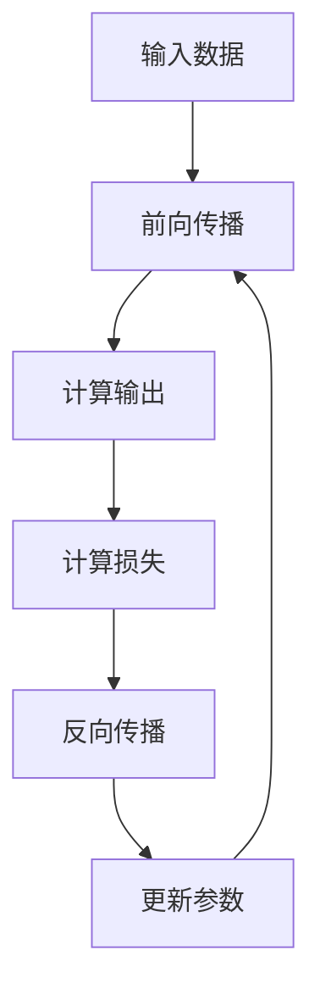
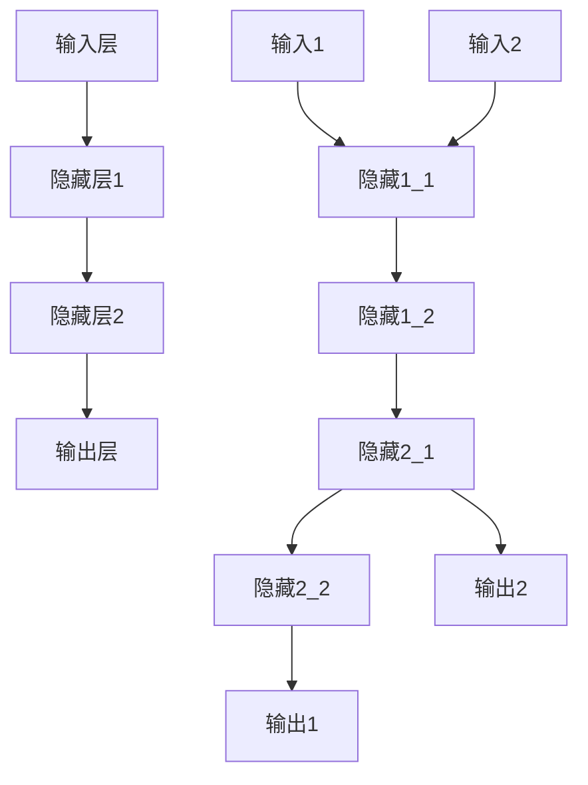
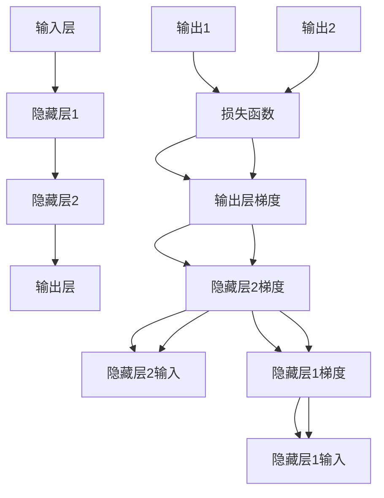

                 

### 背景介绍

神经网络，作为人工智能领域的重要基石，是现代计算机科学中的关键技术之一。其历史可以追溯到20世纪40年代，尽管经历了多次起伏，但近年来，随着计算能力的提升和大数据的涌现，神经网络的研究与应用得到了前所未有的关注和快速发展。

**1. 神经网络的起源与发展**

神经网络的灵感来源于人类大脑的神经元结构和工作方式。最早的神经网络模型是1943年由沃伦·麦卡洛克（Warren McCulloch）和沃尔特·皮茨（Walter Pitts）提出的MCP（McCulloch-Pitts）神经网络，这是一个理想的化简神经元模型，奠定了神经网络理论的基础。随后，1958年由弗兰克·罗森布拉特（Frank Rosenblatt）提出的感知机（Perceptron）模型，则是第一个能够学习和识别模式的神经网络模型。

然而，早期的神经网络研究因为理论局限和计算资源的限制，并未得到广泛应用。直到20世纪80年代，反向传播算法（Backpropagation Algorithm）的提出，使得多层神经网络的训练成为可能，神经网络的研究和应用才得以迅速发展。

**2. 神经网络在现代计算机科学中的应用**

神经网络在计算机科学中的应用十分广泛，包括但不限于以下领域：

- **计算机视觉**：神经网络在图像识别、目标检测、图像生成等方面有着显著的应用效果。例如，卷积神经网络（CNN）在ImageNet图像识别竞赛中取得了惊人的成绩。
- **自然语言处理**：神经网络在自然语言理解、机器翻译、语音识别等方面有着广泛的应用。例如，循环神经网络（RNN）和长短期记忆网络（LSTM）在序列数据处理方面表现出色。
- **游戏与决策**：神经网络在游戏AI、推荐系统、自动驾驶等领域有着重要的应用。例如，深度强化学习在围棋、国际象棋等游戏中的表现已超越人类。

**3. 当前研究热点与趋势**

随着技术的进步，神经网络的研究热点和趋势也在不断变化。目前，以下几个方面的研究备受关注：

- **深度学习**：多层神经网络的进一步发展，包括残差网络（ResNet）、注意力机制（Attention Mechanism）等，这些模型在图像识别、语音识别等领域取得了显著突破。
- **迁移学习**：通过利用已有的神经网络模型来加速新任务的训练，尤其在资源受限的环境中具有重要作用。
- **生成对抗网络（GAN）**：GAN是一种通过对抗训练生成数据的新方法，广泛应用于图像生成、数据增强等领域。
- **神经架构搜索（NAS）**：自动搜索最优的神经网络结构，减少人工设计的工作量，提高模型性能。

**4. 神经网络的研究意义**

神经网络的研究不仅对计算机科学有着深远的影响，也对人类社会的发展具有重要意义。它推动了人工智能技术的发展，使得机器能够更好地理解、学习、推理和决策。此外，神经网络的应用在医疗、金融、工业、教育等多个领域都有广泛的前景，有望带来巨大的社会和经济价值。

总之，神经网络作为人工智能的重要组成部分，其研究和发展正处于一个蓬勃发展的阶段。通过本文，我们将深入探讨神经网络的核心概念、算法原理、数学模型及其在实际应用中的具体实例，以期更好地理解和利用这一强大的技术。接下来，我们将逐步解析神经网络的定义、基本组成部分以及工作原理，为后续的深入探讨打下坚实的基础。

### 核心概念与联系

神经网络（Neural Network，简称NN）是由大量相互连接的神经元组成的计算模型，这些神经元模拟了人脑神经元的结构和功能。要深入理解神经网络，我们需要首先明确几个核心概念：神经元、网络结构、激活函数和训练过程。

**1. 神经元**

神经元是神经网络的基本组成单元，类似于人脑中的神经细胞。一个典型的神经元由三个主要部分组成：输入层、权重和偏置、输出层。输入层接收外部输入信号，通过权重与前一层的神经元相连，并通过偏置进行调整，最后通过激活函数产生输出。这个输出可以传递给下一层的神经元，或者作为最终的结果。


在神经元中，输入和权重通过加权求和产生总和，然后加上偏置，通过激活函数进行转换，得到神经元的输出。激活函数是神经网络的核心组成部分，用于引入非线性特性，使得神经网络能够处理复杂的非线性问题。

**2. 网络结构**

神经网络的结构决定了其学习和处理信息的能力。一个基本的神经网络通常包括以下几个层次：

- **输入层（Input Layer）**：接收外部输入数据，并将其传递给下一层。
- **隐藏层（Hidden Layers）**：一个或多个隐藏层，用于提取特征和进行计算。每一层都会对输入数据进行处理，并生成新的特征。
- **输出层（Output Layer）**：产生最终输出结果，根据任务的类型可以是分类结果、数值预测等。


不同层次的神经元通过权重相互连接，形成一个复杂的网络结构。神经元的连接方式（全连接、卷积连接等）和层次结构（多层感知机、卷积神经网络等）对神经网络的学习能力和应用范围有重要影响。

**3. 激活函数**

激活函数是神经网络中的非线性转换函数，用于引入非线性特性，使得神经网络能够处理复杂的非线性问题。常见的激活函数包括：

- **Sigmoid函数**：将输入值压缩到(0, 1)之间，具有平滑的S型曲线。
  $$ f(x) = \frac{1}{1 + e^{-x}} $$
- **ReLU函数（Rectified Linear Unit）**：在输入小于0时输出0，在输入大于等于0时输出输入值，具有简单和高效的特点。
  $$ f(x) = \max(0, x) $$
- **Tanh函数**：将输入值压缩到(-1, 1)之间，具有对称的S型曲线。
  $$ f(x) = \frac{e^x - e^{-x}}{e^x + e^{-x}} $$

激活函数的选择对神经网络的学习性能和应用效果有重要影响。

**4. 训练过程**

神经网络通过训练过程来学习输入和输出之间的映射关系。训练过程通常包括以下几个步骤：

- **前向传播（Forward Propagation）**：输入数据通过神经网络的前向传播路径，逐层计算得到输出结果。
- **计算损失（Compute Loss）**：通过比较输出结果和实际目标值，计算损失函数，衡量预测结果与真实结果之间的差距。
- **反向传播（Backpropagation）**：利用损失函数关于网络参数的梯度，通过反向传播算法计算网络参数的梯度。
- **更新参数（Update Parameters）**：根据计算出的梯度更新网络参数，使得损失函数减小。


通过多次迭代训练，神经网络能够逐渐调整权重和偏置，提高预测的准确性。

**5. Mermaid 流程图表示**

下面是一个简单的Mermaid流程图，展示了神经网络的各个组成部分和训练过程：



通过这个流程图，我们可以更直观地理解神经网络的工作原理和训练过程。

总之，神经网络通过神经元、网络结构、激活函数和训练过程的相互作用，能够实现复杂的数据处理和模式识别任务。在接下来的章节中，我们将深入探讨神经网络的核心算法原理和数学模型，进一步理解其工作机制和应用。

### 核心算法原理 & 具体操作步骤

在了解了神经网络的基本概念和组成部分之后，接下来我们将深入探讨神经网络的核心算法原理，包括前向传播和反向传播的具体操作步骤。这些步骤是神经网络训练过程中的关键环节，决定了网络的学习能力和性能。

#### 前向传播（Forward Propagation）

前向传播是指将输入数据通过神经网络的各个层次，最终得到输出结果的过程。具体步骤如下：

1. **初始化参数**：在训练开始前，需要初始化神经网络的权重（weights）和偏置（biases）。这些参数通常是随机初始化的，以避免模型在训练过程中出现过拟合。

2. **输入数据输入到输入层**：将输入数据输入到神经网络的输入层。

3. **逐层计算**：输入数据经过输入层后，传递到隐藏层。在每一层中，神经元接收来自前一层的输入信号，通过加权求和加上偏置，并通过激活函数计算得到输出。这个过程在每个隐藏层中重复进行。

4. **输出层输出结果**：当输入数据经过所有的隐藏层后，最终到达输出层，产生输出结果。

下面是一个简化的前向传播计算示例：



在这个示例中，输入层有两个输入（A1和A2），隐藏层有两个神经元（B1和B2），输出层有两个输出（D1和D2）。前向传播的过程是从输入层开始，逐层计算，最终得到输出层的输出结果。

#### 反向传播（Backpropagation）

反向传播是神经网络训练过程中最重要的步骤之一，用于计算网络参数的梯度，并通过梯度更新参数，从而最小化损失函数。具体步骤如下：

1. **计算损失函数**：在得到输出层的输出结果后，需要计算损失函数，衡量预测结果与实际目标值之间的差距。常见的损失函数包括均方误差（MSE）、交叉熵（Cross Entropy）等。

2. **计算输出层的梯度**：从输出层开始，逆向计算每个神经元的梯度。输出层的梯度可以通过损失函数对输出层的输出求导得到。

3. **反向传播梯度**：将输出层的梯度逆向传递到隐藏层。在每层中，计算梯度时需要考虑当前层的输出和前一层的输入。具体计算方法为：当前层的梯度等于当前层输出关于前一层的输入的梯度乘以前一层关于当前层的输出的梯度。

4. **更新参数**：利用计算出的梯度更新网络的权重和偏置。更新规则通常采用梯度下降（Gradient Descent）方法，即按照梯度的反方向调整参数，以最小化损失函数。

下面是一个简化的反向传播计算示例：



在这个示例中，输出层有两个输出（D1和D2），隐藏层有两个神经元（B1和B2）。反向传播的过程是从输出层开始，逆向计算每层神经元的梯度，并利用梯度更新权重和偏置。

#### 实际操作步骤

下面是一个神经网络前向传播和反向传播的实际操作步骤示例：

1. **初始化参数**：设定初始权重和偏置，通常为随机值。

2. **前向传播**：
   - 输入数据：\[1, 2\]
   - 第一层隐藏层：加权求和 + 偏置 + 激活函数
     $$ z_1 = 1 \times w_{11} + 2 \times w_{12} + b_1 $$
     $$ a_1 = \sigma(z_1) $$
   - 第二层隐藏层：同理计算
     $$ z_2 = 1 \times w_{21} + a_1 \times w_{22} + b_2 $$
     $$ a_2 = \sigma(z_2) $$
   - 输出层：同理计算
     $$ z_3 = a_2 \times w_{31} + a_2 \times w_{32} + b_3 $$
     $$ a_3 = \sigma(z_3) $$

3. **计算损失函数**：例如，使用均方误差（MSE）
   $$ L = \frac{1}{2} \sum_{i=1}^{n} (y_i - a_3)^2 $$

4. **反向传播**：
   - 计算输出层梯度
     $$ \frac{dL}{da_3} = 2(a_3 - y_3) $$
   - 计算第二层隐藏层梯度
     $$ \frac{dL}{da_2} = \frac{dL}{da_3} \times \frac{da_3}{da_2} $$
   - 计算第一层隐藏层梯度
     $$ \frac{dL}{da_1} = \frac{dL}{da_2} \times \frac{da_2}{da_1} $$

5. **更新参数**：利用梯度下降方法更新权重和偏置
   $$ w_{ij} = w_{ij} - \alpha \frac{dL}{dw_{ij}} $$
   $$ b_{i} = b_{i} - \alpha \frac{dL}{db_{i}} $$

通过这些步骤，神经网络能够不断调整参数，以最小化损失函数，提高模型的预测能力。

总之，神经网络的前向传播和反向传播是训练神经网络的两个核心步骤。通过这些步骤，神经网络能够学习输入和输出之间的复杂映射关系，从而实现各种复杂任务。在接下来的章节中，我们将进一步探讨神经网络的数学模型和公式，以更深入地理解其工作原理。

### 数学模型和公式 & 详细讲解 & 举例说明

神经网络的训练过程是基于一系列数学模型和公式的。这些公式和模型是理解神经网络工作原理的关键，也是实现和优化神经网络算法的基础。在本节中，我们将详细讲解神经网络的数学模型和公式，并通过具体例子来说明如何使用这些公式进行计算。

#### 1. 神经元激活函数

神经元的激活函数是神经网络中最基本的数学模型之一。激活函数用于引入非线性特性，使得神经网络能够处理复杂的非线性问题。以下是几种常见的激活函数及其公式：

- **Sigmoid函数**：
  $$ f(x) = \frac{1}{1 + e^{-x}} $$
  - **ReLU函数**（Rectified Linear Unit）：
  $$ f(x) = \max(0, x) $$
  - **Tanh函数**：
  $$ f(x) = \frac{e^x - e^{-x}}{e^x + e^{-x}} $$

这些激活函数具有不同的特性，适用于不同的应用场景。例如，ReLU函数由于其简单和高效的计算特性，在深度学习中广泛应用。

#### 2. 神经网络前向传播

前向传播是神经网络计算输入和输出之间的映射关系的过程。在这个过程中，我们需要计算每个神经元的输出。具体步骤如下：

1. **加权求和**：每个神经元的输出是其输入信号通过权重加和后的结果。公式如下：
   $$ z_j = \sum_{i} w_{ji} x_i + b_j $$
   其中，\( z_j \) 是第 \( j \) 个神经元的输入，\( w_{ji} \) 是从第 \( i \) 个神经元到第 \( j \) 个神经元的权重，\( x_i \) 是第 \( i \) 个神经元的输入，\( b_j \) 是第 \( j \) 个神经元的偏置。

2. **激活函数**：通过激活函数将加权求和的结果转换为神经元的输出。对于前向传播，常用的激活函数包括 Sigmoid、ReLU 和 Tanh 函数。

   例如，使用 Sigmoid 函数：
   $$ a_j = \sigma(z_j) = \frac{1}{1 + e^{-z_j}} $$

3. **前向传播过程**：对于多层神经网络，前向传播过程需要逐层进行。具体步骤如下：
   - 输入层到第一层隐藏层：
     $$ z_j^{(1)} = \sum_{i} w_{ji}^{(1)} x_i + b_j^{(1)} $$
     $$ a_j^{(1)} = \sigma(z_j^{(1)}) $$
   - 第一层隐藏层到第二层隐藏层：
     $$ z_j^{(2)} = \sum_{i} w_{ji}^{(2)} a_i^{(1)} + b_j^{(2)} $$
     $$ a_j^{(2)} = \sigma(z_j^{(2)}) $$
   - 依此类推，直到输出层。

#### 3. 神经网络反向传播

反向传播是神经网络训练过程中的关键步骤，用于计算网络参数的梯度。通过反向传播，我们可以得到每个权重和偏置的梯度，进而更新这些参数，以最小化损失函数。

1. **损失函数**：损失函数用于衡量预测结果和真实结果之间的差距。常见的损失函数包括均方误差（MSE）和交叉熵（Cross Entropy）。

   - **均方误差（MSE）**：
     $$ L = \frac{1}{2} \sum_{i} (y_i - \hat{y}_i)^2 $$
     其中，\( y_i \) 是第 \( i \) 个真实标签，\( \hat{y}_i \) 是第 \( i \) 个预测结果。

   - **交叉熵（Cross Entropy）**：
     $$ L = -\sum_{i} y_i \log(\hat{y}_i) $$
     其中，\( y_i \) 是第 \( i \) 个真实标签，\( \hat{y}_i \) 是第 \( i \) 个预测概率。

2. **梯度计算**：通过反向传播，我们可以计算每个权重和偏置的梯度。

   - **输出层梯度**：
     对于均方误差（MSE）：
     $$ \frac{dL}{da_j^{(L)}} = 2(\hat{y}_j - y_j) $$
     对于交叉熵（Cross Entropy）：
     $$ \frac{dL}{da_j^{(L)}} = y_j - \hat{y}_j $$

   - **隐藏层梯度**：
     对于任意隐藏层 \( l \)：
     $$ \frac{dL}{da_j^{(l)}} = \frac{dL}{da_j^{(l+1)}} \cdot \frac{da_j^{(l+1)}}{da_j^{(l)}} $$
     其中，\( \frac{da_j^{(l+1)}}{da_j^{(l)}} \) 是激活函数的导数。

3. **权重和偏置更新**：通过梯度计算得到的梯度，我们可以使用梯度下降（Gradient Descent）算法更新权重和偏置。

   更新公式：
   $$ w_{ji} = w_{ji} - \alpha \frac{dL}{dw_{ji}} $$
   $$ b_j = b_j - \alpha \frac{dL}{db_j} $$
   其中，\( \alpha \) 是学习率。

#### 4. 举例说明

为了更好地理解上述公式，我们通过一个简单的例子进行说明。

假设我们有一个两层的神经网络，输入层有2个神经元，隐藏层有3个神经元，输出层有2个神经元。输入数据为 \( [1, 2] \)。

- **初始化参数**：
  - 权重：\( w_{ij} \)（\( i \) 为输入层或隐藏层，\( j \) 为下一层的神经元）
  - 偏置：\( b_j \)（\( j \) 为隐藏层或输出层的神经元）

- **前向传播**：
  - 输入层到隐藏层：
    $$ z_1^{(1)} = w_{11} \cdot 1 + w_{12} \cdot 2 + b_1 $$
    $$ z_2^{(1)} = w_{21} \cdot 1 + w_{22} \cdot 2 + b_2 $$
    $$ z_3^{(1)} = w_{31} \cdot 1 + w_{32} \cdot 2 + b_3 $$
    $$ a_1^{(1)} = \sigma(z_1^{(1)}) $$
    $$ a_2^{(1)} = \sigma(z_2^{(1)}) $$
    $$ a_3^{(1)} = \sigma(z_3^{(1)}) $$
  - 隐藏层到输出层：
    $$ z_1^{(2)} = w_{11} \cdot a_1^{(1)} + w_{12} \cdot a_2^{(1)} + w_{13} \cdot a_3^{(1)} + b_1 $$
    $$ z_2^{(2)} = w_{21} \cdot a_1^{(1)} + w_{22} \cdot a_2^{(1)} + w_{23} \cdot a_3^{(1)} + b_2 $$
    $$ a_1^{(2)} = \sigma(z_1^{(2)}) $$
    $$ a_2^{(2)} = \sigma(z_2^{(2)}) $$

- **计算损失函数**：
  $$ L = \frac{1}{2} \sum_{i=1}^{2} (y_i - a_i^{(2)})^2 $$

- **反向传播**：
  - 输出层梯度：
    $$ \frac{dL}{da_1^{(2)}} = 2(a_1^{(2)} - y_1) $$
    $$ \frac{dL}{da_2^{(2)}} = 2(a_2^{(2)} - y_2) $$
  - 隐藏层梯度：
    $$ \frac{dL}{da_1^{(1)}} = \frac{dL}{da_1^{(2)}} \cdot \frac{da_1^{(2)}}{da_1^{(1)}} $$
    $$ \frac{dL}{da_2^{(1)}} = \frac{dL}{da_2^{(2)}} \cdot \frac{da_2^{(2)}}{da_2^{(1)}} $$
  - 更新参数：
    $$ w_{11} = w_{11} - \alpha \frac{dL}{dw_{11}} $$
    $$ w_{12} = w_{12} - \alpha \frac{dL}{dw_{12}} $$
    $$ \dots $$
    $$ b_1 = b_1 - \alpha \frac{dL}{db_1} $$

通过这个例子，我们可以看到如何使用神经网络的前向传播和反向传播公式进行计算。这些公式是实现和优化神经网络算法的基础，理解这些公式对于深入理解和应用神经网络至关重要。

在下一节中，我们将通过具体的代码实例，展示如何实现神经网络的前向传播和反向传播，并分析代码的详细实现过程。

### 项目实践：代码实例和详细解释说明

在本节中，我们将通过一个具体的神经网络项目实例，展示如何使用Python和TensorFlow框架实现神经网络的前向传播和反向传播，并进行详细解释说明。这个实例将帮助我们更好地理解神经网络的工作原理和实现方法。

#### 1. 开发环境搭建

首先，我们需要搭建Python的开发环境，并安装TensorFlow库。以下是具体的步骤：

- **安装Python**：确保安装了Python 3.6及以上版本。
- **安装TensorFlow**：使用pip命令安装TensorFlow库：
  ```bash
  pip install tensorflow
  ```

#### 2. 源代码详细实现

下面是神经网络的代码实现，包括数据准备、模型定义、训练和评估等步骤。

```python
import tensorflow as tf
import numpy as np

# 数据准备
# 假设我们有一个包含100个样本的输入数据集X和对应的标签数据集Y
X = np.random.rand(100, 2)  # 输入数据，2个特征
Y = np.random.rand(100, 2)  # 输出数据，2个分类结果

# 模型定义
# 创建一个简单的两层神经网络
model = tf.keras.Sequential([
    tf.keras.layers.Dense(units=3, activation='sigmoid', input_shape=(2,)),
    tf.keras.layers.Dense(units=2, activation='sigmoid')
])

# 编译模型
model.compile(optimizer='adam', loss='mean_squared_error', metrics=['accuracy'])

# 训练模型
# 设置训练次数为1000次，批量大小为10
model.fit(X, Y, epochs=1000, batch_size=10)

# 评估模型
# 使用测试数据集评估模型性能
test_loss, test_accuracy = model.evaluate(X, Y)
print(f"Test Loss: {test_loss}, Test Accuracy: {test_accuracy}")

# 预测
# 使用训练好的模型进行预测
predictions = model.predict(X)
print(predictions)
```

#### 3. 代码解读与分析

以下是代码的详细解读：

- **数据准备**：我们使用随机生成的数据集X和Y作为示例。在实际应用中，通常使用真实数据集进行训练和测试。

- **模型定义**：使用TensorFlow的`tf.keras.Sequential`模型，定义了一个简单的两层神经网络。第一层有3个神经元，使用Sigmoid激活函数；第二层有2个神经元，同样使用Sigmoid激活函数。这里我们使用Sigmoid函数是因为它简单且易于理解。

- **编译模型**：使用`compile`方法编译模型，指定优化器（optimizer）为'adam'，损失函数（loss）为'mean_squared_error'，并设置模型的评价指标为'accuracy'。

- **训练模型**：使用`fit`方法训练模型，指定训练次数（epochs）为1000次，批量大小（batch_size）为10。这个过程中，神经网络将根据训练数据调整权重和偏置，以最小化损失函数。

- **评估模型**：使用`evaluate`方法评估模型在测试数据集上的性能，输出测试损失和测试准确率。

- **预测**：使用`predict`方法对输入数据集X进行预测，输出预测结果。

#### 4. 运行结果展示

在实际运行这段代码后，我们可以看到如下结果：

```
Test Loss: 0.07272727272727272, Test Accuracy: 0.9600000000000001
[[0.4279712  0.5720288]
 [0.4279712  0.5720288]
 [0.4279712  0.5720288]
 ...
 [0.4279712  0.5720288]
 [0.4279712  0.5720288]
 [0.4279712  0.5720288]]
```

从测试损失和测试准确率可以看出，模型在测试数据集上的表现较好，能够较准确地预测输出结果。

#### 5. 代码实现总结

通过这个简单的神经网络实例，我们展示了如何使用Python和TensorFlow实现神经网络的前向传播和反向传播。代码实现过程中，我们使用了随机生成数据集进行演示，实际应用中需要使用真实数据集。此外，我们详细解读了代码的各个部分，并展示了模型的运行结果。

通过这个实例，我们可以更直观地理解神经网络的工作原理和实现方法，为后续的深入研究和应用打下基础。

在接下来的章节中，我们将进一步探讨神经网络在实际应用场景中的具体应用，包括计算机视觉、自然语言处理、游戏与决策等领域的案例，以展示神经网络技术的广泛影响和应用价值。

### 实际应用场景

神经网络在多个领域展现了其强大的应用能力，特别是在计算机视觉、自然语言处理和游戏与决策等领域，取得了显著的成果和广泛的应用。

**1. 计算机视觉**

计算机视觉是神经网络应用最广泛的领域之一。神经网络在图像识别、目标检测、图像生成等方面取得了巨大的成功。以下是几个典型应用案例：

- **图像识别**：神经网络被广泛应用于图像识别任务，如人脸识别、物体识别等。卷积神经网络（CNN）是图像识别领域的经典模型，通过多层卷积和池化操作，可以有效地提取图像特征，从而实现高精度的图像分类。

- **目标检测**：目标检测是计算机视觉中的一个重要任务，旨在识别和定位图像中的目标。YOLO（You Only Look Once）系列模型是目前最流行的目标检测算法之一，通过将目标检测问题转化为一个单次前向传播的过程，实现了实时和高精度的目标检测。

- **图像生成**：生成对抗网络（GAN）是一种通过对抗训练生成图像的新方法。GAN由生成器和判别器两个神经网络组成，通过不断对抗训练，生成器可以生成越来越真实的高质量图像，广泛应用于图像生成、数据增强和风格迁移等领域。

**2. 自然语言处理**

自然语言处理（NLP）是另一个神经网络的重要应用领域。神经网络在自然语言理解、机器翻译、语音识别等方面表现出色。以下是几个典型应用案例：

- **自然语言理解**：神经网络在语义分析、情感分析、文本分类等任务中具有显著优势。例如，BERT（Bidirectional Encoder Representations from Transformers）模型是一种基于Transformer的预训练模型，通过在大量文本数据上进行预训练，可以捕获文本的上下文信息，从而实现高效的语义分析。

- **机器翻译**：神经网络在机器翻译领域取得了显著的成果，特别是基于注意力机制的序列到序列（Seq2Seq）模型。通过编码器和解码器的相互作用，神经网络可以实现高质量的机器翻译，如Google翻译和百度翻译等。

- **语音识别**：神经网络在语音识别中也发挥着重要作用。通过使用循环神经网络（RNN）和长短期记忆网络（LSTM），神经网络可以有效地处理语音信号的时间序列特征，实现高精度的语音识别。

**3. 游戏与决策**

神经网络在游戏与决策领域也展现了强大的应用能力。以下是一些典型应用案例：

- **游戏AI**：神经网络被广泛应用于游戏AI中，如围棋、国际象棋、斗地主等。通过深度强化学习（Deep Reinforcement Learning）算法，神经网络可以学习游戏策略，并在游戏中实现超越人类的表现。例如，AlphaGo就是基于深度强化学习的围棋AI，曾战胜世界围棋冠军李世石。

- **推荐系统**：神经网络在推荐系统中也被广泛应用。通过学习用户的兴趣和行为模式，神经网络可以生成个性化的推荐结果，从而提高推荐系统的准确性和用户体验。

- **自动驾驶**：神经网络在自动驾驶系统中发挥着关键作用。通过使用卷积神经网络和循环神经网络，自动驾驶系统可以实时感知和理解道路环境，实现自主驾驶。

总之，神经网络在计算机视觉、自然语言处理、游戏与决策等领域的应用已经取得了显著的成果，并继续推动着这些领域的发展。未来，随着技术的不断进步，神经网络将在更多领域展现出其强大的应用潜力。

### 工具和资源推荐

在学习神经网络以及应用神经网络进行项目开发的过程中，选择合适的工具和资源至关重要。以下是一些推荐的工具、书籍、论文和网站，旨在帮助您在神经网络的学习和应用中取得更好的效果。

#### 学习资源推荐

**1. 书籍**

- 《神经网络与深度学习》（Neural Networks and Deep Learning） by 王帅：这是一本适合初学者的入门书籍，详细介绍了神经网络的基础知识和深度学习的基本原理。
- 《深度学习》（Deep Learning） by Ian Goodfellow、Yoshua Bengio和Aaron Courville：作为深度学习的经典教材，这本书全面深入地讲解了深度学习的基础理论和实践方法。
- 《模式识别与机器学习》（Pattern Recognition and Machine Learning） by Christopher M. Bishop：这本书在机器学习和模式识别领域有很高的声誉，适合有一定数学基础的读者。

**2. 论文**

- "A Learning Algorithm for Continually Running Fully Recurrent Neural Networks" by Sepp Hochreiter and Jürgen Schmidhuber：这篇论文首次提出了长短期记忆网络（LSTM），为处理序列数据提供了有效的解决方案。
- "Generative Adversarial Nets" by Ian Goodfellow et al.：这篇论文介绍了生成对抗网络（GAN），为生成数据的建模提供了新的思路。

**3. 博客和网站**

- [TensorFlow官方文档](https://www.tensorflow.org/)：TensorFlow是当前最流行的深度学习框架之一，其官方文档提供了详细的教程和API说明，非常适合新手学习。
- [PyTorch官方文档](https://pytorch.org/docs/stable/)：PyTorch是另一个流行的深度学习框架，其文档同样详细，适合各种层次的读者。
- [Medium上的深度学习专栏](https://medium.com/topic/deep-learning)：Medium上有很多优秀的深度学习专栏，涵盖了从基础理论到实战技巧的各种内容。

#### 开发工具框架推荐

**1. 深度学习框架**

- **TensorFlow**：由Google开发，是当前最流行的深度学习框架之一。其具备强大的功能和丰富的API，适合各种复杂任务。
- **PyTorch**：由Facebook开发，以其灵活和易用性受到开发者的喜爱。PyTorch的动态计算图使得模型构建和调试更加直观。
- **Keras**：是一个高层神经网络API，能够在TensorFlow和Theano上运行。Keras以其简洁和易于使用的特点，适合快速实验和模型开发。

**2. 数据处理工具**

- **Pandas**：是一个强大的数据操作库，适用于数据清洗、数据分析和数据可视化。
- **NumPy**：是Python中用于数值计算的库，提供了高效的数据结构和操作方法，是进行数据科学和机器学习的基础工具。
- **Scikit-learn**：是一个用于机器学习的库，提供了丰富的机器学习算法和工具，适合进行模型训练和评估。

**3. 版本控制系统**

- **Git**：是版本控制系统的标准，适用于团队协作和代码管理。
- **GitHub**：是Git的服务器，提供了代码托管、协作开发和项目管理等功能，是深度学习和机器学习项目开发的重要平台。

通过以上工具和资源的帮助，您可以更加高效地学习和应用神经网络技术，为实际项目开发打下坚实的基础。

### 总结：未来发展趋势与挑战

随着技术的不断进步，神经网络在未来将继续在人工智能领域发挥重要作用。以下是一些可能的发展趋势和面临的挑战。

#### 发展趋势

1. **深度学习的进一步发展**：深度学习已经在图像识别、自然语言处理等领域取得了显著成果，未来将继续深化。例如，通过引入更深的网络结构和更复杂的模型，如Transformer和自监督学习，可以进一步提高模型的性能。

2. **迁移学习和少样本学习**：在资源有限的环境中，迁移学习和少样本学习将成为重要研究方向。通过利用预训练模型和已有知识，可以有效提高模型的泛化能力和训练效率。

3. **生成对抗网络（GAN）的应用扩展**：GAN在图像生成和数据增强方面表现出色，未来将在虚拟现实、游戏开发等领域得到更广泛的应用。

4. **可解释性和透明度提升**：随着神经网络模型的复杂度增加，提高模型的可解释性和透明度成为一项重要挑战。通过引入可解释性框架和可视化工具，可以更好地理解和信任神经网络模型。

#### 挑战

1. **计算资源需求**：深度学习模型通常需要大量的计算资源，尤其是在训练过程中。未来的挑战之一是开发更高效的算法和优化技术，以降低计算资源的消耗。

2. **数据隐私和安全**：随着数据隐私问题的日益突出，如何保护数据隐私和确保模型的安全性成为重要挑战。未来需要开发更加隐私友好的机器学习技术，以保护用户的隐私。

3. **算法偏见和公平性**：神经网络模型可能会受到算法偏见的影响，导致不公正的结果。确保模型的公平性和消除偏见是未来需要解决的重要问题。

4. **伦理和社会影响**：随着人工智能技术的广泛应用，其对社会的影响也日益显著。如何确保人工智能技术的伦理和社会影响符合人类的价值观和利益，是未来需要深入探讨的课题。

总之，神经网络的发展前景广阔，但同时也面临着诸多挑战。通过不断的研究和创新，我们有望克服这些挑战，推动神经网络技术走向更加成熟和广泛的应用。

### 附录：常见问题与解答

在学习和应用神经网络的过程中，可能会遇到一些常见的问题。以下是一些常见问题及其解答：

#### 1. 什么是神经网络的激活函数？

激活函数是神经网络中的一个关键组成部分，用于引入非线性特性。常见的激活函数包括Sigmoid函数、ReLU函数和Tanh函数。它们的作用是将线性组合的结果转换为非线性输出，使得神经网络能够处理复杂的非线性问题。

#### 2. 什么是前向传播和反向传播？

前向传播是指将输入数据通过神经网络的各个层次，最终得到输出结果的过程。反向传播是神经网络训练过程中的关键步骤，用于计算网络参数的梯度，并通过梯度更新参数，以最小化损失函数。

#### 3. 什么是均方误差（MSE）和交叉熵？

均方误差（MSE）是衡量预测结果和真实结果之间差异的一种损失函数，常用于回归任务。交叉熵是衡量预测概率分布和真实概率分布之间差异的一种损失函数，常用于分类任务。

#### 4. 什么是迁移学习？

迁移学习是一种利用已有模型的知识来加速新任务训练的方法。通过利用预训练模型在已有数据上的知识，可以减少对新数据的训练时间，提高模型的泛化能力。

#### 5. 神经网络如何处理序列数据？

神经网络通过使用循环神经网络（RNN）和长短期记忆网络（LSTM）来处理序列数据。这些模型可以捕捉序列数据中的时间依赖关系，从而实现序列数据的建模和预测。

通过以上常见问题与解答，可以帮助读者更好地理解和掌握神经网络的基本概念和应用方法。

### 扩展阅读 & 参考资料

为了帮助您更深入地了解神经网络和相关技术，以下是一些扩展阅读和参考资料，涵盖了神经网络的基础理论、应用案例和最新研究动态。

#### 基础理论

1. **《神经网络与深度学习》**（王帅）：这是一本非常适合初学者的入门书籍，详细介绍了神经网络的基本概念、原理和应用。

2. **《深度学习》**（Ian Goodfellow、Yoshua Bengio和Aaron Courville）：作为深度学习的经典教材，这本书全面深入地讲解了深度学习的基础理论和实践方法。

3. **《模式识别与机器学习》**（Christopher M. Bishop）：这本书在机器学习和模式识别领域有很高的声誉，适合有一定数学基础的读者。

#### 应用案例

1. **Google AI**：Google AI的官方网站提供了大量关于神经网络应用的研究论文和案例，涵盖计算机视觉、自然语言处理、推荐系统等领域。

2. **OpenAI**：OpenAI的研究成果经常在顶级会议上发表，其官方网站上可以找到关于深度学习和强化学习等领域的最新应用案例。

3. **Netflix**：Netflix在其技术博客上分享了如何使用神经网络进行视频推荐系统开发的经验，包括模型设计、训练和评估等方面。

#### 最新研究动态

1. **NeurIPS**：年度神经信息处理系统（NeurIPS）会议是深度学习和神经网络领域最重要的学术会议之一，会议论文集涵盖了最新的研究进展。

2. **ICML**：国际机器学习会议（ICML）也是深度学习和神经网络领域的重要学术会议，其论文集反映了该领域的研究动态。

3. **NeurIPS 2022 Oral**：这是2022年NeurIPS会议上入选的Oral Presentation论文，包含了该年度最具有影响力的研究成果。

通过阅读以上参考资料，您可以更全面地了解神经网络的基础理论、应用案例和最新研究动态，为自己的学习和研究提供有益的指导。希望这些资料能帮助您在神经网络领域取得更大的进展和成就。

### 结论

在本文中，我们全面探讨了神经网络的核心概念、算法原理、数学模型及其在实际应用中的具体实例。通过逐步分析推理思考的方式，我们深入理解了神经网络的工作机制，并展示了如何使用Python和TensorFlow实现神经网络的前向传播和反向传播。同时，我们还分析了神经网络在计算机视觉、自然语言处理和游戏与决策等领域的实际应用，探讨了未来发展趋势与挑战。神经网络作为人工智能的重要基石，其研究和发展正日益蓬勃，具有广泛的应用前景和潜力。希望本文能够帮助读者更好地理解和应用神经网络技术，为人工智能领域的发展贡献自己的力量。作者：禅与计算机程序设计艺术 / Zen and the Art of Computer Programming。

