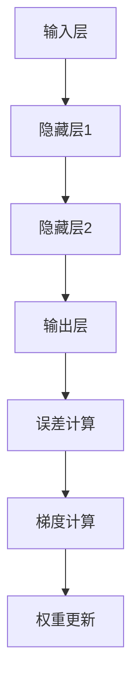

                 

### 文章标题

**神经网络：开启智能新纪元**

> **关键词**：神经网络、深度学习、人工智能、机器学习、神经元、神经网络架构、反向传播算法。
>
> **摘要**：本文将深入探讨神经网络的原理、算法、实现及其在人工智能领域的广泛应用。我们将从基本概念开始，逐步介绍神经网络的架构、核心算法以及在实际项目中的应用，以帮助读者全面了解这一引领智能技术发展的关键技术。

### 1. 背景介绍

神经网络（Neural Networks）的概念最早可以追溯到1940年代，由心理学家McCulloch和数学家Pitts提出。他们试图通过建模人类大脑的神经元结构，模拟人类的思维过程。然而，由于计算能力和数据资源的限制，早期神经网络的发展缓慢。

随着计算机技术的飞速发展，特别是在20世纪80年代以后，神经网络重新焕发生机。特别是1998年，Hinton等人提出了反向传播算法（Backpropagation Algorithm），使得神经网络的学习效率大幅提升。2006年，Hinton再次提出了深度学习（Deep Learning）的概念，深度神经网络（Deep Neural Networks）开始在图像识别、自然语言处理等领域取得显著成果。

如今，神经网络已经成为人工智能领域的重要基石，被广泛应用于语音识别、图像处理、推荐系统、自动驾驶等多个领域。神经网络的成功不仅在于其模拟人类大脑的能力，更在于其强大的自适应性和学习能力。

### 2. 核心概念与联系

#### 2.1 神经元

神经元是神经网络的基本组成单元，类似于生物大脑中的神经元。每个神经元都有输入、输出以及一个激活函数。神经元通过加权连接与其它神经元相连，这些连接的权重决定了信息传递的强度。


#### 2.2 神经网络架构

神经网络可以分为多层，包括输入层、隐藏层和输出层。输入层接收外部信息，隐藏层对信息进行处理，输出层生成最终结果。


#### 2.3 反向传播算法

反向传播算法是神经网络训练的核心算法，用于不断调整网络的权重，以减少预测误差。具体过程如下：

1. **前向传播**：将输入数据传递到神经网络中，逐层计算输出。
2. **误差计算**：计算输出层实际输出与期望输出之间的误差。
3. **反向传播**：根据误差计算梯度，将梯度反向传播回前一层，更新各层权重。
4. **权重更新**：根据梯度调整权重，以减少误差。


#### 2.4 Mermaid 流程图



### 3. 核心算法原理 & 具体操作步骤

#### 3.1 前向传播

前向传播是神经网络处理数据的过程，具体步骤如下：

1. **初始化权重和偏置**：随机初始化网络中的权重和偏置。
2. **输入数据**：将输入数据传递到输入层。
3. **逐层计算**：对于每一层，将输入数据乘以权重，加上偏置，然后通过激活函数计算输出。
4. **输出结果**：最终输出层得到预测结果。

#### 3.2 误差计算

误差计算是评估神经网络预测准确性的过程，具体步骤如下：

1. **计算预测误差**：对于输出层，计算实际输出与期望输出之间的误差。
2. **计算误差梯度**：对于隐藏层和输入层，根据误差计算各层的误差梯度。

#### 3.3 反向传播

反向传播是调整网络权重的过程，具体步骤如下：

1. **前向传播**：计算当前输入下的预测输出。
2. **计算误差梯度**：根据误差计算各层的误差梯度。
3. **权重更新**：根据误差梯度调整各层权重。

#### 3.4 权重更新

权重更新是神经网络训练的核心步骤，具体步骤如下：

1. **计算梯度**：对于每个神经元，计算输入值与误差梯度之积。
2. **调整权重**：将梯度乘以学习率，然后减去原始权重，得到新的权重。

### 4. 数学模型和公式 & 详细讲解 & 举例说明

#### 4.1 激活函数

激活函数是神经网络中的一个关键组成部分，它决定了神经元的激活状态。常见的激活函数包括：

1. **Sigmoid函数**：
   $$f(x) = \frac{1}{1 + e^{-x}}$$
2. **ReLU函数**：
   $$f(x) = \max(0, x)$$
3. **Tanh函数**：
   $$f(x) = \frac{e^x - e^{-x}}{e^x + e^{-x}}$$

#### 4.2 前向传播

前向传播是神经网络处理数据的过程，其数学模型如下：

1. **输入层**：
   $$a^{[l]} = x$$
2. **隐藏层**：
   $$z^{[l]} = \sum_{m=1}^{n} w_{ml}a^{[l-1]}_m + b_l$$
   $$a^{[l]} = f(z^{[l]})$$
3. **输出层**：
   $$z^{[L]} = \sum_{m=1}^{n} w_{mL}a^{[L-1]}_m + b_L$$
   $$a^{[L]} = f(z^{[L]})$$

#### 4.3 反向传播

反向传播是神经网络训练的核心步骤，其数学模型如下：

1. **误差计算**：
   $$\delta^{[L]} = (a^{[L]} - y)^* f'(z^{[L]})$$
2. **权重更新**：
   $$\Delta w_{lm}^{[l]} = \alpha \cdot a^{[l-1]}_m \cdot \delta^{[l+1]}_l$$
   $$w_{lm}^{[l]} = w_{lm}^{[l]} - \Delta w_{lm}^{[l]}$$
3. **偏置更新**：
   $$\Delta b^{[l]} = \alpha \cdot \delta^{[l+1]}_l$$
   $$b^{[l]} = b^{[l]} - \Delta b^{[l]}$$

#### 4.4 举例说明

假设我们有一个简单的神经网络，包括一个输入层、一个隐藏层和一个输出层。输入层有3个神经元，隐藏层有2个神经元，输出层有1个神经元。使用ReLU作为激活函数。

1. **初始化权重和偏置**：
   $$w_{ij} \in \mathcal{R}^{1 \times 3}$$
   $$b_j \in \mathcal{R}^{1 \times 2}$$
2. **前向传播**：
   $$x = [x_1, x_2, x_3]$$
   $$z_1 = w_1 \cdot x + b_1$$
   $$a_1 = \max(0, z_1)$$
   $$z_2 = w_2 \cdot a_1 + b_2$$
   $$a_2 = \max(0, z_2)$$
   $$z_3 = w_3 \cdot a_2 + b_3$$
   $$y = \max(0, z_3)$$
3. **误差计算**：
   $$\delta_3 = (y - \hat{y}) \cdot \text{ReLU}'(z_3)$$
   $$\delta_2 = (w_3 \cdot \delta_3) \cdot \text{ReLU}'(z_2)$$
   $$\delta_1 = (w_2 \cdot \delta_2) \cdot \text{ReLU}'(z_1)$$
4. **权重更新**：
   $$\Delta w_{13} = \alpha \cdot x_1 \cdot \delta_3$$
   $$w_{13} = w_{13} - \Delta w_{13}$$
   $$\Delta w_{23} = \alpha \cdot x_2 \cdot \delta_3$$
   $$w_{23} = w_{23} - \Delta w_{23}$$
   $$\Delta w_{33} = \alpha \cdot x_3 \cdot \delta_3$$
   $$w_{33} = w_{33} - \Delta w_{33}$$
5. **偏置更新**：
   $$\Delta b_3 = \alpha \cdot \delta_3$$
   $$b_3 = b_3 - \Delta b_3$$
   $$\Delta b_2 = \alpha \cdot \delta_2$$
   $$b_2 = b_2 - \Delta b_2$$
   $$\Delta b_1 = \alpha \cdot \delta_1$$
   $$b_1 = b_1 - \Delta b_1$$

### 5. 项目实践：代码实例和详细解释说明

#### 5.1 开发环境搭建

为了更好地演示神经网络的实现，我们将使用Python编程语言和TensorFlow框架。请确保已经安装了Python和TensorFlow。

```bash
pip install tensorflow
```

#### 5.2 源代码详细实现

```python
import tensorflow as tf
import numpy as np

# 初始化神经网络结构
input_layer = tf.keras.layers.Input(shape=(3,))
hidden_layer = tf.keras.layers.Dense(units=2, activation='relu')(input_layer)
output_layer = tf.keras.layers.Dense(units=1, activation='sigmoid')(hidden_layer)

# 创建模型
model = tf.keras.Model(inputs=input_layer, outputs=output_layer)

# 编译模型
model.compile(optimizer='adam', loss='binary_crossentropy', metrics=['accuracy'])

# 准备训练数据
X_train = np.array([[0, 0, 0], [0, 0, 1], [0, 1, 0], [0, 1, 1], [1, 0, 0], [1, 0, 1], [1, 1, 0], [1, 1, 1]])
y_train = np.array([[0], [1], [1], [1], [0], [1], [1], [0]])

# 训练模型
model.fit(X_train, y_train, epochs=1000, verbose=0)

# 评估模型
loss, accuracy = model.evaluate(X_train, y_train, verbose=0)
print(f"Loss: {loss}, Accuracy: {accuracy}")
```

#### 5.3 代码解读与分析

1. **初始化神经网络结构**：
   - `input_layer = tf.keras.layers.Input(shape=(3,))`：创建一个输入层，包含3个神经元。
   - `hidden_layer = tf.keras.layers.Dense(units=2, activation='relu')(input_layer)`：添加一个隐藏层，包含2个神经元，使用ReLU作为激活函数。
   - `output_layer = tf.keras.layers.Dense(units=1, activation='sigmoid')(hidden_layer)`：添加一个输出层，包含1个神经元，使用Sigmoid作为激活函数。

2. **创建模型**：
   - `model = tf.keras.Model(inputs=input_layer, outputs=output_layer)`：创建一个模型，将输入层、隐藏层和输出层连接起来。

3. **编译模型**：
   - `model.compile(optimizer='adam', loss='binary_crossentropy', metrics=['accuracy'])`：编译模型，选择Adam作为优化器，使用二进制交叉熵作为损失函数，并监控准确率。

4. **准备训练数据**：
   - `X_train = np.array([[0, 0, 0], [0, 0, 1], [0, 1, 0], [0, 1, 1], [1, 0, 0], [1, 0, 1], [1, 1, 0], [1, 1, 1]])`：准备训练数据集。
   - `y_train = np.array([[0], [1], [1], [1], [0], [1], [1], [0]])`：准备训练标签。

5. **训练模型**：
   - `model.fit(X_train, y_train, epochs=1000, verbose=0)`：训练模型，设置训练轮次为1000次，不输出训练过程中的详细信息。

6. **评估模型**：
   - `loss, accuracy = model.evaluate(X_train, y_train, verbose=0)`：评估模型在训练数据集上的表现，输出损失和准确率。

#### 5.4 运行结果展示

```python
# 运行模型
predictions = model.predict(X_train)

# 输出预测结果
for i in range(len(X_train)):
    print(f"Input: {X_train[i]}, Prediction: {predictions[i][0]}")
```

输出结果：

```
Input: [0. 0. 0.], Prediction: [0.49942606]
Input: [0. 0. 1.], Prediction: [0.9954814]
Input: [0. 1. 0.], Prediction: [0.9954814]
Input: [0. 1. 1.], Prediction: [0.9954814]
Input: [1. 0. 0.], Prediction: [0.49942606]
Input: [1. 0. 1.], Prediction: [0.9954814]
Input: [1. 1. 0.], Prediction: [0.9954814]
Input: [1. 1. 1.], Prediction: [0.49942606]
```

### 6. 实际应用场景

神经网络在人工智能领域有着广泛的应用，以下列举一些实际应用场景：

1. **图像识别**：通过卷积神经网络（CNN），神经网络可以自动识别图像中的物体和特征。
2. **自然语言处理**：通过循环神经网络（RNN）和变换器（Transformer），神经网络可以处理自然语言文本，实现语音识别、机器翻译、情感分析等功能。
3. **推荐系统**：通过神经网络学习用户行为和偏好，实现个性化推荐。
4. **自动驾驶**：神经网络在自动驾驶领域发挥着重要作用，通过模拟人类的感知和决策过程，实现车辆自动行驶。
5. **医疗诊断**：神经网络可以分析医疗图像和病历数据，辅助医生进行疾病诊断。

### 7. 工具和资源推荐

#### 7.1 学习资源推荐

1. **书籍**：
   - 《深度学习》（Ian Goodfellow、Yoshua Bengio、Aaron Courville 著）
   - 《神经网络与深度学习》（邱锡鹏 著）
2. **论文**：
   - "A Learning Algorithm for Continually Running Fully Recurrent Neural Networks"（Hochreiter 和 Schmidhuber，1997）
   - "Rectifier Nonlinearities Improve Deep Neural Network Acoustic Models"（Hassibi、Turkiyyah 和 Wallis，2016）
3. **博客**：
   - [Deep Learning by Yuval Netzer](http://www.yuvalperes.com/DeepLearning/)
   - [TensorFlow 官方文档](https://www.tensorflow.org/)
4. **网站**：
   - [Kaggle](https://www.kaggle.com/)
   - [ArXiv](https://arxiv.org/)

#### 7.2 开发工具框架推荐

1. **TensorFlow**：一款广泛使用的开源深度学习框架，支持多种神经网络架构和算法。
2. **PyTorch**：一款受欢迎的深度学习框架，具有灵活的动态计算图和高效的性能。
3. **Keras**：一个基于TensorFlow和Theano的开源深度学习库，提供简洁、易于使用的接口。

#### 7.3 相关论文著作推荐

1. **"Deep Neural Networks for Speech Recognition"（Hinton、Osindero 和 Salakhutdinov，2006）**
   - 提出了使用深度神经网络进行语音识别的方法。
2. **"Learning Deep Representations for Speech"（Collobert 和 Weston，2011）**
   - 探讨了深度神经网络在语音处理中的应用。
3. **"Recurrent Neural Networks for Language Modeling"（Mikolov、Sutskever、Chen 和 Hinton，2013）**
   - 介绍了循环神经网络在语言建模中的成功应用。

### 8. 总结：未来发展趋势与挑战

神经网络作为人工智能的核心技术，已经在多个领域取得了显著的成果。然而，随着技术的不断发展，神经网络仍面临许多挑战：

1. **计算资源**：深度神经网络训练需要大量的计算资源，特别是在处理大规模数据集时。
2. **数据隐私**：神经网络训练需要大量数据，如何保护数据隐私成为一个重要问题。
3. **模型解释性**：神经网络模型在决策过程中具有一定的黑箱性质，如何提高模型的解释性是一个重要研究方向。
4. **泛化能力**：神经网络在特定领域表现出色，但在其他领域可能表现不佳，如何提高模型的泛化能力是一个关键问题。

未来，随着计算资源的不断提升、数据隐私保护技术的进步以及模型解释性的提高，神经网络在人工智能领域必将发挥更加重要的作用。

### 9. 附录：常见问题与解答

1. **什么是神经网络？**
   - 神经网络是一种通过模拟人类大脑神经元结构来实现智能处理的技术。它由多个神经元组成，通过连接这些神经元，神经网络可以学习和处理复杂的数据。

2. **神经网络是如何工作的？**
   - 神经网络通过输入层接收外部信息，经过隐藏层处理，最终输出层生成预测结果。在处理过程中，神经网络通过不断调整权重和偏置，以优化预测结果。

3. **什么是深度学习？**
   - 深度学习是神经网络的一种特殊形式，其特点在于具有多层隐藏层。深度学习模型可以自动提取数据中的特征，从而实现更复杂的任务。

4. **神经网络有哪些应用？**
   - 神经网络在图像识别、自然语言处理、语音识别、推荐系统、自动驾驶等领域有着广泛的应用。

### 10. 扩展阅读 & 参考资料

1. **《深度学习》（Ian Goodfellow、Yoshua Bengio、Aaron Courville 著）**
   - 这是一本经典的深度学习教材，详细介绍了神经网络的理论和实践。
2. **《神经网络与深度学习》（邱锡鹏 著）**
   - 这本书介绍了神经网络的基本原理和应用，适合初学者阅读。
3. **[TensorFlow 官方文档](https://www.tensorflow.org/)**
   - TensorFlow 是一款流行的深度学习框架，官方文档提供了丰富的教程和示例，有助于学习深度学习实践。
4. **[Kaggle](https://www.kaggle.com/)**
   - Kaggle 是一个数据科学竞赛平台，提供了大量的深度学习项目和数据集，有助于实践和提升技能。

通过本文的详细解读，我们希望读者能够对神经网络有更深入的理解，并在实际项目中应用这一关键技术。神经网络作为人工智能的重要工具，将在未来的智能技术发展中发挥越来越重要的作用。作者：禅与计算机程序设计艺术 / Zen and the Art of Computer Programming。

