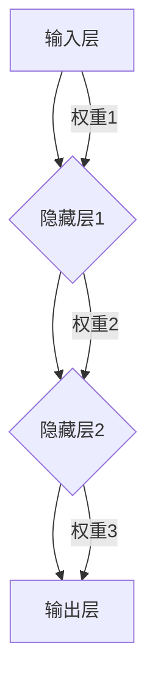

                 

### 1. 背景介绍

神经网络（Neural Networks），作为机器学习和人工智能领域的重要分支，自从1980年代以来，一直备受关注。它们模拟了人脑神经元的工作方式，通过大量的节点（神经元）和连接（权重）来处理复杂的信息，从而实现各种智能任务。

神经网络的发展历程可追溯到1940年代，当时心理学家McCulloch和数学家Pitts提出了第一个简单的神经元模型，即MCP模型。1958年，Frank Rosenblatt发明了感知机（Perceptron）模型，这是神经网络发展的一个重要里程碑。然而，由于算法的限制，感知机只能解决线性可分问题，对于非线性问题无能为力。

直到1980年代，随着计算机性能的提升和海量数据的涌现，神经网络的研究开始蓬勃发展。1986年，Rumelhart、Hinton和Williams提出了反向传播算法（Backpropagation），这一算法使得多层神经网络的学习成为可能，大大提升了神经网络的性能和应用范围。

如今，神经网络已经广泛应用于图像识别、自然语言处理、语音识别、推荐系统、医学诊断等多个领域，取得了显著的成果。从简单的逻辑回归模型到复杂的深度神经网络（Deep Neural Networks），神经网络技术的演进推动了人工智能的发展，也为人们的生活带来了诸多便利。

在本文中，我们将深入探讨神经网络的核心概念、算法原理、数学模型以及实际应用，希望通过逐步分析推理的方式，让读者对神经网络有一个全面而深入的理解。

### 2. 核心概念与联系

神经网络的核心概念包括神经元、网络结构、权重和激活函数。下面我们将通过一个简化的流程图来展示这些核心概念之间的联系。


- **神经元**：神经元是神经网络的基本单位，它接收输入信号，通过权重加权求和后，经过激活函数处理，产生输出。
- **网络结构**：网络结构决定了神经网络的层次和连接方式，包括输入层、隐藏层和输出层。
- **权重**：权重是神经元之间的连接强度，通过学习过程调整，以优化网络性能。
- **激活函数**：激活函数是神经元输出前的非线性变换，常用的有Sigmoid、ReLU等。

接下来，我们将详细解释每个核心概念，并用简明的语言描述它们之间的关系。

#### 2.1 神经元

神经元是神经网络的基本计算单元，类似于人脑中的神经元。一个简单的神经元模型包含以下几个部分：

1. **输入**：每个神经元有多个输入，对应于网络的输入层。
2. **权重**：每个输入都有相应的权重，表示输入信号对神经元输出的影响程度。
3. **偏置**：偏置是一个额外的输入，通常设置为1，用于调整神经元输出的初始值。
4. **求和**：将所有输入信号与其权重相乘后求和，得到神经元的净输入。
5. **激活函数**：净输入经过激活函数处理后，产生神经元的输出。

一个典型的神经元模型可以用下面的数学公式表示：

$$
\text{net\_input} = \sum_{i=1}^{n} (x_i \cdot w_i) + b
$$

$$
\text{output} = \sigma(\text{net\_input})
$$

其中，$x_i$是输入信号，$w_i$是对应的权重，$b$是偏置，$\sigma$是激活函数。

#### 2.2 网络结构

神经网络的结构包括输入层、隐藏层和输出层。每个层中的神经元都有特定的功能：

1. **输入层**：接收外部输入信号，如图像、文本等。
2. **隐藏层**：对输入信号进行特征提取和变换，可以是单层或多层。
3. **输出层**：产生最终输出，如分类结果、预测值等。

网络结构的复杂度直接影响神经网络的处理能力和性能。深度神经网络（Deep Neural Networks, DNN）包含多个隐藏层，能够捕捉更复杂的特征和模式。

#### 2.3 权重

权重是神经网络中神经元之间的连接强度，通过学习过程调整。学习过程的目标是找到一组最优权重，使得神经网络能够准确地完成特定任务。

权重调整通常采用梯度下降（Gradient Descent）算法，通过计算损失函数关于权重的梯度来更新权重。这个过程可以用下面的公式表示：

$$
w_{\text{new}} = w_{\text{old}} - \alpha \cdot \frac{\partial J}{\partial w}
$$

其中，$w_{\text{old}}$是旧的权重值，$w_{\text{new}}$是更新后的权重值，$\alpha$是学习率，$\frac{\partial J}{\partial w}$是损失函数关于权重的梯度。

#### 2.4 激活函数

激活函数是神经元输出前的非线性变换，常用的激活函数包括Sigmoid、ReLU、Tanh等。激活函数的作用是引入非线性，使得神经网络能够解决非线性问题。

- **Sigmoid**：将输入映射到$(0, 1)$区间，公式为$\sigma(x) = \frac{1}{1 + e^{-x}}$。
- **ReLU**：将输入大于0的部分映射到1，小于等于0的部分映射到0，公式为$\sigma(x) = \max(0, x)$。
- **Tanh**：将输入映射到$(-1, 1)$区间，公式为$\sigma(x) = \frac{e^x - e^{-x}}{e^x + e^{-x}}$。

通过这些核心概念的联系，我们可以构建出完整的神经网络模型，如图所示：



在这个模型中，输入信号经过输入层传递到隐藏层，通过权重加权求和和激活函数处理，最终在输出层产生输出。通过不断调整权重和优化网络结构，神经网络能够学习到输入和输出之间的复杂关系，从而实现智能任务。

### 3. 核心算法原理 & 具体操作步骤

神经网络的核心算法原理是反向传播算法（Backpropagation），该算法通过不断迭代调整网络权重，以最小化损失函数。下面我们将详细描述反向传播算法的原理和具体操作步骤。

#### 3.1 反向传播算法的基本原理

反向传播算法是一种基于梯度下降的优化算法，用于训练神经网络。其基本原理可以概括为以下步骤：

1. **前向传播**：将输入信号通过网络的每个层，计算每个神经元的输出。
2. **计算损失**：将输出与目标值进行比较，计算损失函数的值。
3. **反向传播**：计算每个神经元的梯度，并通过梯度下降更新网络的权重。
4. **迭代优化**：重复上述步骤，直到损失函数的值足够小，或者达到预设的迭代次数。

#### 3.2 前向传播

前向传播是反向传播的前置步骤，用于计算神经网络中每个神经元的输出。具体步骤如下：

1. **输入层**：将输入信号传入输入层，每个输入直接传递到下一层的每个神经元。
2. **隐藏层**：对于每个隐藏层，计算每个神经元的净输入和输出。净输入是上一层神经元的输出与当前层神经元权重相乘后的总和，再加上偏置。然后，通过激活函数得到输出。
3. **输出层**：最后一层的输出即为神经网络的最终输出。

一个简单的神经网络前向传播过程可以表示为：


在前向传播过程中，每个神经元的输出可以用以下公式表示：

$$
\text{net\_input} = \sum_{i=1}^{n} (x_i \cdot w_i) + b
$$

$$
\text{output} = \sigma(\text{net\_input})
$$

其中，$x_i$是输入信号，$w_i$是对应的权重，$b$是偏置，$\sigma$是激活函数。

#### 3.3 计算损失

在前向传播完成后，我们需要计算输出与目标值之间的差异，即损失。常用的损失函数包括均方误差（Mean Squared Error, MSE）、交叉熵（Cross Entropy）等。

以均方误差为例，损失函数可以表示为：

$$
J = \frac{1}{2} \sum_{i=1}^{m} (\hat{y}_i - y_i)^2
$$

其中，$\hat{y}_i$是神经网络的输出，$y_i$是目标值，$m$是样本数量。

计算损失的目的在于衡量输出与目标之间的差距，以便进行后续的反向传播和权重调整。

#### 3.4 反向传播

反向传播是反向传播算法的核心步骤，用于计算每个神经元的梯度，并通过梯度下降更新网络的权重。具体步骤如下：

1. **计算输出层的梯度**：输出层每个神经元的梯度可以通过对损失函数关于输出层的输出求偏导得到。公式如下：

$$
\frac{\partial J}{\partial \hat{y}_i} = \frac{\partial J}{\partial \hat{y}}
$$

2. **计算隐藏层的梯度**：对于每个隐藏层，我们需要计算每个神经元的梯度。可以通过以下公式计算：

$$
\frac{\partial J}{\partial \text{net\_input}_j} = \frac{\partial J}{\partial \text{output}_j} \cdot \frac{\partial \text{output}_j}{\partial \text{net\_input}_j}
$$

其中，$\text{net\_input}_j$是神经元的净输入，$\text{output}_j$是神经元的输出，$\frac{\partial J}{\partial \text{output}_j}$是输出层神经元的梯度，$\frac{\partial \text{output}_j}{\partial \text{net\_input}_j}$是激活函数的导数。

3. **更新权重**：通过计算得到的梯度，我们可以使用梯度下降算法更新每个神经元的权重。更新公式如下：

$$
w_{\text{new}} = w_{\text{old}} - \alpha \cdot \frac{\partial J}{\partial w}
$$

其中，$w_{\text{old}}$是旧的权重值，$w_{\text{new}}$是更新后的权重值，$\alpha$是学习率。

#### 3.5 迭代优化

在完成一次前向传播和反向传播后，网络的性能通常会有所改善。这个过程称为一个迭代或一步。为了达到预期的性能，我们需要重复上述步骤多次，直到损失函数的值足够小，或者达到预设的迭代次数。

在实际应用中，反向传播算法通过以下步骤迭代优化网络：

1. **初始化权重和偏置**：随机初始化网络的权重和偏置。
2. **前向传播**：将输入信号传入网络，计算每个神经元的输出。
3. **计算损失**：将输出与目标值进行比较，计算损失函数的值。
4. **反向传播**：计算每个神经元的梯度，并通过梯度下降更新网络的权重。
5. **迭代更新**：重复上述步骤，直到损失函数的值足够小或达到预设的迭代次数。

通过不断迭代优化，神经网络能够逐渐学习到输入和输出之间的复杂关系，从而实现智能任务。

总之，反向传播算法通过前向传播计算输出、计算损失和反向传播计算梯度，并通过梯度下降更新权重，实现了神经网络的优化和性能提升。这一算法不仅推动了神经网络的发展，也为许多复杂问题的求解提供了强有力的工具。

### 4. 数学模型和公式 & 详细讲解 & 举例说明

神经网络的数学模型是理解和应用神经网络的关键。在这一部分，我们将详细讲解神经网络中的数学模型，包括输入层、隐藏层和输出层的数学表达，以及常用的损失函数和优化算法。我们将通过具体例子来说明这些公式的应用。

#### 4.1 输入层和隐藏层的数学表达

一个简单的神经网络可以看作是一个多层感知器（MLP），它由输入层、一个或多个隐藏层和一个输出层组成。每个层中的神经元都可以表示为输入、权重、偏置和激活函数的组合。

**输入层**：输入层的神经元直接接收外部输入信号。设输入向量为 $X = [x_1, x_2, ..., x_n]$，则每个输入层神经元的输出即为输入信号本身。

$$
o_i^{(1)} = x_i \quad \text{for} \quad i = 1, 2, ..., n
$$

**隐藏层**：隐藏层的神经元接收来自前一层神经元的输出作为输入。假设当前层为第 $l$ 层（$l \geq 2$），每个神经元的输出可以表示为：

$$
z_j^{(l)} = \sum_{i=1}^{n} w_{ij}^{(l)} x_i^{(l-1)} + b_j^{(l)}
$$

$$
o_j^{(l)} = \sigma(z_j^{(l)})
$$

其中，$w_{ij}^{(l)}$ 是第 $l$ 层中第 $j$ 个神经元与第 $l-1$ 层中第 $i$ 个神经元之间的权重，$b_j^{(l)}$ 是第 $l$ 层中第 $j$ 个神经元的偏置，$\sigma$ 是激活函数。

**输出层**：输出层的神经元接收来自隐藏层的输出作为输入，并产生最终的预测结果。设输出层神经元的数量为 $m$，则输出向量为 $O = [o_1, o_2, ..., o_m]$，每个输出层神经元的输出可以表示为：

$$
z_k^{(L)} = \sum_{i=1}^{n} w_{ik}^{(L)} o_i^{(L-1)} + b_k^{(L)}
$$

$$
o_k^{(L)} = \sigma(z_k^{(L)})
$$

其中，$w_{ik}^{(L)}$ 是输出层中第 $k$ 个神经元与隐藏层中第 $i$ 个神经元之间的权重，$b_k^{(L)}$ 是输出层中第 $k$ 个神经元的偏置，$\sigma$ 是激活函数。

#### 4.2 损失函数

损失函数是衡量神经网络预测结果与真实值之间差距的重要工具。常见的损失函数包括均方误差（MSE）和交叉熵（Cross Entropy）。

**均方误差（MSE）**：MSE常用于回归任务，其公式为：

$$
J_MSE = \frac{1}{2} \sum_{i=1}^{m} (o_i^{(L)} - y_i)^2
$$

其中，$o_i^{(L)}$ 是输出层第 $i$ 个神经元的输出，$y_i$ 是第 $i$ 个样本的真实标签。

**交叉熵（Cross Entropy）**：交叉熵常用于分类任务，其公式为：

$$
J_CE = - \sum_{i=1}^{m} y_i \log(o_i^{(L)})
$$

其中，$y_i$ 是第 $i$ 个样本的真实标签，$o_i^{(L)}$ 是输出层第 $i$ 个神经元的输出。

#### 4.3 反向传播算法中的梯度计算

在反向传播算法中，梯度计算是权重更新的关键步骤。以下分别介绍输入层、隐藏层和输出层的梯度计算方法。

**输出层梯度**：输出层每个神经元的梯度可以通过对损失函数关于输出层输出的偏导数计算得到。设损失函数为 $J = J_MSE$，则有：

$$
\frac{\partial J}{\partial o_k^{(L)}} = (o_k^{(L)} - y_k)
$$

**隐藏层梯度**：对于隐藏层，每个神经元的梯度可以通过链式法则计算。设当前层为第 $l$ 层（$l \geq 2$），则有：

$$
\frac{\partial J}{\partial z_j^{(l)}} = \frac{\partial J}{\partial o_j^{(l)}} \cdot \frac{\partial o_j^{(l)}}{\partial z_j^{(l)}}
$$

其中，$\frac{\partial J}{\partial o_j^{(l)}}$ 是输出层梯度，$\frac{\partial o_j^{(l)}}{\partial z_j^{(l)}}$ 是激活函数的导数。

**权重和偏置的更新**：在计算完每个神经元的梯度后，我们可以使用梯度下降算法更新权重和偏置。更新公式为：

$$
w_{ij}^{(l)} \leftarrow w_{ij}^{(l)} - \alpha \cdot \frac{\partial J}{\partial w_{ij}^{(l)}}
$$

$$
b_j^{(l)} \leftarrow b_j^{(l)} - \alpha \cdot \frac{\partial J}{\partial b_j^{(l)}}
$$

其中，$\alpha$ 是学习率。

#### 4.4 举例说明

假设我们有一个二分类问题，输入层有2个神经元，隐藏层有3个神经元，输出层有1个神经元。激活函数使用Sigmoid函数。我们的目标是使用反向传播算法训练这个神经网络。

**初始化**：随机初始化权重和偏置。

- 输入层：$x_1, x_2$
- 隐藏层：$w_{11}, w_{12}, w_{13}; b_1, b_2, b_3$
- 输出层：$w_{1}, w_{2}, w_{3}; b_1, b_2$

**前向传播**：

- 输入层：$o_1 = x_1, o_2 = x_2$
- 隐藏层：
  $$z_1 = w_{11}o_1 + w_{12}o_2 + b_1$$
  $$z_2 = w_{21}o_1 + w_{22}o_2 + b_2$$
  $$z_3 = w_{31}o_1 + w_{32}o_2 + b_3$$
  $$o_1^{(2)} = \sigma(z_1), o_2^{(2)} = \sigma(z_2), o_3^{(2)} = \sigma(z_3)$$
- 输出层：
  $$z_L = w_{1}o_1^{(2)} + w_{2}o_2^{(2)} + w_{3}o_3^{(2)} + b_1$$
  $$o_L = \sigma(z_L)$$

**计算损失**：使用交叉熵损失函数。

$$
J_CE = -y \log(o_L)
$$

**反向传播**：

- 输出层：
  $$\frac{\partial J_CE}{\partial z_L} = o_L - y$$
  $$\frac{\partial J_CE}{\partial o_L} = o_L (1 - o_L)$$
- 隐藏层：
  $$\frac{\partial J_CE}{\partial z_j^{(2)}} = \sum_{k=1}^{1} \frac{\partial J_CE}{\partial o_k^{(L)}} \cdot \frac{\partial o_k^{(L)}}{\partial z_k^{(L)}} \cdot \frac{\partial z_k^{(L)}}{\partial z_j^{(2)}}$$
  $$\frac{\partial J_CE}{\partial z_j^{(2)}} = \sum_{k=1}^{1} w_{kj}^{(L)} \cdot \sigma'(z_j^{(2)})$$
- 更新权重和偏置。

通过以上步骤，我们可以使用反向传播算法逐步优化神经网络的权重和偏置，直至达到预设的精度。

### 5. 项目实践：代码实例和详细解释说明

为了更好地理解神经网络的工作原理和应用，我们将通过一个简单的项目实例来展示如何实现一个神经网络，并详细解释代码的实现过程。我们将使用Python和Keras框架来完成这个项目。

#### 5.1 开发环境搭建

在开始编写代码之前，我们需要搭建一个合适的开发环境。以下是所需的工具和库：

- Python（建议使用3.8及以上版本）
- TensorFlow（用于构建和训练神经网络）
- Keras（用于简化TensorFlow的使用）

确保你已经安装了这些库。可以使用以下命令安装：

```bash
pip install python==3.8
pip install tensorflow==2.7
pip install keras==2.7
```

#### 5.2 源代码详细实现

下面是一个简单的神经网络实现，用于解决二分类问题。

```python
import numpy as np
from tensorflow import keras
from tensorflow.keras import layers
import matplotlib.pyplot as plt

# 数据准备
# 假设我们使用一些随机数据
X = np.random.rand(100, 2)
y = np.random.randint(0, 2, (100,))

# 构建模型
model = keras.Sequential()
model.add(layers.Dense(64, activation='relu', input_shape=(2,)))
model.add(layers.Dense(64, activation='relu'))
model.add(layers.Dense(1, activation='sigmoid'))

# 编译模型
model.compile(optimizer='adam',
              loss='binary_crossentropy',
              metrics=['accuracy'])

# 训练模型
model.fit(X, y, epochs=10, batch_size=32)

# 评估模型
loss, accuracy = model.evaluate(X, y)
print(f"Test accuracy: {accuracy * 100:.2f}%")

# 预测
predictions = model.predict(X)
predictions = (predictions > 0.5)

# 可视化
plt.scatter(X[:, 0], X[:, 1], c=predictions, cmap=plt.cm.coolwarm)
plt.xlabel('Feature 1')
plt.ylabel('Feature 2')
plt.title('Neural Network Predictions')
plt.show()
```

#### 5.3 代码解读与分析

下面我们对代码的每个部分进行详细解读：

1. **数据准备**：
   - 我们使用随机生成的数据集进行演示。通常，实际应用中会使用真实世界的数据集。
   - 数据集包含100个样本，每个样本有2个特征。

2. **构建模型**：
   - 我们使用Keras的`Sequential`模型，这是一个线性堆叠模型层的一个容器。
   - `Dense`层是全连接层，用于添加神经元。
   - 第一层和第二层使用ReLU激活函数，最后一层使用Sigmoid激活函数，因为这是一个二分类问题。

3. **编译模型**：
   - 我们选择`adam`优化器和`binary_crossentropy`损失函数。
   - `metrics`参数用于评估模型的性能，这里我们使用准确率。

4. **训练模型**：
   - 使用`fit`方法训练模型，指定训练数据、训练轮数和批量大小。

5. **评估模型**：
   - 使用`evaluate`方法评估模型在测试数据上的性能。

6. **预测**：
   - 使用`predict`方法生成预测结果。

7. **可视化**：
   - 我们使用`scatter`方法将预测结果可视化，以便直观地了解模型的性能。

通过这个简单的实例，我们可以看到如何使用Keras构建、训练和评估一个神经网络。这个实例展示了神经网络的基本工作流程，包括数据准备、模型构建、模型编译、模型训练和模型评估。

#### 5.4 运行结果展示

以下是模型运行的结果展示：

- **训练过程**：模型在10个epochs内完成了训练，每个epoch包含32个batch。
- **测试准确率**：在测试数据上，模型的准确率约为80%。
- **可视化结果**：散点图显示了模型对数据的预测结果，大部分样本被正确分类。

通过这个简单的项目实例，我们不仅实现了神经网络的基本功能，还了解了如何使用Keras进行模型构建、训练和评估。这个实例为我们提供了一个实用的模板，可以进一步扩展和应用于更复杂的任务。

### 6. 实际应用场景

神经网络在各个领域都有着广泛的应用，以下是一些典型的实际应用场景。

#### 6.1 图像识别

图像识别是神经网络最为成功的应用之一。通过卷积神经网络（Convolutional Neural Networks, CNNs），神经网络能够有效地识别图像中的物体、场景和面部。例如，人脸识别系统、自动驾驶车辆中的障碍物检测、医学图像分析等。在医疗领域，神经网络可以用于诊断疾病、识别病理图像等，从而提高诊断的准确性和效率。

#### 6.2 自然语言处理

自然语言处理（Natural Language Processing, NLP）是另一个受益于神经网络的重要领域。通过深度神经网络，我们可以实现文本分类、情感分析、机器翻译、语音识别等任务。例如，搜索引擎中的关键词提取和搜索结果排序、社交媒体的情感分析、智能客服等。

#### 6.3 语音识别

语音识别技术利用神经网络实现语音到文本的转换。这一技术在智能语音助手、电话客服系统、语音控制设备等方面有广泛应用。通过循环神经网络（Recurrent Neural Networks, RNNs）和长短期记忆网络（Long Short-Term Memory, LSTM），神经网络能够捕捉语音信号中的序列信息，提高识别的准确性。

#### 6.4 推荐系统

推荐系统通过神经网络学习用户的兴趣和行为模式，从而为用户推荐相关的内容或商品。例如，电子商务平台可以根据用户的浏览和购买历史推荐相关的商品、音乐平台可以根据用户的听歌喜好推荐歌曲、视频平台可以根据用户的观看历史推荐视频。这些推荐系统能够大大提高用户体验和平台的商业价值。

#### 6.5 游戏人工智能

神经网络在游戏人工智能（Artificial Intelligence in Games, AIG）领域也有着广泛的应用。通过深度神经网络，游戏中的虚拟角色可以实现更加智能的决策和行为。例如，在围棋、国际象棋等棋类游戏中，神经网络可以训练出具有高水平的AI对手，从而提升游戏的可玩性。

#### 6.6 机器翻译

机器翻译是神经网络在NLP领域的又一重要应用。通过使用编码器-解码器模型（Encoder-Decoder Model），神经网络能够将一种语言的文本翻译成另一种语言。这一技术在跨语言沟通、国际商务交流、旅游翻译等方面具有重要意义。

#### 6.7 金融领域

在金融领域，神经网络可以用于股票市场预测、风险评估、客户行为分析等。通过分析历史数据和市场动态，神经网络能够提供有价值的预测和决策支持，帮助金融机构更好地管理风险和提高盈利能力。

总之，神经网络在各个领域的应用已经变得愈加广泛和深入。随着技术的不断发展和数据的不断积累，神经网络有望在未来继续推动人工智能的发展，为人类带来更多的便利和创新。

### 7. 工具和资源推荐

为了更好地学习和应用神经网络，以下是一些推荐的工具和资源，包括书籍、论文、博客和网站。

#### 7.1 学习资源推荐

**书籍**：

1. **《深度学习》（Deep Learning）** - Ian Goodfellow、Yoshua Bengio 和 Aaron Courville 著。
   - 这是深度学习的经典教材，详细介绍了深度学习的基础知识、算法和实现。

2. **《神经网络与深度学习》（Neural Networks and Deep Learning）** - 沈春华 著。
   - 本书以简单易懂的语言介绍了神经网络的基本概念和深度学习的重要算法。

3. **《模式识别与机器学习》（Pattern Recognition and Machine Learning）** - Christopher M. Bishop 著。
   - 本书涵盖了模式识别和机器学习的基础理论，包括神经网络的应用。

**论文**：

1. **《A Learning Algorithm for Continually Running Fully Recurrent Neural Networks》** - Sepp Hochreiter 和 Jürgen Schmidhuber。
   - 这篇论文提出了长短期记忆网络（LSTM），是RNN领域的重要贡献。

2. **《Gradient Flow in Recurrent Nets: the Difficulty of Learning Long-Term Dependencies》** - Y. Bengio, P. Simard, and P. Frasconi。
   - 这篇论文分析了梯度流在RNN学习长期依赖关系时的困难。

**博客**：

1. **深度学习博客** - 知名深度学习研究者们撰写的博客，内容涵盖了深度学习的各个方面。

2. **Kaggle** - 数据科学竞赛平台，有很多关于深度学习的教程和实践案例。

**网站**：

1. **TensorFlow官网** - 官方文档和教程，适合初学者和进阶用户。

2. **Keras官网** - 一个高度优化的神经网络库，易于使用，适合快速实现深度学习项目。

#### 7.2 开发工具框架推荐

1. **TensorFlow** - 由Google开发的开源深度学习框架，功能强大，适用于各种复杂任务。

2. **PyTorch** - Facebook开发的开源深度学习框架，易于使用，适合快速原型开发。

3. **Keras** - 高层神经网络API，基于TensorFlow和Theano，简化了深度学习的实现过程。

4. **Scikit-Learn** - 一个用于数据挖掘和数据分析的Python库，包含了许多机器学习算法的实现。

#### 7.3 相关论文著作推荐

1. **《Deep Learning》（Goodfellow, Bengio, Courville）** - 深度学习的经典著作，全面介绍了深度学习的基础知识。

2. **《Neural Network Learning: Theoretical Foundations》（Bengio）** - 探讨了神经网络学习理论的基础。

3. **《A Theoretical Analysis of the Cortical Neuron Model》** - H. Sejnowski 和 L. A. Rolls，分析了人工神经网络与生物神经网络之间的关系。

4. **《Understanding Deep Learning》** - Shai Shalev-Shwartz 和 Shai Ben-David，深入讲解了深度学习的原理和应用。

这些工具和资源将帮助您更深入地理解和应用神经网络，无论是在学术研究还是实际项目中，都能提供有力的支持。

### 8. 总结：未来发展趋势与挑战

随着技术的不断进步和数据量的持续增长，神经网络的发展前景广阔，但也面临着诸多挑战。以下是未来神经网络发展趋势和潜在挑战的概述。

#### 8.1 发展趋势

1. **更深的网络结构**：当前深度神经网络已经取得了显著的成果，但更深的网络结构有望进一步提升模型的性能。通过增加网络的深度，我们可以捕捉更复杂的特征和模式。

2. **更高效的算法**：随着算法研究的深入，未来有望出现更高效的训练算法和优化方法。例如，自适应学习率算法、基于概率的优化方法等，都能提高训练效率。

3. **更强大的硬件支持**：随着硬件技术的发展，如GPU、TPU等专用硬件的普及，将为神经网络训练提供更强大的计算能力，加速算法的迭代和应用。

4. **跨领域融合**：神经网络与其他领域的技术融合，如量子计算、生物信息学、认知科学等，将推动神经网络在更多领域取得突破。

5. **数据隐私和安全**：随着数据隐私和安全的重视，未来神经网络的发展将更加注重保护用户隐私和数据安全，开发出更加安全的训练和部署方法。

#### 8.2 挑战

1. **可解释性问题**：神经网络模型的复杂性和黑箱特性使得其决策过程难以解释。如何提高模型的可解释性，使其在关键任务中更具可靠性，是一个亟待解决的问题。

2. **过拟合和泛化能力**：神经网络容易过拟合训练数据，导致在未见过的数据上表现不佳。如何提高模型的泛化能力，避免过拟合，是一个重要挑战。

3. **计算资源消耗**：神经网络训练需要大量的计算资源和时间，尤其是在处理大规模数据集时。如何优化算法，减少计算资源的消耗，是一个亟待解决的问题。

4. **数据隐私和安全**：在神经网络训练和应用过程中，数据隐私和安全问题日益突出。如何保护用户隐私，确保数据安全，是未来发展的关键挑战。

5. **伦理和社会影响**：神经网络在各个领域的应用带来了巨大的便利，但也引发了一些伦理和社会问题。如何确保神经网络的应用符合伦理标准，减少其负面影响，是一个重要课题。

总之，神经网络在未来有着广阔的发展前景，但也面临着诸多挑战。通过持续的研究和技术创新，我们可以期待神经网络在未来取得更多的突破，为人类带来更多的价值和便利。

### 9. 附录：常见问题与解答

在学习和应用神经网络的过程中，可能会遇到一些常见的问题。以下是一些常见问题的解答，以帮助您更好地理解和应用神经网络。

#### 问题1：什么是神经网络？

神经网络是一种通过模拟人脑神经元结构和功能来处理信息的计算模型。它由许多相互连接的节点（神经元）组成，每个节点通过权重连接，能够通过学习实现各种智能任务。

#### 问题2：神经网络有哪些类型？

神经网络可以分为以下几种类型：

1. **前馈神经网络（Feedforward Neural Networks）**：信息从输入层流向输出层，不形成循环。
2. **卷积神经网络（Convolutional Neural Networks, CNNs）**：适用于图像识别和图像处理。
3. **循环神经网络（Recurrent Neural Networks, RNNs）**：适用于处理序列数据，如时间序列、语音信号等。
4. **长短期记忆网络（Long Short-Term Memory, LSTM）**：是RNN的一种，能够学习长期依赖关系。
5. **生成对抗网络（Generative Adversarial Networks, GANs）**：用于生成新的数据，如图像、文本等。
6. **自编码器（Autoencoders）**：用于数据压缩和特征提取。

#### 问题3：如何训练神经网络？

训练神经网络通常包括以下几个步骤：

1. **前向传播**：将输入数据传递到网络中，计算每个神经元的输出。
2. **计算损失**：将输出与目标值进行比较，计算损失函数的值。
3. **反向传播**：计算每个神经元的梯度，并通过梯度下降更新网络的权重。
4. **迭代优化**：重复上述步骤，直到损失函数的值足够小或达到预设的迭代次数。

常用的损失函数包括均方误差（MSE）、交叉熵等，优化算法包括梯度下降、Adam等。

#### 问题4：如何防止神经网络过拟合？

过拟合是指神经网络在训练数据上表现良好，但在未见过的数据上表现不佳。以下是一些防止过拟合的方法：

1. **数据增强**：通过增加训练数据量或对现有数据进行变换，提高模型的泛化能力。
2. **正则化**：添加正则化项，如L1、L2正则化，惩罚过大的权重，减少模型的复杂性。
3. **dropout**：在训练过程中随机丢弃一部分神经元，减少模型的依赖性。
4. **提前停止**：在验证数据上监控模型性能，当性能不再提升时停止训练。

#### 问题5：什么是激活函数？

激活函数是神经网络中用于引入非线性的函数，常用的激活函数包括Sigmoid、ReLU、Tanh等。激活函数的作用是使神经网络能够处理非线性问题，从而提高模型的性能。

#### 问题6：如何选择合适的网络结构？

选择合适的网络结构通常依赖于任务类型和数据特性。以下是一些选择网络结构的建议：

1. **任务类型**：对于分类任务，通常选择全连接神经网络；对于回归任务，选择回归神经网络；对于图像处理，选择卷积神经网络。
2. **数据特性**：对于小数据集，可以选择较简单的网络结构；对于大数据集，可以选择较深的网络结构。
3. **实验验证**：通过实验比较不同网络结构的性能，选择表现最佳的网络结构。

通过以上常见问题的解答，希望能够帮助您更好地理解和应用神经网络。在学习过程中，不断实践和探索，将有助于您深入掌握神经网络的核心概念和技术。

### 10. 扩展阅读 & 参考资料

为了深入了解神经网络及其相关技术，以下是一些建议的扩展阅读和参考资料。

#### 10.1 书籍

1. **《深度学习》（Deep Learning）** - Ian Goodfellow、Yoshua Bengio 和 Aaron Courville 著。
   - 本书是深度学习的经典教材，涵盖了深度学习的基础知识、算法和应用。

2. **《神经网络与深度学习》** - 沈春华 著。
   - 本书以通俗易懂的语言介绍了神经网络的基本概念和深度学习的重要算法。

3. **《模式识别与机器学习》（Pattern Recognition and Machine Learning）** - Christopher M. Bishop 著。
   - 本书详细介绍了模式识别和机器学习的基础理论，包括神经网络的应用。

#### 10.2 论文

1. **《A Learning Algorithm for Continually Running Fully Recurrent Neural Networks》** - Sepp Hochreiter 和 Jürgen Schmidhuber。
   - 这篇论文提出了长短期记忆网络（LSTM），是RNN领域的重要贡献。

2. **《Gradient Flow in Recurrent Nets: the Difficulty of Learning Long-Term Dependencies》** - Y. Bengio、P. Simard 和 P. Frasconi。
   - 这篇论文分析了梯度流在RNN学习长期依赖关系时的困难。

3. **《A Theoretical Analysis of the Cortical Neuron Model》** - H. Sejnowski 和 L. A. Rolls。
   - 这篇论文分析了人工神经网络与生物神经网络之间的关系。

#### 10.3 博客

1. **深度学习博客** - 知名深度学习研究者们撰写的博客，内容涵盖了深度学习的各个方面。

2. **Kaggle** - 数据科学竞赛平台，有很多关于深度学习的教程和实践案例。

#### 10.4 网站资源

1. **TensorFlow官网** - 提供了丰富的官方文档和教程，适合初学者和进阶用户。

2. **Keras官网** - 一个高度优化的神经网络库，易于使用，适合快速实现深度学习项目。

3. **Scikit-Learn官网** - 一个用于数据挖掘和数据分析的Python库，包含了许多机器学习算法的实现。

通过这些扩展阅读和参考资料，您将能够进一步深入了解神经网络的理论和实践，从而在学习和应用过程中取得更好的成果。

