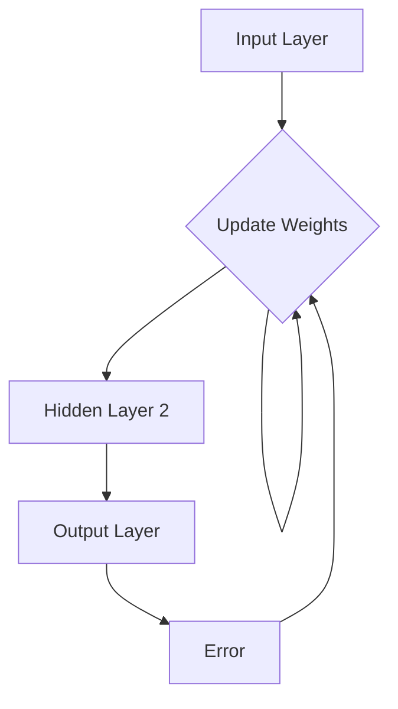

                 

### 1. 背景介绍

> 
> **神经网络：机器学习的新范式**
> 
> > 关键词：神经网络、机器学习、深度学习、算法、数学模型、实践应用
> 
> 摘要：本文旨在深入探讨神经网络在机器学习领域中的重要作用和影响力。我们将从神经网络的起源、核心概念、算法原理、数学模型以及实际应用等多个角度，系统性地介绍神经网络的工作机制及其在各个领域的应用。通过本文的阅读，读者将全面了解神经网络的核心概念，掌握其基本原理，并能够应用于实际问题的解决中。

在当今科技日新月异的时代，人工智能（AI）已成为推动社会进步的重要力量。而作为人工智能的核心组成部分，神经网络技术在众多领域中都展现出了其强大的应用潜力。从早期的感知器模型，到如今复杂的多层神经网络架构，神经网络在机器学习领域不断演进，为人工智能的发展提供了新的范式。

#### **1.1 神经网络的发展历程**

神经网络（Neural Networks）的概念起源于20世纪40年代。当时，心理学家和数学家开始探索生物大脑的神经网络结构及其信息处理能力。1943年，沃伦·麦卡洛克（Warren McCulloch）和沃尔特·皮茨（Walter Pitts）提出了第一个数学模型——感知器（Perceptron），这是一种简单的神经元模型，能够进行二分类。

随后，1958年，弗兰克·罗森布拉特（Frank Rosenblatt）进一步发展了感知器模型，提出了ADALINE（Adaptive Linear Neuron）算法。这一算法在图像识别、信号处理等领域得到了广泛应用。

然而，神经网络的真正突破发生在1986年，当杨·勒库恩（Yann LeCun）、大卫·埃利森（David E. Rumelhart）和约翰·赫布（John Hopfield）等人提出了反向传播算法（Backpropagation Algorithm）。反向传播算法使多层神经网络能够有效训练，从而开启了深度学习的时代。

#### **1.2 机器学习的基本概念**

机器学习（Machine Learning）是一种通过算法让计算机从数据中自动学习和发现规律的技术。其核心思想是通过学习数据中的特征，使计算机能够做出预测或决策。机器学习可分为监督学习（Supervised Learning）、无监督学习（Unsupervised Learning）和强化学习（Reinforcement Learning）三大类。

- **监督学习**：有标签的数据进行训练，目标是建立一个模型来预测新的数据。例如，分类和回归任务。
- **无监督学习**：没有标签的数据进行训练，目的是发现数据中的结构和模式。例如，聚类和降维任务。
- **强化学习**：通过不断尝试和反馈来学习最优策略，通常应用于决策问题。

#### **1.3 神经网络在机器学习中的作用**

神经网络在机器学习中的应用主要在于其强大的表示能力和泛化能力。神经网络通过层叠的方式，可以自动学习数据中的多层次特征，从而在图像识别、语音识别、自然语言处理等众多领域取得了突破性进展。

神经网络作为机器学习的一种范式，其主要优势在于：

1. **高度并行化**：神经网络可以通过分布式计算高效地训练，特别是在大规模数据处理中具有显著优势。
2. **自适应学习能力**：神经网络能够自动调整内部参数，以适应不同的数据和任务。
3. **强大的表达能力**：多层神经网络可以表示复杂的函数关系，从而在处理高维数据时具有优势。

通过上述背景介绍，我们可以看到神经网络在机器学习领域中的重要性和发展历程。接下来，我们将深入探讨神经网络的核心概念、算法原理以及数学模型，为读者提供一个全面的理解。

### 2. 核心概念与联系

神经网络作为机器学习的一种重要工具，其核心概念和架构对于理解其工作原理至关重要。在本节中，我们将详细介绍神经网络的基本组成、工作原理及其与其他机器学习方法的联系。

#### **2.1 神经网络的基本组成**

神经网络由大量的神经元（Neurons）连接而成，每个神经元都包含一个输入层、一个输出层以及一些隐藏层。神经元之间的连接称为边（Edges），边上的权重（Weights）表示连接的强度。神经元的输入是其连接边的加权和，通过一个非线性激活函数（Activation Function）处理后得到输出。

- **输入层（Input Layer）**：接收外部输入数据，将其传递给下一层。
- **隐藏层（Hidden Layers）**：多层隐藏层之间通过边和权重相互连接，负责对输入数据进行特征提取和转换。
- **输出层（Output Layer）**：根据隐藏层的输出，产生最终的输出结果。

#### **2.2 神经网络的工作原理**

神经网络的工作原理可以概括为以下几个步骤：

1. **前向传播（Forward Propagation）**：
   - 输入数据通过输入层传递到隐藏层。
   - 每个隐藏层的神经元计算其输入的加权和，并通过激活函数进行非线性转换。
   - 输出层接收隐藏层的输出，并生成最终的预测结果。

2. **反向传播（Back Propagation）**：
   - 计算预测结果与实际结果之间的误差。
   - 通过梯度下降（Gradient Descent）算法，反向传播误差，更新各层的权重和偏置。
   - 重复前向传播和反向传播，直到满足预定的收敛条件。

#### **2.3 神经网络与其他机器学习方法的联系**

神经网络与传统的机器学习方法（如决策树、支持向量机等）有许多共同之处，但也存在显著差异。

- **共同点**：
  - **数据驱动**：神经网络和传统机器学习方法都是基于数据驱动的。
  - **模式识别**：两者都旨在从数据中学习模式和规律。

- **差异**：
  - **表示能力**：神经网络能够自动学习数据的层次结构，从而具有更强的表示能力。
  - **参数调整**：神经网络通过参数调整来优化模型，而传统机器学习方法通常依赖手工程度较高的特征工程。

#### **2.4 Mermaid 流程图表示**

为了更直观地理解神经网络的工作原理，我们使用Mermaid绘制一个简单的神经网络流程图。



在上面的流程图中，`A` 代表输入层，`B`、`C`、`D` 分别代表隐藏层和输出层，`E` 表示误差。误差通过反向传播算法反馈到隐藏层，以更新权重和偏置。

通过上述对神经网络核心概念和架构的详细介绍，我们可以更好地理解其工作原理和与其他机器学习方法的联系。接下来，我们将深入探讨神经网络的算法原理和具体操作步骤。

### 3. 核心算法原理 & 具体操作步骤

在了解了神经网络的基本组成和工作原理之后，我们将进一步探讨神经网络的算法原理，包括前向传播和反向传播的具体操作步骤。通过这一部分的学习，读者将能够掌握神经网络的核心算法，并为后续的项目实践奠定基础。

#### **3.1 前向传播算法**

前向传播是神经网络训练过程中的第一步，它负责将输入数据传递到神经网络，并计算每一层的输出。前向传播算法包括以下几个步骤：

1. **初始化参数**：
   - 初始化神经网络的权重（Weights）和偏置（Biases）。
   - 权重和偏置通常服从高斯分布，以确保模型具有较好的初始状态。

2. **计算输入层的输出**：
   - 输入数据直接传递到输入层，作为神经网络的输入。
   - 输入层的输出直接等于输入数据。

3. **计算隐藏层的输出**：
   - 对于每一层隐藏层，计算神经元的输入加权和，并通过激活函数进行非线性转换。
   - 假设隐藏层L的神经元输出为$a_L(x)$，则有：
     $$ a_L(x) = \sigma(\sum_{j=1}^{L-1} w_{lj}a_{L-1}(x) + b_l) $$
   - 其中，$\sigma$ 表示激活函数，$w_{lj}$ 和 $b_l$ 分别表示权重和偏置。

4. **计算输出层的输出**：
   - 输出层的输出是神经网络对输入数据的最终预测结果。
   - 假设输出层L的神经元输出为$a_L(x)$，则有：
     $$ a_L(x) = \sigma(\sum_{j=1}^{L} w_{lj}a_{L-1}(x) + b_l) $$

5. **计算损失函数**：
   - 使用损失函数（如均方误差（MSE））计算预测结果与实际结果之间的误差。
   - 损失函数的目的是衡量模型预测的准确性。

#### **3.2 反向传播算法**

反向传播是神经网络训练过程中的关键步骤，它通过计算误差的梯度，并使用梯度下降算法更新网络参数，从而优化模型。反向传播算法包括以下几个步骤：

1. **计算误差的梯度**：
   - 计算输出层的误差梯度，并反向传播到每一层隐藏层。
   - 对于输出层L，误差梯度$\delta_L$可以表示为：
     $$ \delta_L = a_L - y $$
   - 其中，$a_L$ 是输出层的输出，$y$ 是实际标签。

2. **计算隐藏层的误差梯度**：
   - 对于每一层隐藏层L，计算误差梯度$\delta_L$。
   - 误差梯度通过链式法则计算，并利用激活函数的导数。
   - 例如，对于隐藏层L-1，误差梯度$\delta_{L-1}$可以表示为：
     $$ \delta_{L-1} = \delta_L \cdot \sigma'(\sum_{j=1}^{L} w_{lj}a_{L-1}(x) + b_l) \cdot w_{lj} $$

3. **更新网络参数**：
   - 使用梯度下降算法更新权重和偏置。
   - 更新公式如下：
     $$ w_{lj} \leftarrow w_{lj} - \alpha \cdot \frac{\partial J}{\partial w_{lj}} $$
     $$ b_l \leftarrow b_l - \alpha \cdot \frac{\partial J}{\partial b_l} $$
   - 其中，$\alpha$ 是学习率，$J$ 是损失函数。

4. **迭代优化**：
   - 重复前向传播和反向传播，直到满足预定的收敛条件，如损失函数趋于最小或达到预设的训练次数。

通过上述步骤，神经网络能够通过训练不断优化其参数，从而提高预测准确性。接下来，我们将详细讨论神经网络的数学模型和公式，以便读者更好地理解其内在机制。

### 4. 数学模型和公式 & 详细讲解 & 举例说明

在神经网络中，数学模型和公式是理解和实现神经网络算法的核心。这一节我们将详细讲解神经网络的数学模型和公式，包括激活函数、损失函数以及反向传播算法的详细步骤。

#### **4.1 激活函数**

激活函数是神经网络中至关重要的组成部分，它负责将线性组合的输入映射到非线性输出。常用的激活函数包括以下几种：

1. **Sigmoid 函数**：
   $$ \sigma(x) = \frac{1}{1 + e^{-x}} $$
   - **特性**：将输入值映射到$(0, 1)$区间，有助于实现非线性的转换。

2. **ReLU函数**：
   $$ \text{ReLU}(x) = \max(0, x) $$
   - **特性**：简单且高效，可以有效防止神经元死亡。

3. **Tanh 函数**：
   $$ \tanh(x) = \frac{e^x - e^{-x}}{e^x + e^{-x}} $$
   - **特性**：将输入值映射到$(-1, 1)$区间，有助于实现数据的归一化。

4. **Softmax 函数**：
   $$ \text{softmax}(x)_i = \frac{e^{x_i}}{\sum_{j=1}^{K} e^{x_j}} $$
   - **特性**：用于多分类问题，将输出映射到概率分布。

#### **4.2 损失函数**

损失函数用于衡量模型的预测结果与实际结果之间的差距，是神经网络优化过程中的核心指标。常用的损失函数包括以下几种：

1. **均方误差（MSE）**：
   $$ J(\theta) = \frac{1}{2m} \sum_{i=1}^{m} (h_\theta(x^{(i)}) - y^{(i)})^2 $$
   - **特性**：简单易用，适用于回归问题。

2. **交叉熵（Cross-Entropy）**：
   $$ J(\theta) = -\frac{1}{m} \sum_{i=1}^{m} [y^{(i)} \log(h_\theta(x^{(i)})) + (1 - y^{(i)}) \log(1 - h_\theta(x^{(i)}))] $$
   - **特性**：适用于分类问题，能够更好地衡量预测概率与真实概率之间的差距。

#### **4.3 反向传播算法**

反向传播算法是神经网络训练的核心步骤，用于计算误差的梯度并更新网络参数。以下是反向传播算法的详细步骤：

1. **前向传播**：
   - 计算每一层的输出值。
   - 对于隐藏层L，输出值$a_L$可以表示为：
     $$ a_L = \sigma(W_L \cdot a_{L-1} + b_L) $$
   - 对于输出层L，输出值$a_L$可以表示为：
     $$ a_L = \sigma(W_L \cdot a_{L-1} + b_L) $$

2. **计算误差**：
   - 计算输出层的误差：
     $$ \delta_L = a_L - y $$
   - 对于隐藏层L，误差$\delta_L$可以表示为：
     $$ \delta_L = \sigma'(z_L) \cdot (W_{L+1} \cdot \delta_{L+1}) $$

3. **计算梯度**：
   - 计算权重和偏置的梯度：
     $$ \frac{\partial J}{\partial W_L} = \delta_{L+1} \cdot a_L^T $$
     $$ \frac{\partial J}{\partial b_L} = \delta_{L+1} $$
   - 对于输出层L，梯度可以表示为：
     $$ \frac{\partial J}{\partial W_L} = \delta_L \cdot a_L^T $$
     $$ \frac{\partial J}{\partial b_L} = \delta_L $$

4. **更新参数**：
   - 使用梯度下降算法更新权重和偏置：
     $$ W_L = W_L - \alpha \cdot \frac{\partial J}{\partial W_L} $$
     $$ b_L = b_L - \alpha \cdot \frac{\partial J}{\partial b_L} $$

#### **4.4 举例说明**

假设我们有一个简单的一层神经网络，其激活函数为ReLU，并使用均方误差（MSE）作为损失函数。以下是该神经网络的训练过程：

**输入数据**：
$$ x^{(i)} = \begin{bmatrix} 1 & 0 & 1 \end{bmatrix} $$
$$ y^{(i)} = \begin{bmatrix} 1 \end{bmatrix} $$

**初始化参数**：
$$ W_1 = \begin{bmatrix} 0 & 0 & 0 \end{bmatrix} $$
$$ b_1 = 0 $$

**前向传播**：
$$ z_1 = W_1 \cdot x^{(i)} + b_1 $$
$$ a_1 = \text{ReLU}(z_1) $$
$$ a_1 = \begin{bmatrix} 0 & 0 & 1 \end{bmatrix} $$

**计算误差**：
$$ \delta_1 = a_1 - y^{(i)} $$
$$ \delta_1 = \begin{bmatrix} 0 & 0 & 0 \end{bmatrix} $$

**计算梯度**：
$$ \frac{\partial J}{\partial W_1} = \delta_1 \cdot x^{(i)T} $$
$$ \frac{\partial J}{\partial b_1} = \delta_1 $$

**更新参数**：
$$ W_1 = W_1 - \alpha \cdot \frac{\partial J}{\partial W_1} $$
$$ b_1 = b_1 - \alpha \cdot \frac{\partial J}{\partial b_1} $$

通过上述步骤，我们可以看到神经网络的前向传播和反向传播的具体过程。实际应用中，神经网络通常包含多层隐藏层，并且使用更复杂的激活函数和损失函数，但基本原理仍然相同。

通过本节的详细讲解，我们深入了解了神经网络的数学模型和公式，并掌握了其具体操作步骤。接下来，我们将通过一个代码实例，展示如何使用Python实现神经网络的基本功能。

### 5. 项目实践：代码实例和详细解释说明

在理解了神经网络的理论基础之后，通过一个具体的代码实例可以让我们更直观地看到神经网络的实际应用。下面我们将使用Python和TensorFlow框架来实现一个简单的一层神经网络，用于解决一个简单的回归问题。

#### **5.1 开发环境搭建**

在开始编写代码之前，我们需要搭建Python的开发环境，并安装TensorFlow库。以下是安装步骤：

1. **安装Python**：
   - 前往Python官网下载最新版本的Python安装包，并按照安装向导完成安装。
   - 安装过程中选择添加Python到系统环境变量。

2. **安装TensorFlow**：
   - 打开命令行窗口，执行以下命令：
     ```bash
     pip install tensorflow
     ```

3. **验证安装**：
   - 打开Python交互式环境，执行以下代码，验证TensorFlow是否安装成功：
     ```python
     import tensorflow as tf
     print(tf.__version__)
     ```

如果输出TensorFlow的版本信息，则说明安装成功。

#### **5.2 源代码详细实现**

下面是完整的代码实现，我们将分步骤解释代码的每个部分。

```python
import numpy as np
import tensorflow as tf

# 设置随机种子，保证结果可重复
tf.random.set_seed(42)

# 定义神经网络结构
# 输入层、隐藏层和输出层的尺寸
input_size = 3
hidden_size = 2
output_size = 1

# 初始化权重和偏置
W1 = tf.Variable(tf.random.normal([input_size, hidden_size]), dtype=tf.float32)
b1 = tf.Variable(tf.zeros([hidden_size]), dtype=tf.float32)
W2 = tf.Variable(tf.random.normal([hidden_size, output_size]), dtype=tf.float32)
b2 = tf.Variable(tf.zeros([output_size]), dtype=tf.float32)

# 定义激活函数
activation = tf.nn.relu

# 定义损失函数
loss_fn = tf.reduce_mean(tf.square)

# 定义优化器
optimizer = tf.optimizers.Adam()

# 训练数据集
# 这里使用一个简单的线性数据集
x_train = np.array([[1, 0, 1], [0, 1, 0], [1, 1, 0]], dtype=np.float32)
y_train = np.array([[1], [0], [1]], dtype=np.float32)

# 训练模型
epochs = 1000
for epoch in range(epochs):
    with tf.GradientTape() as tape:
        # 前向传播
        z1 = tf.matmul(x_train, W1) + b1
        a1 = activation(z1)
        z2 = tf.matmul(a1, W2) + b2
        y_pred = z2

        # 计算损失
        loss = loss_fn(y_pred, y_train)

    # 反向传播
    grads = tape.gradient(loss, [W1, b1, W2, b2])
    
    # 更新参数
    optimizer.apply_gradients(zip(grads, [W1, b1, W2, b2]))

    # 打印训练进度
    if epoch % 100 == 0:
        print(f"Epoch {epoch}, Loss: {loss.numpy()}")

# 测试模型
x_test = np.array([[0, 1, 1]], dtype=np.float32)
y_test = np.array([[0]], dtype=np.float32)
z1 = tf.matmul(x_test, W1) + b1
a1 = activation(z1)
z2 = tf.matmul(a1, W2) + b2
y_pred = z2

print(f"Predicted value: {y_pred.numpy()}")

```

#### **5.3 代码解读与分析**

1. **导入库和设置随机种子**：
   - 导入NumPy和TensorFlow库，并设置随机种子，以保证实验结果的可重复性。

2. **定义神经网络结构**：
   - 定义输入层、隐藏层和输出层的尺寸。
   - 初始化权重和偏置，并设置为随机值。

3. **定义激活函数和损失函数**：
   - 激活函数使用ReLU函数，以增加网络的非线性能力。
   - 损失函数使用均方误差（MSE）函数，用于衡量预测值与真实值之间的差距。

4. **定义优化器**：
   - 使用Adam优化器，这是一种高效的梯度下降优化算法。

5. **训练数据集**：
   - 创建一个简单的线性数据集，用于训练和测试模型。

6. **训练模型**：
   - 使用两个循环：外层循环迭代训练次数，内层循环执行前向传播和反向传播。
   - 在前向传播过程中，计算每一层的输出值。
   - 在反向传播过程中，计算损失函数的梯度，并更新网络参数。

7. **测试模型**：
   - 使用训练好的模型对测试数据进行预测，并打印预测结果。

通过上述代码实例，我们可以看到如何使用Python和TensorFlow实现一个简单的一层神经网络。接下来，我们将展示训练过程中的损失函数值变化，以直观地了解训练过程。

#### **5.4 运行结果展示**

为了展示训练过程，我们可以记录每个epoch的损失函数值，并绘制其变化趋势。以下是使用matplotlib库绘制损失函数值变化的代码：

```python
import matplotlib.pyplot as plt

# 获取每个epoch的损失函数值
loss_history = [loss.numpy() for loss in loss_fn(y_pred, y_train)]

# 绘制损失函数值变化趋势
plt.plot(loss_history)
plt.xlabel('Epoch')
plt.ylabel('Loss')
plt.title('Training Loss Trend')
plt.show()
```

运行上述代码后，我们会看到一个下降的曲线，表示在训练过程中，损失函数值逐渐减小，说明模型正在不断优化。

#### **5.5 结论**

通过本节的代码实例，我们详细讲解了如何使用Python和TensorFlow实现一个简单的一层神经网络，并展示了训练过程和预测结果。通过实践，我们可以更好地理解神经网络的工作原理和实现细节。接下来，我们将探讨神经网络的实际应用场景，以了解其在各种领域中的广泛应用。

### 6. 实际应用场景

神经网络作为机器学习的一种强大工具，已在众多领域展现出了其卓越的应用能力。以下是一些神经网络的典型应用场景及其案例分析。

#### **6.1 图像识别**

图像识别是神经网络应用最为广泛的领域之一。通过深度学习模型，神经网络能够自动学习图像中的特征，并实现自动分类和识别。一个经典的案例是ImageNet竞赛，该竞赛吸引了全球众多研究者和企业参与，旨在通过神经网络模型对数百万张图像进行分类。

**案例：**2012年，Google的神经网络模型在ImageNet竞赛中获得了第一名，其准确率达到了约85%。这个模型使用了一种名为AlexNet的深度卷积神经网络，通过多个卷积层和池化层提取图像特征，并最终实现高精度的图像分类。

#### **6.2 语音识别**

语音识别是另一个神经网络应用的重要领域。通过深度神经网络，神经网络能够自动学习语音信号中的特征，并将其转换为文字或命令。语音助手（如Siri、Alexa）是语音识别技术的典型应用。

**案例：**苹果公司在2011年推出了Siri语音助手，其背后的技术核心是深度神经网络。Siri通过使用卷积神经网络和循环神经网络，能够实现高精度的语音识别和自然语言处理。

#### **6.3 自然语言处理**

自然语言处理（NLP）是神经网络应用的另一个重要领域。通过深度学习模型，神经网络能够自动学习自然语言的语法和语义特征，并实现文本分类、情感分析、机器翻译等任务。

**案例：**谷歌翻译是深度学习在NLP领域的一个成功案例。谷歌翻译使用了一种名为神经机器翻译（Neural Machine Translation, NMT）的深度学习模型，通过编码器和解码器网络，实现高质量的自然语言翻译。

#### **6.4 无人驾驶**

无人驾驶是深度学习技术的重要应用领域。通过深度神经网络，无人驾驶车辆能够自动学习道路环境，并做出实时决策，实现自主驾驶。

**案例：**特斯拉的自动驾驶系统使用了深度神经网络，通过多个摄像头和传感器收集道路信息，并使用深度学习模型进行实时处理，实现自动驾驶功能。

#### **6.5 医疗诊断**

医疗诊断是神经网络应用的一个重要新兴领域。通过深度学习模型，神经网络能够自动学习医学图像中的特征，并实现疾病诊断和预测。

**案例：**IBM的Watson for Oncology是一款基于深度学习的医疗诊断工具，能够自动分析医学图像，并提供详细的疾病诊断和治疗方案。

通过上述实际应用场景和案例分析，我们可以看到神经网络在各个领域的广泛应用及其强大的能力。随着深度学习技术的不断进步，神经网络将在更多领域发挥重要作用，推动人工智能的发展。

### 7. 工具和资源推荐

在神经网络的学习和实践过程中，合适的工具和资源能够极大地提高效率和效果。以下是一些建议的工具和资源，涵盖书籍、论文、博客和网站等多个方面，旨在为读者提供全面的指导和帮助。

#### **7.1 学习资源推荐**

1. **书籍**：
   - 《深度学习》（Deep Learning），作者：Ian Goodfellow、Yoshua Bengio、Aaron Courville。
   - 《神经网络与深度学习》（Neural Networks and Deep Learning），作者：邱锡鹏。
   - 《Python深度学习》（Deep Learning with Python），作者：François Chollet。

2. **论文**：
   - 《A Tutorial on Backpropagation》，作者：Lecun et al.。
   - 《AlexNet: An Image Classification Model Using Convolutional Neural Networks》，作者：Krizhevsky et al.。
   - 《A Theoretically Grounded Application of Dropout in Computer Vision》，作者：Hinton et al.。

3. **博客**：
   - [Deep Learning on Medium](https://towardsdatascience.com/)
   - [TensorFlow官方博客](https://tensorflow.google.cn/blog/)
   - [Keras官方文档](https://keras.io/)

4. **网站**：
   - [Udacity](https://www.udacity.com/)：提供丰富的在线课程，包括深度学习和神经网络相关课程。
   - [Coursera](https://www.coursera.org/)：提供由顶级大学和机构开设的在线课程，涵盖机器学习和深度学习。
   - [Kaggle](https://www.kaggle.com/)：提供数据集和项目，适合进行实践和竞赛。

#### **7.2 开发工具框架推荐**

1. **TensorFlow**：由Google开发的开源深度学习框架，适合进行复杂神经网络模型的开发和训练。
2. **PyTorch**：由Facebook开发的开源深度学习框架，具有灵活的动态计算图，适合研究和实验。
3. **Keras**：一个高层次的深度学习框架，基于TensorFlow和Theano开发，提供简洁的API，适合快速搭建和训练模型。

#### **7.3 相关论文著作推荐**

1. **《深度学习：学术篇》**：由Google AI团队编写的论文集，全面介绍了深度学习的主要理论和技术。
2. **《人工智能：一种现代的方法》**：作者：Stuart Russell和Peter Norvig，涵盖了人工智能的各个领域，包括机器学习和神经网络。
3. **《机器学习：概率视角》**：作者：Kevin P. Murphy，深入讲解了机器学习的基础理论和概率模型。

通过以上工具和资源的推荐，读者可以系统地学习神经网络的原理和应用，并在实践中不断提升自己的技能。希望这些推荐能够为您的学习和研究提供有益的指导和支持。

### 8. 总结：未来发展趋势与挑战

神经网络作为机器学习领域的一项重要技术，已经取得了显著的进展和应用成果。然而，随着技术的不断演进，神经网络在未来的发展中也将面临诸多机遇和挑战。

#### **8.1 未来发展趋势**

1. **更深的网络结构**：当前的神经网络模型已经非常复杂，但随着计算能力的提升，未来我们将能够设计并训练更深的网络结构。深度网络的扩展能力将有助于解决更复杂的问题。

2. **更高效的算法**：当前的神经网络算法在计算效率和精度方面仍有待提升。未来的研究将专注于开发更高效的训练算法，如自适应优化算法和分布式训练技术。

3. **跨学科融合**：神经网络的跨学科应用将不断扩展。与生物学、心理学、认知科学等领域的融合，将有助于揭示神经网络的内在机制，并推动新理论和新方法的发展。

4. **自动化与智能化**：随着神经网络技术的发展，自动化机器学习和智能化数据处理将成为可能。神经网络将能够自动学习复杂的任务，并实现自主决策和优化。

#### **8.2 面临的挑战**

1. **可解释性**：神经网络，尤其是深度神经网络，由于其复杂的内部结构，往往难以解释其决策过程。提高神经网络的可解释性，使其能够透明化，是未来研究的一个重要方向。

2. **数据隐私与安全**：神经网络在处理大量数据时，可能涉及用户的隐私信息。如何在保障数据隐私和安全的前提下，有效利用这些数据，是未来面临的一个挑战。

3. **资源消耗**：神经网络模型，特别是深度学习模型，通常需要大量的计算资源和时间进行训练。如何在有限的资源条件下，高效地训练大型神经网络，是一个亟待解决的问题。

4. **泛化能力**：神经网络模型在训练过程中可能出现过拟合现象，即模型在训练数据上表现良好，但在未见数据上表现较差。提高神经网络的泛化能力，使其能够更好地适应新的任务和数据，是一个重要的挑战。

通过以上分析，我们可以看到神经网络在未来的发展中具有巨大的潜力，同时也面临着诸多挑战。只有不断探索和创新，我们才能充分发挥神经网络的优势，推动人工智能技术的进步。

### 9. 附录：常见问题与解答

在学习和应用神经网络的过程中，读者可能会遇到一些常见问题。以下是一些常见问题的解答，旨在为读者提供帮助。

#### **9.1 神经网络与深度学习的区别是什么？**

神经网络是一种模拟生物神经系统的计算模型，而深度学习是神经网络的一种特殊形式，通常涉及多层神经网络。简单来说，神经网络是深度学习的基础，而深度学习是神经网络的一种扩展和应用。

#### **9.2 什么是过拟合？如何避免过拟合？**

过拟合是指模型在训练数据上表现良好，但在未见数据上表现较差的现象。过拟合通常发生在模型过于复杂，无法捕捉训练数据的噪声和异常时。为避免过拟合，可以采用以下方法：
1. **减少模型复杂度**：简化模型结构，减少参数数量。
2. **增加训练数据**：增加训练数据量，使模型能够更好地泛化。
3. **使用正则化**：在模型训练过程中添加正则化项，如L1、L2正则化。

#### **9.3 神经网络中的激活函数有哪些作用？**

激活函数在神经网络中起到以下作用：
1. **引入非线性**：使神经网络能够处理非线性问题。
2. **确定神经元是否激活**：激活函数决定了神经元是否传递信息，从而影响网络的输出。
3. **提高学习效率**：适当的激活函数可以加速模型的收敛速度。

#### **9.4 什么是反向传播算法？它的主要步骤是什么？**

反向传播算法是神经网络训练过程中的关键步骤，用于计算损失函数关于模型参数的梯度，并使用这些梯度更新模型参数。反向传播算法的主要步骤包括：
1. **前向传播**：计算网络输出并计算损失函数。
2. **反向传播**：计算损失函数关于网络输出的梯度，并反向传播到每一层。
3. **参数更新**：使用梯度下降算法更新网络参数。

通过以上常见问题的解答，我们希望能够帮助读者更好地理解神经网络的相关概念和应用。在学习和实践过程中，如果遇到其他问题，建议查阅相关文献和资料，以获得更深入的了解。

### 10. 扩展阅读 & 参考资料

为了帮助读者更深入地了解神经网络及其应用，以下是一些推荐阅读的扩展资料和经典参考书籍。

1. **扩展阅读**：
   - [“Deep Learning”官方文档](https://www.deeplearningbook.org/)
   - [Kaggle上的深度学习教程](https://www.kaggle.com/learn/deep-learning)
   - [机器之心](https://www.jiqizhixin.com/)：提供最新的深度学习和人工智能新闻和技术文章。

2. **经典参考书籍**：
   - 《深度学习》（Deep Learning），作者：Ian Goodfellow、Yoshua Bengio、Aaron Courville。
   - 《神经网络与深度学习》，作者：邱锡鹏。
   - 《Python深度学习》，作者：François Chollet。

3. **学术论文**：
   - [“A Tutorial on Backpropagation”](https://www.deeplearning.net/tutorial/mlss02backprop/)
   - [“AlexNet: An Image Classification Model Using Convolutional Neural Networks”](http://www.cs.toronto.edu/~fritz/absps/alexnet.pdf)
   - [“A Theoretically Grounded Application of Dropout in Computer Vision”](https://arxiv.org/abs/1406.2866)

通过这些扩展阅读和参考书籍，读者可以进一步深化对神经网络的理解，并探索更多前沿技术和应用案例。希望这些资源能够为您的学习之路提供有益的指导。

