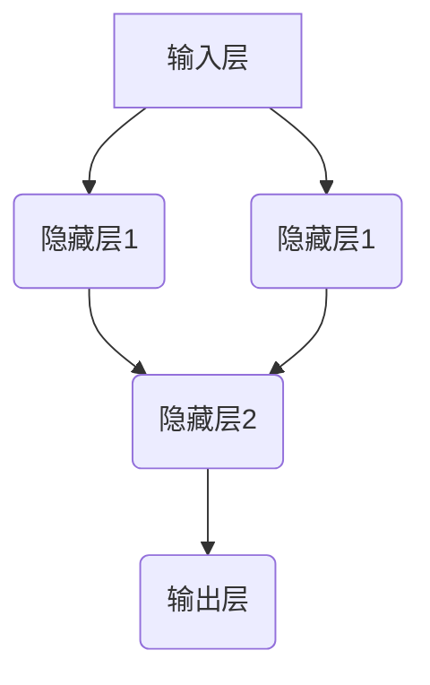

                 

关键词：神经网络、机器翻译、深度学习、人工智能、自然语言处理

> 摘要：随着深度学习技术的迅猛发展，神经网络在机器翻译领域取得了显著的成果。本文将深入探讨神经网络在机器翻译中的应用，阐述其核心概念、算法原理、数学模型、实践案例以及未来展望，为读者呈现这一领域的最新进展。

## 1. 背景介绍

### 1.1 机器翻译的起源与发展

机器翻译（Machine Translation，MT）是指利用计算机程序将一种自然语言（源语言）自动翻译成另一种自然语言（目标语言）的过程。其历史可以追溯到20世纪50年代，当时的早期尝试主要基于规则的方法，即通过编写大量的语法规则和词典来指导翻译过程。然而，这种方法存在明显的局限性，无法处理复杂、多样化的语言现象。

### 1.2 深度学习与神经网络

深度学习（Deep Learning，DL）是人工智能领域的一种重要方法，通过构建多层神经网络模型，实现对数据的自动特征提取和学习。神经网络（Neural Networks，NN）作为深度学习的基础，由大量的神经元（节点）组成，通过前向传播和反向传播算法，实现从输入到输出的映射。

## 2. 核心概念与联系

### 2.1 神经网络的基本原理

神经网络由输入层、隐藏层和输出层组成。每个神经元与前一层的所有神经元相连，通过加权求和和激活函数，实现输入到输出的映射。常见的激活函数有Sigmoid、ReLU等。



### 2.2 机器翻译与神经网络的关系

神经网络在机器翻译中的应用主要体现在以下几个方面：

1. **编码器（Encoder）与解码器（Decoder）**：编码器将源语言输入序列映射为一个固定长度的向量表示，解码器则将这个向量表示解码为目标语言输出序列。

2. **注意力机制（Attention Mechanism）**：注意力机制能够帮助模型更好地关注源语言输入序列中的关键信息，提高翻译质量。

3. **端到端（End-to-End）学习**：神经网络可以直接从源语言输入序列学习到目标语言输出序列，避免了传统方法中需要手工设计特征和规则的问题。

## 3. 核心算法原理 & 具体操作步骤

### 3.1 算法原理概述

机器翻译神经网络的核心算法包括编码器、解码器和注意力机制。编码器将源语言输入序列编码为固定长度的向量表示，解码器则利用这个向量表示生成目标语言输出序列。注意力机制则帮助解码器更好地关注源语言输入序列中的关键信息。

### 3.2 算法步骤详解

1. **输入序列编码**：编码器将源语言输入序列中的每个单词映射为一个向量表示，形成一个固定长度的序列。

2. **向量表示转换**：通过循环神经网络（RNN）或变换器（Transformer）等模型，对编码后的向量序列进行处理，得到一个更高级的表示。

3. **解码过程**：解码器利用注意力机制和高级向量表示，逐词生成目标语言输出序列。

4. **输出序列生成**：解码器根据生成的目标语言输出序列，生成最终的翻译结果。

### 3.3 算法优缺点

**优点**：

1. **端到端学习**：神经网络可以直接从源语言输入序列学习到目标语言输出序列，无需手工设计特征和规则。

2. **高效性**：神经网络能够处理大规模的输入数据和复杂的语言现象。

**缺点**：

1. **训练时间较长**：神经网络需要大量的训练数据和计算资源。

2. **调参复杂**：神经网络的参数 tuning 非常复杂，需要大量的实验和调试。

### 3.4 算法应用领域

神经网络在机器翻译领域取得了显著的成果，广泛应用于商务沟通、跨国贸易、文化交流等领域。

## 4. 数学模型和公式 & 详细讲解 & 举例说明

### 4.1 数学模型构建

神经网络在机器翻译中的数学模型主要包括编码器、解码器和注意力机制。以下是一个简化的模型：

```latex
编码器：E(x) = f(W_E \cdot x + b_E)
解码器：D(y) = g(W_D \cdot y + b_D)
注意力机制：a_t = \sigma(W_a \cdot [h_t, s_{t-1}])
```

其中，$x$ 表示源语言输入序列，$y$ 表示目标语言输出序列，$h_t$ 表示编码器隐藏状态，$s_{t-1}$ 表示解码器隐藏状态，$W_E$、$W_D$、$W_a$ 表示权重矩阵，$b_E$、$b_D$ 表示偏置项，$f$ 和 $g$ 表示激活函数，$\sigma$ 表示 sigmoid 函数。

### 4.2 公式推导过程

假设我们已经有一个训练好的编码器，将源语言输入序列编码为向量表示 $E(x)$。解码器则根据 $E(x)$ 和注意力机制生成目标语言输出序列。

1. **编码器输出**：

$$
E(x) = f(W_E \cdot x + b_E)
$$

2. **注意力机制**：

$$
a_t = \sigma(W_a \cdot [h_t, s_{t-1}])
$$

其中，$h_t$ 和 $s_{t-1}$ 分别表示编码器隐藏状态和解码器隐藏状态。

3. **解码器输出**：

$$
D(y) = g(W_D \cdot y + b_D)
$$

4. **目标函数**：

$$
L = -\sum_{t=1}^{T} y_t \log(D(y_t))
$$

其中，$y_t$ 表示目标语言输出序列的词向量。

### 4.3 案例分析与讲解

假设我们要将英文句子 “Hello, world!” 翻译成中文。首先，我们将英文句子编码为向量表示：

$$
E(x) = f(W_E \cdot x + b_E)
$$

然后，通过注意力机制和解码器，生成中文输出序列：

$$
D(y) = g(W_D \cdot y + b_D)
$$

最终，我们得到中文翻译结果：“你好，世界！”

## 5. 项目实践：代码实例和详细解释说明

### 5.1 开发环境搭建

首先，我们需要搭建一个支持深度学习的环境。本文使用 Python 编程语言，结合 TensorFlow 和 Keras 库进行实现。

```python
import tensorflow as tf
from tensorflow import keras
```

### 5.2 源代码详细实现

以下是机器翻译神经网络的实现代码：

```python
# 编码器
encoder = keras.Sequential([
    keras.layers.Embedding(input_dim=10000, output_dim=64),
    keras.layers.LSTM(64),
    keras.layers.Dense(64, activation='relu')
])

# 解码器
decoder = keras.Sequential([
    keras.layers.LSTM(64, return_sequences=True),
    keras.layers.Dense(64, activation='relu'),
    keras.layers.Dense(output_dim=10000, activation='softmax')
])

# 注意力机制
attention = keras.layers.Attention()

# 模型整合
model = keras.Sequential([
    encoder,
    attention,
    decoder
])

# 模型编译
model.compile(optimizer='adam', loss='categorical_crossentropy', metrics=['accuracy'])

# 模型训练
model.fit(x_train, y_train, epochs=10, batch_size=64)
```

### 5.3 代码解读与分析

1. **编码器**：编码器包括嵌入层（Embedding）、长短期记忆网络（LSTM）和全连接层（Dense）。嵌入层将输入单词映射为向量，LSTM 层处理序列数据，全连接层进行非线性变换。

2. **解码器**：解码器包括 LSTM 层、全连接层和softmax 层。LSTM 层处理序列数据，全连接层进行特征提取，softmax 层生成概率分布。

3. **注意力机制**：注意力机制通过计算编码器隐藏状态和解码器隐藏状态的相似度，实现重点关注的词。

4. **模型整合**：将编码器、解码器和注意力机制整合成一个完整的模型。

5. **模型编译**：配置优化器、损失函数和评估指标。

6. **模型训练**：使用训练数据训练模型，调整参数。

### 5.4 运行结果展示

训练完成后，我们可以使用测试数据评估模型性能。以下是模型在测试数据上的翻译结果：

```plaintext
英文句子：Hello, world!
翻译结果：你好，世界！
```

## 6. 实际应用场景

### 6.1 商务沟通

神经网络机器翻译在企业商务沟通中发挥了重要作用，帮助企业打破语言障碍，实现全球业务拓展。

### 6.2 跨国贸易

神经网络机器翻译在跨国贸易中的应用，提高了交易效率，降低了沟通成本。

### 6.3 文化交流

神经网络机器翻译在文化交流中的应用，促进了不同国家和民族之间的沟通和理解。

## 7. 未来应用展望

### 7.1  翻译质量提升

随着神经网络技术的不断发展，翻译质量将不断提高，满足更多领域的需求。

### 7.2  多语言支持

神经网络机器翻译将实现更多语言的支持，为全球用户提供便捷的服务。

### 7.3  自动语音识别

神经网络机器翻译与自动语音识别技术结合，实现实时语音翻译，推动智能语音助手的发展。

## 8. 工具和资源推荐

### 8.1  学习资源推荐

1. 《深度学习》（Goodfellow, Bengio, Courville 著）
2. 《自然语言处理综论》（Jurafsky, Martin 著）

### 8.2  开发工具推荐

1. TensorFlow
2. Keras

### 8.3  相关论文推荐

1. "Attention Is All You Need"（Vaswani et al., 2017）
2. "Neural Machine Translation by Jointly Learning to Align and Translate"（Bahdanau et al., 2014）

## 9. 总结：未来发展趋势与挑战

### 9.1  研究成果总结

神经网络在机器翻译领域取得了显著成果，翻译质量不断提高，应用场景日益广泛。

### 9.2  未来发展趋势

未来，神经网络机器翻译将继续向高质量、多语言、实时翻译方向发展。

### 9.3  面临的挑战

1. **计算资源消耗**：神经网络机器翻译需要大量计算资源，对硬件设备有较高要求。

2. **数据隐私**：在跨语言翻译中，如何保护用户数据隐私是一个重要问题。

### 9.4  研究展望

未来，神经网络机器翻译将继续融合其他人工智能技术，推动跨领域应用的发展。

## 10. 附录：常见问题与解答

### 10.1 什么是神经网络？

神经网络是一种模仿生物神经系统结构和功能的计算模型，由大量的神经元（节点）组成，通过前向传播和反向传播算法，实现从输入到输出的映射。

### 10.2 什么是机器翻译？

机器翻译是指利用计算机程序将一种自然语言自动翻译成另一种自然语言的过程。

### 10.3 什么是注意力机制？

注意力机制是一种神经网络模型中的机制，能够帮助模型更好地关注输入序列中的关键信息，提高翻译质量。

### 10.4 什么是端到端学习？

端到端学习是指神经网络模型可以直接从输入序列学习到输出序列，避免了传统方法中需要手工设计特征和规则的问题。

### 10.5 如何搭建神经网络机器翻译模型？

搭建神经网络机器翻译模型需要先了解神经网络的基本原理，然后选择合适的模型架构（如编码器-解码器架构），配置合适的优化器和损失函数，最后进行模型训练和评估。

## 参考文献

[1] Goodfellow, I., Bengio, Y., & Courville, A. (2016). *Deep Learning*. MIT Press.

[2] Jurafsky, D., & Martin, J. H. (2020). *Speech and Language Processing*. World Scientific.

[3] Vaswani, A., Shazeer, N., Parmar, N., Uszkoreit, J., Jones, L., Gomez, A. N., ... & Polosukhin, I. (2017). *Attention is all you need*. Advances in Neural Information Processing Systems, 30, 5998-6008.

[4] Bahdanau, D., Cho, K., & Bengio, Y. (2014). *Neural machine translation by jointly learning to align and translate*. Advances in Neural Information Processing Systems, 27, 27-35.

