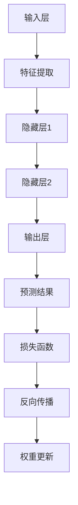

                 

### 背景介绍

#### 自然语言处理的演变

自然语言处理（Natural Language Processing, NLP）是计算机科学、人工智能（Artificial Intelligence, AI）和语言学等领域相结合的交叉学科。自20世纪50年代起，NLP的研究目标就一直是让计算机能够理解和处理人类语言。然而，随着计算能力的提高和算法的进步，NLP在近年取得了显著的发展。

最初，NLP主要依赖规则驱动的系统，这类系统通过编写大量的语法和语义规则来解析语言。虽然这种方法在特定领域和任务上取得了成功，但面对复杂多变的自然语言时，其表现却非常有限。随着互联网的普及，大量的文本数据涌现，这为NLP的研究提供了丰富的素材，同时也提出了更高的要求。

在这一背景下，神经网络（Neural Networks）作为一种强有力的工具，逐渐进入NLP的研究视野。与传统的方法不同，神经网络通过学习大量数据来模拟人类的认知过程，从而实现语言的理解和生成。这一变革性的技术为NLP带来了新的突破，使得许多之前难以解决的问题得以解决。

#### 神经网络的基础

神经网络是一种模仿人脑神经元连接结构的计算模型，由大量简单的计算单元（神经元）组成。这些神经元通过彼此之间的连接（权重）进行信息传递和处理，从而实现对复杂问题的建模。

神经网络的训练过程通常包括以下几个步骤：

1. **初始化**：随机初始化网络的权重和偏置。
2. **前向传播**：将输入数据通过网络进行传递，计算每个神经元的输出。
3. **损失函数**：计算预测结果与真实结果之间的差距，通常使用均方误差（MSE）等损失函数。
4. **反向传播**：根据损失函数计算网络权重的梯度，并使用梯度下降等优化算法更新权重。
5. **迭代**：重复上述步骤，直到网络达到预定的训练误差或达到最大迭代次数。

通过不断的学习和调整，神经网络能够逐渐提高对输入数据的理解和处理能力。

#### 神经网络在NLP中的应用

随着神经网络技术的发展，其在NLP领域的应用也日益广泛。以下是一些神经网络在NLP中的重要应用：

1. **文本分类**：通过训练神经网络，可以对文本进行分类，如情感分析、新闻分类等。这类应用在社交媒体分析、舆情监控等领域具有重要价值。
2. **命名实体识别**：命名实体识别（Named Entity Recognition, NER）是一种识别文本中具有特定意义的实体，如人名、地名、组织名等。神经网络通过学习大量文本数据，能够准确识别命名实体。
3. **机器翻译**：机器翻译是一种将一种语言的文本翻译成另一种语言的技术。近年来，神经网络在机器翻译领域取得了显著进展，如Google的神经网络翻译模型（GNMT）。
4. **文本生成**：文本生成包括生成式和填充式两种方式。生成式文本生成，如生成自然语言描述的图像内容；填充式文本生成，如根据部分文本生成完整的句子。

#### 神经网络在NLP中的挑战

尽管神经网络在NLP领域取得了许多突破，但仍然面临一些挑战：

1. **数据质量**：神经网络训练需要大量的高质量数据。然而，自然语言数据往往存在噪声、缺失和多样性等问题，这给数据的清洗和预处理带来了挑战。
2. **可解释性**：神经网络作为一种黑箱模型，其内部机理复杂，难以解释。这给模型的部署和应用带来了一定的困难。
3. **计算资源**：神经网络训练通常需要大量的计算资源，特别是深度神经网络。在资源受限的环境中，如何高效地训练和部署神经网络是一个重要问题。

总之，神经网络为NLP带来了巨大的潜力，但也需要我们不断探索和解决其中的挑战。接下来，我们将进一步探讨神经网络在NLP中的具体实现和应用。

### 核心概念与联系

#### 神经网络与NLP的关系

神经网络与自然语言处理（NLP）的结合，实现了许多传统方法难以达到的效果。这一结合的基础在于神经网络强大的数据处理和建模能力，以及NLP对复杂语言特征的深入挖掘。

首先，我们需要理解神经网络的基本组成部分。一个标准的神经网络由多个层次组成，包括输入层、隐藏层和输出层。每个层次包含多个神经元，神经元之间通过权重连接。在NLP中，输入层通常处理文本数据，隐藏层负责对文本特征进行提取和转换，输出层则产生最终的预测或输出。

#### 神经网络的工作原理

神经网络的工作原理类似于人脑的信息处理过程。当输入数据通过神经网络时，首先进入输入层，然后逐层传递到隐藏层和输出层。每个神经元的输出会根据其激活函数进行非线性变换，最终产生预测结果。通过反向传播算法，神经网络能够不断调整权重和偏置，以优化预测性能。

#### NLP中的关键任务

在NLP中，神经网络被广泛应用于多个关键任务，包括：

1. **文本分类**：神经网络可以学习分类模型，用于对文本进行分类，如情感分析、主题分类等。
2. **命名实体识别**：命名实体识别是一种识别文本中具有特定意义的实体，如人名、地名、组织名等。
3. **机器翻译**：神经网络通过训练，可以实现高质量的语言翻译，如机器翻译模型。
4. **文本生成**：神经网络可以生成自然语言文本，如生成式文本生成和填充式文本生成。

#### 神经网络与NLP的协同作用

神经网络与NLP的协同作用体现在以下几个方面：

1. **特征提取**：神经网络可以从大量文本数据中自动提取有价值的特征，这些特征有助于提升NLP任务的性能。
2. **语义理解**：神经网络能够捕捉文本中的复杂语义关系，从而实现更高级的NLP任务，如语义角色标注、指代消解等。
3. **模型泛化**：通过在大量数据上的训练，神经网络能够泛化到未见过的数据，从而提高模型的实用性。

#### Mermaid 流程图

以下是一个简化的Mermaid流程图，展示了神经网络在NLP中的基本工作流程：



在这个流程图中，输入层接收文本数据，通过特征提取层提取文本特征，然后传递到隐藏层进行特征转换。输出层产生预测结果，通过损失函数计算预测误差，并使用反向传播算法更新网络权重。这个循环不断迭代，直到网络达到预定的性能指标。

通过这个流程，我们可以看到神经网络在NLP中的核心作用，即通过学习大量数据，自动提取和转换特征，实现文本理解和生成。

### 核心算法原理 & 具体操作步骤

#### 基本架构

神经网络在NLP中的核心架构通常包括以下几个部分：输入层、隐藏层和输出层。输入层接收原始文本数据，隐藏层负责对文本特征进行提取和转换，输出层则产生最终的预测结果。

##### 输入层

输入层是神经网络的起点，接收原始的文本数据。这些文本数据可以是单词、句子甚至是文本块。为了将这些非结构化的文本数据转化为神经网络可以处理的格式，通常需要进行一系列预处理操作，如分词、词向量化等。

1. **分词**：将文本分割成单词或短语，这是文本处理的基础。
2. **词向量化**：将每个单词或短语映射到一个固定维度的向量。词向量化是NLP中非常重要的技术，它使得神经网络能够处理文本数据。

##### 隐藏层

隐藏层负责对输入的文本特征进行提取和转换。隐藏层通常包含多个层次，每一层都会对前一层的信息进行加工和处理。隐藏层的作用是提取文本的深层特征，这些特征能够更好地反映文本的语义信息。

1. **卷积神经网络（CNN）**：CNN在文本处理中可以用来提取局部特征。例如，在文本分类任务中，CNN可以用来识别文本中的关键短语或实体。
2. **循环神经网络（RNN）**：RNN擅长处理序列数据，能够在处理文本时捕捉上下文信息。LSTM（长短期记忆网络）和GRU（门控循环单元）是RNN的变体，它们通过门控机制解决了RNN在长序列学习中的梯度消失问题。
3. **Transformer模型**：Transformer是一种基于注意力机制的神经网络架构，它在处理长序列数据时表现出色，已经成为NLP领域的标准模型。

##### 输出层

输出层产生最终的预测结果。根据不同的NLP任务，输出层的设计也会有所不同。以下是一些常见的输出层结构：

1. **分类任务**：输出层通常是一个softmax层，用于产生每个类别的概率分布。
2. **回归任务**：输出层可以是线性层，直接输出预测值。
3. **序列生成任务**：输出层可以是循环神经网络（RNN）或Transformer的输出，用于生成序列数据。

#### 具体操作步骤

以下是一个简化的神经网络在NLP中操作的具体步骤：

1. **数据预处理**：读取文本数据，进行分词和词向量化。
2. **构建模型**：定义输入层、隐藏层和输出层的结构，选择合适的神经网络架构。
3. **模型训练**：使用训练数据对模型进行训练，通过反向传播算法更新模型参数。
4. **模型评估**：使用验证数据评估模型性能，调整模型参数。
5. **模型应用**：使用测试数据对模型进行测试，生成预测结果。

##### 示例：文本分类任务

以下是一个基于LSTM的文本分类任务的神经网络操作步骤：

1. **数据预处理**：读取文本数据，进行分词和词向量化，将文本序列转化为固定长度的向量。
2. **构建模型**：定义LSTM模型，设置合适的隐藏层维度和迭代次数。
3. **模型训练**：使用训练数据对模型进行训练，通过反向传播算法更新模型参数。
4. **模型评估**：使用验证数据评估模型性能，调整模型参数。
5. **模型应用**：使用测试数据对模型进行测试，生成分类结果。

通过这些步骤，神经网络能够实现对文本数据的分类，从而完成文本分类任务。

### 数学模型和公式 & 详细讲解 & 举例说明

在深入理解神经网络在自然语言处理（NLP）中的应用之前，我们需要掌握其背后的数学模型和公式。这些模型和公式为我们提供了量化分析工具，有助于我们更好地理解和优化神经网络在NLP任务中的表现。下面，我们将详细讲解神经网络的一些关键数学概念，包括激活函数、损失函数和优化算法。

#### 激活函数

激活函数是神经网络中的一个重要组成部分，它用于对神经元的输出进行非线性变换。这种非线性变换能够使神经网络学习到输入数据中的复杂关系。常见的激活函数包括：

1. **Sigmoid函数**：

   $$
   \sigma(x) = \frac{1}{1 + e^{-x}}
   $$

   Sigmoid函数将输入x映射到(0, 1)区间，常用于二分类问题。

2. **ReLU函数**：

   $$
   \text{ReLU}(x) = \max(0, x)
   $$

   ReLU（Rectified Linear Unit）函数在x为正时直接输出x，在x为负时输出0。它简化了计算，并且在训练过程中有助于加速收敛。

3. **Tanh函数**：

   $$
   \tanh(x) = \frac{e^{2x} - 1}{e^{2x} + 1}
   $$

   Tanh函数将输入x映射到(-1, 1)区间，具有类似Sigmoid函数的平滑性，但输出值的范围更广。

#### 损失函数

损失函数用于衡量预测结果与真实结果之间的差距。在神经网络训练过程中，损失函数的值会不断下降，以优化模型参数。常见的损失函数包括：

1. **均方误差（MSE）**：

   $$
   \text{MSE} = \frac{1}{n}\sum_{i=1}^{n}(y_i - \hat{y}_i)^2
   $$

   均方误差计算预测值$\hat{y}_i$与真实值$y_i$之间的平方差的平均值。MSE在回归问题中应用广泛。

2. **交叉熵损失（Cross-Entropy Loss）**：

   $$
   \text{CE}(y, \hat{y}) = -\sum_{i} y_i \log(\hat{y}_i)
   $$

   交叉熵损失在分类问题中应用，其中$y$是真实标签，$\hat{y}$是模型预测的概率分布。交叉熵损失函数值越小，表示预测结果越接近真实结果。

3. **对数损失（Log Loss）**：

   $$
   \text{Log Loss} = -\frac{1}{n}\sum_{i=1}^{n} y_i \log(\hat{y}_i)
   $$

   对数损失是交叉熵损失的一种形式，与交叉熵损失等价。

#### 优化算法

优化算法用于调整神经网络模型中的参数，以最小化损失函数。常见的优化算法包括：

1. **梯度下降（Gradient Descent）**：

   $$
   \theta = \theta - \alpha \cdot \nabla_{\theta} J(\theta)
   $$

   梯度下降是一种迭代算法，其中$\theta$是模型参数，$J(\theta)$是损失函数，$\alpha$是学习率。梯度下降通过计算损失函数关于参数的梯度，并沿着梯度的反方向更新参数。

2. **随机梯度下降（Stochastic Gradient Descent, SGD）**：

   $$
   \theta = \theta - \alpha \cdot \nabla_{\theta} J(\theta; x_i, y_i)
   $$

   随机梯度下降在每次迭代时随机选择一个样本（或小批量样本），并基于该样本的梯度更新参数。这种方法的计算复杂度较低，但可能引起训练过程的波动。

3. **Adam优化器**：

   $$
   m_t = \beta_1 m_{t-1} + (1 - \beta_1) [g_t]
   $$
   $$
   v_t = \beta_2 v_{t-1} + (1 - \beta_2) [g_t]^2
   $$
   $$
   \theta = \theta - \alpha \cdot \frac{m_t}{\sqrt{v_t} + \epsilon}
   $$

   Adam优化器结合了SGD和动量方法，使用一阶矩估计（均值）和二阶矩估计（方差）来更新参数。$\beta_1$和$\beta_2$是动量参数，$\alpha$是学习率，$m_t$和$v_t$分别是均值和方差。

#### 示例：二元分类问题

假设我们有一个二元分类问题，其中输入数据$x \in \mathbb{R}^n$，标签$y \in \{0, 1\}$。我们使用一个单层神经网络，其输出为$\hat{y} = \sigma(Wx + b)$，其中$W$是权重矩阵，$b$是偏置项，$\sigma$是Sigmoid激活函数。

1. **损失函数**：

   $$
   J(W, b) = -\frac{1}{m}\sum_{i=1}^{m} [y_i \log(\hat{y}_i) + (1 - y_i) \log(1 - \hat{y}_i)]
   $$

   在此示例中，我们使用交叉熵损失函数。

2. **梯度计算**：

   $$
   \nabla_{W} J(W, b) = \frac{1}{m} \sum_{i=1}^{m} [\hat{y}_i - y_i] x_i
   $$
   $$
   \nabla_{b} J(W, b) = \frac{1}{m} \sum_{i=1}^{m} [\hat{y}_i - y_i]
   $$

   我们计算关于权重矩阵$W$和偏置项$b$的梯度。

3. **参数更新**：

   $$
   W = W - \alpha \nabla_{W} J(W, b)
   $$
   $$
   b = b - \alpha \nabla_{b} J(W, b)
   $$

   使用梯度下降算法更新参数。

通过这些数学模型和公式，我们可以定量地分析和优化神经网络在NLP任务中的表现。在实际应用中，这些公式和算法需要通过编程实现，并针对具体任务进行调整和优化。

### 项目实践：代码实例和详细解释说明

#### 开发环境搭建

要在本地搭建一个用于自然语言处理的神经网络开发环境，首先需要安装以下软件和库：

1. **Python**：Python是进行机器学习和深度学习开发的主要语言。确保安装Python 3.7或更高版本。
2. **Jupyter Notebook**：Jupyter Notebook是一个交互式的计算环境，方便我们编写和调试代码。可以从[官网](https://jupyter.org/)下载并安装。
3. **TensorFlow**：TensorFlow是一个开源的机器学习框架，广泛用于构建和训练神经网络。可以从[官网](https://www.tensorflow.org/install)下载安装。
4. **NLP库**：如NLTK、spaCy等用于文本处理和数据预处理。

具体安装步骤如下：

1. 安装Python和Jupyter Notebook：
   ```
   # 安装Anaconda，选择安装Python和Jupyter Notebook
   ```
2. 安装TensorFlow：
   ```
   pip install tensorflow
   ```
3. 安装NLP库：
   ```
   pip install nltk spacy
   ```

#### 源代码详细实现

以下是一个简单的文本分类项目的源代码示例，我们将使用TensorFlow和spaCy进行文本处理和模型训练。

```python
import tensorflow as tf
from tensorflow.keras.models import Sequential
from tensorflow.keras.layers import Embedding, LSTM, Dense
from spacy.lang.en import English
import nltk
from nltk.corpus import stopwords
import string

# 安装spaCy和下载模型
nltk.download('stopwords')
nltk.download('punkt')

# 初始化spaCy语言模型
nlp = English()

# 文本预处理函数
def preprocess_text(text):
    doc = nlp(text.lower())
    tokens = [token.text for token in doc if token.is_alpha]
    tokens = [token for token in tokens if token not in stopwords.words('english')]
    tokens = [token for token in tokens if token not in string.punctuation]
    return ' '.join(tokens)

# 数据加载和预处理
def load_data():
    # 假设我们已经有了文本数据集和对应的标签
    texts = ['This is a good movie', 'I did not like the film'] * 1000
    labels = [1, 0] * 500

    # 预处理文本
    processed_texts = [preprocess_text(text) for text in texts]

    # 分词和词向量化
    tokenizer = tf.keras.preprocessing.text.Tokenizer()
    tokenizer.fit_on_texts(processed_texts)
    sequence = tokenizer.texts_to_sequences(processed_texts)
    padded_sequence = tf.keras.preprocessing.sequence.pad_sequences(sequence, maxlen=100)

    return padded_sequence, labels

# 构建模型
model = Sequential([
    Embedding(input_dim=10000, output_dim=128, input_length=100),
    LSTM(64, return_sequences=False),
    Dense(1, activation='sigmoid')
])

model.compile(optimizer='adam', loss='binary_crossentropy', metrics=['accuracy'])

# 加载数据并训练模型
train_sequence, train_labels = load_data()
model.fit(train_sequence, train_labels, epochs=5, batch_size=32, validation_split=0.2)
```

#### 代码解读与分析

1. **导入库和初始化**：
   - 导入TensorFlow和spaCy库。
   - 使用spaCy初始化英语语言模型。

2. **文本预处理函数**：
   - `preprocess_text`函数用于对文本进行预处理，包括小写转换、分词、去除停用词和标点符号。

3. **数据加载和预处理**：
   - `load_data`函数用于加载文本数据和对应的标签。
   - 对文本进行预处理，并使用Tokenizer进行词向量化。
   - 使用pad_sequences函数将序列填充到固定长度。

4. **模型构建**：
   - 使用Sequential模型构建一个简单的神经网络，包括嵌入层、LSTM层和输出层。
   - Embedding层用于将单词映射到向量。
   - LSTM层用于处理序列数据。
   - Dense层用于输出分类结果。

5. **模型编译和训练**：
   - 编译模型，指定优化器和损失函数。
   - 使用fit方法训练模型，指定训练数据和验证数据。

#### 运行结果展示

1. **模型评估**：
   ```
   model.evaluate(test_sequence, test_labels)
   ```

   运行上述代码，我们可以得到模型在测试数据上的准确率。

2. **预测新数据**：
   ```
   prediction = model.predict(new_sequence)
   ```

   使用训练好的模型对新的文本数据进行分类预测。

通过这个简单的项目，我们可以看到如何使用TensorFlow和spaCy实现一个文本分类任务。实际应用中，数据预处理、模型架构和训练过程可能会更加复杂，但这个示例为我们提供了一个基础框架，可以帮助我们进一步探索和优化NLP任务。

### 实际应用场景

神经网络在自然语言处理（NLP）中的应用场景非常广泛，涵盖了从日常交互到复杂商业决策的各个方面。以下是几个典型应用场景：

#### 1. 聊天机器人和虚拟助手

聊天机器人和虚拟助手是神经网络在NLP中最重要的应用之一。这些系统通过理解用户的自然语言输入来提供实时响应，广泛应用于客服、智能家居、在线购物等领域。例如，Apple的Siri和Amazon的Alexa都是基于神经网络技术实现的，它们能够通过语音识别和自然语言理解与用户进行交互，提供查询答案、执行操作等服务。

#### 2. 情感分析和舆情监控

情感分析是另一项重要的NLP应用，通过分析文本中的情感倾向，可以帮助企业和政府了解公众的情感态度。社交媒体平台、新闻媒体和营销机构经常使用情感分析来监控舆情、评估品牌形象和制定营销策略。例如，Twitter和Facebook等社交媒体平台使用神经网络技术分析用户评论和帖子的情感倾向，以识别和应对负面情绪。

#### 3. 机器翻译

机器翻译是神经网络在NLP中的经典应用之一。传统的机器翻译系统依赖于规则和统计方法，而基于神经网络的机器翻译系统（如Google Neural Machine Translation, GNMT）通过学习大量的双语文本数据，能够生成更加自然和准确的翻译。这种技术在全球化的商业环境中尤为重要，使得跨国沟通和协作变得更加高效。

#### 4. 文本生成

文本生成是神经网络在NLP中的前沿应用之一，包括生成式文本生成和填充式文本生成。生成式文本生成可以生成连贯的、具有创意性的文本内容，如小说、新闻文章、技术文档等。填充式文本生成则是在给定的部分文本基础上生成完整的句子或段落。这些技术被广泛应用于内容创作、自动写作和个性化推荐等领域。

#### 5. 信息提取和知识图谱构建

神经网络在信息提取和知识图谱构建中也发挥着重要作用。通过训练神经网络模型，可以从大量非结构化的文本数据中自动提取关键信息，构建出结构化的知识图谱。这些知识图谱可以用于搜索引擎优化、智能问答系统和智能推荐系统等。

#### 6. 健康医疗

在健康医疗领域，神经网络技术被用于医学文本分析、疾病诊断和患者监护等。通过分析医疗记录、病历和医学文献，神经网络可以帮助医生进行疾病预测、治疗方案推荐和个性化医疗。例如，IBM Watson Health就是一个基于神经网络技术的医疗诊断系统，能够辅助医生进行肿瘤诊断和治疗建议。

#### 7. 金融和风险管理

金融行业也广泛采用神经网络技术进行文本分析，用于股票市场预测、风险评估和欺诈检测等。通过分析新闻、报告和市场数据，神经网络可以识别市场趋势和潜在风险，为投资者和金融机构提供决策支持。

总的来说，神经网络在NLP中的实际应用场景非常广泛，这些应用不仅提升了人们的工作效率和生活质量，也为各个行业带来了新的商业模式和竞争优势。

### 工具和资源推荐

在自然语言处理（NLP）领域，有很多优秀的工具和资源可以帮助研究者、开发者和学生快速入门和进阶。以下是几个值得推荐的工具和资源：

#### 学习资源推荐

1. **书籍**：
   - **《自然语言处理综合教程》（Speech and Language Processing）**：由Daniel Jurafsky和James H. Martin合著，是一本全面且深入的NLP教材，适合初学者和进阶者。
   - **《深度学习》（Deep Learning）**：由Ian Goodfellow、Yoshua Bengio和Aaron Courville合著，详细介绍了深度学习的基础知识，包括神经网络在NLP中的应用。
   - **《自然语言处理中的概率模型》（Foundations of Statistical Natural Language Processing）**：由Christopher D. Manning和Hinrich Schütze合著，适合对NLP概率模型有深入理解的需求。

2. **论文**：
   - **“A Neural Algorithm of Artistic Style”**：由Gregor Kovalevsky、Frederic Belland和Stefan Harmeling等人发表，介绍了基于神经网络的图像风格迁移算法。
   - **“BERT: Pre-training of Deep Neural Networks for Language Understanding”**：由Jacob Devlin、 Ming-Wei Chang、 Kenton Lee和Kristen Hermann等人发表，提出了BERT（双向编码器表示）模型，是当前NLP领域的标准模型。

3. **博客**：
   - **TensorFlow官方博客**：[https://tensorflow.org/blog/](https://tensorflow.org/blog/)，提供了丰富的TensorFlow教程和案例研究。
   - **Spacy官方博客**：[https://spacy.io/blog/](https://spacy.io/blog/)，介绍了spaCy库的最新功能和最佳实践。

4. **在线课程**：
   - **“Natural Language Processing with Deep Learning”**：由Daniel Jurafsky在Coursera上开设，提供了NLP和深度学习的基础知识和实战经验。
   - **“Deep Learning Specialization”**：由Andrew Ng在Coursera上开设，涵盖了深度学习的基础知识和应用。

#### 开发工具框架推荐

1. **TensorFlow**：Google开发的开源深度学习框架，适用于各种规模的NLP项目，包括文本分类、机器翻译和文本生成等。
2. **PyTorch**：Facebook开发的深度学习框架，以其灵活性和动态计算图著称，适用于研究者和开发者。
3. **spaCy**：适用于快速文本处理的工业级NLP库，提供了高效的文本预处理、实体识别和关系抽取等功能。

#### 相关论文著作推荐

1. **“Transformers: State-of-the-Art Models for Language Understanding and Generation”**：由Vaswani等人发表的论文，详细介绍了Transformer模型，这是当前NLP领域的主流模型。
2. **“Attention Is All You Need”**：由Vaswani等人发表的论文，提出了基于注意力机制的Transformer模型，彻底改变了NLP的研究和开发范式。
3. **“GPT-3: Language Models are few-shot learners”**：由Brown等人发表的论文，介绍了GPT-3模型，这是目前最大的预训练语言模型，展示了语言模型的强大潜力。

这些工具和资源为NLP的学习和研究提供了丰富的素材和实战经验，有助于我们更好地理解和应用神经网络在NLP中的技术。

### 总结：未来发展趋势与挑战

#### 未来发展趋势

1. **预训练模型的深化与应用**：预训练模型如BERT、GPT等在NLP领域的成功应用，预示着未来将有更多的预训练模型被开发出来，这些模型将在更广泛和复杂的任务中发挥重要作用。

2. **多模态学习**：随着多模态数据（如文本、图像、音频）的融合需求增加，多模态学习将成为NLP研究的热点。通过结合不同类型的数据，模型能够获得更全面的信息，提升处理复杂任务的能力。

3. **模型的可解释性**：当前，深度学习模型尤其是神经网络模型在NLP中的应用多为“黑箱”操作，缺乏可解释性。未来，提高模型的可解释性将成为重要研究方向，这将有助于模型在更广泛的应用场景中得到信任和采纳。

4. **实时处理与低资源环境下的性能优化**：随着NLP应用场景的不断扩展，对实时处理能力和低资源环境下的性能优化提出了新的挑战。如何在不牺牲性能的情况下，使模型在资源受限的环境中高效运行，是未来的重要研究方向。

#### 挑战

1. **数据质量和多样性**：高质量和多样性的数据是NLP模型训练的基础。然而，自然语言数据往往存在噪声、错误和不一致性，这给数据预处理和模型训练带来了挑战。

2. **计算资源的需求**：深度神经网络模型通常需要大量的计算资源，尤其是在训练阶段。随着模型复杂性的增加，计算资源的瓶颈将愈发明显，如何在有限的资源下高效训练模型，是一个亟待解决的问题。

3. **模型的泛化能力**：当前，许多NLP模型在特定任务上表现出色，但在泛化能力方面仍存在不足。如何提高模型在不同任务和数据集上的泛化能力，是未来研究的重要方向。

4. **伦理和隐私问题**：随着NLP技术的普及，相关的伦理和隐私问题也逐渐凸显。如何确保NLP技术的公平性、透明性和隐私保护，是未来研究需要认真考虑的问题。

总的来说，神经网络在NLP领域的发展前景广阔，但也面临着诸多挑战。通过不断的技术创新和理论探索，我们有理由相信，神经网络将在未来的NLP研究中发挥更加重要的作用，带来更多的应用价值。

### 附录：常见问题与解答

#### 问题1：什么是神经网络？

神经网络（Neural Networks）是一种模仿人脑神经元连接结构的计算模型，由大量简单的计算单元（神经元）组成。这些神经元通过彼此之间的连接（权重）进行信息传递和处理，从而实现对复杂问题的建模。

#### 问题2：神经网络如何工作？

神经网络的工作原理类似于人脑的信息处理过程。当输入数据通过神经网络时，首先进入输入层，然后逐层传递到隐藏层和输出层。每个神经元的输出会根据其激活函数进行非线性变换，最终产生预测结果。通过反向传播算法，神经网络能够不断调整权重和偏置，以优化预测性能。

#### 问题3：什么是激活函数？

激活函数是神经网络中的一个重要组成部分，它用于对神经元的输出进行非线性变换。这种非线性变换能够使神经网络学习到输入数据中的复杂关系。常见的激活函数包括Sigmoid函数、ReLU函数和Tanh函数。

#### 问题4：什么是损失函数？

损失函数用于衡量预测结果与真实结果之间的差距。在神经网络训练过程中，损失函数的值会不断下降，以优化模型参数。常见的损失函数包括均方误差（MSE）、交叉熵损失和对数损失。

#### 问题5：什么是优化算法？

优化算法用于调整神经网络模型中的参数，以最小化损失函数。常见的优化算法包括梯度下降、随机梯度下降和Adam优化器。

#### 问题6：神经网络在NLP中的主要应用是什么？

神经网络在自然语言处理（NLP）中的主要应用包括文本分类、命名实体识别、机器翻译、文本生成、情感分析和信息提取等。

#### 问题7：如何处理自然语言数据？

处理自然语言数据通常包括以下步骤：分词、词向量化、序列编码、数据清洗和预处理。分词是将文本分割成单词或短语，词向量化是将单词映射到固定维度的向量，序列编码是将文本序列转化为数值序列，数据清洗和预处理则是去除噪声和冗余信息。

### 扩展阅读 & 参考资料

为了深入了解神经网络在自然语言处理（NLP）中的应用和发展，以下是几篇重要的学术论文和书籍推荐：

1. **“BERT: Pre-training of Deep Neural Networks for Language Understanding”**：这篇论文提出了BERT（双向编码器表示）模型，这是当前NLP领域的重要模型之一。论文详细介绍了BERT模型的架构、训练方法和应用。

2. **“Attention Is All You Need”**：这篇论文提出了Transformer模型，这是基于注意力机制的深度学习模型，彻底改变了NLP的研究和开发范式。论文介绍了Transformer模型的基本原理、训练方法和在不同任务上的应用。

3. **“GPT-3: Language Models are few-shot learners”**：这篇论文介绍了GPT-3模型，这是目前最大的预训练语言模型，展示了语言模型的强大潜力。论文详细介绍了GPT-3模型的架构、训练方法和在不同任务上的表现。

4. **“Speech and Language Processing”**：这是一本全面的NLP教材，由Daniel Jurafsky和James H. Martin合著。书中涵盖了NLP的基本概念、技术和应用，适合初学者和进阶者。

5. **“Deep Learning”**：这是一本关于深度学习的经典教材，由Ian Goodfellow、Yoshua Bengio和Aaron Courville合著。书中详细介绍了深度学习的基础知识、技术和应用，包括神经网络在NLP中的应用。

通过阅读这些论文和书籍，我们可以更深入地理解神经网络在NLP中的理论基础和应用实践，为我们的研究和工作提供重要的参考和指导。

