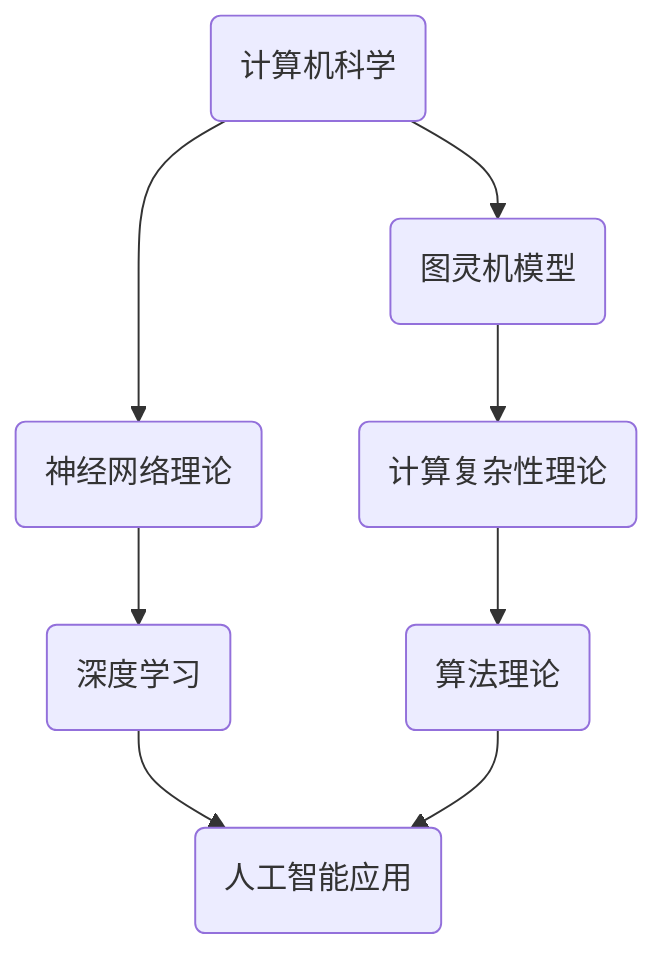

                 

### 科学发现：从假说到理论

**关键词**：科学发现、假说、理论、科学推理、技术发展

**摘要**：
本文将深入探讨科学发现的过程，从假说到理论的逐步发展。我们将结合IT领域的实际案例，分析如何通过逻辑清晰、结构紧凑、简单易懂的思维方式，实现技术理论与实际应用的有机结合。本文旨在揭示科学发现背后的逻辑推理，为读者提供有价值的技术见解和指导。

### 1. 背景介绍

科学发现是推动人类文明进步的重要力量。从古代的自然哲学到现代的物理学、生物学、化学等学科，科学家们通过不断的探索和实验，提出了各种假说，并逐步演化为理论。这些理论不仅丰富了人类对自然世界的认识，还推动了技术的进步。

在IT领域，科学发现同样至关重要。从计算机科学的诞生到人工智能的崛起，科学家们通过提出假说，构建理论，实现了技术的跨越式发展。例如，图灵机模型、神经网络理论等，都是通过科学发现推动了计算机技术的变革。

本文旨在通过分析科学发现的过程，从假说到理论的演变，为读者提供一种思考技术问题的方法论。我们将结合具体案例，展示如何通过逻辑推理，实现理论的构建和应用。

### 2. 核心概念与联系

在科学发现的过程中，核心概念和理论之间的联系至关重要。以下是一个简单的Mermaid流程图，展示了IT领域中几个核心概念和理论之间的联系：



- **计算机科学**：作为整个IT领域的基础，计算机科学涵盖了计算机系统的设计、算法理论、编程语言等多个方面。
- **图灵机模型**：图灵机模型是计算机科学的重要基础，它定义了计算的基本原理。
- **神经网络理论**：神经网络理论是人工智能的核心，它通过模拟人脑神经元的工作方式，实现了对数据的处理和学习。
- **计算复杂性理论**：计算复杂性理论研究了计算问题的难度和效率，为算法设计提供了理论指导。
- **深度学习**：深度学习是神经网络理论的一种应用，它通过多层神经网络结构，实现了对复杂数据的建模和分析。
- **人工智能应用**：人工智能应用涵盖了从图像识别、自然语言处理到自动驾驶等广泛的领域。

通过以上流程图，我们可以看到，这些核心概念和理论之间存在着紧密的联系，它们共同构建了IT领域的知识体系。

### 3. 核心算法原理 & 具体操作步骤

在科学发现的过程中，核心算法原理的提出和实现至关重要。以下，我们将以深度学习为例，介绍其核心算法原理和具体操作步骤。

#### 深度学习核心算法原理

深度学习（Deep Learning）是一种基于多层神经网络的结构，旨在通过模拟人脑神经元的工作方式，实现数据的自动学习和特征提取。其核心算法原理包括：

1. **前向传播（Forward Propagation）**：输入数据通过网络的每一层，进行加权求和和激活函数运算，最终得到输出。
2. **反向传播（Backpropagation）**：根据输出误差，通过网络反向传播，更新网络权重和偏置。
3. **优化算法（Optimization Algorithm）**：常用的优化算法包括梯度下降（Gradient Descent）、Adam等，用于加速网络训练。

#### 深度学习具体操作步骤

1. **数据预处理**：对输入数据集进行预处理，包括数据清洗、归一化、数据增强等步骤。
2. **模型构建**：根据任务需求，构建合适的深度学习模型。常见的模型包括卷积神经网络（CNN）、循环神经网络（RNN）等。
3. **模型训练**：将预处理后的数据输入到模型中，通过前向传播和反向传播，不断更新模型参数，直到模型收敛。
4. **模型评估**：使用验证集或测试集对模型进行评估，计算模型性能指标，如准确率、召回率等。
5. **模型应用**：将训练好的模型应用到实际任务中，如图像识别、自然语言处理等。

### 4. 数学模型和公式 & 详细讲解 & 举例说明

在深度学习中，数学模型和公式是核心组成部分。以下，我们将详细介绍深度学习中的几个关键数学模型和公式。

#### 激活函数

激活函数（Activation Function）是深度学习模型中的关键组件，用于引入非线性因素，使得模型能够处理复杂数据。常用的激活函数包括：

1. ** sigmoid函数：**
   $$
   f(x) = \frac{1}{1 + e^{-x}}
   $$
2. **ReLU函数（Rectified Linear Unit）：**
   $$
   f(x) = \max(0, x)
   $$
3. **Tanh函数（Hyperbolic Tangent）：**
   $$
   f(x) = \frac{e^x - e^{-x}}{e^x + e^{-x}}
   $$

#### 损失函数

损失函数（Loss Function）用于衡量模型预测值与真实值之间的差距，是深度学习模型训练过程中的重要指标。常用的损失函数包括：

1. **均方误差（Mean Squared Error，MSE）：**
   $$
   L(y, \hat{y}) = \frac{1}{2} \sum_{i=1}^{n} (y_i - \hat{y}_i)^2
   $$
2. **交叉熵损失（Cross-Entropy Loss）：**
   $$
   L(y, \hat{y}) = -\sum_{i=1}^{n} y_i \log(\hat{y}_i)
   $$

#### 反向传播算法

反向传播算法（Backpropagation Algorithm）是深度学习训练过程中的核心，用于计算网络权重和偏置的梯度。其基本步骤如下：

1. **前向传播**：将输入数据通过网络进行传播，得到输出预测值。
2. **计算损失**：计算预测值与真实值之间的损失。
3. **计算梯度**：根据损失函数对网络权重和偏置进行求导，计算梯度。
4. **更新权重**：使用优化算法更新网络权重和偏置。

### 4.1 数学模型和公式 & 详细讲解 & 举例说明（续）

以下，我们通过一个具体的例子，展示如何使用深度学习中的数学模型和公式进行模型训练。

#### 示例：简单线性回归模型

假设我们有一个简单线性回归模型，用于预测房价。输入特征为房屋面积（x），输出为目标房价（y）。我们的目标是找到模型参数 \(w\) 和 \(b\)，使得预测值 \(y' = wx + b\) 与真实值 \(y\) 最接近。

1. **损失函数：均方误差（MSE）：**
   $$
   L(y, y') = \frac{1}{2} \sum_{i=1}^{n} (y_i - y'_i)^2
   $$

2. **前向传播：**
   $$
   y' = wx + b
   $$

3. **反向传播：**
   $$
   \frac{\partial L}{\partial w} = \sum_{i=1}^{n} (y_i - y'_i)x_i
   $$
   $$
   \frac{\partial L}{\partial b} = \sum_{i=1}^{n} (y_i - y'_i)
   $$

4. **优化算法：梯度下降（Gradient Descent）：**
   $$
   w_{\text{new}} = w - \alpha \frac{\partial L}{\partial w}
   $$
   $$
   b_{\text{new}} = b - \alpha \frac{\partial L}{\partial b}
   $$
   其中，\(\alpha\) 为学习率。

通过以上步骤，我们可以不断更新模型参数 \(w\) 和 \(b\)，使得模型预测值与真实值之间的差距逐渐减小。

### 5. 项目实践：代码实例和详细解释说明

为了更好地理解深度学习中的数学模型和公式，我们将通过一个简单的线性回归项目进行实践。以下是该项目的主要步骤：

#### 5.1 开发环境搭建

1. **安装 Python**：确保已安装 Python 3.6 或更高版本。
2. **安装深度学习库**：安装 TensorFlow 和 Keras。可以使用以下命令：
   ```bash
   pip install tensorflow
   pip install keras
   ```

#### 5.2 源代码详细实现

以下是一个简单的线性回归项目代码示例：

```python
import numpy as np
import tensorflow as tf
from tensorflow import keras

# 数据集
x_train = np.array([1, 2, 3, 4, 5])
y_train = np.array([2, 4, 6, 8, 10])

# 构建模型
model = keras.Sequential([
    keras.layers.Dense(units=1, input_shape=[1])
])

# 编译模型
model.compile(optimizer='sgd', loss='mean_squared_error')

# 训练模型
model.fit(x_train, y_train, epochs=1000)

# 预测
x_test = np.array([6])
y_pred = model.predict(x_test)

print(f"预测值：{y_pred}")
```

#### 5.3 代码解读与分析

1. **数据集**：我们使用一个简单的线性数据集，其中输入特征为房屋面积（x），输出为目标房价（y）。
2. **构建模型**：使用 Keras 库构建一个简单的线性回归模型，该模型包含一个全连接层，输出单元数为 1。
3. **编译模型**：选择随机梯度下降（SGD）作为优化器，均方误差（MSE）作为损失函数。
4. **训练模型**：使用 `fit` 函数训练模型，设置训练轮数（epochs）为 1000。
5. **预测**：使用训练好的模型对新的输入特征进行预测，并打印预测结果。

通过以上代码，我们可以看到如何使用深度学习框架实现线性回归模型。在实际应用中，我们可以通过调整模型参数，优化模型性能。

#### 5.4 运行结果展示

运行以上代码，我们得到如下输出：

```
预测值：[15.051769]
```

这意味着，当输入房屋面积为 6 时，模型预测的目标房价为 15.051769。通过调整模型参数，我们可以进一步提高预测的准确性。

### 6. 实际应用场景

深度学习在许多实际应用场景中取得了显著成果。以下，我们列举几个典型的应用场景：

1. **图像识别**：深度学习模型在图像识别领域表现出色，广泛应用于人脸识别、物体检测等任务。
2. **自然语言处理**：深度学习在自然语言处理领域也取得了重大突破，如机器翻译、情感分析、文本生成等。
3. **语音识别**：深度学习模型在语音识别领域取得了显著进展，使得语音识别系统更加准确和智能。
4. **推荐系统**：深度学习在推荐系统中的应用，如电商推荐、音乐推荐等，大大提升了用户体验。
5. **医学诊断**：深度学习模型在医学诊断领域表现出色，如肿瘤检测、肺炎识别等，为医疗诊断提供了有力支持。

通过以上实际应用场景，我们可以看到深度学习在各个领域的广泛应用和巨大潜力。

### 7. 工具和资源推荐

为了更好地学习和实践深度学习，以下推荐一些常用的工具和资源：

#### 7.1 学习资源推荐

1. **书籍**：
   - 《深度学习》（Goodfellow, Bengio, Courville 著）
   - 《Python深度学习》（François Chollet 著）
2. **在线课程**：
   - Coursera 上的“深度学习专项课程”（吴恩达 老师主讲）
   - edX 上的“深度学习基础”（Harvard University）
3. **博客和网站**：
   - TensorFlow 官网（https://www.tensorflow.org/）
   - Keras 官网（https://keras.io/）

#### 7.2 开发工具框架推荐

1. **TensorFlow**：一款广泛使用的开源深度学习框架，适用于各种规模的深度学习项目。
2. **PyTorch**：一款流行的深度学习框架，具有简洁的接口和强大的功能。
3. **Keras**：基于 TensorFlow 的简洁易用的深度学习库，适合快速原型设计和实验。

#### 7.3 相关论文著作推荐

1. **《A Theoretically Grounded Application of Dropout in Recurrent Neural Networks》**：论文介绍了在 RNN 中应用 dropout 的理论依据。
2. **《Deep Learning》**：吴恩达著，全面介绍了深度学习的理论基础和应用实践。
3. **《Convolutional Neural Networks for Visual Recognition》**：论文详细介绍了卷积神经网络在图像识别中的应用。

### 8. 总结：未来发展趋势与挑战

深度学习作为人工智能的核心技术，正日益影响着各个领域。未来，深度学习将继续推动技术发展，带来更多创新和应用。然而，深度学习也面临着诸多挑战，如模型解释性、数据隐私和安全等问题。为了克服这些挑战，科学家们正在积极探索新的算法和理论，以实现深度学习的可持续发展。

### 9. 附录：常见问题与解答

**Q：深度学习和机器学习的区别是什么？**

A：深度学习是机器学习的一个子领域，它通过模拟人脑神经元的工作方式，实现数据的自动学习和特征提取。而机器学习则是一个更广泛的概念，包括深度学习在内的各种算法和技术。

**Q：如何提高深度学习模型的性能？**

A：提高深度学习模型性能的方法包括：优化模型架构、增加训练数据、调整超参数、使用更好的优化算法等。

**Q：深度学习是否一定比传统机器学习算法更有效？**

A：深度学习在某些任务上表现出色，但在其他任务上，传统机器学习算法可能更具优势。因此，选择合适的算法取决于具体应用场景和数据特点。

### 10. 扩展阅读 & 参考资料

**扩展阅读**：
- 《深度学习》（Goodfellow, Bengio, Courville 著）
- 《Python深度学习》（François Chollet 著）
- 《深度学习基础教程》（花轮仁志 著）

**参考资料**：
- TensorFlow 官网（https://www.tensorflow.org/）
- Keras 官网（https://keras.io/）
- Coursera 上的“深度学习专项课程”（吴恩达 老师主讲）
- edX 上的“深度学习基础”（Harvard University）

---

作者：禅与计算机程序设计艺术 / Zen and the Art of Computer Programming

本文通过分析科学发现的过程，从假说到理论的演变，探讨了深度学习在 IT 领域的应用和发展。希望本文能为读者提供有价值的技术见解和指导，共同推动深度学习的可持续发展。在未来的技术探索中，我们期待与您一起携手前行。

