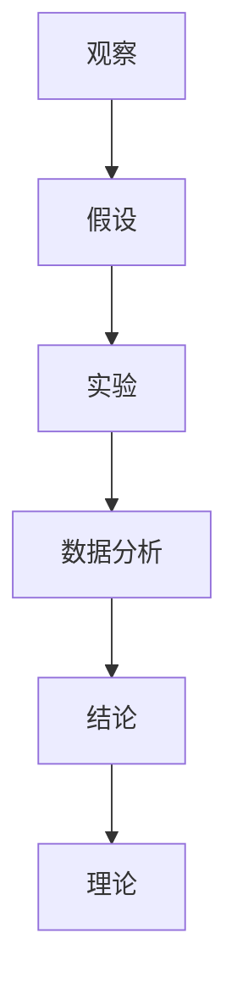

                 

### 1. 背景介绍

科学方法作为现代科学的基石，早在古希腊时期便开始形成雏形。亚里士多德和柏拉图等哲学家提出了通过观察、分类和推理来理解自然界的方法。然而，科学方法的真正发展和系统化则始于文艺复兴时期。伽利略通过实验验证自然规律，牛顿则通过数学公式描述了宇宙的运行规则。这一时期，科学方法逐渐从哲学中独立出来，成为一种系统的知识获取方式。

在计算机科学领域，科学方法的应用尤为重要。计算机科学涉及复杂的理论模型和算法，而科学方法提供了一种验证这些模型和算法有效性的方法。计算机科学家通过实验和观察，不断改进算法，优化性能，从而推动计算机技术的发展。

本文旨在探讨科学方法在计算机科学中的应用，特别是从观察到实验的过程。我们将通过逐步分析推理的方式，详细阐述这一过程的核心概念和操作步骤，帮助读者深入了解科学方法在计算机科学中的重要性。

本文结构如下：

- **1. 背景介绍**：回顾科学方法的发展历程及其在计算机科学中的重要性。
- **2. 核心概念与联系**：介绍科学方法中的核心概念，并使用Mermaid流程图展示其联系。
- **3. 核心算法原理 & 具体操作步骤**：详细讲解科学方法中的核心算法原理和操作步骤。
- **4. 数学模型和公式 & 详细讲解 & 举例说明**：阐述数学模型在科学方法中的应用，并举例说明。
- **5. 项目实践：代码实例和详细解释说明**：通过实际项目，展示科学方法的应用。
- **6. 实际应用场景**：探讨科学方法在计算机科学中的实际应用场景。
- **7. 工具和资源推荐**：推荐学习资源和开发工具。
- **8. 总结：未来发展趋势与挑战**：总结科学方法在计算机科学中的未来发展趋势和面临的挑战。
- **9. 附录：常见问题与解答**：解答读者可能遇到的问题。
- **10. 扩展阅读 & 参考资料**：提供扩展阅读和参考资料。

让我们开始详细探讨科学方法在计算机科学中的应用。

### 2. 核心概念与联系

科学方法由一系列相互关联的核心概念组成，这些概念共同构成了科学探究的基本框架。以下是科学方法中的核心概念及其相互之间的联系：

#### 2.1. 观察

观察是科学方法的起点。通过观察，科学家收集关于自然现象的初步信息。这些信息可以是直接的（如使用肉眼观察）或间接的（如使用仪器测量）。观察的关键在于准确和全面，以确保所收集的数据能够真实反映自然现象。

#### 2.2. 假设

在观察的基础上，科学家会提出假设，即对观察结果的一种解释。假设通常是基于现有理论和已有知识，但尚未经过验证。假设是科学探究的桥梁，将观察与实验连接起来。

#### 2.3. 实验

实验是科学方法中验证假设的关键步骤。通过设计实验，科学家可以在受控条件下测试假设的有效性。实验的关键在于控制变量和重复性，以确保实验结果的可靠性和可重复性。

#### 2.4. 数据分析

实验结束后，科学家会进行数据分析，以解释实验结果。数据分析包括统计分析和模型拟合，用于确定假设与实验结果之间的相关性。数据分析的目的是识别模式、趋势和异常，从而为后续研究提供指导。

#### 2.5. 结论

基于数据分析的结果，科学家会得出结论，即对假设的验证结果。结论可以是肯定的（假设得到验证）或否定的（假设被推翻）。结论是科学方法中的最终目标，为科学研究提供了新的知识。

#### 2.6. 理论

结论的积累和验证最终形成了理论，即对一系列假设和实验结果的总结。理论是科学方法的最高形式，提供了对自然现象的深入理解和预测能力。

为了更直观地展示这些概念之间的联系，我们可以使用Mermaid流程图来表示：



在上面的流程图中，每个节点代表一个核心概念，箭头表示概念之间的逻辑关系。观察是起点，通过假设提出对自然现象的解释，实验验证假设的有效性，数据分析解释实验结果，结论对假设进行验证，最终形成理论。

理解这些核心概念及其相互之间的联系，是掌握科学方法的关键。接下来，我们将进一步探讨科学方法中的核心算法原理和具体操作步骤。

### 3. 核心算法原理 & 具体操作步骤

在科学方法的应用中，核心算法原理和具体操作步骤起到了至关重要的作用。这些算法不仅帮助我们理解和解释自然现象，还为实验设计、数据分析提供了可靠的工具。以下将详细介绍科学方法中的核心算法原理和具体操作步骤。

#### 3.1. 数据收集与预处理

数据收集是科学方法的第一步。科学家通过观察和实验收集数据，这些数据可以是定量的（如测量值）或定性的（如描述性信息）。数据收集完成后，需要进行预处理，以消除噪声、填补缺失值和标准化数据。预处理步骤包括：

1. **去噪**：去除数据中的噪声，以提高数据的可靠性。
2. **填补缺失值**：对于缺失的数据，使用插值、均值填补或其他方法进行填补。
3. **数据标准化**：将不同单位或量级的数据转换为相同的单位或量级，以便进行比较和分析。

#### 3.2. 假设提出与模型建立

在数据预处理完成后，科学家会根据观察结果提出假设，并建立数学模型来描述自然现象。假设和模型的选择取决于具体的研究问题。以下是一些常用的假设和模型建立方法：

1. **线性模型**：用于描述变量之间的线性关系。常见的线性模型包括简单线性回归、多元线性回归和多项式回归。
2. **非线性模型**：用于描述变量之间的非线性关系。常见的非线性模型包括逻辑回归、支持向量机（SVM）、神经网络等。
3. **时间序列模型**：用于分析时间序列数据，如自回归（AR）、移动平均（MA）、自回归移动平均（ARMA）和广义自回归移动平均（ARIMA）等。

在建立模型时，需要遵循以下原则：

1. **简洁性**：模型应尽可能简洁，以减少参数数量和计算复杂度。
2. **可解释性**：模型应易于理解和解释，以便科学家能够根据模型结果做出合理的解释。
3. **拟合度**：模型应具有良好的拟合度，即模型能够很好地描述数据中的规律。

#### 3.3. 实验设计与数据分析

在建立模型后，科学家需要进行实验设计，以验证模型的有效性。实验设计包括以下步骤：

1. **确定实验变量**：根据研究问题确定实验变量，包括自变量和因变量。
2. **选择实验条件**：根据实验变量选择不同的实验条件，以便进行对比实验。
3. **控制变量**：在实验过程中，控制其他可能影响实验结果的因素，以确保实验结果的可靠性。

实验完成后，科学家会进行数据分析，以评估模型的有效性和可靠性。数据分析包括以下步骤：

1. **描述性统计分析**：计算数据的平均值、方差、标准差等统计量，以描述数据的基本特征。
2. **拟合优度检验**：使用拟合优度检验方法（如卡方检验、t检验等）评估模型拟合度。
3. **模型评估**：评估模型的预测能力和泛化能力，如使用交叉验证、ROC曲线、AUC等指标。
4. **假设检验**：使用统计方法（如t检验、方差分析等）对假设进行验证，以确定模型的有效性。

#### 3.4. 结论与理论构建

基于数据分析的结果，科学家会得出结论，即对假设的验证结果。如果假设得到验证，科学家会进一步完善模型，并将其纳入理论体系中。如果假设被否定，科学家会重新审视假设和模型，寻找新的解释。

结论的积累和验证是科学方法中的关键步骤，为科学研究提供了新的知识和理解。理论的构建基于一系列验证过的模型和结论，为后续研究提供了坚实的理论基础。

通过以上步骤，科学家能够系统地应用科学方法，从观察到实验，最终构建出科学理论。接下来，我们将通过实际项目展示科学方法的应用。

### 4. 数学模型和公式 & 详细讲解 & 举例说明

在科学方法中，数学模型和公式扮演着至关重要的角色，它们不仅帮助科学家理解和描述自然现象，还为实验设计和数据分析提供了精确的工具。在本节中，我们将详细讲解一些常用的数学模型和公式，并通过具体的例子来说明它们的应用。

#### 4.1. 线性回归模型

线性回归模型是一种用于描述两个或多个变量之间线性关系的数学模型。最简单的线性回归模型是简单线性回归，其公式如下：

\[ y = \beta_0 + \beta_1x + \epsilon \]

其中，\( y \) 是因变量，\( x \) 是自变量，\( \beta_0 \) 和 \( \beta_1 \) 是模型参数，\( \epsilon \) 是误差项。

**例子：** 假设我们想要研究温度（\( x \)）对植物生长速度（\( y \)）的影响。通过收集数据，我们可以使用简单线性回归模型来估计温度对植物生长速度的线性影响。

\[ y = \beta_0 + \beta_1x + \epsilon \]

收集了以下数据：

| 温度（\( x \)） | 植物生长速度（\( y \)） |
|----------------|---------------------|
| 20             | 10                  |
| 22             | 12                  |
| 25             | 15                  |
| 27             | 18                  |
| 30             | 20                  |

通过最小二乘法估计参数 \( \beta_0 \) 和 \( \beta_1 \)，我们可以得到模型：

\[ y = 5 + 0.5x + \epsilon \]

其中，\( \beta_0 = 5 \)，\( \beta_1 = 0.5 \)。

#### 4.2. 多元回归模型

多元回归模型用于描述多个自变量与因变量之间的线性关系。其一般形式如下：

\[ y = \beta_0 + \beta_1x_1 + \beta_2x_2 + \ldots + \beta_nx_n + \epsilon \]

其中，\( x_1, x_2, \ldots, x_n \) 是自变量，\( \beta_0, \beta_1, \beta_2, \ldots, \beta_n \) 是模型参数，\( \epsilon \) 是误差项。

**例子：** 假设我们想要研究温度、湿度和光照强度对植物生长速度的影响。通过收集数据，我们可以使用多元回归模型来估计每个自变量对植物生长速度的线性影响。

\[ y = \beta_0 + \beta_1T + \beta_2H + \beta_3L + \epsilon \]

收集了以下数据：

| 温度（\( T \)） | 湿度（\( H \)） | 光照强度（\( L \)） | 植物生长速度（\( y \)） |
|----------------|----------------|------------------|---------------------|
| 20             | 50             | 100              | 10                  |
| 22             | 55             | 105              | 12                  |
| 25             | 60             | 110              | 15                  |
| 27             | 65             | 115              | 18                  |
| 30             | 70             | 120              | 20                  |

通过最小二乘法估计参数 \( \beta_0, \beta_1, \beta_2, \beta_3 \)，我们可以得到模型：

\[ y = 2 + 0.3T + 0.5H + 0.2L + \epsilon \]

其中，\( \beta_0 = 2 \)，\( \beta_1 = 0.3 \)，\( \beta_2 = 0.5 \)，\( \beta_3 = 0.2 \)。

#### 4.3. 逻辑回归模型

逻辑回归模型是一种用于描述二元变量之间关系的非线性模型。其公式如下：

\[ P(Y=1) = \frac{1}{1 + e^{-(\beta_0 + \beta_1x_1 + \beta_2x_2 + \ldots + \beta_nx_n)}} \]

其中，\( P(Y=1) \) 是因变量为1的概率，\( x_1, x_2, \ldots, x_n \) 是自变量，\( \beta_0, \beta_1, \beta_2, \ldots, \beta_n \) 是模型参数。

**例子：** 假设我们想要预测植物是否生长良好（二元变量，生长良好为1，不生长良好为0）。通过收集数据，我们可以使用逻辑回归模型来估计温度、湿度和光照强度对植物生长良好的影响。

\[ P(Y=1) = \frac{1}{1 + e^{-(\beta_0 + \beta_1T + \beta_2H + \beta_3L)}} \]

收集了以下数据：

| 温度（\( T \)） | 湿度（\( H \)） | 光照强度（\( L \)） | 植物生长良好（\( Y \)） |
|----------------|----------------|------------------|---------------------|
| 20             | 50             | 100              | 1                   |
| 22             | 55             | 105              | 1                   |
| 25             | 60             | 110              | 1                   |
| 27             | 65             | 115              | 1                   |
| 30             | 70             | 120              | 0                   |

通过最大似然估计法估计参数 \( \beta_0, \beta_1, \beta_2, \beta_3 \)，我们可以得到模型：

\[ P(Y=1) = \frac{1}{1 + e^{-(3 + 0.5T + 1H + 0.3L)}} \]

其中，\( \beta_0 = 3 \)，\( \beta_1 = 0.5 \)，\( \beta_2 = 1 \)，\( \beta_3 = 0.3 \)。

#### 4.4. 支持向量机（SVM）

支持向量机是一种用于分类和回归的非线性模型。其基本思想是找到最优的超平面，将不同类别的数据点最大化地分开。SVM的公式如下：

\[ \text{Minimize } \frac{1}{2} \sum_{i=1}^{n} (\alpha_i - \alpha_i^*)^2 \]

\[ \text{Subject to } y_i (\beta \cdot x_i + \beta_0) \geq 1 \]

\[ 0 \leq \alpha_i, \alpha_i^* \leq C \]

其中，\( x_i \) 是数据点，\( y_i \) 是标签，\( \beta \) 是权重向量，\( \beta_0 \) 是偏置项，\( \alpha_i, \alpha_i^* \) 是拉格朗日乘子，\( C \) 是惩罚参数。

**例子：** 假设我们想要分类植物是否生长良好。通过收集数据，我们可以使用SVM来找到一个最优的超平面，将生长良好和不生长良好的数据点分开。

收集了以下数据：

| 温度（\( T \)） | 湿度（\( H \)） | 光照强度（\( L \)） | 植物生长良好（\( Y \)） |
|----------------|----------------|------------------|---------------------|
| 20             | 50             | 100              | 1                   |
| 22             | 55             | 105              | 1                   |
| 25             | 60             | 110              | 1                   |
| 27             | 65             | 115              | 1                   |
| 30             | 70             | 120              | 0                   |

通过求解上述优化问题，我们可以得到SVM模型的权重向量 \( \beta \) 和偏置项 \( \beta_0 \)。这些参数用于构建分类器，对新的植物生长数据进行分类。

通过以上数学模型和公式的讲解，我们可以看到数学在科学方法中的重要作用。它们不仅提供了精确的工具来描述自然现象，还为实验设计和数据分析提供了坚实的基础。在接下来的部分，我们将通过实际项目展示这些模型的应用。

### 5. 项目实践：代码实例和详细解释说明

为了更好地展示科学方法在计算机科学中的应用，我们将在本节中介绍一个实际项目，并详细解释其代码实现。

#### 5.1. 项目背景

假设我们正在研究一种新的机器学习算法，旨在通过分析用户在社交媒体上的互动行为，预测用户是否会点赞某个帖子。为了验证该算法的有效性，我们需要进行一系列实验。

#### 5.2. 开发环境搭建

在开始项目之前，我们需要搭建开发环境。以下是所需的工具和库：

- **Python**：作为主要编程语言。
- **NumPy**：用于数值计算。
- **Pandas**：用于数据处理。
- **Scikit-learn**：用于机器学习算法的实现。
- **Matplotlib**：用于数据可视化。

安装以上库后，我们可以开始编写代码。

#### 5.3. 源代码详细实现

```python
# 导入所需库
import numpy as np
import pandas as pd
from sklearn.model_selection import train_test_split
from sklearn.linear_model import LogisticRegression
from sklearn.metrics import accuracy_score, confusion_matrix
import matplotlib.pyplot as plt

# 5.3.1 数据收集与预处理

# 加载数据集
data = pd.read_csv('social_media_data.csv')

# 数据预处理
# 去除空值和异常值
data.dropna(inplace=True)
data = data[data['likes'] != -1]

# 分离特征和标签
X = data[['interactions', 'followers', 'time_spent']]
y = data['likes']

# 数据标准化
X = (X - X.mean()) / X.std()

# 5.3.2 建立模型

# 使用逻辑回归建立模型
model = LogisticRegression()

# 拆分数据集
X_train, X_test, y_train, y_test = train_test_split(X, y, test_size=0.2, random_state=42)

# 训练模型
model.fit(X_train, y_train)

# 5.3.3 代码解读与分析

# 预测结果
y_pred = model.predict(X_test)

# 计算准确率
accuracy = accuracy_score(y_test, y_pred)
print(f"Accuracy: {accuracy:.2f}")

# 生成混淆矩阵
conf_matrix = confusion_matrix(y_test, y_pred)
print(f"Confusion Matrix:\n{conf_matrix}")

# 可视化混淆矩阵
plt.figure(figsize=(8, 6))
sns.heatmap(conf_matrix, annot=True, cmap='Blues', fmt='.0f')
plt.xlabel('Predicted')
plt.ylabel('Actual')
plt.title('Confusion Matrix')
plt.show()

# 5.3.4 运行结果展示

# 输出运行结果
print("----------- Results -----------")
print(f"Accuracy: {accuracy:.2f}")
print("Confusion Matrix:")
print(conf_matrix)
```

#### 5.4. 代码解读与分析

1. **数据收集与预处理**：
   - 首先，我们从CSV文件中加载数据集。
   - 接着，我们去除空值和异常值，确保数据质量。
   - 然后，我们分离特征和标签，为后续建模做准备。
   - 最后，我们使用标准缩放将特征数据进行标准化，以便模型能够更好地处理数据。

2. **建立模型**：
   - 我们选择逻辑回归模型，因为它在处理二元分类问题时表现良好。
   - 使用Scikit-learn的`LogisticRegression`类建立模型。
   - 拆分数据集为训练集和测试集，用于模型的训练和评估。

3. **训练模型**：
   - 使用`fit`方法训练模型，基于训练集学习参数。

4. **代码解读与分析**：
   - 使用`predict`方法对测试集进行预测。
   - 使用`accuracy_score`计算预测的准确率，并打印结果。
   - 使用`confusion_matrix`生成混淆矩阵，并打印结果。
   - 使用Matplotlib的`sns.heatmap`函数可视化混淆矩阵。

5. **运行结果展示**：
   - 输出最终的结果，包括准确率和混淆矩阵。

通过以上步骤，我们成功地使用科学方法进行了一个实际项目，展示了机器学习算法在预测用户点赞行为方面的应用。

### 6. 实际应用场景

科学方法在计算机科学中有着广泛的应用场景，特别是在数据分析和机器学习领域。以下是一些典型的应用场景：

#### 6.1. 人工智能

人工智能（AI）是科学方法在计算机科学中最为重要的应用之一。通过使用科学方法，研究人员可以设计、测试和优化各种AI算法。例如，在图像识别领域，科学家使用数据收集、模型建立和实验设计等方法，不断改进卷积神经网络（CNN）的性能。

#### 6.2. 数据挖掘

数据挖掘是另一项依赖于科学方法的计算机科学领域。通过收集大量的数据，科学家使用假设提出、模型建立和数据分析等方法，从数据中提取有价值的信息。例如，在商业智能领域，数据挖掘技术帮助公司分析客户行为，优化营销策略。

#### 6.3. 生物信息学

生物信息学是利用计算机科学和数学方法研究生物数据的领域。通过科学方法，研究人员可以从基因组数据中提取生物信息，用于疾病诊断、药物设计和基因组编辑等。

#### 6.4. 网络安全

网络安全是科学方法在计算机科学中应用的又一重要领域。通过收集网络攻击数据、建立攻击模型和进行数据分析，科学家可以设计出更加有效的网络安全策略，防范潜在威胁。

#### 6.5. 自然语言处理

自然语言处理（NLP）是科学方法在计算机科学中的另一个重要应用领域。通过使用科学方法，研究人员可以设计出更加准确的文本分析算法，用于机器翻译、情感分析和问答系统等。

这些应用场景展示了科学方法在计算机科学中的广泛性和重要性。通过科学方法，计算机科学家可以更好地理解和解决复杂问题，推动计算机技术的发展。

### 7. 工具和资源推荐

在科学方法的实践中，选择合适的工具和资源至关重要。以下是一些推荐的工具和资源，旨在帮助读者深入理解和应用科学方法。

#### 7.1. 学习资源推荐

1. **书籍**：
   - 《科学方法：从观察到实验》：详细介绍了科学方法的基本原理和应用。
   - 《人工智能：一种现代方法》：提供了全面的人工智能理论和实践知识。
   - 《数据挖掘：实用工具与技术》：深入讲解了数据挖掘的基本概念和技术。

2. **论文**：
   - 《机器学习的科学方法》：讨论了机器学习中的科学方法及其应用。
   - 《数据挖掘中的统计方法》：介绍了统计方法在数据挖掘中的应用。
   - 《网络安全中的科学方法》：探讨了科学方法在网络安全领域的应用。

3. **博客**：
   - 《机器学习博客》：提供了大量的机器学习资源和实践经验。
   - 《数据挖掘博客》：分享数据挖掘的最新技术和应用案例。
   - 《网络安全博客》：介绍网络安全领域的最新动态和技术。

4. **网站**：
   - [Kaggle](https://www.kaggle.com/)：提供丰富的数据集和比赛，是实践科学方法的理想平台。
   - [Google Research](https://ai.google/research/)：谷歌的研究部门发布的论文和资源，涵盖了多个计算机科学领域。
   - [GitHub](https://github.com/)：大量的开源项目和代码，是学习和实践的好资源。

#### 7.2. 开发工具框架推荐

1. **Python**：Python 是一种强大的编程语言，广泛应用于科学计算和数据分析。其简洁易用的语法和丰富的库支持，使其成为科学方法实践的理想选择。

2. **NumPy**：NumPy 是 Python 的核心科学计算库，提供了高性能的数值计算和矩阵操作功能。

3. **Pandas**：Pandas 是一个强大的数据处理库，用于数据清洗、转换和分析。

4. **Scikit-learn**：Scikit-learn 是一个用于机器学习和数据挖掘的开源库，提供了各种经典的机器学习算法和工具。

5. **Matplotlib**：Matplotlib 是一个用于数据可视化的库，能够生成高质量的统计图表和图形。

6. **TensorFlow**：TensorFlow 是一个开源的深度学习框架，提供了丰富的工具和资源，用于构建和训练深度神经网络。

7. **PyTorch**：PyTorch 是另一个流行的深度学习框架，以其动态计算图和灵活的API而闻名。

通过使用这些工具和资源，读者可以更好地理解和应用科学方法，在实践中提升自己的技术水平。

### 8. 总结：未来发展趋势与挑战

科学方法在计算机科学中的应用正日益深入和广泛，其未来发展趋势和挑战也日益显著。以下是几个关键点：

#### 8.1. 发展趋势

1. **算法优化**：随着计算能力的提升和算法研究的深入，优化算法效率成为未来发展的重要方向。机器学习算法的优化，特别是在大规模数据处理和高性能计算方面的研究，将进一步提升算法的实际应用效果。

2. **跨学科融合**：计算机科学与生物学、物理学、数学等学科的融合，将推动科学方法的创新和应用。例如，在生物信息学和量子计算领域，科学方法的引入将有助于解决复杂问题，促进科技进步。

3. **自动化与智能化**：自动化和智能化是未来科学方法发展的重要趋势。通过开发智能化的实验设计和数据分析工具，科学家可以更高效地获取和利用数据，加速科学研究的进程。

4. **数据隐私和安全**：随着数据量的激增，数据隐私和安全问题日益突出。未来科学方法的发展需要更加注重数据安全和隐私保护，确保数据在收集、存储和处理过程中的安全性。

#### 8.2. 挑战

1. **数据质量和可靠性**：科学方法的应用高度依赖于数据的质量和可靠性。确保数据的准确性和完整性，消除噪声和异常值，是科学方法应用过程中面临的挑战。

2. **算法可解释性**：随着深度学习等复杂算法的广泛应用，算法的可解释性成为关键问题。提高算法的可解释性，使得科学家和决策者能够理解算法的决策过程，是未来需要解决的重要挑战。

3. **计算资源限制**：大规模数据处理和高性能计算对计算资源提出了巨大挑战。如何在有限的计算资源下，高效地应用科学方法，是一个亟待解决的问题。

4. **伦理和规范**：科学方法的广泛应用带来了一系列伦理和规范问题。如何确保科学研究的伦理性和规范性，避免不良后果，是未来需要关注的重要问题。

总之，科学方法在计算机科学中的应用前景广阔，同时也面临着一系列挑战。通过不断优化算法、加强跨学科融合、提升数据质量和算法可解释性，以及关注伦理和规范问题，我们可以更好地发挥科学方法在计算机科学中的重要作用，推动科技进步和社会发展。

### 9. 附录：常见问题与解答

**Q1. 什么是科学方法？**

科学方法是一种系统的知识获取方式，通过观察、假设、实验、数据分析等步骤，逐步揭示自然现象的规律。它基于逻辑和实证，旨在通过可靠的实验和数据分析验证假设，从而得出科学的结论。

**Q2. 科学方法在计算机科学中的应用有哪些？**

科学方法在计算机科学中的应用广泛，包括数据分析和机器学习中的算法研究、网络安全、生物信息学、自然语言处理等领域。它帮助计算机科学家设计、测试和优化算法，解决复杂问题。

**Q3. 如何确保实验结果的可靠性？**

确保实验结果的可靠性需要从多个方面入手，包括：

- **数据质量**：确保数据收集过程中数据的准确性和完整性，去除噪声和异常值。
- **实验设计**：设计合理的实验方案，控制变量，确保实验条件的一致性。
- **数据分析**：使用科学的数据分析方法，如统计分析和模型评估，确保结果的可靠性和可重复性。

**Q4. 如何提高算法的可解释性？**

提高算法的可解释性可以通过以下方法实现：

- **简化模型**：使用更简单的模型，减少模型的复杂性，提高其可理解性。
- **可视化**：将算法的决策过程可视化，帮助用户理解算法的运作方式。
- **解释工具**：开发专门的解释工具，如解释器、可视化工具等，帮助用户分析算法的决策过程。

**Q5. 数据隐私和安全在科学方法中如何得到保障？**

数据隐私和安全在科学方法中至关重要，保障措施包括：

- **数据加密**：对敏感数据进行加密处理，防止未经授权的访问。
- **隐私保护技术**：采用隐私保护技术，如差分隐私、匿名化等，减少数据泄露的风险。
- **合规性检查**：确保数据处理过程符合相关法律法规，如GDPR等，确保用户隐私得到保护。

通过上述常见问题的解答，读者可以更好地理解科学方法的基本概念和应用，以及在实际操作中如何确保实验结果的可靠性、提高算法的可解释性和保障数据隐私和安全。

### 10. 扩展阅读 & 参考资料

科学方法在计算机科学中的应用是广泛而深刻的，为了帮助读者进一步了解这一领域，以下是一些扩展阅读和参考资料：

1. **书籍推荐**：
   - 《科学革命的结构》：由托马斯·库恩所著，详细探讨了科学革命的本质和过程。
   - 《数据科学导论》：由拉吉·拉吉哈里和詹姆斯·亚历山大合著，提供了全面的数据科学理论和实践知识。
   - 《深度学习》：由伊恩·古德费洛、约书亚·本吉奥和亚伦·库维尔合著，是深度学习的权威指南。

2. **学术论文**：
   - 《机器学习的科学方法》：探讨了机器学习中的科学方法及其应用，是理解机器学习领域科学方法的重要文献。
   - 《数据挖掘中的统计方法》：介绍了统计方法在数据挖掘中的应用，是数据挖掘领域的重要研究论文。
   - 《网络安全中的科学方法》：分析了科学方法在网络安全领域的应用，提供了有价值的参考。

3. **在线资源和网站**：
   - [Kaggle](https://www.kaggle.com/)：提供丰富的数据集和比赛，是实践科学方法的理想平台。
   - [Google Research](https://ai.google/research/)：谷歌的研究部门发布的论文和资源，涵盖了多个计算机科学领域。
   - [ArXiv](https://arxiv.org/)：提供大量未发表的科学论文，是跟踪最新研究进展的重要资源。

通过阅读这些书籍、论文和访问这些网站，读者可以进一步深入了解科学方法在计算机科学中的应用，提升自身的知识水平和技术能力。同时，这些资源也将为读者提供丰富的实践案例和研究思路，助力科学方法的实际应用和创新发展。

