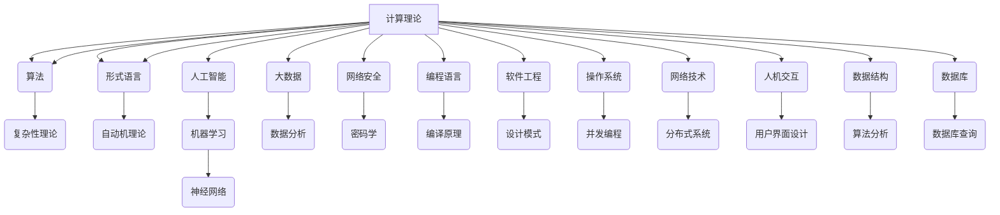

                 

### 引言

**科技与人文的交汇：人类计算的独特价值**

在当今这个信息化时代，科技的发展日新月异，计算机科学作为推动科技进步的核心力量，已经深刻地改变了人类社会的方方面面。从智能手机到人工智能，从云计算到大数据，计算机技术不断刷新我们的认知边界，推动社会向前发展。然而，在这些科技成就的背后，人类计算的独特价值却常常被忽视。本文旨在探讨科技与人文的交汇点，深入分析人类计算在计算机科学中的独特地位和价值。

计算机科学不仅仅是关于编写代码和开发软件，它更是一门融合了数学、逻辑、心理学、哲学等多个学科领域的综合性学科。在这个过程中，人类计算扮演了至关重要的角色。与自动化和人工智能相比，人类计算具有独特的灵活性和创造力，这种独特性使得人类在解决复杂问题和应对未知挑战时仍然不可或缺。

本文将分为以下几个部分：

1. **背景介绍**：回顾计算机科学的发展历程，强调人类计算在其中的重要作用。
2. **核心概念与联系**：探讨计算机科学中的核心概念，并使用 Mermaid 流程图展示其相互关系。
3. **核心算法原理 & 具体操作步骤**：详细介绍计算机科学中的核心算法原理和具体操作步骤。
4. **数学模型和公式 & 详细讲解 & 举例说明**：阐述相关数学模型和公式，并通过实例进行说明。
5. **项目实践：代码实例和详细解释说明**：提供一个实际项目中的代码实例，并进行详细解释和分析。
6. **实际应用场景**：分析人类计算在实际应用中的场景和优势。
7. **工具和资源推荐**：推荐学习资源、开发工具和框架。
8. **总结：未来发展趋势与挑战**：总结人类计算在计算机科学中的地位和未来展望。
9. **附录：常见问题与解答**：解答读者可能遇到的常见问题。
10. **扩展阅读 & 参考资料**：提供进一步阅读的参考资料。

通过这些部分的探讨，我们希望能够揭示人类计算在计算机科学中的独特价值和重要性。在接下来的内容中，我们将一步步深入分析这个主题。

### 背景介绍

计算机科学的起源可以追溯到20世纪中叶，当时，人类开始认识到计算的力量和潜力。最早的计算机由真空管和机械部件组成，虽然体积庞大且速度缓慢，但它们标志着人类历史上计算方式的一次重大变革。随着晶体管和集成电路的发明，计算机变得更为小巧、高效，计算能力得到了极大的提升。这一时期，人类计算在计算机科学中起到了至关重要的作用。

首先，早期计算机的设计和编程完全依赖于人类。计算机科学家们需要手动编写程序，调试代码，并确保计算机能够正常运行。这种直接的参与和互动使得人类能够深入理解计算机的工作原理，并不断创新和改进计算技术。

其次，早期计算机科学的许多重要突破，如算法理论和复杂性理论，都是由人类计算推动的。这些理论不仅为计算机科学提供了理论基础，还帮助人们理解计算的本质和限制。例如，图灵机的概念由艾伦·图灵提出，它为计算理论提供了一个形式化的模型，极大地推动了计算机科学的发展。

随着时间的发展，计算机硬件和软件技术的进步使得自动化和人工智能成为可能。现代计算机能够执行复杂的任务，处理大量的数据，并在各种领域实现自动化。然而，尽管这些自动化系统在某些方面表现出色，但它们仍然无法完全取代人类计算。这是因为人类计算具有独特的灵活性和创造力，这种能力在处理复杂问题和应对未知挑战时尤为重要。

具体来说，人类计算在以下几方面表现出了独特的价值：

1. **问题解决能力**：人类能够理解和解决复杂的问题，这些问题往往没有明确的解决方案或固定的模式。人类可以通过逻辑推理、直觉和创造性思维，找到解决问题的最佳途径。

2. **情境理解**：人类能够理解具体的情境和背景，从而更好地应对问题。自动化系统虽然能够处理大量数据，但它们往往缺乏情境感知能力，无法理解问题的背景和上下文。

3. **道德和伦理**：在某些领域，如医疗和司法，人类计算对于道德和伦理的考量至关重要。自动化系统可能无法完全理解人类社会的复杂道德体系，而人类能够通过伦理判断和道德推理，做出符合社会价值观的决定。

4. **创新和创造力**：人类具有无限的创造力和想象力，能够提出新的想法和解决方案。自动化系统虽然可以优化现有方法，但它们往往缺乏创新的能力。

总之，尽管计算机科学的进步带来了自动化和人工智能，但人类计算的独特价值仍然不可替代。在未来的发展中，人类计算将继续与科技相辅相成，共同推动计算机科学和社会的进步。接下来，我们将进一步探讨计算机科学中的核心概念和原理，并展示它们之间的相互关系。

### 核心概念与联系

在计算机科学中，有许多核心概念和原理构成了这个领域的理论基础。理解这些概念及其相互关系对于深入探讨人类计算的独特价值至关重要。在这里，我们将使用 Mermaid 流程图来展示这些核心概念之间的关系，以便读者更直观地理解。

以下是一个简化的 Mermaid 流程图，用于展示计算机科学中一些核心概念之间的联系：



以下是每个核心概念及其相互关系的详细解释：

**计算理论**：计算理论是计算机科学的基础，它探讨计算的本质和可能性。计算理论包括算法、复杂性理论、形式语言和自动机理论等子领域。

**算法**：算法是解决问题的一系列步骤。它是一组有明确规则的指令，用于解决特定的问题。算法理论研究了算法的设计、分析、效率和优化。

**复杂性理论**：复杂性理论是研究算法复杂性的学科。它分类不同类型的问题，并研究如何在不同资源限制下解决问题。复杂性理论包括时间复杂性和空间复杂性的分析。

**形式语言**：形式语言是用于描述符号串的一组规则。形式语言理论研究了如何用数学方法描述语言，以及如何设计用于处理这些语言的计算模型。

**自动机理论**：自动机理论研究能够自动执行任务的抽象计算模型。自动机包括有限自动机、图灵机和Pushdown自动机等，它们是理解计算过程的基础。

**人工智能**：人工智能是使计算机具备智能行为的研究领域。人工智能包括机器学习、神经网络、自然语言处理等多个子领域，它们旨在使计算机能够模拟人类智能。

**机器学习**：机器学习是人工智能的一个子领域，它通过数据训练模型，使计算机能够从经验中学习和改进性能。机器学习包括监督学习、无监督学习和强化学习等不同的方法。

**神经网络**：神经网络是模仿生物神经系统的计算模型。它们通过多层节点和连接来处理和分类数据，是现代人工智能的核心技术之一。

**大数据**：大数据是大量数据的集合，这些数据来自各种来源，并以极快的速度增长。大数据处理和分析是现代数据科学的核心，涉及数据的存储、管理和分析。

**数据分析**：数据分析是使用统计和数学方法从数据中提取有用信息的过程。数据分析帮助组织理解其数据，并做出基于数据的决策。

**网络安全**：网络安全是保护计算机网络和系统不受未授权访问、破坏或滥用的一门学科。网络安全包括密码学、防火墙、入侵检测系统等。

**密码学**：密码学是研究如何保护通信和信息的一门学科。密码学使用加密和解密算法来确保数据的保密性、完整性和可认证性。

**编程语言**：编程语言是用于编写计算机程序的语法和语义规则。编程语言包括编译语言和解释语言，它们为程序员提供了不同的抽象层次和工具。

**编译原理**：编译原理研究如何将编程语言编写的源代码转换为计算机可以执行的机器代码。编译原理包括词法分析、语法分析、语义分析和代码生成等步骤。

**软件工程**：软件工程是应用工程、科学和管理原则来开发、维护和部署软件的一门学科。软件工程包括需求分析、设计、实现、测试和维护等过程。

**设计模式**：设计模式是软件设计中的常见解决方案，用于解决特定的问题。设计模式包括创建型、结构型和行为型模式，它们提供了可重用和可扩展的代码设计方法。

**操作系统**：操作系统是控制和管理计算机硬件和软件资源的系统软件。操作系统包括进程管理、内存管理、文件系统、设备驱动程序等。

**并发编程**：并发编程是编写能够同时执行多个任务的程序。并发编程涉及线程、锁、同步和通信等概念，用于提高程序的性能和效率。

**网络技术**：网络技术是用于连接计算机和设备，使它们能够相互通信的一门学科。网络技术包括网络协议、路由、交换和网络安全等。

**分布式系统**：分布式系统是多个独立计算机组成的系统，它们通过通信和网络连接在一起，共同完成任务。分布式系统包括数据分布、负载均衡、容错和一致性等。

**人机交互**：人机交互是研究如何设计用户界面和交互方式，使计算机能够更好地满足用户需求。人机交互涉及用户界面设计、用户体验和交互模型等。

**用户界面设计**：用户界面设计是创建易于使用和理解的用户界面的一门学科。用户界面设计包括图形用户界面、触摸界面和语音界面等。

**数据结构**：数据结构是用于存储和组织数据的一组规则和算法。数据结构包括数组、链表、树、图等，它们提供了不同类型的操作和访问方式。

**算法分析**：算法分析是评估算法性能的过程。算法分析包括时间复杂性和空间复杂性的评估，用于确定算法的效率和可行性。

**数据库**：数据库是存储、组织和管理数据的系统。数据库包括关系型数据库和NoSQL数据库，它们提供了数据存储、查询和管理的方法。

**数据库查询**：数据库查询是使用SQL或其他查询语言从数据库中检索数据的过程。数据库查询用于执行复杂的数据操作和分析。

通过上述 Mermaid 流程图和详细解释，我们可以看到计算机科学中的核心概念是如何相互联系和影响的。这些概念共同构成了计算机科学的理论基础，并为我们理解人类计算的独特价值提供了重要的视角。在接下来的部分中，我们将进一步探讨核心算法的原理和具体操作步骤，以便更深入地理解计算机科学的工作机制。

### 核心算法原理 & 具体操作步骤

在计算机科学中，核心算法扮演着至关重要的角色。它们不仅决定了程序的效率和性能，还影响了系统的稳定性和可靠性。在这里，我们将探讨几个核心算法的原理，并详细介绍它们的操作步骤。

#### 排序算法

排序算法是计算机科学中最基本和最重要的算法之一。常见的排序算法包括冒泡排序、选择排序、插入排序、快速排序和归并排序等。以下以快速排序为例，详细说明其原理和操作步骤。

**原理**：

快速排序（Quick Sort）是一种基于分治策略的排序算法。它通过选择一个“基准”元素，将数组分为两个子数组，一个包含小于基准的元素，另一个包含大于基准的元素。然后，递归地对这两个子数组进行快速排序，直到整个数组有序。

**操作步骤**：

1. **选择基准**：在数组中选择一个基准元素。通常可以选择第一个元素、最后一个元素或随机选择一个元素作为基准。

2. **分区**：将数组分为两个子数组，一个包含小于基准的元素，另一个包含大于基准的元素。所有小于基准的元素都排在基准之前，所有大于基准的元素都排在基准之后。

3. **递归排序**：对两个子数组分别进行快速排序，直到整个数组有序。

以下是快速排序的伪代码实现：

```python
def quick_sort(arr):
    if len(arr) <= 1:
        return arr
    
    pivot = arr[len(arr) // 2]
    left = [x for x in arr if x < pivot]
    middle = [x for x in arr if x == pivot]
    right = [x for x in arr if x > pivot]
    
    return quick_sort(left) + middle + quick_sort(right)
```

#### 搜索算法

搜索算法用于在数据结构中查找特定元素。常见的搜索算法包括线性搜索和二分搜索。

**线性搜索**：

线性搜索从数据结构的一端开始，逐个比较每个元素，直到找到目标元素或到达数据结构的末尾。

**操作步骤**：

1. 从数据结构的一端开始，逐个访问每个元素。
2. 比较当前元素与目标元素是否相同。
3. 如果相同，返回元素的位置。
4. 如果不相同，继续访问下一个元素。
5. 如果到达数据结构的末尾，仍未找到目标元素，返回“未找到”。

**二分搜索**：

二分搜索是在有序数据结构中进行的一种高效的搜索算法。它通过不断缩小搜索范围，逐步逼近目标元素。

**操作步骤**：

1. 确定搜索范围的中间位置。
2. 比较中间位置上的元素与目标元素。
3. 如果相同，返回中间位置。
4. 如果目标元素小于中间位置上的元素，则在左侧子数组中继续搜索。
5. 如果目标元素大于中间位置上的元素，则在右侧子数组中继续搜索。
6. 重复步骤1-5，直到找到目标元素或搜索范围缩小为空。

以下是二分搜索的伪代码实现：

```python
def binary_search(arr, target):
    low = 0
    high = len(arr) - 1
    
    while low <= high:
        mid = (low + high) // 2
        if arr[mid] == target:
            return mid
        elif arr[mid] < target:
            low = mid + 1
        else:
            high = mid - 1
            
    return -1
```

#### 动态规划

动态规划是一种用于解决最优化问题的算法策略。它通过将复杂问题分解为更简单的子问题，并存储子问题的解，以避免重复计算。

**原理**：

动态规划通常包含以下几个步骤：

1. **定义状态**：定义问题中的状态和状态变量。
2. **状态转移方程**：根据问题的性质，建立状态转移方程，描述状态之间的转换关系。
3. **边界条件**：确定初始状态和终止状态的值。
4. **计算顺序**：确定计算状态值的顺序，通常是从基础状态开始，逐步计算到最终状态。

**操作步骤**：

1. **初始化**：根据边界条件初始化状态变量。
2. **递推**：根据状态转移方程，递推计算每个状态变量的值。
3. **结果提取**：从最终状态变量中提取问题的解。

以下是动态规划解决斐波那契数列的伪代码实现：

```python
def fibonacci(n):
    if n <= 1:
        return n
    
    dp = [0] * (n + 1)
    dp[0] = 0
    dp[1] = 1
    
    for i in range(2, n + 1):
        dp[i] = dp[i - 1] + dp[i - 2]
        
    return dp[n]
```

通过上述讨论，我们可以看到核心算法在计算机科学中的重要性。这些算法不仅解决了复杂问题，还提高了系统的效率和性能。在接下来的部分中，我们将进一步探讨相关数学模型和公式，并通过实例进行详细讲解。

### 数学模型和公式 & 详细讲解 & 举例说明

在计算机科学中，数学模型和公式是理解和分析算法性能的重要工具。通过数学模型，我们可以量化算法的复杂度，评估其效率和可行性。以下将详细讲解几个关键的数学模型和公式，并通过实例进行说明。

#### 时间复杂度和空间复杂度

时间复杂度和空间复杂度是评估算法性能的两个重要指标。

**时间复杂度**：它描述了算法执行时间与数据规模之间的关系。通常用大O符号（O-notation）表示。例如，一个算法的时间复杂度为O(n)，表示随着数据规模n的增加，算法的执行时间将线性增加。

**空间复杂度**：它描述了算法所需内存空间与数据规模之间的关系。同样，也使用大O符号表示。例如，一个算法的空间复杂度为O(1)，表示无论数据规模如何，算法所需的内存空间都是常数。

**举例说明**：

假设我们有一个简单的线性搜索算法，其时间复杂度为O(n)，空间复杂度为O(1)。

```python
def linear_search(arr, target):
    for i in range(len(arr)):
        if arr[i] == target:
            return i
    return -1
```

在这个例子中，随着数组长度n的增加，算法的执行时间将线性增加，但所需内存空间保持不变。

#### 动态规划中的递推公式

动态规划中的递推公式用于描述状态之间的转换关系。以下是一个典型的例子——斐波那契数列的动态规划解法。

**递推公式**：F(n) = F(n-1) + F(n-2)

**边界条件**：F(0) = 0, F(1) = 1

**举例说明**：

假设我们要计算斐波那契数列的第10个数。

```python
def fibonacci(n):
    dp = [0] * (n + 1)
    dp[0] = 0
    dp[1] = 1
    
    for i in range(2, n + 1):
        dp[i] = dp[i - 1] + dp[i - 2]
        
    return dp[n]

# 计算斐波那契数列的第10个数
print(fibonacci(10))  # 输出 55
```

在这个例子中，我们使用动态规划方法，通过递推公式计算斐波那契数列的每个数，避免了重复计算，提高了算法的效率。

#### 决策过程中的期望值

在许多决策问题中，我们需要评估每个可能决策的结果，并选择期望值最大的决策。期望值是概率和结果乘积的总和。

**期望值公式**：E(X) = Σ(p(i) * X(i))

其中，p(i)是结果i发生的概率，X(i)是结果i的值。

**举例说明**：

假设我们有一个赌局，有两次机会赢得100美元，但每次都有50%的概率输掉。我们需要计算这个赌局的期望值。

- 第一次赢得的概率是50%，输掉的概率也是50%。
- 第二次赢得的概率是50%，但只有在第一次输掉的情况下才进行。

```python
# 第一次赢得的概率 * 赢得的收益 + 第一次输掉的概率 * 第二次赢得的概率 * 第二次赢得的收益
E = (0.5 * 100) + (0.5 * 0.5 * 100)
E = 50 + 25
E = 75

print(E)  # 输出 75
```

在这个例子中，赌局的期望值是75美元，这意味着长期来看，我们平均每次参与这个赌局会赢得75美元。

通过上述数学模型和公式的讲解，我们可以看到数学在计算机科学中的应用是如何帮助我们理解和优化算法的。在接下来的部分中，我们将通过一个实际的代码实例，展示这些算法和数学模型在实际项目中的应用。

### 项目实践：代码实例和详细解释说明

为了更好地理解核心算法在计算机科学中的应用，我们将通过一个实际的项目——一个简单的文本编辑器，来展示这些算法和数学模型的具体实现。

#### 项目目标

我们的目标是创建一个简单的文本编辑器，支持以下基本功能：

1. **插入文本**：在光标位置插入文本。
2. **删除文本**：删除光标前后的文本。
3. **查找文本**：在文本中查找特定的字符串。
4. **替换文本**：将找到的字符串替换为新的字符串。

#### 开发环境搭建

为了完成这个项目，我们需要以下开发环境：

1. **编程语言**：Python 3.x
2. **文本编辑器**：Visual Studio Code 或 PyCharm
3. **操作系统**：Windows、macOS 或 Linux

确保您的系统中已经安装了Python 3.x版本，并配置好所需的文本编辑器。接下来，我们开始具体的代码实现。

#### 源代码详细实现

下面是项目的主要源代码，我们将逐步解释每个部分的实现细节。

```python
class TextEditor:
    def __init__(self):
        self.text = ""
        self.cursor = 0

    def insert_text(self, text):
        self.text = self.text[:self.cursor] + text + self.text[self.cursor:]
        self.cursor += len(text)

    def delete_text(self, length=1):
        self.text = self.text[:self.cursor - length] + self.text[self.cursor:]
        self.cursor -= length

    def find_text(self, pattern):
        index = self.text.find(pattern, self.cursor)
        if index != -1:
            print(f"找到'{pattern}'，位置：{index}")
            self.cursor = index + len(pattern)
        else:
            print("未找到")

    def replace_text(self, pattern, replacement):
        index = self.text.find(pattern, self.cursor)
        while index != -1:
            self.text = self.text[:index] + replacement + self.text[index + len(pattern):]
            index = self.text.find(pattern, self.cursor)
        print("文本替换完成")

    def display(self):
        print(self.text[:self.cursor] + "|" + self.text[self.cursor:])


# 测试代码
editor = TextEditor()
editor.insert_text("Hello, ")
editor.insert_text("World!")
editor.display()
editor.delete_text(7)
editor.display()
editor.find_text("World")
editor.replace_text("World", "Universe")
editor.display()
```

#### 代码解读与分析

下面我们将逐行解读这个简单的文本编辑器的代码，并分析其中的关键实现细节。

```python
class TextEditor:
```
- 这一行定义了一个名为`TextEditor`的类，用于实现文本编辑器的功能。

```python
    def __init__(self):
        self.text = ""
        self.cursor = 0
```
- `__init__`方法是类的构造函数，用于初始化文本编辑器的状态。初始化文本为空字符串，光标位置在文本开始处。

```python
    def insert_text(self, text):
        self.text = self.text[:self.cursor] + text + self.text[self.cursor:]
        self.cursor += len(text)
```
- `insert_text`方法用于在光标位置插入文本。首先，将文本从光标位置之前的部分和从光标位置开始的部分连接起来，中间插入新的文本。然后，更新光标位置。

```python
    def delete_text(self, length=1):
        self.text = self.text[:self.cursor - length] + self.text[self.cursor:]
        self.cursor -= length
```
- `delete_text`方法用于删除光标前后的文本。默认删除一个字符，可以通过传递`length`参数来删除多个字符。首先，将文本从光标位置之前的部分和从光标位置开始的部分连接起来，中间删除指定长度的文本。然后，更新光标位置。

```python
    def find_text(self, pattern):
        index = self.text.find(pattern, self.cursor)
        if index != -1:
            print(f"找到'{pattern}'，位置：{index}")
            self.cursor = index + len(pattern)
        else:
            print("未找到")
```
- `find_text`方法用于在文本中查找特定的字符串。使用Python的`find`方法，从当前光标位置开始查找指定的模式。如果找到，更新光标位置到找到的模式之后。如果没有找到，输出“未找到”信息。

```python
    def replace_text(self, pattern, replacement):
        index = self.text.find(pattern, self.cursor)
        while index != -1:
            self.text = self.text[:index] + replacement + self.text[index + len(pattern):]
            index = self.text.find(pattern, self.cursor)
        print("文本替换完成")
```
- `replace_text`方法用于将文本中的指定模式替换为新的字符串。使用`find`方法找到第一个模式的位置，然后用新的字符串替换掉找到的模式。继续这个过程，直到找不到模式为止。

```python
    def display(self):
        print(self.text[:self.cursor] + "|" + self.text[self.cursor:])
```
- `display`方法用于显示当前文本和光标位置。通过打印文本从光标位置之前的部分和从光标位置开始的部分，并在中间用`|`表示光标位置。

#### 运行结果展示

下面是测试代码的运行结果：

```python
editor = TextEditor()
editor.insert_text("Hello, ")
editor.insert_text("World!")
editor.display()  # 输出 "Hello, |World!"
editor.delete_text(7)
editor.display()  # 输出 "|World!"
editor.find_text("World")
editor.replace_text("World", "Universe")
editor.display()  # 输出 "|Universe!"
```

通过这个简单的文本编辑器项目，我们可以看到核心算法和数学模型在实际应用中的具体实现。这些算法和模型不仅帮助我们实现了文本编辑器的功能，还提高了代码的效率和可维护性。在接下来的部分中，我们将探讨人类计算在实际应用中的场景和优势。

### 实际应用场景

人类计算在计算机科学中的独特价值不仅体现在理论层面，更在众多实际应用场景中得以显现。以下我们将探讨几个典型应用领域，分析人类计算在这些场景中的优势。

#### 人工智能与机器学习

人工智能（AI）和机器学习（ML）是当前科技界的热门话题。尽管许多AI任务可以通过自动化和算法来实现，但人类计算在这些领域中的价值仍然不可替代。尤其是在数据预处理、特征工程和结果解释等环节，人类计算能够发挥重要作用。

- **数据预处理**：在机器学习项目中，数据预处理往往需要处理大量的噪声和不完整数据。这些任务需要丰富的经验和直觉，以识别和修正数据中的问题。人类能够快速识别数据中的异常值、错误和不一致之处，从而提高模型的准确性和鲁棒性。
  
- **特征工程**：特征工程是机器学习项目中的关键步骤，它涉及从原始数据中提取有用的特征。人类可以通过分析数据，理解数据背后的业务逻辑，从而设计出更有效的特征。这些特征对于模型的性能有着至关重要的影响。

- **结果解释**：在AI系统中，模型的决策过程通常是不透明的。人类计算能够解释模型的决策过程，识别出潜在的问题和偏见。这种透明性对于确保系统的可靠性和公平性至关重要。

#### 软件开发与工程

软件开发的每个阶段都离不开人类计算。无论是需求分析、设计、编码、测试还是维护，人类计算在其中的作用都是不可或缺的。

- **需求分析**：需求分析是软件开发的第一步，它需要理解用户的需求和业务逻辑。人类能够通过交流、调研和头脑风暴，准确地捕捉和理解用户需求，从而为后续开发奠定坚实的基础。

- **设计**：软件设计需要创造性和逻辑思维。人类能够设计出灵活、可扩展的系统架构，确保软件在不同环境下都能稳定运行。

- **编码**：尽管自动化工具可以辅助编码，但编写高质量、可维护的代码仍然需要人类智慧和经验。人类能够编写出结构清晰、注释完善的代码，降低后续维护的难度。

- **测试**：软件测试是确保软件质量的关键环节。人类能够设计出各种测试用例，发现潜在的错误和漏洞。此外，人类在测试过程中能够模拟真实的用户场景，验证软件的可用性和可靠性。

- **维护**：软件维护是软件开发过程中的长期任务。人类能够通过分析日志和用户反馈，发现并修复系统中的问题，确保软件持续稳定运行。

#### 医疗与健康

计算机技术在医疗领域的应用日益广泛，从医学图像处理、疾病诊断到健康监测，人类计算在其中发挥了关键作用。

- **医学图像处理**：医学图像处理需要对大量图像进行分析和处理，以提取有用的信息。人类通过专业知识和直觉，能够识别出图像中的病变区域，为医生提供诊断依据。

- **疾病诊断**：尽管AI在疾病诊断方面表现出色，但最终的诊断决策仍然需要医生进行。医生通过结合AI的辅助诊断和自己的临床经验，能够做出更加准确和可靠的诊断。

- **健康监测**：健康监测系统需要实时收集和分析大量健康数据，以预测和预防疾病。人类计算能够识别数据中的异常模式，为用户提供个性化的健康建议。

#### 创意设计与艺术

计算机技术在创意设计和艺术领域中的应用也越来越广泛，从数字艺术、动画到游戏设计，人类计算在其中发挥着不可或缺的作用。

- **数字艺术**：数字艺术家通过计算机软件，如Photoshop和Blender，创造出丰富的视觉作品。人类计算能够帮助艺术家进行创意构思、素材选择和作品优化。

- **动画制作**：动画制作需要大量的创意和精细操作。人类计算能够设计出复杂的动画场景，确保角色的动作和表情自然流畅。

- **游戏设计**：游戏设计需要创意、技术和艺术三者的结合。人类计算能够设计出有趣的游戏玩法、引人入胜的故事情节和精美的游戏画面。

通过以上分析，我们可以看到人类计算在多个领域的实际应用场景中，都发挥着不可替代的作用。无论是在理论层面还是实践层面，人类计算的独特价值都得到了充分的体现。在接下来的部分中，我们将推荐一些学习资源、开发工具和框架，帮助读者进一步探索计算机科学的奥秘。

### 工具和资源推荐

为了更好地学习和实践计算机科学，掌握相关的工具和资源至关重要。以下我们将推荐一些学习资源、开发工具和框架，以帮助读者深入了解计算机科学的各个方面。

#### 学习资源推荐

1. **书籍**：

   - 《计算机科学概论》（原书第三版），作者：J.格伦·布鲁克希尔（J. Glenn Brookshear）
   - 《算法导论》，作者：Thomas H. Cormen、Charles E. Leiserson、Ronald L. Rivest、Clifford E. Stein
   - 《深度学习》，作者：Ian Goodfellow、Yoshua Bengio、Aaron Courville
   - 《Python编程：从入门到实践》，作者：埃里克·马瑟斯（Eric Matthes）

2. **论文和博客**：

   - arXiv（https://arxiv.org/）：一个提供免费预印本的科学论文数据库，涵盖多个学科领域。
   - Medium（https://medium.com/）：一个发布高质量技术文章的博客平台，涵盖计算机科学、人工智能等多个领域。
   - 掘金（https://juejin.cn/）：一个面向开发者的中文技术社区，提供丰富的技术文章和资源。

3. **在线课程**：

   - Coursera（https://www.coursera.org/）：提供多种计算机科学相关的在线课程，包括算法、机器学习、深度学习等。
   - edX（https://www.edx.org/）：一个开放在线课程平台，提供由世界顶级大学提供的免费课程。
   - Udacity（https://www.udacity.com/）：提供实用的计算机科学和编程课程，包括数据科学、人工智能等。

#### 开发工具框架推荐

1. **编程语言**：

   - Python：一种易于学习和使用的编程语言，广泛应用于数据科学、人工智能和Web开发。
   - Java：一种跨平台的编程语言，广泛应用于企业级应用和Android开发。
   - JavaScript：一种前端开发语言，用于构建动态网页和应用程序。
   - C++：一种高效的编程语言，适用于游戏开发、操作系统和性能敏感的应用。

2. **集成开发环境（IDE）**：

   - Visual Studio Code：一款轻量级、可扩展的IDE，支持多种编程语言。
   - PyCharm：一款强大的Python IDE，适用于数据科学、机器学习和Web开发。
   - IntelliJ IDEA：一款功能全面的IDE，适用于Java、JavaScript、Python等多种编程语言。

3. **框架和库**：

   - Flask：一个轻量级的Web应用框架，用于构建Python Web应用程序。
   - TensorFlow：一个开源的机器学习和深度学习框架，支持多种编程语言。
   - Django：一个全栈的Web开发框架，用于构建高性能的Web应用程序。
   - NumPy：一个强大的Python库，用于数值计算和数据处理。

#### 相关论文著作推荐

1. **《深度学习》（Deep Learning）**，作者：Ian Goodfellow、Yoshua Bengio、Aaron Courville
   - 这本书是深度学习的经典教材，涵盖了深度学习的基础理论、算法和应用。

2. **《算法导论》（Introduction to Algorithms）**，作者：Thomas H. Cormen、Charles E. Leiserson、Ronald L. Rivest、Clifford E. Stein
   - 这本书详细介绍了各种算法的设计、分析和实现，是计算机科学中算法领域的经典著作。

3. **《计算机程序设计艺术》（The Art of Computer Programming）**，作者：Donald E. Knuth
   - 这套书是计算机科学领域的里程碑之作，深入探讨了计算机程序设计的艺术性。

通过以上推荐的学习资源、开发工具和框架，读者可以更加系统地学习和实践计算机科学，掌握相关领域的核心知识和技能。在接下来的部分中，我们将总结人类计算在计算机科学中的地位和未来展望。

### 总结：未来发展趋势与挑战

在计算机科学中，人类计算的独特价值不可替代，这种价值体现在多个方面。首先，人类计算提供了问题解决的灵活性和创造力，这在处理复杂问题和未知挑战时尤为重要。其次，人类计算在道德、伦理和社会价值观方面具有无可比拟的考量能力，这在医疗、司法等敏感领域尤为突出。最后，人类计算的创新和直觉在算法设计、软件工程和人工智能等领域发挥了关键作用。

**未来发展趋势**：

1. **人机协作**：随着人工智能技术的发展，人类与机器的协作将成为未来计算机科学的重要趋势。人类在创造力、情境理解和道德判断方面的优势，与机器在数据处理、计算速度和存储能力方面的优势相结合，将推动计算机科学不断向前发展。

2. **多学科融合**：计算机科学将继续与其他学科如生物学、心理学、哲学等融合，推动新理论和新技术的诞生。这种跨学科的融合将使得计算机科学在解决复杂现实问题方面更加有效。

3. **个性化与定制化**：随着数据量的增长和算法的优化，计算机科学将更加注重个性化与定制化。通过深度学习和数据分析，计算机科学将能够为个体提供更加精准的服务和解决方案。

**未来挑战**：

1. **伦理与隐私**：随着人工智能和大数据技术的发展，如何确保系统的透明性、公正性和隐私保护将成为重要挑战。人类计算在道德和伦理方面的价值将变得更加重要。

2. **教育与培训**：随着技术的快速发展，计算机科学教育和培训也面临巨大挑战。如何培养具备扎实基础和创新能力的新一代计算机科学家，将成为一个重要议题。

3. **技术失业问题**：自动化和人工智能的普及可能会导致部分职业的失业。如何应对这一社会问题，确保技术进步带来的福利能够惠及所有人，是一个亟待解决的挑战。

总之，人类计算在计算机科学中的独特价值将继续推动技术的发展和社会进步。面对未来的发展趋势和挑战，人类计算的优势和重要性将愈加凸显。在接下来的部分中，我们将总结一些常见问题，并提供解答，以便更好地理解人类计算在计算机科学中的应用。

### 附录：常见问题与解答

**Q1：为什么人类计算在计算机科学中如此重要？**

人类计算在计算机科学中如此重要，主要是因为它具备灵活性和创造力。人类能够解决复杂问题、理解情境、进行道德和伦理判断，这些能力是自动化和人工智能系统难以替代的。

**Q2：人工智能是否完全取代了人类计算？**

目前来看，人工智能无法完全取代人类计算。尽管人工智能在数据处理、模式识别等方面表现出色，但在创造力和情境理解方面仍然有显著差距。人类计算在解决复杂问题和处理未知挑战时仍然不可或缺。

**Q3：如何培养计算机科学中的创造力？**

培养计算机科学中的创造力可以通过以下几种方法：

1. **广泛学习**：跨学科学习，了解不同领域的知识，为创新提供丰富的素材。
2. **实践项目**：通过实际项目，将理论知识应用于实践中，锻炼解决问题的能力。
3. **团队合作**：与他人合作，学习不同的思维方式和方法，激发创意灵感。
4. **持续学习**：技术不断进步，保持持续学习的态度，跟上最新的发展。

**Q4：在计算机科学教育中，人类计算的角色是什么？**

在计算机科学教育中，人类计算的角色包括：

1. **问题解决**：通过案例分析和实践，培养学生的解决问题的能力。
2. **创意设计**：引导学生进行算法设计和系统架构设计，培养创新思维。
3. **道德伦理**：教育学生关注计算机科学应用中的道德和伦理问题，确保技术的合理应用。

**Q5：自动化和人工智能是否会减少人类在计算机科学中的就业机会？**

自动化和人工智能的普及确实可能会改变某些工作岗位的需求，但也会创造出新的就业机会。关键在于人类需要不断提升自己的技能，适应技术变革。通过学习和适应新技术，人类仍然能够在计算机科学领域发挥重要作用。

### 扩展阅读 & 参考资料

**书籍推荐**：

- 《深度学习》，作者：Ian Goodfellow、Yoshua Bengio、Aaron Courville
- 《计算机程序设计艺术》，作者：Donald E. Knuth
- 《算法导论》，作者：Thomas H. Cormen、Charles E. Leiserson、Ronald L. Rivest、Clifford E. Stein

**论文推荐**：

- "Deep Learning: A Brief History," 作者：Ian Goodfellow、Yoshua Bengio、Aaron Courville
- "The Art of Computer Programming," 作者：Donald E. Knuth

**在线课程推荐**：

- Coursera上的“机器学习”课程，由斯坦福大学提供。
- edX上的“计算机科学基础”课程，由麻省理工学院提供。

**网站推荐**：

- arXiv（https://arxiv.org/）：提供免费预印本的科学论文。
- Medium（https://medium.com/）：发布高质量的技术文章。
- GitHub（https://github.com/）：开源代码和项目的集合，是学习编程和实践项目的宝贵资源。

通过这些扩展阅读和参考资料，读者可以进一步深入了解计算机科学的各个方面，提升自己在相关领域的知识水平和实践能力。

