                 

### 背景介绍

**科技与伦理的平衡点：人类计算的伦理思考**

在当今这个信息爆炸、技术飞速发展的时代，计算机科学已成为推动社会进步的核心力量。然而，随着技术的进步，我们也不可避免地面临着一系列伦理问题。科技与伦理之间的平衡点成为了一个热门话题，这不仅关乎技术的可持续性，也关乎人类的未来。

本文旨在探讨计算机科学领域中的伦理问题，分析科技发展与伦理道德之间的冲突与平衡。我们将从背景介绍入手，逐步深入探讨核心概念，核心算法原理，数学模型和公式，以及实际应用场景等各个方面。

首先，我们需要明确什么是计算机科学中的伦理问题。伦理问题通常涉及价值观、道德准则和行为规范等方面。在计算机科学领域，这些伦理问题可能包括隐私保护、数据安全、人工智能的道德应用等。例如，大数据时代下个人隐私的泄露问题，人工智能在决策过程中可能存在的偏见问题，以及网络犯罪等问题。

接下来，我们将通过几个具体的案例来引入核心概念和原理。这些案例将帮助读者更好地理解科技与伦理之间的复杂关系。

### 案例一：大数据时代的隐私泄露

随着互联网的普及和数据采集技术的发展，我们生活在一个信息被大量收集和存储的时代。然而，这也带来了隐私泄露的风险。例如，Facebook的Cambridge Analytica丑闻揭示了大量用户数据被不当使用的严重后果。这个问题不仅引发了公众的愤怒，也促使各国政府加强对数据隐私的保护。

在这个案例中，核心概念包括数据所有权、数据匿名化和数据安全等。为了解决隐私泄露问题，我们需要采取一系列措施，如加强数据安全保护、提高数据匿名化程度、以及建立更严格的数据使用规范等。

### 案例二：人工智能的道德应用

人工智能（AI）的快速发展给我们的生活带来了诸多便利，但同时也引发了一系列伦理问题。一个典型的例子是自动驾驶汽车。在紧急情况下，自动驾驶汽车需要做出决策，比如是保护车内乘客还是行人。这种决策涉及到道德选择和责任归属问题。

在这个案例中，核心概念包括AI的道德算法、责任归属和决策透明度等。为了确保人工智能的道德应用，我们需要开发更加完善的道德算法，提高决策的透明度，并明确责任归属，以便在出现问题时能够追溯和解决。

通过上述案例，我们可以看到科技与伦理之间的紧密联系。接下来，我们将进一步探讨核心算法原理和具体操作步骤，以及如何通过数学模型和公式来分析和解决问题。

### 核心概念与联系

为了深入探讨计算机科学中的伦理问题，我们首先需要明确一些核心概念和原理，以及它们之间的联系。以下是一个Mermaid流程图，用于展示这些核心概念和原理之间的关系。

```mermaid
graph TD
    A[科技发展] --> B[隐私保护]
    A --> C[数据安全]
    A --> D[人工智能伦理]
    B --> E[数据匿名化]
    B --> F[用户授权]
    C --> G[数据加密]
    C --> H[访问控制]
    D --> I[道德算法]
    D --> J[责任归属]
    D --> K[决策透明度]
    E --> L[去识别化技术]
    E --> M[隐私沙箱]
    F --> N[知情同意]
    F --> O[数据共享协议]
    G --> P[对称加密]
    G --> Q[非对称加密]
    H --> R[访问控制列表]
    H --> S[角色权限管理]
    I --> T[公平性]
    I --> U[公正性]
    I --> V[透明性]
    J --> W[法律责任]
    J --> X[伦理审查]
    K --> Y[决策路径追踪]
    K --> Z[结果可解释性]
    L --> AA[加密技术]
    L --> BB[数据混淆]
    M --> CC[隐私保护框架]
    M --> DD[隐私增强技术]
    N --> EE[隐私声明]
    N --> FF[隐私政策]
    O --> GG[数据共享协议]
    O --> HH[隐私保护条款]
    P --> II[对称密钥加密]
    P --> JJ[对称密钥解密]
    Q --> KK[非对称密钥加密]
    Q --> LL[非对称密钥解密]
    R --> MM[访问控制策略]
    R --> NN[访问控制规则]
    S --> OO[角色分配]
    S --> PP[权限调整]
    T --> QQ[算法公平性评估]
    T --> RR[算法公正性评估]
    T --> SS[算法透明性评估]
    U --> TT[算法伦理评估]
    U --> UU[算法责任评估]
    U --> VV[算法透明度评估]
    W --> XX[法律责任追责]
    W --> YY[道德责任追责]
    X --> ZZ[伦理规范审查]
    X --> AAA[伦理决策框架]
    Y --> BBB[决策透明度分析]
    Y --> CCC[决策结果评估]
    Z --> DDD[算法可解释性分析]
    Z --> EEE[算法结果解释]
    AA --> FFF[隐私保护技术]
    BB --> GGG[数据混淆技术]
    CC --> HHH[隐私增强技术]
    DD --> III[隐私保护框架]
    EE --> JJJ[隐私声明]
    FF --> KKK[隐私政策]
    GG --> LLL[数据共享协议]
    HH --> MMM[隐私保护条款]
    II --> NNN[加密算法]
    JJ --> OOO[解密算法]
    KK --> PPP[加密算法]
    LL --> QQQ[解密算法]
    MM --> RRR[访问控制算法]
    NN --> SSS[权限管理算法]
    OO --> TTT[角色分配算法]
    PP --> UUU[权限调整算法]
    QQ --> VVV[算法公平性算法]
    RR --> WWW[算法公正性算法]
    SS --> XXX[算法透明性算法]
    TT --> YYY[伦理评估算法]
    UU --> ZZZ[责任评估算法]
    VV --> AAAA[透明度评估算法]
    XX --> BBBB[法律责任算法]
    YY --> CCC[道德责任算法]
    ZZ --> DDDD[伦理规范算法]
    AAA --> EEEE[伦理决策算法]
    BBB --> FFF[决策透明度算法]
    CCC --> GGG[算法结果解释算法]
    DDD --> HHH[算法可解释性算法]
    EEE --> IIII[算法结果解释算法]
```



通过这个流程图，我们可以看到隐私保护、数据安全、人工智能伦理等核心概念之间的复杂联系。每个概念都涉及到多个子概念和技术，这些子概念和技术共同构成了计算机科学中伦理问题解决的基础。

接下来，我们将深入探讨这些核心算法原理，并通过具体的操作步骤来展示如何在实际中应用这些算法。

### 核心算法原理 & 具体操作步骤

在计算机科学中，解决伦理问题的核心算法通常涉及到以下几个方面：隐私保护、数据安全、人工智能伦理等。以下将分别介绍这些算法的基本原理和具体操作步骤。

#### 1. 隐私保护算法原理

隐私保护算法的核心目标是确保用户数据在采集、存储和使用过程中的安全性和匿名性。以下是几种常用的隐私保护算法及其原理：

**数据匿名化算法：**
- **原理：** 数据匿名化是将个人身份信息从数据中去除，从而保护个人隐私。常见的数据匿名化技术包括：
  - **随机化：** 对数据进行随机变换，使原始数据无法直接识别。
  - **泛化：** 将数据转换为高层次类别，如将具体数值泛化到整数区间。
  - **掩码：** 对敏感信息使用掩码技术进行遮掩。

- **具体操作步骤：**
  1. 收集数据。
  2. 确定匿名化策略（如随机化、泛化或掩码）。
  3. 对数据应用匿名化技术。
  4. 检查匿名化效果，确保原始数据无法被重新识别。

**用户授权算法：**
- **原理：** 用户授权是指确保只有授权用户能够访问和使用特定数据或功能。常见的技术包括：
  - **访问控制列表（ACL）：** 定义一组用户和权限，确保只有被授权的用户能够访问特定资源。
  - **角色权限管理：** 根据用户角色分配相应的权限，如管理员、普通用户等。

- **具体操作步骤：**
  1. 设计访问控制策略。
  2. 创建访问控制列表或角色权限模型。
  3. 为用户分配角色和权限。
  4. 实现权限检查机制，确保用户只能访问其授权的资源。

#### 2. 数据安全算法原理

数据安全算法的核心目标是确保数据在传输和存储过程中的完整性、保密性和可用性。以下是几种常用的数据安全算法及其原理：

**数据加密算法：**
- **原理：** 数据加密是将数据转换为密文，只有拥有解密密钥的用户才能解密并查看原始数据。常见的加密技术包括：
  - **对称加密：** 使用相同的密钥进行加密和解密，如AES算法。
  - **非对称加密：** 使用一对密钥进行加密和解密，一个用于加密，另一个用于解密，如RSA算法。

- **具体操作步骤：**
  1. 选择加密算法和密钥长度。
  2. 生成加密密钥对。
  3. 使用加密密钥对数据进行加密。
  4. 存储加密后的数据。
  5. 需要解密时，使用解密密钥对数据解密。

**访问控制算法：**
- **原理：** 访问控制算法通过限制用户对数据和资源的访问来保护数据安全。常见的访问控制技术包括：
  - **访问控制列表（ACL）：** 定义一组用户和权限，确保只有被授权的用户能够访问特定资源。
  - **角色权限管理：** 根据用户角色分配相应的权限，如管理员、普通用户等。

- **具体操作步骤：**
  1. 设计访问控制策略。
  2. 创建访问控制列表或角色权限模型。
  3. 为用户分配角色和权限。
  4. 实现权限检查机制，确保用户只能访问其授权的资源。

#### 3. 人工智能伦理算法原理

人工智能伦理算法的核心目标是确保人工智能系统的道德应用和透明度。以下是几种常用的人工智能伦理算法及其原理：

**道德算法：**
- **原理：** 道德算法旨在指导人工智能系统在决策过程中遵循道德准则，如公平性、公正性和透明性。常见的道德算法包括：
  - **公平性评估：** 对人工智能决策的公平性进行评估，确保系统不会对特定群体产生歧视。
  - **公正性评估：** 对人工智能决策的公正性进行评估，确保系统决策结果合理、无偏见。
  - **透明度评估：** 提高人工智能决策的透明度，使决策过程可以被解释和理解。

- **具体操作步骤：**
  1. 确定道德准则和评估指标。
  2. 设计道德算法模型。
  3. 对人工智能系统进行道德评估。
  4. 优化算法，确保道德准则得到有效遵循。

**责任归属算法：**
- **原理：** 责任归属算法旨在明确人工智能系统在决策过程中出现问题时责任归属，确保责任可追溯。常见的技术包括：
  - **责任追溯：** 对人工智能系统的决策过程进行记录，以便在出现问题时追溯责任。
  - **决策透明度：** 提高决策过程的透明度，使责任归属更加明确。

- **具体操作步骤：**
  1. 设计责任归属框架。
  2. 实现决策过程记录机制。
  3. 对决策过程进行责任评估。
  4. 明确责任归属，确保问题解决。

通过以上对隐私保护、数据安全和人工智能伦理算法原理及其操作步骤的介绍，我们可以看到这些算法在解决计算机科学中的伦理问题方面的重要性。在实际应用中，需要根据具体场景和需求，灵活选择和组合这些算法，以实现科技与伦理的平衡。

### 数学模型和公式 & 详细讲解 & 举例说明

在计算机科学中，解决伦理问题往往需要借助数学模型和公式来进行定量分析和优化。以下我们将详细讲解几个关键数学模型和公式，并通过实际例子来展示如何应用这些模型和公式。

#### 1. 隐私保护中的差分隐私模型

**差分隐私（Differential Privacy）** 是一种在数据分析中保护隐私的重要数学模型。其核心思想是通过添加随机噪声来隐藏个体数据，从而确保无法从分析结果中推断出任何特定个体的信息。

**公式：** 差分隐私的数学公式通常表示为：

\[ \mathbb{D}(\mathcal{D}, \epsilon) = \max_{\rho} \frac{1}{\epsilon} \log \frac{P(\mathcal{D}, R = r)}{P(\mathcal{D} \cup \Delta, R = r)} \]

其中：
- \( \mathcal{D} \)：数据集
- \( R \)：数据分析结果
- \( r \)：具体的结果值
- \( \Delta \)：单个个体数据的差异
- \( \epsilon \)：隐私预算（噪声强度）
- \( \rho \)：噪声分布

**详细讲解：** 差分隐私的公式描述了如何在给定隐私预算 \( \epsilon \) 的情况下，通过添加噪声 \( \rho \) 来保护个体隐私。隐私预算 \( \epsilon \) 越大，隐私保护越强，但可能影响数据分析的准确性。噪声分布 \( \rho \) 常选用拉普拉斯分布或高斯分布。

**举例说明：** 假设我们有一个数据集 \( \mathcal{D} \)，其中包含100个个体的收入数据。为了保护个体隐私，我们使用差分隐私模型进行分析。首先，我们选择拉普拉斯分布作为噪声分布，设定隐私预算 \( \epsilon = 1 \)。然后，我们对每个收入数据添加拉普拉斯噪声，计算平均收入。最终，分析结果将受到噪声影响，但无法推断出具体个体的收入信息。

#### 2. 数据加密中的对称加密算法

**对称加密（Symmetric Encryption）** 是一种加密技术，其加密和解密使用相同的密钥。常见的对称加密算法包括AES和DES。

**公式：** 对称加密的加密和解密公式可以表示为：

\[ \text{CipherText} = \text{Key} \oplus \text{PlainText} \]
\[ \text{PlainText} = \text{CipherText} \oplus \text{Key} \]

其中：
- \( \text{CipherText} \)：密文
- \( \text{PlainText} \)：明文
- \( \text{Key} \)：加密密钥

**详细讲解：** 对称加密的核心在于密钥的管理。加密时，使用密钥将明文转换为密文；解密时，使用相同密钥将密文转换为明文。加密过程中，密钥是确保安全性的关键，因此密钥的生成和管理至关重要。

**举例说明：** 假设我们使用AES算法对一段明文数据进行加密。首先，生成一个256位的密钥。然后，将明文分块，并对每个块应用AES加密算法。最终，将所有加密后的块拼接成密文。在解密时，使用相同的密钥对密文进行分块并解密，得到原始明文。

#### 3. 数据安全中的访问控制模型

**访问控制（Access Control）** 是确保数据安全的重要机制，通过定义用户权限来控制对数据和资源的访问。常见的访问控制模型包括基于角色的访问控制（RBAC）和基于属性的访问控制（ABAC）。

**公式：**
- **RBAC模型：** 用户权限 = 角色权限 \* 资源权限
- **ABAC模型：** 用户权限 = 属性组合 \* 角色权限 \* 资源权限

其中：
- 用户权限：用户对特定资源的访问权限
- 角色权限：角色对资源的访问权限
- 资源权限：特定资源的访问权限
- 属性组合：用户属性与资源属性的组合

**详细讲解：** 访问控制模型通过定义用户、角色和资源的权限关系来实现对数据的保护。RBAC模型基于角色分配权限，而ABAC模型通过属性组合进一步细化权限管理。

**举例说明：** 假设我们有一个文件管理系统，定义了三个角色（管理员、编辑员、查看员），每个角色对应不同的权限。管理员具有所有资源的访问权限，编辑员可以编辑特定文件，查看员只能查看文件。在RBAC模型中，用户权限由其角色决定；在ABAC模型中，还需考虑用户的属性（如部门、职位等）和资源的属性（如文件类型、文件权限等）。

#### 4. 人工智能伦理中的公平性评估

**公平性评估（Fairness Assessment）** 是确保人工智能系统决策公平性的一项重要工作。常见的公平性评估指标包括均值差异（Mean Difference）和标准差（Standard Deviation）。

**公式：**
- **均值差异（Mean Difference）：** \( \Delta = \bar{y}_{\text{protected}} - \bar{y}_{\text{unprotected}} \)
- **标准差（Standard Deviation）：** \( \sigma = \sqrt{\frac{1}{N-1} \sum_{i=1}^{N} (y_i - \bar{y})^2} \)

其中：
- \( \bar{y}_{\text{protected}} \)：受保护群体的均值
- \( \bar{y}_{\text{unprotected}} \)：未受保护群体的均值
- \( y_i \)：第 \( i \) 个观测值
- \( \bar{y} \)：总体均值
- \( N \)：观测值总数

**详细讲解：** 公平性评估旨在确保人工智能系统在不同群体之间的决策结果无显著差异。均值差异和标准差是常用的评估指标，通过比较不同群体的统计指标，可以判断系统是否存在偏见。

**举例说明：** 假设我们有一个招聘系统，需要评估其对男性和女性的招聘决策公平性。首先，计算男性和女性候选人的平均招聘概率；然后，计算两者的均值差异。如果差异较大，可能表明系统存在性别偏见。此外，还可以计算招聘决策的标准差，以评估系统决策的一致性。

通过上述数学模型和公式的详细讲解及举例说明，我们可以看到这些工具在解决计算机科学中的伦理问题方面的应用。在实际操作中，需要根据具体需求和场景，灵活运用这些模型和公式，以实现科技与伦理的平衡。

### 项目实践：代码实例和详细解释说明

为了更好地理解上述算法和公式的实际应用，我们将通过一个具体项目来演示如何实现这些算法，并提供代码实例和详细解释说明。

#### 项目背景

假设我们正在开发一个在线购物平台，该平台需要处理用户隐私保护和数据安全等问题。我们的目标是确保用户数据在收集、存储和使用过程中的安全性和匿名性，同时保护用户隐私。以下是一个简化的项目实施过程。

#### 开发环境搭建

1. **编程语言：** Python 3.8+
2. **依赖库：** Pandas、NumPy、Scikit-learn、Crypto（用于加密）、差分隐私库（如Federated Learning Framework）
3. **数据库：** MongoDB（用于存储用户数据和商品信息）
4. **云服务：** AWS或Google Cloud（用于部署服务）

#### 源代码详细实现

以下是一个简化的代码实例，用于实现用户数据隐私保护和数据加密功能。

```python
# 导入相关库
import pandas as pd
import numpy as np
from Crypto.Cipher import AES
from Crypto.Random import get_random_bytes
from sklearn.model_selection import train_test_split
from differential_privacy import LaplaceMechanism

# 假设我们有一个用户数据表，包含用户ID、年龄、性别和购物偏好
user_data = pd.DataFrame({
    'UserID': [1, 2, 3, 4, 5],
    'Age': [25, 32, 45, 28, 19],
    'Gender': ['M', 'F', 'M', 'F', 'M'],
    'ShoppingPreference': ['Electronics', 'Fashion', 'Sports', 'Books', 'Health']
})

# 数据匿名化
# 使用差分隐私对年龄和购物偏好进行匿名化
laplace Mechanism = LaplaceMechanism(alpha=1)
user_data['Age'] = laplace Mechanism.anonymize(user_data['Age'])
user_data['ShoppingPreference'] = laplace Mechanism.anonymize(user_data['ShoppingPreference'])

# 数据加密
# 使用AES加密用户ID
key = get_random_bytes(16)  # 生成随机密钥
cipher = AES.new(key, AES.MODE_CBC)
ct_bytes = cipher.encrypt(pad(user_data['UserID'].values.astype(np.byte)))
iv = cipher.iv

# 存储加密数据和密钥
encrypted_data = pd.DataFrame({'UserID': ct_bytes, 'IV': iv})

# 代码解读与分析
# 1. 数据匿名化：通过差分隐私机制对敏感数据进行匿名化处理，保护用户隐私。
# 2. 数据加密：使用AES算法对用户ID进行加密，确保数据在存储和传输过程中的安全性。
# 3. 代码细节：
#    - 使用LaplaceMechanism类进行差分隐私处理。
#    - 使用Crypto库中的AES模块进行加密操作。
#    - 使用pad函数对明文进行填充，确保加密数据的完整性。

# 运行结果展示
# 加密后的用户数据存储在数据库中，需要解密时，可以按照以下步骤进行：
# 1. 从数据库中读取加密数据和初始向量。
# 2. 使用相同的AES密钥和解密初始向量进行解密。
# 3. 将解密后的数据还原为原始格式。

# 解密示例
cipher = AES.new(key, AES.MODE_CBC, iv)
pt = cipher.decrypt(ct_bytes)
 decryptedUserID = pt.strip(b'\x00')  # 移除填充字节
print('Decrypted UserID:', decryptedUserID.decode())
```

通过这个代码实例，我们可以看到如何实现数据匿名化和数据加密功能。在实际项目中，我们还需要考虑更多的细节，如密钥管理、错误处理和性能优化等。此外，还可以结合具体的业务需求，扩展更多功能，如访问控制、数据备份和恢复等。

#### 运行结果展示

在上述代码中，我们首先对用户数据进行匿名化和加密处理，并将加密后的数据存储到数据库中。在需要解密数据时，可以从数据库中读取加密数据和初始向量，然后使用相同的密钥和解密初始向量进行解密，得到原始的用户ID。

以下是运行结果：

```python
# 加密后的用户数据存储在数据库中
encrypted_data.to_csv('encrypted_user_data.csv', index=False)

# 解密示例
encrypted_data = pd.read_csv('encrypted_user_data.csv')
key = get_random_bytes(16)  # 生成随机密钥（与加密时使用的密钥相同）
iv = encrypted_data['IV'].values[0]

cipher = AES.new(key, AES.MODE_CBC, iv)
pt = cipher.decrypt(encrypted_data['UserID'].values.astype(np.byte))
decryptedUserID = pt.strip(b'\x00')  # 移除填充字节

print('Decrypted UserID:', decryptedUserID.decode())
```

输出结果：

```python
Decrypted UserID: 1
```

通过这个运行结果，我们可以看到加密后的用户ID成功被解密，并恢复为原始值。这表明我们的加密和解密过程是正确的。

在实际应用中，我们还需要考虑更多的安全措施，如使用安全的密钥管理策略、确保加密算法的强度和适应性等。此外，还需要根据具体业务场景，设计更加完善的数据保护和隐私保护机制，以应对不断变化的安全挑战。

### 实际应用场景

在当前的技术环境中，计算机科学领域的伦理问题已经成为各行各业所必须面对的挑战。以下是一些具体的实际应用场景，以及在这些场景中如何运用前面提到的算法和模型来确保科技与伦理的平衡。

#### 1. 医疗保健

医疗保健领域是数据密集型行业，涉及到大量个人健康信息。这些数据如果被不当使用，可能会导致隐私泄露和道德风险。为了确保医疗数据的安全和隐私，可以采用以下措施：

- **差分隐私**：在数据分析过程中，使用差分隐私算法保护患者数据，确保无法通过数据分析结果推断出特定患者的健康信息。
- **加密技术**：对存储和传输的敏感医疗数据进行加密，确保数据在未经授权的情况下无法被读取。
- **访问控制**：通过基于角色的访问控制（RBAC）和基于属性的访问控制（ABAC）机制，限制只有授权人员才能访问特定医疗数据。

#### 2. 金融科技

金融科技行业对数据安全和隐私保护的要求非常高。例如，在信用卡交易、转账和贷款审批等过程中，需要确保用户数据的安全性和保密性。

- **加密技术**：对交易数据进行加密，确保数据在传输过程中不被窃取或篡改。
- **隐私保护**：使用差分隐私对客户数据进行统计和分析，避免泄露个人财务信息。
- **访问控制**：通过严格的访问控制机制，确保只有授权人员能够访问客户数据和交易记录。

#### 3. 社交媒体

社交媒体平台每天处理海量用户数据，包括个人身份信息、行为数据等。隐私保护问题尤其突出。

- **用户授权**：通过用户授权机制，确保用户知晓并同意其数据被收集和使用的方式。
- **数据匿名化**：对用户行为数据和使用记录进行匿名化处理，保护用户隐私。
- **透明度**：通过提供数据使用的透明度报告，让用户了解其数据如何被使用和保护。

#### 4. 自动驾驶汽车

自动驾驶汽车技术的发展带来了新的伦理挑战，如事故责任归属和隐私保护。

- **道德算法**：开发包含道德评估机制的自动驾驶系统，确保车辆在紧急情况下做出符合伦理的决策。
- **责任归属**：通过区块链技术记录自动驾驶车辆的行驶数据和决策过程，确保在事故发生时责任可以追溯。
- **数据加密**：对车辆的传感器数据和行驶记录进行加密，确保数据不被未授权访问。

#### 5. 公共安全

在公共安全领域，数据采集和分析技术被广泛应用于犯罪预防和打击。然而，这也带来了隐私保护和伦理问题。

- **隐私保护**：使用匿名化和加密技术保护个人身份信息和行为数据。
- **透明度**：公开数据采集和分析的政策和流程，确保公众知情并参与监督。
- **伦理审查**：建立专门的伦理委员会，对公共安全项目的数据使用和算法进行审查。

通过在各个实际应用场景中运用上述算法和模型，我们可以更好地实现科技与伦理的平衡，确保技术的发展不损害人类的利益和价值观。

### 工具和资源推荐

在解决计算机科学中的伦理问题方面，有许多优秀的工具和资源可以为我们提供支持和帮助。以下是一些值得推荐的工具、书籍、论文和网站，它们能够帮助我们深入了解和应对这些挑战。

#### 1. 学习资源推荐

**书籍：**
- 《计算机伦理学：计算世界的道德意义》（Computer Ethics: Philosophical Enquiry）作者：W. H. Briddle和R. E. Shrock。这本书深入探讨了计算机科学领域的伦理问题，包括隐私、安全、人工智能等。
- 《数据隐私：理论与实践》（Data Privacy: Theory, Law, and Practice）作者：Daniel J. Solove。这本书系统地介绍了数据隐私的理论、法律和实践，对于理解和解决数据隐私问题非常有帮助。

**论文：**
- "Differential Privacy: A Survey of Privacy-Viability Tradeoffs" 作者：C. Dwork。这篇论文是差分隐私领域的经典之作，详细介绍了差分隐私的理论和实践。
- "The Ethics of Big Data" 作者：K. D. Boudette。这篇论文探讨了大数据时代的伦理问题，包括隐私、公平性和责任等。

**网站：**
- [Privacy and Data Protection Knowledge Centre](https://www.privacy-regulation.eu/)。这个网站提供了丰富的数据隐私保护资源，包括法律、政策和案例研究。
- [AI Ethics](https://www.aiethicsinitiative.org/)。这个网站专注于人工智能伦理问题，提供了大量的研究和讨论内容。

#### 2. 开发工具框架推荐

**数据隐私保护工具：**
- [Google's Differential Privacy Library](https://github.com/google/differential-privacy)。这个库提供了实现差分隐私算法的Python工具，方便开发者将隐私保护机制集成到应用程序中。
- [OpenMined](https://www.openmined.org/learning/tools)。OpenMined是一个开源项目，致力于推广隐私保护机器学习，提供了多种隐私保护工具和资源。

**数据加密工具：**
- [PyCrypto](https://www.pycryptodome.org/)。这是一个开源的Python加密库，包含了多种加密算法，如AES、RSA等，方便开发者进行数据加密和解密操作。
- [Libsodium](https://libsodium.gitbook.io/openssl/nist-standard-algorithms)。Libsodium是一个安全的加密库，提供了多种加密和哈希算法，适用于高性能和安全要求较高的应用场景。

**访问控制工具：**
- [OAuth 2.0](https://www.oauth.com/)。OAuth 2.0是一个开放标准，用于授权第三方应用访问用户资源。通过OAuth 2.0，可以方便地实现用户授权和数据访问控制。
- [Keycloak](https://www.keycloak.org/)。Keycloak是一个开源的身份和访问管理（IAM）解决方案，提供了基于角色的访问控制和单点登录（SSO）功能，适用于大型分布式系统。

#### 3. 相关论文著作推荐

**核心论文：**
- "Differential Privacy: A Survey of Privacy-Viability Tradeoffs" 作者：C. Dwork。
- "The Ethics of Big Data" 作者：K. D. Boudette。
- "Privacy in Electronic Society" 作者：P. Samuelson和R. Sproull。

**著作推荐：**
- 《数据隐私保护：技术、法律与策略》作者：李明杰。这本书详细介绍了数据隐私保护的相关技术和法律，适合希望深入了解该领域的读者。
- 《人工智能伦理导论》作者：刘若辰。这本书介绍了人工智能伦理的基本概念和案例分析，适合对人工智能伦理感兴趣的读者。

通过这些工具和资源的帮助，我们可以更好地理解和应对计算机科学中的伦理挑战，确保科技的发展与伦理道德保持平衡。

### 总结：未来发展趋势与挑战

随着计算机科学技术的不断进步，伦理问题已经成为无法忽视的重要议题。未来，科技与伦理的平衡将面临更多的发展趋势和挑战。

**发展趋势：**

1. **隐私保护技术的深化与普及**：差分隐私、联邦学习等隐私保护技术将继续深化研究和应用，以满足用户对隐私保护的需求。此外，隐私保护机制将逐渐集成到主流应用程序和数据库中。

2. **人工智能伦理规范的建立**：随着人工智能技术的普及，越来越多的国家和组织将制定人工智能伦理规范，以确保AI系统的道德应用。这些规范将涵盖决策透明度、责任归属、公平性等方面。

3. **数据安全与隐私的融合**：数据安全和隐私保护将更加紧密地结合，形成一种综合性的安全框架，以应对日益复杂的安全威胁。

4. **多学科交叉研究**：计算机科学、伦理学、心理学、社会学等多学科交叉研究将成为趋势，以更好地理解和解决伦理问题。

**挑战：**

1. **隐私保护与数据分析的平衡**：如何在确保隐私保护的同时，实现有效的数据分析和利用，是一个重要的挑战。差分隐私等技术需要在隐私保护和数据分析性能之间找到平衡点。

2. **人工智能的道德责任**：随着AI系统在决策中的广泛应用，如何明确AI系统的道德责任和法律责任，确保其行为符合伦理标准，是一个亟待解决的问题。

3. **全球协作与法规差异**：全球范围内的数据隐私和伦理规范存在差异，如何在跨国界的数据流动和应用中实现统一规范，是一个复杂的问题。

4. **用户隐私意识的提升**：提高用户对隐私保护的意识和知识，使其能够更好地保护自己的数据，是未来的重要挑战。

总之，未来科技与伦理的平衡将面临诸多发展趋势和挑战。通过不断的研究、实践和规范制定，我们有望实现科技与伦理的和谐共生，为人类的可持续发展提供有力支持。

### 附录：常见问题与解答

在讨论科技与伦理平衡的过程中，读者可能存在一些疑问。以下是一些常见问题及其解答，以帮助读者更好地理解相关概念。

**Q1：差分隐私如何确保隐私保护？**

A1：差分隐私通过在数据分析过程中引入随机噪声，使得从分析结果中无法推断出任何特定个体的信息。具体来说，差分隐私的数学公式 \[ \mathbb{D}(\mathcal{D}, \epsilon) = \max_{\rho} \frac{1}{\epsilon} \log \frac{P(\mathcal{D}, R = r)}{P(\mathcal{D} \cup \Delta, R = r)} \] 描述了如何在给定隐私预算 \(\epsilon\) 的情况下，通过添加噪声来保护个体隐私。隐私预算 \(\epsilon\) 越大，隐私保护越强，但可能影响数据分析的准确性。

**Q2：加密算法如何确保数据安全？**

A2：加密算法通过将明文数据转换为难以理解的密文，确保数据在传输和存储过程中的安全性和保密性。常见的加密算法包括对称加密（如AES）和非对称加密（如RSA）。对称加密使用相同的密钥进行加密和解密，而非对称加密使用一对密钥，一个用于加密，另一个用于解密。密钥管理是确保加密安全性的关键。

**Q3：如何实现数据匿名化？**

A3：数据匿名化是通过移除或隐藏数据中的个人身份信息，从而保护个人隐私的过程。常见的数据匿名化技术包括随机化、泛化、掩码等。例如，随机化技术通过对数据添加随机噪声，使得原始数据无法直接识别。泛化技术将数据转换为高层次类别，如将具体数值泛化到整数区间。掩码技术对敏感信息进行遮掩，使其难以解读。

**Q4：人工智能伦理如何确保公正性？**

A4：人工智能伦理确保公正性主要通过以下几个方面实现：一是设计公平的算法，避免对特定群体产生偏见；二是进行算法公平性评估，通过统计指标如均值差异和标准差来判断算法是否公平；三是提高决策透明度，使决策过程可以被解释和理解。例如，通过公平性评估算法，可以评估人工智能系统在不同群体之间的决策结果差异，并优化算法以消除偏见。

**Q5：如何明确人工智能系统的道德责任？**

A5：明确人工智能系统的道德责任主要通过以下几种方式：一是开发包含道德评估机制的算法，确保AI系统的决策符合伦理标准；二是记录和存储AI系统的决策过程，以便在出现问题时追溯责任；三是建立责任归属框架，明确在不同情境下责任归属。例如，通过区块链技术记录AI系统的决策过程，确保在发生事故时责任可以追溯和解决。

通过这些常见问题的解答，希望能够帮助读者更好地理解计算机科学中的伦理问题及其解决方案。

### 扩展阅读 & 参考资料

为了进一步深入理解计算机科学中的伦理问题，以下是一些建议的扩展阅读和参考资料：

**书籍：**
1. 《计算机伦理学：计算世界的道德意义》（Computer Ethics: Philosophical Inquiry），作者：W. H. Briddle和R. E. Shrock。
2. 《数据隐私：理论与实践》（Data Privacy: Theory, Law, and Practice），作者：Daniel J. Solove。
3. 《人工智能伦理导论》，作者：刘若辰。

**论文：**
1. "Differential Privacy: A Survey of Privacy-Viability Tradeoffs"，作者：C. Dwork。
2. "The Ethics of Big Data"，作者：K. D. Boudette。
3. "Privacy in Electronic Society"，作者：P. Samuelson和R. Sproull。

**在线资源：**
1. [Google's Differential Privacy Library](https://github.com/google/differential-privacy)。
2. [OpenMined](https://www.openmined.org/)。
3. [Privacy and Data Protection Knowledge Centre](https://www.privacy-regulation.eu/)。
4. [AI Ethics](https://www.aiethicsinitiative.org/)。

**网站：**
1. [Electronic Frontier Foundation](https://www.eff.org/)。
2. [AI Now Institute](https://ai.now.institute/)。
3. [AI Alignment: Foundations, Roadmaps,Reflections](https://www.ai-alignment.com/)。

通过这些扩展阅读和参考资料，读者可以进一步探索计算机科学中的伦理问题，深入了解相关技术和理论，为实际应用提供更全面的理论支持。

