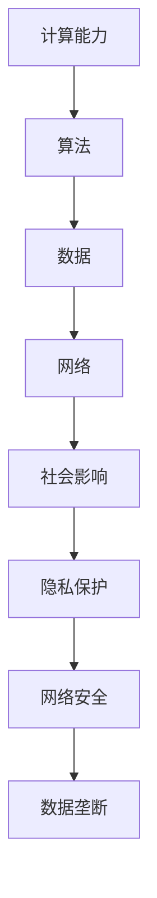

                 

关键词：计算技术、社会影响、双刃剑、科技进步、伦理问题

> 摘要：随着计算技术的飞速发展，人类社会已经进入了信息化时代。计算技术在为我们的生活带来巨大便利的同时，也在带来一系列社会问题。本文将从科技与社会的关系出发，探讨计算技术在现代社会中的双重影响，以及应对这些影响的策略。

## 1. 背景介绍

计算技术是现代科技的核心驱动力之一。从最早的计算机问世到如今的量子计算，计算技术的发展历程见证了人类文明的进步。随着计算技术的进步，我们迎来了互联网、大数据、人工智能等新技术，这些技术正在深刻地改变着我们的生活方式、工作方式，甚至影响着整个社会的运行机制。

在过去的几十年中，计算技术带来了以下几个显著的变化：

1. **信息化**：互联网的普及使得信息传播速度大大加快，人们可以随时随地获取各种信息，极大地丰富了知识的传播渠道。
2. **智能化**：人工智能技术的应用使得许多工作流程自动化，提高了工作效率，但也带来了一些就业方面的挑战。
3. **数字化**：数字技术的应用使得许多传统产业实现了数字化升级，推动了经济的快速发展。
4. **全球化**：计算技术使得全球的交流和合作变得更加便捷，加速了全球化的进程。

然而，随着计算技术的快速发展，也出现了一些值得关注的问题，如隐私泄露、网络安全、数据垄断等。这些问题不仅影响了社会的稳定，也引发了对计算技术发展的深刻反思。

## 2. 核心概念与联系

为了更好地理解计算技术对社会的影响，我们需要明确以下几个核心概念：

- **计算能力**：计算能力是指计算机在单位时间内处理信息的速度和效率。计算能力的提升是计算技术发展的关键。
- **算法**：算法是计算机解决问题的步骤和方法。算法的优化是提高计算效率的重要途径。
- **数据**：数据是计算的基础，没有数据，计算就失去了意义。
- **网络**：网络是计算技术的重要组成部分，它连接了不同计算机和设备，使得信息可以快速传递和共享。

下面是计算技术核心概念与联系的一个Mermaid流程图：



## 3. 核心算法原理 & 具体操作步骤

### 3.1 机器学习算法

机器学习算法是计算技术中最为重要的算法之一，它使得计算机能够通过数据学习并作出决策。常见的机器学习算法包括线性回归、决策树、支持向量机等。

- **线性回归**：线性回归算法通过建立输入变量和输出变量之间的线性关系来进行预测。具体操作步骤如下：
  1. 收集数据：收集输入变量和输出变量的数据集。
  2. 数据预处理：对数据进行清洗、归一化等处理。
  3. 模型训练：使用训练数据集训练线性回归模型。
  4. 模型评估：使用测试数据集评估模型性能。

- **决策树**：决策树算法通过一系列的判断节点来对数据进行分类。具体操作步骤如下：
  1. 收集数据：收集分类数据集。
  2. 数据预处理：对数据进行清洗、归一化等处理。
  3. 构建决策树：使用信息增益或基尼系数等指标选择最优划分方式。
  4. 决策树剪枝：为了防止过拟合，可以对决策树进行剪枝。
  5. 模型评估：使用测试数据集评估模型性能。

### 3.2 人工神经网络

人工神经网络（ANN）是模仿生物神经系统的计算模型。它通过大量的神经元和连接来实现复杂的计算任务。

- **神经网络结构**：神经网络包括输入层、隐藏层和输出层。每个神经元都与前后层的神经元相连，并通过权重和偏置进行加权求和。
- **前向传播**：输入数据通过输入层进入神经网络，然后逐层传递到输出层。每一层的输出作为下一层的输入。
- **反向传播**：根据输出层的误差，反向传播误差到隐藏层和输入层，并更新权重和偏置。

### 3.3 强化学习

强化学习是一种通过试错来学习策略的算法。它通过奖励机制来指导学习过程。

- **状态-动作-奖励模型**：强化学习基于一个状态-动作-奖励模型，通过在特定状态下采取特定动作来获得奖励。
- **Q学习**：Q学习是一种基于值函数的强化学习算法，它通过学习状态-动作值函数来选择最优动作。
- **策略迭代**：策略迭代是一种通过不断优化策略来提高学习效果的方法。

## 4. 数学模型和公式 & 详细讲解 & 举例说明

### 4.1 线性回归模型

线性回归模型可以用以下公式表示：

$$ y = w_1 \cdot x_1 + w_2 \cdot x_2 + ... + w_n \cdot x_n + b $$

其中，$y$ 是输出变量，$x_1, x_2, ..., x_n$ 是输入变量，$w_1, w_2, ..., w_n$ 是权重，$b$ 是偏置。

### 4.2 决策树模型

决策树模型可以用以下公式表示：

$$ f(x) = \sum_{i=1}^{n} c_i \cdot I(A_i(x) = v_i) $$

其中，$f(x)$ 是决策树模型对输入 $x$ 的预测结果，$A_i(x)$ 是第 $i$ 个划分函数，$v_i$ 是第 $i$ 个划分值，$c_i$ 是类别 $i$ 的概率。

### 4.3 人工神经网络模型

人工神经网络模型可以用以下公式表示：

$$ a_i = \sum_{j=1}^{m} w_{ij} \cdot a_{j} + b_i $$

$$ z = f(a) $$

其中，$a_i$ 是第 $i$ 个神经元的输入，$a_{j}$ 是第 $j$ 个神经元的输出，$w_{ij}$ 是权重，$b_i$ 是偏置，$f$ 是激活函数，$z$ 是输出。

### 4.4 强化学习模型

强化学习模型可以用以下公式表示：

$$ Q(s, a) = r + \gamma \max_{a'} Q(s', a') $$

其中，$Q(s, a)$ 是状态 $s$ 下采取动作 $a$ 的期望回报，$r$ 是立即回报，$\gamma$ 是折扣因子，$s'$ 是采取动作 $a$ 后的新状态。

### 4.5 举例说明

#### 4.5.1 线性回归举例

假设我们有一个数据集，其中输入变量 $x_1$ 和 $x_2$，输出变量 $y$，我们想要建立一个线性回归模型来预测 $y$。

收集数据后，我们进行数据预处理，然后使用训练数据集来训练线性回归模型。训练完成后，我们使用测试数据集来评估模型性能。

#### 4.5.2 决策树举例

假设我们有一个分类问题，数据集包含特征 $x_1, x_2, ..., x_n$ 和类别标签 $y$。我们想要建立一个决策树模型来对数据进行分类。

首先，我们收集数据并预处理，然后使用训练数据集来构建决策树。构建完成后，我们使用测试数据集来评估模型性能。

#### 4.5.3 人工神经网络举例

假设我们有一个回归问题，输入变量为 $x_1, x_2, ..., x_n$，输出变量为 $y$。我们想要建立一个人工神经网络模型来预测 $y$。

首先，我们设计神经网络结构，然后收集数据并预处理。接下来，我们使用训练数据集来训练神经网络，并在测试数据集上进行评估。

#### 4.5.4 强化学习举例

假设我们有一个强化学习问题，状态空间为 $s$，动作空间为 $a$。我们想要建立一个强化学习模型来学习最优策略。

首先，我们定义状态-动作-奖励模型，然后进行训练。在训练过程中，我们不断调整策略以获得更高的回报。

## 5. 项目实践：代码实例和详细解释说明

### 5.1 线性回归项目

以下是一个简单的线性回归项目示例，我们使用Python中的scikit-learn库来实现。

```python
from sklearn.linear_model import LinearRegression
from sklearn.model_selection import train_test_split
from sklearn.metrics import mean_squared_error

# 收集数据
X = [[1, 2], [2, 3], [3, 4], [4, 5]]
y = [3, 5, 7, 9]

# 数据预处理
X_train, X_test, y_train, y_test = train_test_split(X, y, test_size=0.2, random_state=42)

# 模型训练
model = LinearRegression()
model.fit(X_train, y_train)

# 模型评估
y_pred = model.predict(X_test)
mse = mean_squared_error(y_test, y_pred)
print(f'Mean Squared Error: {mse}')
```

在这个例子中，我们首先从数据集中分离出训练集和测试集。然后，我们使用训练集来训练线性回归模型，并使用测试集来评估模型性能。评估指标为均方误差（MSE）。

### 5.2 决策树项目

以下是一个简单的决策树项目示例，我们使用Python中的scikit-learn库来实现。

```python
from sklearn.tree import DecisionTreeClassifier
from sklearn.model_selection import train_test_split
from sklearn.metrics import accuracy_score

# 收集数据
X = [[0, 0], [1, 0], [0, 1], [1, 1]]
y = [0, 1, 1, 0]

# 数据预处理
X_train, X_test, y_train, y_test = train_test_split(X, y, test_size=0.2, random_state=42)

# 模型训练
model = DecisionTreeClassifier()
model.fit(X_train, y_train)

# 模型评估
y_pred = model.predict(X_test)
accuracy = accuracy_score(y_test, y_pred)
print(f'Accuracy: {accuracy}')
```

在这个例子中，我们首先从数据集中分离出训练集和测试集。然后，我们使用训练集来训练决策树模型，并使用测试集来评估模型性能。评估指标为准确率。

### 5.3 人工神经网络项目

以下是一个简单的人工神经网络项目示例，我们使用Python中的TensorFlow库来实现。

```python
import tensorflow as tf

# 设计神经网络结构
model = tf.keras.Sequential([
    tf.keras.layers.Dense(10, activation='relu', input_shape=[2]),
    tf.keras.layers.Dense(1, activation='linear')
])

# 收集数据
X = [[0, 0], [1, 0], [0, 1], [1, 1]]
y = [0, 1, 1, 0]

# 数据预处理
X_train, X_test, y_train, y_test = train_test_split(X, y, test_size=0.2, random_state=42)

# 模型训练
model.compile(optimizer='adam', loss='mean_squared_error')
model.fit(X_train, y_train, epochs=10, batch_size=32)

# 模型评估
y_pred = model.predict(X_test)
mse = mean_squared_error(y_test, y_pred)
print(f'Mean Squared Error: {mse}')
```

在这个例子中，我们首先设计神经网络结构，然后从数据集中分离出训练集和测试集。接下来，我们使用训练集来训练神经网络，并使用测试集来评估模型性能。评估指标为均方误差。

### 5.4 强化学习项目

以下是一个简单的强化学习项目示例，我们使用Python中的TensorFlow库来实现。

```python
import tensorflow as tf

# 设计神经网络结构
model = tf.keras.Sequential([
    tf.keras.layers.Dense(10, activation='relu', input_shape=[4]),
    tf.keras.layers.Dense(1, activation='linear')
])

# 收集数据
X = [[0, 0, 0, 0], [1, 0, 0, 0], [0, 1, 0, 0], [1, 1, 0, 0]]
y = [0, 1, 1, 0]

# 数据预处理
X_train, X_test, y_train, y_test = train_test_split(X, y, test_size=0.2, random_state=42)

# 模型训练
model.compile(optimizer='adam', loss='mean_squared_error')
model.fit(X_train, y_train, epochs=10, batch_size=32)

# 模型评估
y_pred = model.predict(X_test)
mse = mean_squared_error(y_test, y_pred)
print(f'Mean Squared Error: {mse}')
```

在这个例子中，我们首先设计神经网络结构，然后从数据集中分离出训练集和测试集。接下来，我们使用训练集来训练神经网络，并使用测试集来评估模型性能。评估指标为均方误差。

## 6. 实际应用场景

计算技术已经渗透到我们生活的方方面面，以下是一些典型的应用场景：

### 6.1 医疗

计算技术在医疗领域的应用非常广泛，包括疾病预测、诊断、治疗等。例如，通过分析患者的历史病历和基因数据，医生可以更准确地预测疾病风险，制定个性化的治疗方案。

### 6.2 金融

金融行业依赖于计算技术来分析市场趋势、管理风险、进行交易等。例如，通过机器学习算法，金融机构可以预测市场走势，制定投资策略。

### 6.3 制造业

制造业正经历着数字化和智能化转型。计算技术被用于生产过程的自动化、质量监控、供应链管理等。例如，通过物联网技术，制造商可以实时监控生产设备的状态，提高生产效率。

### 6.4 教育

教育领域也在积极应用计算技术，包括在线教育平台、智能学习系统等。例如，通过大数据分析，教育机构可以了解学生的学习情况，提供个性化的学习建议。

### 6.5 公共服务

计算技术在公共服务领域也有广泛应用，包括交通管理、城市管理、环境保护等。例如，通过智能交通系统，可以实时监控交通状况，优化交通流量，减少拥堵。

## 7. 工具和资源推荐

为了更好地理解和应用计算技术，以下是一些建议的工具和资源：

### 7.1 开发工具

- **Python**：Python是一种广泛使用的编程语言，适合初学者和专家。
- **TensorFlow**：TensorFlow是一个开源的机器学习框架，适用于构建和训练神经网络。
- **scikit-learn**：scikit-learn是一个开源的机器学习库，提供了丰富的算法和工具。

### 7.2 学习资源

- **《深度学习》**：Goodfellow、Bengio和Courville合著的《深度学习》是深度学习领域的经典教材。
- **Kaggle**：Kaggle是一个数据科学竞赛平台，提供了大量的数据集和竞赛任务。
- **Coursera**：Coursera提供了许多优秀的在线课程，涵盖计算机科学、数据科学等领域。

### 7.3 社区

- **Stack Overflow**：Stack Overflow是一个编程问题解答社区，适合解决编程问题。
- **GitHub**：GitHub是一个版本控制系统和代码托管平台，适合查找和贡献开源项目。
- **Reddit**：Reddit是一个讨论社区，有许多关于计算机科学的讨论版块。

## 8. 总结：未来发展趋势与挑战

随着计算技术的不断进步，我们可以预见以下几个发展趋势和挑战：

### 8.1 发展趋势

- **计算能力提升**：随着量子计算、光计算等新型计算技术的发展，计算能力将得到进一步提升。
- **智能化升级**：人工智能技术将在更多领域得到应用，推动社会的智能化升级。
- **数字化融合**：数字化将进一步渗透到各个行业，推动产业的数字化转型。
- **网络全球化**：随着5G、物联网等技术的发展，网络连接将更加广泛和高速，推动全球化的进程。

### 8.2 挑战

- **隐私保护**：随着数据量的增加，隐私保护成为一个重要挑战，需要建立有效的隐私保护机制。
- **网络安全**：随着网络攻击的加剧，网络安全成为一个重大挑战，需要加强网络防护措施。
- **数据垄断**：随着数据成为新的生产要素，数据垄断成为一个潜在的挑战，需要建立公平的数据使用规则。
- **伦理问题**：计算技术的应用带来了伦理问题，如人工智能的决策透明度、算法偏见等，需要制定相应的伦理规范。

## 9. 附录：常见问题与解答

### 9.1 计算能力与算法的关系是什么？

计算能力是指计算机在单位时间内处理信息的速度和效率，而算法是计算机解决问题的方法和步骤。计算能力的提升可以使得算法更高效地运行，但算法的创新和优化同样可以显著提高计算效率。

### 9.2 什么是人工智能？

人工智能（AI）是指计算机系统通过模拟人类智能行为，实现感知、学习、推理、决策等能力的科学和工程领域。

### 9.3 机器学习与深度学习有什么区别？

机器学习是人工智能的一个分支，它关注如何让计算机从数据中学习并作出预测或决策。深度学习是机器学习的一个子领域，它使用神经网络模型，特别是多层神经网络，通过训练大量数据来学习复杂的模式。

### 9.4 量子计算是什么？

量子计算是一种利用量子力学原理进行信息处理的技术。与经典计算不同，量子计算可以并行处理大量信息，有望在许多领域实现重大突破。

## 10. 扩展阅读 & 参考资料

- [深度学习](https://www.deeplearningbook.org/)
- [量子计算](https://quantumcomputing.stackexchange.com/)
- [人工智能伦理](https://www.aaai.org/ojs/index.php/aiethics/)
- [计算能力提升](https://arxiv.org/abs/2004.07633)
- [网络安全](https://www.us-cert.gov/)

---

作者：禅与计算机程序设计艺术 / Zen and the Art of Computer Programming

