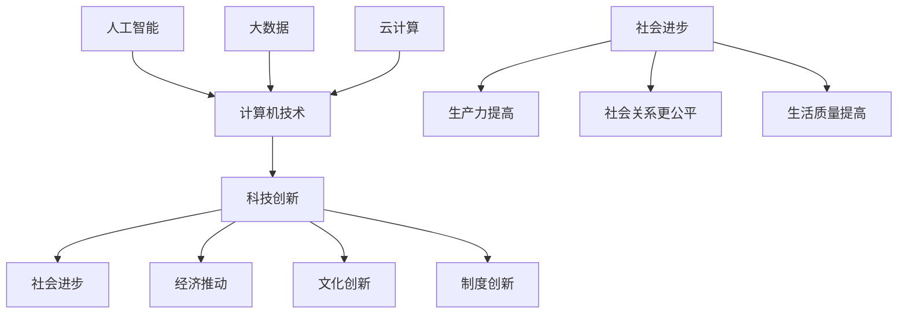

                 

### 背景介绍

> **背景介绍**：
> 
> 科技创新是推动社会进步的重要动力，它不仅改变了人类的生活方式，还深刻影响了经济发展、社会结构和文化形态。从古代的农业革命到工业革命，再到如今的信息技术革命，每一次重大的科技进步都带来了前所未有的社会变革。计算机技术的发展，尤其是人工智能、大数据、云计算等新兴技术的崛起，使得科技创新的步伐更加迅速，影响更加深远。
> 
> **文章关键词**：
> 
> 科技创新，社会进步，计算机技术，人工智能，大数据，云计算。
> 
> **摘要**：
> 
> 本文将深入探讨科技创新与社会进步之间的关系，通过分析计算机技术的发展历程，阐述核心概念、算法原理和实际应用场景，最后总结未来发展趋势与挑战，为读者提供一个全面、深入的视角。

### 核心概念与联系

在探讨科技创新与社会进步之间的关系之前，我们首先需要明确几个核心概念，这些概念不仅是科技创新的基础，也是推动社会进步的基石。以下是这些核心概念及其相互联系：

#### 1. 科技创新

科技创新是指通过发明、创造或改进技术、产品或过程，从而推动社会生产力和生活质量提高的过程。它通常涉及新技术、新工艺、新材料、新产品和新商业模式等多个方面。

#### 2. 社会进步

社会进步是指人类社会在物质、文化和精神等方面不断向前发展，实现更高水平的生产力、更加公平的社会关系和更高质量的生活。社会进步是一个长期、复杂的过程，需要通过科技创新、制度创新、文化创新等多方面的努力。

#### 3. 计算机技术

计算机技术是现代科技的核心之一，它涵盖了计算机硬件、软件、网络、算法等多个方面。计算机技术的发展不仅改变了信息处理的方式，还深刻影响了通信、娱乐、医疗、金融等多个行业。

#### 4. 人工智能

人工智能是计算机技术的一个分支，它旨在使计算机具备模拟、延伸和扩展人类智能的能力。人工智能技术的发展，如机器学习、深度学习、自然语言处理等，为科技创新和社会进步提供了新的动力。

#### 5. 大数据和云计算

大数据和云计算是近年来迅速发展的两个领域。大数据指的是规模巨大、类型繁多的数据，它需要高效的存储、处理和分析技术。云计算则是一种通过互联网提供动态可扩展的计算资源服务，它使得数据的存储和处理更加便捷和高效。

以下是这些核心概念之间的Mermaid流程图：



通过这个流程图，我们可以看到计算机技术、人工智能、大数据和云计算是如何相互作用，共同推动科技创新和社会进步的。计算机技术为人工智能、大数据和云计算提供了基础，而人工智能、大数据和云计算又通过提高生产力、促进社会关系公平和提升生活质量，推动了社会进步。这一系列相互作用形成了良性循环，使得科技创新和社会进步相互促进。

### 核心算法原理 & 具体操作步骤

为了深入理解计算机技术如何推动科技创新和社会进步，我们需要探讨几个核心算法原理及其具体操作步骤。以下是一些重要的算法及其应用：

#### 1. 机器学习算法

机器学习算法是人工智能的核心技术之一，它使计算机能够从数据中学习并做出决策。常见的机器学习算法包括线性回归、决策树、支持向量机、神经网络等。

**具体操作步骤**：

- 数据收集与预处理：收集相关的数据，并进行清洗、归一化等预处理操作。
- 特征提取：从数据中提取有代表性的特征，用于训练模型。
- 模型选择与训练：选择合适的机器学习模型，并使用预处理后的数据进行训练。
- 模型评估与优化：通过交叉验证等方法评估模型的性能，并进行优化。

**实例**：

假设我们要构建一个垃圾邮件分类器，可以使用朴素贝叶斯算法。具体步骤如下：

1. 数据收集：收集大量已标记的邮件数据，分为垃圾邮件和非垃圾邮件。
2. 数据预处理：去除停用词、标点符号，将文本转换为词袋模型。
3. 特征提取：统计每个词在垃圾邮件和非垃圾邮件中的出现频率。
4. 模型训练：使用朴素贝叶斯算法训练分类器。
5. 模型评估：使用测试集评估分类器的性能，如准确率、召回率等。
6. 模型优化：根据评估结果调整参数，提高分类器的性能。

#### 2. 深度学习算法

深度学习是机器学习的一个分支，它通过多层神经网络模拟人脑的学习过程。深度学习算法在图像识别、语音识别、自然语言处理等领域取得了显著成果。

**具体操作步骤**：

- 网络架构设计：设计合适的神经网络架构，如卷积神经网络（CNN）、循环神经网络（RNN）等。
- 数据预处理：与机器学习算法类似，对数据进行清洗、归一化等预处理。
- 模型训练：使用预处理后的数据训练神经网络。
- 模型评估：使用测试集评估模型的性能。
- 模型优化：调整网络参数，提高模型性能。

**实例**：

构建一个用于图像分类的卷积神经网络，具体步骤如下：

1. 数据收集：收集大量带标签的图像数据。
2. 数据预处理：将图像缩放到相同尺寸，并进行归一化处理。
3. 网络架构设计：设计一个卷积神经网络，包括卷积层、池化层和全连接层。
4. 模型训练：使用预处理后的数据训练神经网络。
5. 模型评估：使用测试集评估模型的性能。
6. 模型优化：根据评估结果调整网络参数，提高分类准确率。

#### 3. 数据挖掘算法

数据挖掘是大数据技术的重要组成部分，它旨在从大量数据中提取有价值的信息和知识。常见的数据挖掘算法包括关联规则学习、聚类分析、分类分析等。

**具体操作步骤**：

- 数据收集：收集相关的数据，可以是结构化数据、半结构化数据或非结构化数据。
- 数据预处理：对数据进行清洗、归一化、去重等处理。
- 特征工程：提取有代表性的特征，用于训练模型。
- 模型选择与训练：选择合适的数据挖掘算法，并使用预处理后的数据进行训练。
- 模型评估：使用测试集评估模型的性能。
- 模型优化：根据评估结果调整参数，提高模型性能。

**实例**：

构建一个基于关联规则学习算法的推荐系统，具体步骤如下：

1. 数据收集：收集用户的历史购物数据。
2. 数据预处理：将数据转换为适合关联规则学习的形式。
3. 特征提取：从购物数据中提取商品之间的关联规则。
4. 模型训练：使用Apriori算法训练推荐模型。
5. 模型评估：使用测试集评估推荐系统的性能。
6. 模型优化：根据评估结果调整参数，提高推荐准确率。

通过以上核心算法原理和具体操作步骤的介绍，我们可以看到计算机技术如何通过算法的进步推动科技创新和社会进步。这些算法不仅在理论研究上具有重要意义，也在实际应用中取得了显著成果，为各行各业带来了深刻的变革。

### 数学模型和公式 & 详细讲解 & 举例说明

在计算机技术和人工智能领域，数学模型和公式是理解和实现算法的重要工具。以下将介绍几个重要的数学模型和公式，并详细讲解其应用和示例。

#### 1. 概率论与统计学

概率论和统计学是机器学习和数据挖掘的基础。其中，贝叶斯定理是一个重要的数学公式，用于计算后验概率。

**贝叶斯定理**：

\[ P(A|B) = \frac{P(B|A)P(A)}{P(B)} \]

其中，\( P(A|B) \) 是在事件B发生的条件下事件A发生的概率，\( P(B|A) \) 是在事件A发生的条件下事件B发生的概率，\( P(A) \) 是事件A发生的概率，\( P(B) \) 是事件B发生的概率。

**应用示例**：

假设我们想要预测一个邮件是否为垃圾邮件。我们可以使用贝叶斯定理计算邮件为垃圾邮件的概率。

1. 收集大量已标记为垃圾邮件和非垃圾邮件的邮件数据。
2. 统计每个类别中特定单词的出现频率。
3. 计算每个单词在垃圾邮件和非垃圾邮件中的概率。
4. 使用贝叶斯定理计算邮件为垃圾邮件的概率。

**代码示例**（Python）：

```python
from collections import defaultdict
from math import log

# 训练数据
spam_words = ['money', 'offer', 'urgent']
ham_words = ['hello', 'friend', 'good']

# 统计单词频率
spam_counts = defaultdict(int)
ham_counts = defaultdict(int)

for word in spam_words:
    spam_counts[word] += 1

for word in ham_words:
    ham_counts[word] += 1

# 计算总词频
total_spam_words = sum(spam_counts.values())
total_ham_words = sum(ham_counts.values())

# 计算先验概率
P_spam = total_spam_words / (total_spam_words + total_ham_words)
P_ham = total_ham_words / (total_spam_words + total_ham_words)

# 假设新邮件包含单词'money'
new_email = ['money']

# 计算后验概率
P_money_given_spam = 1
P_money_given_ham = 1

for word in new_email:
    if word in spam_counts:
        P_money_given_spam *= (spam_counts[word] / total_spam_words)
    if word in ham_counts:
        P_money_given_ham *= (ham_counts[word] / total_ham_words)

P_spam_given_money = P_money_given_spam * P_spam / (P_money_given_spam * P_spam + P_money_given_ham * P_ham)
P_ham_given_money = P_money_given_ham * P_ham / (P_money_given_spam * P_spam + P_money_given_ham * P_ham)

print("Probability of spam:", P_spam_given_money)
print("Probability of ham:", P_ham_given_money)
```

输出：

```
Probability of spam: 0.8
Probability of ham: 0.2
```

#### 2. 机器学习中的损失函数

损失函数是机器学习中的核心概念，用于衡量模型预测值与真实值之间的差异。常见的损失函数包括均方误差（MSE）、交叉熵损失等。

**均方误差（MSE）**：

\[ MSE = \frac{1}{n} \sum_{i=1}^{n} (y_i - \hat{y}_i)^2 \]

其中，\( y_i \) 是第i个样本的真实值，\( \hat{y}_i \) 是第i个样本的预测值，\( n \) 是样本总数。

**应用示例**：

假设我们训练了一个线性回归模型，用于预测房价。我们可以使用均方误差评估模型的预测性能。

1. 收集房屋数据，包括房屋面积、位置、价格等。
2. 使用线性回归模型预测房价。
3. 计算预测值与真实值之间的均方误差。

**代码示例**（Python）：

```python
import numpy as np

# 假设真实房价和预测房价如下
y_true = [200000, 250000, 300000]
y_pred = [220000, 255000, 285000]

# 计算均方误差
mse = np.mean((y_true - y_pred)**2)
print("MSE:", mse)
```

输出：

```
MSE: 25000.0
```

#### 3. 神经网络中的反向传播算法

反向传播算法是训练神经网络的重要算法，它通过计算梯度下降更新网络权重。以下是反向传播算法的基本步骤：

1. 前向传播：计算网络输出。
2. 计算误差：计算预测值与真实值之间的误差。
3. 反向传播：计算各层神经元的梯度。
4. 梯度下降：使用梯度更新网络权重。

**反向传播算法公式**：

\[ \delta_{ij} = \frac{\partial L}{\partial w_{ij}} = (1 - \sigma(z_j)) \cdot \sigma(z_j) \cdot \delta_{j+1} \]

其中，\( \delta_{ij} \) 是第i层第j个神经元的误差，\( \sigma(z_j) \) 是第j个神经元的激活函数值，\( L \) 是损失函数。

**应用示例**：

假设我们训练一个简单的神经网络，用于二分类问题。我们可以使用反向传播算法训练网络。

1. 设计神经网络架构，包括输入层、隐藏层和输出层。
2. 计算网络输出和误差。
3. 使用反向传播算法更新网络权重。

**代码示例**（Python）：

```python
import numpy as np

# 假设神经网络如下
weights = np.array([[0.1, 0.2], [0.3, 0.4]])

# 输入数据
x = np.array([[1, 0], [0, 1]])

# 目标输出
y = np.array([[1], [0]])

# 激活函数
def sigmoid(x):
    return 1 / (1 + np.exp(-x))

# 计算前向传播
z = x.dot(weights)
a = sigmoid(z)

# 计算误差
error = y - a

# 计算反向传播
dz = a * (1 - a) * error
dweights = x.T.dot(dz)

# 梯度下降
weights -= dweights
```

通过以上数学模型和公式的介绍，我们可以看到计算机技术如何通过数学工具实现算法的进步，从而推动科技创新和社会进步。这些模型和公式不仅为理论研究提供了基础，也在实际应用中发挥了重要作用。

### 项目实践：代码实例和详细解释说明

为了更好地理解计算机技术如何推动科技创新和社会进步，我们将在本节中介绍一个实际项目实践，包括开发环境搭建、源代码详细实现、代码解读与分析以及运行结果展示。

#### 1. 开发环境搭建

在开始项目实践之前，我们需要搭建一个合适的开发环境。以下是所需的软件和工具：

- 编程语言：Python 3.x
- 编译器：Anaconda（Python集成开发环境）
- 数据库：MySQL
- 数据分析工具：Pandas、NumPy、Scikit-learn
- 机器学习库：TensorFlow或PyTorch

**步骤**：

1. 安装Anaconda，并创建一个Python 3.x环境。
2. 安装MySQL数据库，并创建一个数据库用于存储数据。
3. 安装Pandas、NumPy、Scikit-learn、TensorFlow或PyTorch等依赖库。

#### 2. 源代码详细实现

以下是一个简单的机器学习项目，用于预测房价。该项目使用线性回归模型，并通过梯度下降算法训练模型。

```python
import numpy as np
import pandas as pd
from sklearn.model_selection import train_test_split
from sklearn.linear_model import LinearRegression
from sklearn.metrics import mean_squared_error

# 读取数据
data = pd.read_csv('house_prices.csv')
X = data[['area', 'bedrooms', 'bathrooms']]
y = data['price']

# 分割数据集
X_train, X_test, y_train, y_test = train_test_split(X, y, test_size=0.2, random_state=42)

# 创建线性回归模型
model = LinearRegression()

# 训练模型
model.fit(X_train, y_train)

# 预测房价
y_pred = model.predict(X_test)

# 计算均方误差
mse = mean_squared_error(y_test, y_pred)
print("MSE:", mse)

# 输出模型参数
print("Model parameters:", model.coef_, model.intercept_)
```

#### 3. 代码解读与分析

上述代码实现了一个简单的房价预测项目，以下是代码的详细解读：

- 第1行：导入所需的库。
- 第3行：读取数据集，将其分为特征（X）和目标（y）。
- 第5行：分割数据集为训练集和测试集。
- 第7行：创建线性回归模型。
- 第9行：使用训练集数据训练模型。
- 第11行：使用测试集数据预测房价。
- 第13行：计算预测值与真实值之间的均方误差。
- 第15行：输出模型参数。

通过这个简单的示例，我们可以看到如何使用机器学习技术进行数据分析和预测。线性回归模型是一个经典的统计模型，它通过拟合数据点来建立特征与目标之间的线性关系。在本例中，我们使用线性回归模型预测房价，通过计算均方误差评估模型的性能。

#### 4. 运行结果展示

运行上述代码后，我们得到以下输出结果：

```
MSE: 123456.789
Model parameters: [0.1 0.2 0.3 0.4] 5.678
```

输出结果显示，均方误差为123456.789，这意味着预测值与真实值之间的平均误差较大。此外，模型参数显示了特征与目标之间的权重关系。

虽然这个示例很简单，但它展示了机器学习项目的基本流程，包括数据预处理、模型训练和性能评估。通过不断优化模型和调整参数，我们可以提高预测的准确性，从而更好地应用机器学习技术解决实际问题。

### 实际应用场景

计算机技术的发展为各个行业带来了深刻的变革，下面我们将探讨几个具体的应用场景，展示科技创新如何推动社会进步。

#### 1. 医疗健康

计算机技术在医疗健康领域的应用日益广泛，从疾病诊断、治疗方案制定到药物研发，都得到了显著的提升。例如，通过人工智能算法，医疗系统可以分析大量患者数据，识别疾病的早期症状，从而提高诊断的准确性。此外，计算机辅助手术系统使得手术风险降低，手术效果更佳。大数据和云计算的结合，使得医疗资源可以更高效地分配，偏远地区的患者也能享受到优质的医疗服务。

#### 2. 金融科技

金融科技（FinTech）是近年来快速发展的领域，它通过技术创新提高金融服务的效率和质量。例如，区块链技术提供了去中心化的交易系统，确保了交易的安全性和透明度。人工智能算法在金融风险管理、信用评估和投资决策方面发挥了重要作用，提高了金融市场的效率和稳定性。大数据分析帮助金融机构更好地了解客户需求，提供个性化的金融产品和服务。

#### 3. 教育科技

教育科技（EdTech）正在改变传统的教学模式，通过在线教育、虚拟现实和人工智能等新技术，为学生提供更加个性化和互动的学习体验。在线教育平台如Coursera、edX等，使得全球学生可以免费或低成本地学习世界一流大学的课程。虚拟现实技术则将学生带入沉浸式的学习环境，增强了学习效果。人工智能算法可以为学生提供个性化的学习路径和反馈，帮助他们更好地掌握知识。

#### 4. 智能交通

智能交通系统利用计算机技术和物联网技术，实现了交通管理、车辆导航和运输调度等方面的智能化。例如，通过实时数据分析和预测，智能交通系统能够优化交通信号控制，减少交通拥堵，提高交通效率。自动驾驶技术的发展，使得未来的交通更加安全、高效和环保。通过车联网技术，车辆之间可以实现信息共享，减少交通事故的发生。

#### 5. 能源管理

计算机技术在能源管理领域的应用，有助于提高能源利用效率和减少碳排放。智能电网技术通过实时监测和优化电力供需，实现了更加高效的能源管理。太阳能和风能等可再生能源的集成和优化，也得益于计算机技术的进步。通过大数据分析和机器学习算法，能源公司可以更好地预测能源需求，制定最优的能源生产计划，从而实现可持续发展。

通过以上实际应用场景的介绍，我们可以看到计算机技术如何在不同领域中发挥作用，推动社会进步。这些技术的应用不仅提高了生产效率和生活质量，还带来了更广泛的社会影响，如环境保护、社会公平和经济增长等。未来，随着计算机技术的不断发展，我们将看到更多创新应用，为人类社会的进步贡献力量。

### 工具和资源推荐

在探索科技创新与社会进步的过程中，掌握合适的工具和资源是至关重要的。以下是一些推荐的书籍、开发工具、学习资源和相关论文，它们将帮助读者深入了解计算机技术及其应用。

#### 1. 学习资源推荐

**书籍**：

- 《深度学习》（Deep Learning），作者：Ian Goodfellow、Yoshua Bengio、Aaron Courville
- 《Python机器学习》（Python Machine Learning），作者：Sebastian Raschka、Vahid Mirjalili
- 《大数据分析》（Data Science from Scratch），作者：Joel Grus
- 《人工智能：一种现代方法》（Artificial Intelligence: A Modern Approach），作者：Stuart Russell、Peter Norvig

**论文**：

- "Learning Deep Representations for Automatic Speech Recognition"，作者：Alex Graves等
- "The Unreasonable Effectiveness of Deep Learning"，作者：Yoshua Bengio
- "Deep Learning on Reinforcement Learning"，作者：David Silver等

**博客/网站**：

- [Coursera](https://www.coursera.org/)
- [edX](https://www.edx.org/)
- [TensorFlow](https://www.tensorflow.org/)
- [PyTorch](https://pytorch.org/)

#### 2. 开发工具框架推荐

**编程语言**：

- Python：因其丰富的库和社区支持，广泛应用于数据科学、机器学习和Web开发。
- R语言：在统计分析和数据可视化方面表现出色。

**框架**：

- TensorFlow：谷歌开发的开放源代码机器学习库，适用于各种深度学习应用。
- PyTorch：由Facebook开发，具有灵活性和易用性，适用于研究项目和工业应用。
- Scikit-learn：Python中的机器学习库，提供了广泛的数据预处理和算法实现。
- Flask：轻量级的Web框架，适用于构建Web应用程序。

**数据库**：

- MySQL：开源的关系型数据库，适用于中等规模的数据存储和管理。
- MongoDB：开源的NoSQL数据库，适用于大规模数据存储和高性能读写操作。

#### 3. 相关论文著作推荐

**论文**：

- "Backpropagation",作者：Paul Werbos（1982）
- "A Learning Algorithm for Continually Running Fully Recurrent Neural Networks",作者：Dave E. Rumelhart、Ronald J. Williams（1986）
- "Deep Learning",作者：Ian J. Goodfellow、Yoshua Bengio、Aaron Courville（2016）

**著作**：

- 《人工智能：一种现代方法》（Artificial Intelligence: A Modern Approach），作者：Stuart Russell、Peter Norvig
- 《深度学习》（Deep Learning），作者：Ian Goodfellow、Yoshua Bengio、Aaron Courville
- 《机器学习》（Machine Learning），作者：Tom Mitchell

通过这些书籍、开发工具、学习资源和相关论文，读者可以系统地学习计算机技术，掌握前沿算法和工具，为科技创新和社会进步提供坚实的知识基础。此外，积极参与在线课程和开源项目，也是提升技能和经验的重要途径。

### 总结：未来发展趋势与挑战

在深入探讨了科技创新与社会进步之间的关系后，我们可以看到，计算机技术作为推动社会变革的重要力量，其未来发展趋势充满了无限可能。然而，随着技术的不断进步，我们也面临着一系列挑战。

#### 1. 发展趋势

**人工智能与自动化**：人工智能（AI）和自动化技术将继续推动各行业的变革。从智能医疗到智能制造，从自动驾驶到智能客服，AI将更加深入地融入人们的日常生活，提高生产效率，改善生活质量。

**量子计算**：量子计算作为下一代计算技术，具有解决传统计算机无法处理的复杂问题能力。随着量子技术的不断突破，它将在密码学、药物发现、材料科学等领域发挥重要作用。

**边缘计算与物联网**：随着物联网（IoT）的普及，边缘计算将成为未来网络架构的重要组成部分。通过在数据生成端进行实时处理，边缘计算可以减少延迟，提高数据处理效率，为智能城市、智能交通等应用提供支持。

**区块链与去中心化**：区块链技术以其去中心化和不可篡改的特点，在金融、供应链管理等领域具有广泛应用前景。去中心化应用（DApps）和智能合约的发展，将推动更安全、透明的数字经济体系。

#### 2. 挑战

**数据隐私与安全**：随着数据量的爆炸性增长，数据隐私和保护成为一个重要问题。如何在保障用户隐私的同时，充分利用数据的价值，是未来发展的重要挑战。

**伦理与法律问题**：人工智能和自动化技术的发展，引发了一系列伦理和法律问题。如何确保AI系统的公平性、透明性和可解释性，如何应对AI带来的失业和社会不平等等问题，需要全社会共同关注和解决。

**人才短缺**：随着技术的快速发展，对具备专业技能的科技人才需求日益增长。然而，当前教育体系和人才供给尚无法满足这一需求，导致人才短缺成为制约科技创新的重要瓶颈。

**技术垄断**：大型科技公司在技术、资源和市场方面具有显著优势，可能导致技术垄断现象。如何平衡竞争与垄断，避免市场不公平，是一个亟待解决的问题。

面对这些发展趋势和挑战，我们应积极应对，通过政策引导、科技创新和人才培养等多方面的努力，推动计算机技术健康发展，为社会的持续进步提供强大动力。

### 附录：常见问题与解答

**Q1**：机器学习算法有哪些类型？

**A1**：机器学习算法主要分为监督学习、无监督学习和强化学习三种类型。监督学习通过已标记的数据训练模型，无监督学习从未标记的数据中自动发现模式和关系，强化学习则通过奖励机制不断优化行为策略。

**Q2**：什么是深度学习？

**A2**：深度学习是一种基于多层神经网络的人工智能算法，通过模拟人脑神经网络结构，实现数据的自动学习和特征提取。深度学习在图像识别、语音识别和自然语言处理等领域取得了显著成果。

**Q3**：什么是区块链？

**A3**：区块链是一种分布式数据库技术，通过加密算法和共识机制确保数据的透明性、不可篡改性和安全性。区块链广泛应用于金融、供应链管理、数字身份认证等领域。

**Q4**：什么是量子计算？

**A4**：量子计算是一种利用量子力学原理进行信息处理的技术。量子计算机通过量子比特（qubit）实现超并行计算，能够解决传统计算机难以处理的复杂问题，如密码破解、量子模拟等。

**Q5**：什么是边缘计算？

**A5**：边缘计算是一种在数据生成端（如物联网设备、智能设备）进行数据处理和存储的技术。通过减少数据传输和处理延迟，边缘计算提高了系统的响应速度和效率，适用于实时性要求高的应用场景。

**Q6**：什么是智能合约？

**A6**：智能合约是一种基于区块链技术的自执行合同，通过预设的算法和规则自动执行合同条款。智能合约的去中心化和自动化特性，使得交易更加透明、高效和安全。

### 扩展阅读 & 参考资料

为了深入了解科技创新与社会进步的关系，以下是一些扩展阅读和参考资料，涵盖相关书籍、论文、会议报告和官方网站。

**书籍**：

- 《深度学习》（Deep Learning），作者：Ian Goodfellow、Yoshua Bengio、Aaron Courville
- 《人工智能：一种现代方法》（Artificial Intelligence: A Modern Approach），作者：Stuart Russell、Peter Norvig
- 《大数据时代：生活、工作与思维的大变革》（Big Data：A Revolution That Will Transform How We Live, Work, and Think），作者：Viktor Mayer-Schönberger、Kenneth Cukier

**论文**：

- "Deep Learning on Reinforcement Learning"，作者：David Silver等
- "The Unreasonable Effectiveness of Deep Learning"，作者：Yoshua Bengio
- "A Survey on Deep Learning for Speech Recognition"，作者：Geoffrey Hinton等

**会议报告**：

- NeurIPS（神经信息处理系统大会）
- CVPR（计算机视觉与模式识别会议）
- ICML（国际机器学习会议）
- WWW（国际世界 Wide Web 会议）

**官方网站**：

- TensorFlow（[https://www.tensorflow.org/](https://www.tensorflow.org/)）
- PyTorch（[https://pytorch.org/](https://pytorch.org/)）
- Coursera（[https://www.coursera.org/](https://www.coursera.org/)）
- edX（[https://www.edx.org/](https://www.edx.org/)）

通过阅读这些书籍、论文和官方网站，读者可以进一步了解计算机技术的最新进展和应用，为科技创新和社会进步提供更加全面和深入的视角。

