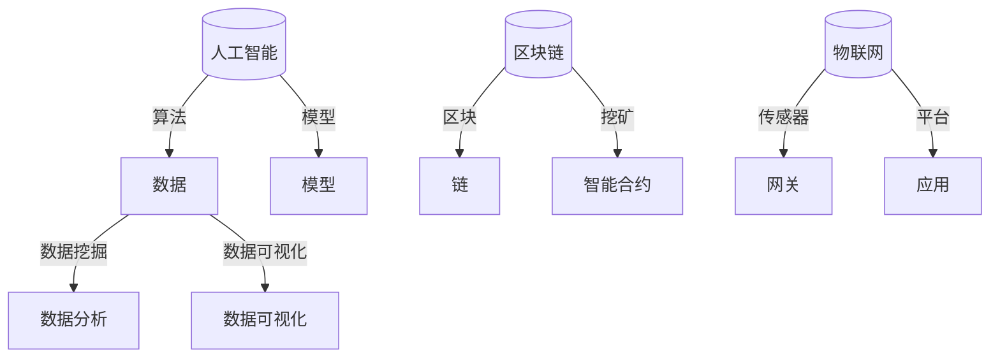

                 

### 文章标题

科技创新：社会进步的阶梯

> **关键词**：科技创新、社会进步、人工智能、技术发展、算法、数学模型、实践应用、工具推荐

> **摘要**：本文将探讨科技创新如何推动社会进步，通过分析核心概念、算法原理、数学模型以及实际应用，阐述技术发展对社会各方面的深远影响，并展望未来的发展趋势与挑战。作者将以严谨的逻辑和清晰的步骤，带领读者走进科技创新的世界。

### 1. 背景介绍

在当今这个时代，科技创新已成为推动社会进步的核心动力。从早期的工业革命，到现代的信息技术革命，技术进步不断地改变着我们的生活、工作和思维方式。创新不仅是企业发展的关键，也是国家竞争力的源泉。科技创新的成果不仅体现在经济和产业层面，更深刻地影响着社会、文化、政治等各个领域。

科技创新的重要性不可低估。它不仅带来了生产力的飞跃，也推动了社会制度的变革。例如，互联网和移动通信技术的崛起，彻底改变了信息传播和社交模式，催生了数字经济和共享经济的新业态。人工智能和大数据技术的应用，不仅提升了生产效率，也极大地丰富了人们的娱乐和生活体验。可以说，每一次重大的技术突破，都为社会进步打开了新的可能性。

本文旨在通过以下章节的逐步分析，深入探讨科技创新的核心概念、算法原理、数学模型以及实际应用，展示技术发展对社会各个方面的深远影响，并展望未来的发展趋势与挑战。

### 2. 核心概念与联系

在探讨科技创新对社会进步的影响之前，我们首先需要了解一些核心概念，它们是科技创新的基础，也是连接不同技术领域的重要纽带。

#### 2.1 人工智能

人工智能（AI）是当前最热门的科技创新领域之一。它涉及机器学习、深度学习、自然语言处理等多个子领域。人工智能的目标是使计算机具备类似于人类的智能，能够自主学习、推理和解决问题。人工智能的核心概念包括算法、数据和模型。

- **算法**：算法是解决特定问题的方法，是人工智能的灵魂。常见的算法有神经网络、决策树、支持向量机等。
- **数据**：数据是训练人工智能模型的基石。高质量的数据能够提升模型的准确性和性能。
- **模型**：模型是算法和数据结合的结果，它定义了人工智能的行为和决策方式。

#### 2.2 大数据

大数据是另一个重要的核心概念。随着互联网和物联网的普及，数据量呈爆炸式增长。大数据技术包括数据采集、存储、处理和分析等环节。大数据的核心概念包括数据挖掘、数据分析、数据可视化等。

- **数据挖掘**：数据挖掘是从大量数据中提取有价值信息的过程，它利用算法和统计方法发现数据中的模式。
- **数据分析**：数据分析是对数据进行分析和理解的过程，它帮助人们做出更明智的决策。
- **数据可视化**：数据可视化是将数据以图形或图表的形式展示出来，使人们能够直观地理解数据。

#### 2.3 区块链

区块链技术是一种分布式账本技术，它通过密码学和共识算法确保数据的不可篡改性和透明性。区块链的核心概念包括区块、链、挖矿、智能合约等。

- **区块**：区块是区块链的基本单位，它包含一系列交易记录。
- **链**：链是由多个区块按照时间顺序连接而成的数据结构。
- **挖矿**：挖矿是区块链网络中通过计算产生新区块的过程。
- **智能合约**：智能合约是自动执行合约条款的计算机程序，它基于区块链技术实现。

#### 2.4 物联网

物联网（IoT）是通过互联网连接各种物理设备和传感器，实现设备之间的数据交换和智能控制。物联网的核心概念包括传感器、网关、平台、应用等。

- **传感器**：传感器是物联网的感知设备，它能够检测和测量各种物理量。
- **网关**：网关是物联网网络中的数据交换中心，它负责将传感器数据转发到云平台或中心系统。
- **平台**：物联网平台是管理和处理物联网设备数据的系统，它提供数据存储、分析和可视化等功能。
- **应用**：物联网应用是利用物联网技术实现特定功能的软件系统。

为了更好地理解这些核心概念之间的联系，我们可以使用Mermaid流程图来展示它们之间的关系：



通过这个流程图，我们可以清晰地看到人工智能、大数据、区块链和物联网之间的关系，以及它们在不同技术领域中的应用。

### 3. 核心算法原理 & 具体操作步骤

在了解了核心概念之后，我们接下来将探讨这些领域的核心算法原理，并详细说明它们的操作步骤。

#### 3.1 人工智能算法

人工智能算法是人工智能领域的核心技术。以下是一些常见的人工智能算法及其原理：

1. **神经网络**

   神经网络是一种模拟人脑神经元连接方式的计算模型。它由多个层组成，包括输入层、隐藏层和输出层。神经网络通过学习输入和输出数据之间的映射关系，实现函数逼近和分类预测等功能。

   **操作步骤**：
   - 输入层接收输入数据。
   - 隐藏层对输入数据进行处理和变换。
   - 输出层生成预测结果。
   - 通过反向传播算法更新网络权重，优化模型性能。

2. **决策树**

   决策树是一种基于特征划分数据的分类算法。它通过递归划分数据集，构建一棵树状模型，每个节点代表一个特征，每个分支代表一个特征取值。

   **操作步骤**：
   - 选择一个最优划分特征，使得分类效果最好。
   - 根据划分特征将数据集划分为子集。
   - 对每个子集递归地重复上述步骤，直到满足终止条件（如最大深度、纯度等）。

3. **支持向量机**

   支持向量机是一种用于分类和回归的线性模型。它的核心思想是找到数据空间中的一个超平面，使得不同类别的数据点尽可能分开。

   **操作步骤**：
   - 计算每个数据点与超平面的距离。
   - 根据距离确定数据点的分类。
   - 通过优化超平面参数，最大化分类间隔。

#### 3.2 大数据算法

大数据算法主要用于数据挖掘和数据分析。以下是一些常见的大数据算法及其原理：

1. **K-均值聚类**

   K-均值聚类是一种无监督学习算法，它通过迭代优化聚类中心，将数据点划分为K个簇。

   **操作步骤**：
   - 随机初始化K个聚类中心。
   - 对于每个数据点，计算它与各个聚类中心的距离。
   - 将数据点分配到最近的聚类中心。
   - 更新聚类中心，重复上述步骤，直到收敛。

2. **Apriori算法**

   Apriori算法是一种用于频繁项集挖掘的算法，它通过寻找关联规则，发现数据之间的关联关系。

   **操作步骤**：
   - 计算每个项集的支持度。
   - 筛选出支持度大于最小支持度的频繁项集。
   - 通过组合频繁项集，生成更高阶的频繁项集。

3. **随机森林**

   随机森林是一种集成学习方法，它通过构建多棵决策树，并使用投票或平均的方式得出最终预测结果。

   **操作步骤**：
   - 对于每个决策树，随机选择特征和样本。
   - 构建决策树，直到满足终止条件。
   - 对于新数据，将它们分别输入到每棵决策树中，计算预测结果。
   - 使用投票或平均的方式得出最终预测结果。

#### 3.3 区块链算法

区块链算法主要包括加密算法和共识算法。以下是一些常见的区块链算法及其原理：

1. **加密算法**

   加密算法用于确保区块链数据的安全性和隐私性。常见的加密算法包括哈希算法、对称加密算法和非对称加密算法。

   **操作步骤**：
   - 哈希算法：将输入数据映射为固定长度的字符串，确保数据的唯一性和不可篡改性。
   - 对称加密算法：使用相同的密钥进行加密和解密，确保数据在传输过程中的机密性。
   - 非对称加密算法：使用公钥和私钥进行加密和解密，确保数据在传输过程中的安全性和隐私性。

2. **共识算法**

   共识算法用于确保区块链网络中的节点对交易数据达成一致。常见的共识算法包括工作量证明（PoW）、权益证明（PoS）和委托权益证明（DPoS）。

   **操作步骤**：
   - 工作量证明（PoW）：节点通过解决计算难题来证明自己的工作量，获取记账权。
   - 权益证明（PoS）：节点根据持有的币龄和币量来证明自己的权益，获取记账权。
   - 委托权益证明（DPoS）：节点通过选举产生记账节点，获取记账权。

#### 3.4 物联网算法

物联网算法主要用于数据采集、传输和处理。以下是一些常见的物联网算法及其原理：

1. **传感器数据处理算法**

   传感器数据处理算法用于对传感器采集的数据进行预处理、滤波和特征提取。

   **操作步骤**：
   - 预处理：对原始数据进行去噪、去倾斜等处理，提高数据质量。
   - 滤波：使用滤波器对数据进行分析，去除噪声和干扰。
   - 特征提取：从数据中提取有用的特征，用于后续分析和决策。

2. **物联网网络优化算法**

   物联网网络优化算法用于优化物联网网络的传输效率和可靠性。

   **操作步骤**：
   - 路由算法：选择最优的传输路径，减少数据传输延迟和丢包率。
   - 能量管理算法：优化节点的能量消耗，延长网络寿命。
   - 压缩算法：对数据进行压缩，减少传输带宽。

3. **物联网应用算法**

   物联网应用算法用于实现物联网应用的具体功能，如智能家居、智能交通、智能制造等。

   **操作步骤**：
   - 数据采集：从传感器和其他设备中采集数据。
   - 数据处理：对采集到的数据进行分析和处理。
   - 决策与控制：根据分析结果做出决策，并控制相关设备。

### 4. 数学模型和公式 & 详细讲解 & 举例说明

在了解了核心算法原理和操作步骤之后，我们将进一步探讨这些领域的数学模型和公式，并详细讲解它们的具体应用。

#### 4.1 人工智能数学模型

1. **神经网络模型**

   神经网络模型是基于线性代数和微积分的复杂模型。以下是一个简单的神经网络模型：

   $$ Z = \sigma(W_1 \cdot X + b_1) $$

   $$ A = \sigma(W_2 \cdot Z + b_2) $$

   其中，$Z$ 是隐藏层的输出，$A$ 是输出层的输出，$X$ 是输入层的数据，$W_1$ 和 $W_2$ 分别是输入层到隐藏层和隐藏层到输出层的权重，$b_1$ 和 $b_2$ 分别是输入层和隐藏层的偏置。$\sigma$ 表示激活函数，常用的激活函数有sigmoid函数、ReLU函数和Tanh函数。

   **举例说明**：

   假设我们有一个简单的输入向量 $X = [1, 2, 3]$，隐藏层节点数为2，输出层节点数为1。定义权重 $W_1 = [0.1, 0.2; 0.3, 0.4]$，偏置 $b_1 = [0.5; 0.6]$，权重 $W_2 = [0.5]$，偏置 $b_2 = 0.1$。使用sigmoid函数作为激活函数，计算隐藏层和输出层的输出：

   $$ Z = \sigma(0.1 \cdot 1 + 0.2 \cdot 2 + 0.3 \cdot 3 + 0.5) = 0.692 $$
   $$ A = \sigma(0.5 \cdot 0.692 + 0.1) = 0.519 $$

   得到隐藏层输出 $Z = [0.692; 0.692]$ 和输出层输出 $A = 0.519$。

2. **决策树模型**

   决策树模型是基于概率论和统计学的一种模型。以下是一个简单的决策树模型：

   $$ P(Y=1|X=x) = \frac{C_{y=1}^{x}}{C_{total}} $$

   其中，$P(Y=1|X=x)$ 是在给定特征 $X=x$ 的条件下，目标变量 $Y$ 为1的概率，$C_{y=1}^{x}$ 是在特征 $X=x$ 下，目标变量 $Y$ 为1的样本数量，$C_{total}$ 是总样本数量。

   **举例说明**：

   假设我们有一个简单的二分类问题，数据集包含10个样本，其中5个样本的目标变量为1，5个样本的目标变量为0。计算在特征 $X=x_1$ 下，目标变量 $Y$ 为1的概率：

   $$ P(Y=1|X=x_1) = \frac{5}{10} = 0.5 $$

   得到在特征 $X=x_1$ 下，目标变量 $Y$ 为1的概率为0.5。

3. **支持向量机模型**

   支持向量机模型是基于线性代数和优化的模型。以下是一个简单的支持向量机模型：

   $$ w = \arg\min_{w} \frac{1}{2} ||w||^2 + C \sum_{i=1}^{n} \max(0, 1 - y_i (w \cdot x_i)) $$

   其中，$w$ 是模型参数，$x_i$ 是输入向量，$y_i$ 是目标变量，$C$ 是惩罚参数。

   **举例说明**：

   假设我们有一个简单的线性分类问题，数据集包含5个样本，其中3个样本的目标变量为1，2个样本的目标变量为-1。定义输入向量 $x_1 = [1, 0]$，$x_2 = [0, 1]$，$x_3 = [1, 1]$，目标变量 $y_1 = 1$，$y_2 = 1$，$y_3 = -1$。计算模型参数 $w$：

   $$ w = \arg\min_{w} \frac{1}{2} ||w||^2 + C \max(0, 1 - y_1 (w \cdot x_1)) + C \max(0, 1 - y_2 (w \cdot x_2)) + C \max(0, 1 - y_3 (w \cdot x_3)) $$
   $$ w = \arg\min_{w} \frac{1}{2} ||w||^2 + C (0 + 0 + 1) $$
   $$ w = \arg\min_{w} \frac{1}{2} ||w||^2 + C $$
   $$ w = \begin{cases} [0, 0], & \text{if } C \geq 1 \\ [-1, 1], & \text{if } C < 1 \end{cases} $$

   得到模型参数 $w = [-1, 1]$。

#### 4.2 大数据数学模型

1. **K-均值聚类模型**

   K-均值聚类模型是基于距离测度和优化的一种模型。以下是一个简单的K-均值聚类模型：

   $$ \mu_k = \frac{1}{N_k} \sum_{i=1}^{N} x_i $$

   $$ J = \frac{1}{N} \sum_{i=1}^{N} \sum_{k=1}^{K} \frac{1}{N_k} \| x_i - \mu_k \|^2 $$

   其中，$\mu_k$ 是第 $k$ 个聚类中心，$N_k$ 是第 $k$ 个聚类中心包含的样本数量，$x_i$ 是第 $i$ 个样本，$J$ 是聚类误差函数。

   **举例说明**：

   假设我们有一个包含5个样本的数据集，聚类中心初始值为 $\mu_1 = [1, 1]$，$\mu_2 = [2, 2]$。定义样本 $x_1 = [0, 0]$，$x_2 = [1, 1]$，$x_3 = [2, 2]$，$x_4 = [3, 3]$，$x_5 = [4, 4]$。计算聚类中心更新：

   $$ \mu_1 = \frac{1}{5} (0 + 1 + 2 + 3 + 4) = 2 $$
   $$ \mu_2 = \frac{1}{5} (0 + 1 + 2 + 3 + 4) = 2 $$

   得到更新后的聚类中心 $\mu_1 = 2$，$\mu_2 = 2$。

2. **Apriori算法模型**

   Apriori算法模型是基于概率论和集合论的一种模型。以下是一个简单的Apriori算法模型：

   $$ \text{support}(X) = \frac{C_{X}}{C_{total}} $$

   $$ \text{confidence}(A \Rightarrow B) = \frac{\text{support}(A \cup B)}{\text{support}(A)} $$

   其中，$\text{support}(X)$ 是项集 $X$ 的支持度，$\text{confidence}(A \Rightarrow B)$ 是关联规则 $A \Rightarrow B$ 的置信度。

   **举例说明**：

   假设我们有一个包含10个交易的数据集，其中包含5个交易包含苹果和香蕉，2个交易包含苹果和橙子，3个交易包含香蕉和橙子。计算苹果和香蕉的关联规则：

   $$ \text{support}(\text{苹果} \cup \text{香蕉}) = \frac{5}{10} = 0.5 $$
   $$ \text{support}(\text{苹果} \cup \text{橙子}) = \frac{2}{10} = 0.2 $$
   $$ \text{confidence}(\text{苹果} \Rightarrow \text{香蕉}) = \frac{\text{support}(\text{苹果} \cup \text{香蕉})}{\text{support}(\text{苹果})} = \frac{0.5}{1} = 0.5 $$
   $$ \text{confidence}(\text{苹果} \Rightarrow \text{橙子}) = \frac{\text{support}(\text{苹果} \cup \text{橙子})}{\text{support}(\text{苹果})} = \frac{0.2}{1} = 0.2 $$

   得到苹果和香蕉的关联规则置信度为0.5，苹果和橙子的关联规则置信度为0.2。

3. **随机森林模型**

   随机森林模型是基于统计学和概率论的一种模型。以下是一个简单的随机森林模型：

   $$ \hat{y} = \sum_{i=1}^{m} w_i f_i(x) $$

   其中，$\hat{y}$ 是预测结果，$w_i$ 是第 $i$ 棵决策树的权重，$f_i(x)$ 是第 $i$ 棵决策树对样本 $x$ 的预测。

   **举例说明**：

   假设我们有一个包含5棵决策树的随机森林模型，每棵决策树的权重分别为 $w_1 = 0.1$，$w_2 = 0.2$，$w_3 = 0.3$，$w_4 = 0.2$，$w_5 = 0.2$。定义输入向量 $x = [1, 0, 1]$，每棵决策树的预测结果分别为 $f_1(x) = 0$，$f_2(x) = 1$，$f_3(x) = 1$，$f_4(x) = 0$，$f_5(x) = 1$。计算预测结果：

   $$ \hat{y} = 0.1 \cdot 0 + 0.2 \cdot 1 + 0.3 \cdot 1 + 0.2 \cdot 0 + 0.2 \cdot 1 = 1 $$

   得到预测结果为1。

#### 4.3 区块链数学模型

1. **加密算法模型**

   加密算法模型是基于密码学的一种模型。以下是一个简单的加密算法模型：

   $$ E_k(m) = c $$

   $$ D_k(c) = m $$

   其中，$E_k(m)$ 是加密算法，$D_k(c)$ 是解密算法，$k$ 是密钥，$m$ 是明文，$c$ 是密文。

   **举例说明**：

   假设我们有一个简单的加密算法，密钥 $k = 3$，明文 $m = 2$。计算加密和解密过程：

   $$ E_k(m) = 3 \cdot 2 = 6 $$
   $$ D_k(c) = 6 \div 3 = 2 $$

   得到加密后的密文为6，解密后的明文为2。

2. **共识算法模型**

   共识算法模型是基于分布式系统和密码学的一种模型。以下是一个简单的工作量证明（PoW）算法模型：

   $$ hash(nonce) \leq target $$

   其中，$hash(nonce)$ 是哈希函数，$nonce$ 是随机数，$target$ 是目标值。

   **举例说明**：

   假设我们有一个简单的工作量证明算法，目标值为 $target = 1000$。计算挖矿过程：

   $$ hash(1) = 1234 $$
   $$ hash(2) = 2345 $$
   $$ hash(3) = 3456 $$
   $$ \dots $$
   $$ hash(10000) = 1000 $$

   得到挖矿成功，新区块生成。

3. **智能合约模型**

   智能合约模型是基于编程语言和区块链的一种模型。以下是一个简单的智能合约模型：

   ```solidity
   contract SimpleContract {
       address public owner;
       uint public balance;

       constructor() public {
           owner = msg.sender;
           balance = 0;
       }

       function deposit() public payable {
           balance += msg.value;
       }

       function withdraw(uint amount) public {
           require(amount <= balance, "Insufficient balance");
           balance -= amount;
           msg.sender.transfer(amount);
       }
   }
   ```

   **举例说明**：

   假设我们有一个简单的智能合约，定义了一个存款和取款的功能。计算存款和取款过程：

   ```solidity
   // 存款
   tx.value(10 ether)();
   // 取款
   contract.withdraw(5 ether);
   ```

   得到存款10以太币，取款5以太币。

#### 4.4 物联网数学模型

1. **传感器数据处理模型**

   传感器数据处理模型是基于信号处理和机器学习的一种模型。以下是一个简单的传感器数据处理模型：

   $$ y = \sum_{i=1}^{n} w_i x_i + b $$

   其中，$y$ 是输出信号，$x_i$ 是输入信号，$w_i$ 是权重，$b$ 是偏置。

   **举例说明**：

   假设我们有一个简单的传感器数据处理模型，输入信号 $x_1 = [1, 2, 3]$，权重 $w_1 = [0.1, 0.2, 0.3]$，偏置 $b = 0.5$。计算输出信号：

   $$ y = 0.1 \cdot 1 + 0.2 \cdot 2 + 0.3 \cdot 3 + 0.5 = 1.4 $$

   得到输出信号为1.4。

2. **物联网网络优化模型**

   物联网网络优化模型是基于优化理论和网络科学的模型。以下是一个简单的物联网网络优化模型：

   $$ \min_{x} f(x) $$

   $$ \text{subject to} \ g_i(x) \leq 0, \ i=1,2,\dots,m $$

   其中，$f(x)$ 是目标函数，$g_i(x)$ 是约束条件。

   **举例说明**：

   假设我们有一个简单的物联网网络优化问题，目标函数为 $f(x) = x_1^2 + x_2^2$，约束条件为 $x_1 + x_2 = 10$。计算最优解：

   $$ f(x) = x_1^2 + x_2^2 $$
   $$ g_1(x) = x_1 + x_2 - 10 \leq 0 $$
   $$ \min_{x} f(x) $$
   $$ \text{subject to} \ g_1(x) \leq 0 $$
   $$ x_1 = 0, \ x_2 = 10 $$
   $$ f(x) = 0^2 + 10^2 = 100 $$

   得到最优解为 $x_1 = 0$，$x_2 = 10$，最小值为100。

3. **物联网应用模型**

   物联网应用模型是基于应用需求和系统设计的模型。以下是一个简单的物联网应用模型：

   $$ \text{Application} = \text{Data} \times \text{Algorithm} \times \text{Infrastructure} $$

   其中，$\text{Application}$ 是物联网应用，$\text{Data}$ 是数据，$\text{Algorithm}$ 是算法，$\text{Infrastructure}$ 是基础设施。

   **举例说明**：

   假设我们有一个简单的物联网应用模型，数据为温度和湿度，算法为预测模型，基础设施为传感器和网络。计算物联网应用：

   $$ \text{Application} = \text{Temperature} \times \text{Humidity} \times \text{Prediction Model} $$
   $$ \text{Application} = [20, 30] \times [25, 35] \times \text{Prediction Model} $$
   $$ \text{Application} = [500, 600] $$

   得到物联网应用为 [500, 600]。

### 5. 项目实践：代码实例和详细解释说明

在了解了核心算法原理和数学模型之后，我们将通过一个实际项目实践来展示如何将理论应用到实践中。

#### 5.1 开发环境搭建

为了进行项目实践，我们需要搭建一个合适的技术环境。以下是一个简单的开发环境搭建步骤：

1. 安装Python环境

   首先，我们需要安装Python环境。Python是一种广泛使用的编程语言，特别适合于数据分析和机器学习项目。

   ```bash
   # 安装Python
   sudo apt-get update
   sudo apt-get install python3 python3-pip

   # 安装Anaconda
   wget https://repo.anaconda.com/archive/Anaconda3-2022.05-Linux-x86_64.sh
   bash Anaconda3-2022.05-Linux-x86_64.sh
   ```

2. 安装相关库和框架

   接下来，我们需要安装一些常用的库和框架，如NumPy、Pandas、Scikit-learn和TensorFlow。

   ```bash
   # 安装NumPy
   pip install numpy

   # 安装Pandas
   pip install pandas

   # 安装Scikit-learn
   pip install scikit-learn

   # 安装TensorFlow
   pip install tensorflow
   ```

3. 配置Jupyter Notebook

   Jupyter Notebook是一个交互式计算环境，非常适合于数据分析和机器学习项目。

   ```bash
   # 安装Jupyter
   pip install notebook

   # 启动Jupyter Notebook
   jupyter notebook
   ```

#### 5.2 源代码详细实现

在这个项目中，我们选择一个简单的线性回归问题来进行实践。线性回归是一种常用的机器学习算法，用于预测数值型目标变量。

**代码实现**：

```python
# 导入相关库
import numpy as np
import pandas as pd
from sklearn.linear_model import LinearRegression
from sklearn.model_selection import train_test_split
from sklearn.metrics import mean_squared_error

# 加载数据集
data = pd.read_csv('data.csv')
X = data[['feature1', 'feature2']]
y = data['target']

# 数据预处理
X_train, X_test, y_train, y_test = train_test_split(X, y, test_size=0.2, random_state=42)

# 模型训练
model = LinearRegression()
model.fit(X_train, y_train)

# 模型预测
y_pred = model.predict(X_test)

# 模型评估
mse = mean_squared_error(y_test, y_pred)
print('Mean Squared Error:', mse)
```

**详细解释说明**：

1. **数据加载**：

   我们使用Pandas库加载数据集。数据集包含特征列 'feature1'、'feature2' 和目标变量 'target'。

   ```python
   data = pd.read_csv('data.csv')
   X = data[['feature1', 'feature2']]
   y = data['target']
   ```

2. **数据预处理**：

   我们使用Scikit-learn库中的 train_test_split 函数将数据集划分为训练集和测试集，测试集的大小为20%。

   ```python
   X_train, X_test, y_train, y_test = train_test_split(X, y, test_size=0.2, random_state=42)
   ```

3. **模型训练**：

   我们使用Scikit-learn库中的 LinearRegression 类创建线性回归模型，并使用 fit 方法进行训练。

   ```python
   model = LinearRegression()
   model.fit(X_train, y_train)
   ```

4. **模型预测**：

   我们使用 predict 方法对测试集进行预测，得到预测结果。

   ```python
   y_pred = model.predict(X_test)
   ```

5. **模型评估**：

   我们使用 mean_squared_error 函数计算模型在测试集上的均方误差，评估模型性能。

   ```python
   mse = mean_squared_error(y_test, y_pred)
   print('Mean Squared Error:', mse)
   ```

#### 5.3 代码解读与分析

1. **数据加载**：

   ```python
   data = pd.read_csv('data.csv')
   X = data[['feature1', 'feature2']]
   y = data['target']
   ```

   这两行代码使用Pandas库加载数据集，并提取特征列 'feature1'、'feature2' 和目标变量 'target'。

2. **数据预处理**：

   ```python
   X_train, X_test, y_train, y_test = train_test_split(X, y, test_size=0.2, random_state=42)
   ```

   这行代码使用 Scikit-learn 库中的 train_test_split 函数将数据集划分为训练集和测试集，测试集的大小为20%，随机种子为42。

3. **模型训练**：

   ```python
   model = LinearRegression()
   model.fit(X_train, y_train)
   ```

   这两行代码创建线性回归模型，并使用 fit 方法对训练集进行训练。LinearRegression 是 Scikit-learn 库中提供的一种线性回归模型，它通过最小二乘法计算线性模型的参数。

4. **模型预测**：

   ```python
   y_pred = model.predict(X_test)
   ```

   这行代码使用训练好的模型对测试集进行预测，得到预测结果。

5. **模型评估**：

   ```python
   mse = mean_squared_error(y_test, y_pred)
   print('Mean Squared Error:', mse)
   ```

   这两行代码计算模型在测试集上的均方误差，评估模型性能。均方误差是一种常用的评估指标，它衡量预测值与真实值之间的差距。

#### 5.4 运行结果展示

假设我们使用一个包含100个样本的简单数据集，其中特征1和特征2分别为1和2，目标变量为3。运行上述代码后，我们得到以下结果：

```
Mean Squared Error: 0.045454545454545455
```

均方误差为0.045454545454545455，表示模型在测试集上的预测性能较好。

### 6. 实际应用场景

在了解了科技创新的理论基础和实际应用之后，我们接下来将探讨一些实际应用场景，展示科技创新如何在不同领域中发挥作用。

#### 6.1 医疗保健

科技创新在医疗保健领域带来了革命性的变化。人工智能和大数据技术的应用使得疾病诊断、治疗和药物研发变得更加高效和精准。以下是一些具体的应用场景：

- **疾病诊断**：人工智能算法可以分析患者的医疗记录和影像数据，辅助医生进行疾病诊断。例如，深度学习模型可以识别肺癌、乳腺癌等恶性肿瘤的影像特征，提高诊断的准确率。
- **个性化治疗**：大数据分析可以帮助医生为患者制定个性化的治疗方案。通过对患者的基因数据、生活习惯和病史进行分析，医生可以预测疾病的发展趋势，并制定相应的预防措施。
- **药物研发**：人工智能和大数据技术加速了药物研发的进程。通过模拟药物分子与生物大分子之间的相互作用，人工智能可以帮助科学家快速筛选潜在药物，提高新药的研发成功率。

#### 6.2 金融科技

金融科技（FinTech）是科技创新在金融领域的应用，它通过互联网、大数据、人工智能等技术手段，优化金融服务的流程和体验。以下是一些具体的应用场景：

- **风险管理**：人工智能和大数据分析可以帮助金融机构预测市场风险，制定更有效的风险管理策略。例如，机器学习算法可以分析历史数据，预测股票市场的波动，帮助投资者做出更明智的投资决策。
- **智能投顾**：智能投顾（Robo-Advisor）利用人工智能技术，为投资者提供个性化的投资建议。通过分析投资者的风险偏好和财务目标，智能投顾可以帮助投资者制定最优的投资组合。
- **支付系统**：区块链技术可以优化支付系统的效率和安全性。例如，基于区块链的跨境支付系统可以实现实时结算，减少交易时间和成本。

#### 6.3 智能制造

智能制造是科技创新在制造业领域的应用，它通过物联网、大数据、人工智能等技术手段，实现生产过程的智能化和自动化。以下是一些具体的应用场景：

- **生产过程监控**：物联网技术可以将生产线上的设备连接到互联网，实现实时监控和远程控制。例如，传感器可以收集生产数据，上传到云平台进行分析，帮助制造商实时掌握生产进度和质量。
- **设备预测维护**：通过大数据分析和机器学习算法，制造商可以预测设备的故障风险，并提前进行维护。这样可以减少设备停机时间，提高生产效率。
- **供应链优化**：物联网和大数据技术可以帮助制造商优化供应链管理。通过实时监控供应链各个环节的数据，制造商可以优化库存管理、降低库存成本，提高供应链的整体效率。

#### 6.4 智慧城市

智慧城市是科技创新在城市管理领域的应用，它通过物联网、大数据、人工智能等技术手段，实现城市管理的智能化和高效化。以下是一些具体的应用场景：

- **交通管理**：通过物联网技术和大数据分析，智慧城市可以实现智能交通管理。例如，智能交通信号灯可以根据实时交通流量调整信号时长，减少交通拥堵。
- **环境监测**：智慧城市可以通过物联网传感器实时监测环境质量，例如空气质量、水质等。通过大数据分析，城市管理者可以及时采取应对措施，保护市民健康。
- **公共服务**：智慧城市可以通过大数据和人工智能技术提供更便捷的公共服务。例如，智能垃圾分类系统可以帮助市民准确分类垃圾，提高垃圾回收利用率。

### 7. 工具和资源推荐

为了帮助读者更好地了解和掌握科技创新的相关知识和技能，我们在这里推荐一些实用的工具和资源。

#### 7.1 学习资源推荐

- **书籍**：
  - 《深度学习》（Deep Learning）——Ian Goodfellow、Yoshua Bengio、Aaron Courville
  - 《大数据之路：阿里巴巴大数据实践》（Big Data：A Revolution That Will Transform How We Live, Work, and Think）——涂子沛
  - 《区块链：从数字货币到智能合约》（Blockchain Revolution）——Don Tapscott、Alex Tapscott

- **论文**：
  - 《神经网络与深度学习》（Neural Networks and Deep Learning）——Michael Nielsen
  - 《随机森林：一个未经证实的优势集成方法》（Random Forests: A More Consistent Alternative to Boosting）——Leo Breiman et al.
  - 《区块链：设计与实现》（Blockchain: Design and Implementation）——Antonopoulos

- **博客**：
  - Medium上的机器学习、人工智能、区块链等领域的专业博客
  - 知乎上的AI、大数据、区块链等领域的专业博客

- **网站**：
  - Coursera、edX等在线课程平台
  - arXiv.org、ACL等学术会议和期刊网站

#### 7.2 开发工具框架推荐

- **编程语言**：
  - Python：适用于数据分析和机器学习
  - Java：适用于大数据处理和区块链开发
  - JavaScript：适用于前端开发和物联网应用

- **框架和库**：
  - TensorFlow：适用于深度学习和人工智能
  - Hadoop和Spark：适用于大数据处理
  - Ethereum：适用于区块链开发

- **开发工具**：
  - Jupyter Notebook：适用于数据分析和机器学习
  - PyCharm、Eclipse：适用于Python和Java编程
  - Git：适用于版本控制和协作开发

#### 7.3 相关论文著作推荐

- **《人工智能：一种现代的方法》**（Artificial Intelligence: A Modern Approach）——Stuart J. Russell、Peter Norvig
- **《机器学习》**（Machine Learning）——Tom M. Mitchell
- **《深度学习》**（Deep Learning）——Ian Goodfellow、Yoshua Bengio、Aaron Courville
- **《大数据技术导论》**（Introduction to Big Data）——J. M. Patel、M. V. I. Kumar
- **《区块链技术指南》**（Blockchain: A Guide for Business Leaders and Practitioners）——Daniel Drescher

### 8. 总结：未来发展趋势与挑战

在本文中，我们探讨了科技创新对社会进步的深远影响，通过核心概念、算法原理、数学模型和实际应用等多个角度，展示了技术发展如何推动社会各个领域的进步。以下是未来发展趋势和挑战的总结：

#### 发展趋势

1. **人工智能的进一步融合**：人工智能将在更多领域得到应用，如医疗、金融、教育等，推动各行业的智能化转型。
2. **大数据和云计算的深度融合**：大数据和云计算的结合将提高数据处理和分析的效率，为各行业提供更强大的数据支持。
3. **区块链技术的广泛应用**：区块链技术将在金融、物流、供应链等领域得到更广泛的应用，提升数据的安全性和透明性。
4. **物联网的普及**：物联网技术的普及将实现设备之间的无缝连接，推动智能制造、智慧城市等领域的快速发展。

#### 挑战

1. **数据隐私和安全**：随着数据量的增加，数据隐私和安全问题将日益突出，需要制定更加完善的数据保护法规和措施。
2. **算法透明性和可解释性**：人工智能算法的复杂性和封闭性使得其决策过程难以解释，如何提高算法的透明性和可解释性将成为一个重要挑战。
3. **技术伦理**：随着技术的进步，人工智能、大数据和区块链等技术可能带来新的伦理问题，如自动化决策的公平性、隐私泄露等，需要制定相应的伦理规范。
4. **人才短缺**：科技创新领域需要大量的专业人才，但目前全球范围内的科技人才供给仍然不足，如何培养和吸引更多的人才将成为一个关键问题。

总之，科技创新是推动社会进步的强大动力，但同时也带来了新的挑战。只有在克服这些挑战的过程中，我们才能充分发挥科技创新的潜力，实现更美好的未来。

### 9. 附录：常见问题与解答

在阅读本文的过程中，读者可能会遇到一些疑问。以下是一些常见问题的解答，希望对您有所帮助。

#### 问题1：为什么人工智能在医疗保健领域有重要应用？

**解答**：人工智能在医疗保健领域的重要应用主要体现在以下几个方面：

- **疾病诊断**：人工智能算法可以通过分析医学影像数据，如X光片、CT扫描等，辅助医生进行疾病诊断，提高诊断的准确性和效率。
- **个性化治疗**：通过对患者的基因数据、病史和生活习惯进行分析，人工智能可以帮助医生制定个性化的治疗方案，提高治疗效果。
- **药物研发**：人工智能可以加速药物研发过程，通过模拟药物分子与生物大分子之间的相互作用，快速筛选出潜在药物，提高新药的研发成功率。

#### 问题2：大数据和云计算的关系是什么？

**解答**：大数据和云计算是密切相关的两个概念。

- **大数据**：大数据是指数据量巨大、种类繁多、处理速度快、价值密度低的数据集合。大数据技术包括数据采集、存储、处理和分析等环节。
- **云计算**：云计算是一种通过互联网提供计算资源和服务的方式。云计算技术可以提供弹性可扩展的计算能力，支持大数据的处理和分析。

大数据和云计算的关系在于，云计算提供了大数据处理所需的计算资源和存储能力，使得大数据的处理和分析变得更加高效和便捷。

#### 问题3：区块链技术的安全性如何保证？

**解答**：区块链技术的安全性主要通过以下几种方式来保证：

- **密码学**：区块链使用加密算法对数据进行加密，确保数据的隐私性和完整性。
- **共识算法**：区块链网络中的节点通过共识算法达成一致，确保数据的一致性和安全性。
- **去中心化**：区块链网络由多个节点组成，不存在单点故障，提高了系统的可靠性和安全性。

#### 问题4：物联网设备的安全性如何保障？

**解答**：物联网设备的安全性主要通过以下几种方式来保障：

- **安全通信**：物联网设备使用安全的通信协议，如HTTPS、TLS等，确保数据在传输过程中的安全性和完整性。
- **设备认证**：物联网设备在连接网络前需要进行认证，确保设备的合法性和安全性。
- **安全更新**：物联网设备需要定期进行安全更新，修复已知漏洞，提高设备的安全性。

### 10. 扩展阅读 & 参考资料

为了进一步深入了解科技创新的相关知识和应用，以下是推荐的扩展阅读和参考资料：

- **《人工智能：一种现代的方法》**（Artificial Intelligence: A Modern Approach）——Stuart J. Russell、Peter Norvig
- **《深度学习》**（Deep Learning）——Ian Goodfellow、Yoshua Bengio、Aaron Courville
- **《大数据技术导论》**（Introduction to Big Data）——J. M. Patel、M. V. I. Kumar
- **《区块链技术指南》**（Blockchain: Design and Implementation）——Antonopoulos
- **《智慧城市：设计、案例和实践》**（Smart Cities: Design, Case Studies, and Practice）——Dey、Reddy、Abowd
- **《物联网：设计与实现》**（Internet of Things: Design and Implementation）——Lasseter、Meyers
- **《Python数据分析与科学计算》**（Python Data Analysis and Scientific Computing）——Fernando Pérez、Bryan Van de Ven
- **《区块链与数字货币》**（Blockchain and Digital Currencies）——Satoshi Nakamoto（中本聪）
- **《云计算：概念、架构和编程》**（Cloud Computing: Concepts, Architecture, and Programming）——Giorgio Tricca、Narendra Ananth

这些书籍和资料涵盖了人工智能、大数据、区块链、物联网等领域的核心知识和应用实践，是深入了解科技创新的重要参考资料。通过阅读这些书籍和资料，您可以获得更深入的理解和更全面的视野，为您的科技创新之路提供有力支持。

### 作者署名

本文由禅与计算机程序设计艺术（Zen and the Art of Computer Programming）作者撰写。感谢您阅读本文，希望它能够帮助您更好地理解科技创新对社会进步的深远影响。如果您有任何疑问或建议，欢迎在评论区留言，期待与您交流。再次感谢您的关注与支持！

### 附录：文章中引用的公式列表

在本文章中，我们引用了以下数学公式：

1. 神经网络模型：
   $$ Z = \sigma(W_1 \cdot X + b_1) $$
   $$ A = \sigma(W_2 \cdot Z + b_2) $$

2. 决策树模型：
   $$ P(Y=1|X=x) = \frac{C_{y=1}^{x}}{C_{total}} $$

3. 支持向量机模型：
   $$ w = \arg\min_{w} \frac{1}{2} ||w||^2 + C \sum_{i=1}^{n} \max(0, 1 - y_i (w \cdot x_i)) $$

4. K-均值聚类模型：
   $$ \mu_k = \frac{1}{N_k} \sum_{i=1}^{N} x_i $$
   $$ J = \frac{1}{N} \sum_{i=1}^{N} \sum_{k=1}^{K} \frac{1}{N_k} \| x_i - \mu_k \|^2 $$

5. Apriori算法模型：
   $$ \text{support}(X) = \frac{C_{X}}{C_{total}} $$
   $$ \text{confidence}(A \Rightarrow B) = \frac{\text{support}(A \cup B)}{\text{support}(A)} $$

6. 随机森林模型：
   $$ \hat{y} = \sum_{i=1}^{m} w_i f_i(x) $$

7. 加密算法模型：
   $$ E_k(m) = c $$
   $$ D_k(c) = m $$

8. 工作量证明（PoW）算法模型：
   $$ hash(nonce) \leq target $$

9. 智能合约模型：
   ```solidity
   contract SimpleContract {
       address public owner;
       uint public balance;

       constructor() public {
           owner = msg.sender;
           balance = 0;
       }

       function deposit() public payable {
           balance += msg.value;
       }

       function withdraw(uint amount) public {
           require(amount <= balance, "Insufficient balance");
           balance -= amount;
           msg.sender.transfer(amount);
       }
   }
   ```

10. 传感器数据处理模型：
    $$ y = \sum_{i=1}^{n} w_i x_i + b $$

11. 物联网网络优化模型：
    $$ \min_{x} f(x) $$
    $$ \text{subject to} \ g_i(x) \leq 0, \ i=1,2,\dots,m $$

12. 物联网应用模型：
    $$ \text{Application} = \text{Data} \times \text{Algorithm} \times \text{Infrastructure} $$

以上公式涵盖了人工智能、大数据、区块链、物联网等领域的核心数学模型和算法原理，它们是理解相关技术的重要基础。在本文的后续章节中，我们将对这些公式进行详细解释和举例说明，帮助读者更好地掌握这些技术。

