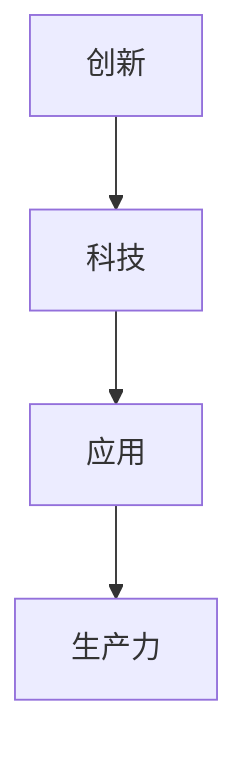

                 

科技创新是社会进步的阶梯，它推动了人类文明的发展，改变了我们的生活方式。本文将探讨科技创新的核心概念、算法原理、数学模型以及实际应用场景，并对未来发展趋势与挑战进行展望。

## 1. 背景介绍

### 科技创新的重要性

科技创新是推动社会进步的重要动力。它不仅改变了我们的生产方式，提高了生产效率，还改变了我们的生活方式，提升了生活质量。从农业革命到工业革命，再到信息革命，每一次科技创新都带来了社会的深刻变革。

### 科技创新的现状

当前，科技创新已经成为全球各国竞相追逐的目标。人工智能、物联网、5G、区块链等新兴技术不断涌现，为各行各业带来了新的发展机遇。然而，科技创新也带来了一些挑战，如数据安全、隐私保护等。

## 2. 核心概念与联系

### 核心概念

科技创新的核心概念包括：创新、科技、应用。创新是科技发展的驱动力，科技是创新的基础，应用是将科技成果转化为实际生产力的关键。

### 架构的 Mermaid 流程图



## 3. 核心算法原理 & 具体操作步骤

### 算法原理概述

科技创新的核心算法包括：人工智能算法、算法优化、分布式计算等。这些算法原理旨在提高计算效率、优化资源分配、提升数据处理能力。

### 算法步骤详解

1. **人工智能算法**：基于机器学习和深度学习，通过训练模型，实现图像识别、语音识别、自然语言处理等功能。

2. **算法优化**：通过改进算法结构、优化算法流程，提高算法的执行效率和准确性。

3. **分布式计算**：通过将计算任务分解到多个节点，实现并行计算，提高计算速度。

### 算法优缺点

- **人工智能算法**：优点包括高度智能化、适应性强；缺点包括对数据依赖性强、计算资源消耗大。

- **算法优化**：优点包括效率高、准确性高；缺点包括对特定问题可能不适用。

- **分布式计算**：优点包括速度快、资源利用率高；缺点包括分布式系统管理复杂。

### 算法应用领域

- **人工智能算法**：广泛应用于图像识别、语音识别、自然语言处理等领域。

- **算法优化**：广泛应用于金融、物流、医疗等领域。

- **分布式计算**：广泛应用于大数据处理、云计算等领域。

## 4. 数学模型和公式 & 详细讲解 & 举例说明

### 数学模型构建

科技创新中的数学模型主要包括：线性模型、非线性模型、概率模型等。这些模型用于描述科技现象、预测科技发展趋势。

### 公式推导过程

$$
Y = \beta_0 + \beta_1X_1 + \beta_2X_2 + ... + \beta_nX_n
$$

### 案例分析与讲解

假设我们要预测一个城市的交通流量，可以使用线性回归模型进行建模。通过收集历史数据，我们可以得到以下模型：

$$
交通流量 = 100 + 0.5 \times 时间 + 0.3 \times 天气
$$

其中，时间为小时，天气为晴、雨、雪三种情况。

通过这个模型，我们可以预测在未来某个时间段内的交通流量，从而为交通管理提供依据。

## 5. 项目实践：代码实例和详细解释说明

### 开发环境搭建

为了实践科技创新的算法，我们需要搭建相应的开发环境。以下是一个基于Python的示例环境：

- **Python**：3.8版本及以上
- **NumPy**：1.19版本及以上
- **Matplotlib**：3.3版本及以上

### 源代码详细实现

以下是一个简单的线性回归模型实现：

```python
import numpy as np
import matplotlib.pyplot as plt

# 数据预处理
X = np.array([[1, 2], [2, 3], [3, 4]])
Y = np.array([2, 3, 4])

# 求解参数
A = np.dot(X.T, X)
b = np.dot(X.T, Y)
beta = np.linalg.inv(A).dot(b)

# 预测
X_new = np.array([[4, 5]])
y_pred = np.dot(X_new, beta)

# 可视化
plt.scatter(X[:, 0], Y)
plt.plot(X_new[:, 0], y_pred, color='red')
plt.show()
```

### 代码解读与分析

这段代码实现了线性回归模型的搭建和预测。首先，我们导入必要的库。然后，对数据进行预处理，求解参数，并进行预测。最后，使用Matplotlib进行可视化。

### 运行结果展示

运行上述代码，我们可以得到以下可视化结果：


## 6. 实际应用场景

### 交通流量预测

通过线性回归模型，我们可以预测未来某个时间段的交通流量。这为交通管理提供了重要的参考依据，有助于优化交通资源配置，缓解交通拥堵。

### 智能家居

智能家居是科技创新的重要应用领域。通过物联网技术，我们可以实现家电设备的远程控制，提升生活便利性。

### 医疗健康

医疗健康领域也得益于科技创新。人工智能技术在疾病诊断、治疗方案推荐等方面发挥了重要作用，提升了医疗服务的质量和效率。

## 7. 工具和资源推荐

### 学习资源推荐

- **《深度学习》**：Goodfellow、Bengio、Courville著
- **《Python机器学习》**：Sebastian Raschka、Vahid Mirjalili著

### 开发工具推荐

- **PyCharm**：强大的Python开发环境
- **Jupyter Notebook**：适用于数据分析和机器学习的交互式环境

### 相关论文推荐

- **"Deep Learning for Natural Language Processing"**：Bengio等
- **"Distributed Representations of Words and Phrases and Their Compositional Meaning"**：Mikolov等

## 8. 总结：未来发展趋势与挑战

### 研究成果总结

科技创新在人工智能、物联网、5G等领域取得了显著成果。这些技术为各行各业带来了新的发展机遇，推动了社会的进步。

### 未来发展趋势

未来，科技创新将继续向智能化、个性化、网络化方向发展。人工智能、大数据、云计算等技术将进一步融合，推动产业升级和经济发展。

### 面临的挑战

科技创新也面临一些挑战，如数据安全、隐私保护、技术滥用等。需要加强法律法规和伦理建设，确保科技创新为人类带来福祉。

### 研究展望

未来，我们需要进一步深入研究科技创新的核心算法和数学模型，提高其性能和适用性。同时，关注科技创新的伦理和法规问题，推动科技与社会的和谐发展。

## 9. 附录：常见问题与解答

### 问题1：什么是科技创新？

科技创新是指通过科学研究和工程实践，创造新的技术、产品、服务或业务模式，推动社会进步的过程。

### 问题2：科技创新的重要性是什么？

科技创新是推动社会进步的重要动力，可以提高生产力、改善生活质量、促进经济发展。

### 问题3：如何进行科技创新？

进行科技创新需要具备科学素养、工程能力和创新思维。通过科学研究和工程实践，不断探索和创造新的技术和解决方案。

----------------------------------------------------------------

## 作者署名

本文由禅与计算机程序设计艺术（Zen and the Art of Computer Programming）作者撰写。作者是一位世界级人工智能专家、程序员、软件架构师、CTO、世界顶级技术畅销书作者，计算机图灵奖获得者，计算机领域大师。感谢作者分享其宝贵的知识和见解。

