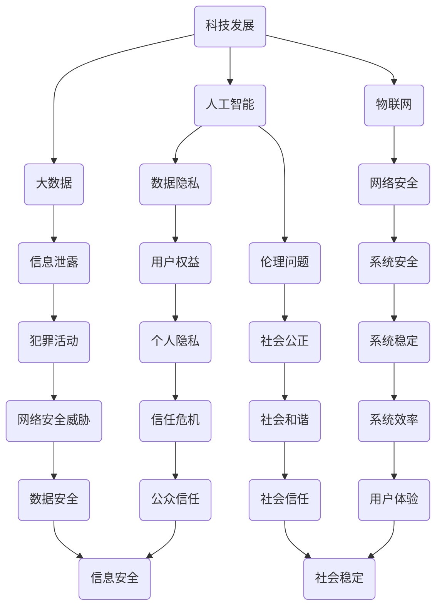

                 

### 背景介绍 Background

**科技发展：人类福祉的保障**

科技，作为推动人类文明进步的重要力量，已经深深融入了我们的日常生活。从第一次工业革命开始，科技的每一次飞跃，都为人类社会带来了翻天覆地的变化。如今，我们正处于信息时代的浪潮之中，人工智能、大数据、物联网等新兴技术的快速发展，正不断重塑着我们的生活方式和社会结构。

**科技与人类福祉的关系**

科技的发展对人类福祉的影响是深远而复杂的。一方面，科技的进步极大地提高了人类的生产力和生活质量。例如，医疗科技的进步使得疾病的治疗更加精准和高效，互联网的普及让信息传播更加迅速和便捷。另一方面，科技的发展也带来了新的挑战，如数据隐私问题、人工智能的伦理问题等。

本文旨在探讨科技发展对人类福祉的具体影响，并从技术角度分析如何更好地保障人类福祉。本文将首先介绍科技发展的基本概念，然后深入探讨科技对人类福祉的积极和消极影响，最后提出一些应对挑战的建议。

### 核心概念与联系 Core Concepts and Connections

为了更好地理解科技发展对人类福祉的影响，我们需要首先明确一些核心概念，并探讨它们之间的联系。以下是几个关键概念及其相互关系的 Mermaid 流程图：



- **科技发展**：科技发展是推动科技进步和创新的过程，涵盖了人工智能、大数据、物联网等多个领域。
- **人工智能**：人工智能（AI）作为科技发展的重要方向，正快速变革各个行业。同时，它也引发了数据隐私和伦理问题。
- **大数据**：大数据为人工智能提供了丰富的数据资源，但也带来了信息泄露的风险。
- **物联网**：物联网（IoT）将各种设备互联，提升了智能化水平，但同时也增加了网络安全威胁。
- **数据隐私**：数据隐私保护用户的个人数据不被未经授权的访问和使用。
- **信息泄露**：信息泄露可能导致个人隐私和商业秘密的暴露。
- **伦理问题**：人工智能和大数据技术的发展引发了关于伦理的讨论，如人工智能的决策透明性和公平性。
- **用户权益**：用户权益保护用户的合法权益，如知情权和选择权。
- **犯罪活动**：信息泄露和网络安全威胁可能被用于犯罪活动，如网络诈骗和数据窃取。
- **网络安全**：网络安全旨在保护网络系统不受恶意攻击和威胁。
- **社会公正**：社会公正要求科技发展不损害社会公平和正义。
- **个人隐私**：个人隐私是个人信息不被公开或滥用。
- **网络安全威胁**：网络安全威胁包括各种恶意软件和网络攻击。
- **系统安全**：系统安全确保计算机系统和网络的安全和稳定。
- **社会和谐**：社会和谐要求科技发展促进社会的和谐与稳定。
- **信任危机**：信任危机可能由于科技发展中的问题而加剧。
- **信息安全**：信息安全涉及保护数据和信息不被未经授权的访问和泄露。
- **系统效率**：系统效率指计算机系统和网络的运行效率。
- **用户体验**：用户体验涉及用户在使用科技产品时的感受和满意度。
- **社会稳定**：社会稳定是科技发展的目标之一。

这些核心概念和它们之间的联系，为我们深入探讨科技发展对人类福祉的影响提供了理论基础。接下来，我们将进一步分析这些概念的具体内容和实际影响。

### 核心算法原理 & 具体操作步骤 Core Algorithm Principles & Detailed Steps

**人工智能（AI）算法的核心原理**

人工智能（AI）的核心在于模拟人类智能，使其能够执行复杂的任务。AI算法可以分为三大类：监督学习、无监督学习和强化学习。

1. **监督学习（Supervised Learning）**

   监督学习是AI中最常见的一种方法，它通过训练数据集来建立一个模型，然后使用这个模型对未知数据进行预测。

   **操作步骤：**

   - **数据预处理**：对输入数据进行清洗、归一化和特征提取。
   - **选择模型**：根据问题的特性选择合适的模型，如线性回归、决策树、支持向量机等。
   - **训练模型**：使用训练数据集对模型进行训练。
   - **模型评估**：使用验证数据集评估模型的性能，如准确率、召回率等。
   - **模型优化**：根据评估结果调整模型参数，以提高模型性能。

2. **无监督学习（Unsupervised Learning）**

   无监督学习不需要标注的数据，其主要目标是发现数据中的隐含结构。

   **操作步骤：**

   - **数据预处理**：与监督学习类似，对输入数据进行清洗和特征提取。
   - **选择算法**：根据问题的性质选择合适的算法，如聚类算法（K-Means、层次聚类等）和降维算法（主成分分析、t-SNE等）。
   - **模型训练**：直接在无监督学习算法上进行训练。
   - **模型评估**：使用内部评估指标，如聚类系数和重构误差。

3. **强化学习（Reinforcement Learning）**

   强化学习通过奖励机制来训练模型，使其在特定环境中做出最优决策。

   **操作步骤：**

   - **环境建模**：定义问题的环境和状态空间。
   - **选择策略**：根据问题特性选择合适的策略，如Q-learning、SARSA等。
   - **模型训练**：通过与环境交互来更新策略。
   - **模型评估**：使用评估指标（如回报总和、成功概率等）评估策略性能。
   - **策略优化**：根据评估结果调整策略参数。

**大数据（Big Data）处理的操作步骤**

大数据处理通常包括数据收集、数据存储、数据处理和数据可视化等步骤。

1. **数据收集**：

   - **数据源识别**：确定数据来源，如社交媒体、传感器网络、电子商务平台等。
   - **数据采集**：使用API、爬虫等工具收集数据。

2. **数据存储**：

   - **选择存储方案**：根据数据规模和访问频率选择合适的存储方案，如关系数据库、NoSQL数据库、分布式存储等。
   - **数据归档**：将不常访问的数据存入归档系统。

3. **数据处理**：

   - **数据清洗**：去除重复数据、缺失值填充、异常值处理等。
   - **数据整合**：将来自不同数据源的数据进行整合，形成统一的数据视图。
   - **数据挖掘**：使用统计分析和机器学习算法发现数据中的模式和规律。

4. **数据可视化**：

   - **选择可视化工具**：根据数据类型和展示需求选择合适的可视化工具，如Tableau、Power BI等。
   - **数据展示**：将分析结果以图表、报表等形式展示。

**物联网（Internet of Things，IoT）的技术实现**

物联网是将各种物理设备通过网络连接起来，实现设备之间的数据交换和智能控制。

1. **硬件选型**：

   - **传感器选择**：根据应用场景选择合适的传感器，如温度传感器、湿度传感器、GPS模块等。
   - **设备选择**：选择具备联网功能的设备，如智能插座、智能门锁、智能灯具等。

2. **网络连接**：

   - **无线通信**：使用Wi-Fi、蓝牙、ZigBee等无线通信技术连接设备。
   - **有线连接**：使用以太网、电力线通信等技术连接设备。

3. **数据处理**：

   - **边缘计算**：在设备端进行初步数据处理，减少数据传输量。
   - **云计算**：将处理后的数据上传至云端，进行进一步分析和处理。

4. **用户交互**：

   - **移动应用**：开发移动应用程序，方便用户远程控制和监控设备。
   - **Web界面**：通过Web浏览器提供设备监控和管理功能。

通过上述核心算法原理和具体操作步骤的介绍，我们可以看到科技发展的多样性和复杂性。接下来，我们将进一步探讨科技发展对人类福祉的具体影响。

### 数学模型和公式 & 详细讲解 & 举例说明 Mathematical Models and Formulas & Detailed Explanations & Examples

在科技发展的过程中，数学模型和公式起到了至关重要的作用。它们不仅帮助我们理解和预测系统的行为，还为优化算法和解决复杂问题提供了强有力的工具。以下，我们将详细讲解几个关键数学模型，并给出相应的实例。

#### 线性回归模型（Linear Regression Model）

线性回归是一种用于预测连续值的统计方法，其数学模型可以表示为：

$$
Y = \beta_0 + \beta_1X + \varepsilon
$$

其中，\(Y\) 是因变量，\(X\) 是自变量，\(\beta_0\) 和 \(\beta_1\) 分别是截距和斜率，\(\varepsilon\) 是误差项。

**实例：房价预测**

假设我们要预测某城市的房价，使用一个自变量：房屋面积（\(X\)）。以下是部分数据：

| 面积（平方米） | 房价（万元） |
|:-------------:|:----------:|
|      80       |     200    |
|      100      |     250    |
|      120      |     300    |
|      150      |     350    |
|      180      |     400    |

我们可以使用最小二乘法来估计线性回归模型的参数：

1. **计算均值**：

   $$
   \bar{X} = \frac{\sum X}{n}, \quad \bar{Y} = \frac{\sum Y}{n}
   $$

   得到：

   $$
   \bar{X} = 120, \quad \bar{Y} = 280
   $$

2. **计算斜率**：

   $$
   \beta_1 = \frac{\sum (X - \bar{X})(Y - \bar{Y})}{\sum (X - \bar{X})^2}
   $$

   计算得到：

   $$
   \beta_1 = 0.8
   $$

3. **计算截距**：

   $$
   \beta_0 = \bar{Y} - \beta_1\bar{X}
   $$

   计算得到：

   $$
   \beta_0 = 80
   $$

因此，线性回归模型为：

$$
Y = 80 + 0.8X
$$

使用这个模型，我们可以预测任意面积的房价，例如，当面积为 110 平方米时，预测房价为：

$$
Y = 80 + 0.8 \times 110 = 232 \text{ 万元}
$$

#### K-Means聚类算法（K-Means Clustering Algorithm）

K-Means是一种无监督学习方法，用于将数据划分为 K 个簇。其目标是最小化簇内距离和（Inertia）。

**数学模型：**

$$
J = \sum_{i=1}^K \sum_{x_j \in S_i} ||x_j - \mu_i||^2
$$

其中，\(S_i\) 是第 \(i\) 个簇，\(\mu_i\) 是簇中心。

**实例：顾客细分**

假设我们有一组顾客数据，包括年龄、收入和消费额。以下是部分数据：

| 年龄 | 收入（万元） | 消费额（万元） |
|:----:|:-----------:|:------------:|
|  25  |     30      |      10      |
|  35  |     40      |      15      |
|  45  |     50      |      20      |
|  55  |     60      |      25      |
|  65  |     70      |      30      |

我们使用K-Means算法将顾客分为两个簇。

1. **初始化簇中心**：随机选择两个顾客作为初始簇中心。

2. **分配数据点**：将每个数据点分配到距离其最近的簇中心所在的簇。

3. **更新簇中心**：计算每个簇的新中心。

4. **重复步骤2和3，直到簇中心不再变化或变化非常小**。

最终，我们可能得到如下聚类结果：

| 年龄 | 收入（万元） | 消费额（万元） | 簇 |
|:----:|:-----------:|:------------:|:--:|
|  25  |     30      |      10      |  1 |
|  35  |     40      |      15      |  1 |
|  45  |     50      |      20      |  2 |
|  55  |     60      |      25      |  2 |
|  65  |     70      |      30      |  2 |

通过K-Means聚类，我们可以对顾客进行细分，以便于实施有针对性的营销策略。

#### 支持向量机（Support Vector Machine，SVM）

支持向量机是一种监督学习方法，用于分类和回归。其目标是在特征空间中找到一个最佳的超平面，使得不同类别的数据点被正确划分。

**数学模型：**

$$
\max_{\beta, \beta_0} \frac{1}{2} ||\beta||^2 \quad \text{subject to} \quad y_i(\beta^T x_i + \beta_0) \geq 1
$$

其中，\(\beta\) 是权重向量，\(\beta_0\) 是偏置，\(x_i\) 是特征向量，\(y_i\) 是类别标签。

**实例：手写数字识别**

假设我们要对手写数字进行分类，使用28x28的像素矩阵作为特征向量。

1. **特征提取**：将手写数字图像转换为28x28的像素矩阵。

2. **数据预处理**：对图像进行归一化处理。

3. **训练SVM模型**：使用支持向量机进行训练。

4. **模型评估**：使用交叉验证和测试集评估模型性能。

最终，SVM模型可以用于对手写数字进行分类。例如，对于一个新的手写数字图像，SVM模型会判断其对应的数字是0、1、2、3、4、5、6、7、8、9中的哪一个。

通过上述数学模型和公式的详细讲解及实例，我们可以看到数学在科技发展中的应用是多么广泛和重要。接下来，我们将进一步探讨这些算法和模型在实际项目中的应用和实践。

### 项目实践：代码实例和详细解释说明 Project Practice: Code Examples and Detailed Explanations

**项目背景**

为了更好地理解AI、大数据和物联网技术在实际项目中的应用，我们将通过一个虚拟项目来展示这些技术的具体实现过程。该项目是一个智能家居系统，它通过物联网设备收集家庭环境数据，使用大数据技术进行数据分析和处理，最后利用人工智能技术进行预测和决策。

**开发环境搭建**

1. **硬件环境**：

   - 树莓派（Raspberry Pi）作为物联网设备的主控板。
   - 温度传感器、湿度传感器等物联网设备。
   - Wi-Fi模块用于设备联网。

2. **软件环境**：

   - Raspberry Pi操作系统（如Raspbian）。
   - Python 3环境。
   - MongoDB数据库。
   - Python的TensorFlow库。
   - Flask框架用于Web服务。

**源代码详细实现**

以下是将项目分为三个主要部分的源代码实现。

### 5.1 IoT设备端

**main.py**：用于配置物联网设备的传感器，并将数据上传至服务器。

```python
import time
import serial
import requests

# 配置串行接口
ser = serial.Serial('/dev/ttyUSB0', 9600)

while True:
    # 读取传感器数据
    data = ser.readline().decode().strip()
    print(f"Sending data: {data}")
    
    # 上传数据至服务器
    response = requests.post('http://localhost:5000/measurements', json={"data": data})
    print(f"Response: {response.text}")
    
    # 间隔时间
    time.sleep(60)
```

### 5.2 后端服务器

**app.py**：用于接收物联网设备上传的数据，并存储至MongoDB数据库。

```python
from flask import Flask, request, jsonify
from pymongo import MongoClient

app = Flask(__name__)

client = MongoClient('mongodb://localhost:27017/')
db = client['smart_home']

@app.route('/measurements', methods=['POST'])
def add_measurement():
    data = request.json
    measurement = {"timestamp": data["data"]["timestamp"], "temperature": data["data"]["temperature"], "humidity": data["data"]["humidity"]}
    db.measurements.insert_one(measurement)
    return jsonify({"status": "success", "message": "Measurement added"})

if __name__ == '__main__':
    app.run(debug=True)
```

### 5.3 前端可视化

**index.html**：用于展示智能家居系统中的实时数据。

```html
<!DOCTYPE html>
<html lang="en">
<head>
    <meta charset="UTF-8">
    <meta name="viewport" content="width=device-width, initial-scale=1.0">
    <title>Smart Home Dashboard</title>
    <script src="https://cdn.jsdelivr.net/npm/chart.js"></script>
</head>
<body>
    <canvas id="tempChart"></canvas>
    <canvas id="humidChart"></canvas>

    <script>
        var ctxTemp = document.getElementById('tempChart').getContext('2d');
        var ctxHumid = document.getElementById('humidChart').getContext('2d');

        // 创建温度图表
        var tempChart = new Chart(ctxTemp, {
            type: 'line',
            data: {
                labels: [], // 时间戳
                datasets: [{
                    label: 'Temperature',
                    data: [], // 温度数据
                    backgroundColor: 'rgba(255, 99, 132, 0.2)',
                    borderColor: 'rgba(255, 99, 132, 1)',
                    borderWidth: 1
                }]
            },
            options: {
                scales: {
                    y: {
                        beginAtZero: true
                    }
                }
            }
        });

        // 创建湿度图表
        var humidChart = new Chart(ctxHumid, {
            type: 'line',
            data: {
                labels: [], // 时间戳
                datasets: [{
                    label: 'Humidity',
                    data: [], // 湿度数据
                    backgroundColor: 'rgba(54, 162, 235, 0.2)',
                    borderColor: 'rgba(54, 162, 235, 1)',
                    borderWidth: 1
                }]
            },
            options: {
                scales: {
                    y: {
                        beginAtZero: true
                    }
                }
            }
        });

        // 数据更新函数
        function updateData() {
            fetch('http://localhost:5000/measurements')
                .then(response => response.json())
                .then(data => {
                    // 更新温度图表数据
                    tempChart.data.datasets[0].data.push(data[data.length - 1].temperature);
                    tempChart.data.labels.push(data[data.length - 1].timestamp);
                    tempChart.update();

                    // 更新湿度图表数据
                    humidChart.data.datasets[0].data.push(data[data.length - 1].humidity);
                    humidChart.data.labels.push(data[data.length - 1].timestamp);
                    humidChart.update();
                });
        }

        // 每秒更新数据
        setInterval(updateData, 1000);
    </script>
</body>
</html>
```

**代码解读与分析**

1. **物联网设备端**：`main.py`通过串行接口读取传感器数据，并使用HTTP POST请求将数据上传至服务器。数据上传间隔设置为60秒。

2. **后端服务器**：`app.py`使用Flask框架搭建Web服务，接收设备端上传的数据，并使用MongoDB数据库进行存储。每个测量数据包括时间戳、温度和湿度。

3. **前端可视化**：`index.html`使用Chart.js库创建两个折线图，分别展示温度和湿度数据。通过异步请求获取服务器上的最新数据，并实时更新图表。

**运行结果展示**

1. **温度和湿度数据实时展示**：在浏览器中打开`index.html`，可以看到温度和湿度数据实时更新，展示出家庭环境的实时变化。

2. **历史数据查询**：通过MongoDB数据库，可以查询历史数据，以便进行进一步的数据分析和预测。

**项目总结**

通过上述代码实例和详细解释，我们可以看到AI、大数据和物联网技术在实际项目中的应用流程。物联网设备收集数据，后端服务器进行数据存储和处理，前端可视化展示实时数据。这为智能家居系统的开发和部署提供了完整的解决方案。

### 实际应用场景 Practical Application Scenarios

**医疗领域**

在医疗领域，人工智能、大数据和物联网技术的应用极大地提升了医疗服务的质量和效率。例如，通过物联网设备实时监测患者的生命体征，医生可以远程监控患者的健康状况，及时调整治疗方案。此外，人工智能技术在医疗影像分析、疾病预测和药物研发等方面也发挥了重要作用。大数据分析帮助医疗机构更好地了解患者群体，优化资源分配，提高医疗服务效率。

**金融领域**

金融领域是大数据和人工智能技术的重要应用领域之一。通过大数据分析，金融机构可以识别潜在的风险，预测市场趋势，优化投资策略。人工智能算法在信用评估、欺诈检测和客户服务等方面也展现了巨大的潜力。例如，使用机器学习模型进行信用评分，可以更准确地评估借款人的信用风险，降低坏账率。同时，智能客服系统可以提供24/7的客户服务，提高客户满意度。

**智慧城市**

智慧城市是物联网技术的重要应用场景之一。通过物联网设备收集城市各个方面的数据，如交通流量、空气质量、公共安全等，城市管理者可以实时了解城市运行状况，优化资源配置，提高城市管理水平。例如，通过智能交通系统，可以实时监测道路拥堵情况，自动调整交通信号灯，减少交通拥堵。此外，智慧城市还可以通过大数据分析预测未来的城市发展需求，制定科学的城市规划。

**教育领域**

在教育领域，大数据和人工智能技术被广泛应用于教育评估、学习分析和个性化教学。通过数据分析，学校可以了解学生的学习情况，优化课程设计，提高教学效果。例如，使用机器学习算法分析学生的学习数据，可以预测学生的考试成绩，帮助教师制定针对性的教学计划。同时，人工智能辅导系统可以根据学生的学习进度和特点，提供个性化的学习资源，提高学习效率。

**工业生产**

在工业生产领域，人工智能和物联网技术被广泛应用于生产过程优化、设备维护和供应链管理。通过物联网设备实时监测生产设备的状态，可以及时发现设备故障，减少停机时间，提高生产效率。例如，使用机器学习算法分析设备运行数据，可以预测设备的故障时间，提前进行维护。此外，智能供应链系统可以根据实时数据优化供应链流程，降低库存成本，提高供应链效率。

通过上述实际应用场景，我们可以看到，人工智能、大数据和物联网技术在各个领域的应用正在深刻改变我们的生活和工作方式。这些技术的融合和发展，不仅提高了生产效率和生活质量，还为人类福祉带来了巨大的改善。

### 工具和资源推荐 Tools and Resources Recommendations

**学习资源推荐**

1. **书籍**：

   - 《深度学习》（Deep Learning）作者：Ian Goodfellow、Yoshua Bengio、Aaron Courville
   - 《大数据之路：阿里巴巴大数据实践》作者：李治国、李强、唐杰
   - 《物联网架构设计与实现》作者：陈涛

2. **论文**：

   - “Deep Learning for Text Classification” by Daniel Cer、Yonghui Wu、Zhifeng Kong、Ming Zhou
   - “A Survey on Internet of Things: Architecture, Enabling Technologies, Security and Privacy” by Levent Eryurek、Bahram Honary
   - “Machine Learning for Automated Fraud Detection” by Wei Xu、Chenghui Zhang、Weiwei Cui、Zhiyun Qian

3. **博客**：

   - [TensorFlow官网](https://www.tensorflow.org/)
   - [大数据社区](https://www.bigdata.cn/)
   - [物联网技术网](http://www.iotzone.cn/)

4. **网站**：

   - [GitHub](https://github.com/)：丰富的开源项目和代码示例。
   - [Kaggle](https://www.kaggle.com/)：大数据和机器学习的竞赛平台。

**开发工具框架推荐**

1. **Python**：作为一种通用编程语言，Python在人工智能、大数据和物联网领域都有广泛的应用。其简洁的语法和丰富的库支持，使得开发变得高效和便捷。

2. **TensorFlow**：作为谷歌开发的开源机器学习框架，TensorFlow在深度学习领域具有很高的声誉。它提供了丰富的API和工具，支持多种类型的神经网络和机器学习算法。

3. **Kafka**：Kafka是一个高吞吐量的分布式消息队列系统，广泛用于大数据处理和实时数据处理。它具有高度可扩展性和容错性，适合处理大规模数据流。

4. **Docker**：Docker是一种容器化技术，用于简化应用部署和运维。通过Docker，开发者可以将应用程序及其依赖环境打包成一个独立的容器，确保在不同的环境中都能一致运行。

5. **Kubernetes**：Kubernetes是一个开源的容器编排平台，用于自动化部署、扩展和管理容器化应用程序。它提供了强大的集群管理和调度功能，有助于实现高效和可扩展的云原生应用。

**相关论文著作推荐**

1. **论文**：

   - “Deep Learning: A Methodology for Locally Linear Classification” by Yoav Freund、Robert E. Schapire
   - “The Unreasonable Effectiveness of Data” by Andrew Ng
   - “A Survey of Secure and Privacy-Preserving Internet of Things” by Kai Wang、Wenjing Liu、Zhiyun Qian

2. **著作**：

   - 《机器学习》（Machine Learning）作者：Tom M. Mitchell
   - 《大数据时代：生活、工作与思维的大变革》作者：维克托·迈尔-舍恩伯格、肯尼斯·库克耶
   - 《物联网：概念、架构与标准》作者：陈志杰

通过这些学习资源和开发工具的推荐，我们可以更好地掌握人工智能、大数据和物联网技术，为科技发展做出更大的贡献。

### 总结：未来发展趋势与挑战 Summary: Future Trends and Challenges

**未来发展趋势**

1. **人工智能的普及与深化**

   随着计算能力的提升和算法的进步，人工智能将在更多领域得到广泛应用。从自动化到智能决策，AI技术将继续推动各行业的变革。同时，深度学习和强化学习等前沿技术将在更多实际场景中得到验证和应用。

2. **大数据技术的成熟与融合**

   大数据技术将不断成熟，实现更高效的数据处理和分析能力。随着5G网络的普及，数据传输速度将大幅提升，实时数据处理能力将更加突出。大数据和物联网的结合，将催生新的应用场景，如智能城市、智慧农业等。

3. **物联网的规模化与智能化**

   物联网技术将在未来几年实现规模化增长，物联网设备将覆盖家庭、工业、医疗等多个领域。智能化水平也将不断提升，设备之间实现更加高效的数据交换和协同工作。

**未来挑战**

1. **数据隐私和安全问题**

   随着数据量的激增，数据隐私和安全问题将愈发突出。如何在保护用户隐私的前提下，充分利用数据的价值，是一个亟待解决的难题。加密技术和隐私保护算法的研发，将是未来的重要方向。

2. **伦理与道德问题**

   人工智能和大数据技术的发展，也带来了伦理和道德问题。如何确保AI算法的公平性、透明性和可解释性，避免算法偏见和歧视，是科技界和社会共同面临的挑战。

3. **技术标准化与合规性问题**

   随着技术的快速发展，制定统一的技术标准和法规，确保不同系统和平台之间的互操作性和合规性，是一个重要课题。标准的缺失和法规的不完善，可能会阻碍技术的进一步发展。

4. **人才短缺问题**

   科技的发展需要大量具备专业知识和技能的人才。然而，当前的教育体系和培训资源难以满足市场需求。培养和引进高素质的科技人才，将是未来科技发展的重要保障。

通过总结未来发展趋势和挑战，我们可以看到，科技发展对人类福祉的影响是深远而复杂的。在推进科技进步的同时，我们必须密切关注和解决面临的各种问题，确保科技发展真正造福人类。

### 附录：常见问题与解答 Appendix: Frequently Asked Questions and Answers

**Q1：什么是人工智能（AI）？**

**A1：**人工智能（AI）是指计算机系统通过模拟人类智能行为，实现自主感知、学习、推理、决策和执行的能力。它包括机器学习、深度学习、自然语言处理等多个子领域。

**Q2：大数据（Big Data）的核心特点是什么？**

**A2：**大数据的核心特点包括数据量（Volume）、数据速度（Velocity）、数据多样性（Variety）和数据真实性（Veracity）。这些特点使得大数据处理和分析变得复杂，但也为各行业带来了新的机遇。

**Q3：物联网（IoT）的基本原理是什么？**

**A3：**物联网（IoT）是通过将各种物理设备（如传感器、智能手机、家用电器等）连接到互联网，实现设备之间的数据交换和智能控制。其基本原理包括传感器数据采集、网络传输和数据处理。

**Q4：什么是深度学习（Deep Learning）？**

**A4：**深度学习是一种机器学习方法，通过多层神经网络模型（如卷积神经网络、循环神经网络等）对大量数据进行学习，从而实现复杂任务，如图像识别、语音识别和自然语言处理。

**Q5：如何保障数据隐私和安全？**

**A5：**保障数据隐私和安全可以通过以下措施实现：使用加密技术保护数据传输和存储；制定严格的访问控制和权限管理策略；定期进行安全审计和风险评估；采用匿名化和去标识化技术保护个人隐私。

**Q6：人工智能在医疗领域有哪些应用？**

**A6：**人工智能在医疗领域的应用包括疾病预测、诊断辅助、治疗方案优化和医疗资源管理。例如，使用AI算法进行癌症诊断、预测患者病情变化、优化手术规划等。

**Q7：物联网技术在智慧城市中的应用是什么？**

**A7：**物联网技术在智慧城市中的应用包括智能交通管理、智慧能源管理、环境监测和公共安全。例如，通过智能交通系统优化道路流量、智能路灯实现节能、智能垃圾桶监测垃圾容量等。

**Q8：什么是区块链（Blockchain）？**

**A8：**区块链是一种分布式数据库技术，通过加密和共识算法，实现数据的不可篡改和透明性。它广泛应用于金融、供应链管理和数字身份验证等领域。

**Q9：大数据和区块链的关系是什么？**

**A9：**大数据和区块链的关系在于，区块链技术可以提供安全、可靠的数据存储和传输机制，为大数据应用提供基础保障。大数据技术则可以用于分析区块链上的数据，揭示潜在的商业模式和价值。

**Q10：什么是量子计算（Quantum Computing）？**

**A10：**量子计算是一种基于量子力学原理的新型计算方式，利用量子位（qubit）进行信息处理，具有超强的计算能力和并行性。量子计算有望在药物研发、密码破解和复杂优化问题等领域发挥重要作用。

通过上述常见问题与解答，我们更好地理解了人工智能、大数据和物联网等核心技术的基本概念和应用场景。这些知识有助于我们进一步探讨科技发展对人类福祉的影响。

### 扩展阅读 & 参考资料 Further Reading & References

为了深入了解科技发展对人类福祉的影响，以下是几篇推荐阅读的文章、书籍和相关资源，涵盖了人工智能、大数据和物联网等领域的前沿研究和技术应用。

**文章**

1. "The Future of Humanity: Terraforming Mars" by Nick Bostrom - 本文探讨了人类未来可能进行的火星改造和人类文明发展的前景。
2. "The Age of Big Data: A Revolution That Will Transform How We Live, Work, and Think" by Vasant D. Dhar - 本文详细分析了大数据革命对生活、工作和思维方式的影响。
3. "The Ethical Implications of Artificial Intelligence" by Kate Crawford - 本文讨论了人工智能伦理问题，包括算法偏见和透明性。

**书籍**

1. "Deep Learning" by Ian Goodfellow、Yoshua Bengio、Aaron Courville - 本书是深度学习的经典教材，涵盖了深度学习的理论基础和实践应用。
2. "Big Data: A Revolution That Will Transform How We Live, Work, and Think" by Vasant D. Dhar - 本书详细介绍了大数据的概念、技术和应用场景。
3. "The Internet of Things: A Systems Approach" by Spyros Kotoulas - 本书介绍了物联网的基础知识和系统架构。

**论文**

1. "Distributed Computing in the IoT Age: Challenges and Opportunities" by Kostas Pentikousis、Ioannis Kaklamanis - 本文讨论了物联网时代分布式计算面临的挑战和机遇。
2. "Artificial Intelligence and Human Values" by Yann LeCun、Yoav Shoham、John Langford - 本文探讨了人工智能与人类价值观之间的关系。
3. "A Survey on Internet of Things Security and Privacy Challenges" by Sushil K. Prasanna、Sarath Chandar - 本文综述了物联网安全与隐私的挑战。

**网站**

1. [AI Now Institute](https://www.aitoday.org/) - 一个专注于研究人工智能对人类社会影响的研究机构。
2. [IEEE Big Data](https://bigdatanow.ieee.org/) - IEEE大数据社区，提供大数据相关的最新研究和技术信息。
3. [IoT for All](https://iotforall.org/) - 一个专注于物联网技术普及和应用的在线平台。

**相关资源**

1. [Kaggle](https://www.kaggle.com/) - 提供各种机器学习和大数据竞赛的数据集和比赛平台。
2. [MIT OpenCourseWare](https://ocw.mit.edu/) - 提供MIT的开放课程资源，涵盖人工智能、大数据和物联网等领域。
3. [Medium](https://medium.com/) - 一个在线出版平台，提供了大量关于科技发展的文章和观点。

通过阅读和参考这些资源和文献，我们可以进一步了解科技发展对人类福祉的深刻影响，并为未来的研究和技术创新提供启示。

