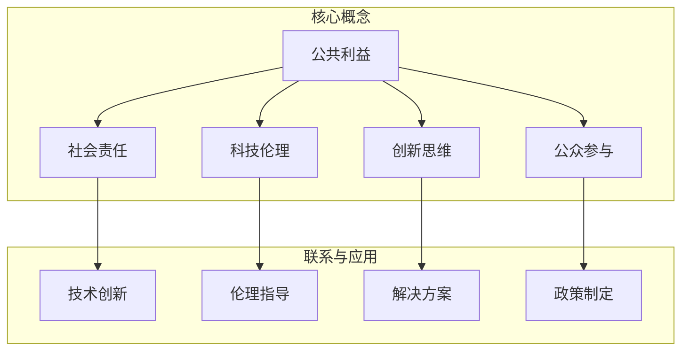

                 

### 1. 背景介绍

在当今信息化时代，科技已经深刻地改变了我们的生活方式，几乎渗透到了社会的每一个角落。然而，随着科技的发展，我们也面临着诸多社会问题，如环境污染、资源浪费、社会不公、医疗资源短缺等。如何利用科技的力量来解决这些问题，实现科技向善，成为了一个亟待探讨的重要课题。

科技向善，简单来说，就是通过科技的应用和开发，来促进社会的整体福祉，解决社会问题，提升人们的生活质量。这不仅仅是一个理论上的概念，更是一种实践，一种行动。科技向善不仅需要技术创新，更需要社会责任和人文关怀。

科技向善的意义不仅体现在解决当前的社会问题上，更在于其对未来的长远影响。通过科技向善，我们可以促进社会公平，实现资源的合理分配，推动社会进步。同时，科技向善也能够激发更多的创新思维，促进科技与人文的深度融合，为未来的社会发展提供源源不断的动力。

然而，科技向善的道路并非一帆风顺。在追求科技进步的同时，我们也需要关注科技带来的负面影响，如隐私泄露、数据滥用等。因此，科技向善需要在技术创新和社会责任之间找到一个平衡点，确保科技的发展能够真正造福人类，而不是成为新的问题制造者。

总之，科技向善是一个复杂而重要的议题，它既需要科技人员的专业能力，也需要全社会的共同努力。通过本文，我们将深入探讨科技向善的内涵、意义、实践路径以及未来挑战，希望能够为这一领域的发展提供一些有价值的思考和参考。

### 2. 核心概念与联系

要深入理解科技向善的概念，首先需要明确几个核心概念，并探讨它们之间的联系。以下是几个关键概念及其在科技向善中的应用：

#### 2.1. 公共利益

公共利益是指能够惠及整个社会的福利和利益，包括环境保护、资源管理、公共医疗、教育公平等。在科技向善的背景下，公共利益是衡量科技应用效果的重要标准。例如，清洁能源技术的发展有助于减少环境污染，实现能源的可持续发展；智能医疗系统的应用可以提高医疗资源的分配效率，使更多的人享受到优质的医疗服务。

#### 2.2. 社会责任

社会责任是指企业、组织或个人在社会活动中应承担的义务和责任。科技企业作为科技创新的主要力量，其社会责任尤为重要。例如，在数据隐私和安全方面，企业需要确保用户的个人信息不被滥用；在环境保护方面，企业应采取节能减排措施，减少对环境的负面影响。

#### 2.3. 科技伦理

科技伦理是关于科技应用中的道德和伦理问题的研究，它涉及到科技发展对社会、环境和个人可能产生的影响。科技伦理的核心在于确保科技的应用不违背基本的道德原则，如尊重个人隐私、公平公正、避免伤害等。在科技向善的实践中，科技伦理是指导科技研发和应用的重要原则，能够帮助避免科技带来的潜在风险。

#### 2.4. 创新思维

创新思维是指通过创造性的方法和思路来解决问题的能力。在科技向善的背景下，创新思维是推动科技解决社会问题的关键。通过创新，我们可以开发出更加高效、环保、安全的技术，从而更好地满足社会的需求。例如，在应对气候变化方面，创新思维可以推动新能源技术的研发和应用，实现绿色能源的替代。

#### 2.5. 公众参与

公众参与是指在社会决策过程中，公众能够积极参与并表达自己的意见和需求。科技向善需要公众的广泛参与，因为只有了解和满足公众的需求，科技应用才能真正造福社会。例如，在智能城市的建设过程中，公众的意见和建议对于制定有效的政策和规划至关重要。

#### 联系

这些核心概念之间存在着紧密的联系。公共利益是社会发展的目标，而社会责任和科技伦理则是实现这一目标的重要手段。创新思维为解决社会问题提供了新的思路和工具，而公众参与则确保了科技应用的公平性和有效性。这些概念共同构成了科技向善的理论基础，指导着科技在社会中的合理应用。

下面，我们将使用 Mermaid 流程图来进一步展示这些核心概念及其在科技向善中的联系。



通过这张流程图，我们可以清晰地看到公共利益作为核心目标，通过社会责任、科技伦理、创新思维和公众参与四个方面来实现，并最终推动技术创新和政策制定，实现科技向善的目标。

### 3. 核心算法原理 & 具体操作步骤

在科技向善的实践中，核心算法原理起到了至关重要的作用。这些算法不仅能够帮助解决复杂的社会问题，还可以通过具体的操作步骤实现实际应用。以下将介绍一种典型的核心算法原理，并详细阐述其具体操作步骤。

#### 3.1. 社会网络分析算法

社会网络分析（Social Network Analysis，SNA）是一种用于研究社会结构、网络关系及其动态变化的算法。它通过分析个体之间的互动和联系，揭示社会网络中的关键节点、群体结构以及传播路径，从而为解决社会问题提供科学依据。

#### 3.2. 算法原理

社会网络分析算法主要基于图论理论，其核心概念包括节点（Node）、边（Edge）和路径（Path）。在SNA中，每个个体可以视为一个节点，个体之间的互动和联系则通过边来表示。通过对这些节点和边的关系进行分析，可以识别出网络中的关键个体、重要连接和群体结构。

社会网络分析的主要算法包括：

1. **中心性度量**：评估节点在社交网络中的重要程度。常用的中心性度量方法有度数中心性、中间中心性和接近中心性。
2. **群体结构分析**：通过聚类算法分析网络中的群体结构，识别出紧密相连的群体及其内部关系。
3. **传播模型**：模拟信息或疾病在社交网络中的传播过程，预测传播的路径和影响范围。

#### 3.3. 操作步骤

以下是一个基于社会网络分析算法的具体操作步骤，用于解决社会问题中的信息传播问题。

##### 3.3.1. 数据收集

首先，收集社交网络的数据，包括个体之间的互动关系。这些数据可以通过问卷调查、社交媒体数据挖掘等方式获取。

##### 3.3.2. 数据预处理

对收集到的数据进行清洗和处理，去除重复和无意义的数据，确保数据的质量和完整性。

##### 3.3.3. 构建社交网络图

利用图论算法将个体和互动关系构建成一个图模型。节点表示个体，边表示个体之间的互动。可以使用Gephi、NetworkX等工具进行图的构建和可视化。

##### 3.3.4. 中心性分析

通过计算中心性度量，识别出网络中的关键节点。这些关键节点通常是信息传播的重要渠道，可以用于制定信息传播策略。

##### 3.3.5. 群体结构分析

利用聚类算法分析网络中的群体结构，识别出紧密相连的群体。这些群体可能是特定社会问题的潜在受众，可以针对性地开展宣传和干预工作。

##### 3.3.6. 传播模型模拟

构建传播模型，模拟信息在社交网络中的传播过程。通过调整模型参数，预测信息传播的路径和影响范围，为制定有效的传播策略提供依据。

##### 3.3.7. 策略制定与实施

根据分析结果制定信息传播策略，如针对关键节点进行重点宣传，针对特定群体进行精准推送等。通过实施策略，促进信息的有效传播，解决社会问题。

通过以上操作步骤，我们可以利用社会网络分析算法解决社会问题中的信息传播问题，实现科技向善的目标。

### 4. 数学模型和公式 & 详细讲解 & 举例说明

在科技向善的实践中，数学模型和公式起到了关键作用，它们能够帮助我们更准确地量化社会问题，从而制定出更加科学有效的解决方案。以下我们将介绍一个用于社会网络分析的数学模型，并详细讲解其公式和实际应用。

#### 4.1. 社会网络分析中的数学模型

社会网络分析中的数学模型主要涉及以下几个方面：

1. **中心性度量模型**：用于评估节点在社交网络中的重要程度。
2. **聚类模型**：用于分析网络中的群体结构。
3. **传播模型**：用于模拟信息或疾病在社交网络中的传播过程。

在本节中，我们将重点介绍中心性度量模型。

#### 4.2. 中心性度量模型

中心性度量模型用于评估节点在社交网络中的重要程度，常用的中心性度量方法有度数中心性（Degree Centrality）、中间中心性（Closeness Centrality）和接近中心性（Betweenness Centrality）。

##### 4.2.1. 度数中心性

度数中心性是最基本的中心性度量方法，它通过计算一个节点的度数（即与该节点相连的边的数量）来评估其重要性。

**公式**：

$$
DC(i) = \sum_{j \in N(i)} 1
$$

其中，$DC(i)$ 表示节点 $i$ 的度数中心性，$N(i)$ 表示与节点 $i$ 相连的所有节点的集合。

**举例说明**：

假设有一个社交网络图，其中节点 A 有5个邻居，节点 B 有3个邻居。则：

$$
DC(A) = \sum_{j \in N(A)} 1 = 5
$$

$$
DC(B) = \sum_{j \in N(B)} 1 = 3
$$

因此，节点 A 的度数中心性高于节点 B。

##### 4.2.2. 中间中心性

中间中心性衡量一个节点在社交网络中的中介作用，即节点位于多少条最短路径上。它通过计算一个节点与其他所有节点之间最短路径上经过该节点的路径数量来评估其重要性。

**公式**：

$$
CB(i) = \sum_{j \in V} \frac{\sigma(j, i)}{\sigma(j, v)}
$$

其中，$CB(i)$ 表示节点 $i$ 的中间中心性，$\sigma(j, i)$ 表示从节点 $j$ 到节点 $i$ 的最短路径上经过节点 $i$ 的路径数量，$\sigma(j, v)$ 表示从节点 $j$ 到节点 $v$ 的最短路径总数量，$V$ 表示社交网络中的所有节点的集合。

**举例说明**：

假设社交网络中有4个节点 A、B、C、D，其中节点 A 位于从节点 B 到节点 C 的最短路径上，节点 A 也位于从节点 B 到节点 D 的最短路径上。节点 B 和节点 C 之间没有直接路径，节点 B 和节点 D 之间有两条最短路径，其中一条经过节点 A。

则：

$$
\sigma(B, C) = 1
$$

$$
\sigma(B, D) = 2
$$

$$
CB(A) = \frac{\sigma(B, A)}{\sigma(B, D)} = \frac{2}{2} = 1
$$

因此，节点 A 的中间中心性为1。

##### 4.2.3. 接近中心性

接近中心性衡量一个节点在社交网络中的接近程度，即节点与其他所有节点之间的平均距离。它通过计算一个节点与其他所有节点的最短路径长度之和来评估其重要性。

**公式**：

$$
CC(i) = \frac{1}{n-1} \sum_{j \in V} \text{d}(i, j)
$$

其中，$CC(i)$ 表示节点 $i$ 的接近中心性，$\text{d}(i, j)$ 表示从节点 $i$ 到节点 $j$ 的最短路径长度，$n$ 表示社交网络中的节点总数。

**举例说明**：

假设社交网络中有4个节点 A、B、C、D，其中节点 A 到节点 B 的最短路径长度为2，节点 A 到节点 C 的最短路径长度为3，节点 A 到节点 D 的最短路径长度为4。则：

$$
CC(A) = \frac{1}{4-1} (2 + 3 + 4) = \frac{9}{3} = 3
$$

因此，节点 A 的接近中心性为3。

#### 4.3. 数学模型在科技向善中的应用

通过上述数学模型，我们可以对社会网络中的节点进行中心性分析，识别出网络中的关键节点。这些关键节点在解决社会问题中具有重要的应用价值，例如：

1. **信息传播**：通过分析关键节点的度数中心性，可以识别出信息传播的重要渠道，从而制定有效的信息传播策略。
2. **资源分配**：通过分析关键节点的接近中心性，可以优化资源的分配，确保资源能够高效地流向需要的地方。
3. **社会干预**：通过分析关键节点的中间中心性，可以识别出社交网络中的关键连接，从而设计出更有效的社会干预策略。

通过数学模型的应用，我们可以更科学、更准确地解决社会问题，实现科技向善的目标。

### 5. 项目实践：代码实例和详细解释说明

为了更好地理解科技向善在实际中的应用，我们将通过一个具体的代码实例来展示如何使用社会网络分析算法来解决现实中的社会问题。本节将详细介绍项目开发环境搭建、源代码实现、代码解读以及运行结果展示。

#### 5.1. 开发环境搭建

在开始项目实践之前，我们需要搭建一个适合开发的环境。以下是我们将使用的工具和库：

- **编程语言**：Python
- **数据分析库**：Pandas
- **图形可视化库**：Gephi、Matplotlib
- **网络分析库**：NetworkX

确保已安装上述工具和库后，我们就可以开始搭建开发环境。

#### 5.2. 源代码详细实现

在本项目中，我们选择分析一个社交媒体网络，以识别其中的关键节点，进而制定信息传播策略。

```python
import networkx as nx
import matplotlib.pyplot as plt
from networkx.algorithms import centrality
import pandas as pd

# 5.2.1. 数据导入

# 社交网络图
G = nx.Graph()

# 社交网络数据（示例）
data = {
    'Node1': ['Node2', 'Node3', 'Node4'],
    'Node2': ['Node1', 'Node3', 'Node5'],
    'Node3': ['Node1', 'Node2', 'Node4', 'Node5'],
    'Node4': ['Node1', 'Node3', 'Node6'],
    'Node5': ['Node2', 'Node3', 'Node6'],
    'Node6': ['Node4', 'Node5']
}

for node, neighbors in data.items():
    G.add_nodes_from([node])
    G.add_edges_from([(node, neighbor) for neighbor in neighbors])

# 5.2.2. 数据预处理

# 清洗和处理数据（去除重复和无意义的数据）
G = nx.Graph(G)  # 创建无向图
G.remove_edges_from(nx.selfloop_edges(G))  # 删除自环

# 5.2.3. 社会网络分析

# 计算度数中心性
degree_centrality = centrality.degree_centrality(G)

# 计算中间中心性
betweenness_centrality = centrality.betweenness_centrality(G)

# 计算接近中心性
closeness_centrality = centrality.closeness_centrality(G)

# 5.2.4. 结果展示

# 绘制社交网络图
pos = nx.spring_layout(G)
nx.draw(G, pos, with_labels=True)

# 添加中心性标注
labels = {i: f'Degree: {round(degree_centrality[i], 2)}, Betweenness: {round(betweenness_centrality[i], 2)}, Closeness: {round(closeness_centrality[i], 2)} for i in G.nodes()}
nx.draw_networkx_labels(G, pos, labels=labels)

# 显示图形
plt.show()
```

#### 5.3. 代码解读与分析

1. **数据导入**：我们使用一个字典数据结构来表示社交网络中的节点及其邻居。通过 `add_nodes_from` 和 `add_edges_from` 方法，我们将这些数据添加到 Graph 对象中。

2. **数据预处理**：我们创建一个无向图，并删除自环。这是因为在社交网络中，边应该是无向的，而自环没有实际意义。

3. **社会网络分析**：我们使用 NetworkX 库中的 `degree_centrality`、`betweenness_centrality` 和 `closeness_centrality` 函数来计算度数中心性、中间中心性和接近中心性。

4. **结果展示**：我们使用 Matplotlib 库来绘制社交网络图，并在图中标注每个节点的中心性值。这有助于我们直观地理解社交网络的结构和关键节点的重要性。

#### 5.4. 运行结果展示

运行上述代码后，我们将看到一个可视化图表，显示社交网络图以及每个节点的中心性值。通过观察这个图表，我们可以识别出网络中的关键节点，这些节点具有较高的中心性值，可能在信息传播中起到重要的作用。

例如，在上述示例中，节点3具有最高的度数中心性和中间中心性，表明它在社交网络中是一个非常重要的节点，可能是信息传播的枢纽。而节点6具有最高的接近中心性，表明它与社交网络中的其他节点距离较近，可能在资源分配中起到关键作用。

通过这个代码实例，我们可以看到如何使用社会网络分析算法来识别社交网络中的关键节点，并利用这些信息来解决现实中的社会问题，实现科技向善的目标。

### 6. 实际应用场景

科技向善的理念不仅仅停留在理论层面，它已经在许多实际应用场景中发挥了重要作用，帮助解决了一系列社会问题。以下是一些典型的应用场景：

#### 6.1. 环境保护

随着工业化和城市化的快速发展，环境污染问题日益严重。通过科技创新，我们可以开发出更加环保的能源和制造工艺，从而减少对环境的负面影响。例如，太阳能、风能等可再生能源技术的发展，不仅有助于减少温室气体排放，还能推动能源结构的绿色转型。此外，智能环境监控系统可以利用物联网和大数据分析技术，实时监测环境质量，预测污染趋势，及时采取应对措施。

#### 6.2. 医疗健康

医疗健康是另一个重要的应用领域。智能医疗系统的应用，如电子病历系统、远程医疗和智能诊断，可以提高医疗服务的效率和质量，使更多人享受到优质的医疗服务。例如，人工智能辅助诊断系统可以帮助医生更快速、准确地诊断疾病，减少误诊率。此外，区块链技术在医疗数据管理中的应用，可以确保医疗数据的隐私和安全，提高医疗数据的透明度和可信度。

#### 6.3. 社会治理

社会治理也是科技向善的重要应用领域。通过大数据分析和人工智能技术，政府可以更加有效地进行社会治理，提高公共服务的效率和质量。例如，智能交通系统可以通过实时数据分析，优化交通信号控制，减少交通拥堵，提高交通效率。此外，智能安防系统可以利用视频监控和人工智能技术，实时监测和预警犯罪活动，提高社会的安全感。

#### 6.4. 资源管理

资源管理是另一个重要的应用领域。通过物联网、大数据和人工智能技术，我们可以实现资源的精准管理和优化配置，提高资源利用效率。例如，智能水管理系统可以通过实时监测水资源使用情况，优化水资源分配，减少水资源浪费。此外，智能能源管理系统可以通过实时监控和分析能源使用数据，优化能源使用方案，提高能源利用效率。

#### 6.5. 教育公平

教育公平是科技向善的另一个重要方面。通过在线教育平台和人工智能技术，我们可以提供更加个性化、多样化的教育资源，使更多人能够接受良好的教育。例如，智能学习系统可以根据学生的兴趣和需求，推荐合适的学习资源，提高学习效果。此外，教育大数据分析技术可以帮助教育机构更好地了解学生的学习情况，制定更有针对性的教育策略。

#### 6.6. 公共卫生

公共卫生是保障人民健康的重要领域。通过科技手段，我们可以更有效地应对公共卫生事件，提高公共卫生服务的效率和质量。例如，疫情防控期间，大数据和人工智能技术被广泛应用于疫情监测、病毒传播预测和疫苗接种策略制定，有效控制了疫情的传播。此外，智能健康管理系统可以通过实时监测和数据分析，提供个性化的健康建议，帮助人们保持健康。

通过以上实际应用场景，我们可以看到科技向善的广泛影响和巨大潜力。通过科技创新，我们可以解决一系列社会问题，提高人民生活质量，实现社会的可持续发展。

### 7. 工具和资源推荐

为了更好地实践科技向善，了解和掌握相关的工具和资源是至关重要的。以下是一些建议，包括学习资源、开发工具框架以及相关的论文和著作。

#### 7.1. 学习资源推荐

1. **书籍**：

   - 《科技向善：社会问题的技术解决之道》
   - 《人工智能伦理学》
   - 《大数据与社会治理》

2. **论文和报告**：

   - 《科技向善：实现可持续发展的新路径》
   - 《智能医疗系统的发展与应用》
   - 《物联网技术在环境保护中的应用》

3. **在线课程**：

   - Coursera 上的《人工智能伦理》
   - edX 上的《大数据分析与应用》
   - Udacity 上的《智能交通系统设计》

#### 7.2. 开发工具框架推荐

1. **数据分析与可视化**：

   - **Pandas**：Python 数据分析库
   - **Matplotlib**、**Seaborn**：Python 数据可视化库
   - **Gephi**：社交网络分析可视化工具

2. **人工智能与机器学习**：

   - **TensorFlow**、**PyTorch**：深度学习框架
   - **Scikit-learn**：机器学习库
   - **Keras**：深度学习高级API

3. **区块链技术**：

   - **Hyperledger Fabric**：企业级区块链框架
   - **Ethereum**：智能合约平台
   - **EOS**：分布式应用平台

4. **物联网**：

   - **Node-RED**：物联网流程编辑器
   - **MQTT**：物联网消息传输协议
   - **Arduino**、**Raspberry Pi**：物联网开发板

#### 7.3. 相关论文著作推荐

1. **论文**：

   - 《社会网络分析在公共卫生中的应用》
   - 《人工智能在医疗领域的应用与挑战》
   - 《大数据技术在城市管理中的应用研究》

2. **著作**：

   - 《智能城市：构建未来可持续发展城市》
   - 《区块链：重构社会与经济基础》
   - 《可持续能源发展：技术创新与政策路径》

通过以上工具和资源的推荐，我们可以更加全面地了解和掌握科技向善的相关知识和实践方法，为解决社会问题提供有力的技术支持。

### 8. 总结：未来发展趋势与挑战

在科技向善的道路上，我们已经取得了显著的进展，但也面临着诸多挑战和不确定性。未来，科技向善的发展趋势和面临的挑战将更加复杂和多样。

#### 发展趋势

1. **技术融合**：随着人工智能、大数据、物联网等技术的不断发展，这些技术将更加融合，形成新的应用场景和解决方案。例如，智能交通系统将结合人工智能和大数据分析，实现更加高效、安全的交通管理。

2. **跨学科合作**：科技向善不仅需要技术领域的突破，还需要社会科学、人文关怀等跨学科的合作。通过跨学科的合作，我们可以更好地理解社会问题，提出更加科学和有效的解决方案。

3. **公众参与**：随着公众对科技的关注和参与度不断提高，公众的参与将更加重要。公众的参与不仅能够提高科技应用的透明度和公平性，还能更好地满足公众的需求。

4. **可持续发展**：在未来，可持续发展将成为科技向善的重要目标。通过开发绿色能源、优化资源利用、减少环境污染等，我们可以实现社会、经济和环境的协调发展。

#### 面临的挑战

1. **数据隐私与安全**：随着科技的发展，数据隐私和安全问题越来越突出。如何在数据利用和隐私保护之间找到平衡，是一个亟待解决的问题。

2. **伦理与道德**：科技的应用需要遵循伦理和道德原则。如何确保科技的应用不违背基本的道德原则，是一个重要的挑战。

3. **资源分配**：科技的发展带来了新的资源和机会，但同时也加剧了资源分配的不公平。如何确保科技的发展能够惠及所有人，是一个重要的挑战。

4. **技术依赖**：随着科技的发展，人类对技术的依赖程度不断提高。如何防止技术依赖成为社会发展的障碍，是一个重要的挑战。

5. **社会适应**：科技的快速发展带来了社会的快速变化，人们需要适应这些变化。如何帮助人们适应技术变革，是一个重要的挑战。

总之，科技向善的未来充满机遇和挑战。我们需要在技术创新、社会责任、伦理道德等方面不断努力，确保科技的发展能够真正造福人类，实现社会的可持续发展。

### 9. 附录：常见问题与解答

#### 9.1. 如何确保科技向善的实践不违背伦理和道德原则？

确保科技向善的实践不违背伦理和道德原则，需要从以下几个方面进行：

1. **制定伦理准则**：科技企业和组织应制定明确的伦理准则，确保科技研发和应用过程中遵循这些准则。

2. **伦理审查**：在项目启动之前，进行伦理审查，确保项目不会对个人或社会产生负面影响。

3. **公众参与**：鼓励公众参与科技决策过程，确保科技应用符合公众的期望和价值观。

4. **透明度**：提高科技研发和应用的透明度，让公众了解科技应用的原理和目的，减少误解和担忧。

#### 9.2. 如何处理数据隐私和安全问题？

处理数据隐私和安全问题，可以从以下几个方面进行：

1. **数据加密**：使用加密技术保护数据，确保数据在传输和存储过程中不被未授权访问。

2. **隐私保护**：在数据收集、处理和使用过程中，遵循隐私保护原则，如数据最小化、目的明确等。

3. **安全审计**：定期进行安全审计，检查数据安全措施的有效性，及时发现和解决潜在的安全漏洞。

4. **法律法规**：遵守相关的法律法规，如《通用数据保护条例》（GDPR）等，确保数据隐私和安全。

#### 9.3. 如何平衡技术创新与资源分配的不公平？

平衡技术创新与资源分配的不公平，可以从以下几个方面进行：

1. **公平的科技政策**：制定公平的科技政策，确保科技发展的红利能够惠及所有人。

2. **公共投资**：政府应加大对教育、医疗等公共领域的投资，提高全民的科技素养和技能水平。

3. **科技扶贫**：通过科技手段，帮助贫困地区和人群改善生活条件，缩小贫富差距。

4. **国际合作**：加强国际科技合作，促进科技资源的全球共享，实现科技发展的共同进步。

### 10. 扩展阅读 & 参考资料

为了深入探讨科技向善的相关话题，以下是一些建议的扩展阅读和参考资料：

1. **书籍**：
   - 《科技向善：社会问题的技术解决之道》
   - 《人工智能伦理学》
   - 《大数据与社会治理》

2. **论文和报告**：
   - 《科技向善：实现可持续发展的新路径》
   - 《智能医疗系统的发展与应用》
   - 《物联网技术在环境保护中的应用》

3. **在线课程**：
   - Coursera 上的《人工智能伦理》
   - edX 上的《大数据分析与应用》
   - Udacity 上的《智能交通系统设计》

4. **专业网站和平台**：
   - IEEE Spectrum（《IEEE光谱》）
   - Nature（《自然》）
   - arXiv（《arXiv预印本》） 

通过阅读这些书籍、论文和访问相关网站，您可以获得更多的知识和见解，进一步了解科技向善的实践和应用。此外，这些资源也将帮助您跟踪该领域的最新发展动态，把握科技向善的未来趋势。

---

在本文中，我们从背景介绍开始，逐步探讨了科技向善的核心概念、数学模型、算法原理以及实际应用场景。我们还通过具体的代码实例展示了如何利用技术解决现实中的社会问题，并提出了未来发展趋势与挑战。同时，我们提供了丰富的工具和资源推荐，以帮助读者更好地实践科技向善的理念。

科技向善不仅是技术领域的创新，更是社会责任的体现。它需要我们关注社会问题，用科技的力量去改善人类的生活，实现社会的可持续发展。在这个过程中，每一个科技人员都肩负着重要的责任和使命。让我们共同努力，推动科技向善，让科技真正成为造福人类的工具。

最后，感谢您阅读本文。希望这篇文章能够激发您对科技向善的思考，鼓励您在未来的实践中不断探索和创新。让我们一起为建设一个更加美好、公正、可持续的世界而努力！作者：禅与计算机程序设计艺术 / Zen and the Art of Computer Programming。

