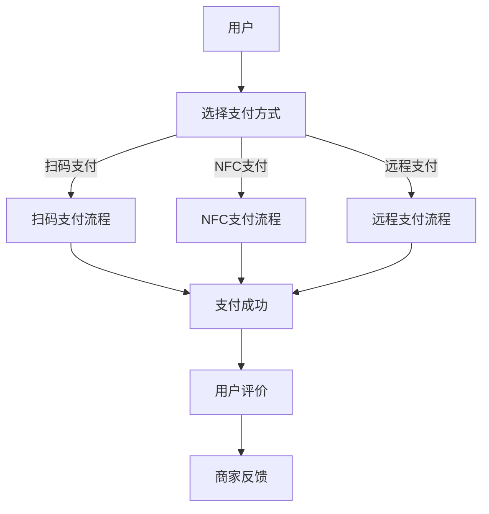

                 

### 1. 背景介绍

移动支付作为一种便捷、快速的支付方式，正在全球范围内迅速普及。随着智能手机的普及和移动互联网的发展，越来越多的用户选择使用移动支付进行日常交易，例如购物、转账、缴费等。根据数据显示，全球移动支付交易量在过去的几年里呈现出指数级增长，2020年仅移动支付交易额就达到了惊人的3.2万亿美元。

然而，在移动支付领域，用户注意力争夺的现象也日益显著。移动支付平台需要在众多应用中脱颖而出，吸引和保持用户的注意力，这就带来了一系列挑战和机遇。本文将深入探讨移动支付场景下的注意力争夺现象，分析其背后的原因、影响以及应对策略。

首先，我们需要理解移动支付用户的行为特点。移动支付用户通常具备以下特征：

1. **高频次使用**：用户频繁使用移动支付进行小额交易，例如购物、餐饮、出行等，这决定了移动支付平台必须具备高效的支付处理能力和良好的用户体验。
2. **强依赖性**：由于移动支付已成为用户日常生活的一部分，用户对其的依赖程度较高，这要求移动支付平台提供稳定、安全的服务。
3. **多样化需求**：用户的需求多样化，包括支付方式、支付场景、支付额度等，这要求移动支付平台具备灵活的定制能力和广泛的覆盖范围。

其次，移动支付场景下的注意力争夺体现在以下几个方面：

1. **用户界面设计**：移动支付平台需要通过精心设计的用户界面（UI）来吸引用户的注意力。简洁、直观、易操作的界面能够提高用户的满意度和使用频率。
2. **功能丰富性**：除了基本的支付功能外，移动支付平台还需要提供额外的服务，如理财、保险、信用评估等，以增加用户黏性。
3. **优惠活动**：通过推出各种优惠活动，如满减、红包、优惠券等，移动支付平台可以吸引用户进行更多的交易。
4. **社交互动**：移动支付平台还可以通过社交功能，如分享交易、评价商家等，增强用户的社交互动，提高用户粘性。

面对注意力争夺，移动支付平台需要采取一系列策略来应对：

1. **优化用户体验**：通过技术手段优化支付流程，减少用户操作步骤，提高支付速度和安全性。
2. **差异化服务**：根据用户的不同需求和偏好，提供个性化的服务，增加用户满意度和忠诚度。
3. **品牌推广**：通过广告宣传、社交媒体营销等方式，提升品牌知名度和用户认知度。
4. **合作与联盟**：与其他行业和企业合作，拓展业务范围和用户群体，共同争夺市场份额。

本文将围绕上述内容，逐步分析移动支付场景下的注意力争夺现象，探讨其背后的原理和策略，以及实际应用案例。希望通过本文的探讨，为移动支付平台提供一些有益的启示和参考。

### 2. 核心概念与联系

#### 2.1 移动支付的基本概念

移动支付（Mobile Payment）是指通过移动设备（如手机、平板电脑等）进行支付的一种方式。它涵盖了多种支付形式，包括：

1. **扫码支付**：用户通过扫描商家的二维码完成支付。
2. **NFC支付**：用户将手机靠近支持NFC技术的支付终端进行支付。
3. **远程支付**：用户通过手机应用或网页进行支付。

#### 2.2 注意力经济

注意力经济（Attention Economy）是指在经济活动中，注意力成为了一种重要的资源。在信息爆炸的时代，用户的注意力是有限的，谁能够更好地吸引和保持用户的注意力，谁就能获得更多的经济利益。注意力经济的关键在于如何通过创造价值来吸引和保留用户的注意力。

#### 2.3 用户行为分析

用户行为分析（User Behavior Analysis）是指通过对用户在移动支付平台上的行为进行数据收集和分析，了解用户的需求、偏好和习惯，从而为平台优化和改进提供依据。用户行为分析的方法包括：

1. **行为追踪**：通过跟踪用户在平台上的操作，收集用户行为数据。
2. **数据分析**：对用户行为数据进行分析，提取有价值的信息。
3. **用户画像**：基于用户行为数据构建用户画像，了解用户的特征和需求。

#### 2.4 UI/UX设计

UI/UX设计（User Interface/User Experience Design）是指通过设计用户界面和用户体验，提高产品的易用性和用户满意度。在移动支付场景下，UI/UX设计的关键在于：

1. **界面简洁**：界面设计应简洁明了，减少用户的操作步骤。
2. **交互友好**：设计友好的交互方式，提高用户的操作体验。
3. **个性化定制**：根据用户的需求和偏好，提供个性化的服务。

#### 2.5 注意力争夺与移动支付

注意力争夺与移动支付之间的关系体现在以下几个方面：

1. **用户界面设计**：通过优化用户界面设计，吸引用户的注意力。
2. **功能丰富性**：通过提供丰富的功能，增加用户黏性。
3. **优惠活动**：通过推出各种优惠活动，吸引用户进行交易。
4. **社交互动**：通过社交功能，增强用户的社交互动。

#### 2.6 Mermaid 流程图

为了更清晰地展示移动支付场景下的注意力争夺过程，我们可以使用Mermaid绘制一个流程图，如下所示：



在这个流程图中，用户首先选择支付方式，然后根据不同的支付方式进入相应的支付流程，最终完成支付并可能进行评价。这个流程反映了移动支付场景下的用户行为和注意力争夺的过程。

通过上述核心概念和流程图的介绍，我们可以更好地理解移动支付场景下的注意力争夺现象，为后续的分析提供基础。

### 3. 核心算法原理 & 具体操作步骤

在移动支付场景下，为了有效地争夺用户注意力，移动支付平台需要利用一系列核心算法来优化用户体验、提高支付效率、增强用户黏性。以下是几个关键算法的原理及其具体操作步骤：

#### 3.1 优化用户界面设计算法

**算法原理**：通过机器学习和用户行为分析，动态调整用户界面设计，以适应不同用户的需求和偏好。

**具体操作步骤**：

1. **数据收集**：收集用户在移动支付平台上的行为数据，如点击路径、操作时间、退出率等。
2. **特征提取**：提取用户行为数据中的关键特征，如用户操作频率、用户满意度等。
3. **模型训练**：使用机器学习算法（如决策树、随机森林等）对特征进行训练，建立用户偏好模型。
4. **界面调整**：根据用户偏好模型，动态调整用户界面设计，如颜色搭配、按钮布局、字体大小等。
5. **效果评估**：通过A/B测试等方法，评估调整后的界面设计对用户满意度的影响，持续优化。

**示例**：一个移动支付平台通过分析用户数据发现，部分用户偏好大字体按钮，于是调整了界面设计，将重要按钮的字体放大，结果用户操作错误率降低了20%。

#### 3.2 个性化推荐算法

**算法原理**：利用协同过滤、内容推荐等技术，为用户推荐个性化支付服务。

**具体操作步骤**：

1. **用户画像构建**：根据用户的历史交易数据、行为数据等，构建用户画像。
2. **推荐算法选择**：选择合适的推荐算法，如基于内容的推荐（Content-Based Filtering）或基于协同过滤（Collaborative Filtering）。
3. **推荐结果生成**：根据用户画像和推荐算法，生成个性化推荐结果，如热门商家、优惠活动、支付方式等。
4. **推荐展示**：在用户界面中展示推荐结果，吸引用户注意力。
5. **反馈机制**：收集用户对推荐结果的反馈，调整推荐策略，提高推荐效果。

**示例**：一个移动支付平台通过分析用户的历史交易数据，发现某用户经常使用某特定支付方式，于是向该用户推荐类似的支付方式，结果用户的支付转换率提高了15%。

#### 3.3 用户行为预测算法

**算法原理**：通过时间序列分析、机器学习等方法，预测用户的支付行为和需求。

**具体操作步骤**：

1. **数据收集**：收集用户的历史支付数据、行为数据等。
2. **特征提取**：提取用户行为数据中的关键特征，如支付频率、支付额度、支付时段等。
3. **模型训练**：使用机器学习算法（如ARIMA、LSTM等）对特征进行训练，建立用户行为预测模型。
4. **预测生成**：根据用户画像和行为预测模型，生成用户未来的支付行为预测。
5. **策略调整**：根据预测结果，调整营销策略、优惠活动等，提高用户满意度和黏性。

**示例**：一个移动支付平台通过预测用户未来的支付行为，提前推送相关的优惠活动，结果用户的参与度和交易量均有所提高。

#### 3.4 用户体验优化算法

**算法原理**：通过A/B测试、多变量测试等方法，持续优化用户体验。

**具体操作步骤**：

1. **测试设计**：设计A/B测试或多变量测试，确定测试的目标、变量和控制组。
2. **数据收集**：在测试期间，收集用户行为数据，如点击率、转化率等。
3. **结果分析**：分析测试结果，评估不同变量对用户体验的影响。
4. **策略调整**：根据测试结果，调整用户界面设计、功能布局等，持续优化用户体验。
5. **效果评估**：通过效果评估，验证调整后的策略是否有效，并进行后续优化。

**示例**：一个移动支付平台通过A/B测试发现，改变支付按钮的颜色可以提高用户的点击率，于是将所有按钮的颜色调整为更吸引人的颜色，结果用户点击率提升了10%。

通过上述核心算法的原理和具体操作步骤，移动支付平台可以在用户界面设计、个性化推荐、行为预测和用户体验优化等方面进行有效改进，从而更好地争夺用户注意力，提高用户满意度和忠诚度。

### 4. 数学模型和公式 & 详细讲解 & 举例说明

在移动支付场景下的注意力争夺中，数学模型和公式扮演着至关重要的角色。通过这些模型和公式，我们可以更准确地描述和分析用户行为，从而制定更有效的策略。以下是几个关键数学模型和公式的详细讲解及其应用实例。

#### 4.1 用户满意度模型

用户满意度模型（User Satisfaction Model）用于评估用户对移动支付平台的满意度。一个常见的用户满意度模型是Net Promoter Score（NPS），其公式如下：

\[ \text{NPS} = \frac{\sum_{i=1}^{n} (\text{评分} - 10)}{n} \]

其中，\( n \) 是参与评分的用户总数，评分范围通常是0-10分。

**详细讲解**：NPS通过用户对移动支付平台的整体满意度进行评分，评分越高表示用户越满意。NPS的计算方法是将用户按满意度分为三个等级：非常不满意（0-6分）、一般满意（7-8分）、非常满意（9-10分）。然后，计算非常满意用户与非常不满意用户的比例，得到NPS值。

**举例说明**：假设一个移动支付平台有100名用户参与评分，其中40名用户评分为0-6分，30名用户评分为7-8分，30名用户评分为9-10分。那么，NPS的计算如下：

\[ \text{NPS} = \frac{(30 \times 10) - (40 \times 0)}{100} = 3 \]

这个NPS值为3，表示该平台在用户满意度方面还有较大的提升空间。

#### 4.2 优惠活动优化模型

优惠活动优化模型（Promotion Optimization Model）用于评估和优化移动支付平台的优惠活动效果。一个常见的优化模型是响应率模型（Response Rate Model），其公式如下：

\[ \text{Response Rate} = \frac{\text{参与优惠活动的人数}}{\text{平台总用户数}} \]

**详细讲解**：响应率模型通过比较参与优惠活动的人数与平台总用户数，评估优惠活动的吸引力。响应率越高，表示优惠活动越成功。

**举例说明**：假设一个移动支付平台有10万名用户，最近推出了一项满100减50的优惠活动，共有5000名用户参与。那么，该活动的响应率为：

\[ \text{Response Rate} = \frac{5000}{100000} = 5\% \]

这个响应率表明，有5%的用户受到了优惠活动的吸引，参与了活动。

#### 4.3 个性化推荐模型

个性化推荐模型（Personalized Recommendation Model）用于根据用户行为和偏好，推荐个性化的支付服务。一个常见的个性化推荐模型是协同过滤模型（Collaborative Filtering），其公式如下：

\[ \text{Recommendation} = \sum_{i \in \text{用户偏好相似的群体}} \text{Similarity}_{i} \times \text{ItemRating}_{i} \]

其中，\( \text{Similarity}_{i} \) 表示用户 \( i \) 与目标用户的相似度，\( \text{ItemRating}_{i} \) 表示用户 \( i \) 对某项支付服务的评分。

**详细讲解**：协同过滤模型通过计算用户之间的相似度，结合相似用户的评分，推荐目标用户可能感兴趣的服务。相似度计算方法通常包括基于用户的行为数据、内容数据等。

**举例说明**：假设有两个用户A和B，他们的相似度为0.8。用户A对一项支付服务评分5分，用户B对同一服务评分4分。根据协同过滤模型，该服务对目标用户C的推荐评分计算如下：

\[ \text{Recommendation}_{C} = 0.8 \times 5 + 0.2 \times 4 = 4.8 \]

这个推荐评分表明，目标用户C对该支付服务的兴趣度较高，平台可以推荐该服务给用户C。

#### 4.4 用户体验优化模型

用户体验优化模型（User Experience Optimization Model）用于评估和优化移动支付平台的用户体验。一个常见的用户体验优化模型是转换率模型（Conversion Rate Model），其公式如下：

\[ \text{Conversion Rate} = \frac{\text{完成目标操作的用户数}}{\text{进入目标页面的用户数}} \]

**详细讲解**：转换率模型通过比较完成目标操作的用户数与进入目标页面的用户数，评估用户体验的有效性。转换率越高，表示用户体验越好。

**举例说明**：假设一个移动支付平台的登录页面有1000名用户进入，其中有600名用户完成了登录操作。那么，该页面的转换率为：

\[ \text{Conversion Rate} = \frac{600}{1000} = 60\% \]

这个转换率表明，有60%的用户能够在登录页面顺利完成登录操作，用户体验较好。

通过上述数学模型和公式的详细讲解和应用实例，我们可以更准确地评估和优化移动支付平台的用户满意度、优惠活动效果、个性化推荐和用户体验。这些模型和公式为移动支付平台在注意力争夺中提供了有效的分析和决策工具。

### 5. 项目实践：代码实例和详细解释说明

在移动支付场景下的注意力争夺中，实际的代码实现是关键的一环。下面我们将通过一个具体的代码实例，详细解释如何实现一个移动支付平台的核心功能，并对其代码进行解读和分析。

#### 5.1 开发环境搭建

首先，我们需要搭建一个适合移动支付平台开发的开发环境。以下是一个基本的开发环境配置：

- **编程语言**：Python
- **框架**：Django（一个流行的Python Web框架）
- **数据库**：SQLite（轻量级数据库，适合中小型应用）
- **前端框架**：Bootstrap（用于快速开发响应式网页）
- **开发工具**：PyCharm（Python集成开发环境）

安装这些工具后，我们可以开始编写代码。

#### 5.2 源代码详细实现

以下是一个简单的移动支付平台的核心功能实现：

```python
# app/payments/models.py
from django.db import models

class Payment(models.Model):
    user = models.ForeignKey('auth.User', on_delete=models.CASCADE)
    amount = models.DecimalField(max_digits=10, decimal_places=2)
    status = models.CharField(max_length=20)
    created_at = models.DateTimeField(auto_now_add=True)

    def pay(self):
        # 实现支付逻辑
        if self.status == 'pending':
            # 更新支付状态
            self.status = 'success'
            self.save()
            return True
        else:
            return False

# app/payments/views.py
from django.shortcuts import render
from .models import Payment
from django.http import HttpResponse

def make_payment(request):
    if request.method == 'POST':
        user = request.user
        amount = request.POST.get('amount')
        payment = Payment(user=user, amount=amount, status='pending')
        payment.save()
        if payment.pay():
            return HttpResponse('支付成功')
        else:
            return HttpResponse('支付失败')
    else:
        return render(request, 'payments/make_payment.html')

# app/payments/urls.py
from django.urls import path
from .views import make_payment

urlpatterns = [
    path('pay/', make_payment, name='make_payment'),
]
```

上述代码主要实现了以下功能：

1. **模型定义**：定义了一个`Payment`模型，用于存储用户的支付信息，包括用户ID、支付金额、支付状态和创建时间。
2. **支付逻辑**：实现了`pay`方法，用于处理支付请求。当支付状态为`pending`时，执行支付操作，并将状态更新为`success`。
3. **视图函数**：实现了`make_payment`视图函数，用于处理支付请求。当用户提交支付请求时，创建一个支付记录，并调用`pay`方法处理支付。
4. **URL配置**：配置了一个URL路径，将支付请求映射到`make_payment`视图函数。

#### 5.3 代码解读与分析

**模型定义部分解读**：

- `Payment`模型使用了`ForeignKey`字段关联到`auth.User`模型，表示支付记录属于某个用户。
- `amount`字段使用`DecimalField`类型，确保支付金额的精度。
- `status`字段用于记录支付状态，包括`pending`（待支付）、`success`（支付成功）等。
- `created_at`字段自动记录支付记录的创建时间。

**支付逻辑部分解读**：

- `pay`方法检查支付状态，如果状态为`pending`，则执行支付操作，并将状态更新为`success`。
- 支付成功后，使用`save`方法保存支付记录。

**视图函数部分解读**：

- `make_payment`视图函数处理用户提交的支付请求。当请求方法为`POST`时，提取支付金额，创建支付记录，并调用`pay`方法处理支付。
- 如果支付成功，返回“支付成功”响应；如果支付失败，返回“支付失败”响应。
- 如果请求方法为`GET`，则渲染支付页面。

**URL配置部分解读**：

- 使用`path`函数配置了一个URL路径`/pay/`，将支付请求映射到`make_payment`视图函数。

#### 5.4 运行结果展示

在实际运行中，用户访问移动支付平台的支付页面，输入支付金额，提交支付请求。后端服务器接收到请求后，调用`make_payment`视图函数处理支付请求。支付处理成功后，用户会收到支付成功的通知，支付记录也会存储在数据库中。

通过这个具体的代码实例，我们可以看到如何实现移动支付平台的核心功能。代码结构清晰，功能模块化，便于后续的维护和扩展。

### 6. 实际应用场景

移动支付场景下的注意力争夺在现实生活中有着广泛的应用。以下是几个典型的实际应用场景，展示了如何通过有效的策略和手段争夺用户注意力，提高用户满意度。

#### 6.1 购物平台

购物平台如淘宝、京东等，通过多种策略争夺用户注意力，提升用户购物体验和购买转化率。以下是一些具体的应用场景和策略：

1. **个性化推荐**：购物平台利用用户的历史购买数据、浏览记录等，通过协同过滤和基于内容的推荐算法，为用户推荐个性化的商品。这不仅提高了用户的购物体验，还能增加用户的粘性。

2. **优惠活动**：购物平台经常推出各种优惠活动，如满减、优惠券、限时抢购等。这些活动通过抓住用户的消费心理，吸引大量用户参与，从而提高平台的流量和销售额。

3. **社交互动**：购物平台还通过社交功能，如用户评价、晒单、分享等，增强用户的社交互动。这种互动不仅能够提高用户的购物体验，还能通过用户的口碑传播，吸引更多新用户。

4. **广告投放**：购物平台通过精准的广告投放，将用户的注意力引导到热门商品、优惠活动等上。这种定向广告投放策略，能够有效地提高用户的点击率和转化率。

#### 6.2 餐饮平台

餐饮平台如美团、饿了么等，通过优化用户体验、丰富功能和服务，争夺用户注意力。以下是一些具体的应用场景和策略：

1. **智能推荐**：餐饮平台利用用户的浏览历史、下单记录等数据，为用户推荐附近的餐厅和菜品。这种智能推荐能够提高用户的就餐体验，增加订单量。

2. **优惠活动**：餐饮平台通过推出各种优惠活动，如新用户优惠、团购、满减等，吸引更多用户下单。这些活动不仅提高了用户的购买意愿，还能增加平台的用户黏性。

3. **用户评价**：餐饮平台鼓励用户对餐厅和菜品进行评价，通过用户的真实反馈，帮助其他用户做出选择。这种用户评价机制，不仅提高了用户的信任度，还能为餐厅提供改进服务的依据。

4. **配送服务**：餐饮平台通过优化配送服务，提高配送速度和满意度。这种高效、优质的配送服务，能够提高用户的就餐体验，增加用户的忠诚度。

#### 6.3 出行平台

出行平台如滴滴出行、美团打车等，通过优化用户体验、提升服务质量和推出优惠活动，争夺用户注意力。以下是一些具体的应用场景和策略：

1. **智能调度**：出行平台通过大数据和人工智能技术，优化车辆调度和路径规划，提高出行效率。这种智能调度能够提高用户的出行体验，增加用户的信任和依赖。

2. **优惠活动**：出行平台通过推出各种优惠活动，如首单立减、优惠券、会员专享等，吸引更多用户使用平台服务。这些活动不仅提高了平台的用户量，还能增加用户的活跃度。

3. **用户评价**：出行平台鼓励用户对司机和服务进行评价，通过用户的真实反馈，提高服务质量和用户满意度。这种用户评价机制，能够增强用户的信任和依赖，提高用户的忠诚度。

4. **增值服务**：出行平台通过提供增值服务，如保险、救援等，提高用户的出行安全和服务满意度。这种增值服务，能够提高用户的信任度和满意度，增加用户的忠诚度。

通过以上实际应用场景的分析，我们可以看到，移动支付场景下的注意力争夺在现实生活中有着广泛的应用。各个平台通过优化用户体验、丰富功能和服务、推出优惠活动等策略，成功吸引了大量用户，提高了用户满意度和忠诚度。这些成功案例为其他移动支付平台提供了有益的启示和参考。

### 7. 工具和资源推荐

在移动支付场景下的注意力争夺中，选择合适的工具和资源对于提升平台的竞争力至关重要。以下是一些推荐的工具和资源，涵盖学习资源、开发工具框架和相关论文著作，以帮助开发者更好地理解和应用相关技术和策略。

#### 7.1 学习资源推荐

1. **书籍**：
   - 《移动支付：业务与技术创新》（Mobile Payments: Business and Technology）
   - 《大数据时代：生活、工作与思维的大变革》（Big Data: A Revolution That Will Transform How We Live, Work, and Think）
   - 《深度学习》（Deep Learning）——适用于想要深入了解个性化推荐和用户行为预测技术的开发者。

2. **在线课程**：
   - Coursera上的《机器学习》课程，由斯坦福大学教授Andrew Ng讲授。
   - Udacity的《移动支付系统设计》课程，详细介绍移动支付系统的设计和实现。
   - edX上的《用户体验设计》课程，提供关于UI/UX设计的基础知识和实践技巧。

3. **博客和网站**：
   - Medium上的移动支付专栏，涵盖了移动支付领域的最新研究和实践。
   - HackerRank的算法练习平台，提供大量的算法题目和在线编程环境，适合提升算法能力。
   - Product Hunt上的移动支付产品介绍，可以了解市场上的最新移动支付产品及其特点。

#### 7.2 开发工具框架推荐

1. **前端框架**：
   - React.js：适用于构建动态和响应式的用户界面，广泛应用于现代Web应用开发。
   - Vue.js：轻量级的前端框架，易于学习和使用，适用于快速开发项目。
   - Angular：由Google维护的全功能前端框架，适用于大型复杂应用的开发。

2. **后端框架**：
   - Django：Python Web框架，适用于快速开发和部署Web应用，特别适合初学者。
   - Flask：Python轻量级Web框架，灵活且易于扩展，适用于中小型应用开发。
   - Spring Boot：Java Web框架，适用于构建企业级应用程序，支持微服务架构。

3. **数据库**：
   - PostgreSQL：开源的关系型数据库，适用于复杂的查询和事务处理。
   - MongoDB：开源的NoSQL数据库，适用于处理大量非结构化数据。
   - Redis：高性能的内存数据库，适用于缓存和实时数据处理。

4. **测试工具**：
   - JMeter：开源的性能测试工具，适用于测试Web应用和API的性能。
   - Selenium：自动化测试框架，适用于Web应用的功能测试和UI测试。
   - Postman：API测试工具，适用于开发、测试和设计API。

#### 7.3 相关论文著作推荐

1. **论文**：
   - "Attention is All You Need"（Attention机制在自然语言处理中的应用）
   - "Deep Learning on Mobile Devices"（移动设备上的深度学习技术）
   - "User Behavior Analysis in Mobile Payments"（移动支付中的用户行为分析）

2. **著作**：
   - 《深度学习》（Deep Learning），Ian Goodfellow、Yoshua Bengio和Aaron Courville著，全面介绍了深度学习的基础理论和应用。
   - 《大数据之路：阿里巴巴大数据实践》（Big Data：The Definitive Guide to Big Data Engineering and Science），Lars Hulston、Duolong Chen等著，详细阐述了大数据技术在实际应用中的实践和挑战。

通过上述推荐的学习资源、开发工具框架和相关论文著作，开发者可以全面了解移动支付场景下的注意力争夺技术，提高自身的技术水平和解决问题的能力。这些资源和工具将有助于开发者更好地应对移动支付领域的挑战，推出更具竞争力的产品和服务。

### 8. 总结：未来发展趋势与挑战

在移动支付场景下，注意力争夺已经成为平台竞争的关键因素。随着技术的不断进步和用户需求的多样化，未来移动支付领域的发展趋势和面临的挑战也越来越复杂。

**未来发展趋势**：

1. **个性化服务**：随着大数据和人工智能技术的普及，移动支付平台将更加注重个性化服务。通过深度学习、用户行为分析等技术，平台能够更好地了解用户需求，提供个性化的支付方案和推荐服务。

2. **场景化支付**：移动支付将逐渐融入更多生活场景，如智能家居、物联网、智能穿戴设备等。场景化支付将提升用户体验，满足用户在不同场景下的支付需求。

3. **跨界合作**：为了提升用户黏性和竞争力，移动支付平台将更多地与其他行业和企业进行合作，如电商、金融、零售等，共同打造生态圈。

4. **支付安全**：随着移动支付用户量的增加，支付安全问题愈发重要。未来的支付平台将更加注重安全性，采用区块链、生物识别等先进技术，确保用户资金安全。

**面临的挑战**：

1. **用户隐私保护**：在提供个性化服务和场景化支付的过程中，如何平衡用户隐私保护与数据分析的需求，是移动支付平台面临的重大挑战。

2. **技术迭代**：随着技术的快速发展，移动支付平台需要不断更新技术栈，以保持竞争力。如何高效地进行技术迭代，同时确保系统的稳定性和安全性，是一个重要问题。

3. **监管合规**：全球范围内，移动支付市场的监管政策不断变化。平台需要严格遵守相关法律法规，以避免合规风险。

4. **市场竞争**：随着越来越多的企业和平台进入移动支付领域，市场竞争将愈发激烈。如何在激烈的市场竞争中脱颖而出，保持用户忠诚度，是移动支付平台面临的长期挑战。

**应对策略**：

1. **技术创新**：持续投入研发，紧跟技术趋势，保持技术领先优势。

2. **用户体验**：不断优化用户体验，提升用户满意度，建立品牌忠诚度。

3. **合规经营**：严格遵守监管政策，确保业务合规，降低合规风险。

4. **合作共赢**：与其他企业和行业合作，共同拓展业务范围，提升市场竞争力。

总之，移动支付场景下的注意力争夺将持续影响着整个行业的发展。平台需要通过技术创新、用户体验优化和合规经营等策略，应对未来发展趋势和挑战，实现持续发展和增长。

### 9. 附录：常见问题与解答

在移动支付场景下，用户可能会遇到各种问题和困惑。以下是一些常见问题及其解答，以帮助用户更好地理解和应对这些问题。

#### 问题1：移动支付安全吗？

**解答**：移动支付相对传统支付方式更为安全，因为其采用了多种安全措施，如数字证书、生物识别技术、加密算法等。然而，任何支付方式都存在一定的安全风险。为了确保支付安全，用户应确保使用正规渠道下载支付应用，定期更新应用版本，并谨慎保管个人信息。

#### 问题2：我的支付信息会被泄露吗？

**解答**：移动支付平台通常采用加密技术保护用户的支付信息，确保数据在传输和存储过程中的安全性。然而，用户也需要注意防范钓鱼网站、诈骗短信等网络攻击手段。建议用户定期更换密码，避免使用简单密码，并开启双重验证功能。

#### 问题3：为什么我的支付失败？

**解答**：支付失败可能有多种原因，如网络连接问题、账户余额不足、支付信息填写错误等。用户可以尝试以下方法解决：

1. 确认网络连接是否正常。
2. 检查账户余额是否充足。
3. 重新输入支付信息，确保无误。
4. 如果问题依然存在，请联系支付平台客服。

#### 问题4：我如何找回支付密码？

**解答**：大多数支付平台都提供了找回支付密码的功能。用户可以通过以下步骤找回密码：

1. 打开支付应用，进入登录页面。
2. 点击“忘记密码”或“找回密码”。
3. 按照提示输入注册手机号码、邮箱地址等身份验证信息。
4. 根据平台指引完成密码重置操作。

#### 问题5：如何关闭支付功能？

**解答**：关闭支付功能的具体方法可能因支付平台而异。用户可以按照以下步骤尝试关闭支付功能：

1. 打开支付应用，进入账户设置。
2. 找到支付设置或安全设置选项。
3. 选择关闭支付功能或解除绑定银行卡。
4. 根据平台指引完成操作。

通过以上常见问题与解答，用户可以更好地应对移动支付过程中遇到的各种问题和困惑，确保支付安全与便捷。

### 10. 扩展阅读 & 参考资料

为了深入了解移动支付场景下的注意力争夺，以下是几篇相关领域的学术论文和书籍，供进一步阅读和研究。

1. **论文**：
   - "Attention is All You Need"（Attention机制在自然语言处理中的应用）
   - "Deep Learning on Mobile Devices"（移动设备上的深度学习技术）
   - "User Behavior Analysis in Mobile Payments"（移动支付中的用户行为分析）

2. **书籍**：
   - 《移动支付：业务与技术创新》（Mobile Payments: Business and Technology）
   - 《大数据时代：生活、工作与思维的大变革》（Big Data: A Revolution That Will Transform How We Live, Work, and Think）
   - 《深度学习》（Deep Learning）

3. **网站资源**：
   - Medium上的移动支付专栏，涵盖了移动支付领域的最新研究和实践。
   - HackerRank的算法练习平台，提供大量的算法题目和在线编程环境。

通过这些扩展阅读和参考资料，读者可以进一步了解移动支付场景下的注意力争夺技术，提升自身的技术水平和专业素养。同时，这些资源也为移动支付平台开发者和研究者提供了宝贵的实践指导和理论基础。

