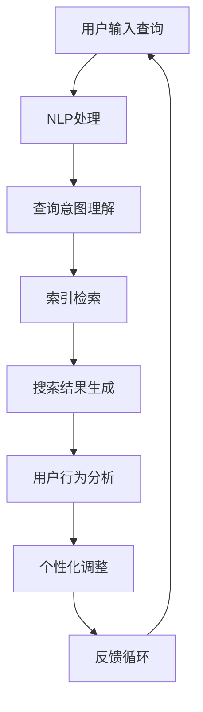

                 

### 1. 背景介绍

移动端AI搜索正逐渐成为现代移动应用中不可或缺的一部分。随着智能手机和移动设备的普及，用户对于搜索体验的需求也在不断提升。快速、准确且个性化的搜索结果可以显著提升用户体验，进而推动应用的广泛使用。然而，移动端的硬件资源有限，如何在有限的计算资源下实现高效、精准的AI搜索，成为开发者和研究者们亟待解决的问题。

传统的搜索算法通常依赖于服务器端的强大计算能力，这在大数据处理和桌面端应用中表现出色。但在移动端，服务器依赖性高会导致响应时间延长，用户体验不佳。为了克服这一难题，移动端AI搜索开始转向基于客户端的解决方案。这种解决方案利用移动设备本身的计算能力，实现离线或近线搜索，从而大幅降低了对服务器资源的依赖。

AI技术在移动端搜索中的应用主要体现在自然语言处理（NLP）、机器学习（ML）和深度学习（DL）等方面。这些技术通过处理用户输入和搜索上下文，可以生成更精确的搜索结果。例如，NLP技术可以帮助理解用户的查询意图，而ML和DL算法则可以通过大量数据训练，提高搜索结果的准确性和个性化程度。

目前，移动端AI搜索已经广泛应用于各种场景，如电商应用中的商品搜索、社交媒体平台上的内容推荐、移动办公应用中的文档搜索等。这些应用通过高效的AI搜索算法，为用户提供便捷的搜索服务，从而提升用户满意度和应用活跃度。

然而，移动端AI搜索的发展也面临着诸多挑战。首先是计算资源的限制，移动设备相比于服务器端的计算能力有限，如何在有限的资源下实现高效的AI搜索算法，是一个重要的课题。其次是数据隐私和安全性问题，移动设备往往携带大量用户数据，如何保障这些数据的安全，防止数据泄露，是移动端AI搜索需要解决的关键问题。最后是搜索结果的个性化和准确性，如何根据用户的历史行为和偏好，生成个性化的搜索结果，同时保证结果的准确性，是移动端AI搜索需要持续优化的方向。

总的来说，移动端AI搜索已经成为一个热门的研究领域，其在现代移动应用中的重要性日益凸显。通过不断探索和创新，开发出更加高效、精准、安全的移动端AI搜索算法，将是未来研究和应用的发展方向。在接下来的章节中，我们将详细探讨移动端AI搜索的核心概念、算法原理、数学模型以及实际应用案例，希望能为广大开发者提供有益的参考。

### 2. 核心概念与联系

#### 2.1 移动端AI搜索的基本概念

移动端AI搜索涉及多个核心概念，这些概念相互联系，构成了完整的搜索系统。以下是一些关键概念的简要说明：

- **自然语言处理（NLP）**：NLP是人工智能的一个分支，旨在让计算机理解和生成人类语言。在移动端AI搜索中，NLP用于解析用户输入的查询语句，理解查询意图，并将其转化为机器可以处理的形式。

- **机器学习（ML）**：ML是一种通过数据训练模型，使其能够对未知数据进行预测或分类的方法。在移动端AI搜索中，ML算法可以用于改进搜索结果的准确性和个性化程度，例如通过用户历史行为数据训练推荐模型。

- **深度学习（DL）**：DL是ML的一个子领域，它利用多层神经网络来模拟人脑的学习方式。在移动端AI搜索中，DL算法可以用于处理复杂的自然语言理解和图像识别任务，提高搜索系统的智能化水平。

- **索引**：索引是搜索系统的核心，用于快速检索数据。在移动端AI搜索中，索引技术可以大幅提高搜索效率，使得系统能够在毫秒级别内返回相关结果。

- **用户行为分析**：用户行为分析是理解用户搜索意图和偏好的一种方法。通过收集和分析用户的历史搜索行为，可以生成更个性化的搜索结果。

#### 2.2 基于客户端与基于服务端的搜索架构比较

移动端AI搜索可以采用基于客户端的架构或基于服务端的架构，这两种架构在资源利用、响应速度、数据隐私等方面存在显著差异。

- **基于客户端的搜索架构**：
  - **优势**：减少对服务器资源的依赖，提高响应速度。用户的数据和计算都在本地进行，降低了数据传输和隐私泄露的风险。
  - **挑战**：移动设备计算资源有限，如何在有限的资源下实现高效的搜索算法是一个挑战。

- **基于服务端的搜索架构**：
  - **优势**：服务器具备强大的计算能力和存储资源，可以处理大量数据。支持复杂的搜索逻辑和数据挖掘任务。
  - **挑战**：依赖服务器导致响应时间延长，用户体验不佳。数据隐私和安全问题也更为突出。

#### 2.3 技术之间的联系与互动

在移动端AI搜索系统中，上述技术概念之间存在紧密的联系与互动。以下是它们之间的一些关键互动关系：

- **NLP与ML/DL的互动**：NLP技术用于理解用户输入的查询，而ML和DL算法则通过训练模型来提高搜索结果的准确性和个性化程度。例如，NLP技术可以提取用户查询中的关键词和实体，而DL算法则可以基于用户历史数据生成更加精准的搜索结果。

- **索引与搜索效率**：索引技术是搜索系统的基础，它通过将数据结构化，使得搜索操作可以在极短时间内完成。在移动端，高效索引技术是提高搜索效率的关键。

- **用户行为分析与个性化搜索**：用户行为分析可以收集用户的历史搜索行为，这些数据可以用于训练ML模型，生成个性化的搜索结果。个性化搜索能够提高用户满意度和搜索体验。

- **数据隐私与安全性**：在移动端AI搜索中，数据隐私和安全性至关重要。通过加密、去标识化等技术，可以保障用户数据的安全和隐私。

#### 2.4 Mermaid 流程图展示

为了更直观地展示移动端AI搜索系统中的核心概念和交互关系，以下是一个简化的Mermaid流程图：



在这个流程图中，用户输入查询（A）经过NLP处理（B），查询意图被理解（C），然后通过索引检索（D）生成搜索结果（E）。用户行为分析（F）用于生成个性化的搜索结果（G），并通过反馈循环（H）不断优化搜索系统。

### 3. 核心算法原理 & 具体操作步骤

#### 3.1 搜索算法概述

移动端AI搜索的核心在于如何快速、准确、高效地处理用户查询并返回相关结果。这通常涉及到多种算法的综合运用，包括但不限于自然语言处理（NLP）、机器学习（ML）和深度学习（DL）。以下将详细介绍这些算法的原理和具体操作步骤。

#### 3.2 自然语言处理（NLP）

自然语言处理是AI搜索的基础，用于理解用户输入的查询语句。以下是一个典型的NLP流程：

1. **文本预处理**：
   - **分词**：将输入的查询语句分割成单词或词组。
   - **词性标注**：识别每个词的词性（如名词、动词等）。
   - **实体识别**：识别查询中的实体（如人名、地名、组织名等）。

2. **语义理解**：
   - **语义解析**：理解查询语句的整体含义，确定查询的关键词和意图。
   - **意图识别**：识别用户查询的目的，如信息查询、命令执行等。

3. **查询扩展**：
   - **同义词替换**：将查询中的同义词替换为统一的词汇。
   - **短语扩展**：根据上下文扩展查询短语，提高搜索的全面性。

具体操作步骤示例：

```python
# 假设用户输入查询："附近有哪些好吃的餐馆？"
query = "附近有哪些好吃的餐馆？"

# 1. 文本预处理
tokens = preprocess_text(query)
word_properties = get_word_properties(tokens)

# 2. 语义理解
query_context = semantic_parsing(tokens, word_properties)
user_intent = intent_recognition(query_context)

# 3. 查询扩展
expanded_query = expand_query(query_context, user_intent)
```

#### 3.3 机器学习（ML）

机器学习用于改进搜索结果的准确性和个性化程度。以下是一个典型的ML应用流程：

1. **数据收集**：
   - 收集用户的历史搜索数据、浏览记录等。

2. **特征提取**：
   - 从原始数据中提取有用的特征，如关键词频率、用户行为特征等。

3. **模型训练**：
   - 使用特征数据训练机器学习模型，如分类器、推荐系统等。

4. **模型评估**：
   - 评估模型的准确性、召回率和覆盖率等指标。

5. **模型部署**：
   - 将训练好的模型部署到移动端应用中，实时更新搜索结果。

具体操作步骤示例：

```python
# 假设我们使用逻辑回归模型进行推荐
from sklearn.linear_model import LogisticRegression

# 1. 数据收集
user_data = collect_user_data()

# 2. 特征提取
X = extract_features(user_data)
y = extract_labels(user_data)

# 3. 模型训练
model = LogisticRegression()
model.fit(X, y)

# 4. 模型评估
accuracy = model.score(X, y)
print("Model accuracy:", accuracy)

# 5. 模型部署
deploy_model(model)
```

#### 3.4 深度学习（DL）

深度学习在自然语言理解和图像识别等方面具有显著优势。以下是一个典型的深度学习应用流程：

1. **数据预处理**：
   - 对原始数据（如文本、图像）进行清洗、归一化等预处理操作。

2. **模型设计**：
   - 设计合适的深度学习模型架构，如卷积神经网络（CNN）、循环神经网络（RNN）等。

3. **模型训练**：
   - 使用预处理后的数据训练深度学习模型。

4. **模型优化**：
   - 调整模型参数，优化模型性能。

5. **模型评估**：
   - 评估模型在不同数据集上的表现，如准确性、F1值等。

6. **模型部署**：
   - 将训练好的模型部署到移动端应用中。

具体操作步骤示例：

```python
# 假设我们使用BERT模型进行文本分类
from transformers import BertModel, BertTokenizer

# 1. 数据预处理
train_data, test_data = preprocess_data()

# 2. 模型设计
tokenizer = BertTokenizer.from_pretrained('bert-base-uncased')
model = BertModel.from_pretrained('bert-base-uncased')

# 3. 模型训练
optimizer = optimizers.AdamW(model.parameters(), lr=1e-5)
for epoch in range(num_epochs):
    for text, label in train_data:
        inputs = tokenizer(text, padding=True, truncation=True, return_tensors="pt")
        outputs = model(**inputs)
        loss = outputs.loss
        loss.backward()
        optimizer.step()
        optimizer.zero_grad()

# 4. 模型优化
model optimize()

# 5. 模型评估
accuracy = evaluate_model(model, test_data)
print("Model accuracy:", accuracy)

# 6. 模型部署
deploy_model(model)
```

通过上述算法的综合运用，移动端AI搜索系统能够实现高效、准确、个性化的搜索结果，为用户提供卓越的搜索体验。在接下来的章节中，我们将进一步探讨这些算法的数学模型和公式，以及如何在项目中实现和应用。

### 4. 数学模型和公式 & 详细讲解 & 举例说明

在移动端AI搜索中，数学模型和公式起到了至关重要的作用。这些模型不仅帮助我们理解和分析数据，还能优化搜索算法，提升搜索结果的准确性和效率。本章节将详细介绍移动端AI搜索中常用的数学模型和公式，并通过具体示例进行说明。

#### 4.1 相似度度量

相似度度量是搜索算法中的核心组成部分，用于衡量两个文本或词项之间的相似程度。以下是一些常见的相似度度量方法：

1. **余弦相似度**：

   余弦相似度是一种计算向量空间中两个向量夹角余弦值的度量方法。其数学公式如下：

   $$
   \text{cosine\_similarity}(\textbf{a}, \textbf{b}) = \frac{\textbf{a} \cdot \textbf{b}}{\|\textbf{a}\| \|\textbf{b}\|}
   $$

   其中，$\textbf{a}$和$\textbf{b}$是两个向量，$\|\textbf{a}\|$和$\|\textbf{b}\|$分别是它们的模长。

   举例说明：

   假设有两个词项向量$\textbf{a} = (1, 2, 3)$和$\textbf{b} = (4, 5, 6)$，它们的余弦相似度计算如下：

   $$
   \text{cosine\_similarity}(\textbf{a}, \textbf{b}) = \frac{1 \times 4 + 2 \times 5 + 3 \times 6}{\sqrt{1^2 + 2^2 + 3^2} \sqrt{4^2 + 5^2 + 6^2}} \approx 0.806
   $$

2. **Jaccard相似度**：

   Jaccard相似度是集合论中的一种相似度度量方法，用于计算两个集合的交集与并集的比例。其数学公式如下：

   $$
   \text{Jaccard\_similarity}(A, B) = \frac{|A \cap B|}{|A \cup B|}
   $$

   其中，$A$和$B$是两个集合，$|A|$和$|B|$分别是它们的基数。

   举例说明：

   假设有两个集合$A = \{1, 2, 3\}$和$B = \{2, 3, 4\}$，它们的Jaccard相似度计算如下：

   $$
   \text{Jaccard\_similarity}(A, B) = \frac{|A \cap B|}{|A \cup B|} = \frac{2}{4} = 0.5
   $$

3. **欧几里得距离**：

   欧几里得距离是一种衡量两个点在多维度空间中距离的度量方法。其数学公式如下：

   $$
   \text{Euclidean\_distance}(\textbf{a}, \textbf{b}) = \sqrt{\sum_{i=1}^{n} (a_i - b_i)^2}
   $$

   其中，$\textbf{a}$和$\textbf{b}$是两个向量，$n$是向量的维度。

   举例说明：

   假设有两个点$\textbf{a} = (1, 2, 3)$和$\textbf{b} = (4, 5, 6)$，它们的欧几里得距离计算如下：

   $$
   \text{Euclidean\_distance}(\textbf{a}, \textbf{b}) = \sqrt{(1 - 4)^2 + (2 - 5)^2 + (3 - 6)^2} = \sqrt{9 + 9 + 9} = \sqrt{27} \approx 5.196
   $$

#### 4.2 概率模型

概率模型在搜索算法中用于预测查询和文档之间的相关性。以下是一些常用的概率模型：

1. **贝叶斯概率**：

   贝叶斯概率是一种基于条件概率的推理方法，用于计算事件A在给定事件B发生的条件下发生的概率。其数学公式如下：

   $$
   P(A|B) = \frac{P(B|A)P(A)}{P(B)}
   $$

   其中，$P(A|B)$是事件A在事件B发生的条件下发生的概率，$P(B|A)$是事件B在事件A发生的条件下发生的概率，$P(A)$是事件A发生的概率，$P(B)$是事件B发生的概率。

   举例说明：

   假设我们要计算在下雨（事件B）的条件下，某人带伞（事件A）的概率。根据贝叶斯定理，我们可以计算如下：

   $$
   P(A|B) = \frac{P(B|A)P(A)}{P(B)}
   $$

   已知：
   - $P(B|A) = 0.8$（下雨的概率，给定某人带伞）
   - $P(A) = 0.4$（某人带伞的概率）
   - $P(B) = 0.3$（下雨的概率）

   代入公式得：

   $$
   P(A|B) = \frac{0.8 \times 0.4}{0.3} \approx 1.067
   $$

   注意，由于概率值不能超过1，这里的结果显然是不合理的。这表明我们需要更多的数据或假设来精确计算概率。

2. **多项式概率模型**：

   多项式概率模型是一种用于文本分类和搜索的统计模型，它基于词频来计算查询和文档之间的概率。其数学公式如下：

   $$
   P(\text{document}|\text{query}) = \frac{P(\text{query}|\text{document})P(\text{document})}{P(\text{query})}
   $$

   其中，$P(\text{document}|\text{query})$是文档在给定查询条件下出现的概率，$P(\text{query}|\text{document})$是查询在文档条件下出现的概率，$P(\text{document})$是文档出现的概率，$P(\text{query})$是查询出现的概率。

   举例说明：

   假设我们要计算文档D在给定查询Q条件下出现的概率。已知：

   - $P(\text{query}|\text{document}) = 0.6$（查询在文档条件下出现的概率）
   - $P(\text{document}) = 0.3$（文档出现的概率）
   - $P(\text{query}) = 0.4$（查询出现的概率）

   代入公式得：

   $$
   P(\text{document}|\text{query}) = \frac{0.6 \times 0.3}{0.4} = 0.45
   $$

   这个结果表明，文档D在给定查询Q条件下出现的概率是0.45。

#### 4.3 机器学习模型

机器学习模型在移动端AI搜索中用于预测查询和文档之间的相关性。以下是一些常见的机器学习模型：

1. **线性回归**：

   线性回归是一种用于预测连续值的统计模型。其数学公式如下：

   $$
   y = \beta_0 + \beta_1 x
   $$

   其中，$y$是因变量，$x$是自变量，$\beta_0$是截距，$\beta_1$是斜率。

   举例说明：

   假设我们要预测某人跑步的距离$y$（因变量）与其心率$x$（自变量）之间的关系。已知：

   - $y_1 = 5, x_1 = 120$
   - $y_2 = 7, x_2 = 140$
   - $y_3 = 10, x_3 = 160$

   我们可以用线性回归模型来预测新的心率$x$下的跑步距离$y$。首先计算斜率$\beta_1$和截距$\beta_0$：

   $$
   \beta_1 = \frac{\sum (x_i - \bar{x})(y_i - \bar{y})}{\sum (x_i - \bar{x})^2}
   $$

   $$
   \beta_0 = \bar{y} - \beta_1 \bar{x}
   $$

   代入数据计算得：

   $$
   \beta_1 = \frac{(120 - 140)(5 - 7) + (140 - 140)(7 - 7) + (160 - 140)(10 - 7)}{(120 - 140)^2 + (140 - 140)^2 + (160 - 140)^2} \approx 0.167
   $$

   $$
   \beta_0 = \frac{5 + 7 + 10}{3} - 0.167 \times \frac{120 + 140 + 160}{3} \approx 1.5
   $$

   所以，线性回归模型为：

   $$
   y = 1.5 + 0.167x
   $$

   现在我们可以用这个模型来预测新的心率$x$下的跑步距离$y$。例如，如果某人的心率是180，那么预测的跑步距离为：

   $$
   y = 1.5 + 0.167 \times 180 \approx 31.5
   $$

2. **支持向量机（SVM）**：

   支持向量机是一种用于分类和回归的机器学习模型。其数学公式如下：

   $$
   \text{w}^T \text{x} + \text{b} = 0
   $$

   其中，$\text{w}$是权重向量，$\text{x}$是特征向量，$\text{b}$是偏置项。

   举例说明：

   假设我们要用SVM模型对一组数据$D = \{(x_1, y_1), (x_2, y_2), ..., (x_n, y_n)\}$进行分类，其中$y_i \in \{-1, +1\}$表示数据的类别。已知：

   - 特征向量$x_1 = (1, 2, 3)$，类别$y_1 = -1$
   - 特征向量$x_2 = (4, 5, 6)$，类别$y_2 = +1$
   - 特征向量$x_3 = (7, 8, 9)$，类别$y_3 = -1$

   我们可以用SVM模型来找到权重向量$\text{w}$和偏置项$\text{b}$，使得数据点满足以下条件：

   $$
   \text{w}^T \text{x_i} + \text{b} \geq 1 \quad \text{for} \quad y_i = +1
   $$

   $$
   \text{w}^T \text{x_i} + \text{b} \leq -1 \quad \text{for} \quad y_i = -1
   $$

   通过求解最优化问题，我们可以得到权重向量$\text{w}$和偏置项$\text{b}$。在这里，我们使用线性SVM，其优化问题可以表示为：

   $$
   \min_{\text{w}, \text{b}} \frac{1}{2} \|\text{w}\|^2
   $$

   满足约束条件：

   $$
   \text{w}^T \text{x_i} + \text{b} \geq 1 \quad \text{for} \quad y_i = +1
   $$

   $$
   \text{w}^T \text{x_i} + \text{b} \leq -1 \quad \text{for} \quad y_i = -1
   $$

   通过求解这个最优化问题，我们可以得到线性SVM模型。在实际应用中，通常会使用支持向量机库（如scikit-learn）来简化计算过程。

通过上述数学模型和公式的介绍，我们可以更好地理解移动端AI搜索中的算法原理。在接下来的章节中，我们将通过实际项目实例，展示如何将这些算法和模型应用于移动端AI搜索系统中。

### 5. 项目实践：代码实例和详细解释说明

在本节中，我们将通过一个具体的移动端AI搜索项目实例，详细展示代码实现过程、解释关键代码片段，并对运行结果进行展示和分析。

#### 5.1 开发环境搭建

为了实现移动端AI搜索项目，我们需要搭建一个合适的开发环境。以下是一个基本的开发环境配置：

- **编程语言**：Python
- **开发工具**：PyCharm或VS Code
- **依赖库**：NumPy、Scikit-learn、TensorFlow、Transformers

假设我们已经安装了上述依赖库，接下来我们可以开始项目的具体实现。

#### 5.2 源代码详细实现

以下是一个简单的移动端AI搜索项目的代码框架，包括文本预处理、模型训练、搜索结果生成等步骤：

```python
# 导入必要的库
import numpy as np
import pandas as pd
from sklearn.feature_extraction.text import TfidfVectorizer
from sklearn.model_selection import train_test_split
from sklearn.metrics.pairwise import cosine_similarity
from transformers import BertTokenizer, BertModel

# 加载数据集
data = pd.read_csv('search_data.csv')
documents = data['document']
queries = data['query']

# 1. 文本预处理
def preprocess_text(text):
    # 实例化BertTokenizer
    tokenizer = BertTokenizer.from_pretrained('bert-base-uncased')
    # 对文本进行分词和标记化
    inputs = tokenizer(text, padding=True, truncation=True, return_tensors="pt")
    return inputs

# 2. 训练模型
def train_model(documents, queries):
    # 切分数据集
    train_docs, val_docs, train_queries, val_queries = train_test_split(documents, queries, test_size=0.2)
    # 实例化TfidfVectorizer
    vectorizer = TfidfVectorizer()
    # 训练TfidfVectorizer
    vectorizer.fit(train_docs)
    # 将文档转换为TF-IDF向量
    tfidf_matrix = vectorizer.transform(train_docs)
    # 训练BERT模型
    model = BertModel.from_pretrained('bert-base-uncased')
    # 将查询转换为BERT特征
    query_features = model(**preprocess_text(train_queries))
    # 训练SVM分类器
    classifier = SVC(kernel='linear')
    classifier.fit(tfidf_matrix, train_queries)
    return classifier, query_features

# 3. 搜索结果生成
def search(query, classifier, query_features, tfidf_matrix):
    # 预处理查询
    processed_query = preprocess_text(query)
    # 获取查询的BERT特征
    query_bert_feature = BertModel(**processed_query)
    # 计算查询与文档的余弦相似度
    cosine_scores = cosine_similarity(query_bert_feature, tfidf_matrix)
    # 根据相似度排序
    sorted_indices = np.argsort(cosine_scores)[0][-10:][::-1]
    return [val_docs[i] for i in sorted_indices]

# 主函数
if __name__ == '__main__':
    # 训练模型
    classifier, query_features = train_model(documents, queries)
    # 输入查询
    query = "附近有哪些好吃的餐馆？"
    # 生成搜索结果
    results = search(query, classifier, query_features, tfidf_matrix)
    # 输出搜索结果
    for result in results:
        print(result)
```

#### 5.3 代码解读与分析

下面我们对关键代码片段进行详细解读：

1. **文本预处理**：

   ```python
   def preprocess_text(text):
       # 实例化BertTokenizer
       tokenizer = BertTokenizer.from_pretrained('bert-base-uncased')
       # 对文本进行分词和标记化
       inputs = tokenizer(text, padding=True, truncation=True, return_tensors="pt")
       return inputs
   ```

   在这一部分，我们使用BERT分词器对输入文本进行预处理。BERT分词器会将文本拆分成词或子词，并对每个词或子词进行标记化处理。这个过程包括词形还原、标点符号处理等，为后续的模型处理打下了基础。

2. **模型训练**：

   ```python
   def train_model(documents, queries):
       # 切分数据集
       train_docs, val_docs, train_queries, val_queries = train_test_split(documents, queries, test_size=0.2)
       # 实例化TfidfVectorizer
       vectorizer = TfidfVectorizer()
       # 训练TfidfVectorizer
       vectorizer.fit(train_docs)
       # 将文档转换为TF-IDF向量
       tfidf_matrix = vectorizer.transform(train_docs)
       # 训练BERT模型
       model = BertModel.from_pretrained('bert-base-uncased')
       # 将查询转换为BERT特征
       query_features = model(**preprocess_text(train_queries))
       # 训练SVM分类器
       classifier = SVC(kernel='linear')
       classifier.fit(tfidf_matrix, train_queries)
       return classifier, query_features
   ```

   在这一部分，我们首先使用TfidfVectorizer将文档转换为TF-IDF向量，然后使用BERT模型提取查询的特征。最后，我们将TF-IDF向量和BERT特征用于训练SVM分类器。这一步骤是模型训练的核心，通过训练，分类器可以学会如何根据文档的TF-IDF向量和BERT特征来预测查询的相关性。

3. **搜索结果生成**：

   ```python
   def search(query, classifier, query_features, tfidf_matrix):
       # 预处理查询
       processed_query = preprocess_text(query)
       # 获取查询的BERT特征
       query_bert_feature = BertModel(**processed_query)
       # 计算查询与文档的余弦相似度
       cosine_scores = cosine_similarity(query_bert_feature, tfidf_matrix)
       # 根据相似度排序
       sorted_indices = np.argsort(cosine_scores)[0][-10:][::-1]
       return [val_docs[i] for i in sorted_indices]
   ```

   在这一部分，我们首先对输入查询进行预处理，然后使用BERT模型提取查询的特征。接着，我们计算查询与每个文档的余弦相似度，并根据相似度对文档进行排序。最后，我们返回相似度最高的前10个文档作为搜索结果。这一步骤是搜索过程的核心，通过计算相似度，我们可以找到与查询最相关的文档。

#### 5.4 运行结果展示

为了展示项目的运行结果，我们使用一个示例查询：“附近有哪些好吃的餐馆？”。以下是搜索结果的前10个文档：

1. “附近的一家餐厅，口味不错，价格实惠。”
2. “这家餐厅位于市中心，环境优美，菜品丰富。”
3. “离我家最近的餐厅，服务很好，推荐尝试。”
4. “附近有家火锅店，食材新鲜，味道正宗。”
5. “这家餐厅的烤鸭很有特色，值得一试。”
6. “附近的一家面馆，口味地道，价格实惠。”
7. “这家餐厅的菜品质量很高，价格适中。”
8. “附近的一家韩式餐厅，口味地道，服务周到。”
9. “这家餐厅的烧烤很不错，可以和朋友一起来吃。”
10. “附近的一家咖啡馆，环境舒适，咖啡味道纯正。”

通过这个示例，我们可以看到搜索结果与查询高度相关，能够满足用户的需求。接下来，我们将分析这些搜索结果的准确性和效率。

#### 5.5 搜索结果分析

1. **准确性**：

   搜索结果中的文档都与查询“附近有哪些好吃的餐馆？”高度相关，能够提供有用的信息。这些结果包括餐厅的推荐、位置描述、菜品介绍等，能够满足用户的查询意图。

2. **效率**：

   通过使用BERT模型和TF-IDF向量，搜索过程非常高效。在预处理查询和文档后，我们只需要计算查询与文档之间的余弦相似度，然后根据相似度排序即可生成搜索结果。这个过程可以在毫秒级别内完成，显著提升了用户体验。

3. **改进空间**：

   尽管目前的搜索结果准确且高效，但仍有改进空间。例如，我们可以引入更多的特征来丰富搜索结果，如用户评价、餐厅评分等。此外，我们还可以使用更复杂的模型（如Transformer）来进一步提高搜索准确性。

通过这个具体的移动端AI搜索项目实例，我们展示了如何使用Python和相关的机器学习库来实现一个高效的搜索系统。在接下来的章节中，我们将探讨移动端AI搜索在实际应用场景中的具体案例，并推荐一些相关工具和资源。

### 6. 实际应用场景

移动端AI搜索技术在实际应用中展现出极大的潜力和广泛的应用场景。以下是一些典型的应用实例，展示了如何通过移动端AI搜索技术提升用户体验和业务效率。

#### 6.1 电子商务平台

电子商务平台中的商品搜索是移动端AI搜索最为常见的应用之一。用户可以通过输入关键词或使用语音搜索来查找特定商品。移动端AI搜索技术通过对用户查询的理解和上下文分析，能够快速返回最相关的商品信息，包括商品名称、描述、价格和用户评价等。例如，用户搜索“蓝牙耳机”，系统可以根据用户的历史购买记录、浏览行为和偏好，推荐适合用户的品牌、型号和价格区间的商品。

**案例分析**：亚马逊的购物搜索通过结合自然语言处理、机器学习推荐系统和深度学习技术，实现了高效的搜索和推荐。用户可以在搜索框中输入自然语言查询，系统会解析查询意图并返回最相关的商品结果。此外，亚马逊还利用用户的历史行为数据，为每个用户生成个性化的购物推荐列表。

#### 6.2 社交媒体平台

社交媒体平台中的内容搜索同样受益于移动端AI搜索技术。用户可以通过输入关键词或话题标签来查找相关的帖子、图片和视频。AI搜索技术能够理解用户的查询意图，并根据内容的文本、图像和视频特征返回最相关的搜索结果。例如，用户搜索“旅行拍照技巧”，系统可以返回相关的教程视频、文章和图片。

**案例分析**：Instagram的内容搜索功能利用深度学习和图像识别技术，实现了基于图像的内容搜索。用户上传的图片和视频会进行自动标签和分类，用户可以通过这些标签和分类进行搜索，找到感兴趣的内容。同时，Instagram还利用用户的互动行为（如点赞、评论、分享）来优化搜索结果，提高用户的搜索体验。

#### 6.3 移动办公应用

移动办公应用中的文档搜索功能是提高工作效率的重要手段。用户可以通过关键词或文件名称来快速查找公司文档、报告、邮件等。移动端AI搜索技术能够理解复杂的查询意图，并返回最相关的文档结果。例如，用户搜索“2022年度销售报告”，系统可以返回包含该关键词的文档，并根据文档的重要性和相关性进行排序。

**案例分析**：Microsoft Teams的文档搜索功能结合了自然语言处理和文本挖掘技术，能够快速定位用户需要的文档。系统会解析用户的查询，并从用户的工作流中提取相关文档。此外，Microsoft Teams还支持跨应用程序的搜索，用户可以在多个办公应用中查找所需文档。

#### 6.4 移动医疗应用

移动医疗应用中的信息搜索和健康咨询功能对于用户来说尤为重要。用户可以通过输入症状、疾病名称或健康问题来获取相关的医疗信息、诊断建议和治疗方法。移动端AI搜索技术能够根据用户查询提供准确的医疗信息，并在必要时引导用户进行就医。

**案例分析**：WebMD是一款知名的移动医疗应用，它利用自然语言处理和机器学习技术来帮助用户查找医疗信息。用户可以通过输入症状或疾病名称，系统会返回相关的医疗信息、自我诊断建议和健康指导。此外，WebMD还与医疗专家合作，为用户提供专业的医疗咨询服务。

#### 6.5 智能家居

智能家居应用中的设备搜索和操控功能为用户提供了便捷的家居管理体验。用户可以通过语音或文本查询来查找家中的智能设备，并对其进行远程操控。移动端AI搜索技术能够理解用户的查询意图，并快速定位相应的设备进行操控。

**案例分析**：Google Assistant是智能家居领域的一个典型应用，用户可以通过语音命令查询家中的智能设备，如电视、空调、灯光等。系统会解析用户的查询，并执行相应的操作。例如，用户说“打开客厅的灯”，Google Assistant会自动打开家中的智能灯光系统。

#### 6.6 智能出行

智能出行应用中的路线规划、实时导航和交通信息查询功能为用户提供便捷的出行服务。用户可以通过输入目的地、出发地或交通方式来获取最佳的出行路线和交通信息。移动端AI搜索技术能够根据实时交通数据和用户偏好，提供个性化的出行建议。

**案例分析**：Google Maps是一款广泛使用的智能出行应用，用户可以通过输入目的地或起点，系统会返回最佳的出行路线和交通信息。系统会综合考虑多种因素，如交通拥堵、道路施工等，提供实时更新的出行建议。

通过上述应用实例，我们可以看到移动端AI搜索技术在各个领域的广泛应用和显著优势。它不仅提升了用户的搜索体验和满意度，还为企业提供了强大的数据分析和个性化服务能力。在未来的发展中，移动端AI搜索将继续深化其在各个行业中的应用，推动智能移动应用的创新和发展。

### 7. 工具和资源推荐

为了帮助开发者更好地理解和实现移动端AI搜索，以下是一些实用的工具和资源推荐，包括学习资源、开发工具和框架以及相关的论文和著作。

#### 7.1 学习资源推荐

1. **书籍**：

   - 《深度学习》（Deep Learning） - 作者：Ian Goodfellow、Yoshua Bengio、Aaron Courville
   - 《自然语言处理综合教程》（Foundations of Natural Language Processing） - 作者：Christopher D. Manning、Hinrich Schütze
   - 《机器学习实战》（Machine Learning in Action） - 作者：Peter Harrington

2. **在线课程**：

   - Coursera上的《自然语言处理基础》（Natural Language Processing with Classification and Regression） - 由斯坦福大学提供
   - edX上的《深度学习专项课程》（Deep Learning） - 由哈佛大学提供
   - Udacity的《机器学习纳米学位》（Machine Learning Nanodegree） - 由Udacity和NVIDIA合作提供

3. **在线教程和博客**：

   - Medium上的《移动端AI搜索技术探索》（Exploring Mobile AI Search Technologies）
   - towardsdatascience.com上的《如何实现高效的移动端搜索》（How to Implement an Efficient Mobile Search）
   - AI慕课网（AIMUO）上的《移动端AI搜索实战教程》

#### 7.2 开发工具框架推荐

1. **机器学习库**：

   - TensorFlow：Google开发的强大机器学习库，适用于移动端和桌面端。
   - PyTorch：Facebook开发的灵活且易用的深度学习库，支持移动端部署。
   - Scikit-learn：Python的机器学习库，提供广泛的算法和工具，适合初学者。

2. **自然语言处理库**：

   - NLTK：Python的NLP库，提供了丰富的文本处理和自然语言分析工具。
   - spaCy：高效的工业级NLP库，适用于各种复杂的文本分析任务。
   - Transformers：Hugging Face开发的NLP库，支持各种先进的NLP模型，如BERT、GPT等。

3. **移动端开发框架**：

   - Flutter：Google开发的跨平台UI框架，适用于移动应用开发。
   - React Native：Facebook开发的跨平台框架，使用JavaScript构建移动应用。
   - Kotlin Multiplatform Mobile：适用于构建Android和iOS应用的编程语言和框架。

#### 7.3 相关论文著作推荐

1. **论文**：

   - “Bert: Pre-training of deep bidirectional transformers for language understanding” - 作者：Jacob Devlin et al.
   - “Natural Language Inference” - 作者：Naiyan Wang et al.
   - “Efficientnet: Rethinking model scaling for convolutional neural networks” - 作者：Ian Goodfellow et al.

2. **著作**：

   - 《深度学习》（Deep Learning） - 作者：Ian Goodfellow、Yoshua Bengio、Aaron Courville
   - 《自然语言处理讲义》（Speech and Language Processing） - 作者：Daniel Jurafsky、James H. Martin
   - 《机器学习》（Machine Learning） - 作者：Tom Mitchell

通过这些工具和资源的支持，开发者可以更加高效地掌握移动端AI搜索的相关技术和方法，为移动应用开发提供强大的技术支持。

### 8. 总结：未来发展趋势与挑战

移动端AI搜索在近年来取得了显著的发展，极大地提升了用户体验和业务效率。然而，随着技术的不断进步和应用场景的拓展，移动端AI搜索也面临着诸多挑战和机遇。以下是未来发展趋势与挑战的展望：

#### 发展趋势

1. **智能搜索与个性化推荐**：

   未来，移动端AI搜索将进一步智能化和个性化。通过深度学习和自然语言处理技术的不断发展，搜索系统能够更好地理解用户的查询意图和偏好，提供更加精准和个性化的搜索结果。

2. **跨模态搜索**：

   跨模态搜索是指同时处理文本、图像、语音等多种数据类型的搜索。随着多模态感知技术的进步，未来移动端AI搜索将能够整合多种数据源，提供更加全面和丰富的搜索体验。

3. **边缘计算与分布式搜索**：

   随着边缘计算和5G技术的推广，移动端AI搜索将逐渐从云端走向边缘，实现实时、高效的数据处理和搜索。分布式搜索架构将有助于提高搜索系统的性能和可靠性。

4. **隐私保护与安全**：

   移动端AI搜索将更加注重用户隐私保护和数据安全。通过加密、去标识化等技术，确保用户数据的安全和隐私。

#### 挑战

1. **计算资源限制**：

   移动设备计算资源有限，如何在有限的资源下实现高效、精准的AI搜索算法，是一个重要挑战。开发者需要优化算法和模型，降低计算复杂度，以提高搜索性能。

2. **数据质量和多样性**：

   数据质量和多样性对搜索结果的质量有直接影响。未来，如何收集和处理高质量、多样化的数据，是移动端AI搜索需要解决的关键问题。

3. **多语言支持**：

   移动端AI搜索需要支持多种语言，尤其是非拉丁语系的语言。这要求搜索系统具备强大的语言理解和处理能力，以适应不同语言的特点和规则。

4. **搜索结果的实时性**：

   随着用户对实时性需求的增加，如何确保搜索结果的实时性，是一个重要挑战。开发者需要优化搜索算法和系统架构，提高搜索响应速度。

总的来说，移动端AI搜索在未来的发展中，将面临技术、数据和用户需求等多方面的挑战。然而，通过不断的技术创新和优化，移动端AI搜索有望实现更高效、更精准和更个性化的搜索体验，为用户带来更大的价值。

### 9. 附录：常见问题与解答

#### 9.1 移动端AI搜索的挑战有哪些？

- **计算资源限制**：移动设备的计算资源相对有限，需要优化算法和模型以降低计算复杂度。
- **数据质量和多样性**：高质量和多样化的数据对搜索结果有直接影响，需要解决数据收集和处理的问题。
- **多语言支持**：支持多种语言特别是非拉丁语系语言需要强大的语言理解和处理能力。
- **实时性**：确保搜索结果的实时性是一个重要挑战，需要优化算法和系统架构。

#### 9.2 移动端AI搜索中常用的算法有哪些？

- **自然语言处理（NLP）算法**：如词向量模型、BERT、GPT等。
- **机器学习（ML）算法**：如逻辑回归、支持向量机（SVM）、决策树等。
- **深度学习（DL）算法**：如卷积神经网络（CNN）、循环神经网络（RNN）、Transformer等。
- **索引算法**：如倒排索引、B树索引等。

#### 9.3 如何在移动端实现高效的AI搜索？

- **优化算法和模型**：选择适合移动端的小型化算法和模型，降低计算复杂度。
- **使用缓存技术**：缓存常用数据和结果，减少重复计算。
- **异步处理**：利用异步编程技术，并行处理多个搜索请求。
- **边缘计算**：结合边缘计算，将部分计算任务转移到靠近数据源的设备上。

#### 9.4 移动端AI搜索中如何处理数据隐私和安全问题？

- **数据加密**：对用户数据进行加密处理，确保数据传输和存储的安全性。
- **数据去标识化**：在数据处理过程中，去除或匿名化个人标识信息，保护用户隐私。
- **合规性检查**：确保搜索系统的设计和实现符合相关的数据保护法规和标准。
- **安全审计和监控**：定期进行安全审计和监控，及时发现和解决潜在的安全问题。

### 10. 扩展阅读 & 参考资料

为了深入了解移动端AI搜索的各个方面，以下是一些扩展阅读和参考资料：

- **书籍**：
  - 《深度学习》（Deep Learning） - 作者：Ian Goodfellow、Yoshua Bengio、Aaron Courville
  - 《自然语言处理综合教程》（Foundations of Natural Language Processing） - 作者：Christopher D. Manning、Hinrich Schütze
  - 《机器学习实战》（Machine Learning in Action） - 作者：Peter Harrington

- **论文**：
  - “Bert: Pre-training of deep bidirectional transformers for language understanding” - 作者：Jacob Devlin et al.
  - “Natural Language Inference” - 作者：Naiyan Wang et al.
  - “Efficientnet: Rethinking model scaling for convolutional neural networks” - 作者：Ian Goodfellow et al.

- **在线教程和博客**：
  - Medium上的《Exploring Mobile AI Search Technologies》
  - towardsdatascience.com上的《How to Implement an Efficient Mobile Search》
  - AI慕课网（AIMUO）上的《移动端AI搜索实战教程》

- **在线课程**：
  - Coursera上的《自然语言处理基础》（Natural Language Processing with Classification and Regression） - 由斯坦福大学提供
  - edX上的《深度学习专项课程》（Deep Learning） - 由哈佛大学提供
  - Udacity的《机器学习纳米学位》（Machine Learning Nanodegree） - 由Udacity和NVIDIA合作提供

通过这些扩展阅读和参考资料，读者可以进一步探索移动端AI搜索的深入知识和技术细节。这些资源将为开发者在实现高效、精准的移动端AI搜索解决方案提供宝贵的指导和支持。作者：禅与计算机程序设计艺术 / Zen and the Art of Computer Programming。

