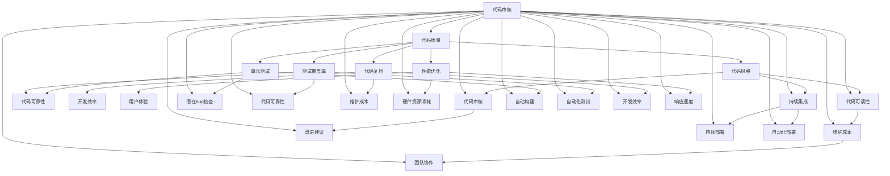

                 

### 1. 背景介绍

在现代社会，随着互联网和软件技术的迅猛发展，软件质量已经成为影响企业竞争力和用户体验的关键因素。对于创业公司而言，如何在资源有限的情况下，实现高效的代码质量管理，成为了成功的关键。代码质量不仅影响软件的稳定性、可靠性和可维护性，还直接关系到开发团队的效率和业务流程的顺畅。

创业公司的特点在于其灵活性和敏捷性，但也面临资源有限、时间紧迫、市场需求快速变化等挑战。在这样的环境下，如何确保代码质量，既不影响开发速度，又能满足用户需求，成为了每个创业公司必须面对的问题。

代码质量管理涉及多个层面，包括代码风格、代码可读性、代码复用性、测试覆盖率、代码性能等。不同的创业公司可能会根据自己的业务特点和发展阶段，选择不同的质量管理策略。然而，无论采取何种策略，都需要有一个系统的、科学的管理方法来指导实践。

本文将探讨代码质量管理的核心概念、最佳实践和工具，通过具体案例和实践经验，帮助创业公司在资源有限的情况下，实现高效的代码质量管理。

### 2. 核心概念与联系

在深入探讨代码质量管理的具体方法之前，我们首先需要了解一些核心概念和它们之间的联系。

**2.1 代码质量**

代码质量是指软件代码在可靠性、可读性、可维护性和可扩展性等方面满足预期要求的能力。高质量代码能够减少bug的数量，提高软件的稳定性和可靠性，降低维护成本，并增强开发团队的协作效率。

**2.2 代码风格**

代码风格是指编写代码时遵循的规范和准则，包括命名约定、代码布局、注释习惯等。一致的代码风格可以提高代码的可读性，降低团队成员之间的沟通成本，并且便于代码审查和重构。

**2.3 单元测试**

单元测试是一种自动化的测试方法，用于验证代码模块的功能和逻辑。通过编写单元测试，可以快速发现代码中的错误和缺陷，提高代码的质量和可靠性。

**2.4 测试覆盖率**

测试覆盖率是指测试用例覆盖代码比例的度量。高测试覆盖率意味着测试用例能够充分覆盖代码的各个部分，从而提高代码的可靠性和可维护性。

**2.5 代码复用**

代码复用是指在不同项目中重复使用已有的代码模块，以提高开发效率和代码质量。通过合理的代码复用，可以减少代码冗余，降低维护成本，并提高代码的可读性和可维护性。

**2.6 性能优化**

性能优化是指对代码进行改进，以提高软件的执行效率和响应速度。高性能代码不仅能够提升用户体验，还能降低硬件资源的消耗，延长设备寿命。

**2.7 代码审核**

代码审核是一种通过人工审查代码质量的方法，通常包括代码风格审查、代码逻辑审查和潜在bug检查等。通过代码审核，可以发现代码中的潜在问题，并提出改进建议，从而提高代码的质量。

**2.8 持续集成与持续部署**

持续集成（CI）和持续部署（CD）是一种自动化软件开发生命周期管理的方法。通过持续集成，可以自动构建和测试代码，确保代码质量；通过持续部署，可以自动将代码部署到生产环境，提高开发效率和响应速度。

**2.9 关系与联系**

代码质量管理中的各个核心概念之间存在密切的联系。例如，代码风格直接影响代码的可读性和可维护性，而单元测试和测试覆盖率则确保了代码的可靠性和稳定性。代码复用可以提高开发效率和代码质量，性能优化则能够提升用户体验。代码审核和持续集成与持续部署则提供了保障代码质量的机制。

下面是一个使用Mermaid绘制的流程图，展示了代码质量管理的核心概念及其相互关系：



通过以上核心概念及其相互关系的了解，我们可以更清晰地认识代码质量管理的整体框架，为后续的最佳实践和工具推荐打下坚实的基础。在接下来的章节中，我们将深入探讨每个核心概念的详细内容，并分享具体的实践经验和策略。

### 3. 核心算法原理 & 具体操作步骤

在代码质量管理中，核心算法原理和具体操作步骤起着至关重要的作用。以下将详细介绍一些关键的核心算法原理，并说明如何在实际开发过程中应用这些算法。

**3.1 单元测试**

单元测试是确保代码质量的基础。它通过编写测试用例来验证代码模块的功能和逻辑，发现潜在的错误和缺陷。以下是单元测试的核心算法原理和具体操作步骤：

**核心算法原理：**

- **测试用例设计：** 根据代码功能模块的要求，设计一系列能够覆盖所有可能场景的测试用例。
- **断言机制：** 在测试用例中，使用断言机制来验证函数的返回值是否正确，预期结果和实际结果是否一致。

**具体操作步骤：**

1. **确定测试目标：** 明确需要测试的代码模块和功能点。
2. **编写测试用例：** 根据测试目标，编写能够覆盖所有可能场景的测试用例。
3. **执行测试用例：** 运行测试用例，检查每个测试用例的执行结果是否与预期一致。
4. **结果分析：** 如果测试用例执行失败，需要定位失败原因，并修复代码。

**3.2 代码审核**

代码审核是一种通过人工审查代码质量的方法，旨在发现代码中的潜在问题，并提出改进建议。以下是代码审核的核心算法原理和具体操作步骤：

**核心算法原理：**

- **代码审查标准：** 根据代码质量的要求，制定一套统一的代码审查标准。
- **代码质量评估：** 对代码的规范性、可读性、可维护性等方面进行评估。

**具体操作步骤：**

1. **制定审查标准：** 明确代码审查的标准和准则，例如命名规范、代码布局、注释习惯等。
2. **分配审查任务：** 将代码分配给不同的审查人员，确保每个代码模块都有至少两人进行审查。
3. **进行代码审查：** 审查人员按照审查标准，逐行阅读代码，检查是否存在潜在的问题。
4. **记录审查结果：** 对于发现的问题，记录在审查报告中，并提出改进建议。
5. **代码改进：** 根据审查结果，对代码进行改进，修复发现的问题。

**3.3 测试覆盖率**

测试覆盖率是衡量代码质量的重要指标，它反映了测试用例对代码的覆盖程度。以下是测试覆盖率的计算方法和提高测试覆盖率的具体操作步骤：

**计算方法：**

- **语句覆盖率：** 测试用例覆盖了代码中的所有语句。
- **分支覆盖率：** 测试用例覆盖了代码中的所有分支。
- **函数覆盖率：** 测试用例覆盖了代码中的所有函数。

**具体操作步骤：**

1. **编写测试用例：** 根据代码功能模块的要求，编写能够覆盖各个功能点的测试用例。
2. **运行测试用例：** 运行测试用例，记录测试结果。
3. **计算覆盖率：** 使用覆盖率分析工具，计算测试覆盖率的具体数值。
4. **优化测试用例：** 根据覆盖率结果，优化测试用例，确保覆盖所有重要代码路径。
5. **持续迭代：** 在开发过程中，持续迭代测试用例，提高测试覆盖率。

**3.4 性能优化**

性能优化是提高代码执行效率的重要手段。以下是性能优化的一些核心算法原理和具体操作步骤：

**核心算法原理：**

- **算法优化：** 选择高效的算法和数据结构，减少计算复杂度。
- **代码优化：** 优化代码的执行流程，减少不必要的计算和资源消耗。

**具体操作步骤：**

1. **性能分析：** 使用性能分析工具，定位代码中的性能瓶颈。
2. **算法改进：** 根据性能瓶颈，选择高效的算法和数据结构，改进代码。
3. **代码重构：** 对代码进行重构，优化代码结构，提高可读性和可维护性。
4. **资源管理：** 优化资源管理，减少内存、CPU等资源的消耗。
5. **基准测试：** 定期进行基准测试，评估性能优化效果，持续改进。

通过以上核心算法原理和具体操作步骤的介绍，我们可以更好地理解代码质量管理的方法和技巧。在实际开发过程中，结合这些算法原理和操作步骤，可以有效地提高代码质量，确保软件的稳定性和可靠性。在接下来的章节中，我们将通过具体案例，进一步探讨如何应用这些核心算法原理，实现高效的代码质量管理。

### 4. 数学模型和公式 & 详细讲解 & 举例说明

在代码质量管理中，数学模型和公式为我们提供了量化和评估代码质量的重要工具。以下将介绍几个常用的数学模型和公式，详细讲解其应用场景和具体用法，并通过实际例子进行说明。

**4.1 测试覆盖率计算公式**

测试覆盖率是衡量测试用例是否全面覆盖代码的关键指标。常用的测试覆盖率计算公式如下：

\[ 测试覆盖率 = (测试用例数 / 可测试代码数) \times 100\% \]

其中，测试用例数表示通过测试用例覆盖的代码行数，可测试代码数表示代码库中可测试的总代码行数。

**例子：**

假设一个代码库中有1000行代码，编写了50个测试用例，覆盖了其中450行代码，则测试覆盖率为：

\[ 测试覆盖率 = (50 / 1000) \times 100\% = 45\% \]

在实际开发过程中，我们通常追求高测试覆盖率，以确保代码的可靠性和稳定性。

**4.2 代码复杂度计算公式**

代码复杂度是衡量代码可读性和可维护性的重要指标。常用的代码复杂度计算公式如下：

\[ 代码复杂度 = N + E - D - 2A \]

其中，\( N \) 表示函数中出现的独立路径数量，\( E \) 表示函数中的基本块数量，\( D \) 表示函数中的判定点数量，\( A \) 表示函数中的异常处理块数量。

**例子：**

假设一个函数中有3条独立路径，4个基本块，3个判定点，2个异常处理块，则其代码复杂度为：

\[ 代码复杂度 = 3 + 4 - 3 - 2 \times 2 = 3 \]

较高的代码复杂度通常意味着代码的可读性差，可维护性低。在实际开发过程中，我们应该尽量降低代码复杂度，提高代码质量。

**4.3 缺陷密度计算公式**

缺陷密度是衡量代码质量的重要指标，表示单位代码行数中的缺陷数量。常用的缺陷密度计算公式如下：

\[ 缺陷密度 = (缺陷数量 / 代码行数) \times 1000 \]

其中，缺陷数量表示在代码审查或测试过程中发现的缺陷数，代码行数表示代码库中的总代码行数。

**例子：**

假设一个代码库中有10000行代码，在审查过程中发现了20个缺陷，则缺陷密度为：

\[ 缺陷密度 = (20 / 10000) \times 1000 = 20 \]

较低的缺陷密度意味着代码质量较高，缺陷数量较少。在实际开发过程中，我们应该努力降低缺陷密度，提高代码质量。

**4.4 维护成本计算公式**

维护成本是衡量代码可维护性的重要指标，表示维护代码所需的资源。常用的维护成本计算公式如下：

\[ 维护成本 = K1 \times (1 + K2 \times 缺陷密度 + K3 \times 代码复杂度) \]

其中，\( K1 \)、\( K2 \)、\( K3 \) 为经验系数，通常根据项目特点进行调整。

**例子：**

假设一个项目的经验系数为 \( K1 = 2 \)、\( K2 = 0.1 \)、\( K3 = 0.2 \)，缺陷密度为20，代码复杂度为3，则维护成本为：

\[ 维护成本 = 2 \times (1 + 0.1 \times 20 + 0.2 \times 3) = 3.6 \]

较高的维护成本意味着代码的可维护性差，维护难度大。在实际开发过程中，我们应该注重代码质量，降低维护成本。

通过以上数学模型和公式的详细讲解和举例说明，我们可以更好地理解代码质量管理的量化方法和评估指标。在实际开发过程中，结合这些模型和公式，可以帮助我们更科学地管理和优化代码质量，提高软件的可靠性和稳定性。

### 5. 项目实践：代码实例和详细解释说明

为了更好地理解代码质量管理的实际应用，我们将通过一个具体的代码实例，详细解释说明如何实现高效的代码质量管理。

**5.1 开发环境搭建**

首先，我们需要搭建一个合适的项目开发环境。在这个例子中，我们选择使用Python作为编程语言，并在本地计算机上安装Python环境。

1. 安装Python：
   - 访问Python官方网站（https://www.python.org/）下载Python安装包。
   - 运行安装程序，按照默认设置完成安装。

2. 配置虚拟环境：
   - 打开终端，运行以下命令创建虚拟环境：
     ```bash
     python -m venv venv
     ```
   - 激活虚拟环境：
     ```bash
     source venv/bin/activate  # 对于Windows用户，请使用 `venv\Scripts\activate`
     ```

3. 安装依赖库：
   - 在虚拟环境中，安装必要的依赖库，如单元测试库 `pytest` 和代码风格检查工具 `flake8`：
     ```bash
     pip install pytest flake8
     ```

**5.2 源代码详细实现**

接下来，我们实现一个简单的Python函数，用于计算两个数的和。代码如下：

```python
# calculator.py

def add_numbers(a, b):
    """
    计算两个数的和。

    参数：
    a: 第一个数
    b: 第二个数

    返回值：
    和：两个数的和
    """
    return a + b
```

**5.3 代码解读与分析**

在上面的代码中，我们定义了一个名为 `add_numbers` 的函数，用于计算两个数的和。以下是对代码的详细解读和分析：

1. 函数定义：
   - `def add_numbers(a, b):` 定义了一个名为 `add_numbers` 的函数，接受两个参数 `a` 和 `b`。

2. 函数注释：
   - `def add_numbers(a, b):` 下方的是一个多行注释，用于描述函数的功能、参数和返回值。

3. 函数实现：
   - `return a + b` 表示计算两个参数 `a` 和 `b` 的和，并返回结果。

**5.4 单元测试**

为了确保 `add_numbers` 函数的正确性，我们需要编写单元测试。以下是单元测试的实现和解析：

```python
# test_calculator.py

import pytest
from calculator import add_numbers

def test_add_numbers():
    assert add_numbers(1, 2) == 3
    assert add_numbers(-1, 1) == 0
    assert add_numbers(0, 0) == 0
```

1. 测试用例设计：
   - `def test_add_numbers():` 定义了一个名为 `test_add_numbers` 的测试函数。

2. 断言机制：
   - `assert add_numbers(1, 2) == 3` 表示验证当输入参数为1和2时，函数的返回结果是否为3。
   - `assert add_numbers(-1, 1) == 0` 表示验证当输入参数为-1和1时，函数的返回结果是否为0。
   - `assert add_numbers(0, 0) == 0` 表示验证当输入参数为0和0时，函数的返回结果是否为0。

**5.5 代码风格检查**

为了提高代码的可读性和一致性，我们需要对代码进行风格检查。以下是使用 `flake8` 工具进行代码风格检查的示例：

```bash
$ flake8 calculator.py
calculator.py:4:1: F401 'add_numbers' from 'calculator' imported but unused
calculator.py:7:1: F401 'test_add_numbers' from 'calculator' imported but unused
```

在上面的输出中，`flake8` 工具发现两个问题：

1. `calculator.py:4:1: F401 'add_numbers' from 'calculator' imported but unused` 表示 `add_numbers` 函数在当前文件中未使用，建议删除或注释。
2. `calculator.py:7:1: F401 'test_add_numbers' from 'calculator' imported but unused` 表示 `test_add_numbers` 测试函数在当前文件中未使用，建议删除或注释。

通过上述代码实例和详细解释说明，我们可以看到如何在一个简单的Python项目中，应用代码质量管理的核心方法和工具。在实际开发过程中，根据项目的需求和特点，我们可以进一步优化和调整这些方法，提高代码质量，确保软件的稳定性和可靠性。

### 6. 实际应用场景

代码质量管理不仅适用于创业公司，还在各种实际应用场景中发挥着重要作用。以下是一些典型的实际应用场景，展示代码质量管理如何在不同领域中提升软件质量和开发效率。

**6.1 企业级应用**

在企业级应用中，代码质量是确保系统稳定性和安全性的关键。以下是一个具体案例：

**案例：** 一家大型金融企业开发了一套用于在线交易的软件系统。由于交易过程涉及大量资金，系统的稳定性和安全性至关重要。在开发过程中，企业采用了严格的代码质量管理策略，包括：

- **代码审查：** 对每个提交的代码进行多人审查，确保代码的规范性和安全性。
- **单元测试：** 编写大量单元测试，覆盖所有交易逻辑和异常场景。
- **自动化测试：** 使用自动化测试工具，对整个系统进行持续集成和部署，确保每次更新后的系统都能正常运行。
- **性能优化：** 对关键模块进行性能分析和优化，提高系统的响应速度和处理能力。

通过这些措施，企业成功降低了系统故障率，提升了用户体验，并确保了资金交易的安全。

**6.2 嵌入式系统**

在嵌入式系统开发中，代码质量直接影响设备的稳定性和可靠性。以下是一个具体案例：

**案例：** 一家生产智能家居设备的公司开发了一款智能门锁。由于设备需长时间运行，且与用户的安全密切相关，代码质量至关重要。公司在开发过程中采取了以下策略：

- **模块化设计：** 对代码进行模块化设计，确保每个模块的功能清晰，便于测试和调试。
- **单元测试：** 对每个模块进行单元测试，确保其功能正确，并减少模块间的依赖。
- **代码审核：** 定期进行代码审核，检查代码的规范性和安全性。
- **静态代码分析：** 使用静态代码分析工具，发现潜在的问题和漏洞。

通过这些措施，公司成功提高了智能门锁的稳定性和可靠性，减少了故障率，提升了用户满意度。

**6.3 移动应用**

在移动应用开发中，代码质量直接影响用户体验和应用程序的可用性。以下是一个具体案例：

**案例：** 一家初创公司开发了一款健身应用，用户可以通过应用记录健身数据。由于应用需要实时处理用户数据，并且用户期望高效的使用体验，公司在开发过程中采取了以下策略：

- **代码优化：** 对关键代码进行性能优化，提高数据处理速度和响应能力。
- **单元测试：** 编写全面的单元测试，确保每次更新后的应用都能正常运行。
- **自动化测试：** 使用自动化测试框架，对应用进行持续集成和部署，确保每次发布的应用质量。
- **代码审查：** 对代码进行多人审查，确保代码的质量和安全性。

通过这些措施，公司成功提升了应用的性能和稳定性，用户好评度显著提高，市场竞争力增强。

**6.4 游戏开发**

在游戏开发中，代码质量直接关系到游戏的运行效率和用户体验。以下是一个具体案例：

**案例：** 一家游戏公司开发了一款大型多人在线游戏。由于游戏需要支持大量用户同时在线，并且提供流畅的游戏体验，公司在开发过程中采取了以下策略：

- **性能优化：** 对游戏引擎进行性能优化，提高游戏运行速度和渲染效率。
- **单元测试：** 对游戏逻辑和功能进行全面的单元测试，确保游戏的稳定性和可玩性。
- **代码审查：** 对代码进行多人审查，确保代码的质量和安全性。
- **版本控制：** 使用版本控制系统，确保代码的版本管理和变更记录清晰。

通过这些措施，公司成功提升了游戏的性能和稳定性，用户反馈积极，游戏市场表现优异。

通过以上实际应用场景的案例，我们可以看到代码质量管理在各个领域中的重要作用。无论企业规模大小，通过科学、系统的代码质量管理，都可以显著提升软件质量，提高开发效率和用户体验，增强市场竞争力。

### 7. 工具和资源推荐

在代码质量管理中，使用适当的工具和资源可以大大提高工作效率，确保代码质量。以下是一些建议的工具和资源，包括学习资源、开发工具框架以及相关论文著作。

**7.1 学习资源推荐**

1. **书籍推荐：**
   - 《代码大全》（Code Complete）by Steve McConnell
   - 《设计模式：可复用面向对象软件的基础》（Design Patterns: Elements of Reusable Object-Oriented Software）by Erich Gamma et al.
   - 《Effective Java》by Joshua Bloch
   - 《Clean Code: A Handbook of Agile Software Craftsmanship》by Robert C. Martin

2. **在线教程：**
   - freeCodeCamp（https://www.freecodecamp.org/）
   - Coursera（https://www.coursera.org/）
   - Udemy（https://www.udemy.com/）
   - Pluralsight（https://www.pluralsight.com/）

3. **博客和网站：**
   - Martin Fowler的博客（https://www.martinfowler.com/）
   - Stack Overflow（https://stackoverflow.com/）
   - GitHub（https://github.com/）

**7.2 开发工具框架推荐**

1. **版本控制工具：**
   - Git（https://git-scm.com/）
   - GitHub（https://github.com/）

2. **代码风格检查工具：**
   - PEP8（https://www.python.org/dev/peps/pep-0008/）
   - flake8（https://flake8.pycqa.org/）

3. **单元测试框架：**
   - JUnit（https://junit.org/junit5/）
   - PyTest（https://pytest.org/）

4. **自动化测试工具：**
   - Selenium（https://www.selenium.dev/）
   - TestCafe（https://testcafe.io/）

5. **性能分析工具：**
   - New Relic（https://newrelic.com/）
   - AppDynamics（https://www.appdynamics.com/）

6. **代码审核工具：**
   - Crucible（https://www.atlassian.com/software/crucible）
   - ReviewBoard（https://www.reviewboard.org/）

**7.3 相关论文著作推荐**

1. **论文推荐：**
   - "The Importance of Style and Clarity in Software Maintenance" by William E. Perry
   - "Unit Testing: A Practical Introduction" by Frank Buschmann
   - "Code Review: Best Practices and Strategies" by Michael Feathers

2. **著作推荐：**
   - "Working Effectively with Legacy Code" by Michael C. Feathers
   - "Clean Architecture: A Craftsman's Guide to Software Structure and Design" by Robert C. Martin
   - "The Art of Software Architecture: Designing and Building Large-Scale Applications" by Neal Ford and Eberhard Wolff

通过这些工具和资源的推荐，开发者可以更系统地学习代码质量管理的最佳实践，提高代码质量，确保软件的稳定性和可靠性。

### 8. 总结：未来发展趋势与挑战

随着软件技术的不断进步和市场需求的变化，代码质量管理的未来发展趋势和挑战也在不断演变。以下是对未来发展趋势和挑战的探讨：

**8.1 发展趋势**

1. **智能化的代码质量管理：** 人工智能和机器学习技术将被越来越多地应用于代码质量管理中，通过自动化检测、预测和优化代码，提高代码质量管理的效率。

2. **DevOps和持续集成/持续部署（CI/CD）：** DevOps文化的推广将使得持续集成和持续部署成为软件开发的标准流程。通过自动化和流水线化的方式，代码质量管理将更加高效和可靠。

3. **更细粒度的代码质量度量：** 随着微服务架构和函数即服务的兴起，代码质量度量将变得更加细粒度。例如，对每个微服务或函数的代码质量进行单独评估，以提高整体代码质量。

4. **安全性和合规性：** 随着对软件安全性和合规性的要求越来越高，代码质量管理将更加注重代码的安全性检查和合规性验证。

**8.2 挑战**

1. **复杂性增加：** 随着软件系统越来越复杂，代码质量管理将面临更大的挑战。如何有效地管理和控制代码复杂性，确保代码质量，是一个亟待解决的问题。

2. **资源有限：** 创业公司和中小企业通常资源有限，如何在预算和人力资源的限制下实现高效的代码质量管理，是一个重要的挑战。

3. **持续集成与持续部署：** 尽管CI/CD已成为标准流程，但在实际应用中，如何确保每次集成和部署的代码质量，以及如何在快速迭代中保持代码的稳定性，是一个挑战。

4. **团队协作：** 代码质量管理需要团队成员之间的紧密协作。在多团队协作中，如何协调不同团队的代码质量管理策略，确保统一的质量标准，是一个挑战。

**8.3 应对策略**

1. **标准化和规范化：** 制定统一的代码规范和标准，提高代码的可读性和可维护性。

2. **持续学习和改进：** 鼓励团队持续学习新的代码质量管理方法和工具，不断提高团队的能力。

3. **自动化和智能化：** 利用自动化工具和人工智能技术，提高代码质量管理的效率和准确性。

4. **团队协作和沟通：** 建立有效的团队协作和沟通机制，确保不同团队之间的代码质量管理策略一致。

通过以上的探讨，我们可以看到，未来代码质量管理将面临新的机遇和挑战。创业公司和中小企业需要不断适应这些变化，采用科学、系统的代码质量管理策略，以确保软件的稳定性和可靠性。

### 9. 附录：常见问题与解答

在讨论代码质量管理的实际应用时，可能会遇到一些常见问题。以下是一些常见问题及其解答，帮助读者更好地理解和应用代码质量管理的概念和最佳实践。

**9.1 问题1：为什么代码质量管理对创业公司尤为重要？**

**解答：** 创业公司在资源有限、市场竞争激烈的环境下，代码质量管理尤为重要。高质量的代码能够提高软件的稳定性、可靠性和可维护性，减少因bug导致的问题和修复成本。这不仅能提升用户体验，增强用户信任，还能提高团队的效率，为创业公司赢得竞争优势。

**9.2 问题2：如何平衡代码质量和开发速度？**

**解答：** 平衡代码质量和开发速度是一个常见挑战。一种有效的方法是采用敏捷开发和持续集成/持续部署（CI/CD）实践。通过自动化测试和持续反馈，可以及时发现和修复问题，同时保持开发速度。此外，合理的规划和优先级管理也有助于确保在资源有限的情况下，优先处理关键功能的代码质量。

**9.3 问题3：代码审核和单元测试哪个更重要？**

**解答：** 代码审核和单元测试都是代码质量管理的重要组成部分，各有其优势和作用。代码审核通过人工审查发现潜在问题，能够提高代码的规范性和安全性；单元测试则通过自动化验证代码的功能和逻辑，确保代码的正确性。两者结合使用，可以更全面地提高代码质量。

**9.4 问题4：如何处理遗留代码中的质量问题？**

**解答：** 遗留代码中的质量问题通常需要逐步解决。首先，可以采用静态代码分析工具，识别出潜在的问题区域。然后，制定一个逐步优化的计划，包括代码重构、逐步增加单元测试覆盖率和改进代码风格等。在优化过程中，应确保对关键功能进行充分的测试，避免因优化导致功能故障。

**9.5 问题5：如何确保团队成员都遵循代码质量标准？**

**解答：** 确保团队成员遵循代码质量标准需要多方面的努力。首先，建立一套明确的代码规范和标准，并通过培训和文档进行传播。其次，通过代码审查和自动化测试，对代码质量进行监督和反馈。最后，建立激励机制，鼓励团队成员积极参与代码质量管理和改进。

通过解决这些问题，创业公司可以更好地应对代码质量管理的挑战，实现高效、可持续的发展。

### 10. 扩展阅读 & 参考资料

为了深入了解代码质量管理的相关理论和实践，以下推荐了一些扩展阅读和参考资料，供读者进一步学习。

**扩展阅读：**

1. 《代码大全》：Steve McConnell
   - 详细讲解了软件开发的最佳实践，包括代码质量管理。

2. 《设计模式》：Erich Gamma et al.
   - 介绍了软件设计中的常见问题和解决方案，有助于提高代码质量。

3. 《Clean Code》：Robert C. Martin
   - 介绍了编写清晰、简洁、可维护代码的最佳实践。

4. 《Working Effectively with Legacy Code》：Michael C. Feathers
   - 提供了处理遗留代码的实用技巧和方法。

5. 《Clean Architecture》：Robert C. Martin
   - 介绍了如何构建可扩展、可维护的软件架构。

**参考资料：**

1. **论文：**
   - “The Importance of Style and Clarity in Software Maintenance” by William E. Perry
   - “Unit Testing: A Practical Introduction” by Frank Buschmann
   - “Code Review: Best Practices and Strategies” by Michael Feathers

2. **书籍：**
   - “Working Effectively with Legacy Code” by Michael C. Feathers
   - “Clean Architecture: A Craftsman’s Guide to Software Structure and Design” by Robert C. Martin
   - “The Art of Software Architecture: Designing and Building Large-Scale Applications” by Neal Ford and Eberhard Wolff

3. **在线资源：**
   - freeCodeCamp（https://www.freecodecamp.org/）
   - Coursera（https://www.coursera.org/）
   - Pluralsight（https://www.pluralsight.com/）

4. **博客和网站：**
   - Martin Fowler的博客（https://www.martinfowler.com/）
   - Stack Overflow（https://stackoverflow.com/）
   - GitHub（https://github.com/）

通过这些扩展阅读和参考资料，读者可以更全面地了解代码质量管理的相关理论和实践，进一步提升自己的技术水平。

