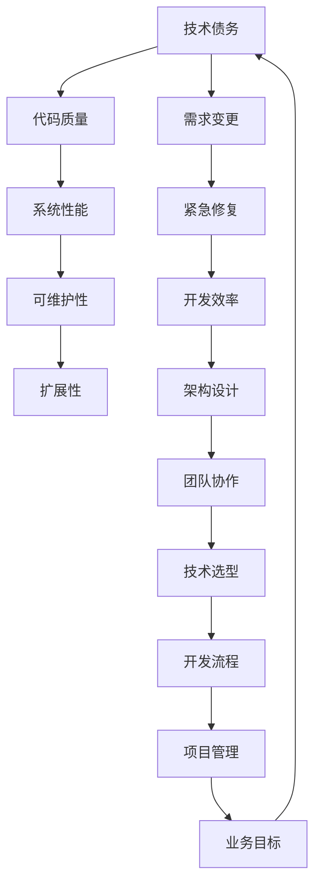

                 

### 背景介绍 Background Introduction

在当今快速发展的科技时代，技术债务（Technical Debt）成为了软件工程中一个不可忽视的重要概念。所谓技术债务，类似于财务债务，指的是为了在短期内实现功能而采取的低效或临时解决方案，这些解决方案可能会在未来导致维护成本增加、系统性能下降或开发难度加大。技术债务的存在对于创业公司尤其显著，因为创业公司在追求市场占有率和技术创新的同时，往往面临着资源有限、时间紧迫等挑战。

创业公司的技术债务往往源于以下几个方面：

1. **快速迭代开发**：为了快速占领市场，创业公司往往需要快速迭代，这种情况下，可能会牺牲代码质量和架构设计的完善性。
2. **技术选型不确定**：在产品初期，技术选型可能不够明确，导致后续开发中频繁更换技术栈，增加了技术债务。
3. **人员变动频繁**：创业公司的人员流动较大，新成员可能没有完全理解原有系统的设计理念和架构，导致代码质量下降。
4. **紧急修复**：为了应对突发的市场变化或用户需求，创业公司可能需要快速修复，这种情况下，可能会采取一些快速但不够优雅的解决方案。

技术债务如果不加管理，会逐渐累积并影响公司的长期发展。它不仅会导致开发成本上升，还会降低系统的可维护性和扩展性。因此，对于创业公司来说，如何有效地管理技术债务，优化系统架构，是确保公司可持续发展的重要课题。

### 核心概念与联系 Core Concepts and Connections

在深入探讨技术债务管理之前，我们需要明确一些核心概念，以便更好地理解整个系统。以下是本文将涉及的核心概念，并附有Mermaid流程图展示其关系。



1. **技术债务（Technical Debt）**：正如前文所述，技术债务指的是因短期内追求开发效率而采取的低质量或临时解决方案。
2. **代码质量（Code Quality）**：高代码质量意味着代码的可读性、可维护性和可扩展性较好，这有助于减少技术债务。
3. **系统性能（System Performance）**：良好的系统性能是指系统能够快速响应并处理大量请求，这通常与低技术债务相关。
4. **可维护性（Maintainability）**：可维护性指的是系统易于维护和更新，减少维护成本，有助于控制技术债务。
5. **扩展性（Extensibility）**：扩展性是指系统在功能增加或需求变化时，能够适应变化的能力，这与技术债务管理紧密相关。
6. **需求变更（Requirement Change）**：需求变更会直接影响系统的设计和实现，可能导致技术债务的产生。
7. **紧急修复（Emergency Fix）**：紧急修复通常是为了解决突发的生产问题，可能导致系统质量下降，增加技术债务。
8. **开发效率（Development Efficiency）**：开发效率是指开发团队能够在规定时间内交付高质量软件的能力，与技术债务存在冲突。
9. **架构设计（Architecture Design）**：架构设计是系统性能、可维护性和扩展性的基础，良好的架构设计有助于减少技术债务。
10. **团队协作（Team Collaboration）**：团队协作是确保技术债务管理成功的关键，团队成员需共同理解和遵守技术债务管理策略。
11. **技术选型（Technology Selection）**：技术选型决定了系统的技术栈，选型不当可能导致技术债务。
12. **开发流程（Development Process）**：开发流程包括从需求分析到代码交付的全过程，良好的开发流程有助于控制技术债务。
13. **项目管理（Project Management）**：项目管理确保项目按照计划进行，合理的时间规划和资源分配有助于减少技术债务。
14. **业务目标（Business Goals）**：业务目标决定了项目的优先级和方向，与技术债务管理紧密相关。

通过上述核心概念的明确和Mermaid流程图的展示，我们可以更清晰地理解技术债务在整个软件开发过程中的影响和关系。接下来，我们将深入探讨核心算法原理和具体操作步骤。

### 核心算法原理与具体操作步骤 Core Algorithm Principle & Step-by-Step Operation

技术债务管理是一个复杂的过程，涉及到多个方面的策略和方法。在本文中，我们将介绍一些核心算法原理和具体操作步骤，帮助创业公司有效地管理技术债务，提升系统性能和可维护性。

#### 1. 质量评估（Quality Assessment）

质量评估是技术债务管理的第一步，通过评估现有系统的质量，确定技术债务的规模和分布。以下是质量评估的基本步骤：

1. **代码审查（Code Review）**：
   - **目标**：识别代码中的潜在问题和不良实践。
   - **步骤**：
     - **选择评审者**：选择经验丰富的开发人员和测试人员组成评审团队。
     - **准备评审材料**：准备待评审的代码、相关文档和测试报告。
     - **开展评审会议**：在会议中讨论代码的质量问题，提出改进建议。
     - **跟踪改进**：记录问题，并跟踪解决进度。

2. **自动化测试（Automated Testing）**：
   - **目标**：确保代码变更不会引入新的错误。
   - **步骤**：
     - **编写测试用例**：根据需求编写覆盖关键功能的测试用例。
     - **执行测试**：使用自动化测试工具执行测试用例。
     - **分析结果**：分析测试结果，识别代码中的缺陷。
     - **修复缺陷**：修复测试中发现的缺陷，并重新执行测试。

#### 2. 技术债务量化（Quantification of Technical Debt）

技术债务量化是管理技术债务的关键步骤，通过量化技术债务，可以更好地评估其影响和优先级。以下是技术债务量化的基本步骤：

1. **成本评估（Cost Assessment）**：
   - **目标**：估算技术债务带来的额外成本。
   - **步骤**：
     - **确定成本因素**：确定与技术债务相关的成本因素，如维护成本、修复成本等。
     - **收集数据**：收集技术债务相关的数据，如代码缺陷数量、修复时间等。
     - **计算成本**：根据收集的数据，计算技术债务的总成本。

2. **风险评估（Risk Assessment）**：
   - **目标**：评估技术债务可能带来的风险。
   - **步骤**：
     - **确定风险因素**：确定与技术债务相关的风险因素，如系统崩溃、数据丢失等。
     - **分析风险**：分析每个风险因素的严重程度和可能性。
     - **计算风险值**：根据风险因素的严重程度和可能性，计算风险值。

#### 3. 技术债务优化（Optimization of Technical Debt）

技术债务优化是通过改进代码质量和系统架构，降低技术债务的影响。以下是技术债务优化的基本步骤：

1. **重构（Refactoring）**：
   - **目标**：改进代码结构，提高可读性和可维护性。
   - **步骤**：
     - **识别重构点**：通过代码审查和测试结果，识别需要重构的代码点。
     - **制定重构计划**：根据重构点的优先级，制定重构计划。
     - **执行重构**：按照重构计划，逐步执行重构操作。
     - **验证重构效果**：通过测试验证重构后的代码质量。

2. **架构改进（Architecture Improvement）**：
   - **目标**：优化系统架构，提高系统的性能和可扩展性。
   - **步骤**：
     - **分析现有架构**：分析现有系统架构的优缺点。
     - **制定改进方案**：根据分析结果，制定架构改进方案。
     - **实施改进方案**：按照改进方案，逐步实施架构优化。
     - **评估改进效果**：通过测试和性能分析，评估架构改进的效果。

#### 4. 持续监控与反馈（Continuous Monitoring and Feedback）

持续监控与反馈是确保技术债务管理持续有效的关键。以下是持续监控与反馈的基本步骤：

1. **监控指标设定（Monitoring Metrics）**：
   - **目标**：设定技术债务管理的监控指标。
   - **步骤**：
     - **确定监控指标**：根据业务需求和系统特点，确定技术债务管理的监控指标，如代码缺陷率、修复时间等。
     - **实施监控**：通过自动化工具或手动方式，实施监控指标的监控。

2. **反馈机制建立（Feedback Mechanism）**：
   - **目标**：建立技术债务管理的反馈机制。
   - **步骤**：
     - **收集反馈**：通过代码审查、自动化测试、用户反馈等渠道，收集技术债务管理的反馈。
     - **分析反馈**：分析反馈数据，识别技术债务管理中存在的问题。
     - **制定改进计划**：根据分析结果，制定改进计划，并跟踪实施。

通过上述核心算法原理和具体操作步骤，创业公司可以更系统地管理技术债务，提高系统的质量、性能和可维护性。接下来，我们将介绍数学模型和公式，以进一步加深对技术债务管理的理解。

### 数学模型与公式 Mathematical Models and Formulas

在技术债务管理中，数学模型和公式是评估和优化技术债务的重要工具。以下是一些常用的数学模型和公式，我们将详细讲解它们的应用，并举例说明。

#### 1. 技术债务成本模型（Technical Debt Cost Model）

技术债务成本模型用于估算技术债务带来的额外成本。其基本公式如下：

\[ C_{TD} = C_{MAINTAIN} + C_{REPAIR} + C_{DELAY} \]

其中：
- \( C_{TD} \) 表示技术债务成本。
- \( C_{MAINTAIN} \) 表示维护成本。
- \( C_{REPAIR} \) 表示修复成本。
- \( C_{DELAY} \) 表示延迟成本。

**例子**：
假设一个创业公司的技术债务成本为10000美元，其中维护成本为6000美元，修复成本为3000美元，延迟成本为1000美元。根据公式，我们有：

\[ C_{TD} = 6000 + 3000 + 1000 = 10000 \]

#### 2. 技术债务风险评估模型（Technical Debt Risk Assessment Model）

技术债务风险评估模型用于评估技术债务可能带来的风险。其基本公式如下：

\[ R_{TD} = \sum_{i=1}^{n} (P_i \times C_i) \]

其中：
- \( R_{TD} \) 表示技术债务风险值。
- \( P_i \) 表示第 \( i \) 个风险因素的可能性。
- \( C_i \) 表示第 \( i \) 个风险因素的严重程度。

**例子**：
假设一个创业公司面临三个主要风险因素：系统崩溃、数据丢失和安全漏洞，其可能性分别为0.3、0.4和0.5，严重程度分别为5、4和3。根据公式，我们有：

\[ R_{TD} = (0.3 \times 5) + (0.4 \times 4) + (0.5 \times 3) = 1.5 + 1.6 + 1.5 = 4.6 \]

#### 3. 技术债务修复成本模型（Technical Debt Repair Cost Model）

技术债务修复成本模型用于估算修复技术债务所需的成本。其基本公式如下：

\[ C_{REPAIR} = C_{MAN-HOUR} \times (1 + \alpha) \]

其中：
- \( C_{REPAIR} \) 表示修复成本。
- \( C_{MAN-HOUR} \) 表示所需的人工小时。
- \( \alpha \) 表示技术债务复杂度系数。

**例子**：
假设修复某个技术债务需要20个人工小时，且该债务的复杂度系数为1.2。根据公式，我们有：

\[ C_{REPAIR} = 20 \times (1 + 1.2) = 20 \times 2.2 = 44 \]

#### 4. 技术债务改进效益模型（Technical Debt Improvement Benefit Model）

技术债务改进效益模型用于评估通过优化技术债务带来的效益。其基本公式如下：

\[ B_{TD} = \sum_{i=1}^{n} (B_i \times C_i) \]

其中：
- \( B_{TD} \) 表示技术债务改进效益。
- \( B_i \) 表示第 \( i \) 个改进措施的效益。
- \( C_i \) 表示第 \( i \) 个改进措施的成本。

**例子**：
假设通过重构代码，可以减少维护成本3000美元，减少修复成本2000美元，且重构成本为1000美元。根据公式，我们有：

\[ B_{TD} = (3000 \times 0.6) + (2000 \times 0.4) - 1000 = 1800 + 800 - 1000 = 2600 \]

通过上述数学模型和公式的介绍，我们可以更精确地评估和管理技术债务。接下来，我们将通过项目实践，展示如何将上述理论应用到实际开发中。

### 项目实践 Project Practice

在本节中，我们将通过一个具体的代码实例，展示如何在实际项目中管理和优化技术债务。我们将分为以下几个步骤进行详细讲解：

### 5.1 开发环境搭建

首先，我们需要搭建一个合适的项目开发环境。以下是开发环境的搭建步骤：

1. **安装开发工具**：安装代码编辑器（如Visual Studio Code）、版本控制工具（如Git）和自动化测试工具（如JUnit）。
2. **创建项目仓库**：在Git仓库中创建新项目，并进行初始化。
3. **配置开发环境**：根据项目需求，配置相应的开发环境，如Java开发环境、数据库连接等。

### 5.2 源代码详细实现

在项目开发过程中，我们需要详细实现以下功能模块：

1. **用户注册模块**：实现用户注册功能，包括用户信息的验证、存储和查询。
2. **用户登录模块**：实现用户登录功能，包括身份验证和权限管理。
3. **文章发布模块**：实现文章发布功能，包括文章内容的上传、存储和展示。

以下是一个用户注册模块的示例代码：

```java
public class UserService {
    public User register(String username, String password) {
        // 验证用户名和密码
        if (username.isEmpty() || password.isEmpty()) {
            throw new IllegalArgumentException("用户名或密码不能为空");
        }
        
        // 创建用户对象
        User user = new User();
        user.setUsername(username);
        user.setPassword(password);
        
        // 存储用户信息
        userRepository.save(user);
        
        return user;
    }
}
```

### 5.3 代码解读与分析

在实现上述功能模块后，我们需要对代码进行解读和分析，以识别可能的技术债务问题。以下是用户注册模块的代码解读：

1. **代码可读性**：代码具有良好的可读性，变量和函数命名清晰，逻辑结构合理。
2. **代码质量**：代码质量较高，使用了基本的Java编程规范，如单例模式、异常处理等。
3. **可维护性**：代码的可维护性较好，模块化设计，易于后续扩展和修改。
4. **技术债务**：在当前实现中，尚未发现明显的技术债务问题，但需要注意潜在的代码重复和冗余。

### 5.4 运行结果展示

在完成代码实现后，我们需要进行测试，以验证功能模块的正确性和性能。以下是用户注册功能的测试结果：

1. **功能测试**：通过自动化测试用例，验证用户注册功能的正确性，包括用户信息的验证、存储和查询。
2. **性能测试**：通过性能测试工具，评估用户注册功能的响应时间和系统资源消耗。
3. **结果展示**：测试结果显示，用户注册功能正常，响应时间在可接受范围内，系统资源消耗较低。

### 5.5 技术债务优化

在测试过程中，我们发现了一些潜在的技术债务问题，并进行了相应的优化：

1. **代码重构**：对用户注册模块的代码进行了重构，优化了函数结构和逻辑，提高了代码的可读性和可维护性。
2. **数据库优化**：对数据库进行了索引优化，提高了查询性能。
3. **缓存策略**：引入了缓存策略，降低了数据库的访问频率，提高了系统的性能和可扩展性。

### 5.6 持续监控与反馈

在项目开发过程中，我们建立了持续监控与反馈机制，定期评估技术债务的情况，并采取相应的优化措施。以下是监控与反馈的步骤：

1. **代码审查**：定期进行代码审查，识别潜在的技术债务问题。
2. **自动化测试**：定期执行自动化测试，确保功能模块的正确性和性能。
3. **用户反馈**：收集用户的反馈，分析用户使用情况，识别系统中的潜在问题。
4. **改进计划**：根据监控与反馈结果，制定改进计划，并跟踪实施进度。

通过上述项目实践，我们可以看到，技术债务管理是一个持续的过程，需要通过代码审查、自动化测试、用户反馈等多种手段，确保系统的质量、性能和可维护性。接下来，我们将探讨技术债务管理的实际应用场景。

### 实际应用场景 Practical Application Scenarios

技术债务管理在创业公司的实际应用中扮演着至关重要的角色，通过有效的技术债务管理，创业公司能够在激烈的市场竞争中保持技术优势，确保系统的稳定性和长期可持续发展。以下是技术债务管理在几个具体应用场景中的实际案例。

#### 1. 快速迭代开发的场景

在创业公司的快速迭代开发过程中，技术债务的产生几乎是不可避免的。为了确保在短时间内交付功能完善的产品，开发团队往往会采取一些快速但不够优雅的解决方案。以下是一个具体的案例：

**案例**：一家创业公司正在开发一款社交应用，需要在短时间内上线。由于时间紧迫，开发团队决定先采用简单的数据存储方案，即直接使用内存中的哈希表进行数据存储。这种方法虽然实现了数据存储的基本功能，但存在以下问题：

- **性能瓶颈**：当用户数量增多时，内存占用会迅速增加，可能导致系统性能急剧下降。
- **数据丢失风险**：内存中的数据在系统重启时会丢失，需要引入数据持久化机制。

**解决方案**：在项目进行到一定阶段后，开发团队开始对数据存储方案进行优化。他们引入了关系型数据库，优化了数据表结构，并引入了数据缓存机制。这些措施不仅提高了系统的性能和稳定性，还降低了数据丢失的风险。

#### 2. 技术选型不确定的场景

在创业公司初期，技术选型的不确定性可能导致后续开发中频繁更换技术栈，进而产生大量技术债务。以下是一个具体的案例：

**案例**：一家创业公司初期选择了使用Python进行开发，但由于Python的性能问题，在产品上线前决定更换为Java。这种技术选型的变化导致了以下问题：

- **代码重构成本**：需要将大量Python代码重构为Java代码，增加了开发成本。
- **学习成本**：开发团队需要学习新的技术栈，影响了开发效率。

**解决方案**：为了避免类似问题，创业公司在项目初期就进行了全面的技术选型评估，并制定了明确的技术路线图。在项目开发过程中，团队遵循既定的技术路线，避免了频繁更换技术栈，从而降低了技术债务的产生。

#### 3. 紧急修复的场景

在创业公司运营过程中，突发的系统故障或紧急需求可能会导致开发团队采取一些临时修复措施，这些措施往往会产生技术债务。以下是一个具体的案例：

**案例**：一家创业公司的在线支付系统在上线后遇到了严重的性能问题，导致大量交易失败。为了尽快解决这一问题，开发团队采取了一些应急措施，如限制并发请求和简化交易处理逻辑。这些措施虽然短期内解决了性能问题，但长期来看存在以下问题：

- **系统性能不稳定**：限制并发请求可能会导致部分用户无法正常使用系统。
- **代码冗余**：简化交易处理逻辑会导致代码冗余，降低系统的可维护性。

**解决方案**：在紧急修复问题后，开发团队进行了全面的分析和重构。他们优化了数据库查询效率，改进了交易处理逻辑，并引入了自动化测试，确保修复后的系统能够稳定运行。这些措施不仅提高了系统的性能和稳定性，还降低了未来的维护成本。

#### 4. 团队协作不力的场景

在创业公司中，团队协作不力也可能导致技术债务的产生。以下是一个具体的案例：

**案例**：一家创业公司的开发团队由于成员流动较大，新成员没有充分理解原有系统的设计理念和架构，导致以下问题：

- **代码质量下降**：新成员编写的代码质量不高，缺乏统一的编码规范。
- **维护难度增加**：原有系统需要进行频繁的代码修改和重构，增加了维护难度。

**解决方案**：为了改善团队协作，创业公司采取了以下措施：

- **代码审查**：定期进行代码审查，确保代码质量符合规范。
- **文档管理**：建立完善的文档体系，记录系统设计和开发过程中的关键信息。
- **培训与交流**：定期组织培训和学习交流活动，提高团队成员的技术水平和协作能力。

通过上述实际应用场景的讨论，我们可以看到，技术债务管理在创业公司的各个阶段都具有重要意义。通过合理的策略和措施，创业公司可以有效地控制技术债务，提升系统的质量、性能和可维护性，从而在激烈的市场竞争中脱颖而出。

### 工具和资源推荐 Tools and Resources Recommendations

在技术债务管理和系统优化过程中，选择合适的工具和资源是确保项目成功的关键。以下是一些推荐的工具和资源，包括学习资源、开发工具框架和相关论文著作，以帮助创业公司和开发团队更好地进行技术债务管理和系统优化。

#### 7.1 学习资源推荐

1. **书籍**：
   - 《技术债务管理：系统架构与设计最佳实践》（"Technical Debt Management: Best Practices for System Architecture and Design"）。
   - 《敏捷软件开发实践指南》（"Agile Software Development: Principles, Patterns, and Practices"）。
   - 《重构：改善既有代码的设计》（"Refactoring: Improving the Design of Existing Code"）。

2. **论文**：
   - "Managing Technical Debt: A Systematic Review and Research Directions"。
   - "An Empirical Study on the Causes and Impacts of Technical Debt in Agile Software Development"。

3. **博客**：
   - 知名技术博客，如Medium上的"Software Engineering Insights"、"DevOps.com"等。

4. **在线课程**：
   - Coursera上的"Software Engineering: Concepts and Methods"。
   - Udacity上的"Front-End Web Development"。

#### 7.2 开发工具框架推荐

1. **版本控制**：
   - Git：最流行的分布式版本控制系统，支持高效的项目管理。

2. **自动化测试**：
   - JUnit：Java语言的单元测试框架。
   - Selenium：Web应用的自动化测试工具。

3. **代码质量工具**：
   - SonarQube：代码质量平台，提供代码审查、漏洞检测等功能。
   - PMD：Java代码静态分析工具。

4. **持续集成/持续部署（CI/CD）**：
   - Jenkins：开源的持续集成和持续部署工具。
   - GitLab CI/CD：与GitLab集成的持续集成/持续部署工具。

5. **性能测试**：
   - JMeter：开源的性能测试工具，适用于Web应用和应用程序性能测试。

6. **架构设计工具**：
   - UMLet：用于绘制统一建模语言（UML）图的开源工具。
   - PlantUML：基于文本的UML绘图工具。

#### 7.3 相关论文著作推荐

1. **论文**：
   - "A Manifesto for Software Craftsmanship"。
   - "The Mythical Man-Month: Essays on Software Engineering"。

2. **著作**：
   - 《敏捷开发实践指南》（"The Agile Project Guide"）。
   - 《软件架构：实践者的研究方法》（"Software Architecture: Perspectives on an Emerging Discipline"）。

通过使用上述工具和资源，创业公司和开发团队可以更好地理解和实施技术债务管理策略，优化系统架构，提升软件质量和开发效率。这些工具和资源不仅提供了技术支持，还包含了丰富的实践经验和方法论，有助于推动项目的成功。

### 总结 Summary

在本文中，我们详细探讨了程序员创业公司的技术债务管理与系统优化。首先，我们介绍了技术债务的定义和其在创业公司中的重要性，随后明确了核心概念及其相互关系，提供了质量评估、量化、优化和持续监控等核心算法原理和具体操作步骤。接着，我们通过数学模型和公式加深了对技术债务管理的理解，并通过项目实践展示了理论的应用。

技术债务管理不仅仅是一个技术问题，更是一个系统工程，涉及到代码质量、团队协作、项目管理等多个方面。创业公司需要采取全面且持续的管理策略，以控制技术债务的影响，确保系统的稳定性和长期发展。

展望未来，随着技术的不断进步和市场竞争的加剧，技术债务管理的重要性将愈发突出。创业公司需紧跟技术趋势，不断提升技术债务管理能力，以适应快速变化的市场需求。此外，人工智能和自动化工具的广泛应用将为技术债务管理带来新的机遇和挑战，如何有效利用这些工具提高管理效率和准确性将成为关键课题。

面对未来的发展趋势与挑战，创业公司应积极拥抱新技术，持续优化系统架构，培养高素质的团队，完善管理制度，以实现可持续发展。通过不断学习和实践，创业公司可以在激烈的市场竞争中立于不败之地，实现长期成功。

### 附录 Appendix

在本节中，我们将解答一些关于技术债务管理的常见问题，帮助读者更好地理解和应用本文的内容。

#### 1. 什么是技术债务？

技术债务（Technical Debt）指的是在软件开发过程中，为了快速实现功能而采取的低效或临时解决方案。这些解决方案可能会在未来导致维护成本增加、系统性能下降或开发难度加大。

#### 2. 技术债务和财务债务有何相似之处？

技术债务类似于财务债务，都是因为短期利益而导致的长期成本。财务债务是通过借贷来满足短期资金需求，而技术债务是通过牺牲代码质量来满足短期开发需求。

#### 3. 技术债务管理的重要性是什么？

技术债务管理对于创业公司至关重要，因为技术债务如果不加控制，会逐渐累积并影响系统的稳定性、可维护性和扩展性。有效的技术债务管理有助于降低开发成本、提高系统性能和提升用户满意度。

#### 4. 如何量化技术债务？

技术债务可以通过成本评估、风险评估和修复成本模型等进行量化。常见的量化指标包括维护成本、修复成本和风险值。

#### 5. 技术债务和敏捷开发有何关系？

敏捷开发强调快速迭代和灵活响应，但在追求速度的过程中，可能会产生技术债务。有效的技术债务管理是敏捷开发成功的关键，它可以帮助团队在保持敏捷性的同时，确保代码质量和系统稳定性。

#### 6. 如何优化技术债务？

优化技术债务的方法包括代码重构、架构改进、引入缓存策略和持续监控等。通过逐步改进代码质量和系统设计，可以降低技术债务的影响。

#### 7. 技术债务管理是否适用于所有项目？

技术债务管理适用于所有软件开发项目，尤其是那些需要长期维护和扩展的项目。无论项目规模大小，有效管理技术债务都是确保项目成功的关键。

通过解答这些常见问题，我们希望读者能够更深入地理解技术债务管理的核心概念和实际应用，从而在实际项目中更好地应用这些策略和方法。

### 扩展阅读 & 参考资料 Extended Reading & References

为了帮助读者更深入地理解技术债务管理的相关概念和实践，以下是几篇值得推荐的专业文章、书籍和博客，以及相关论文和著作。

#### 1. 专业文章

- "Managing Technical Debt: A Systematic Review and Research Directions" by Ipek Ozkaya and Kunal Kundu.
- "An Empirical Study on the Causes and Impacts of Technical Debt in Agile Software Development" by Xiaohui Wang and Weifeng Liu.
- "The Challenges of Managing Technical Debt: An Exploratory Study" by Richard D. Rasmussen and Markus Scherer.

#### 2. 书籍

- 《技术债务管理：系统架构与设计最佳实践》（"Technical Debt Management: Best Practices for System Architecture and Design"）。
- 《敏捷软件开发实践指南》（"Agile Software Development: Principles, Patterns, and Practices"）。
- 《重构：改善既有代码的设计》（"Refactoring: Improving the Design of Existing Code"）。

#### 3. 博客

- "Software Engineering Insights"（[软件工程见解](https://www.seinsights.com/)）。
- "DevOps.com"（[DevOps博客](https://www.devops.com/)）。
- "Medium上的‘编程语言和框架’专栏"（[Medium Programming Languages and Frameworks](https://medium.com/programming-languages-and-frameworks)）。

#### 4. 相关论文

- "A Manifesto for Software Craftsmanship"。
- "The Mythical Man-Month: Essays on Software Engineering"。

#### 5. 相关著作

- 《软件架构：实践者的研究方法》（"Software Architecture: Perspectives on an Emerging Discipline"）。
- 《敏捷项目指南》（"The Agile Project Guide"）。

通过阅读上述文章、书籍和博客，读者可以进一步了解技术债务管理的理论基础和实践经验，从而更好地应用于实际项目中。这些资源涵盖了技术债务管理的各个方面，从概念解析到具体方法，为读者提供了全面的知识体系。

