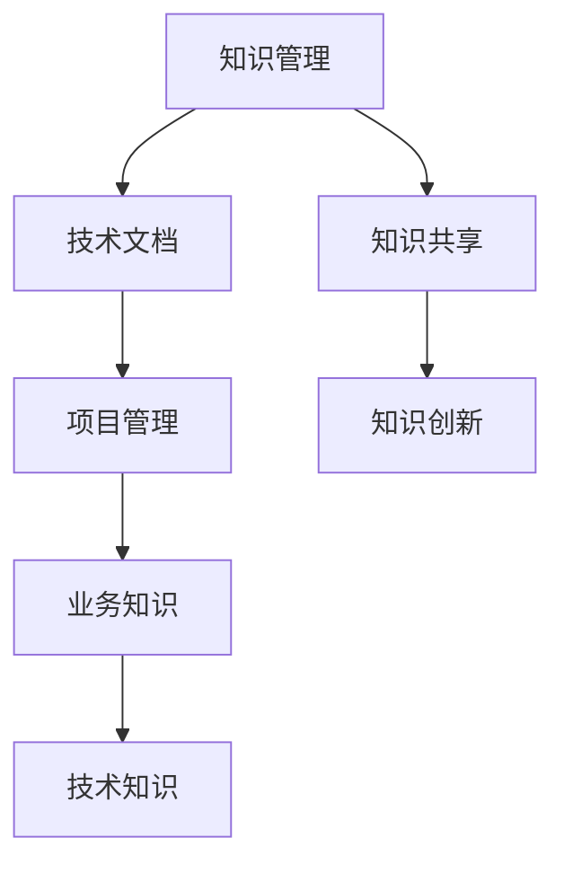
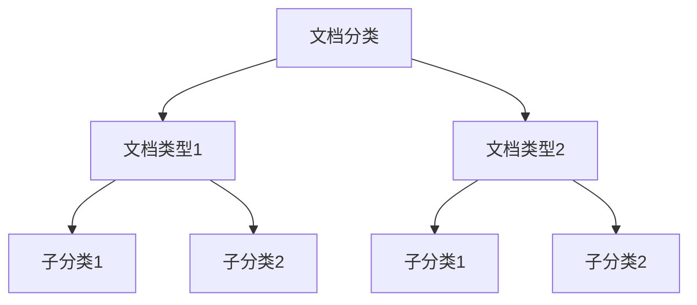

                 

### 1. 背景介绍

在当今快速发展的IT行业，知识管理与技术文档体系对于程序员创业公司的重要性日益凸显。随着项目复杂度的不断提升和团队成员的多样性，有效的知识管理和技术文档不仅有助于提升团队协作效率，还能保证项目质量和稳定性。然而，许多初创公司在这一领域面临着诸多挑战，如信息孤岛、文档过时、版本控制困难等。

本文将深入探讨程序员创业公司的知识管理与技术文档体系，从背景、核心概念、算法原理、数学模型、项目实践、应用场景、工具推荐、未来发展趋势与挑战等多个方面，系统地阐述如何构建一个高效的知识管理与技术文档体系。

### 2. 核心概念与联系

在深入探讨知识管理与技术文档体系之前，我们首先需要明确一些核心概念和它们之间的联系。

#### 2.1 知识管理与技术文档

**知识管理**（Knowledge Management，KM）是一种通过收集、组织、分享和利用知识，以提高组织运作效率的方法。在程序员创业公司中，知识管理涵盖了从技术知识、业务知识到项目管理知识等多个方面。

**技术文档**（Technical Documentation）则是对项目中的技术细节、设计思路、开发过程等进行详细记录的文档。技术文档是知识管理的重要组成部分，它为团队成员提供了清晰的技术指导和参考。

#### 2.2 知识管理与技术文档的关系

知识管理与技术文档相辅相成。知识管理为技术文档提供了丰富的知识来源，而技术文档则通过系统化的记录，将知识转化为可复用的资源，为团队的知识共享和创新提供了基础。

#### 2.3 关键概念图

为了更直观地理解这些概念之间的关系，我们可以使用Mermaid流程图进行描述。以下是一个简化的知识管理与技术文档体系的关键概念图：



在这个图中，知识管理（A）是核心，它通过知识共享（F）和知识创新（G）来推动技术文档（B）和项目管理（C）以及业务知识（D）和技术知识（E）的发展。

### 3. 核心算法原理 & 具体操作步骤

构建高效的知识管理与技术文档体系，需要依赖一系列核心算法和操作步骤。以下将介绍其中几个关键步骤：

#### 3.1 文档分类与标签

**文档分类与标签**是一种基于内容理解的文档管理方法。通过给文档分类并添加标签，可以帮助团队成员快速定位所需信息。具体操作步骤如下：

1. **建立分类体系**：根据项目的特点，建立一套文档分类体系，如按模块、功能、层次等分类。
2. **添加标签**：为每个文档添加相关的标签，便于后续检索。
3. **动态调整**：根据实际需求，定期对分类和标签进行调整，以确保其有效性。

#### 3.2 版本控制

**版本控制**是确保文档一致性和可追溯性的关键。常用的版本控制工具有Git、SVN等。以下是版本控制的基本步骤：

1. **初始化仓库**：创建一个新的版本库，将项目文档进行初始化。
2. **提交文档**：团队成员将各自的文档更新提交到版本库中。
3. **合并代码**：当多个团队成员对同一文档进行修改时，需要进行合并，确保文档的一致性。
4. **备份和恢复**：定期备份版本库，防止数据丢失。

#### 3.3 文档自动化生成

**文档自动化生成**可以大大提高文档更新和维护的效率。以下是一种基于模板的文档自动化生成方法：

1. **编写模板**：根据项目需求，编写HTML、Markdown等模板。
2. **数据提取**：从版本库中提取相关数据，如代码片段、配置文件等。
3. **模板填充**：将提取的数据填充到模板中，生成完整的文档。
4. **自动化部署**：将生成的文档发布到指定的服务器或知识库中。

#### 3.4 知识共享平台

**知识共享平台**是知识管理与技术文档体系的重要组成部分。以下是构建知识共享平台的基本步骤：

1. **需求分析**：明确平台的功能需求，如文档检索、评论、分享等。
2. **技术选型**：选择合适的开发框架和工具，如Django、React等。
3. **平台搭建**：根据需求和技术选型，搭建知识共享平台。
4. **功能完善**：不断优化平台功能，提高用户体验。

### 4. 数学模型和公式 & 详细讲解 & 举例说明

构建知识管理与技术文档体系，涉及到许多数学模型和公式。以下将介绍其中几个关键模型和公式，并详细讲解其应用和举例说明。

#### 4.1 概率模型

**概率模型**在知识管理与技术文档体系中的应用十分广泛，如文档相似度计算、错误检测等。以下是概率模型的基本公式和示例。

**公式**：  
\[ P(A|B) = \frac{P(A \cap B)}{P(B)} \]

**示例**：假设我们有一个文档库，其中包含100篇文档，我们需要计算文档A与文档库的相似度。我们可以通过计算文档A与每篇文档的交集概率，来衡量它们之间的相似度。

\[ P(A|D_1) = \frac{P(A \cap D_1)}{P(D_1)} \]

其中，\( P(A \cap D_1) \)表示文档A与文档\( D_1 \)的交集概率，\( P(D_1) \)表示文档\( D_1 \)的概率。

#### 4.2 决策树模型

**决策树模型**常用于知识管理与技术文档体系中的分类任务。以下是一个简单的决策树模型示例。



**示例**：假设我们需要对文档进行分类，分为技术文档、业务文档等类型。我们可以使用决策树模型来构建分类器，根据文档的属性进行分类。

#### 4.3 矩阵分解

**矩阵分解**（Matrix Factorization）是一种常用的数据挖掘方法，常用于知识管理与技术文档体系中的文档推荐。以下是一个简单的矩阵分解公式。

**公式**：  
\[ X = AB^T \]

**示例**：假设我们有100篇文档和10个用户，每个用户对每篇文档有一个评分，我们可以使用矩阵分解来挖掘用户和文档之间的潜在关系。

\[ X = AB^T \]

其中，\( A \)是用户矩阵，\( B \)是文档矩阵，\( X \)是评分矩阵。

### 5. 项目实践：代码实例和详细解释说明

#### 5.1 开发环境搭建

在构建知识管理与技术文档体系时，选择合适的开发环境至关重要。以下是一个基于Python和Django的简单知识共享平台的开发环境搭建步骤：

1. 安装Python：下载并安装Python 3.x版本。
2. 安装Django：通过pip安装Django框架。
3. 创建项目：在命令行中执行`django-admin startproject knowledge_share`创建项目。
4. 创建应用：在项目中创建一个名为`docs`的应用。

#### 5.2 源代码详细实现

以下是一个简单的知识共享平台源代码实现，包括模型、视图、模板等部分。

**models.py**：

```python
from django.db import models

class Document(models.Model):
    title = models.CharField(max_length=255)
    content = models.TextField()
    created_at = models.DateTimeField(auto_now_add=True)
    updated_at = models.DateTimeField(auto_now=True)
```

**views.py**：

```python
from django.shortcuts import render
from .models import Document

def document_list(request):
    documents = Document.objects.all()
    return render(request, 'document_list.html', {'documents': documents})

def document_detail(request, document_id):
    document = Document.objects.get(id=document_id)
    return render(request, 'document_detail.html', {'document': document})
```

**templates/document_list.html**：

```html
<!DOCTYPE html>
<html>
<head>
    <title>文档列表</title>
</head>
<body>
    <h1>文档列表</h1>
    <ul>
        
            <li><a href="">{{ document.title }}</a></li>
        
    </ul>
</body>
</html>
```

**templates/document_detail.html**：

```html
<!DOCTYPE html>
<html>
<head>
    <title>{{ document.title }}</title>
</head>
<body>
    <h1>{{ document.title }}</h1>
    <p>{{ document.content }}</p>
</body>
</html>
```

#### 5.3 代码解读与分析

以上代码实现了一个简单的知识共享平台，主要包括以下功能：

- **文档列表**：展示所有文档的标题和链接。
- **文档详情**：展示指定文档的标题和内容。

代码分析如下：

- **models.py**：定义了`Document`模型，包含文档的标题、内容、创建时间和更新时间等字段。
- **views.py**：定义了`document_list`和`document_detail`两个视图函数，分别处理文档列表和文档详情的请求。
- **templates/**：定义了文档列表和文档详情的模板文件，用于渲染页面。

#### 5.4 运行结果展示

1. **启动项目**：在命令行中执行`python manage.py runserver`启动项目。
2. **访问文档列表**：在浏览器中输入`http://127.0.0.1:8000/docs/`访问文档列表页面。
3. **访问文档详情**：在文档列表页面中，点击某个文档的标题，访问文档详情页面。

### 6. 实际应用场景

知识管理与技术文档体系在程序员创业公司中有着广泛的应用场景，以下列举几个典型的实际应用案例：

#### 6.1 项目开发

在项目开发过程中，知识管理与技术文档体系可以帮助团队快速了解项目背景、需求、设计思路等，提高开发效率。

- **文档分类与标签**：将项目文档分类并添加标签，便于团队成员快速检索。
- **版本控制**：确保项目文档的一致性和可追溯性。
- **自动化生成**：根据项目需求，自动化生成技术文档。

#### 6.2 团队协作

在团队协作中，知识管理与技术文档体系有助于团队成员之间的知识共享和协作。

- **知识共享平台**：搭建一个知识共享平台，实现文档的集中管理和协作。
- **实时沟通**：通过平台进行实时沟通和讨论，提高团队协作效率。

#### 6.3 人才培养

在人才培养过程中，知识管理与技术文档体系可以帮助新员工快速了解公司业务和技术，提升个人技能。

- **文档分享**：将优秀的技术文档分享给新员工，帮助他们快速成长。
- **在线培训**：通过在线培训课程，提升团队成员的专业素养。

### 7. 工具和资源推荐

构建高效的知识管理与技术文档体系，需要依赖一系列工具和资源。以下推荐一些实用的工具和资源：

#### 7.1 学习资源推荐

- **书籍**：《敏捷开发实践指南》、《代码大全》等。
- **论文**：相关领域的学术论文，如《知识管理与技术文档体系构建方法研究》等。
- **博客**：知名博客和技术社区，如CSDN、GitHub等。
- **网站**：相关领域的官方网站，如Django、Python等。

#### 7.2 开发工具框架推荐

- **版本控制**：Git、SVN等。
- **文档自动化生成**：Sphinx、Doxygen等。
- **知识共享平台**：Django、React等。

#### 7.3 相关论文著作推荐

- **论文**：《知识管理及其在软件开发中的应用研究》等。
- **著作**：《程序员创业指南》等。

### 8. 总结：未来发展趋势与挑战

随着技术的不断进步和团队协作需求的日益增长，知识管理与技术文档体系在程序员创业公司中的重要性将愈发凸显。未来，知识管理与技术文档体系的发展趋势将呈现以下特点：

1. **智能化**：利用人工智能技术，实现知识管理与技术文档的自动化生成和智能化推荐。
2. **平台化**：构建统一的知识共享平台，实现文档的集中管理和协作。
3. **个性化**：根据团队成员的技能水平和需求，提供个性化的知识共享和培训服务。

然而，在知识管理与技术文档体系的发展过程中，也将面临以下挑战：

1. **数据安全**：确保知识管理与技术文档体系中的数据安全，防止数据泄露和滥用。
2. **持续更新**：随着项目的发展，知识管理与技术文档需要不断更新，保持其时效性和准确性。
3. **团队协作**：提升团队成员之间的协作效率，确保知识管理与技术文档体系的有效应用。

### 9. 附录：常见问题与解答

**Q1**：如何确保知识管理与技术文档的一致性和准确性？

**A1**：确保知识管理与技术文档的一致性和准确性，可以从以下几个方面入手：

- **版本控制**：使用版本控制工具，如Git，确保文档的版本一致。
- **审核机制**：建立文档审核机制，确保文档的准确性和完整性。
- **定期更新**：定期对知识管理与技术文档进行更新，确保其时效性。

**Q2**：知识管理与技术文档体系是否适用于小型团队？

**A2**：知识管理与技术文档体系同样适用于小型团队。对于小型团队，知识管理与技术文档体系可以简化为以下几个关键步骤：

- **文档分类**：对文档进行简单的分类，便于团队成员查找。
- **共享平台**：搭建一个简单的共享平台，实现文档的集中管理。
- **文档备份**：定期备份文档，防止数据丢失。

**Q3**：如何提高团队成员对知识管理与技术文档的参与度？

**A3**：提高团队成员对知识管理与技术文档的参与度，可以从以下几个方面入手：

- **激励机制**：为积极参与知识管理与技术文档的团队成员提供奖励。
- **培训与指导**：定期开展知识管理与技术文档培训，提高团队成员的技能水平。
- **团队文化**：营造积极的知识共享文化，鼓励团队成员主动参与知识管理与技术文档工作。

### 10. 扩展阅读 & 参考资料

- **书籍**：《敏捷开发实践指南》、《代码大全》。
- **论文**：《知识管理及其在软件开发中的应用研究》、《知识管理与技术文档体系构建方法研究》。
- **网站**：CSDN、GitHub、Django官方文档、Python官方文档。

### 结束语

知识管理与技术文档体系是程序员创业公司成功的关键因素之一。通过构建高效的知识管理与技术文档体系，团队能够更好地协作、提高开发效率，并确保项目的质量和稳定性。希望本文能为您提供有益的启示和指导，助力您的创业公司实现长远发展。

#### 作者：禅与计算机程序设计艺术 / Zen and the Art of Computer Programming

