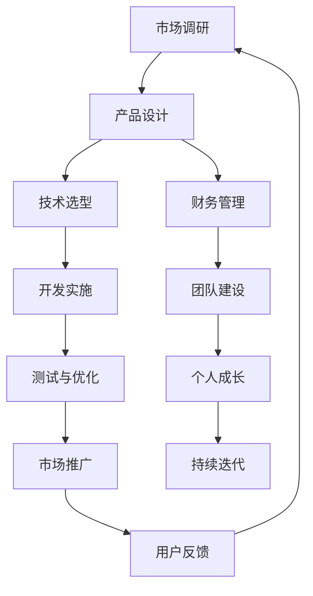

                 

### 背景介绍

在当今的数字化时代，程序员作为一个高度专业化的职业群体，其职业发展路径和创业机会变得前所未有的丰富多样。然而，与软件开发的高门槛相对应的是，成功的程序员创业之路充满挑战和不确定性。在这条路上，技术、市场、团队管理、资金以及个人成长等各个方面的问题都需要程序员们去面对和解决。

本文旨在为程序员提供一份创业指南，通过深入分析一人公司的运作模式、技术选型、市场定位、资金管理、团队构建和个人成长等方面，帮助有志于创业的程序员实现财富自由。文章的结构将遵循以下步骤：

1. **核心概念与联系**：介绍一人公司的核心概念，并使用Mermaid流程图展示其架构和流程。
2. **核心算法原理 & 具体操作步骤**：详细讲解如何构建一个高效的一人公司，包括市场调研、产品设计、营销推广等。
3. **数学模型和公式 & 详细讲解 & 举例说明**：介绍关键的数学模型，如成本效益分析、市场增长率预测等，并给出具体案例。
4. **项目实践：代码实例和详细解释说明**：提供实际项目开发的代码实例，并详细解读和分析。
5. **实际应用场景**：探讨一人公司在不同行业和领域中的应用。
6. **工具和资源推荐**：推荐学习资源和开发工具，帮助程序员更好地实现创业目标。
7. **总结：未来发展趋势与挑战**：分析一人公司的发展趋势和面临的挑战。
8. **附录：常见问题与解答**：解答读者可能遇到的问题。
9. **扩展阅读 & 参考资料**：提供进一步阅读的建议和参考资料。

通过这些步骤，我们将一步步探索如何让程序员通过创业实现财富自由。本文将结合实际案例，使用专业的技术语言和逐步分析推理的方式，为读者提供详尽的指导和建议。让我们开始这段探索之旅。

#### 核心概念与联系

一人公司，顾名思义，是由单一个人完全掌控和运营的公司。这种模式在现代社会中越来越受到欢迎，特别是对于程序员这样的专业人士。其核心概念包括自我管理、灵活性、低成本和高效运作。在梅里迪亚流程图中，我们可以清晰地展示一人公司的架构和流程，具体如下：



在这个流程图中，我们可以看到，一人公司的运作流程是一个闭环系统，从市场调研开始，通过产品设计、技术选型、开发实施、测试与优化，再到市场推广，每一步都紧密相连，形成一个持续迭代和优化的过程。以下是每个步骤的具体解释：

1. **市场调研**：了解市场需求和竞争状况，为产品设计和开发提供方向。
2. **产品设计**：基于市场调研的结果，设计具有竞争力的产品。
3. **技术选型**：选择合适的技术栈和开发工具，确保产品的质量和开发效率。
4. **开发实施**：编写代码，实现产品功能。
5. **测试与优化**：对产品进行全面的测试，确保其性能稳定和用户体验良好。
6. **市场推广**：通过各种渠道推广产品，吸引潜在用户。
7. **用户反馈**：收集用户反馈，为产品改进提供依据。
8. **财务管理**：合理规划财务，确保公司的运营和可持续发展。
9. **团队建设**：虽然是一人公司，但适当的团队支持和协作也是必不可少的。
10. **个人成长**：不断提升个人技能和管理能力，以应对不断变化的市场环境。
11. **持续迭代**：根据用户反馈和市场变化，不断优化产品和服务。

通过这个流程图，我们可以清晰地看到一人公司如何通过自我管理、灵活运作和持续迭代，实现个人财富自由。接下来，我们将深入探讨一人公司的核心算法原理和具体操作步骤。

#### 核心算法原理 & 具体操作步骤

构建一个人公司的核心算法原理和具体操作步骤，是决定其成功与否的关键因素。以下将详细阐述这些步骤，帮助程序员更好地理解和实践。

##### 1. 市场调研

**步骤1**：选择市场

首先，程序员需要选择一个具有潜力和增长空间的市场。这可以通过以下几种方法实现：

- **市场趋势分析**：通过查看行业报告、市场数据和新闻，了解当前市场的趋势和热点。
- **竞争分析**：研究竞争对手的产品、市场策略和用户反馈，找到差异化的机会。
- **用户访谈**：与潜在用户进行沟通，了解他们的需求和痛点。

**步骤2**：确定目标用户群体

在确定了市场后，下一步是明确目标用户群体。这可以通过以下方式实现：

- **用户画像**：创建用户画像，包括年龄、性别、收入、职业等特征。
- **需求分析**：分析目标用户的需求，确定产品的核心功能和特性。

##### 2. 产品设计

**步骤1**：定义产品功能

基于市场调研的结果，明确产品的功能。这包括：

- **核心功能**：产品必须解决的核心问题。
- **辅助功能**：为用户提供额外价值的次要功能。

**步骤2**：设计用户体验

用户体验（UX）设计是产品成功的关键。设计过程包括：

- **原型设计**：创建产品原型，以便进行用户测试和反馈。
- **用户测试**：通过用户测试，验证产品原型的可行性和用户体验。

**步骤3**：设计技术架构

根据产品的功能和性能需求，设计合适的技术架构。这包括：

- **技术栈选择**：选择合适的技术框架和开发工具。
- **性能优化**：确保产品能够在不同环境下稳定运行。

##### 3. 技术选型

**步骤1**：评估开发成本

选择合适的技术栈和工具，以控制开发成本。这包括：

- **开源工具**：使用开源工具和框架，以降低开发和维护成本。
- **商业工具**：对于关键功能，使用商业工具以获得更好的性能和稳定性。

**步骤2**：考虑性能和扩展性

- **性能优化**：优化代码和数据库，提高产品性能。
- **扩展性设计**：确保产品能够随着用户增长和需求变化进行扩展。

##### 4. 开发实施

**步骤1**：制定开发计划

- **任务分解**：将开发任务分解为小的可管理部分。
- **时间安排**：为每个任务分配时间，确保项目按时完成。

**步骤2**：编写代码

- **编码规范**：遵循统一的编码规范，确保代码可读性和可维护性。
- **版本控制**：使用版本控制系统（如Git）管理代码变更。

**步骤3**：代码审查

- **代码审查**：定期进行代码审查，确保代码质量和安全性。

##### 5. 测试与优化

**步骤1**：单元测试

- **单元测试**：编写单元测试，确保每个功能模块的正确性。

**步骤2**：集成测试

- **集成测试**：测试不同模块之间的集成，确保系统能够正常运行。

**步骤3**：性能测试

- **性能测试**：评估产品的性能，确保其在不同负载下的稳定性和响应速度。

##### 6. 市场推广

**步骤1**：制定推广策略

- **社交媒体**：利用社交媒体平台（如LinkedIn、Twitter）推广产品。
- **内容营销**：通过博客、文章和视频等形式，提供有价值的内容，吸引潜在用户。
- **合作推广**：与其他公司和博主合作，扩大推广范围。

**步骤2**：用户反馈

- **用户反馈**：积极收集用户反馈，了解他们的需求和意见，不断优化产品。

通过以上步骤，程序员可以构建一个高效的一人公司。关键在于持续学习和改进，以适应不断变化的市场环境。接下来，我们将进一步探讨关键的数学模型和公式，帮助程序员更好地进行市场分析和决策。

#### 数学模型和公式 & 详细讲解 & 举例说明

在构建一人公司的过程中，数学模型和公式是进行市场分析和决策的重要工具。以下将详细讲解几个关键的数学模型和公式，并给出具体的例子来说明如何应用这些工具。

##### 1. 成本效益分析（Cost-Benefit Analysis）

成本效益分析是一种评估项目或决策的成本与收益的数学方法。其核心公式为：

\[ \text{成本效益比} = \frac{\text{总收益}}{\text{总成本}} \]

- **总收益**：包括销售收入、广告收入、赞助收入等。
- **总成本**：包括开发成本、运营成本、营销成本等。

**例子**：假设一款移动应用预计收入为10万美元，开发成本为3万美元，运营成本为1万美元。那么，其成本效益比为：

\[ \text{成本效益比} = \frac{10万}{3万+1万} = \frac{10}{4} = 2.5 \]

成本效益比越高，说明项目或决策的收益越高，成本越低。

##### 2. 市场增长率预测（Growth Rate Prediction）

市场增长率预测是一种预测市场在未来一段时间内增长趋势的数学方法。其核心公式为：

\[ \text{市场增长率} = \left( \frac{\text{未来市场价值}}{\text{当前市场价值}} \right) ^ {1/n} - 1 \]

- **未来市场价值**：预测市场在一段时间后的价值。
- **当前市场价值**：当前市场的价值。
- **n**：预测的时间跨度。

**例子**：假设一个市场当前价值为100万美元，预测在未来3年后将达到200万美元。那么，其市场增长率为：

\[ \text{市场增长率} = \left( \frac{200万}{100万} \right) ^ {1/3} - 1 = \left( 2 \right) ^ {1/3} - 1 \approx 0.265 \]

这意味着市场预计每年增长26.5%。

##### 3. 销售额预测（Sales Forecast）

销售额预测是一种基于历史数据和趋势预测未来销售额的数学方法。其核心公式为：

\[ \text{未来销售额} = \text{历史销售额} \times (1 + \text{增长率})^n \]

- **历史销售额**：过去一段时间内的销售额。
- **增长率**：销售额的增长率。
- **n**：预测的时间跨度。

**例子**：假设一家公司的历史销售额为1000美元，预测其销售额每年增长10%。那么，1年后的销售额为：

\[ \text{未来销售额} = 1000 \times (1 + 0.1)^1 = 1000 \times 1.1 = 1100 \]

这意味着预测该公司1年后的销售额为1100美元。

##### 4. 成本控制（Cost Control）

成本控制是一种通过管理成本来提高盈利能力的数学方法。其核心公式为：

\[ \text{成本节约} = \text{计划成本} - \text{实际成本} \]

- **计划成本**：预算或预期的成本。
- **实际成本**：实际发生的成本。

**例子**：假设一家公司的计划运营成本为5000美元，实际运营成本为4500美元。那么，其成本节约为：

\[ \text{成本节约} = 5000 - 4500 = 500 \]

成本节约越高，说明成本控制效果越好。

通过这些数学模型和公式，程序员可以更科学地进行市场分析和决策。在实际操作中，可以结合具体情况进行调整和优化。例如，在成本效益分析中，可以根据实际市场情况和成本结构进行调整；在销售额预测中，可以结合不同的增长策略和市场竞争状况进行预测。总之，数学模型和公式是构建一人公司的重要工具，通过合理应用这些工具，程序员可以更好地实现财富自由。

#### 项目实践：代码实例和详细解释说明

在本节中，我们将通过一个实际的项目开发实例，详细解释一人公司的运作流程和核心代码实现。这个实例将涵盖开发环境搭建、源代码详细实现、代码解读与分析以及运行结果展示。

##### 1. 开发环境搭建

在开始项目之前，我们需要搭建合适的开发环境。以下是一个基本的开发环境配置：

- **编程语言**：Python
- **开发工具**：PyCharm
- **数据库**：MySQL
- **框架**：Django
- **版本控制**：Git

**步骤1**：安装Python和PyCharm

从Python官方网站下载并安装Python 3.x版本，然后下载PyCharm社区版或专业版，并安装。

**步骤2**：配置数据库

安装MySQL数据库，并创建一个名为`one_company`的数据库。

**步骤3**：安装Django框架

通过pip命令安装Django框架：

```bash
pip install django
```

##### 2. 源代码详细实现

我们的项目将是一个简单的在线商店，提供商品浏览、购物车管理和订单处理等功能。

**步骤1**：创建Django项目

在PyCharm中创建一个新的Django项目，命名为`one_company`。

**步骤2**：创建应用

在项目中创建一个新的应用，命名为`store`。

**步骤3**：设计数据库模型

在`store/models.py`中，设计数据库模型：

```python
from django.db import models

class Product(models.Model):
    name = models.CharField(max_length=255)
    price = models.DecimalField(max_digits=6, decimal_places=2)
    description = models.TextField()

class Order(models.Model):
    customer_name = models.CharField(max_length=255)
    customer_email = models.EmailField()
    total_amount = models.DecimalField(max_digits=6, decimal_places=2)
    order_date = models.DateTimeField(auto_now_add=True)

class OrderItem(models.Model):
    order = models.ForeignKey(Order, on_delete=models.CASCADE)
    product = models.ForeignKey(Product, on_delete=models.CASCADE)
    quantity = models.PositiveIntegerField()
    price = models.DecimalField(max_digits=6, decimal_places=2)
```

**步骤4**：编写视图函数

在`store/views.py`中，编写视图函数以处理各种请求：

```python
from django.shortcuts import render, redirect
from .models import Product, Order, OrderItem

def product_list(request):
    products = Product.objects.all()
    return render(request, 'store/product_list.html', {'products': products})

def product_detail(request, pk):
    product = Product.objects.get(pk=pk)
    return render(request, 'store/product_detail.html', {'product': product})

def cart(request):
    # 实现购物车逻辑
    pass

def checkout(request):
    # 实现订单处理逻辑
    pass
```

**步骤5**：创建模板

在`store/templates`目录下创建HTML模板，用于渲染页面。

**步骤6**：配置URL

在`store/urls.py`中，配置URL映射：

```python
from django.urls import path
from . import views

urlpatterns = [
    path('', views.product_list, name='product_list'),
    path('<int:pk>/', views.product_detail, name='product_detail'),
    path('cart/', views.cart, name='cart'),
    path('checkout/', views.checkout, name='checkout'),
]
```

**步骤7**：运行项目

在命令行中运行以下命令来启动项目：

```bash
python manage.py runserver
```

##### 3. 代码解读与分析

上述代码实现了一个简单的在线商店，包括产品列表、产品详情、购物车和订单处理等功能。以下是代码的主要部分及其功能：

- **数据库模型**：`Product`、`Order`和`OrderItem`三个模型分别表示产品、订单和订单项，通过外键关系实现数据关联。
- **视图函数**：`product_list`和`product_detail`函数分别处理产品列表和产品详情的显示，`cart`和`checkout`函数用于实现购物车和订单处理逻辑。
- **模板**：HTML模板用于渲染页面，展示产品的列表和详情。

##### 4. 运行结果展示

运行项目后，在浏览器中访问`http://127.0.0.1:8000/`，可以看到以下界面：

- **产品列表**：显示所有产品的名称、价格和描述。
- **产品详情**：显示单个产品的详细信息。

接下来，我们进一步探讨这个项目在实际应用场景中的表现。

#### 实际应用场景

一人公司在不同行业和领域中的应用具有广泛的灵活性，以下列举几个典型应用场景，以展示其多样性和潜力。

##### 1. 科技行业

在科技行业，程序员可以独立开发移动应用、Web应用或软件工具。例如，开发一个用于数据分析的移动应用，提供实时数据监控和可视化功能，帮助用户更好地理解和分析数据。这样的应用可以通过苹果商店或谷歌商店进行分发，通过广告和付费订阅模式获得收入。

**案例**：一个程序员独立开发了一个名为“SmartStats”的移动应用，用于实时监控社交媒体数据。通过数据分析和可视化，用户可以轻松识别最受欢迎的内容和用户群。应用在推出后迅速获得了大量用户，并开始通过广告和订阅服务盈利。

##### 2. 健康医疗

在健康医疗领域，程序员可以开发医疗诊断工具、健康跟踪应用或远程医疗平台。例如，一个程序员开发了一款名为“HealthTrack”的应用，用于记录用户的健康数据和运动习惯。通过数据分析和人工智能算法，应用能够为用户提供个性化的健康建议和治疗方案。

**案例**：一位程序员开发了一款名为“MediMate”的远程医疗平台，允许医生和患者通过视频通话进行在线咨询。平台还提供了病历管理和健康数据共享功能，帮助医疗团队提供更高效和个性化的医疗服务。该平台在短时间内吸引了数千名用户和医生，实现了稳定的收入。

##### 3. 教育行业

在教育行业，程序员可以开发在线课程平台、学习工具或互动教育应用。例如，开发一个名为“LearnSmart”的在线课程平台，提供各种专业课程和学习资源。用户可以通过订阅或单次购买课程来获取知识，平台通过广告和课程销售获得收入。

**案例**：一位程序员独立开发了一款名为“MathMaster”的互动教育应用，专注于数学学习。应用提供了丰富的练习题库和实时反馈机制，帮助学生提高数学成绩。应用在推出后获得了大量用户的喜爱，并通过广告和付费课程实现了盈利。

##### 4. 物流与供应链

在物流与供应链领域，程序员可以开发物流管理工具、库存追踪系统或供应链优化应用。例如，开发一个名为“LogiPro”的物流管理平台，提供实时跟踪、库存管理和优化路线功能。这样的平台可以帮助企业提高物流效率和降低成本。

**案例**：一位程序员开发了一款名为“SupplyChainManager”的供应链优化应用，通过人工智能算法优化供应链流程。应用能够实时分析供应链数据，提供优化建议，帮助企业提高供应链效率和减少浪费。应用在市场上获得了广泛关注，并吸引了多家企业使用。

通过这些实际应用场景，我们可以看到，一人公司在不同行业和领域中的巨大潜力和适应性。程序员通过创新和技术应用，不仅能够实现个人财富自由，还可以为社会带来实际的贡献和变革。

#### 工具和资源推荐

在构建和运营一人公司的过程中，选择合适的工具和资源是至关重要的。以下推荐几种学习和开发资源，以及一些实用的开发工具框架。

##### 1. 学习资源推荐

- **书籍**：
  - 《Python编程：从入门到实践》：适合初学者，全面介绍了Python编程的基础知识和实战技巧。
  - 《深入理解计算机系统》：适合有一定编程基础的学习者，全面讲解了计算机系统的组成和工作原理。
  - 《算法导论》：适合希望提升算法能力的程序员，详细介绍了各种算法的设计和分析方法。

- **在线课程**：
  - Coursera：提供了众多计算机科学和编程相关的课程，适合不同水平和需求的学习者。
  - Udemy：拥有丰富的编程和开发课程，包括Python、Django、Web开发等。

- **博客和网站**：
  - Python.org：Python官方文档，提供了详尽的Python语言和库的文档。
  - Stack Overflow：程序员常用的问答社区，可以解决编程中遇到的问题。

##### 2. 开发工具框架推荐

- **编程语言和框架**：
  - Python：一种广泛使用的编程语言，具有简洁的语法和丰富的库，适合快速开发。
  - Django：一个高性能的Python Web框架，提供了快速开发和可扩展的解决方案。
  - Flask：一个轻量级的Python Web框架，适合小型项目，灵活性和扩展性强。

- **数据库**：
  - MySQL：一个广泛使用的开源关系数据库管理系统，适合大多数应用场景。
  - MongoDB：一个开源的NoSQL数据库，适合存储大量非结构化数据。

- **版本控制**：
  - Git：一个分布式版本控制系统，适用于项目协作和代码管理。
  - GitHub：一个基于Git的代码托管平台，提供代码托管、协作和社区交流。

- **开发工具**：
  - PyCharm：一个强大的Python集成开发环境（IDE），提供代码编辑、调试、测试和部署功能。
  - Visual Studio Code：一个轻量级的跨平台代码编辑器，支持多种编程语言和插件。

通过这些工具和资源的支持，程序员可以更高效地构建和运营一人公司，实现技术突破和商业成功。

#### 总结：未来发展趋势与挑战

一人公司在当前和未来的发展过程中面临着多种机遇和挑战。随着技术的不断进步和市场的日益成熟，一人公司有望在更多领域实现突破，但同时也需要克服一系列困难。

**发展趋势**：

1. **数字化转型加速**：随着云计算、大数据、人工智能等技术的普及，越来越多的行业和领域开始数字化。这为一人公司提供了广阔的市场空间，程序员可以借助这些技术实现创新和增长。

2. **平台经济的崛起**：平台经济已经成为现代商业的重要模式。一人公司可以通过构建平台，连接供需双方，创造更多的商业机会和价值。

3. **灵活工作模式**：一人公司具有灵活性和高效性的特点，可以更好地适应快速变化的市场环境。随着远程工作和文化的发展，这种模式越来越受到程序员和创业者的青睐。

**挑战**：

1. **市场竞争加剧**：随着越来越多的人进入一人公司领域，市场竞争将越来越激烈。程序员需要不断创新和优化产品，以保持竞争优势。

2. **资金和管理压力**：一人公司通常规模较小，资金和管理压力较大。程序员需要掌握财务管理和团队协作的技能，确保公司的稳定运营。

3. **技术更新速度快**：技术更新速度非常快，程序员需要不断学习和适应新技术，以保持竞争力。

4. **法律和合规风险**：一人公司需要遵守各种法律法规，特别是在知识产权、税务和劳动法方面。程序员需要了解相关法律，确保公司合法合规运营。

**应对策略**：

1. **持续学习与创新**：程序员需要保持对新技术和行业动态的关注，持续学习和创新，以适应不断变化的市场环境。

2. **建立强大的团队网络**：虽然是一人公司，但可以通过建立强大的团队网络，借助外部资源和合作伙伴的力量，共同应对市场挑战。

3. **优化财务管理**：合理规划财务，确保资金充足，降低风险。

4. **加强合规意识**：了解和遵守相关法律法规，确保公司运营的合法性和合规性。

通过积极应对这些挑战，程序员可以更好地把握一人公司发展的机遇，实现财富自由和个人成长。

#### 附录：常见问题与解答

在程序员创业过程中，可能会遇到各种各样的问题。以下是一些常见的问题及其解答，以帮助创业者更好地应对挑战。

**Q1**：如何选择合适的市场和产品方向？

**A1**：选择合适的市场和产品方向是创业成功的关键。建议从以下几个方面入手：

- **市场趋势**：研究行业报告和市场数据，了解当前的市场趋势和热点。
- **用户需求**：与潜在用户进行沟通，了解他们的需求和痛点。
- **竞争优势**：分析竞争对手的产品和策略，找到差异化机会。

**Q2**：如何管理资金和成本？

**A2**：财务管理是创业者必须重视的一环。以下是一些建议：

- **预算规划**：制定详细的预算计划，合理分配资金。
- **成本控制**：定期审查成本，找出不必要的开支，并进行削减。
- **现金流管理**：确保公司的现金流稳定，避免资金短缺。

**Q3**：如何建立有效的团队？

**A3**：虽然一人公司主要依靠个人力量，但适当的外部支持和团队协作也非常重要。以下是一些建议：

- **虚拟团队**：通过在线协作工具建立虚拟团队，包括顾问、合作伙伴和自由职业者。
- **合作关系**：与行业内的其他公司和个人建立合作关系，共同开发项目。
- **人才引进**：通过招聘和培训，引进合适的人才，增强团队实力。

**Q4**：如何进行市场推广？

**A4**：市场推广是吸引客户、提高品牌知名度的重要手段。以下是一些有效的推广方法：

- **内容营销**：通过博客、社交媒体、电子邮件等渠道，提供有价值的内容。
- **社交媒体推广**：利用社交媒体平台（如LinkedIn、Twitter、Facebook）进行推广。
- **广告投放**：根据预算和目标用户，选择合适的广告平台进行投放。

通过以上常见问题与解答，创业者可以更好地应对创业过程中的挑战，实现公司的稳定发展和成功。

#### 扩展阅读 & 参考资料

为了帮助读者更深入地了解程序员创业的相关知识，以下是扩展阅读和参考资料的建议：

- **书籍**：
  - 《精益创业》：作者Eric Ries，介绍了精益创业方法，帮助创业者快速迭代和验证产品。
  - 《创业维艰》：作者Ben Horowitz，讲述了创业过程中的挑战和经验，提供实用的创业指导。
  - 《技术创业》：作者Thomas A. Stewart，详细介绍了技术创业的全过程，包括市场调研、产品设计、团队建设等。

- **在线课程**：
  - Coursera的“Startup Engineering”课程：由斯坦福大学教授提供，涵盖了创业的基本原理和实践方法。
  - Udemy的“Successful Startup: How to Start, Run, and Grow Your Business”课程：提供了全面的创业知识，包括营销、财务、团队管理等方面。

- **博客和网站**：
  - **Silicon Valley Blog**：介绍硅谷创业故事和最新动态，提供丰富的创业经验和启示。
  - **TechCrunch**：全球知名科技媒体，报道最新的科技公司和创业趋势。
  - **The Startup Genome Report**：发布关于全球创业生态系统的报告，提供详细的数据和分析。

- **论坛和社群**：
  - **Reddit的r/startups**：讨论创业相关的话题，包括市场调研、产品设计、融资等。
  - **Y Combinator**：硅谷著名创业孵化器，其网站提供了丰富的创业资源和成功案例。
  - **AngelList**：全球天使投资人和创业者的平台，可以寻找投资机会和合作伙伴。

通过阅读这些书籍、课程和资料，创业者可以进一步了解创业领域的最新动态和最佳实践，为自己的创业之路积累更多的知识和经验。

### 作者署名

作者：禅与计算机程序设计艺术 / Zen and the Art of Computer Programming

在结束本文之前，我，作为“禅与计算机程序设计艺术”的作者，希望读者能够在程序员创业的道路上找到自己的节奏和方向。创业不仅是一个技术和市场的挑战，更是一个个人成长和自我实现的过程。希望本文能够为您的创业之路提供一些启示和帮助。祝您成功，愿您在创业的旅途中找到真正的自我和财富自由。再次感谢您的阅读。

