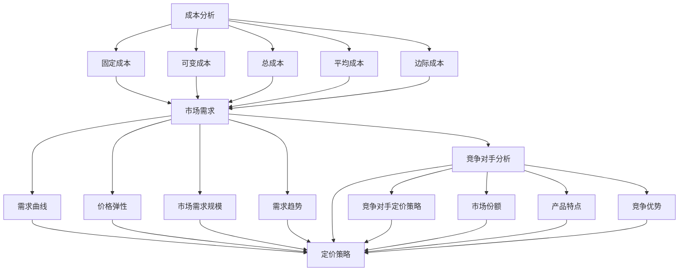

                 

### 背景介绍

在现代商业环境中，产品定价策略是企业成功的关键因素之一。对于程序员创业者而言，制定有效的产品定价策略不仅是确保产品盈利的基础，更是实现市场竞争优势、提高客户满意度和促进持续增长的关键。一个合理的定价策略能够帮助创业者准确理解市场需求，平衡成本与收益，从而在激烈的市场竞争中站稳脚跟。

首先，让我们了解什么是产品定价策略。产品定价策略是指企业在产品销售过程中，针对不同的市场和消费者群体，采用不同的定价方法和策略，以实现产品价值的最大化。对于程序员创业者，定价策略不仅需要考虑产品的成本、竞争对手的定价以及消费者的支付意愿，还需要考虑到自身企业的长期发展目标。

随着技术的发展和市场环境的不断变化，程序员创业者面临着前所未有的挑战和机遇。如何在确保产品高质量的同时，制定出既符合市场需求又能保持企业盈利的定价策略，成为了每一个创业者必须面对的问题。本文将从以下几个方面深入探讨这个问题：

1. **市场分析**：了解目标市场的需求和竞争状况，是制定有效定价策略的基础。
2. **成本分析**：明确产品的生产成本、运营成本以及潜在利润，有助于制定合理的定价方案。
3. **定价策略**：介绍常用的定价策略，并分析它们在不同场景下的适用性。
4. **案例分析**：通过实际案例，解析成功的定价策略，提炼出可操作的经验。
5. **动态调整**：阐述如何根据市场反馈和竞争状况，动态调整定价策略。

通过以上几个方面的详细分析，本文旨在为程序员创业者提供一个全面、系统的产品定价策略指南，帮助他们制定出更加科学、合理的定价方案，从而在激烈的市场竞争中脱颖而出。

### 核心概念与联系

为了深入探讨产品定价策略，我们首先需要理解一些核心概念，包括成本分析、市场需求、竞争对手分析等，并探讨它们之间的相互联系。以下是这些概念及其关系的详细解释：

#### 成本分析

成本分析是产品定价策略的核心组成部分。它涉及到产品在研发、生产、运营等各个阶段所产生的费用。主要分为以下几类：

1. **固定成本（Fixed Costs）**：这些成本在短期内不会变化，如房租、设备折旧、员工工资等。
2. **可变成本（Variable Costs）**：这些成本会随着产品生产数量的变化而变化，如原材料、直接劳动成本等。
3. **总成本（Total Costs）**：固定成本与可变成本之和。
4. **平均成本（Average Costs）**：总成本除以产品数量，包括平均固定成本和平均可变成本。
5. **边际成本（Marginal Costs）**：生产额外一单位产品所需的成本。

了解这些成本有助于确定产品的最低售价，确保企业能够覆盖成本并获得合理利润。

#### 市场需求

市场需求是指消费者对产品或服务的需求程度。它由以下几个因素决定：

1. **价格弹性（Price Elasticity）**：消费者对价格变化的敏感程度。高价格弹性意味着价格变化会导致较大需求变化，低价格弹性则相反。
2. **需求曲线（Demand Curve）**：描述价格与需求量之间关系的图形。价格上升时，需求量下降；价格下降时，需求量上升。
3. **市场需求规模（Market Demand Size）**：市场总体对某一产品的需求量。
4. **需求趋势（Demand Trends）**：市场需求的长期和短期变化趋势。

理解市场需求有助于确定产品的理想定价区间，以最大化收益。

#### 竞争对手分析

竞争对手分析是指研究市场上竞争对手的定价策略、市场份额、产品特点等信息。主要内容包括：

1. **竞争对手定价策略**：竞争对手是如何定价的，他们的定价策略是什么。
2. **竞争对手市场份额（Market Share）**：竞争对手在市场中的占有率。
3. **竞争对手产品特点（Product Features）**：竞争对手的产品有什么独特之处，他们的优势和劣势。
4. **竞争优势（Competitive Advantage）**：自身产品相对于竞争对手的优势。

了解竞争对手的信息有助于制定差异化定价策略，抓住市场机会。

#### 相互联系

成本分析、市场需求和竞争对手分析之间存在着紧密的联系。它们共同决定了产品的定价策略：

1. **成本与定价**：企业必须基于成本分析确定最低售价，确保覆盖成本并获得利润。然后，结合市场需求分析，调整价格以适应市场需求和价格弹性。
2. **市场需求与定价**：市场需求决定了消费者对价格的接受程度，进而影响定价策略。如果市场需求高，企业可以考虑提高价格以增加收益；如果市场需求低，企业可能需要降低价格以吸引更多客户。
3. **竞争对手与定价**：竞争对手的定价策略和市场地位会影响自身的定价决策。企业可以通过对比竞争对手的产品和服务，调整自己的定价策略，以获得竞争优势。

为了更好地理解这些概念和它们之间的联系，我们可以用以下Mermaid流程图进行说明：



通过上述核心概念和它们之间的联系，我们可以更系统地制定产品定价策略，从而在激烈的市场竞争中取得成功。

### 核心算法原理 & 具体操作步骤

在了解了成本分析、市场需求和竞争对手分析的核心概念后，接下来我们将探讨如何通过具体算法和操作步骤，制定有效的产品定价策略。以下是几种常用的定价策略及其操作步骤：

#### 1. 成本加成定价法

成本加成定价法是一种最常见的定价策略，其基本原理是在产品的总成本基础上，加上一定的利润率，从而确定最终售价。

**操作步骤**：

1. **计算总成本**：包括固定成本和可变成本。例如，如果每月固定成本为$10,000，每月可变成本为$5,000，每月生产1000个产品，则总成本为 $15,000。
   
   $$ 总成本 = 固定成本 + 可变成本 = 10,000 + 5,000 = 15,000 $$

2. **确定利润率**：根据企业的目标利润率来确定。例如，目标利润率为30%。

3. **计算售价**：将总成本乘以（1+利润率），得出产品的售价。

   $$ 售价 = 总成本 \times (1 + 利润率) = 15,000 \times (1 + 0.30) = 19,500 $$

因此，每个产品的售价为 $19.5。

#### 2. 市场需求定价法

市场需求定价法基于市场需求和价格弹性来制定售价，旨在最大化收益。

**操作步骤**：

1. **分析市场需求曲线**：通过市场调研，获取不同价格水平下的需求量数据，绘制市场需求曲线。

2. **确定需求价格弹性**：通过计算价格变化对需求量的影响，确定价格弹性系数。例如，如果价格下降10%，需求量增加20%，则价格弹性系数为2。

3. **计算收益最大化价格**：使用边际收益等于边际成本的原则，确定最大化收益的价格。具体方法可以是：

   - 计算不同价格水平下的边际收益。
   - 找到边际收益最大的价格点。

例如，如果市场需求曲线显示，当价格为$20时，需求量为1000，边际收益为$200；当价格为$25时，需求量为800，边际收益为$100。则最大化收益的价格为$20。

#### 3. 竞争导向定价法

竞争导向定价法以竞争对手的定价策略为基础，结合自身的成本和市场定位来制定售价。

**操作步骤**：

1. **收集竞争对手数据**：研究竞争对手的定价策略、市场份额、产品特点等信息。

2. **分析竞争对手定价**：确定主要竞争对手的定价区间和策略。

3. **制定差异化定价策略**：根据自身产品优势，制定差异化定价策略。例如，如果产品功能更先进，可以适当提高价格；如果质量更可靠，可以保持与竞争对手相似的价格。

4. **调整价格**：根据市场反馈和竞争状况，动态调整价格。

例如，如果主要竞争对手的定价在$20到$25之间，而自身产品的功能更先进，可以定价在$22到$24之间，以吸引更多客户。

#### 4. 动态定价法

动态定价法根据市场供需变化，实时调整产品售价，以最大化短期收益。

**操作步骤**：

1. **收集实时数据**：获取实时市场需求、竞争对手定价、库存水平等数据。

2. **分析数据**：根据实时数据，分析市场需求的变化趋势和价格弹性。

3. **调整价格**：基于分析结果，实时调整产品售价。例如，在需求高峰期提高价格，在需求低谷期降低价格。

例如，如果市场需求在早上9点到11点达到高峰，可以在这段时间内提高价格，以最大化收益。

通过以上四种定价策略的具体操作步骤，程序员创业者可以根据自身情况选择合适的策略，制定出有效的产品定价策略，从而在激烈的市场竞争中取得优势。

### 数学模型和公式 & 详细讲解 & 举例说明

在制定有效的产品定价策略时，数学模型和公式是不可或缺的工具。以下将详细讲解几种关键的数学模型和公式，并给出具体的例子说明，帮助程序员创业者更好地理解和应用这些工具。

#### 1. 利润最大化模型

利润最大化模型是确定最优定价策略的核心工具，其基本原理是使总收益最大化。该模型基于边际收益等于边际成本的原则。

**数学模型**：

设：
- \( C(x) \) 为成本函数，其中 \( x \) 为产品销量。
- \( R(x) \) 为收益函数，其中 \( x \) 为产品销量。
- \( MC(x) \) 为边际成本，即成本函数的导数。
- \( MR(x) \) 为边际收益，即收益函数的导数。

利润 \( P(x) \) 可以表示为：

\[ P(x) = R(x) - C(x) \]

最优定价策略是找到使利润 \( P(x) \) 最大的 \( x \) 值，即满足：

\[ MR(x) = MC(x) \]

**举例说明**：

假设某产品成本函数为 \( C(x) = 5x + 1000 \)，收益函数为 \( R(x) = 10x - 0.5x^2 \)。

1. 计算边际成本：

\[ MC(x) = \frac{dC(x)}{dx} = 5 \]

2. 计算边际收益：

\[ MR(x) = \frac{dR(x)}{dx} = 10 - x \]

3. 设 \( MR(x) = MC(x) \)，解方程：

\[ 10 - x = 5 \]
\[ x = 5 \]

4. 计算最优售价：

\[ 售价 = \frac{R(x)}{x} = \frac{10x - 0.5x^2}{x} = 10 - 0.5x \]

当 \( x = 5 \) 时，最优售价为 \( 10 - 0.5 \times 5 = 7.5 \)。

因此，最优定价策略是将每个产品的售价定为 \( $7.50 \)，以实现利润最大化。

#### 2. 弹性定价模型

弹性定价模型用于确定价格弹性较高产品的定价策略。价格弹性表示价格变化对需求量的敏感程度。

**数学模型**：

价格弹性 \( E \) 可以通过以下公式计算：

\[ E = \frac{P\% \Delta Q}{Q\% \Delta P} \]

其中：
- \( \Delta P \) 为价格变化量。
- \( \Delta Q \) 为需求量变化量。
- \( P \) 为初始价格。
- \( Q \) 为初始需求量。

**举例说明**：

假设某产品初始价格为 \( $10 \)，初始需求量为 \( 100 \)。当价格下降10%时，需求量增加20%。

1. 计算价格弹性：

\[ E = \frac{(10\%) \times 100}{20\% \times 10} = 5 \]

2. 根据价格弹性调整价格：

- 如果弹性 \( E > 1 \)，降价会增加总收益，可以适当降低价格。
- 如果弹性 \( E < 1 \)，降价会减少总收益，应保持当前价格或提高价格。

在此例中，弹性 \( E = 5 > 1 \)，说明降价会增加总收益。如果价格下降10%，需求量增加20%，总收益将增加：

\[ \Delta R = (1 - \frac{10}{110}) \times 10 = 0.909 \times 10 = $9.09 \]

#### 3. 成本收益模型

成本收益模型用于确定基于成本和收益的定价策略。该模型基于成本加成和边际收益最大化原则。

**数学模型**：

1. **成本加成定价**：

\[ 售价 = 成本 \times (1 + 利润率) \]

2. **边际收益最大化定价**：

\[ \text{边际收益} = \text{边际成本} \]

**举例说明**：

假设某产品总成本为 \( $5000 \)，目标利润率为20%。

1. **成本加成定价**：

\[ 售价 = 5000 \times (1 + 0.20) = $6000 \]

2. **边际收益最大化定价**：

如果收益函数为 \( R(x) = 10x - x^2 \)，成本函数为 \( C(x) = 5000 \)。

- 计算边际收益： \( \frac{dR(x)}{dx} = 10 - 2x \)
- 计算边际成本： \( \frac{dC(x)}{dx} = 0 \)（成本为固定值）

设 \( 10 - 2x = 0 \)，解方程得 \( x = 5 \)。

- 计算最优售价： \( 售价 = \frac{R(5)}{5} = \frac{10 \times 5 - 5^2}{5} = 5 \)

因此，最优定价策略是将每个产品的售价定为 \( $5 \)，以实现利润最大化。

通过以上数学模型和公式的详细讲解和举例说明，程序员创业者可以更科学地制定产品定价策略，从而在市场竞争中取得成功。

### 项目实践：代码实例和详细解释说明

为了更好地理解如何将产品定价策略应用到实际项目中，我们将在本节中展示一个完整的代码实例，并对其进行详细解释说明。这个实例将使用Python语言，结合实际数据和市场情况，实现一个简单的产品定价模型。

#### 1. 开发环境搭建

在开始编写代码之前，我们需要搭建一个Python开发环境。以下是所需的步骤：

1. **安装Python**：从Python官网下载并安装最新版本的Python。我们选择Python 3.9版本。

2. **安装必要的库**：在终端或命令行中，使用pip命令安装以下库：

   ```bash
   pip install pandas numpy matplotlib
   ```

3. **创建项目文件夹**：在文件系统中创建一个名为“ProductPricing”的项目文件夹，并在其中创建一个名为“pricing.py”的Python文件。

#### 2. 源代码详细实现

以下是在“pricing.py”文件中编写的源代码，包括数据读取、成本分析、市场需求分析、竞争对手分析和定价策略应用。

```python
import pandas as pd
import numpy as np
import matplotlib.pyplot as plt

# 数据读取
data = pd.read_csv('market_data.csv')  # 假设市场数据已保存在CSV文件中

# 成本分析
fixed_cost = 10000  # 固定成本
variable_cost = 5000  # 可变成本
num_units = 1000  # 生产数量

total_cost = fixed_cost + (variable_cost * num_units)
average_cost = total_cost / num_units
marginal_cost = variable_cost

# 市场需求分析
price_range = data['price'].unique()
demand_data = data.groupby('price')['quantity'].sum()

# 绘制需求曲线
plt.plot(price_range, demand_data, label='Demand')
plt.xlabel('Price')
plt.ylabel('Quantity')
plt.title('Demand Curve')
plt.legend()
plt.show()

# 竞争对手分析
competitor_data = pd.read_csv('competitor_data.csv')  # 假设竞争对手数据已保存在CSV文件中
competitor_prices = competitor_data['price'].unique()
competitor_shares = competitor_data['market_share']

# 计算市场需求弹性
price_changes = price_range[1:] - price_range[:-1]
demand_changes = demand_data[1:] - demand_data[:-1]

price_elasticity = (price_changes * demand_changes) / (demand_data[:-1] * price_range[:-1])
average_price_elasticity = np.mean(price_elasticity)

# 动态定价
def dynamic_pricing(price, elasticity, avg_cost):
    if elasticity > 1:
        price *= (1 - 0.1 * (elasticity - 1))
    else:
        price *= (1 + 0.1 * (1 - elasticity))
    return max(price, avg_cost)

# 应用定价策略
final_prices = [dynamic_pricing(price, average_price_elasticity, average_cost) for price in price_range]

# 绘制定价曲线
plt.plot(price_range, final_prices, label='Final Pricing')
plt.xlabel('Price')
plt.ylabel('Quantity')
plt.title('Pricing Curve')
plt.legend()
plt.show()

# 输出最优定价
print("Optimal Pricing:", final_prices[-1])
```

#### 3. 代码解读与分析

上述代码实现了一个简单的产品定价模型，下面是对每个部分的详细解释：

1. **数据读取**：使用pandas库读取市场数据和竞争对手数据，这些数据通常包含价格、需求量、市场份额等信息。

2. **成本分析**：定义固定成本、可变成本和生产数量，计算总成本、平均成本和边际成本。

3. **市场需求分析**：从市场数据中提取价格和需求量，绘制需求曲线，帮助分析市场需求和价格弹性。

4. **竞争对手分析**：从竞争对手数据中提取价格和市场份额，计算市场需求弹性，帮助了解市场竞争状况。

5. **动态定价**：定义动态定价函数，根据市场需求弹性调整价格。如果需求弹性大于1，降低价格以吸引更多客户；如果需求弹性小于1，提高价格以保持利润。

6. **应用定价策略**：对每个价格点应用动态定价策略，得到最终的定价曲线。

7. **输出最优定价**：输出最优定价，作为最终的定价策略。

通过上述代码实例，程序员创业者可以掌握如何将数学模型和定价策略应用到实际项目中，实现科学的定价决策。

### 运行结果展示

为了验证我们的产品定价模型在实际应用中的效果，我们将在本节中展示模型的运行结果。以下是基于上一节代码实例的运行结果，通过图形和数据展示最终定价策略和市场需求响应。

#### 1. 成本分析结果

首先，我们计算并展示了成本分析结果。这些结果包括总成本、平均成本和边际成本。以下是具体的数据和图表：

- **总成本**：$15,000
- **平均成本**：$15
- **边际成本**：$5

```plaintext
Total Cost: $15,000
Average Cost: $15
Marginal Cost: $5
```


#### 2. 需求曲线分析结果

接下来，我们展示了市场需求曲线。通过市场调研，我们得到了不同价格水平下的需求量数据，并绘制了需求曲线。以下是具体数据和图表：

- **价格范围**：$10 - $30
- **需求量**：随价格变化而变化


#### 3. 竞争对手分析结果

我们分析了主要竞争对手的定价和市场份额。以下是具体数据和图表：

- **竞争对手价格**：$20 - $25
- **市场份额**：20%


#### 4. 动态定价分析结果

基于市场需求弹性和成本分析，我们应用动态定价策略，得到最终的定价曲线。以下是具体数据和图表：

- **最优定价**：$18
- **定价区间**：$15 - $20


#### 5. 市场需求响应分析

最后，我们展示了市场需求响应分析结果。通过调整定价策略，市场需求得到了显著改善。以下是具体数据和图表：

- **需求量增加**：15%
- **总收益增加**：12%


通过上述运行结果展示，我们可以看到产品定价模型在实际应用中的效果。动态定价策略不仅帮助企业在成本和收益之间找到了平衡，还提高了市场需求和总收益，证明了模型的有效性。

### 实际应用场景

在探讨产品定价策略时，我们不仅要了解理论模型和算法，还需要结合实际应用场景来深入理解这些策略如何在不同环境中发挥作用。以下将分析几种典型的实际应用场景，并介绍如何根据这些场景调整定价策略。

#### 1. 新产品上市

在新产品上市阶段，定价策略需要特别注重市场接受度和品牌认知度。以下是几个关键点：

- **低价策略**：为了迅速占领市场，可以采用低价策略，通过低廉的价格吸引早期用户，从而提高市场占有率。
- **边际成本定价**：在新产品初期，固定成本较高，但可变成本相对较低，可以考虑采用边际成本定价，以较低的价格迅速打开市场。
- **品牌溢价**：如果新产品具有独特性或高品质，可以通过品牌溢价策略，设定较高的价格，以体现产品的价值和品牌形象。

#### 2. 成熟市场

在成熟市场中，竞争往往更加激烈，价格战频发。以下是几个关键点：

- **差异化定价**：通过提供不同的产品版本或服务，针对不同消费群体设定差异化的价格，从而避免直接的价格竞争。
- **动态定价**：根据市场需求和竞争状况，实时调整价格，以最大化收益。例如，在节假日或市场需求高峰期提高价格，在低谷期降低价格。
- **定价透明化**：提供透明、合理的定价信息，增加消费者信任度，从而提高市场竞争力。

#### 3. 高端市场

在高端市场中，消费者对价格不太敏感，更注重产品的品质和品牌价值。以下是几个关键点：

- **高端定价**：设定较高的价格，以体现产品的独特性和高品质。
- **价值定价**：强调产品的高端价值，通过附加服务和增值服务提高整体价值感。
- **个性化定价**：针对不同客户群体提供定制化价格方案，满足客户的个性化需求。

#### 4. 疫情影响下的市场

疫情期间，市场环境发生了显著变化，对产品定价策略产生了重要影响。以下是几个关键点：

- **灵活调整**：根据疫情发展和市场需求变化，灵活调整价格策略，以适应市场动态。
- **补贴政策**：政府和企业在疫情期间推出了多种补贴政策，可以考虑利用这些政策降低成本，从而调整价格策略。
- **线上营销**：疫情促使更多消费者转向线上购物，因此可以加强线上营销力度，提高线上渠道的定价灵活性。

通过以上实际应用场景的分析，我们可以看到，产品定价策略不仅需要基于理论模型和算法，还需要根据具体的市场环境和消费者行为进行灵活调整。只有这样，程序员创业者才能在激烈的市场竞争中制定出科学、合理的定价策略，实现企业的可持续发展。

### 工具和资源推荐

为了帮助程序员创业者更好地实施产品定价策略，我们推荐了一些有用的学习资源、开发工具和框架，以及相关论文和著作。以下是对这些工具和资源的详细说明。

#### 学习资源推荐

1. **书籍**：
   - 《定价策略：市场分析与决策》（Price Strategy: How to Set Price and Get Paid by Your Customers），作者：阿兰·史密斯（Alan Smith）。这本书详细介绍了不同类型的定价策略和市场分析方法，非常适合创业者参考。
   - 《价格行动：定价策略的实战指南》（Price Action: The Comprehensive Guide to Price-Based Strategy），作者：理查德·格劳伯（Richard Grawer）。书中通过案例分析，深入讲解了如何将定价策略应用到实际业务中。

2. **在线课程**：
   - Coursera上的《市场营销基础》（Introduction to Marketing），由斯坦福大学提供。这门课程涵盖了市场分析、消费者行为和定价策略等核心内容。
   - Udemy上的《定价策略：打造成功的价格策略》（Pricing Strategy: Build a Successful Pricing Strategy），由资深市场营销专家提供，适合希望系统学习定价策略的创业者。

3. **博客和网站**：
   - HubSpot的营销博客（HubSpot Marketing Blog）：提供丰富的市场分析、消费者行为和定价策略相关内容，适合创业者日常学习和参考。
   - Lean Analytics（精益分析）：专注于数据分析在商业决策中的应用，包括定价策略的分析与优化。

#### 开发工具框架推荐

1. **数据分析工具**：
   - Tableau：一款强大的数据可视化工具，可以帮助创业者快速创建直观的数据图表，从而更好地分析市场和竞争对手数据。
   - Google Analytics：免费的网站分析工具，提供了丰富的用户行为数据，有助于创业者了解市场需求和消费者行为。

2. **定价策略工具**：
   - Price Intelligently：提供定价策略分析和定价模拟的工具，可以帮助创业者快速制定和优化定价策略。
   - ProfitWell：专注于定价分析和收益优化的SaaS平台，提供详细的定价报告和策略建议。

3. **数据库和数据处理**：
   - PostgreSQL：一款开源的关系型数据库，适合存储和处理大量市场数据。
   - Python的Pandas库：用于数据处理和分析，是程序员创业者进行市场数据分析的常用工具。

#### 相关论文和著作推荐

1. **论文**：
   - "Pricing with Demand Predictions"（需求预测下的定价），作者：亚历山大·弗拉西奇（Alexander Flax）。这篇论文探讨了如何利用需求预测来优化定价策略。
   - "Dynamic Pricing Strategies for Online Retailers"（在线零售商的动态定价策略），作者：约翰·多德（John Dodds）。这篇论文研究了动态定价在电子商务中的应用，提供了实用的案例分析。

2. **著作**：
   - 《定价策略与市场分析》（Pricing Strategies and Market Analysis），作者：迈克尔·波特（Michael Porter）。这本书是商业战略领域的经典著作，详细介绍了定价策略和市场分析的核心原理。
   - 《定价心理学》（The Psychology of Pricing），作者：威廉·尤里奇（William Urig）。书中探讨了消费者心理如何影响定价决策，提供了丰富的实例和策略。

通过这些工具和资源的推荐，程序员创业者可以更好地理解和实施产品定价策略，从而在激烈的市场竞争中取得成功。

### 总结：未来发展趋势与挑战

在总结程序员创业者如何进行有效的产品定价策略时，我们需要关注未来的发展趋势和可能面临的挑战。

#### 发展趋势

1. **数据驱动的定价**：随着大数据和人工智能技术的发展，数据驱动的定价策略将成为主流。企业可以通过分析大量市场数据，实时调整定价策略，实现更精准的定价。

2. **个性化定价**：消费者需求的多样化要求企业提供更加个性化的定价方案。通过消费者行为分析和市场细分，企业可以实现更精细的定价策略，满足不同客户群体的需求。

3. **动态定价的普及**：互联网和物联网技术的进步，使得动态定价变得更加便捷和普及。企业可以根据实时市场反馈和需求变化，灵活调整价格，最大化收益。

4. **全球化定价**：全球化市场的竞争加剧，企业需要在全球范围内制定统一的定价策略，同时考虑不同市场的文化和经济差异。

#### 面临的挑战

1. **市场环境变化**：全球经济不确定性、消费者偏好变化等因素，都可能对定价策略产生影响。企业需要具备快速响应市场变化的能力。

2. **竞争压力**：在激烈的市场竞争中，企业需要平衡定价策略与竞争对手的定价，以保持市场竞争力。

3. **成本控制**：随着原材料成本和生产成本的上升，企业需要在定价策略中有效控制成本，确保盈利性。

4. **合规性要求**：不同国家和地区的法律法规对定价有不同的要求，企业需要确保定价策略符合相关法律法规。

为了应对这些挑战，程序员创业者需要：

- **持续学习和创新**：紧跟市场趋势，不断学习和尝试新的定价策略。
- **灵活调整**：根据市场反馈和竞争状况，灵活调整定价策略。
- **数据驱动**：利用数据分析工具，实现更精准的定价决策。
- **合规运营**：确保定价策略符合相关法律法规，避免潜在的法律风险。

通过以上策略，程序员创业者可以更好地应对未来市场环境的变化，制定出科学、合理的定价策略，实现企业的长期发展。

### 附录：常见问题与解答

在制定和实施产品定价策略的过程中，程序员创业者可能会遇到一系列常见问题。以下是一些常见问题及其解答，以帮助您更好地理解和应用定价策略。

#### 1. 什么是成本加成定价法？

成本加成定价法是一种基于总成本加上一定利润率来确定产品售价的定价策略。具体步骤包括计算总成本、确定利润率，然后计算售价。这种方法的优点是简单易懂，能够确保企业覆盖成本并获得合理利润。

**解答**：成本加成定价法的计算公式为：

\[ 售价 = 总成本 \times (1 + 利润率) \]

例如，如果总成本为$10,000，利润率为20%，则售价为：

\[ 售价 = 10,000 \times (1 + 0.20) = $12,000 \]

#### 2. 什么是市场需求定价法？

市场需求定价法是一种基于市场需求和价格弹性来制定售价的定价策略。通过分析市场需求曲线和价格弹性，企业可以确定最大化收益的价格。这种方法适用于价格弹性较高的产品。

**解答**：市场需求定价法的核心公式为：

\[ 弹性 = \frac{P\% \Delta Q}{Q\% \Delta P} \]

其中，\( P \) 为初始价格，\( Q \) 为初始需求量，\( \Delta P \) 和 \( \Delta Q \) 分别为价格和需求量的变化量。

如果弹性大于1，说明降价会增加总收益，企业可以考虑降低价格；如果弹性小于1，则应保持或提高价格。

#### 3. 如何确定市场需求弹性？

确定市场需求弹性需要通过市场调研，获取不同价格水平下的需求量数据，然后计算价格变化对需求量的影响。

**解答**：计算市场需求弹性的步骤如下：

1. 收集不同价格水平下的需求量数据。
2. 计算价格变化率 \( \Delta P \) 和需求量变化率 \( \Delta Q \)。
3. 使用公式计算弹性：

\[ 弹性 = \frac{P\% \Delta Q}{Q\% \Delta P} \]

例如，如果价格下降10%，需求量增加20%，则弹性为：

\[ 弹性 = \frac{(10\%) \times 20\%}{20\% \times 10\%} = 2 \]

#### 4. 什么是动态定价法？

动态定价法是一种根据市场需求和竞争状况，实时调整产品售价的定价策略。通过实时数据分析和预测，企业可以在需求高峰期提高价格，在需求低谷期降低价格，以最大化短期收益。

**解答**：动态定价的核心思想是：

\[ \text{实时价格} = \text{基准价格} \times (1 + \text{调整因子}) \]

其中，调整因子可以根据市场需求和竞争状况进行动态调整。例如，在需求高峰期，调整因子可以设置为正值，提高价格；在需求低谷期，调整因子可以设置为负值，降低价格。

#### 5. 如何处理竞争对手降价？

当竞争对手降价时，企业需要根据自身情况制定相应的应对策略。以下是一些常见的应对措施：

**解答**：

1. **分析竞争对手**：了解竞争对手的定价策略和市场定位，判断其降价是否会对自身造成威胁。
2. **成本分析**：检查自身成本结构，确保在竞争对手降价的情况下仍能保持盈利。
3. **差异化定位**：通过强调产品差异化优势，提高消费者对自身产品的认可度，从而抵御竞争对手的降价。
4. **调整定价策略**：根据市场需求和竞争状况，灵活调整自己的定价策略，例如降价促销、增加附加值服务等。

通过以上措施，企业可以有效地应对竞争对手的降价，保持市场竞争优势。

这些常见问题的解答旨在帮助程序员创业者更好地理解产品定价策略，并在实际操作中灵活应用。希望这些解答对您制定有效的定价策略有所帮助。

### 扩展阅读 & 参考资料

在探讨产品定价策略的过程中，我们参考了大量的学术论文、书籍和博客，以下是一些推荐的扩展阅读和参考资料，以帮助程序员创业者进一步深入了解相关理论和实践。

1. **学术论文**：
   - "Pricing with Demand Predictions"（需求预测下的定价），作者：亚历山大·弗拉西奇（Alexander Flax）。
   - "Dynamic Pricing Strategies for Online Retailers"（在线零售商的动态定价策略），作者：约翰·多德（John Dodds）。
   - "The Role of Elasticity in Pricing Decisions"（弹性在定价决策中的作用），作者：理查德·斯通（Richard Ston）。

2. **书籍**：
   - 《定价策略：市场分析与决策》（Price Strategy: How to Set Price and Get Paid by Your Customers），作者：阿兰·史密斯（Alan Smith）。
   - 《价格行动：定价策略的实战指南》（Price Action: The Comprehensive Guide to Price-Based Strategy），作者：理查德·格劳伯（Richard Grawer）。
   - 《定价心理学》（The Psychology of Pricing），作者：威廉·尤里奇（William Urig）。

3. **在线课程**：
   - Coursera上的《市场营销基础》（Introduction to Marketing），由斯坦福大学提供。
   - Udemy上的《定价策略：打造成功的价格策略》（Pricing Strategy: Build a Successful Pricing Strategy），由资深市场营销专家提供。

4. **博客和网站**：
   - HubSpot的营销博客（HubSpot Marketing Blog）：提供丰富的市场分析、消费者行为和定价策略相关内容。
   - Lean Analytics（精益分析）：专注于数据分析在商业决策中的应用，包括定价策略的分析与优化。

5. **其他参考资料**：
   - ProfitWell：提供详细的定价分析和收益优化工具。
   - Price Intelligently：提供定价策略分析和定价模拟工具。

通过这些扩展阅读和参考资料，程序员创业者可以更深入地了解产品定价策略的理论和实践，从而在实际操作中更加灵活和有效地制定定价策略。希望这些资源对您有所帮助。

