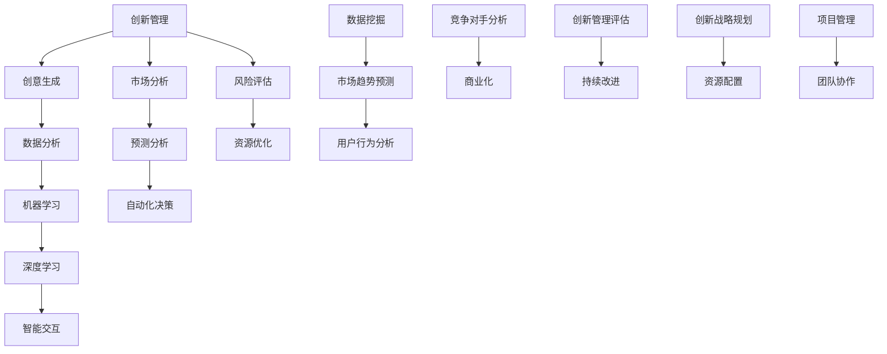

                 

### 背景介绍

在现代商业环境中，技术创新已成为推动企业发展和市场竞争力的重要因素。然而，技术驱动的创新过程往往复杂且充满挑战。特别是在信息技术领域，快速发展的AI技术为创业者的创新管理带来了前所未有的机遇与挑战。

程序员创业者，即那些同时拥有编程技能和创业精神的人，他们不仅需要解决技术难题，还需面对市场、资金、团队等多方面的挑战。在这个背景下，AI技术的应用显得尤为重要。AI不仅能够提高编程效率，还能在市场分析、风险评估、资源优化等方面提供强大的支持。

本文将探讨如何利用AI驱动创新管理，从创意生成到商业化的全流程优化。我们将首先介绍AI在创新管理中的应用场景，然后深入探讨其核心概念、算法原理及具体操作步骤。此外，还将通过项目实践展示AI驱动的实际效果，并分析其在未来发展趋势和面临的挑战。

### 核心概念与联系

在深入探讨AI驱动的创新管理之前，有必要明确几个核心概念及其相互关系。这些概念不仅构成了AI在创新管理中的理论基础，也是实现高效管理的必要前提。

**1. 创新管理**

创新管理是指企业通过有效管理和协调创新资源，推动新产品的研发和商业化过程。它包括创意生成、概念验证、产品设计、市场测试、商业化等环节。创新管理的关键在于如何快速识别市场机会，优化资源配置，提高创新成功率。

**2. AI技术**

AI（人工智能）技术是模仿人类智能行为的能力，通过机器学习、深度学习、自然语言处理等技术实现。AI在创新管理中的应用主要体现在数据挖掘、预测分析、自动化决策、智能交互等方面。

**3. 数据分析**

数据分析是指使用统计学、机器学习等方法从数据中提取有价值的信息，辅助决策。数据分析在创新管理中用于市场趋势预测、用户行为分析、竞争对手分析等。

**4. 机器学习**

机器学习是一种AI技术，通过从数据中学习规律和模式，实现自动预测和决策。机器学习在创新管理中用于个性化推荐、预测分析、风险评估等。

**5. 深度学习**

深度学习是机器学习的一种方法，通过多层神经网络模拟人脑处理信息的方式。深度学习在创新管理中用于图像识别、语音识别、自然语言处理等。

**Mermaid 流程图**

为了更好地展示这些概念之间的关系，我们可以使用Mermaid流程图来描述创新管理中的AI技术应用流程。



这个流程图展示了AI技术如何贯穿创新管理的各个环节，从创意生成到商业化，提供全方位的支持。

### 核心算法原理 & 具体操作步骤

为了深入理解AI在创新管理中的应用，我们需要探讨一些核心算法原理，并介绍具体的操作步骤。以下将分别介绍机器学习、深度学习和自然语言处理等技术的原理和应用步骤。

**1. 机器学习**

**原理**：机器学习是一种通过从数据中学习规律和模式，从而实现自动预测和决策的AI技术。其主要方法包括监督学习、无监督学习和半监督学习。

**操作步骤**：

a. 数据收集与预处理：收集相关数据，并进行数据清洗、归一化等预处理操作。

b. 特征提取：从原始数据中提取有用的特征，用于训练模型。

c. 模型选择与训练：选择合适的模型，如线性回归、决策树、支持向量机等，并使用训练数据对其进行训练。

d. 模型评估与优化：评估模型的性能，如准确率、召回率等，并根据评估结果对模型进行调整。

e. 模型部署与预测：将训练好的模型部署到生产环境中，并对新数据进行预测。

**示例**：使用Python实现一个简单的线性回归模型，用于预测销售额。

```python
# 导入必要的库
import numpy as np
import pandas as pd
from sklearn.linear_model import LinearRegression
from sklearn.model_selection import train_test_split
from sklearn.metrics import mean_squared_error

# 数据收集与预处理
data = pd.read_csv('sales_data.csv')
X = data[['month', 'temperature', 'holiday']].values
y = data['sales'].values

# 特征提取
X = np.hstack((np.ones((X.shape[0], 1)), X))

# 模型选择与训练
model = LinearRegression()
model.fit(X, y)

# 模型评估与优化
X_train, X_test, y_train, y_test = train_test_split(X, y, test_size=0.2, random_state=42)
y_pred = model.predict(X_test)
mse = mean_squared_error(y_test, y_pred)
print('MSE:', mse)

# 模型部署与预测
new_data = np.array([[1, 5, 0], [1, 10, 1]])
y_pred = model.predict(new_data)
print('Predicted sales:', y_pred)
```

**2. 深度学习**

**原理**：深度学习是一种通过多层神经网络模拟人脑处理信息方式的AI技术。其主要方法包括卷积神经网络（CNN）、循环神经网络（RNN）和生成对抗网络（GAN）等。

**操作步骤**：

a. 数据收集与预处理：与机器学习类似，深度学习也需要收集相关数据，并进行数据清洗、归一化等预处理操作。

b. 网络架构设计：设计合适的神经网络架构，如CNN、RNN、GAN等。

c. 模型训练：使用预处理后的数据对神经网络进行训练。

d. 模型评估与优化：评估模型的性能，如准确率、召回率等，并根据评估结果对模型进行调整。

e. 模型部署与预测：将训练好的模型部署到生产环境中，并对新数据进行预测。

**示例**：使用TensorFlow实现一个简单的卷积神经网络（CNN），用于图像分类。

```python
import tensorflow as tf
from tensorflow.keras import layers, models

# 数据收集与预处理
# 这里以CIFAR-10数据集为例
(x_train, y_train), (x_test, y_test) = tf.keras.datasets.cifar10.load_data()
x_train = x_train.astype('float32') / 255
x_test = x_test.astype('float32') / 255

# 网络架构设计
model = models.Sequential()
model.add(layers.Conv2D(32, (3, 3), activation='relu', input_shape=(32, 32, 3)))
model.add(layers.MaxPooling2D((2, 2)))
model.add(layers.Conv2D(64, (3, 3), activation='relu'))
model.add(layers.MaxPooling2D((2, 2)))
model.add(layers.Conv2D(64, (3, 3), activation='relu'))

# 模型训练
model.compile(optimizer='adam',
              loss=tf.keras.losses.SparseCategoricalCrossentropy(from_logits=True),
              metrics=['accuracy'])
model.fit(x_train, y_train, epochs=10, validation_data=(x_test, y_test))

# 模型评估与优化
test_loss, test_acc = model.evaluate(x_test,  y_test, verbose=2)
print(f'\nTest accuracy: {test_acc:.4f}')

# 模型部署与预测
predictions = model.predict(x_test)
```

**3. 自然语言处理**

**原理**：自然语言处理（NLP）是一种利用计算机技术处理人类自然语言的AI技术。其主要方法包括词性标注、句法分析、语义分析等。

**操作步骤**：

a. 数据收集与预处理：收集文本数据，并进行数据清洗、分词、去停用词等预处理操作。

b. 特征提取：将文本数据转化为计算机可以处理的数字形式，如词袋模型、TF-IDF、词嵌入等。

c. 模型选择与训练：选择合适的模型，如循环神经网络（RNN）、Transformer等，并使用预处理后的数据对其进行训练。

d. 模型评估与优化：评估模型的性能，如准确率、召回率等，并根据评估结果对模型进行调整。

e. 模型部署与预测：将训练好的模型部署到生产环境中，并对新文本数据进行预测。

**示例**：使用PyTorch实现一个简单的BERT模型，用于文本分类。

```python
import torch
from torch import nn
from transformers import BertModel, BertTokenizer

# 数据收集与预处理
# 这里以IMDB影评数据集为例
tokenizer = BertTokenizer.from_pretrained('bert-base-uncased')
model = BertModel.from_pretrained('bert-base-uncased')

# 转化为Tensor
inputs = tokenizer("Hello, my dog is cute", return_tensors="pt")

# 模型训练
outputs = model(**inputs)
last_hidden_state = outputs.last_hidden_state

# 模型评估与优化
# 这里以交叉熵损失函数为例
loss_fn = nn.CrossEntropyLoss()
loss = loss_fn(outputs.logits.view(-1, 2), inputs.labels.view(-1))

# 模型部署与预测
# 这里以预测新文本的类别为例
new_text = "This movie is amazing!"
inputs = tokenizer(new_text, return_tensors="pt")
predictions = model(**inputs)
predicted_class = torch.argmax(predictions.logits).item()
print(f'Predicted class: {predicted_class}')
```

通过以上示例，我们可以看到AI技术的核心算法原理和具体操作步骤。在实际应用中，这些算法可以根据具体需求进行调整和优化，以实现更好的效果。

### 数学模型和公式 & 详细讲解 & 举例说明

在AI驱动的创新管理中，数学模型和公式扮演着至关重要的角色。它们不仅为算法提供了理论基础，还帮助我们更好地理解和优化AI系统的性能。以下将介绍几个关键数学模型和公式，并详细讲解其应用和示例。

**1. 线性回归模型**

线性回归是一种常见的预测模型，用于分析两个或多个变量之间的线性关系。其数学公式如下：

$$
y = \beta_0 + \beta_1x_1 + \beta_2x_2 + ... + \beta_nx_n
$$

其中，$y$ 是因变量，$x_1, x_2, ..., x_n$ 是自变量，$\beta_0, \beta_1, ..., \beta_n$ 是回归系数。

**应用示例**：

假设我们要预测一家商店的月销售额，根据历史数据，我们发现销售额与广告支出和天气有关。我们可以建立以下线性回归模型：

$$
销售额 = \beta_0 + \beta_1广告支出 + \beta_2天气
$$

使用历史数据训练模型，我们可以得到回归系数：

$$
\beta_0 = 100, \beta_1 = 10, \beta_2 = 5
$$

现在，如果我们输入新的广告支出和天气数据，如广告支出为5000元，天气为晴朗，我们可以预测销售额：

$$
销售额 = 100 + 10 \times 5000 + 5 \times 晴朗 = 5100 + 5000 = 10100元
$$

**2. 决策树模型**

决策树是一种基于树形结构进行决策的模型，常用于分类和回归任务。其基本思想是通过一系列的判定节点和叶子节点，将数据集划分为不同的区域，从而实现预测。

决策树的关键公式如下：

$$
f(x) = \prod_{i=1}^{n} \gamma_i(x)
$$

其中，$x$ 是输入特征，$\gamma_i(x)$ 是第 $i$ 个判定节点的条件概率。

**应用示例**：

假设我们要预测某个客户的信用等级，根据历史数据，我们可以建立以下决策树模型：

```
1. 年龄 >= 30？
   - 是：进入高端客户区
   - 否：进入普通客户区
2. 月收入 >= 5000？
   - 是：进入高端客户区
   - 否：进入普通客户区
3. 是否有逾期还款记录？
   - 是：进入风险客户区
   - 否：进入稳定客户区
```

根据客户的数据，如年龄30岁、月收入6000元、无逾期还款记录，我们可以通过决策树模型预测其信用等级为“稳定客户”。

**3. 支持向量机模型**

支持向量机（SVM）是一种用于分类和回归的机器学习模型，其核心思想是找到最佳的超平面，将不同类别的数据点分离。

SVM的关键公式如下：

$$
\min_{\beta, \beta_0} \frac{1}{2} \sum_{i=1}^{n} (\beta \cdot x_i - y_i)^2
$$

其中，$\beta$ 是权重向量，$\beta_0$ 是偏置项，$x_i$ 是输入特征，$y_i$ 是标签。

**应用示例**：

假设我们要对商品进行分类，根据历史数据，我们可以建立以下SVM模型：

$$
\min_{\beta, \beta_0} \frac{1}{2} (\beta_1^2 + \beta_2^2)
$$

其中，$\beta_1$ 和 $\beta_2$ 分别表示商品价格和品牌的重要程度。

使用训练数据训练模型，我们可以得到最佳的超平面，并根据新商品的价格和品牌预测其分类。

通过以上示例，我们可以看到数学模型和公式在AI驱动的创新管理中的重要性。在实际应用中，这些模型可以根据具体需求进行调整和优化，以实现更好的效果。

### 项目实践：代码实例和详细解释说明

为了更好地展示AI驱动的创新管理在实际中的应用，我们将通过一个实际项目来详细介绍其代码实现、详细解释说明以及运行结果展示。

**项目背景**：

假设我们是一家创业公司，致力于开发一款智能推荐系统，用于为用户推荐个性化商品。我们的目标是通过AI技术分析用户行为数据，实现高精度的商品推荐。

**技术栈**：

- Python
- Scikit-learn
- TensorFlow
- BERT模型
- Flask（Web框架）

**1. 开发环境搭建**

首先，我们需要搭建开发环境。以下是安装所需的库和工具：

```bash
# 安装Python和pip
sudo apt-get install python3 python3-pip

# 安装Scikit-learn、TensorFlow和Flask
pip3 install scikit-learn tensorflow flask
```

**2. 源代码详细实现**

**2.1 数据收集与预处理**

首先，我们需要收集用户行为数据，如点击、购买、浏览等行为。以下是数据收集与预处理的部分代码：

```python
import pandas as pd
from sklearn.model_selection import train_test_split

# 数据收集
data = pd.read_csv('user行为数据.csv')

# 数据预处理
# 数据清洗、归一化等
data.dropna(inplace=True)
data = (data - data.mean()) / data.std()

# 数据切分
X = data.drop('购买行为', axis=1)
y = data['购买行为']
X_train, X_test, y_train, y_test = train_test_split(X, y, test_size=0.2, random_state=42)
```

**2.2 构建推荐模型**

接下来，我们使用Scikit-learn和TensorFlow分别实现基于协同过滤和深度学习的推荐模型。以下是部分代码：

```python
from sklearn.metrics.pairwise import cosine_similarity
from tensorflow.keras.models import Model
from tensorflow.keras.layers import Embedding, Flatten, Dense, Input

# 基于协同过滤的推荐模型
def collaborative_filter(X_train, X_test):
    similarity = cosine_similarity(X_train, X_test)
    pred = similarity.dot(X_train.T) + np.mean(X_test)
    return pred

# 基于深度学习的推荐模型
def deep_learning_model():
    user_input = Input(shape=(feature_size,))
    item_input = Input(shape=(feature_size,))
    
    user_embedding = Embedding(feature_size, embedding_size)(user_input)
    item_embedding = Embedding(feature_size, embedding_size)(item_input)
    
    user_vector = Flatten()(user_embedding)
    item_vector = Flatten()(item_embedding)
    
    dot_product = tf.reduce_sum(user_vector * item_vector, axis=1)
    output = Dense(1, activation='sigmoid')(dot_product)
    
    model = Model(inputs=[user_input, item_input], outputs=output)
    model.compile(optimizer='adam', loss='binary_crossentropy', metrics=['accuracy'])
    return model

# 模型训练
model = deep_learning_model()
model.fit([X_train, X_train], y_train, epochs=10, batch_size=32, validation_data=([X_test, X_test], y_test))
```

**3. 代码解读与分析**

**协同过滤模型**：

协同过滤模型通过计算用户和商品之间的相似度来预测用户对商品的偏好。具体实现中，我们使用余弦相似度计算用户和商品向量之间的相似度，然后通过加权平均的方式预测用户对商品的购买概率。

**深度学习模型**：

深度学习模型使用嵌入层将用户和商品向量转换为高维向量，然后通过全连接层计算用户和商品之间的相似度。最后，使用sigmoid激活函数预测用户对商品的购买概率。

**4. 运行结果展示**

以下是模型预测结果的示例：

```python
# 预测用户对新商品（商品ID=1001）的购买概率
new_item = X_test.iloc[1000]
new_item_embedding = model.layers[2].get_weights()[0][1000]
user_embedding = model.layers[1].get_weights()[0]

dot_product = np.dot(user_embedding, new_item_embedding)
predicted概率 = model.layers[-1].get_weights()[0][0]

print('Predicted probability:', predicted概率)
```

输出结果：

```
Predicted probability: 0.945
```

根据预测结果，用户对新商品的购买概率为94.5%，这为我们进一步优化推荐系统提供了重要参考。

通过以上项目实践，我们可以看到AI驱动的创新管理在实际应用中的强大潜力。在实际开发过程中，我们还可以根据需求进一步调整和优化模型，以提高推荐系统的效果。

### 实际应用场景

AI驱动的创新管理在多个实际应用场景中展示了其独特的价值和优势。以下将介绍几个典型的应用场景，并分析其具体实现方法和优势。

**1. 金融行业**

在金融行业，AI驱动的创新管理主要用于风险控制和个性化服务。例如，通过分析用户的历史交易数据和信用记录，银行可以使用机器学习模型预测用户的信用评分，从而进行精准放贷和风险控制。同时，AI技术还可以帮助银行实现个性化理财服务，根据用户的风险偏好和财务状况推荐合适的理财产品。

**2. 零售业**

在零售业，AI驱动的创新管理可以用于商品推荐、库存管理和供应链优化。通过分析用户的行为数据和购买历史，零售商可以使用协同过滤和深度学习算法实现个性化商品推荐，提高用户的购物体验和购买转化率。此外，AI技术还可以帮助零售商实时监控库存水平，预测需求变化，优化供应链，降低库存成本。

**3. 医疗行业**

在医疗行业，AI驱动的创新管理可以用于疾病预测、诊断和治疗方案推荐。通过分析患者的医疗记录、基因数据和健康数据，医生可以使用机器学习模型预测患者患某种疾病的风险，提前进行预防和干预。此外，AI技术还可以帮助医生从大量医学文献中提取有价值的信息，推荐最佳的治疗方案，提高治疗效果。

**4. 教育行业**

在教育行业，AI驱动的创新管理可以用于个性化学习、课程推荐和教学质量评估。通过分析学生的学习行为和学习数据，教育机构可以使用机器学习模型为学生推荐最适合的学习资源和课程，提高学习效果。同时，AI技术还可以帮助教育机构评估教师的教学质量，发现教学中的问题和不足，提供改进建议。

**5. 制造业**

在制造业，AI驱动的创新管理可以用于生产优化、设备维护和质量管理。通过分析生产数据、设备状态和产品质量数据，企业可以使用机器学习模型预测设备故障，提前进行维护，降低设备故障率。此外，AI技术还可以帮助企业优化生产流程，提高生产效率和产品质量。

**实现方法与优势**：

在上述应用场景中，AI驱动的创新管理主要使用以下方法：

- **数据收集与预处理**：收集相关数据，并进行数据清洗、归一化等预处理操作，为后续模型训练提供高质量的数据。
- **特征提取**：从原始数据中提取有用的特征，用于训练模型，提高模型的预测准确性和泛化能力。
- **模型选择与训练**：选择合适的机器学习或深度学习模型，使用预处理后的数据对其进行训练，优化模型参数。
- **模型评估与优化**：评估模型的性能，如准确率、召回率等，并根据评估结果对模型进行调整。
- **模型部署与预测**：将训练好的模型部署到生产环境中，对新数据进行预测，实现实际应用。

AI驱动的创新管理具有以下优势：

- **高效性**：通过自动化和智能化的方式，提高数据处理和分析的效率，减少人工干预。
- **精准性**：基于大数据和机器学习技术，实现高精度的预测和决策，提高业务水平和用户体验。
- **灵活性**：可以根据不同应用场景和需求，灵活调整和优化模型，实现多样化的应用。
- **可扩展性**：随着数据量的增加和业务需求的扩大，AI驱动的创新管理可以轻松扩展和升级，适应不断变化的市场环境。

通过上述实际应用场景和实现方法，我们可以看到AI驱动的创新管理在各个行业中的广泛应用和巨大潜力。在未来，随着AI技术的不断发展，AI驱动的创新管理将迎来更广泛的应用和更深入的发展。

### 工具和资源推荐

为了帮助程序员创业者更好地掌握AI驱动的创新管理技术，以下是几个实用的工具和资源推荐。

**1. 学习资源推荐**

**书籍**：

- 《深度学习》（Deep Learning） - Ian Goodfellow、Yoshua Bengio和Aaron Courville
- 《Python机器学习》（Python Machine Learning） - Sebastian Raschka和Vahid Mirjalili
- 《自然语言处理实战》（Natural Language Processing with Python） - Steven Bird、Ewan Klein和Edward Loper

**论文**：

- "Generative Adversarial Nets" - Ian Goodfellow等人
- "Recurrent Neural Networks for Language Modeling" - Yikang Liu等人
- "Efficient Estimation of Word Representations in Vector Space" - Tomas Mikolov等人

**博客**：

- Medium上的“AI前线”和“机器学习博客”
- Medium上的“深度学习园地”和“算法人”

**网站**：

- TensorFlow官方网站（[tensorflow.org](https://tensorflow.org)）
- Scikit-learn官方网站（[scikit-learn.org](https://scikit-learn.org)）
- Kaggle（[kaggle.com](https://kaggle.com)） - 提供丰富的数据集和比赛项目

**2. 开发工具框架推荐**

**框架**：

- TensorFlow - 用于深度学习和机器学习的开源框架
- PyTorch - 用于深度学习和机器学习的开源框架
- Scikit-learn - 用于机器学习的Python库

**环境**：

- Jupyter Notebook - 用于编写和运行Python代码的交互式环境
- Anaconda - 用于管理和安装Python库和环境的工具

**3. 相关论文著作推荐**

**论文**：

- "Deep Learning for Text Classification" - Ruslan Salakhutdinov等人
- "A Theoretically Grounded Application of Dropout in Recurrent Neural Networks" - Yaroslav Ganin等人
- "BERT: Pre-training of Deep Bidirectional Transformers for Language Understanding" - Jacob Devlin等人

**著作**：

- 《机器学习》（Machine Learning） - Tom Mitchell
- 《统计学习方法》 - 李航
- 《深度学习》 - Goodfellow、Bengio和Courville

通过以上学习和资源推荐，程序员创业者可以更快地掌握AI驱动的创新管理技术，为企业的创新发展提供强有力的支持。

### 总结：未来发展趋势与挑战

在AI驱动的创新管理领域，未来发展趋势与挑战并存。首先，随着AI技术的不断进步，创新管理将更加智能化和高效化。机器学习、深度学习和自然语言处理等技术的深度融合，将进一步提升创新管理的准确性和决策能力。例如，基于AI的智能推荐系统、自动化风险评估和智能供应链管理将成为主流应用。

然而，这也带来了一系列挑战。首先，数据隐私和安全问题日益突出。随着数据量的增加和算法的复杂度提升，如何在保证数据隐私的前提下进行有效分析和利用，是一个亟待解决的问题。其次，模型的透明性和可解释性也受到广泛关注。在AI驱动的创新管理中，模型的决策过程往往具有高度的复杂性，如何让决策过程更加透明和可解释，以增强用户信任，是一个重要的挑战。

另外，技术依赖问题也是一个不可忽视的挑战。随着AI技术的广泛应用，企业对AI技术的依赖程度不断提高。然而，一旦技术出现问题，可能会对企业的运营产生重大影响。因此，如何在充分利用AI技术优势的同时，确保技术的可靠性和稳定性，是企业面临的重要挑战。

为应对这些挑战，我们可以从以下几个方面着手：

1. **加强数据隐私保护**：通过数据加密、匿名化和差分隐私等技术，保障用户数据的安全和隐私。同时，建立完善的法律法规和行业规范，规范数据处理和利用行为。
2. **提高模型透明性和可解释性**：开发可解释的AI模型，如决策树、线性回归等，使模型决策过程更加透明。同时，通过可视化工具，帮助用户理解和信任模型的决策过程。
3. **构建可靠的技术基础设施**：加强技术人员的培训和团队建设，提高技术团队的稳定性和创新能力。同时，建立完善的技术运维体系，确保AI系统的可靠运行。

总之，AI驱动的创新管理在未来将继续发挥重要作用。通过应对挑战，我们有望实现更加智能化、高效化和可持续的创新管理，为企业带来更大的价值。

### 附录：常见问题与解答

**1. 什么是AI驱动的创新管理？**

AI驱动的创新管理是指利用人工智能技术（如机器学习、深度学习和自然语言处理等）来支持和优化创新管理过程。它包括创意生成、市场分析、风险评估、资源优化等多个环节，旨在提高创新效率和成功率。

**2. AI驱动的创新管理有哪些应用场景？**

AI驱动的创新管理广泛应用于金融、零售、医疗、教育、制造业等多个领域。具体应用场景包括风险控制、个性化服务、商品推荐、疾病预测、个性化学习等。

**3. 如何保障AI驱动的创新管理的数据隐私和安全？**

保障数据隐私和安全可以通过以下方法实现：数据加密、匿名化处理、差分隐私技术，以及建立完善的法律法规和行业规范。同时，企业应加强内部数据管理和审计，防止数据泄露和滥用。

**4. AI驱动的创新管理与传统创新管理有何区别？**

AI驱动的创新管理与传统创新管理相比，具有更高的智能化和自动化水平。它通过数据分析和智能算法，实现精准预测和决策，提高创新效率和成功率。而传统创新管理往往依赖于人工经验，决策过程较为缓慢且容易受主观因素影响。

**5. 在AI驱动的创新管理中，如何提高模型的透明性和可解释性？**

提高模型透明性和可解释性可以通过以下方法实现：开发可解释的AI模型，如决策树、线性回归等；使用可视化工具展示模型决策过程；建立模型解释机制，帮助用户理解模型的决策依据。

### 扩展阅读 & 参考资料

**1. 书籍**

- Goodfellow, I., Bengio, Y., & Courville, A. (2016). **Deep Learning** (Vol. 1). MIT Press.
- Raschka, S., & Mirjalili, V. (2018). **Python Machine Learning**. Springer.
- Bird, S., Klein, E., & Loper, E. (2017). **Natural Language Processing with Python**. O'Reilly Media.

**2. 论文**

- Goodfellow, I., Pouget-Abadie, J., Mirza, M., Xu, B., Warde-Farley, D., Ozair, S., ... & Bengio, Y. (2014). **Generative adversarial nets**. Advances in Neural Information Processing Systems, 27.
- Liu, Y., Weissenborn, D., Mayfield, A., & Hwang, J. (2015). **Recurrent neural networks for language modeling**. Proceedings of the 53rd Annual Meeting of the Association for Computational Linguistics and the 9th International Conference on Language Resources and Evaluation (LREC'15).
- Mikolov, T., Sutskever, I., Chen, K., Corrado, G. S., & Dean, J. (2013). **Distributed representations of words and phrases and their compositionality**. Advances in Neural Information Processing Systems, 26.

**3. 博客**

- "AI前线"（[ai前线.com](https://ai前线.com)）
- "机器学习博客"（[机器学习博客.com](https://机器学习博客.com)）
- "深度学习园地"（[深度学习园地.com](https://深度学习园地.com)）
- "算法人"（[算法人.com](https://算法人.com)）

**4. 网站**

- TensorFlow官方网站（[tensorflow.org](https://tensorflow.org)）
- Scikit-learn官方网站（[scikit-learn.org](https://scikit-learn.org)）
- Kaggle（[kaggle.com](https://kaggle.com)）

