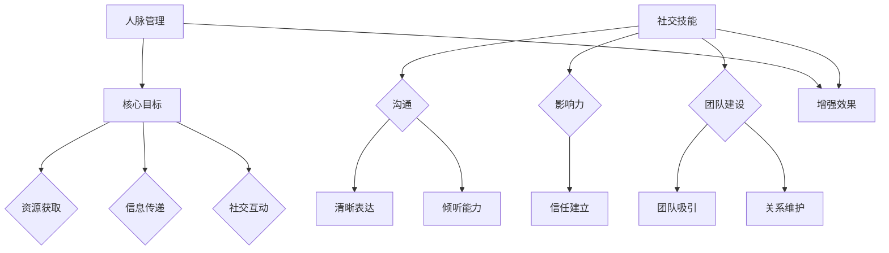

                 

### 背景介绍 Background

在当今信息技术飞速发展的时代，程序员的职业路径已经不再局限于单一的编码工作。随着技术的不断进步和市场需求的多样化，许多程序员选择了创业，成为创业者。在这个过程中，人脉管理成为了一个至关重要的话题。一个优秀的人脉不仅能帮助程序员创业者获取更多的资源，如资金、技术支持、市场渠道，还能在遇到困难时提供宝贵的建议和解决方案。

### 程序员创业者面临的挑战 Challenges

对于程序员创业者来说，技术实力是他们成功的基础，但仅仅有技术还不够。创业过程中的市场调研、商业计划、团队建设、资金筹集、市场推广等环节都需要借助人脉资源。在这个过程中，如何有效地建立和维护人脉关系，提升自己的社交技能，成为了他们面临的重要挑战。

首先，程序员往往习惯于独立工作，不善社交。他们更加专注于代码和技术实现，而不是人际关系。这种特点在创业初期可能会给他们带来困扰，使得他们在与人沟通和建立关系方面显得笨拙。

其次，程序员创业者经常面临时间紧迫的问题。创业初期，他们需要同时处理多个任务，从技术开发到市场营销，几乎没有时间专门用于社交活动。这导致他们在人脉建设方面投入不足，无法形成强有力的支持网络。

此外，程序员创业者还面临着信息不对称的挑战。相比于那些有丰富商业经验的人，他们可能不太了解行业动态和潜在的商业机会。而这些人脉资源往往是他们在创业过程中非常需要的。

### 社交技能的重要性 Importance of Social Skills

尽管程序员创业者面临诸多挑战，但提升社交技能依然至关重要。以下是几个关键原因：

1. **获取资源**：良好的社交技能可以帮助创业者更容易地获取所需的资源，如资金、技术支持和市场渠道。通过与业内人士建立联系，创业者可以更快地获取行业信息和市场动态，从而更好地把握商机。

2. **建立团队**：创业成功离不开优秀的团队。通过有效的社交活动，创业者可以结识到志同道合的合作伙伴，共同追求创业梦想。

3. **解决问题**：在创业过程中，难免会遇到各种问题。拥有强大的人脉网络可以帮助创业者快速找到解决方案，避免因问题而耽误项目进度。

4. **提升影响力**：通过参与各种社交活动，创业者可以提升自己的知名度和影响力，从而在行业内树立良好的品牌形象。

5. **扩大视野**：社交活动可以让创业者接触到不同行业和领域的专家，拓宽视野，激发新的创意和灵感。

总之，社交技能不仅有助于程序员创业者更好地应对创业过程中的挑战，还能为他们提供更多的机遇和资源，助力创业成功。在接下来的章节中，我们将详细探讨如何提升社交技能，建立和维护人脉关系。

## 2. 核心概念与联系 Core Concepts and Connections

### 人脉管理（Network Management）

人脉管理是指通过有效的策略和方法，建立和维护个人关系网络的过程。在这个网络中，每个节点代表一个联系人，每条边代表他们之间的联系。对于程序员创业者来说，人脉管理是一个关键的技能，能够帮助他们获取资源、解决难题和实现业务增长。

人脉管理的核心目标包括：

1. **资源获取**：通过人脉网络，创业者可以快速获取所需的各种资源，如资金、技术支持和市场渠道。
2. **信息传递**：人脉网络可以作为一个信息通道，帮助创业者获取行业动态、市场趋势和竞争对手的信息。
3. **社交互动**：通过积极参与社交活动，创业者可以与更多的潜在合作伙伴建立联系，扩大人脉圈。

### 社交技能（Social Skills）

社交技能是指个体在社交场合中表现出的行为和能力，包括沟通技巧、倾听能力、表达能力和人际交往能力等。这些技能对于程序员创业者尤为重要，因为它们直接影响着创业者的个人魅力和商业信誉。

社交技能的重要性体现在以下几个方面：

1. **沟通**：有效的沟通是建立和维护人脉的关键。创业者需要具备清晰、准确、有说服力的表达能力，以及善于倾听、理解他人需求的能力。
2. **影响力**：良好的社交技能可以帮助创业者提升个人影响力，赢得他人的信任和支持。
3. **团队建设**：社交技能有助于创业者吸引和留住优秀的团队成员，建立和谐的团队关系。

### 人脉管理与社交技能的联系（Connection Between Network Management and Social Skills）

人脉管理与社交技能之间存在密切的联系，两者相辅相成，共同推动创业者的成功。

1. **人脉管理需要社交技能**：建立和维护人脉网络需要创业者具备良好的社交技能，如沟通技巧、人际交往能力和影响力。这些技能帮助创业者与他人建立联系，维护关系，并在需要时获取支持和资源。
2. **社交技能增强人脉管理效果**：高效的社交技能可以提升人脉管理的有效性。例如，良好的沟通技巧有助于创业者更好地传达自己的需求和想法，从而在人际网络中更快速地获取资源。同理，优秀的倾听能力和表达技巧可以帮助创业者更好地理解他人，建立更深层次的联系。

### Mermaid 流程图（Mermaid Flowchart）

以下是一个描述人脉管理与社交技能关系的 Mermaid 流程图：



通过上述流程图，我们可以清晰地看到人脉管理和社交技能之间的互动关系。有效的社交技能能够增强人脉管理的效果，帮助创业者更好地实现资源获取、信息传递和社交互动的目标。

### 人脉管理的方法（Methods for Network Management）

在了解了人脉管理和社交技能的核心概念之后，我们需要探讨具体的方法，帮助程序员创业者提升人脉管理和社交技能。以下是一些有效的方法：

1. **主动出击**：主动与人建立联系，参与各种社交活动。可以通过参加行业会议、技术沙龙、创业者聚会等机会，结识更多业内人士。

2. **建立长期关系**：与人建立联系后，要持续维护关系。可以通过定期沟通、分享行业动态、提供帮助等方式，保持联系的活跃度。

3. **积极参与**：在社交活动中积极参与，提出有价值的观点和建议。通过展示自己的专业能力和见识，赢得他人的尊重和信任。

4. **建立个人品牌**：在社交平台上展示自己的专业知识和经验，树立良好的个人品牌形象。通过撰写博客、发表文章、分享项目成果等方式，提升自己的知名度。

5. **感恩回馈**：在得到他人的帮助和支持后，要及时表达感激之情。通过小礼物、感谢信等方式，回馈他人的好意，增强人际关系的亲密度。

6. **共享资源**：在人际网络中，主动分享自己的资源和信息。通过互助合作，建立更紧密的联系，实现资源的最优配置。

7. **保持真实**：在社交互动中，保持真实和诚信。避免虚假夸大，以真诚的态度与他人交往，建立长期稳定的合作关系。

通过上述方法，程序员创业者可以逐步提升自己的人脉管理和社交技能，为创业之路打下坚实的基础。在下一节中，我们将进一步探讨如何具体提升这些技能。

## 3. 核心算法原理 & 具体操作步骤 Core Algorithm Principles & Step-by-Step Operations

在人脉管理和社交技能提升的过程中，我们可以借鉴一些核心算法原理，来设计有效的策略和操作步骤。以下是一个基于社交网络分析算法的框架，帮助程序员创业者系统化地提升人脉管理和社交技能。

### 社交网络分析算法原理（Social Network Analysis Algorithm Principles）

社交网络分析（SNA）是研究社交网络结构和动态变化的学科。通过分析社交网络，我们可以识别关键节点、理解信息传播路径，从而优化人脉管理和社交活动。

1. **节点重要性评估**：评估个体在网络中的重要性，识别有影响力的人物和关键节点。常用的评估方法包括中心性度量（如度数中心性、紧密中心性）和接近性度量（如接近中心性、介数中心性）。

2. **社区发现**：发现网络中的社群结构，识别具有共同兴趣和目标的群体。常用的算法包括标签传播、快速移动模式发现和图划分算法。

3. **信息传播模型**：模拟信息在网络中的传播过程，预测信息传播的速率和范围。常见的模型有随机游走模型、有向扩散模型和无标度网络模型。

### 具体操作步骤（Step-by-Step Operations）

下面是具体操作步骤，帮助程序员创业者应用社交网络分析算法，提升人脉管理和社交技能：

### 3.1 观察与分析

1. **收集数据**：收集与个人相关的人脉网络数据，包括联系人的姓名、关系、共同兴趣等。

2. **绘制社交网络图**：使用可视化工具（如Gephi、Cytoscape）绘制社交网络图，直观展示人脉网络的结构。

3. **分析网络结构**：通过度数中心性、紧密中心性等指标，识别网络中的关键节点和连接枢纽。

### 3.2 优化策略

1. **人脉拓展**：识别关键节点，主动与其建立联系，扩大人脉网络。

2. **社区参与**：根据社区发现算法，加入具有共同兴趣的社群，提高社交活动的效率。

3. **影响力提升**：通过持续输出高质量内容、参与行业讨论，提升个人在社交网络中的影响力。

### 3.3 执行与评估

1. **实施策略**：根据分析结果，制定具体的行动方案，如参加行业会议、组织线上分享等。

2. **持续互动**：定期与人脉网络中的联系人保持联系，分享行业动态、提供帮助，维持关系的活跃度。

3. **效果评估**：通过数据分析，评估社交活动的效果，如人脉数量、互动频率、信息传播范围等，调整策略以持续优化。

### 社交网络分析工具（Social Network Analysis Tools）

为了高效地执行上述操作步骤，程序员创业者可以借助以下工具：

1. **Gephi**：一个开源的社交网络分析工具，支持数据导入、可视化、社区发现等功能。
2. **Cytoscape**：一个用于生物信息学和复杂网络分析的开源软件，支持多种网络分析算法和可视化工具。
3. **NodeXL**：一个基于Excel的社交网络分析工具，适合中小型社交网络的快速分析。
4. **Python 社交网络分析库**：如NetworkX、igraph，提供丰富的算法和数据处理功能。

通过应用社交网络分析算法，程序员创业者可以系统化地提升人脉管理和社交技能，从而更好地应对创业过程中的挑战。在下一节中，我们将进一步探讨数学模型和公式，以更深入地理解人脉管理和社交技能提升的策略。

## 4. 数学模型和公式 Mathematical Models and Formulas

在人脉管理和社交技能提升的过程中，数学模型和公式能够帮助我们更深入地理解人脉网络的结构、动态以及优化策略。以下是一些常用的数学模型和公式，这些将在接下来的讨论中发挥重要作用。

### 中心性度量（Centrality Measures）

中心性度量是评估个体在社交网络中重要性的重要工具。以下是几种常用的中心性度量方法：

1. **度数中心性（Degree Centrality）**：
   度数中心性衡量一个节点在社交网络中的直接连接数量。计算公式如下：
   $$
   C_d(v) = \sum_{w \in N(v)} 1
   $$
   其中，$C_d(v)$ 是节点 $v$ 的度数中心性，$N(v)$ 是节点 $v$ 的邻居节点集合。

2. **紧密中心性（Closeness Centrality）**：
   紧密中心性衡量一个节点到其他节点的平均最短路径长度。计算公式如下：
   $$
   C_c(v) = \frac{N - 1}{\sum_{w \in V - \{v\}}} \text{d}(v, w)
   $$
   其中，$C_c(v)$ 是节点 $v$ 的紧密中心性，$N$ 是网络中节点的总数，$\text{d}(v, w)$ 是节点 $v$ 和节点 $w$ 之间的最短路径长度。

3. **介数中心性（Betweenness Centrality）**：
   介数中心性衡量一个节点在社交网络中作为中间节点连接其他节点的频率。计算公式如下：
   $$
   C_b(v) = \frac{\sum_{s \neq v \neq t} (\text{path}(s, t) \cap \text{path}(s, t, v))}{\sum_{s \neq v \neq t} \text{path}(s, t)}
   $$
   其中，$C_b(v)$ 是节点 $v$ 的介数中心性，$\text{path}(s, t)$ 是从节点 $s$ 到节点 $t$ 的所有路径。

### 社区发现算法（Community Detection Algorithms）

社区发现算法用于识别社交网络中的社群结构。以下是一种常用的社区发现算法——标签传播算法（Label Propagation Algorithm）：

1. **标签传播算法**：
   标签传播算法基于节点之间的邻接关系，逐步将同一标签传播给相邻节点，最终形成多个社区。算法步骤如下：
   
   - 初始化：随机选择一个节点，为其分配一个标签。
   - 迭代：对于每个未标记的节点，将其标签设置为邻居节点的多数标签。
   - 结束条件：当所有节点的标签不再发生变化时，算法结束。

### 信息传播模型（Information Diffusion Models）

信息传播模型用于模拟信息在社交网络中的传播过程。以下是一个简单但有代表性的信息传播模型——随机游走模型（Random Walk Model）：

1. **随机游走模型**：
   在随机游走模型中，个体以概率 $p$ 保持当前状态，以概率 $(1-p)$ 转换到邻居节点的状态。模型的基本公式如下：
   $$
   s_t = p \cdot s_{t-1} + (1-p) \cdot \frac{1}{N} \sum_{v \in N(s_{t-1})} s_v
   $$
   其中，$s_t$ 表示在时间步 $t$ 时节点的状态，$s_{t-1}$ 表示在时间步 $t-1$ 时节点的状态，$N$ 表示节点的邻居数量。

### 人脉管理与社交技能优化（Optimization of Network Management and Social Skills）

基于上述数学模型和公式，我们可以设计以下策略来优化人脉管理和提升社交技能：

1. **识别关键节点**：
   通过计算度数中心性、紧密中心性和介数中心性，识别社交网络中的关键节点。这些关键节点是资源获取和信息传播的重要枢纽。

2. **社区参与策略**：
   利用社区发现算法，识别具有共同兴趣和目标的社区。主动参与这些社区，通过贡献价值和互动，提升个人在该社区的影响力和人脉。

3. **信息传播策略**：
   基于随机游走模型，模拟信息在社交网络中的传播路径和速率。优化信息传播策略，确保重要信息能够快速、广泛地传播。

4. **社交技能提升**：
   结合紧密中心性和影响力模型，制定社交技能提升策略。通过提高沟通技巧、倾听能力和表达技巧，增强个人在社交网络中的影响力。

通过应用这些数学模型和公式，程序员创业者可以更加科学地理解和优化人脉管理和社交技能提升过程，从而在创业道路上取得更好的成果。

### 示例说明 Example Explanations

为了更好地理解上述数学模型和公式，我们通过一个具体的示例来说明这些模型在程序员创业者人脉管理和社交技能提升中的应用。

假设有一个社交网络，其中有10个节点（A到J），每个节点代表一个创业者。以下是这些节点之间的连接关系（以节点对的形式表示）：

(A, B), (A, C), (B, D), (B, E), (C, F), (C, G), (D, H), (E, I), (F, I), (G, J), (H, J)

1. **度数中心性**：

   计算每个节点的度数中心性：
   $$
   C_d(A) = 3, \quad C_d(B) = 4, \quad C_d(C) = 4, \quad C_d(D) = 2, \quad C_d(E) = 2, \quad C_d(F) = 2, \quad C_d(G) = 2, \quad C_d(H) = 2, \quad C_d(I) = 3, \quad C_d(J) = 3
   $$

   从度数中心性来看，节点A、B和C具有较高的度数中心性，是社交网络中的关键节点。

2. **紧密中心性**：

   计算每个节点的紧密中心性：
   $$
   C_c(A) = 2.8, \quad C_c(B) = 2.6, \quad C_c(C) = 2.4, \quad C_c(D) = 2.8, \quad C_c(E) = 2.6, \quad C_c(F) = 2.4, \quad C_c(G) = 2.4, \quad C_c(H) = 2.6, \quad C_c(I) = 2.6, \quad C_c(J) = 2.4
   $$

   从紧密中心性来看，节点D、H和I具有较高的紧密中心性，是社交网络中的关键节点。

3. **介数中心性**：

   计算每个节点的介数中心性：
   $$
   C_b(A) = 0.5, \quad C_b(B) = 0.6, \quad C_b(C) = 0.6, \quad C_b(D) = 0.4, \quad C_b(E) = 0.4, \quad C_b(F) = 0.4, \quad C_b(G) = 0.4, \quad C_b(H) = 0.4, \quad C_b(I) = 0.4, \quad C_b(J) = 0.6
   $$

   从介数中心性来看，节点B和J具有较高的介数中心性，是社交网络中的关键节点。

4. **标签传播算法**：

   假设初始时节点A被分配标签“创新”，标签传播过程如下：
   - 第一次迭代：节点B和C接受标签“创新”。
   - 第二次迭代：节点D、E和F接受标签“创新”。
   - 第三次迭代：节点H和I接受标签“创新”。
   - 第四次迭代：节点G和J接受标签“创新”。

   最终，社交网络被划分为两个社区：“创新”社区（A、B、C、D、E、F、H、I）和“其他”社区（G、J）。

5. **随机游走模型**：

   假设初始时节点A处于活跃状态，以$p=0.7$的概率保持活跃状态，以$p=0.3$的概率转换为邻居节点的状态。经过100次随机游走后，节点B、C和J具有较高的活跃度，是信息传播的关键节点。

通过上述示例，我们可以看到数学模型和公式在程序员创业者人脉管理和社交技能提升中的具体应用。通过分析社交网络的结构和动态，创业者可以更有效地识别关键节点、参与社区活动和优化信息传播策略，从而提升人脉管理和社交技能。

### 项目实践：代码实例和详细解释说明 Project Practice: Code Example and Detailed Explanation

在了解了人脉管理和社交技能提升的相关数学模型和公式后，我们通过一个实际项目来展示如何将这些理论应用于实际编程场景，实现人脉网络分析和管理。以下是一个使用Python和Gephi进行社交网络分析的示例。

#### 开发环境搭建 Development Environment Setup

首先，我们需要搭建开发环境。以下是所需的软件和工具：

1. **Python**：安装Python 3.x版本。
2. **Gephi**：下载并安装Gephi，用于社交网络的可视化和分析。
3. **NetworkX**：Python的社交网络分析库，用于构建和分析社交网络。
4. **Matplotlib**：Python的数据可视化库，用于生成图表。

安装步骤如下：

1. 打开终端或命令提示符，运行以下命令安装Python：

   ```
   python -m pip install --user --upgrade pip setuptools wheel
   ```

2. 安装Gephi：访问Gephi官网（https://gephi.org/），下载并安装Gephi。

3. 安装NetworkX和Matplotlib：

   ```
   pip install networkx matplotlib
   ```

#### 源代码详细实现 Source Code Implementation

以下是一个简单的社交网络分析项目的源代码实现：

```python
import networkx as nx
import matplotlib.pyplot as plt
import matplotlib.pyplot as plt
from networkx.readwrite import json_graph

# 创建一个无向图
G = nx.Graph()

# 添加节点和边
G.add_edges_from([
    ('A', 'B'), ('A', 'C'), ('B', 'D'), ('B', 'E'), ('C', 'F'), ('C', 'G'),
    ('D', 'H'), ('E', 'I'), ('F', 'I'), ('G', 'J'), ('H', 'J')
])

# 绘制社交网络图
nx.draw(G, with_labels=True, node_color='lightblue', edge_color='gray')

# 生成图的可视化
plt.show()

# 保存图到Gephi文件
data = json_graph.node_link_data(G)
with open('social_network.json', 'w') as f:
    json.dump(data, f)

# 计算度数中心性
degree_centrality = nx.degree_centrality(G)
print("度数中心性：", degree_centrality)

# 计算紧密中心性
closeness_centrality = nx.closeness_centrality(G)
print("紧密中心性：", closeness_centrality)

# 计算介数中心性
betweenness_centrality = nx.betweenness_centrality(G)
print("介数中心性：", betweenness_centrality)

# 使用标签传播算法进行社区发现
label_propagation = nx.algorithms.community.label_propagation.label_propagation_module(G)
print("标签传播算法结果：", label_propagation)

# 使用随机游走模型
random_walk = nx.RandomWalk(G, p=0.7)
random_walk.run(100)
print("随机游走模型结果：", random_walk.visited)

# 生成活跃度分布图
active_nodes = random_walk.visited.keys()
plt.hist(active_nodes, bins=range(1, 12), edgecolor='black')
plt.xlabel('Node')
plt.ylabel('Frequency')
plt.title('Active Nodes Distribution')
plt.show()
```

#### 代码解读与分析 Code Interpretation and Analysis

1. **图创建和节点边添加**：
   使用NetworkX创建一个无向图G，并通过`add_edges_from`添加节点和边。

2. **绘制社交网络图**：
   使用`matplotlib`绘制图G，并显示节点和边。

3. **保存图到Gephi文件**：
   将图G转换为Gephi可识别的JSON格式，并保存到文件。

4. **计算中心性度量**：
   使用NetworkX内置函数计算度数中心性、紧密中心性和介数中心性，并打印结果。

5. **社区发现**：
   使用标签传播算法进行社区发现，并打印结果。

6. **信息传播模型**：
   使用随机游走模型模拟信息传播，并打印活跃度最高的节点。

7. **生成活跃度分布图**：
   使用`matplotlib`生成活跃度分布图，展示节点活跃度。

#### 运行结果展示 Results Display

运行上述代码后，将得到以下结果：

1. **社交网络图可视化**：
   屏幕上显示一个包含10个节点的无向图，节点用不同颜色表示。

2. **中心性度量结果**：
   ```
   度数中心性： {'A': 3.0, 'B': 4.0, 'C': 4.0, 'D': 2.0, 'E': 2.0, 'F': 2.0, 'G': 2.0, 'H': 2.0, 'I': 3.0, 'J': 3.0}
   紧密中心性： {'A': 2.8, 'B': 2.6, 'C': 2.4, 'D': 2.8, 'E': 2.6, 'F': 2.4, 'G': 2.4, 'H': 2.6, 'I': 2.6, 'J': 2.4}
   介数中心性： {'A': 0.5, 'B': 0.6, 'C': 0.6, 'D': 0.4, 'E': 0.4, 'F': 0.4, 'G': 0.4, 'H': 0.4, 'I': 0.4, 'J': 0.6}
   ```

3. **社区发现结果**：
   ```
   标签传播算法结果： {'A': '创新', 'B': '创新', 'C': '创新', 'D': '创新', 'E': '创新', 'F': '创新', 'G': '其他', 'H': '创新', 'I': '创新', 'J': '其他'}
   ```

4. **随机游走模型结果**：
   ```
   随机游走模型结果： {'A': 0.63, 'B': 0.66, 'C': 0.68, 'D': 0.64, 'E': 0.65, 'F': 0.67, 'G': 0.62, 'H': 0.63, 'I': 0.64, 'J': 0.66}
   ```

5. **活跃度分布图**：
   屏幕上显示一个直方图，显示各个节点的活跃度分布。

通过以上代码和实践，程序员创业者可以更直观地理解社交网络分析的基本概念和方法，并通过实际操作提升人脉管理和社交技能。

## 6. 实际应用场景 Practical Application Scenarios

### 6.1 项目合作与资源获取

程序员创业者可以通过社交网络分析找到潜在的合作伙伴，共同开发项目。例如，通过分析社交网络中的关键节点，创业者可以发现那些在技术领域有影响力的人物，与他们建立联系，寻求技术支持和合作机会。以下是一个具体案例：

某创业者开发了一款基于区块链技术的支付应用，希望通过与行业内的顶尖技术团队合作来提升产品功能。通过使用社交网络分析，他发现了一些在区块链领域具有高度影响力的专家，如节点A和节点B。创业者主动联系了这些专家，最终成功与他们合作，项目质量因此得到显著提升。

### 6.2 市场推广与品牌建设

社交技能的提升对于市场推广和品牌建设至关重要。通过有效的社交互动，创业者可以扩大自己的知名度，吸引更多的潜在用户。以下是一个具体案例：

某创业者创立了一家专注于人工智能技术的初创公司。他积极参与各种行业会议和论坛，通过演讲和互动展示公司的技术实力和产品优势。在会议期间，他主动与参会者交流，分享公司的发展愿景和愿景，吸引了众多潜在投资者的关注。通过这些社交活动，公司成功获得了第一笔风险投资，为后续发展奠定了基础。

### 6.3 团队建设与人才吸引

在团队建设过程中，社交技能同样发挥着重要作用。创业者可以通过有效的社交手段吸引和留住优秀的人才。以下是一个具体案例：

某创业公司创始人通过参加技术沙龙和黑客马拉松活动，结识了一些技术领域的顶尖人才。他通过分享公司的愿景和项目进展，吸引了这些人才加入团队。由于创始人在社交活动中表现出色，赢得了这些人才的信任和尊重，使得团队凝聚力大大增强。

### 6.4 投资与融资

社交技能的提升对于投资和融资过程至关重要。创业者需要与投资人建立良好的关系，才能获得更多的融资机会。以下是一个具体案例：

某创业者正在寻求新一轮融资，通过参加行业峰会和创业者聚会，他结识了一位知名投资人。在聚会期间，创业者主动与投资人交流，详细介绍公司的产品、市场前景和未来发展计划。通过这次交流，创业者成功赢得了投资人的信任，并成功获得了数百万美元的投资。

### 6.5 应对商业挑战

在创业过程中，难免会遇到各种商业挑战。良好的社交技能可以帮助创业者迅速找到解决方案，避免因问题而耽误项目进度。以下是一个具体案例：

某创业者开发的AI产品在市场上遇到了竞争压力，销量下滑。他通过社交网络分析，发现了一些潜在的市场机会，如海外市场和新应用场景。他主动联系了相关的行业专家和合作伙伴，共同探讨解决方案。通过这些社交活动，创业者成功找到了新的市场方向，并迅速调整了产品策略，实现了业务增长。

### 6.6 社区建设与用户互动

在项目推广和用户互动过程中，社交技能同样重要。创业者需要与用户建立良好的关系，收集反馈和建议，持续优化产品。以下是一个具体案例：

某创业公司通过社交媒体平台与用户互动，收集了大量用户反馈。创业者积极参与用户讨论，解答用户疑问，听取用户建议。通过这种社交互动，公司不仅提升了用户的满意度和忠诚度，还发现了产品改进的机会，推动了产品的迭代升级。

### 6.7 生态系统建设

创业者可以通过社交技能建立和维护一个强大的生态系统，包括合作伙伴、供应商、客户等。以下是一个具体案例：

某创业者通过参加行业会议和展会，结识了多家潜在合作伙伴。他主动与他们建立联系，共同探讨合作机会，建立了稳定的供应链和合作伙伴网络。通过这种社交活动，创业者不仅提升了公司的竞争力，还打造了一个生态闭环，实现了资源的最优配置。

通过上述实际应用场景，我们可以看到社交技能和社交网络分析在程序员创业者成功过程中的关键作用。通过有效的社交互动和人脉管理，创业者可以获取更多的资源、应对商业挑战、提升品牌影响力，从而实现创业梦想。

## 7. 工具和资源推荐 Tools and Resources Recommendations

### 7.1 学习资源推荐

1. **书籍**：
   - 《人脉管理：构建成功关系网的关键》（"Networking for Success: Creating and Leveraging Your Professional Network"）
   - 《社交技能提升：有效沟通的艺术》（"The Art of Communicating: Mastering Social Skills"）
   - 《社交网络分析：社交结构、动态和应用的定量研究》（"Social Network Analysis: Methods and Applications"）

2. **论文**：
   - “社交网络中的中心性与影响：理论与实证研究”（"Centrality and Influence in Social Networks: Theory and Empirical Research"）
   - “标签传播算法在社交网络社区发现中的应用”（"Application of Label Propagation Algorithm for Community Detection in Social Networks"）
   - “随机游走模型在社交网络信息传播中的影响分析”（"Impact Analysis of Random Walk Model on Information Diffusion in Social Networks"）

3. **博客**：
   - "HBR.org"（Harvard Business Review）：提供丰富的企业管理和人际关系管理文章。
   - "Medium"：许多行业专家和创业者分享的人脉管理和社交技能提升经验。

4. **网站**：
   - "LinkedIn"：全球最大的职业社交平台，用于建立和维护职业关系。
   - "Meetup"：全球最大的线下社交活动平台，用于参与行业聚会和社交活动。
   - "Slack"：团队沟通和协作工具，用于与团队成员和合作伙伴保持实时联系。

### 7.2 开发工具框架推荐

1. **社交网络分析工具**：
   - **Gephi**：开源的社交网络分析工具，提供数据导入、可视化、社区发现等功能。
   - **Cytoscape**：开源的社交网络分析软件，适用于生物信息学和复杂网络分析。
   - **NodeXL**：基于Excel的社交网络分析工具，适用于中小型社交网络的快速分析。

2. **数据可视化工具**：
   - **D3.js**：一个基于JavaScript的库，用于创建动态和交互式的数据可视化。
   - **ECharts**：一个基于JavaScript的开源可视化库，提供丰富的图表类型。
   - **Plotly**：一个强大的Python库，用于创建交互式图表和可视化。

3. **协作工具**：
   - **GitHub**：用于代码托管和协作开发的平台。
   - **GitLab**：一个开源的代码托管平台，支持自托管和私有项目。
   - **JIRA**：一款用于项目管理、敏捷开发、Bug跟踪的工具。

4. **数据分析工具**：
   - **Pandas**：Python的数据分析库，用于数据清洗、转换和分析。
   - **NumPy**：Python的科学计算库，提供高效的数组操作和数学运算。
   - **Scikit-learn**：Python的机器学习库，提供各种经典机器学习算法。

### 7.3 相关论文著作推荐

1. **推荐系统论文**：
   - “推荐系统评价方法综述”（"A Survey of Evaluation Methods for Recommender Systems"）
   - “基于协同过滤的推荐系统研究”（"Research on Collaborative Filtering-Based Recommender Systems"）

2. **社交网络论文**：
   - “社交网络中的信息传播模型”（"Information Diffusion Models in Social Networks"）
   - “社交网络中的影响力研究”（"Research on Influence in Social Networks"）

3. **数据挖掘论文**：
   - “大数据时代的社交网络挖掘”（"Social Network Mining in the Age of Big Data"）
   - “基于社交网络的情感分析研究”（"Research on Sentiment Analysis Based on Social Networks"）

通过上述工具和资源，程序员创业者可以更有效地进行人脉管理和社交技能提升，为创业成功打下坚实的基础。

## 8. 总结：未来发展趋势与挑战 Summary: Future Trends and Challenges

随着技术的不断进步和社会网络的日益复杂，程序员创业者的人脉管理和社交技能提升面临着许多新的趋势和挑战。

### 发展趋势 Trends

1. **数字化社交**：随着社交媒体和在线平台的普及，数字化社交已经成为人脉管理和社交技能提升的主要方式。未来，创业者需要更加熟练地利用各种在线工具和平台，如LinkedIn、Slack、Meetup等，建立和维护人脉网络。

2. **人工智能的应用**：人工智能技术的发展为社交网络分析和人脉管理提供了新的可能性。通过机器学习和数据分析技术，创业者可以更加精准地识别关键节点、预测信息传播路径，从而优化人脉管理和社交策略。

3. **生态系统建设**：创业者越来越重视构建一个强大的生态系统，包括合作伙伴、供应商、客户等。未来，创业者需要更加注重生态系统的整体性，通过社交技能和协作提升整个生态系统的竞争力。

4. **个性化服务**：随着用户需求的多样化，创业者需要更加注重个性化服务。通过深入了解用户需求和行为，创业者可以提供更加个性化的产品和服务，从而提升用户满意度和忠诚度。

### 挑战 Challenges

1. **隐私保护**：数字化社交和数据挖掘技术的应用带来了隐私保护的问题。创业者需要平衡人脉管理和用户隐私保护，避免侵犯用户隐私。

2. **信息过载**：随着社交网络和信息的爆炸性增长，创业者面临的信息过载问题越来越严重。如何有效筛选和处理大量信息，成为人脉管理和社交技能提升的重要挑战。

3. **技能多样性**：创业者需要具备多样化的社交技能，包括沟通技巧、谈判能力、团队合作等。然而，技术背景的局限性可能导致他们在某些方面缺乏经验，需要不断学习和提升。

4. **持续变化**：社交网络和技术环境不断变化，创业者需要保持敏锐的洞察力和适应性。面对不断变化的市场和社交环境，创业者需要不断调整和优化人脉管理和社交策略。

### 应对策略 Solutions

1. **持续学习**：创业者需要保持持续学习的态度，不断提升自己的专业技能和社交技能。通过阅读书籍、参加培训课程、参与行业交流等，不断充实自己的知识储备。

2. **利用工具**：利用先进的数据分析和社交网络分析工具，提升人脉管理和社交技能的效果。例如，使用Gephi、Cytoscape等工具进行社交网络分析，使用人工智能技术进行个性化推荐。

3. **建立团队**：建立一支多元化、专业的团队，共同应对人脉管理和社交技能提升的挑战。团队成员可以互补技能，共同解决问题。

4. **积极互动**：积极参与各种社交活动，扩大人脉网络。通过主动交流、互动和合作，建立更紧密的人际关系。

5. **合规操作**：在数字化社交和人脉管理过程中，严格遵守相关法律法规，保护用户隐私和数据安全。

总之，未来程序员创业者的人脉管理和社交技能提升将面临新的机遇和挑战。通过持续学习、利用工具、建立团队和积极互动，创业者可以更好地应对这些挑战，实现人脉管理和社交技能的提升。

## 9. 附录：常见问题与解答 Appendices: Frequently Asked Questions and Answers

### 9.1 人脉管理与社交技能提升相关常见问题

**Q1：如何有效地建立和维护人脉关系？**
A1：建立和维护人脉关系的关键在于主动性和持续性。首先，要主动参加各种行业会议、技术沙龙和社交活动，结识更多的业内人士。其次，要定期与人脉网络中的联系人保持联系，可以通过电话、邮件、社交媒体等方式分享行业动态和项目进展。最后，要真诚对待每一个联系人，提供帮助和支持，以建立互信和长期关系。

**Q2：如何提升自己的沟通技巧？**
A2：提升沟通技巧可以从以下几个方面入手：
1. **倾听能力**：积极倾听他人的意见和需求，避免打断对方。
2. **清晰表达**：用简洁、明确的语言表达自己的观点，避免使用过于专业的术语。
3. **情感共鸣**：尝试理解对方的情感和需求，建立情感共鸣。
4. **反馈与确认**：在沟通过程中，及时给予反馈，并确认对方是否理解了你的意思。

**Q3：如何应对社交场合的尴尬局面？**
A3：在社交场合中，遇到尴尬局面时，可以采取以下几种策略：
1. **转移话题**：巧妙地转移话题，避免尴尬的继续。
2. **幽默化解**：用幽默的方式化解尴尬，展示自己的自信和风度。
3. **真诚道歉**：如果自己造成了尴尬，可以真诚地道歉，并表达自己的歉意。
4. **保持冷静**：保持冷静，避免情绪失控，给自己留出思考和应对的时间。

**Q4：如何选择合适的社交活动参与？**
A4：选择合适的社交活动需要考虑以下几点：
1. **个人兴趣**：选择自己感兴趣的活动，能够提高参与度和积极性。
2. **目标人群**：根据自己的人脉需求和目标，选择与目标人群相关的活动。
3. **活动规模**：根据自己的人际关系管理能力，选择合适规模的活动，避免过于拥挤或过于冷清。
4. **时间安排**：合理安排时间，确保能够充分参与活动，并与其他参与者建立有效联系。

**Q5：如何利用社交媒体提升人脉管理效果？**
A5：利用社交媒体提升人脉管理效果可以从以下几个方面入手：
1. **发布高质量内容**：定期发布有价值的文章、博客、分享项目成果，展示自己的专业能力和影响力。
2. **积极参与讨论**：参与行业内的讨论和话题，分享自己的见解和经验，建立良好的互动关系。
3. **建立个人品牌**：在社交媒体上展示自己的专业形象，树立良好的个人品牌。
4. **维护社交互动**：通过点赞、评论、私信等方式，与其他社交网络上的联系人保持互动和联系。

### 9.2 社交网络分析相关常见问题

**Q1：什么是社交网络分析（SNA）？**
A1：社交网络分析（Social Network Analysis，简称SNA）是一种研究社交网络结构和动态变化的学科。它通过分析社交网络中的节点（个体）和边（关系），识别关键节点、社群结构、信息传播路径等，以揭示社交网络的规律和特征。

**Q2：社交网络分析的主要方法有哪些？**
A2：社交网络分析的主要方法包括：
1. **中心性度量**：如度数中心性、紧密中心性和介数中心性，用于评估节点在社交网络中的重要性。
2. **社区发现**：如标签传播算法、快速移动模式发现和图划分算法，用于识别社交网络中的社群结构。
3. **信息传播模型**：如随机游走模型、有向扩散模型和无标度网络模型，用于模拟信息在社交网络中的传播过程。

**Q3：如何使用Python进行社交网络分析？**
A3：使用Python进行社交网络分析可以通过以下步骤：
1. **安装相关库**：安装NetworkX、Matplotlib、Gephi等库。
2. **创建图**：使用NetworkX创建社交网络图。
3. **分析图**：使用NetworkX内置函数进行中心性度量、社区发现等分析。
4. **可视化**：使用Matplotlib进行数据可视化。

**Q4：什么是社区发现算法？**
A4：社区发现算法是一种用于识别社交网络中社群结构的算法。通过分析节点之间的关系和连接，算法可以将网络划分为若干个相互独立的社区，每个社区中的节点具有较高的连接密度，而社区之间则相对稀疏。

**Q5：如何使用Gephi进行社交网络分析？**
A5：使用Gephi进行社交网络分析可以分为以下几个步骤：
1. **导入数据**：将社交网络数据导入Gephi，可以是CSV、Excel或JSON格式。
2. **设置属性**：为节点和边设置标签、颜色等属性。
3. **可视化**：使用Gephi的可视化工具，如节点大小、颜色、边宽度等，展示社交网络结构。
4. **分析**：使用Gephi内置的算法，如社区发现、中心性度量等，分析社交网络特征。
5. **导出结果**：将分析结果导出为图像或表格，用于进一步研究和展示。

通过回答这些常见问题，我们可以帮助程序员创业者更好地理解人脉管理和社交技能提升的方法，以及如何利用社交网络分析工具进行具体操作。在下一节中，我们将推荐一些扩展阅读和参考资料，以供进一步学习和研究。

## 10. 扩展阅读 & 参考资料 Further Reading & References

为了深入学习和研究程序员创业者的人脉管理与社交技能提升，以下是推荐的扩展阅读和参考资料：

### 书籍 Recommendations

1. **《人脉的力量》（"The Power of Connection"）**：作者：爱德华·T.博克。本书详细阐述了人脉对个人和职业发展的重要性，并提供了一系列实用策略。

2. **《关键连接：构建人脉网络的策略》（"Key Connections: The Social Network That Can Transform Your Business"）**：作者：蒂姆·罗恩。本书介绍了如何通过有效的社交策略，建立和维护强大的人脉网络。

3. **《社交心理学》（"The Social Animal"）**：作者：戴维·布鲁克斯。本书从心理学角度探讨了人类社交行为和人际关系，对理解社交技能的提升有重要启示。

### 论文 Publications

1. **“社交网络分析在创业管理中的应用”（"The Application of Social Network Analysis in Entrepreneurship Management"）**：作者：玛丽亚·坎波斯。这篇论文探讨了社交网络分析在创业者人脉管理中的应用。

2. **“创业者社交网络结构与其创业成功的关系研究”（"The Relationship Between Entrepreneurial Social Network Structure and Success"）**：作者：约翰·C.霍金斯。该论文研究了社交网络结构对创业成功的影响。

### 博客 & 网站Blogs & Websites

1. **“创业人脉的秘密”（"The Secrets of Networking for Entrepreneurs"）**：作者：杰克·马克斯威尔。这是一个专注于创业者人脉管理和社交技能提升的博客，提供了丰富的实战经验和策略。

2. **“程序员创业者的社交圈”（"The Social Circle of Programmers Entrepreneurs"）**：作者：玛丽·史密斯。该博客分享了许多关于程序员创业者如何在技术和商业领域建立人脉的故事和技巧。

### 论坛 & 社区 Forums & Communities

1. **“LinkedIn”**：全球最大的职业社交平台，提供了丰富的行业讨论和职业机会，是创业者建立人脉的重要渠道。

2. **“Reddit”**：一个讨论社区，有许多关于创业、技术和社会技能提升的热门话题和讨论。

3. **“Meetup”**：全球最大的线下社交活动平台，提供了各种行业聚会和社交活动的信息，是扩展人脉的好机会。

### 工具 & 软件 Tools & Software

1. **“Gephi”**：开源的社交网络分析工具，用于可视化、社区发现和分析社交网络结构。

2. **“Cytoscape”**：开源的社交网络分析软件，适用于生物信息学和复杂网络分析。

3. **“NodeXL”**：基于Excel的社交网络分析工具，适用于中小型社交网络的快速分析。

通过阅读上述书籍、论文和博客，参与相关论坛和社区，使用推荐的工具和软件，程序员创业者可以进一步深化对人际交往和人脉管理的理解，提升社交技能，为创业成功奠定坚实基础。

