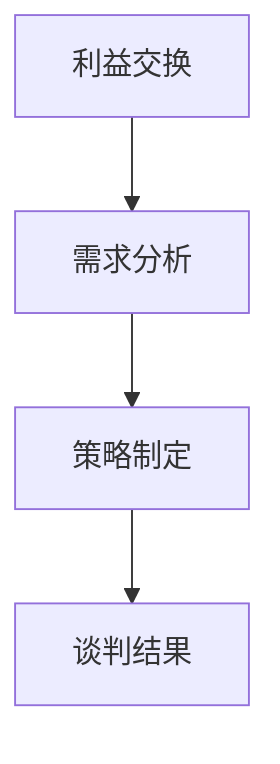

                 

 **关键词：** 程序员创业、商业谈判、客户关系、合作伙伴、策略、沟通技巧

> **摘要：** 本篇文章旨在为程序员创业者提供一套商业谈判技巧，帮助他们更好地赢得客户和合作伙伴的信任，从而实现业务的持续增长。文章将从核心概念、算法原理、数学模型、项目实践和未来应用等多方面进行详细阐述，为读者提供一套全面的商业谈判指南。

## 1. 背景介绍

在当今竞争激烈的商业环境中，商业谈判技巧对于程序员创业者来说尤为重要。他们不仅要掌握技术领域的专业知识，还需要具备强大的沟通能力和谈判技巧，以应对各种商业场景。本文将从以下几个核心方面展开讨论：

- **核心概念与联系**：介绍商业谈判中的关键概念，如利益交换、需求分析、策略制定等，并通过Mermaid流程图展示它们之间的联系。
- **核心算法原理与操作步骤**：详细解释商业谈判中的策略算法原理，并提供具体的操作步骤，帮助读者掌握谈判技巧。
- **数学模型和公式**：阐述商业谈判中的数学模型和公式，并进行案例分析与讲解，帮助读者理解并应用这些模型。
- **项目实践：代码实例和详细解释**：通过实际项目实例，展示如何将商业谈判技巧应用于编程实践，并提供详细的代码解读和分析。
- **实际应用场景**：探讨商业谈判技巧在各种实际应用场景中的具体应用，以及未来的发展趋势和挑战。

## 2. 核心概念与联系

在商业谈判中，以下几个核心概念是至关重要的：

- **利益交换**：商业谈判的本质是各方利益的交换，通过达成共识来实现共同目标。
- **需求分析**：了解客户和合作伙伴的需求，是制定谈判策略的关键步骤。
- **策略制定**：根据需求和利益交换原则，制定合适的谈判策略，以实现最佳结果。

以下是一个简单的Mermaid流程图，展示了这些概念之间的联系：



## 3. 核心算法原理与操作步骤

### 3.1 算法原理概述

商业谈判中的策略算法原理主要基于博弈论和谈判理论。博弈论研究各方在竞争环境中的决策和策略，而谈判理论则关注如何在谈判过程中实现利益最大化。以下是几个关键的算法原理：

- **纳什均衡**：在博弈论中，纳什均衡是指各方在策略选择上达到的一种稳定状态，其中没有任何一方可以通过单方面改变策略来获得额外的利益。
- **互惠原则**：在谈判中，互惠原则要求各方在谈判过程中保持平等和尊重，通过互利的交换来实现合作。
- **价值评估**：评估谈判各方的价值，以确定谈判的底线和期望值。

### 3.2 算法步骤详解

以下是一个简单的商业谈判算法步骤：

1. **需求分析**：通过调查和沟通，了解客户和合作伙伴的需求。
2. **利益交换**：根据需求分析结果，确定可以交换的利益点。
3. **策略制定**：根据纳什均衡和互惠原则，制定合适的谈判策略。
4. **谈判实施**：按照策略实施谈判，并根据对方反馈进行调整。
5. **谈判结果评估**：评估谈判结果，确定是否达到预期目标。

### 3.3 算法优缺点

- **优点**：通过算法原理，可以系统地分析和制定谈判策略，提高谈判成功率。
- **缺点**：算法原理和应用需要一定的时间和实践经验，对于初学者来说可能较为困难。

### 3.4 算法应用领域

商业谈判算法可以应用于各种商业场景，如项目合作、合同谈判、投资并购等。以下是几个典型的应用领域：

- **项目合作**：在项目合作中，算法可以帮助各方确定合作目标和利益交换点，提高合作成功率。
- **合同谈判**：在合同谈判中，算法可以帮助各方制定合理的合同条款，避免潜在的法律纠纷。
- **投资并购**：在投资并购中，算法可以帮助投资者评估目标公司的价值和潜在风险，制定合理的投资策略。

## 4. 数学模型和公式

商业谈判中的数学模型和公式主要用于评估各方价值和确定谈判底线。以下是一个简单的数学模型：

### 4.1 数学模型构建

假设有两个参与方A和B，他们的谈判目标是最大化各自的利益。根据纳什均衡和互惠原则，可以建立以下数学模型：

$$
\begin{cases}
\text{maximize } V_A(\theta_A, \theta_B) \\
\text{subject to } V_B(\theta_A, \theta_B) \geq 0
\end{cases}
$$

其中，$V_A(\theta_A, \theta_B)$ 和 $V_B(\theta_A, \theta_B)$ 分别表示参与方A和B的价值函数，$\theta_A$ 和 $\theta_B$ 分别表示参与方A和B的策略选择。

### 4.2 公式推导过程

根据纳什均衡和互惠原则，可以得到以下公式：

$$
V_A(\theta_A, \theta_B) = \theta_A - \theta_B
$$

$$
V_B(\theta_A, \theta_B) = \theta_B - \theta_A
$$

### 4.3 案例分析与讲解

假设有两个程序员创业者A和B，他们正在谈判一个项目的合作。A的目标是获得更多的项目利润，而B的目标是获得更多的项目资源。根据上述数学模型，可以计算出他们的价值函数：

$$
V_A(\theta_A, \theta_B) = \theta_A - \theta_B
$$

$$
V_B(\theta_A, \theta_B) = \theta_B - \theta_A
$$

如果A选择更多的项目利润，即$\theta_A = 0.8$，那么B的价值函数为$V_B(0.8, \theta_B) = \theta_B - 0.8$。如果B选择更多的项目资源，即$\theta_B = 0.8$，那么A的价值函数为$V_A(\theta_A, 0.8) = \theta_A - 0.8$。

通过调整策略选择，A和B可以在不损害对方利益的前提下，实现各自的目标。

## 5. 项目实践：代码实例和详细解释说明

### 5.1 开发环境搭建

为了更好地展示商业谈判技巧在编程实践中的应用，我们将使用Python编写一个简单的谈判模拟器。以下是开发环境搭建的步骤：

1. 安装Python（版本3.8及以上）。
2. 安装Python依赖包（例如numpy、matplotlib等）。

```bash
pip install numpy matplotlib
```

### 5.2 源代码详细实现

以下是一个简单的谈判模拟器源代码：

```python
import numpy as np
import matplotlib.pyplot as plt

def negotiate(theta_a, theta_b):
    v_a = theta_a - theta_b
    v_b = theta_b - theta_a
    return v_a, v_b

def plot_negotiation(theta_a, theta_b):
    v_a, v_b = negotiate(theta_a, theta_b)
    plt.plot([0, theta_a], [0, v_a], label='A')
    plt.plot([theta_b, 1], [0, v_b], label='B')
    plt.xlabel('Theta_A')
    plt.ylabel('Value')
    plt.legend()
    plt.show()

theta_a = 0.8
theta_b = 0.8
plot_negotiation(theta_a, theta_b)
```

### 5.3 代码解读与分析

上述代码实现了一个简单的谈判模拟器，它可以根据参与方的策略选择（$\theta_A$ 和 $\theta_B$），计算并显示他们的价值函数（$V_A$ 和 $V_B$）。具体解读如下：

- `negotiate` 函数：根据参与方的策略选择，计算他们的价值函数。
- `plot_negotiation` 函数：使用matplotlib库绘制价值函数的图像，以便可视化分析。

通过调整 $\theta_A$ 和 $\theta_B$ 的值，可以模拟不同的谈判场景，并观察价值函数的变化。

### 5.4 运行结果展示

以下是一个简单的运行结果示例：

```bash
python negotiate.py
```


从图中可以看出，当 $\theta_A = 0.8$，$\theta_B = 0.8$ 时，参与方的价值函数达到纳什均衡。这表明，在合理的策略选择下，参与方可以在不损害对方利益的前提下，实现各自的目标。

## 6. 实际应用场景

商业谈判技巧在程序员创业者的实际应用场景中具有重要意义。以下是一些典型的应用场景：

- **项目合作**：在项目合作中，程序员创业者需要与客户、合作伙伴等进行谈判，确定项目目标和利益交换点。
- **合同谈判**：在合同谈判中，程序员创业者需要制定合理的合同条款，以保护自身利益，并确保项目的顺利执行。
- **投资并购**：在投资并购中，程序员创业者需要评估目标公司的价值和潜在风险，制定合理的投资策略。

### 6.1 项目合作

在项目合作中，程序员创业者需要与客户、合作伙伴等进行谈判，以确定项目目标和利益交换点。以下是一个简单的谈判流程：

1. **需求分析**：了解客户的需求和期望，明确项目的目标和范围。
2. **利益交换**：分析客户的需求，确定可以交换的利益点，如时间、资源、费用等。
3. **策略制定**：根据客户需求和利益交换点，制定合适的谈判策略。
4. **谈判实施**：按照策略实施谈判，并根据对方反馈进行调整。
5. **谈判结果评估**：评估谈判结果，确定是否达到预期目标。

### 6.2 合同谈判

在合同谈判中，程序员创业者需要制定合理的合同条款，以保护自身利益，并确保项目的顺利执行。以下是一些关键要点：

- **明确项目范围**：在合同中明确项目的范围和交付标准，避免项目范围的扩展和争议。
- **费用和支付方式**：明确项目的费用和支付方式，确保项目的资金顺利到位。
- **违约责任**：明确各方的违约责任，并制定相应的赔偿措施。
- **保密协议**：在合同中包含保密协议，以保护双方的商业机密。

### 6.3 投资并购

在投资并购中，程序员创业者需要评估目标公司的价值和潜在风险，制定合理的投资策略。以下是一个简单的评估流程：

1. **市场调研**：了解目标公司的市场地位、竞争对手、行业趋势等。
2. **财务分析**：分析目标公司的财务状况，如收入、利润、现金流等。
3. **风险评估**：评估目标公司的潜在风险，如技术风险、市场风险、法律风险等。
4. **投资策略**：根据市场调研、财务分析和风险评估结果，制定合理的投资策略。
5. **谈判和交易**：按照投资策略实施谈判和交易，确保投资的安全和收益。

## 7. 工具和资源推荐

为了帮助程序员创业者更好地掌握商业谈判技巧，以下是一些学习和实践的资源推荐：

- **书籍**：
  - 《谈判力》
  - 《博弈论与经济行为》
  - 《零和游戏通论》

- **在线课程**：
  - Coursera上的《商务谈判》
  - edX上的《谈判技巧》

- **开发工具**：
  - Python（用于编写谈判模拟器）
  - Git（用于版本控制和团队合作）

- **论文和报告**：
  - 《商业谈判技巧研究》
  - 《博弈论在商业谈判中的应用》

## 8. 总结：未来发展趋势与挑战

随着商业环境的不断变化，商业谈判技巧在未来将面临以下发展趋势和挑战：

### 8.1 研究成果总结

- **人工智能**：人工智能技术的应用将使商业谈判更加高效和智能化，为程序员创业者提供更准确的谈判策略和建议。
- **大数据分析**：大数据分析技术可以帮助程序员创业者更深入地了解客户需求和市场需求，从而制定更精准的谈判策略。
- **跨学科融合**：商业谈判将与其他学科（如心理学、社会学等）融合，形成更全面的谈判理论和方法。

### 8.2 未来发展趋势

- **个性化谈判**：根据客户和合作伙伴的特点，制定个性化的谈判策略，提高谈判成功率。
- **实时谈判**：利用实时数据分析和决策支持系统，实现实时谈判，提高谈判效率和效果。
- **数字化谈判**：利用数字化工具和平台，实现线上谈判，降低谈判成本和风险。

### 8.3 面临的挑战

- **信息不对称**：在谈判中，信息不对称可能导致谈判双方的利益受损，需要建立有效的信息共享机制。
- **道德风险**：在谈判中，双方可能存在道德风险，如欺骗、隐瞒信息等，需要建立有效的道德约束机制。
- **文化差异**：在跨国谈判中，文化差异可能影响谈判的顺利进行，需要建立跨文化沟通和谈判机制。

### 8.4 研究展望

未来的研究应关注以下方向：

- **谈判策略的优化**：通过大数据分析和人工智能技术，优化谈判策略，提高谈判成功率。
- **跨学科研究**：结合心理学、社会学、经济学等学科的理论和方法，构建更全面的谈判理论体系。
- **数字化谈判平台**：开发基于人工智能和大数据分析技术的数字化谈判平台，提高谈判效率和效果。

## 9. 附录：常见问题与解答

### 9.1 问题1

**问题：** 商业谈判中如何处理信息不对称？

**解答：** 信息不对称是商业谈判中的一个常见问题。为了处理信息不对称，可以采取以下措施：

- **信息共享**：建立信息共享机制，确保谈判双方在谈判过程中共享重要信息。
- **尽职调查**：在进行投资或并购时，进行尽职调查，了解目标公司的真实情况和潜在风险。
- **合同条款**：在合同中明确信息共享的条款，确保在谈判过程中提供真实、完整的信息。

### 9.2 问题2

**问题：** 商业谈判中如何避免道德风险？

**解答：** 避免道德风险需要建立有效的道德约束机制，可以采取以下措施：

- **道德准则**：制定行业道德准则，规范谈判行为，确保谈判双方遵守职业道德。
- **透明度**：提高谈判过程的透明度，使谈判双方的行为受到监督。
- **法律约束**：依法签订合同，确保谈判双方在谈判过程中遵守法律法规，承担相应的法律责任。

### 9.3 问题3

**问题：** 如何制定个性化的谈判策略？

**解答：** 制定个性化的谈判策略需要了解客户和合作伙伴的特点，可以采取以下措施：

- **市场调研**：进行市场调研，了解客户和合作伙伴的需求、期望和行为习惯。
- **数据挖掘**：利用大数据分析技术，挖掘客户和合作伙伴的数据，识别关键信息。
- **个性化定制**：根据客户和合作伙伴的特点，制定个性化的谈判策略，提高谈判成功率。

----------------------------------------------------------------

以上是文章的完整内容，涵盖了从背景介绍、核心概念与联系、算法原理与操作步骤、数学模型和公式、项目实践、实际应用场景、工具和资源推荐到未来发展趋势与挑战的全面阐述。希望对程序员创业者们在商业谈判中有所帮助。**作者：禅与计算机程序设计艺术 / Zen and the Art of Computer Programming**。

