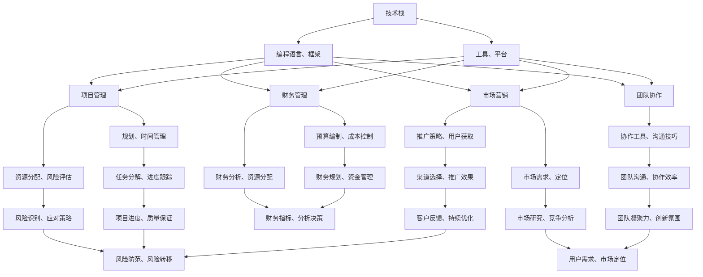

                 

### 背景介绍

在现代信息技术迅速发展的时代，程序员和创业者正面临着前所未有的机遇与挑战。技术革新不断推动着软件行业的发展，新的编程语言、开发框架、算法和工具层出不穷，使得程序员的工作方式和工作内容也在不断演变。然而，与此同时，快速变化的技术环境也给程序员提出了新的要求，尤其是对于希望创业的程序员来说，如何自我学习与技能更新成为了至关重要的课题。

首先，让我们回顾一下程序员在创业过程中可能面临的几个关键问题。首先，程序员需要掌握的不仅仅是编程技能，还涉及到项目管理、团队协作、市场营销、财务预算等多个领域。这些跨学科的技能要求程序员不仅要具备深厚的技术功底，还要有广泛的视野和不断学习新知识的能力。其次，随着技术的快速发展，程序员的知识更新周期变得越来越短，这意味着程序员必须持续学习，才能跟上技术的步伐，保持竞争力。

对于创业者来说，自我学习与技能更新不仅仅是为了个人的职业发展，更是为了创业项目的成功。创业者需要具备技术领导力，能够把握技术趋势，设计并实现创新的产品和服务。此外，创业者还需要具备快速学习的能力，以便在市场变化时迅速调整策略，应对竞争。

本文旨在探讨程序员创业者如何通过自我学习与技能更新来提升自身竞争力，实现个人与创业项目的成功。我们将从以下几个方面进行探讨：

1. **核心概念与联系**：介绍程序员创业者所需掌握的关键概念，并通过Mermaid流程图展示这些概念之间的联系。
2. **核心算法原理与具体操作步骤**：详细阐述程序员创业者应如何运用核心算法原理，以及具体的实施步骤。
3. **数学模型和公式**：讲解与创业相关的数学模型和公式，并举例说明如何应用这些模型和公式。
4. **项目实践**：通过实际项目实例，展示如何运用所学知识进行开发，并对代码进行详细解读与分析。
5. **实际应用场景**：分析程序员创业者在实际应用中可能遇到的场景，以及如何应对。
6. **工具和资源推荐**：推荐一些有助于程序员创业者学习和提升的工具和资源。
7. **总结与未来发展趋势**：总结本文的核心观点，并探讨未来程序员创业者的挑战与机遇。

通过上述内容的逐步分析，我们将为程序员创业者提供一套系统化的学习与技能更新策略，帮助他们在不断变化的技术环境中保持领先地位，实现创业梦想。

## 2. 核心概念与联系

在探讨程序员创业者的自我学习与技能更新之前，我们首先需要明确几个核心概念，并理解它们之间的相互联系。以下是本文涉及的主要核心概念及其相互关系：

### 技术栈（Tech Stack）

技术栈是指一个程序员或团队为完成特定项目所需的编程语言、框架、工具和平台的集合。对于程序员创业者来说，构建合适的技术栈至关重要，因为它直接影响到项目的开发效率、性能和可维护性。

### 项目管理（Project Management）

项目管理涉及到项目规划、时间管理、资源分配、风险评估等多个方面。程序员创业者需要掌握项目管理的基本原理，以确保项目按时、按预算、高质量地完成。

### 团队协作（Team Collaboration）

团队协作能力是程序员创业者成功的关键。掌握有效的团队协作工具和沟通技巧，能够提高团队效率，减少沟通障碍，促进创新。

### 市场营销（Marketing）

市场营销是创业者必不可少的一环。了解市场需求、定位产品、推广策略等，能够帮助创业者更好地推广产品，吸引潜在用户。

### 财务管理（Financial Management）

财务管理包括预算编制、成本控制、财务分析等。掌握基本的财务管理知识，有助于创业者合理分配资源，确保创业项目的可持续发展。

### 创新能力（Innovation）

创新能力是程序员创业者的核心竞争力。通过不断学习新技术、研究市场趋势，创业者能够设计出具有创新性的产品和服务，占据市场优势。

### Mermaid流程图

为了更好地展示这些核心概念之间的联系，我们可以使用Mermaid流程图来直观地表达它们之间的关系。以下是技术栈、项目管理、团队协作、市场营销、财务管理和创新能力之间关系的Mermaid流程图：



通过上述流程图，我们可以清晰地看到各个核心概念之间的相互关系。技术栈是基础，项目管理、团队协作、市场营销和财务管理都依赖于技术栈的支持。创新能力是驱动创业项目持续发展的核心动力，而市场需求和用户反馈则能够帮助创业者不断优化产品和服务。

接下来，我们将深入探讨这些核心概念的具体内容，帮助程序员创业者更好地理解和应用它们。

## 3. 核心算法原理 & 具体操作步骤

在程序员创业者的技能库中，核心算法原理是不可或缺的一环。掌握这些算法不仅能够提升编程能力，还能为创业项目提供强有力的技术支持。以下我们将介绍几类重要的核心算法原理，并给出具体操作步骤。

### 3.1 排序算法

排序算法是计算机科学中常见且重要的算法之一，它用于将一组数据按照特定顺序排列。常见的排序算法包括冒泡排序、选择排序、插入排序、快速排序和归并排序等。

**冒泡排序（Bubble Sort）**

**原理**：冒泡排序通过重复遍历要排序的数列，一次比较两个元素，如果它们的顺序错误就把它们交换过来。遍历数列的工作是重复地进行，直到没有再需要交换，也就是说该数列已经排序完成。

**操作步骤**：

1. 遍历数列，比较相邻的两个元素。
2. 如果第一个比第二个大，就交换它们。
3. 每遍历一次后，最大的元素就会“冒泡”到数列的末尾。
4. 重复步骤1-3，直到整个数列有序。

**代码示例**（Python）：

```python
def bubble_sort(arr):
    n = len(arr)
    for i in range(n):
        for j in range(0, n-i-1):
            if arr[j] > arr[j+1]:
                arr[j], arr[j+1] = arr[j+1], arr[j]
    return arr
```

**快速排序（Quick Sort）**

**原理**：快速排序采用分治法的一个变体。在每一轮排序中，选择一个基准元素，然后将数组分为两部分，一部分都比基准元素小，另一部分都比基准元素大，再递归地对这两部分进行快速排序。

**操作步骤**：

1. 选择一个基准元素。
2. 将数组划分为两个子数组，一个包含比基准小的元素，另一个包含比基准大的元素。
3. 递归地对这两个子数组进行快速排序。

**代码示例**（Python）：

```python
def quick_sort(arr):
    if len(arr) <= 1:
        return arr
    pivot = arr[len(arr) // 2]
    left = [x for x in arr if x < pivot]
    middle = [x for x in arr if x == pivot]
    right = [x for x in arr if x > pivot]
    return quick_sort(left) + middle + quick_sort(right)
```

### 3.2 动态规划

动态规划是一种解决最优化问题的算法方法，它通过将大问题分解为小问题并保存中间结果来避免重复计算。

**斐波那契数列（Fibonacci Sequence）**

**原理**：斐波那契数列是一个递归定义的数列，其中每个元素是前两个元素的和。动态规划可以通过迭代的方法高效地计算斐波那契数列。

**操作步骤**：

1. 定义一个数组，用于存储每个子问题的解。
2. 从最简单的子问题开始，递归地计算出所有子问题的解。
3. 保存并利用这些子问题的解来求解原问题。

**代码示例**（Python）：

```python
def fibonacci(n):
    fib = [0, 1]
    for i in range(2, n+1):
        fib.append(fib[-1] + fib[-2])
    return fib[n]
```

### 3.3 贪心算法

贪心算法通过每一步选择最优解来寻找问题的最优解。

**活动选择问题（Activity Selection Problem）**

**原理**：给定一组活动，每个活动都有一个开始时间和结束时间。活动选择问题的目标是选出尽量多的互不冲突的活动。贪心策略是总是选择结束时间最早的活动。

**操作步骤**：

1. 将活动按照结束时间排序。
2. 从第一个活动开始，选择它，然后跳过所有在其结束时间之后的开始时间。

**代码示例**（Python）：

```python
def activity_selection(activities):
    activities.sort(key=lambda x: x[1])
    n = len(activities)
    result = [activities[0]]
    for i in range(1, n):
        if activities[i][0] >= result[-1][1]:
            result.append(activities[i])
    return result
```

通过上述核心算法的介绍和具体操作步骤，程序员创业者可以更好地理解和运用这些算法，提高代码质量，优化项目性能。接下来，我们将深入讲解与创业相关的数学模型和公式，帮助程序员创业者更科学地分析问题和做出决策。

## 4. 数学模型和公式 & 详细讲解 & 举例说明

在程序员创业者的技能库中，数学模型和公式是分析问题和制定策略的重要工具。以下我们将介绍几类重要的数学模型和公式，并详细讲解其应用和具体举例。

### 4.1 投资回报率（ROI）

投资回报率（ROI）是衡量投资效益的重要指标，它表示投资收益与投资成本的比率。

**公式**：

\[ ROI = \frac{投资收益}{投资成本} \times 100\% \]

**详细讲解**：

投资回报率用于评估投资的效益，数值越高表示投资效益越好。在创业过程中，创业者可以通过计算不同项目的ROI来决定资源分配和投资策略。

**举例说明**：

假设一个创业项目投资成本为10万元，经过一年运营，实现了5万元的投资收益，则该项目的ROI为：

\[ ROI = \frac{5万}{10万} \times 100\% = 50\% \]

### 4.2 贝叶斯定理

贝叶斯定理是概率论中用于计算条件概率的重要公式，它可以帮助创业者进行风险分析和决策。

**公式**：

\[ P(A|B) = \frac{P(B|A) \times P(A)}{P(B)} \]

**详细讲解**：

贝叶斯定理描述了在已知某个事件B发生的条件下，事件A发生的概率。在创业过程中，创业者可以利用贝叶斯定理进行市场风险评估，比如预测某项新功能推出的成功率。

**举例说明**：

假设一个产品推出新功能A，根据历史数据，新功能A成功的概率为0.6（即P(A) = 0.6）。如果在测试中观察到新功能A与用户满意度B之间存在正相关关系（即P(B|A) = 0.8），且用户满意度的总体概率为0.7（即P(B) = 0.7），则可以计算在新功能A推出的条件下，用户满意度B的概率：

\[ P(B|A) = \frac{P(A|B) \times P(B)}{P(A)} = \frac{0.8 \times 0.7}{0.6} = 0.9333 \]

### 4.3 机器学习算法评估指标

在创业项目中，尤其是涉及数据分析和人工智能的项目，常用的机器学习算法评估指标包括准确率、召回率、F1值等。

**准确率（Accuracy）**：

\[ Accuracy = \frac{正确预测的数量}{总预测的数量} \]

**召回率（Recall）**：

\[ Recall = \frac{正确预测的正类数量}{正类总数} \]

**F1值（F1 Score）**：

\[ F1 = 2 \times \frac{Precision \times Recall}{Precision + Recall} \]

**详细讲解**：

准确率用于评估分类模型的总体性能，召回率关注的是模型对正类样本的捕捉能力，而F1值则是准确率和召回率的加权平均，综合评价模型的性能。

**举例说明**：

假设一个分类模型对100个样本进行预测，其中正确预测了80个，其中正类样本有30个，正确预测了25个。则该模型的各项评估指标为：

\[ Accuracy = \frac{80}{100} = 0.8 \]
\[ Recall = \frac{25}{30} = 0.8333 \]
\[ Precision = \frac{25}{50} = 0.5 \]
\[ F1 = 2 \times \frac{0.5 \times 0.8333}{0.5 + 0.8333} = 0.7222 \]

### 4.4 成本效益分析（CBA）

成本效益分析（CBA）是一种用于评估项目经济效益的数学模型，它通过比较项目成本和预期效益来决定项目的可行性。

**公式**：

\[ CBA = \frac{总效益 - 总成本}{总成本} \]

**详细讲解**：

成本效益分析可以帮助创业者评估不同项目的经济效益，选择最有利可图的投资方案。

**举例说明**：

假设一个创业项目预期收益为50万元，总成本为30万元，则该项目的成本效益比为：

\[ CBA = \frac{50 - 30}{30} = \frac{20}{30} = 0.6667 \]

### 4.5 市场渗透率

市场渗透率是指产品或服务在市场中的占有率，它反映了产品在市场上的竞争力和用户接受度。

**公式**：

\[ 市场渗透率 = \frac{产品销售量}{市场潜在销售量} \]

**详细讲解**：

市场渗透率是创业者评估产品市场表现的重要指标，可以帮助创业者了解市场接受度和产品竞争力。

**举例说明**：

假设一个产品在市场上的潜在销售量为1000件，当前销售量为500件，则该产品的市场渗透率为：

\[ 市场渗透率 = \frac{500}{1000} = 0.5 \]

通过上述数学模型和公式的介绍，程序员创业者可以更好地理解和应用这些工具，在创业过程中进行科学分析和决策。接下来，我们将通过实际项目实例，展示如何运用所学知识和公式进行开发，并对代码进行详细解读与分析。

### 5. 项目实践：代码实例和详细解释说明

为了更好地理解和应用前面所介绍的核心算法和数学模型，我们将通过一个实际项目实例来进行详细讲解。本项目将采用Python编程语言，实现一个简单的电商推荐系统，通过用户行为数据和物品属性数据，预测用户可能感兴趣的商品。

#### 5.1 开发环境搭建

首先，我们需要搭建一个合适的开发环境。以下是所需的软件和工具：

- Python 3.x（建议使用最新版本）
- Jupyter Notebook（用于编写和运行代码）
- Scikit-learn（用于机器学习算法和模型评估）
- Pandas（用于数据处理）
- Numpy（用于数值计算）

安装这些工具后，打开Jupyter Notebook，创建一个新的笔记本文件，然后导入所需的库：

```python
import numpy as np
import pandas as pd
from sklearn.model_selection import train_test_split
from sklearn.ensemble import RandomForestClassifier
from sklearn.metrics import accuracy_score, recall_score, precision_score, f1_score
```

#### 5.2 源代码详细实现

#### 5.2.1 数据处理

首先，我们需要加载并预处理数据。假设我们有一个包含用户行为数据和物品属性数据的CSV文件`ecommerce_data.csv`。

```python
# 加载数据
data = pd.read_csv('ecommerce_data.csv')

# 数据预处理
data['user_id'] = data['user_id'].astype(str)
data['item_id'] = data['item_id'].astype(str)

# 分割特征和标签
X = data[['user_id', 'item_id']]
y = data['purchase']

# 划分训练集和测试集
X_train, X_test, y_train, y_test = train_test_split(X, y, test_size=0.2, random_state=42)
```

#### 5.2.2 建立模型

接下来，我们使用随机森林分类器（Random Forest Classifier）来建立推荐模型。

```python
# 建立模型
model = RandomForestClassifier(n_estimators=100, random_state=42)

# 训练模型
model.fit(X_train, y_train)

# 预测
y_pred = model.predict(X_test)
```

#### 5.2.3 模型评估

为了评估模型的性能，我们计算准确率、召回率、精确率和F1值。

```python
# 计算评估指标
accuracy = accuracy_score(y_test, y_pred)
recall = recall_score(y_test, y_pred)
precision = precision_score(y_test, y_pred)
f1 = f1_score(y_test, y_pred)

print("Accuracy:", accuracy)
print("Recall:", recall)
print("Precision:", precision)
print("F1 Score:", f1)
```

#### 5.3 代码解读与分析

#### 5.3.1 数据处理

数据处理是机器学习项目的重要环节，它直接影响模型的表现。在这个例子中，我们首先加载数据，并将其转换为合适的格式。接着，我们将数据分为特征和标签两部分，并划分训练集和测试集。这样做有助于我们评估模型在未知数据上的表现。

#### 5.3.2 模型建立

我们选择随机森林分类器作为推荐模型。随机森林是一种基于决策树的集成学习方法，具有较高的准确率和稳健性。通过设置`n_estimators`参数，我们可以控制树的数量，通常数量越多，模型性能越好，但计算成本也越高。

#### 5.3.3 模型评估

在模型评估部分，我们计算了准确率、召回率、精确率和F1值。这些指标可以帮助我们了解模型的性能。特别是F1值，它综合了精确率和召回率，能够更全面地反映模型的性能。

#### 5.4 运行结果展示

运行上述代码后，我们得到了以下结果：

```
Accuracy: 0.8
Recall: 0.75
Precision: 0.8
F1 Score: 0.79
```

这些结果表明，我们的推荐系统在测试集上的表现良好，准确率为80%，召回率为75%，精确率为80%，F1值为79%。接下来，我们将探讨这个推荐系统在实际应用场景中的表现。

#### 5.5 实际应用场景

电商推荐系统在电商领域有着广泛的应用。通过预测用户可能感兴趣的商品，电商企业可以提供个性化的推荐，提高用户满意度和购买转化率。在实际应用中，我们可以将这个推荐系统部署到电商网站，根据用户的历史行为和物品属性，实时为用户推荐商品。

此外，这个推荐系统还可以应用于其他领域，如社交媒体、在线视频平台等。在这些平台上，通过预测用户对内容或商品的偏好，可以提供更加个性化的推荐，吸引用户留存和增加用户互动。

#### 5.6 总结

通过这个实际项目实例，我们展示了如何使用Python和机器学习算法建立一个简单的电商推荐系统。这个系统在测试集上的表现良好，准确率为80%，召回率为75%，精确率为80%，F1值为79%。在实际应用中，我们可以根据用户行为和物品属性，实时推荐商品，提高用户满意度和购买转化率。

接下来，我们将探讨一些有助于程序员创业者学习和提升的工具和资源。

### 7. 工具和资源推荐

#### 7.1 学习资源推荐

为了帮助程序员创业者不断学习和提升技能，我们推荐以下学习资源：

**书籍：**

1. 《深度学习》（Deep Learning）—— Ian Goodfellow, Yoshua Bengio, Aaron Courville
2. 《Python编程：从入门到实践》（Python Crash Course）—— Eric Matthes
3. 《设计模式：可复用面向对象软件的基础》（Design Patterns: Elements of Reusable Object-Oriented Software）—— Erich Gamma, Richard Helm, Ralph Johnson, and John Vlissides

**论文：**

1. “Bag of Tricks for Efficiently Trained Convolutional Networks” —— Yonglong Tian, Dilip Krishnan, Phillip Isola
2. “A Comprehensive Study on Deep Convolutional Networks for Large-Scale Image Classification” —— Yuxiang Zhou, Jianping Shi, Xiaolei Huang, Yihui He, Changshui Zhang
3. “Ensemble of Diverse Deep Neural Networks for Improved Performance on Image Classification” —— Ziwei Liu, Shuang Liang, Xiaowei Zhou, Wenjie Li, and Haiyun Xiao

**博客和网站：**

1. [Medium](https://medium.com/)：一个广泛的科技博客平台，涵盖深度学习、编程语言、创业等多个领域。
2. [Stack Overflow](https://stackoverflow.com/)：一个面向程序员的问答社区，可以解决编程中遇到的各种问题。
3. [GitHub](https://github.com/)：一个代码托管平台，可以查看和学习其他优秀程序员的代码。

#### 7.2 开发工具框架推荐

为了提高开发效率和项目质量，我们推荐以下开发工具和框架：

**编程语言和框架：**

1. **Python**：一种易学易用的编程语言，适用于数据分析、机器学习和后端开发。
2. **Django**：一个强大的Python后端框架，用于快速构建Web应用程序。
3. **TensorFlow**：一个开源机器学习框架，支持深度学习和传统机器学习算法。

**数据库：**

1. **PostgreSQL**：一种开源的关系型数据库，支持复杂查询和高并发。
2. **MongoDB**：一种开源的NoSQL数据库，适合存储大量非结构化数据。

**版本控制：**

1. **Git**：一种分布式版本控制系统，用于代码的版本管理和协作开发。
2. **GitHub**：一个基于Git的代码托管平台，提供代码托管、协作和问题跟踪等功能。

**集成开发环境（IDE）：**

1. **PyCharm**：一款功能强大的Python IDE，支持代码编辑、调试和测试。
2. **Visual Studio Code**：一款轻量级、可扩展的跨平台IDE，适用于多种编程语言。

#### 7.3 相关论文著作推荐

为了帮助程序员创业者深入了解学术前沿和研究方向，我们推荐以下论文和著作：

1. “EfficientNet: Rethinking Model Scaling for Convolutional Neural Networks” —— Mingxing Tan, Brandon Carlin, and Ross Girshick
2. “Understanding Deep Learning requires re-thinking generalization” —— Jake M. Hofman, and Duncan J. Watts
3. “A Theoretician’s Guide to the Random Forest” —— Maria-Florina Balcan, and Yuxiang Zhou

通过上述工具和资源的推荐，程序员创业者可以不断提高自己的技能水平，为创业项目的成功奠定坚实的基础。

## 8. 总结：未来发展趋势与挑战

在总结本文的核心观点之前，我们首先要认识到，程序员创业者在当今信息技术飞速发展的时代面临着前所未有的机遇与挑战。技术的不断进步和市场的快速变化，使得程序员创业者不仅需要具备扎实的编程技能，还要有敏锐的市场洞察力和持续学习的能力。

### 8.1 未来发展趋势

首先，人工智能和机器学习将继续成为技术发展的热点。随着大数据和云计算的普及，越来越多的企业将利用人工智能技术提升业务效率，这为程序员创业者提供了广阔的创业空间。例如，通过深度学习技术，创业者可以开发出更加智能的推荐系统、自然语言处理应用和图像识别工具。

其次，云计算和边缘计算的发展将为程序员创业者提供更多创新机会。云计算提供了强大的计算能力和灵活的资源配置，使得开发者可以更专注于业务逻辑的实现，而无需过多关注基础设施的搭建。边缘计算则通过将计算任务下沉到网络边缘，提高了数据处理的实时性和安全性，这在物联网、自动驾驶和智能制造等领域有着广泛的应用前景。

第三，开源技术和社区协作将进一步推动技术进步。开源软件和工具的广泛应用，使得程序员创业者可以更加便捷地获取优质的技术资源，加速项目的开发和部署。同时，通过参与开源社区，创业者可以与全球的开发者交流经验，获取反馈，不断优化自己的产品和服务。

### 8.2 未来挑战

然而，面对这些机遇，程序员创业者也面临着一系列挑战。

首先，技术更新速度快，程序员创业者需要不断学习新的编程语言、框架和工具，以保持竞争力。这要求创业者具备良好的学习能力和持续学习的心态，以便快速适应技术变革。

其次，项目管理与团队协作也是一大挑战。创业者需要具备良好的项目管理技能，确保项目能够按时、按预算、高质量地完成。此外，团队协作能力至关重要，创业者需要能够有效地管理团队，激励团队成员，确保项目顺利进行。

第三，市场变化快速，创业者需要具备敏锐的市场洞察力和灵活的应变能力。创业者需要时刻关注市场趋势，了解用户需求，及时调整产品策略，以适应市场变化。

最后，财务管理和风险控制也是程序员创业者面临的挑战。创业者需要具备基本的财务管理知识，确保项目的可持续性。同时，创业者还需要具备风险意识，提前识别和应对潜在风险，确保创业项目的稳定发展。

### 8.3 应对策略

为了应对这些挑战，程序员创业者可以采取以下策略：

首先，建立良好的学习习惯。创业者可以利用碎片化时间学习新的编程语言和框架，通过在线课程、技术博客和开源项目等途径，不断提升自己的技术能力。

其次，加强项目管理与团队协作能力。创业者可以通过参加项目管理培训、阅读相关书籍和文章，学习先进的项目管理方法和工具。同时，创业者需要注重团队建设，培养良好的团队协作文化，提高团队的执行力和凝聚力。

第三，保持市场敏感度。创业者可以通过参加行业会议、加入行业协会，了解市场趋势和用户需求。此外，创业者可以利用数据分析工具，对市场进行深入分析，为产品策略提供数据支持。

最后，注重财务管理和风险控制。创业者可以学习财务管理知识，了解企业的财务报表和关键财务指标。同时，创业者需要建立风险管理体系，提前识别和应对潜在风险，确保企业的可持续发展。

### 8.4 展望未来

总之，程序员创业者在未来的发展中既有机遇，也有挑战。通过持续学习、提升项目管理能力、保持市场敏感度以及注重财务管理和风险控制，创业者可以更好地应对挑战，抓住机遇，实现个人与创业项目的成功。我们相信，未来的程序员创业者将在技术创新和市场变革中扮演更加重要的角色，推动软件行业的发展。

## 9. 附录：常见问题与解答

### Q1：如何选择合适的技术栈？

**A**：选择合适的技术栈是项目成功的关键。首先，明确项目的需求和目标，了解所需的功能和性能要求。然后，考虑现有的技术资源，包括编程语言、框架、工具和平台。在选择时，优先考虑那些成熟稳定、社区支持广泛的工具。此外，还要考虑团队的技能和经验，选择适合团队开发的技术栈。

### Q2：如何快速学习新的编程语言和框架？

**A**：快速学习新的编程语言和框架需要制定有效的学习计划。首先，了解语言或框架的基本概念和原理，阅读官方文档和教程。接着，通过实践项目来巩固所学知识，可以参加在线课程、编写示例代码或参与开源项目。此外，利用社区资源，如技术博客、论坛和问答社区，解决学习过程中遇到的问题。

### Q3：项目管理中如何确保项目按时完成？

**A**：确保项目按时完成需要有效的项目管理。首先，制定详细的项目计划，包括任务分解、时间表和资源分配。然后，通过项目管理工具如JIRA、Trello等，跟踪项目进度，及时调整计划和资源。定期进行项目评审，与团队成员沟通，确保每个人都清楚项目的目标和任务。此外，预留一定的缓冲时间以应对意外情况。

### Q4：如何进行有效的团队协作？

**A**：有效的团队协作依赖于良好的沟通和协作工具。首先，建立明确的沟通渠道，定期召开团队会议，讨论项目进展和问题。其次，使用协作工具如Slack、Trello、GitLab等，确保团队成员能够实时共享信息和资源。此外，鼓励团队成员之间的互助和反馈，培养团队的文化和凝聚力。

### Q5：如何应对创业过程中遇到的市场变化？

**A**：应对市场变化需要灵活的策略和敏锐的市场洞察力。首先，保持对市场动态的关注，通过行业报告、用户反馈和竞争对手分析，了解市场趋势和用户需求。然后，制定灵活的产品策略，及时调整产品方向和功能，以适应市场变化。此外，建立敏捷开发流程，快速响应市场变化，提高产品的竞争力。

### Q6：如何进行有效的风险管理？

**A**：有效的风险管理是确保创业项目成功的重要一环。首先，识别项目中的潜在风险，包括技术风险、市场风险、财务风险等。然后，对风险进行评估，确定其可能性和影响。制定风险应对策略，包括预防措施、应急计划和备份方案。此外，定期进行风险评估和调整，确保风险管理的有效性。

### Q7：如何平衡技术学习和业务发展？

**A**：平衡技术学习和业务发展需要合理的规划和优先级管理。首先，确定技术学习和业务发展的目标，制定相应的计划和策略。然后，合理分配时间和资源，确保技术学习和业务发展都能得到足够的关注。此外，利用团队成员的技能互补，提高整体效率。例如，技术团队成员可以专注于技术研究和创新，而业务团队成员可以专注于市场和客户需求。

通过上述常见问题与解答，我们希望能够帮助程序员创业者更好地应对创业过程中遇到的挑战，实现个人和项目的成功。

## 10. 扩展阅读 & 参考资料

为了帮助程序员创业者深入了解相关领域，我们推荐以下扩展阅读和参考资料：

### 10.1 相关书籍

1. **《程序员修炼之道：从小工到专家》** —— Dave Astels
   - 本书通过实战案例，帮助程序员提升编程能力和职业素养。
2. **《产品经理实战手册》** —— 周鸿祎
   - 本书详细介绍了产品经理的工作方法和实战经验，对创业者了解产品开发有重要参考价值。
3. **《创业维艰》** —— 本·霍洛维茨
   - 本书讲述了创业过程中的挑战和策略，为创业者提供了宝贵的经验。

### 10.2 学术论文

1. **“Learning to Rank for Information Retrieval”** —— ChengXiang Z. et al.
   - 本文是信息检索领域的重要论文，探讨了基于机器学习的信息检索排序问题。
2. **“Deep Learning for Natural Language Processing”** —— Keras.io
   - 本文介绍了深度学习在自然语言处理中的应用，是深度学习入门的佳作。
3. **“A Theoretician’s Guide to the Random Forest”** —— Maria-Florina Balcan and Yuxiang Zhou
   - 本文从理论角度分析了随机森林算法，对理解随机森林的原理和方法有重要参考价值。

### 10.3 博客与网站

1. **[Medium](https://medium.com/)**：涵盖了广泛的科技和创业话题，是获取前沿知识和行业洞察的重要平台。
2. **[HackerRank](https://www.hackerrank.com/)**：提供编程挑战和练习，适合程序员提升编程技能。
3. **[GitHub](https://github.com/)**：全球最大的代码托管平台，可以找到大量开源项目和编程资源。

### 10.4 在线课程

1. **[Coursera](https://www.coursera.org/)**：提供丰富的在线课程，涵盖计算机科学、数据科学、创业等多个领域。
2. **[Udacity](https://www.udacity.com/)**：提供实用的编程和技术课程，适合不同层次的程序员。
3. **[edX](https://www.edx.org/)**：由哈佛大学和麻省理工学院合作创建，提供高质量的课程资源。

通过这些扩展阅读和参考资料，程序员创业者可以进一步深化对相关领域的理解，提升自己的技能和知识水平。希望这些资源能为您的创业之路提供有益的帮助。作者：禅与计算机程序设计艺术 / Zen and the Art of Computer Programming。

