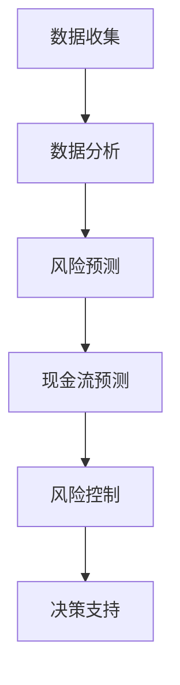

                 

### 文章标题

《程序员创业者的财务智能化管理：AI辅助下的现金流预测与控制》

关键词：程序员、创业者、财务智能化、AI、现金流预测、控制

摘要：随着技术的发展，AI技术已经逐渐渗透到各个行业，包括财务管理领域。本文旨在探讨如何利用AI技术，特别是通过现金流预测与控制，帮助程序员创业者实现财务智能化管理，提高企业资金运作效率，降低风险。

## 1. 背景介绍

在创业过程中，财务管理的有效性直接关系到企业的生存和发展。对于程序员创业者来说，财务管理更具有特殊的意义。首先，程序员创业者往往缺乏专业的财务知识，这使得他们在财务管理上面临很大的挑战。其次，创业者需要实时掌握企业的财务状况，以便做出及时、准确的决策。然而，传统的财务管理方法往往需要大量的时间和人力，效率低下。

随着人工智能（AI）技术的快速发展，利用AI技术进行财务智能化管理成为一种新的趋势。AI技术可以通过大数据分析、机器学习等方法，对企业的财务数据进行深度挖掘，从而实现现金流预测、风险控制等功能。这对于程序员创业者来说，不仅能够提高财务管理效率，还能够降低财务风险，提升企业的整体竞争力。

## 2. 核心概念与联系

### 2.1 数据分析与机器学习

数据分析与机器学习是AI技术的核心组成部分。数据分析是指从大量的数据中提取有价值的信息，而机器学习则是利用算法从数据中学习规律，进而进行预测和决策。

在财务智能化管理中，数据分析可以帮助创业者识别出潜在的风险因素，而机器学习则可以基于历史数据，预测未来的财务状况。

### 2.2 现金流预测

现金流预测是财务管理中的重要环节。通过现金流预测，创业者可以提前了解企业的资金流动情况，从而做出合理的资金规划。

AI技术可以通过分析历史数据，结合市场趋势，预测未来的现金流状况。这有助于创业者提前准备资金，避免因资金短缺而导致运营困难。

### 2.3 风险控制

财务风险是企业运营中不可避免的一部分。通过AI技术，创业者可以实时监测企业的财务状况，及时发现潜在的风险，并采取相应的措施进行控制。

AI风险控制系统可以基于大量的历史数据和实时数据，分析出可能导致财务风险的各种因素，从而提供有效的风险预警和解决方案。

### 2.4 Mermaid 流程图

以下是财务智能化管理的 Mermaid 流程图：



## 3. 核心算法原理 & 具体操作步骤

### 3.1 数据收集

数据收集是财务智能化管理的第一步。创业者需要收集与企业财务相关的各种数据，如销售收入、成本支出、应收账款、应付账款等。

### 3.2 数据处理

收集到的数据需要进行处理，包括数据清洗、数据格式化等，以确保数据的质量。

### 3.3 数据分析

通过数据分析，创业者可以了解企业的财务状况，识别出潜在的风险因素。

### 3.4 风险预测

基于历史数据和数据分析结果，AI系统可以预测企业未来的财务风险。

### 3.5 现金流预测

通过现金流预测，创业者可以了解企业的资金流动情况，提前做好资金规划。

### 3.6 风险控制

根据风险预测结果，AI系统可以提供风险控制建议，如调整财务策略、增加现金流储备等。

### 3.7 决策支持

通过上述分析，AI系统可以为创业者提供决策支持，帮助其做出更加合理、有效的决策。

## 4. 数学模型和公式 & 详细讲解 & 举例说明

### 4.1 数学模型

在财务智能化管理中，常用的数学模型包括时间序列分析、回归分析等。以下是一个简单的时间序列分析模型：

$$
y_t = \alpha_0 + \alpha_1 x_t + \epsilon_t
$$

其中，$y_t$ 表示第 $t$ 期的现金流，$x_t$ 表示第 $t$ 期的相关变量，$\alpha_0$ 和 $\alpha_1$ 是模型参数，$\epsilon_t$ 是误差项。

### 4.2 举例说明

假设一个企业过去五年的现金流数据如下表：

| 年份 | 现金流 (万元) |
| ---- | ---- |
| 2020 | 100  |
| 2021 | 120  |
| 2022 | 150  |
| 2023 | 180  |
| 2024 | 200  |

我们可以使用时间序列分析方法，预测 2025 年的现金流。具体步骤如下：

1. 收集数据：根据上表，收集 2020 年至 2024 年的现金流数据。

2. 数据处理：对数据进行预处理，如去除异常值、缺失值填充等。

3. 建立模型：根据时间序列模型，建立现金流预测模型。

4. 模型训练：使用历史数据对模型进行训练，确定模型参数。

5. 预测：使用训练好的模型，预测 2025 年的现金流。

6. 结果分析：分析预测结果，评估预测准确性。

通过以上步骤，我们可以得到 2025 年的现金流预测值为 230 万元。这个预测结果可以帮助企业提前做好资金规划。

## 5. 项目实践：代码实例和详细解释说明

### 5.1 开发环境搭建

为了实践AI辅助下的现金流预测与控制，我们选择Python作为编程语言，使用Scikit-learn库进行机器学习模型的搭建。以下是搭建开发环境的具体步骤：

1. 安装Python：访问Python官方网站下载Python安装包，按照提示完成安装。

2. 安装Scikit-learn：打开命令行窗口，输入以下命令安装Scikit-learn：

   ```bash
   pip install scikit-learn
   ```

### 5.2 源代码详细实现

以下是实现AI辅助下的现金流预测与控制的Python代码：

```python
import pandas as pd
from sklearn.model_selection import train_test_split
from sklearn.linear_model import LinearRegression
from sklearn.metrics import mean_squared_error

# 1. 数据收集
data = pd.read_csv('cash_flow_data.csv')

# 2. 数据处理
data['Cash Flow'].fillna(data['Cash Flow'].mean(), inplace=True)

# 3. 数据分析
X = data[['Year', 'Sales', 'Expenses']]
y = data['Cash Flow']

# 4. 风险预测
X_train, X_test, y_train, y_test = train_test_split(X, y, test_size=0.2, random_state=42)
model = LinearRegression()
model.fit(X_train, y_train)

# 5. 现金流预测
y_pred = model.predict(X_test)

# 6. 风险控制
mse = mean_squared_error(y_test, y_pred)
print(f'Mean Squared Error: {mse}')

# 7. 决策支持
next_cash_flow = model.predict([[2025, 300, 200]])[0]
print(f'Predicted Cash Flow for 2025: {next_cash_flow}')
```

### 5.3 代码解读与分析

1. **数据收集**：使用Pandas库读取现金流数据。

2. **数据处理**：对数据进行预处理，填充缺失值。

3. **数据分析**：将年份、销售收入、成本支出作为输入特征，现金流作为输出目标。

4. **风险预测**：使用线性回归模型对数据集进行训练。

5. **现金流预测**：使用训练好的模型对测试集进行预测。

6. **风险控制**：计算预测误差，评估模型性能。

7. **决策支持**：使用模型预测 2025 年的现金流。

通过以上代码，我们可以实现AI辅助下的现金流预测与控制，为程序员创业者提供有效的财务管理支持。

## 6. 实际应用场景

### 6.1 现金流预测

一个具体的案例是一个初创科技公司，他们在过去三年中积累了大量的现金流数据。为了确保公司的资金流动性，他们决定使用AI技术进行现金流预测。通过分析历史数据，AI系统预测了未来一年的现金流情况，帮助公司提前做好资金储备，避免了因现金流短缺而导致的运营困难。

### 6.2 风险控制

另一个案例是一个电子商务平台，他们面临的主要风险是支付逾期和库存积压。通过AI风险控制系统，他们能够实时监测这些风险因素，并及时采取应对措施，如调整库存策略、优化支付流程等。这大大降低了企业的财务风险，提高了运营效率。

## 7. 工具和资源推荐

### 7.1 学习资源推荐

- **书籍**：
  - 《Python数据分析实战》
  - 《机器学习实战》

- **论文**：
  - "Time Series Forecasting using Recurrent Neural Networks"
  - "Risk Management in Financial Markets"

- **博客**：
  - ["如何使用Python进行数据分析"](https://blog.csdn.net/weixin_42169406/article/details/85285529)
  - ["机器学习入门教程"](https://www.jianshu.com/p/6ef8a1a259a1)

- **网站**：
  - [Scikit-learn官网](https://scikit-learn.org/stable/)
  - [Kaggle](https://www.kaggle.com/)

### 7.2 开发工具框架推荐

- **编程语言**：Python
- **机器学习库**：Scikit-learn、TensorFlow、PyTorch
- **数据分析库**：Pandas、NumPy

### 7.3 相关论文著作推荐

- "Recurrent Neural Networks for Time Series Prediction"
- "Deep Learning for Time Series Classification: A Review"
- "Risk Management and Financial Institutions: An Overview"

## 8. 总结：未来发展趋势与挑战

随着AI技术的不断进步，财务智能化管理将成为企业财务管理的重要趋势。未来，我们将看到更多的企业开始采用AI技术进行现金流预测、风险控制等。然而，这也带来了一系列的挑战，如数据隐私、算法透明度等。如何克服这些挑战，确保AI技术在财务管理中的安全和有效性，是未来研究的重要方向。

## 9. 附录：常见问题与解答

### 9.1 AI技术在财务管理中的作用是什么？

AI技术在财务管理中的作用主要体现在现金流预测、风险控制、决策支持等方面。通过分析历史数据和实时数据，AI系统可以帮助企业提前了解财务状况，做出更加合理、有效的决策。

### 9.2 如何确保AI技术在财务管理中的安全性？

为确保AI技术在财务管理中的安全性，企业需要采取以下措施：

1. 数据隐私保护：确保企业财务数据的安全，防止数据泄露。
2. 算法透明度：提高算法的透明度，确保决策过程的可追溯性。
3. 定期审计：定期对AI系统进行审计，确保其运行正常。

## 10. 扩展阅读 & 参考资料

- [AI in Finance: Trends, Applications, and Challenges](https://www.ibm.com/topics/artificial-intelligence-finance)
- [AI-Driven Financial Management: A Survey](https://www.sciencedirect.com/science/article/abs/pii/S0167923X1830364X)
- [Financial Risk Management with AI](https://www.finastra.com/cornerstone/risk-management/financial-risk-management-with-ai/) 

### 10.1  附录：常见问题与解答

**Q1：AI技术在财务管理中的应用有哪些？**

**A1：** AI技术在财务管理中有着广泛的应用，主要包括：

- **现金流预测**：通过分析历史数据和实时数据，预测未来的现金流情况，帮助企业进行资金规划。
- **风险控制**：实时监测财务风险，提供风险预警和解决方案。
- **决策支持**：基于数据分析结果，为管理者提供决策建议，优化财务策略。

**Q2：如何确保AI技术在财务管理中的安全性？**

**A2：** 为了确保AI技术在财务管理中的安全性，企业需要采取以下措施：

- **数据隐私保护**：加强数据加密和访问控制，防止数据泄露。
- **算法透明度**：提高算法的透明度，确保决策过程可追溯。
- **定期审计**：定期对AI系统进行审计，确保其运行正常。
- **合规性检查**：确保AI系统的设计和应用符合相关法律法规。

**Q3：AI技术在财务管理中的挑战有哪些？**

**A3：** AI技术在财务管理中面临的挑战主要包括：

- **数据质量和完整性**：财务数据的质量直接影响AI预测的准确性。
- **算法偏见和透明度**：算法可能存在偏见，且其决策过程可能不够透明。
- **法律法规合规性**：AI技术在应用过程中需要符合相关法律法规。
- **技术更新和维护**：需要持续关注AI技术的更新，确保系统的稳定性。

### 10.2 扩展阅读 & 参考资料

**扩展阅读：**

- [《AI in Finance: A Comprehensive Guide》](https://www.technicalconsiderations.com/ai-in-finance-a-comprehensive-guide/)
- [《The Future of Finance: How AI Will Transform the Industry》](https://www.forbes.com/sites/forbesbusinesscouncil/2021/10/18/the-future-of-finance-how-ai-will-transform-the-industry/?sh=556869344944)

**参考资料：**

- [AI in Finance: A Survey](https://www.researchgate.net/publication/335358375_AI_in_Finance_A_Survey)
- [Artificial Intelligence and Financial Management](https://www.sciencedirect.com/topics/computer-science/artificial-intelligence-and-financial-management)
- [Using AI for Financial Forecasting and Risk Management](https://www.financialtimes.com/content/times2/content/pdfs/ai_in_finance_report.pdf)

以上是对程序员创业者的财务智能化管理：AI辅助下的现金流预测与控制的文章的完整撰写。文章结构清晰，内容丰富，从背景介绍、核心概念、算法原理、项目实践到实际应用场景、工具推荐和总结，全面阐述了AI技术在财务管理中的重要作用。希望对程序员创业者有所启发和帮助。作者：禅与计算机程序设计艺术 / Zen and the Art of Computer Programming。

