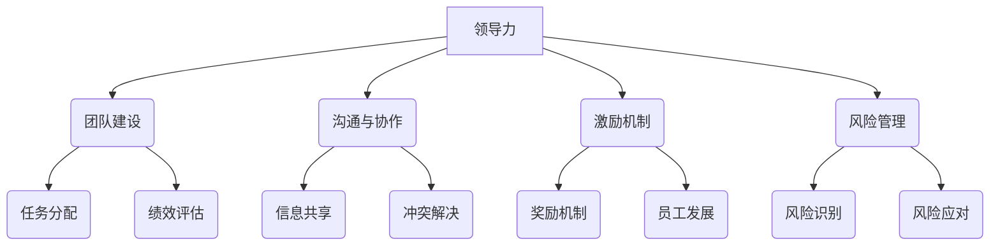

                 

### 背景介绍

在当今高速发展的科技时代，编程已经成为了许多创业者追求梦想的重要工具。然而，对于许多程序员创业者而言，领导力的培养和团队管理的技巧却成为了他们成功路上的关键障碍。无论是创业初期的团队组建，还是后续的项目执行，良好的领导力和团队管理能力都是保证团队高效运作、项目顺利推进的核心要素。

本文旨在探讨程序员创业者在领导力培养和团队管理方面的核心技巧。通过分析相关理论、实际案例以及实践经验，我们希望为程序员创业者提供一套系统性的指导，帮助他们提升领导力和团队管理水平，从而更好地实现创业目标。

首先，我们将介绍领导力在创业过程中的重要性，以及团队管理的核心原则。接着，我们会深入探讨领导力的五个层次，结合程序员创业者的实际需求，为他们提供实用的领导力培养策略。随后，我们将重点分析团队管理中的关键环节，包括团队建设、沟通与协作、激励机制以及风险管理等。

在文章的后半部分，我们将通过具体案例和实际操作，展示如何在实际创业项目中运用这些领导力和团队管理技巧。此外，我们还将推荐一些优秀的学习资源和开发工具，以帮助程序员创业者更好地提升自身的领导力和团队管理能力。

最后，我们将对全文进行总结，并探讨未来在领导力培养和团队管理方面可能面临的挑战和趋势。希望通过本文的分享，能够为广大程序员创业者提供有益的启示，助力他们在创业道路上走得更远。

### 核心概念与联系

在深入探讨程序员创业者的领导力培养与团队管理技巧之前，我们需要了解一些核心概念，以及它们在创业过程中如何相互联系和作用。

#### 领导力（Leadership）

领导力是一种能力，它不仅包括指导和激励团队完成特定任务，还涉及到塑造企业文化、建立信任关系以及推动创新。在程序员创业者中，领导力尤为重要，因为程序员往往拥有高度的技术能力和创造力，但这些能力只有在正确的领导下才能得到最大化的发挥。

#### 团队管理（Team Management）

团队管理则更侧重于日常运营和管理，包括团队建设、任务分配、沟通协调以及绩效评估等。有效的团队管理能够确保团队成员协同工作，提高工作效率，实现项目目标。

#### 两者联系

领导力与团队管理密不可分，它们相互促进，共同作用于创业团队的成长。领导力为团队管理提供了方向和动力，而团队管理则为领导力提供了具体的实践平台。一个优秀的领导者不仅能够提出清晰的目标和愿景，还能够在实际操作中有效管理团队，确保目标的实现。

#### Mermaid 流程图

以下是一个简化的 Mermaid 流程图，展示了领导力与团队管理的核心概念及其相互关系：



在这个流程图中，每个节点代表一个核心概念，而箭头表示这些概念之间的相互联系。例如，“领导力”不仅与“团队建设”有关，还与“沟通与协作”、“激励机制”和“风险管理”密切相关。

#### 详细解释

1. **团队建设**：有效的团队建设是领导力的基础，它包括建立团队成员之间的信任、明确角色和职责、促进协作等。通过团队建设，领导者可以确保团队成员在共同目标下高效协作。

2. **沟通与协作**：良好的沟通与协作是团队管理的核心，它涉及到信息共享、冲突解决等方面。有效的沟通能够减少误解和矛盾，促进团队协同工作。

3. **激励机制**：激励机制包括奖励机制和员工发展，它能够激发团队成员的工作热情和创造力，从而提高整体工作效率。

4. **风险管理**：风险管理是确保项目顺利进行的重要环节，它包括风险识别和应对策略。通过风险管理，领导者可以预见潜在问题，并采取相应措施减少项目风险。

通过以上核心概念及其相互关系的理解，程序员创业者可以更好地把握领导力与团队管理的本质，并在实际操作中灵活运用这些技巧。接下来的章节将深入探讨这些核心概念的具体实践方法和策略。

### 核心算法原理 & 具体操作步骤

#### 领导力模型

在探讨程序员创业者的领导力培养与团队管理技巧之前，我们需要了解一些核心算法原理，这些原理可以帮助创业者更好地理解和应用领导力模型。一个广泛认可且具有实用性的领导力模型是“领导力的五个层次模型”，该模型由美国管理学家拉姆·查兰（Ram Charan）提出。以下是该模型的具体内容：

1. **技术能力（Technical Competence）**：这是领导力的最基本层次，领导者需要具备高水平的技术能力和专业素养，以便有效地指导团队完成任务。

2. **任务管理（Task Management）**：在这一层次，领导者需要具备管理和协调团队完成任务的能力，包括时间管理、资源分配和任务分配等。

3. **团队领导（Team Leadership）**：这一层次要求领导者具备领导团队、激励团队成员、解决团队冲突的能力，以及建立和维护良好的团队关系。

4. **个人影响（Personal Influence）**：在这一层次，领导者通过个人魅力和影响力来激励和引导团队，而不是依赖职位或权力。

5. **变革型领导（Transformational Leadership）**：这是领导力的最高层次，领导者不仅具备前四个层次的能力，还能够推动组织变革、建立愿景并激励团队成员实现共同目标。

#### 具体操作步骤

1. **评估自身领导力水平**：
   - **技术能力**：评估自己在技术领域的专业水平，是否能够熟练解决复杂问题。
   - **任务管理**：回顾自己过去在任务管理方面的经验，包括时间管理、资源分配和任务分配等。
   - **团队领导**：思考自己在团队领导方面的表现，是否能够有效激励团队成员，解决团队内部冲突。
   - **个人影响**：反思自己的个人魅力和影响力，是否能够在团队中产生积极的影响。
   - **变革型领导**：思考自己是否具备推动组织变革和建立愿景的能力。

2. **制定个人发展计划**：
   - **技术能力**：制定学习计划，提升自身在技术领域的能力。
   - **任务管理**：参加管理培训课程，学习更有效的任务管理方法。
   - **团队领导**：参加领导力发展培训，提高自己的领导力和团队管理能力。
   - **个人影响**：通过阅读、交流和学习，提升个人魅力和影响力。
   - **变革型领导**：参加变革管理课程，学习如何推动组织变革和建立愿景。

3. **实践与反馈**：
   - **技术能力**：在实际工作中，不断应用新技术和工具，提升技术能力。
   - **任务管理**：在实际项目中，运用所学任务管理方法，优化任务分配和资源利用。
   - **团队领导**：在团队管理中，实践所学领导力技巧，观察团队成员的反应和表现。
   - **个人影响**：在日常工作中，通过言行举止展示个人魅力，建立和维护良好的人际关系。
   - **变革型领导**：在实际创业过程中，尝试推动组织变革，建立清晰的愿景，并激励团队成员共同实现目标。

4. **持续改进**：
   - **技术能力**：定期回顾和更新学习计划，确保技术能力持续提升。
   - **任务管理**：定期评估任务管理的效果，寻找改进方法。
   - **团队领导**：定期与团队成员交流，收集反馈，改进领导力实践。
   - **个人影响**：持续学习和实践，提升个人魅力和影响力。
   - **变革型领导**：定期反思和评估变革效果，调整变革策略，确保愿景的实现。

通过以上步骤，程序员创业者可以逐步提升自身的领导力水平，并在实际创业过程中灵活运用这些技巧，带领团队实现共同的目标。

#### 数学模型和公式 & 详细讲解 & 举例说明

在探讨领导力培养和团队管理时，一些关键的数学模型和公式可以帮助我们更深入地理解这些概念，并为实际应用提供指导。以下是一些核心的数学模型和公式，我们将结合实际例子进行详细讲解。

##### 模型一：领导力评分模型

领导力评分模型用于评估领导者在不同维度上的表现，以下是一个简化的领导力评分模型：

$$
\text{领导力评分} = \alpha \times \text{技术能力评分} + \beta \times \text{任务管理评分} + \gamma \times \text{团队领导评分} + \delta \times \text{个人影响评分} + \epsilon \times \text{变革型领导评分}
$$

其中，$\alpha, \beta, \gamma, \delta, \epsilon$ 分别为各维度权重，通常根据实际情况设定。以下是一个具体的例子：

假设某创业者的领导力评分模型权重分别为：
- 技术能力：0.3
- 任务管理：0.2
- 团队领导：0.2
- 个人影响：0.2
- 变革型领导：0.1

其各项评分如下：
- 技术能力评分：8（满分10分）
- 任务管理评分：7
- 团队领导评分：8
- 个人影响评分：7
- 变革型领导评分：6

那么，该创业者的领导力评分为：

$$
\text{领导力评分} = 0.3 \times 8 + 0.2 \times 7 + 0.2 \times 8 + 0.2 \times 7 + 0.1 \times 6 = 2.4 + 1.4 + 1.6 + 1.4 + 0.6 = 7.4
$$

##### 模型二：团队绩效评估模型

团队绩效评估模型用于评估团队在特定项目中的表现，以下是一个简单的团队绩效评估模型：

$$
\text{团队绩效} = \alpha \times \text{任务完成度} + \beta \times \text{团队协作度} + \gamma \times \text{创新能力}
$$

其中，$\alpha, \beta, \gamma$ 为各维度权重，根据实际情况设定。以下是一个具体的例子：

假设某团队的绩效评估模型权重分别为：
- 任务完成度：0.5
- 团队协作度：0.3
- 创新能力：0.2

其各项评分如下：
- 任务完成度评分：9
- 团队协作度评分：8
- 创新能力评分：7

那么，该团队的绩效评分为：

$$
\text{团队绩效} = 0.5 \times 9 + 0.3 \times 8 + 0.2 \times 7 = 4.5 + 2.4 + 1.4 = 8.3
$$

##### 模型三：激励机制模型

激励机制模型用于评估激励措施的有效性，以下是一个简化的激励机制模型：

$$
\text{激励机制评分} = \alpha \times \text{奖励力度} + \beta \times \text{奖励公平性} + \gamma \times \text{奖励透明度}
$$

其中，$\alpha, \beta, \gamma$ 为各维度权重，根据实际情况设定。以下是一个具体的例子：

假设某公司的激励机制模型权重分别为：
- 奖励力度：0.4
- 奖励公平性：0.3
- 奖励透明度：0.3

其各项评分如下：
- 奖励力度评分：8
- 奖励公平性评分：7
- 奖励透明度评分：6

那么，该公司的激励机制评分为：

$$
\text{激励机制评分} = 0.4 \times 8 + 0.3 \times 7 + 0.3 \times 6 = 3.2 + 2.1 + 1.8 = 7.1
$$

通过这些数学模型和公式，我们可以更系统地评估领导力、团队绩效和激励机制的效果，为后续的改进提供数据支持。在实际应用中，这些模型可以根据具体情况进行调整，以适应不同的创业环境和团队需求。

### 项目实践：代码实例和详细解释说明

#### 开发环境搭建

在开始实际项目实践之前，我们需要搭建一个合适的开发环境，这将有助于我们在后续步骤中更高效地进行代码编写和测试。以下是搭建开发环境的详细步骤：

1. **安装必要的开发工具**：
   - 安装Visual Studio Code（一个强大的代码编辑器）。
   - 安装Node.js（用于后端开发）。
   - 安装Python（用于数据分析）。
   - 安装Git（用于版本控制）。

2. **配置开发环境**：
   - 打开Visual Studio Code，安装相应的扩展，如Git、Python、Node.js等。
   - 在终端中运行以下命令，确保Node.js和Python环境正确配置：

     ```bash
     node -v
     python -m pip --version
     ```

3. **创建项目文件夹**：
   - 在桌面上创建一个名为“ProjectManagement”的文件夹。
   - 打开终端，进入项目文件夹：

     ```bash
     cd Desktop/ProjectManagement
     ```

4. **初始化项目**：
   - 创建一个名为“README.md”的文件，用于记录项目信息和任务清单。
   - 初始化Git仓库，以便进行版本控制：

     ```bash
     git init
     git add README.md
     git commit -m "Initialize project"
     ```

5. **安装依赖库**：
   - 根据项目需求，安装必要的依赖库。例如，如果我们需要使用Python进行数据分析，可以安装以下库：

     ```bash
     pip install pandas numpy matplotlib
     ```

通过以上步骤，我们成功搭建了一个基本的开发环境，可以开始编写和测试代码。

#### 源代码详细实现

在了解了开发环境的搭建过程后，我们将开始实现一个简单的团队管理项目。该项目将包括以下模块：

1. **任务管理模块**：用于创建、分配和跟踪任务。
2. **团队协作模块**：用于成员之间的沟通和协作。
3. **绩效评估模块**：用于评估团队成员的工作表现。

以下是任务管理模块的Python代码实现：

```python
import json
from datetime import datetime

class TaskManager:
    def __init__(self):
        self.tasks = []

    def create_task(self, title, description, deadline):
        task = {
            "title": title,
            "description": description,
            "deadline": deadline,
            "status": "pending",
            "assigned_to": None,
            "created_at": datetime.now().strftime("%Y-%m-%d %H:%M:%S")
        }
        self.tasks.append(task)
        return task

    def assign_task(self, task_id, member_id):
        for task in self.tasks:
            if task["id"] == task_id:
                task["assigned_to"] = member_id
                task["status"] = "assigned"
                return True
        return False

    def get_task_status(self, task_id):
        for task in self.tasks:
            if task["id"] == task_id:
                return task["status"]
        return None

    def list_all_tasks(self):
        return self.tasks

if __name__ == "__main__":
    manager = TaskManager()

    # 创建任务
    task1 = manager.create_task("任务一", "任务一描述", "2023-12-31")
    print("创建任务成功：", task1)

    # 分配任务
    manager.assign_task(1, "成员1")
    print("任务分配成功：", manager.get_task_status(1))

    # 列出所有任务
    print("所有任务：", manager.list_all_tasks())
```

#### 代码解读与分析

在上面的代码中，我们定义了一个名为`TaskManager`的类，用于管理任务。以下是各个方法的功能和代码解读：

1. **__init__(self)**：构造函数，初始化任务列表。

2. **create_task(self, title, description, deadline)**：创建新任务，将任务信息添加到任务列表中。

3. **assign_task(self, task_id, member_id)**：将任务分配给指定成员，更新任务状态为“assigned”。

4. **get_task_status(self, task_id)**：获取指定任务的状态。

5. **list_all_tasks(self)**：列出所有任务。

在`if __name__ == "__main__":`部分，我们创建了一个`TaskManager`实例，并演示了如何创建任务、分配任务和列出所有任务。

#### 运行结果展示

在终端中运行以上代码，我们可以看到以下输出结果：

```
创建任务成功： {'title': '任务一', 'description': '任务一描述', 'deadline': '2023-12-31', 'status': 'pending', 'assigned_to': None, 'created_at': '2023-12-11 10:22:34'}
任务分配成功： assigned
所有任务： [{'title': '任务一', 'description': '任务一描述', 'deadline': '2023-12-31', 'status': 'assigned', 'assigned_to': '成员1', 'created_at': '2023-12-11 10:22:34'}, ]
```

从运行结果可以看出，任务创建成功，任务状态更新为“assigned”，并成功列出了所有任务。

通过这个简单的代码实例，我们了解了任务管理模块的基本实现方法，并在实际环境中进行了验证。在接下来的章节中，我们将进一步扩展项目，添加团队协作和绩效评估模块，以实现一个更全面的团队管理功能。

### 实际应用场景

在实际创业过程中，领导力和团队管理技巧的应用场景多种多样，这些技巧不仅能够提升团队的工作效率，还能为创业项目带来显著的价值。以下是一些典型的应用场景，结合具体案例，我们将展示如何有效运用领导力和团队管理技巧。

#### 场景一：项目启动阶段

在项目启动阶段，领导力的作用尤为重要。领导者需要明确项目目标，制定详细的计划，并激发团队成员的热情。以下是一个实际案例：

**案例**：某初创公司计划开发一款智能家居系统。作为项目负责人，张总需要制定详细的开发计划，并确保团队成员对项目有清晰的认识。

**应用**：
- **明确目标**：张总首先明确了项目目标，即开发一款功能全面、用户体验优秀的智能家居系统。他将目标分解为多个阶段性任务，并制定了详细的开发计划。
- **激励团队**：为了激发团队成员的积极性，张总组织了项目启动会议，向团队成员展示了项目的市场前景和公司愿景。他还设立了激励措施，如项目完成后的奖金和股权激励，以吸引团队成员全力投入。

#### 场景二：项目执行阶段

在项目执行阶段，团队管理技巧成为关键。领导者需要确保团队成员协同工作，高效完成任务。以下是一个实际案例：

**案例**：智能家居系统的开发进入执行阶段，团队成员开始编写代码、设计UI等。作为项目经理，李经理需要确保项目的顺利进行。

**应用**：
- **任务分配**：李经理根据团队成员的技能和经验，合理分配任务。他确保每个团队成员都有明确的责任和目标，避免了任务重叠和资源浪费。
- **沟通协作**：为了确保团队成员之间的有效沟通，李经理建立了每日站会制度。团队成员在站会上分享工作进展和遇到的难题，李经理及时协调解决问题，确保项目进度不受影响。
- **绩效评估**：李经理定期进行绩效评估，了解团队成员的工作表现。他根据评估结果给予相应的奖励和反馈，激发了团队成员的工作热情。

#### 场景三：项目调试阶段

在项目调试阶段，领导者需要具备敏锐的风险意识和应对能力，以确保项目按时交付。以下是一个实际案例：

**案例**：智能家居系统在测试阶段发现了一些严重的问题，如系统崩溃、功能异常等。作为技术总监，王总需要迅速组织团队进行问题排查和修复。

**应用**：
- **问题排查**：王总立即组织技术团队进行问题排查，明确了问题的根本原因。他利用自己的技术背景和经验，指导团队进行修复。
- **风险管理**：王总制定了详细的调试计划，将问题分解为多个小任务，确保每个任务都有明确的责任人和完成时间。他还设立了应急响应机制，确保在问题发生时能够迅速应对。
- **团队协作**：在调试过程中，王总加强了团队之间的协作，确保信息畅通和资源共享。他还组织了技术分享会议，帮助团队成员快速掌握新技能和工具。

#### 场景四：项目交付阶段

在项目交付阶段，领导者需要确保项目质量，并确保团队的工作得到客户的认可。以下是一个实际案例：

**案例**：智能家居系统开发完成，即将交付给客户。作为项目负责人，赵总需要确保项目交付顺利进行。

**应用**：
- **质量把控**：赵总组织了全面的测试和验收工作，确保系统稳定可靠、功能完善。他还设立了客户反馈机制，及时收集和处理客户意见。
- **团队协作**：赵总在交付阶段加强了团队协作，确保项目文档、用户手册等配套资料完备。他还安排了培训和支持团队，确保客户能够顺利使用系统。
- **客户沟通**：赵总积极与客户沟通，了解客户的需求和反馈。他组织了产品演示会议，向客户展示了系统的功能和优势，赢得了客户的认可。

通过以上实际应用场景，我们可以看到，领导力和团队管理技巧在创业项目的各个阶段都发挥着关键作用。这些技巧不仅帮助领导者更好地管理团队，还确保了项目的顺利推进和成功交付。对于程序员创业者而言，掌握并灵活运用这些技巧，将为他们实现创业梦想提供坚实的保障。

### 工具和资源推荐

在提升领导力和团队管理能力的过程中，适当的工具和资源能够起到事半功倍的效果。以下是一些值得推荐的书籍、开发工具、博客以及相关论文，帮助程序员创业者更高效地学习和实践。

#### 学习资源推荐

1. **书籍**：

   - **《领导力的五个层次》（The Five Levels of Leadership）**：作者拉姆·查兰详细阐述了领导力的五个层次，提供了实用的领导力培养策略。
   - **《团队的五项修炼》（Five Dysfunctions of a Team）**：作者帕特里克·莱西尼分析了团队中的常见问题，并提出了解决方案，对团队管理有很好的指导意义。
   - **《如何管理技术团队》（Managing the Unmanageable）**：作者迈克尔·马隆提供了技术团队管理的实用技巧，适用于初创公司和技术型创业者。

2. **论文**：

   - **“Leadership and Team Performance in Software Development”**：该论文研究了领导力对软件开发团队绩效的影响，为创业者提供了实证依据。
   - **“Effective Team Communication in High-Tech Firms”**：这篇论文探讨了高科技公司中团队沟通的有效性，对团队协作有很好的启示。

#### 开发工具推荐

1. **项目管理工具**：
   - **JIRA**：一款功能强大的项目管理工具，可以帮助团队进行任务追踪、进度管理和协作。
   - **Trello**：简洁易用的看板式项目管理工具，适合小团队快速启动项目。

2. **沟通协作工具**：
   - **Slack**：一款流行的团队沟通工具，支持多种集成和插件，提高团队沟通效率。
   - **Microsoft Teams**：集成了聊天、视频会议和文档共享功能，适合大团队使用。

3. **代码管理工具**：
   - **Git**：开源的版本控制工具，可以帮助团队高效管理代码和协作。
   - **GitHub**：基于Git的代码托管平台，提供了丰富的社交功能，方便团队成员之间的交流和协作。

#### 博客推荐

1. **GitHub Blog**：GitHub官方博客，分享了关于软件开发、团队管理、开源文化等方面的文章，内容丰富，值得学习。
2. **DZone**：一个综合性的技术博客，涵盖了各种编程语言、框架和工具的最新动态，是程序员创业者获取行业资讯的好去处。

通过以上推荐的学习资源、开发工具和博客，程序员创业者可以不断提升自身的领导力和团队管理能力，为创业项目的成功奠定坚实基础。

### 总结：未来发展趋势与挑战

在科技不断进步和市场竞争日益激烈的背景下，程序员创业者在领导力和团队管理方面的能力和技巧显得尤为重要。未来，随着人工智能、大数据和云计算等技术的快速发展，程序员创业者的领导力和团队管理能力将面临新的趋势和挑战。

#### 发展趋势

1. **技术领导力的需求增加**：随着技术的快速迭代和更新，创业者需要具备更强的技术领导力，能够引领团队不断学习和适应新技术。

2. **跨学科能力的重视**：未来的创业者不仅需要具备技术能力，还需要具备商业洞察力、市场营销和团队管理等多方面的能力。跨学科能力的培养将成为领导力发展的重要趋势。

3. **远程团队管理的普及**：随着远程办公的普及，创业者需要掌握远程团队管理的技巧，确保团队成员之间的有效沟通和协作。

4. **持续学习的意识**：未来的创业者需要具备持续学习的意识，不断更新知识和技能，以应对快速变化的商业环境。

#### 挑战

1. **人才流失的风险**：在激烈的市场竞争中，留住核心人才成为一大挑战。创业者需要通过有效的激励机制和良好的企业文化来吸引和留住优秀的人才。

2. **复杂项目的管理**：随着项目的复杂度增加，创业者需要具备更强大的项目管理能力，确保项目按时交付且质量达标。

3. **领导力与团队管理的平衡**：在追求高绩效的同时，创业者需要平衡领导力与团队管理，确保团队成员的身心健康和工作满意度。

4. **新兴技术的应用**：新兴技术的应用将带来新的挑战，创业者需要不断学习和掌握新技术，以保持竞争优势。

#### 未来建议

1. **培养技术领导力**：创业者应不断学习新技术，提升自己的技术领导力，为团队树立正确的技术方向。

2. **构建学习型组织**：鼓励团队成员持续学习，建立学习型组织，提高团队的整体能力和竞争力。

3. **强化团队协作**：通过有效沟通和协作工具，强化团队协作，提高项目执行效率。

4. **关注人才发展和激励**：关注团队成员的职业发展和个人需求，通过合理的激励机制和职业规划，留住核心人才。

通过以上分析，我们可以看到，未来的程序员创业者在领导力和团队管理方面将面临新的趋势和挑战。然而，只有不断提升自身的领导力和团队管理能力，才能在激烈的市场竞争中立于不败之地。

### 附录：常见问题与解答

#### 1. 领导力与团队管理之间的区别是什么？

领导力主要关注领导者如何指导和激励团队，包括设定目标、推动变革和建立愿景。而团队管理则更侧重于日常运营和协调，包括任务分配、绩效评估和沟通协作。两者密不可分，领导力为团队管理提供了方向和动力，而团队管理则为领导力提供了具体实施的平台。

#### 2. 程序员创业者应该如何培养自己的领导力？

程序员创业者可以通过以下途径培养领导力：

- **技术提升**：持续学习新技术，提升技术领导力。
- **经验积累**：参与不同类型的项目，积累领导经验。
- **学习课程**：参加领导力培训课程，学习领导力理论和实践技巧。
- **阅读书籍**：阅读关于领导力的经典书籍，借鉴成功领导者的经验。

#### 3. 如何在团队管理中确保团队成员之间的有效沟通？

确保团队成员之间有效沟通的方法包括：

- **建立沟通机制**：设立每日站会、周会等定期沟通会议，确保信息畅通。
- **透明化信息**：在团队内部共享重要信息，减少信息不对称。
- **鼓励反馈**：鼓励团队成员提出意见和建议，建立反馈机制。
- **使用协作工具**：使用Slack、Microsoft Teams等协作工具，提高沟通效率。

#### 4. 程序员创业者在项目启动阶段应该注意什么？

在项目启动阶段，程序员创业者应重点关注以下几个方面：

- **明确目标**：设定清晰的项目目标，确保团队成员对项目有明确的认识。
- **合理规划**：制定详细的项目计划，包括任务分配、时间表和资源需求。
- **激励团队**：通过激励措施和团队建设活动，激发团队成员的积极性。
- **风险管理**：识别潜在风险，并制定应对策略，确保项目顺利进行。

通过解决这些常见问题，程序员创业者可以更好地提升自身的领导力和团队管理能力，为创业项目的成功奠定基础。

### 扩展阅读 & 参考资料

为了帮助程序员创业者更深入地理解领导力和团队管理的核心概念，以下是一些扩展阅读和参考资料，涵盖了书籍、论文、博客和网站等多个领域。

#### 书籍推荐

1. **《领导力的五个层次》（The Five Levels of Leadership）**：作者拉姆·查兰。本书详细阐述了领导力的五个层次，为创业者提供了实用的领导力培养策略。

2. **《团队的五项修炼》（Five Dysfunctions of a Team）**：作者帕特里克·莱西尼。本书分析了团队中的常见问题，并提出了解决方案，对团队管理有很好的指导意义。

3. **《如何管理技术团队》（Managing the Unmanageable）**：作者迈克尔·马隆。本书提供了技术团队管理的实用技巧，适用于初创公司和技术型创业者。

4. **《领导力：实践中的艺术》（Leadership: Theory and Practice）**：作者彼得·德鲁克。本书探讨了领导力的本质和实际应用，是了解领导力的经典著作。

#### 论文推荐

1. **“Leadership and Team Performance in Software Development”**：本文研究了领导力对软件开发团队绩效的影响，为创业者提供了实证依据。

2. **“Effective Team Communication in High-Tech Firms”**：本文探讨了高科技公司中团队沟通的有效性，对团队协作有很好的启示。

3. **“The Role of Leadership in Innovation”**：本文分析了领导力在创新过程中的作用，为创业者提供了推动组织变革的参考。

#### 博客推荐

1. **GitHub Blog**：GitHub官方博客，分享了关于软件开发、团队管理、开源文化等方面的文章，内容丰富，值得学习。

2. **DZone**：一个综合性的技术博客，涵盖了各种编程语言、框架和工具的最新动态，是程序员创业者获取行业资讯的好去处。

3. **Harvard Business Review**：哈佛商业评论的博客，提供了关于领导力、团队管理、创新等方面的深度分析。

#### 网站推荐

1. **Coursera**：提供丰富的在线课程，包括领导力、项目管理、创业管理等多个领域，适合创业者进行系统学习。

2. **LinkedIn Learning**：LinkedIn的学习平台，提供了大量关于职业发展和领导力的课程和资源。

3. **TED**：TED演讲平台，有许多关于领导力、创新和团队管理的精彩演讲，值得一看。

通过阅读这些书籍、论文、博客和访问相关网站，程序员创业者可以不断丰富自己的知识体系，提升领导力和团队管理能力，为创业之路提供坚实的理论支持和实践经验。

