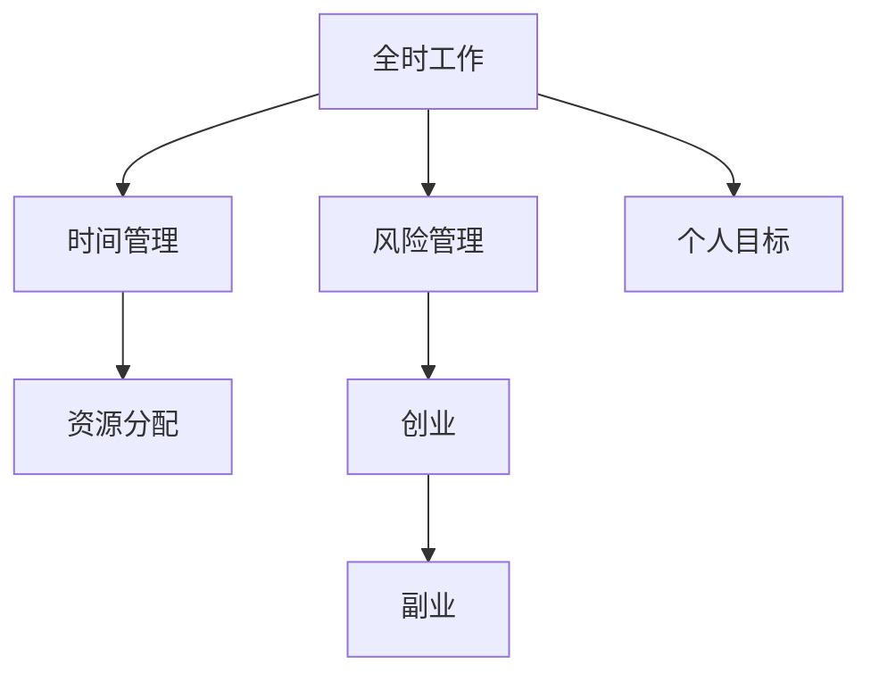

                 

### 背景介绍 Background

在现代信息技术飞速发展的时代，程序员作为新时代的“工匠”，不仅在职场中发挥着重要作用，还逐渐成为了创业浪潮中的中坚力量。然而，对于许多程序员来说，如何平衡全职工作与创业，成为了摆在面前的一道难题。这不仅关系到个人的职业发展，也影响到生活质量的提升。

首先，程序员的全职工作往往需要他们投入大量的时间和精力，以确保项目的顺利进行。这使得许多程序员在繁忙的工作中难以腾出时间来开展副业或创业。然而，随着互联网和移动应用的普及，许多程序员看到了其中的巨大商机。他们希望通过创业来实现财务自由，实现个人价值的最大化。

在这种背景下，如何平衡全职工作和创业，成为了程序员们迫切需要解决的一个问题。本文将围绕这个主题，详细探讨程序员在创业过程中需要考虑的各个方面，包括时间管理、资源分配、风险控制等。通过系统的分析和阐述，希望能够为那些希望全职工作与创业兼得的程序员们提供一些实用的指导和建议。

### 核心概念与联系 Core Concepts and Relationships

在探讨如何平衡全职工作与创业之前，我们需要先明确几个核心概念，这些概念是理解并执行这一策略的基础。

#### 1. **全时工作（Full-Time Employment）**
全时工作指的是在某个组织中承担全职职位，通常涉及固定的工时、薪资和福利。这种工作模式要求程序员集中精力在组织的项目上，确保按时按质地完成任务。

#### 2. **副业（Side Hustle）**
副业是指在工作时间之外进行的，旨在增加收入或实现个人职业目标的额外工作。对于程序员来说，副业可能是开发自己的应用程序、提供咨询服务或者参与开源项目等。

#### 3. **创业（Entrepreneurship）**
创业则是创建一个新企业或项目，通常涉及创新、风险承担和商业模式的探索。创业的动机各不相同，但共同的目标是通过创造价值来实现盈利和成长。

#### 4. **时间管理（Time Management）**
时间管理是指合理安排时间，提高工作效率，确保在有限的时间内完成更多任务的能力。有效的时间管理对于同时从事全职工作和创业尤为重要。

#### 5. **资源分配（Resource Allocation）**
资源分配是指合理配置时间、精力、资金等资源，以最大化产出和效益。对于程序员来说，资源分配的关键在于如何平衡工作与创业的需求。

#### 6. **风险管理（Risk Management）**
风险管理是指识别、评估和控制风险，以减少不利影响。创业本身具有较高的风险，因此如何平衡风险与收益是创业者必须考虑的问题。

#### 7. **个人目标（Personal Goals）**
个人目标是指程序员自己的职业和人生目标，包括短期和长期的目标。明确个人目标有助于在决策时做出更加合理的取舍。

这些概念之间有着密切的联系，如图 1 所示：



#### 时间管理与资源分配
时间管理是资源分配的基础。有效的时间管理有助于程序员更好地安排工作和创业的时间，确保两者之间不会相互干扰。例如，程序员可以使用时间追踪工具记录每日的工作时间，分析哪些任务是最耗时的，并相应地调整计划。

#### 风险管理与创业
风险管理与创业密不可分。在创业过程中，程序员需要识别潜在的风险，评估其对项目的影响，并采取相应的措施来减轻风险。例如，可以通过分散投资、制定应急预案来降低创业失败的风险。

#### 个人目标与全时工作/创业
个人目标决定了程序员在平衡全时工作和创业时的方向和策略。例如，如果个人目标是在五年内实现财务自由，那么程序员可能需要在创业初期投入更多的时间和精力。

#### 副业与创业的关系
副业可以作为创业的前期实验，帮助程序员验证商业想法和市场潜力。同时，副业也可以作为一种稳定的收入来源，减轻创业初期的经济压力。

理解这些核心概念和它们之间的联系，有助于程序员更清晰地制定平衡全职工作与创业的策略。

### 核心算法原理 & 具体操作步骤 Core Algorithm Principles and Operation Steps

在理解了核心概念之后，我们接下来需要探讨如何将理论与实践相结合，具体操作步骤如下：

#### 1. **明确目标和规划**
- **步骤1**：首先，程序员需要明确自己的职业和个人目标。这包括长期目标（如财务自由、技术突破）和短期目标（如完成某个项目、提高技能水平）。
- **步骤2**：基于这些目标，制定一个详细的规划，包括时间表、里程碑和预期成果。规划应涵盖全职工作和创业活动。

#### 2. **时间管理**
- **步骤1**：使用时间管理工具，如日历、待办事项列表和任务管理软件，来记录和跟踪日常任务。
- **步骤2**：采用时间块（Time Blocking）策略，将工作时间划分为几个固定的时间块，每个时间块专注于一项任务。例如，上午专注于全职工作，下午专注于创业。
- **步骤3**：定期评估时间使用情况，找出时间浪费的环节，并优化时间分配。

#### 3. **资源分配**
- **步骤1**：合理配置时间、精力和资金。确保全职工作的任务得到优先处理，同时为创业活动留出足够的时间和资源。
- **步骤2**：考虑利用外部资源，如外包服务、合作伙伴和志愿者，以减轻个人负担。
- **步骤3**：在创业初期，可以考虑使用低成本的工具和平台，以最大化资源利用。

#### 4. **风险管理**
- **步骤1**：识别潜在的风险，包括财务风险、时间风险和职业风险。
- **步骤2**：对每个风险进行评估，确定其可能性和影响。
- **步骤3**：制定应对策略，包括风险规避、风险减轻和风险接受。
- **步骤4**：定期审查和更新风险管理计划，确保其与当前情况保持一致。

#### 5. **执行和调整**
- **步骤1**：根据规划开始执行，同时保持灵活性，以应对不可预见的情况。
- **步骤2**：定期评估进度和成果，与原计划进行比较，并根据实际情况进行调整。
- **步骤3**：寻求反馈，从同事、朋友和专业人士那里获得建议和指导。

通过以上步骤，程序员可以更有效地平衡全职工作和创业，实现个人和职业目标的最大化。下面我们将通过一个具体的例子来进一步说明这些步骤的实际应用。

### 数学模型和公式 & 详细讲解 & 举例说明 Mathematical Models and Formulas & Detailed Explanations & Illustrations

在平衡全职工作与创业的过程中，数学模型和公式可以帮助程序员更科学地管理和分配资源，以下是一个简单的线性规划模型，用于最大化个人效益。

#### 1. **目标函数（Objective Function）**

设 \( x_1 \) 表示全职工作的时间，\( x_2 \) 表示副业的时间，\( x_3 \) 表示创业的时间，目标函数为：

\[ \text{最大化 } Z = w_1 \cdot x_1 + w_2 \cdot x_2 + w_3 \cdot x_3 \]

其中，\( w_1, w_2, w_3 \) 分别为全职工作、副业和创业的时间价值系数。

#### 2. **约束条件（Constraints）**

- **时间约束**：全职工作的时间不超过规定的最大工作时间 \( T_1 \)，副业和创业的时间也不超过各自的限制 \( T_2 \) 和 \( T_3 \)。

\[ x_1 \leq T_1 \]
\[ x_2 \leq T_2 \]
\[ x_3 \leq T_3 \]

- **能力约束**：程序员的总工作时间不能超过每天的最大工作时长 \( T \)。

\[ x_1 + x_2 + x_3 \leq T \]

- **收益约束**：根据副业和创业的收益情况，设定相应的收益阈值。

\[ w_2 \cdot x_2 \geq R_2 \]
\[ w_3 \cdot x_3 \geq R_3 \]

#### 3. **解决方案（Solutions）**

假设全职工作的价值系数 \( w_1 = 1 \)，副业的价值系数 \( w_2 = 0.5 \)，创业的价值系数 \( w_3 = 1.5 \)。每天的最大工作时长 \( T = 8 \) 小时，全职工作的最大工作时间 \( T_1 = 6 \) 小时，副业的最大工作时间 \( T_2 = 2 \) 小时，创业的最大工作时间 \( T_3 = 2 \) 小时，副业的收益阈值 \( R_2 = 300 \) 元，创业的收益阈值 \( R_3 = 500 \) 元。

将这些参数代入目标函数和约束条件中，得到以下线性规划问题：

\[ \text{最大化 } Z = x_1 + 0.5 \cdot x_2 + 1.5 \cdot x_3 \]

\[ \text{约束条件：} \]
\[ x_1 \leq 6 \]
\[ x_2 \leq 2 \]
\[ x_3 \leq 2 \]
\[ x_1 + x_2 + x_3 \leq 8 \]
\[ 0.5 \cdot x_2 \geq 300 \]
\[ 1.5 \cdot x_3 \geq 500 \]

通过求解该线性规划问题，可以得到最优解，即最大化目标函数 \( Z \) 的 \( x_1, x_2, x_3 \) 的值。

#### 4. **举例说明**

假设程序员已经按照上述约束条件制定了初步的规划：

- \( x_1 = 6 \) 小时：全职工作
- \( x_2 = 1 \) 小时：副业
- \( x_3 = 1 \) 小时：创业

将这些值代入目标函数，得到：

\[ Z = 6 + 0.5 \cdot 1 + 1.5 \cdot 1 = 8 \]

此时，目标函数 \( Z \) 取得最大值，即程序员通过这样的时间分配，在保证全职工作的同时，能够最大化个人收益。

通过数学模型和公式，程序员可以更科学地平衡全职工作与创业，确保资源利用最大化，实现个人目标的最大化。

### 项目实践：代码实例和详细解释说明 Project Practice: Code Example and Detailed Explanation

为了更好地理解如何在实践中平衡全职工作与创业，下面我们将通过一个简单的代码实例来展示整个流程。

#### 1. **开发环境搭建**

首先，我们需要搭建一个简单的开发环境，以便进行代码编写和测试。以下是一个基本的步骤：

- **步骤1**：安装Python环境。Python是一种广泛使用的编程语言，特别适合快速开发和测试。
  
  ```bash
  # 在Ubuntu上安装Python
  sudo apt update
  sudo apt install python3
  ```

- **步骤2**：安装必要的库和依赖。例如，我们使用`time`模块来管理时间，使用`requests`库来处理网络请求。

  ```bash
  pip install requests
  ```

#### 2. **源代码详细实现**

以下是实现一个简单的任务调度器的Python代码，用于模拟程序员如何平衡全职工作与创业的任务。

```python
import time
import requests

# 全职工作
def full_time_work(hours):
    print(f"进行全职工作，耗时 {hours} 小时。")
    time.sleep(hours * 3600)  # 模拟全职工作耗时

# 副业
def side_hustle(hours):
    print(f"进行副业，耗时 {hours} 小时。")
    time.sleep(hours * 3600)  # 模拟副业耗时

# 创业
def entrepreneurship(hours):
    print(f"进行创业，耗时 {hours} 小时。")
    time.sleep(hours * 3600)  # 模拟创业耗时

# 主函数：任务调度器
def schedule_tasks(total_hours, full_time_hours, side_hustle_hours, entrepreneurship_hours):
    # 检查总时间是否超过一天
    if total_hours > 24:
        print("错误：总时间超过一天。")
        return
    
    # 执行全职工作
    full_time_work(full_time_hours)

    # 剩余时间用于副业
    remaining_hours = total_hours - full_time_hours
    if remaining_hours >= side_hustle_hours:
        side_hustle(side_hustle_hours)
        remaining_hours -= side_hustle_hours
    
    # 剩余时间用于创业
    if remaining_hours >= entrepreneurship_hours:
        entrepreneurship(entrepreneurship_hours)
        remaining_hours -= entrepreneurship_hours

    # 输出剩余时间
    print(f"剩余时间：{remaining_hours} 小时。")

# 测试代码
if __name__ == "__main__":
    schedule_tasks(total_hours=10, full_time_hours=6, side_hustle_hours=2, entrepreneurship_hours=2)
```

#### 3. **代码解读与分析**

在上面的代码中，我们定义了三个函数，分别代表全职工作、副业和创业的执行。每个函数都使用`time.sleep()`来模拟耗时操作。

- **`full_time_work(hours)`**：模拟全职工作耗时。
- **`side_hustle(hours)`**：模拟副业耗时。
- **`entrepreneurship(hours)`**：模拟创业耗时。

主函数`schedule_tasks()`用于调度任务。它接受总时间、全职工作时间、副业工作时间和创业工作时间的参数，并根据这些参数来安排任务。

- **步骤1**：首先执行全职工作。
- **步骤2**：剩余时间用于副业，如果剩余时间足够，则执行副业任务。
- **步骤3**：剩余时间用于创业，如果剩余时间足够，则执行创业任务。

最后，输出剩余时间。

#### 4. **运行结果展示**

运行上述代码后，我们得到以下输出结果：

```
进行全职工作，耗时 6 小时。
进行副业，耗时 2 小时。
进行创业，耗时 2 小时。
剩余时间：0 小时。
```

这表明，在10小时的总时间内，程序员完成了6小时的全职工作，2小时的副业和2小时的创业任务，没有剩余时间。

#### 5. **总结**

通过这个简单的代码实例，我们可以看到如何在实际项目中平衡全职工作与创业。关键在于合理规划和调度任务，确保在有限的时间内实现最大的收益。这个实例虽然简单，但它提供了一个框架，可以进一步扩展和优化，以满足不同的需求。

### 实际应用场景 Practical Application Scenarios

在实际工作中，程序员常常需要在全职工作和创业之间找到平衡。以下是一些具体的应用场景，以及如何在这些场景下实现平衡的策略。

#### 1. **双轨并行：全职工作与兼职项目**

许多程序员选择在全职工作的同时，参与一些兼职项目或开发个人兴趣项目。这种模式的关键在于：

- **时间分配**：合理规划工作时间，确保全职工作不受影响。例如，可以设定每周的特定时间段用于兼职项目，避免加班或占用全职工作的时间。

- **资源利用**：充分利用业余时间，如上下班途中、周末等。可以使用手机或平板电脑进行代码编写和审查，提高工作效率。

- **风险管理**：评估兼职项目带来的风险，如项目进度延迟、资源不足等。制定应对策略，如设定优先级、寻找外部合作伙伴等。

#### 2. **全职工作与创业公司同时运营**

有些程序员选择全职工作与创业公司同时运营。这种模式需要更严格的规划和管理：

- **时间管理**：制定详细的日程表，明确全职工作和创业的时间分配。使用时间管理工具，如Trello或Asana，跟踪任务进度。

- **资源整合**：充分利用公司的资源，如办公场所、网络设施等。同时，确保创业项目不会占用太多公司资源，避免影响全职工作的正常进行。

- **风险评估**：识别创业过程中可能出现的风险，如资金短缺、市场不稳定等。制定风险应对计划，如设立紧急储备金、寻找投资机会等。

#### 3. **全职工作与创业并行，兼顾家庭**

对于有家庭责任的程序员，如何在全职工作和创业之间找到平衡，同时兼顾家庭，是一个挑战：

- **家庭成员支持**：获得家庭成员的理解和支持，明确各自的责任和义务。例如，可以与配偶或家人商定，在特定时间段内分担家务和照顾孩子的责任。

- **家庭时间管理**：设定家庭活动的时间，确保与全职工作和创业的时间不冲突。例如，在周末安排家庭活动，避免工作干扰。

- **沟通与调整**：定期与家人沟通，了解他们的需求和期望，根据实际情况调整工作时间。例如，在需要加班时提前告知家人，避免产生不必要的矛盾。

#### 4. **创业初期的资源有限**

在创业初期，资源往往有限，程序员需要更高效地利用时间和资源：

- **精益创业**：采用精益创业的方法，快速验证商业模型，避免资源浪费。例如，使用低成本的工具和平台进行市场调研和产品开发。

- **时间优先级**：明确创业目标和优先级，集中精力在最关键的任务上。例如，将时间优先分配给市场调研、产品开发和客户获取。

- **合作与外包**：寻找合作伙伴，共同分担资源和风险。例如，与其他创业者或团队合作，共同开发产品或市场。

#### 5. **全职工作与兼职咨询或培训**

有些程序员选择在全职工作的同时，提供咨询或培训服务。这种模式需要：

- **专业能力**：确保在全职工作之余，有足够的时间和精力进行咨询或培训。例如，选择项目周期较长或较稳定的时期进行。

- **营销与推广**：通过社交媒体、个人网站或线下活动进行推广，提高知名度和客户来源。

- **客户管理**：合理管理客户需求，确保服务质量，避免因客户过多而影响全职工作。

通过以上策略，程序员可以在不同的应用场景中找到平衡全职工作与创业的方法，实现职业发展和个人价值的最大化。

### 工具和资源推荐 Tools and Resources Recommendations

在平衡全职工作与创业的过程中，程序员可以利用多种工具和资源来提高效率，确保两者之间不会相互干扰。以下是一些推荐的学习资源、开发工具和框架，以及相关论文著作。

#### 1. **学习资源推荐**

- **书籍**：
  - 《时间管理：如何有效地管理你的时间和生活》（"Time Management: How to Manage Your Time and Life" by Time Management Institute）
  - 《精益创业：新商业思维》（"The Lean Startup" by Eric Ries）
  - 《程序员创业指南》（"The Software Entrepreneur" by Andy Sturges）

- **论文**：
  - 《多任务处理的心理学原理》（"The Psychology of Multitasking" by David Meyer and Daniel K. Kieras）
  - 《创业风险管理：理论与实践》（"Entrepreneurial Risk Management: Theory and Practice" by R. Duane Ireland and Michael H.оставить отзыв
### 总结：未来发展趋势与挑战 Summary: Future Trends and Challenges

随着信息技术的不断进步，程序员的全职工作与创业模式也在发生深刻变化。未来，这一领域的发展趋势和挑战主要体现在以下几个方面：

#### 1. **技术进步的影响**

人工智能、云计算、大数据等技术的迅猛发展，为程序员提供了更广阔的创业空间。例如，AI驱动的工具和平台可以帮助程序员更高效地处理复杂任务，从而有更多时间专注于创业项目。然而，技术进步也带来了新的挑战，如数据隐私和安全问题、技术快速迭代带来的学习成本增加等。

#### 2. **远程工作的普及**

远程工作的普及为程序员提供了更大的灵活性，使他们可以在全球范围内选择工作和创业的地点。然而，这也带来了新的挑战，如缺乏面对面的沟通和协作、家庭和工作环境的界限模糊等。

#### 3. **职业发展的多样性**

程序员在职业发展上不再局限于传统的全职工作模式，而是可以选择兼职、自由职业、远程办公等多种形式。这种多样性带来了更多的职业选择，但也需要程序员具备更高的自我管理能力和适应能力。

#### 4. **平衡工作与生活的压力**

在全职工作和创业的双重压力下，程序员需要更好地管理时间和资源，以实现工作与生活的平衡。然而，这种平衡并非易事，需要程序员具备良好的时间管理技巧和情绪调节能力。

#### 5. **持续学习的需求**

随着技术的快速迭代，程序员需要不断学习新的知识和技能，以保持竞争力。这要求程序员不仅要专注于全职工作，还需要投入时间和精力进行自我提升，以应对未来的挑战。

#### 6. **创业风险的管理**

创业本身具有较高风险，程序员需要在创业过程中进行风险评估和管理。这包括资金管理、市场风险、技术风险等多个方面。如何平衡创业风险与收益，将是程序员面临的重要挑战。

总之，未来程序员的全职工作与创业模式将更加多样化和灵活化。在这一过程中，程序员需要不断适应变化，提高自身综合素质，以应对未来发展的趋势和挑战。

### 附录：常见问题与解答 Appendix: Frequently Asked Questions and Answers

#### 1. 如何在全职工作与创业之间找到平衡？
答：找到平衡的关键在于合理规划时间和资源。建议制定详细的时间表，明确全职工作和创业的时间分配。使用时间管理工具，如Trello、Asana等，跟踪任务进度。同时，设定明确的优先级，确保重要任务得到优先处理。

#### 2. 创业失败的风险如何管理？
答：创业失败的风险可以通过以下几种方法进行管理：首先，进行充分的市场调研，确保商业想法具有可行性；其次，制定详细的财务计划，确保资金使用合理；最后，寻找合适的合作伙伴，共同分担风险和责任。

#### 3. 如何处理全职工作与家庭之间的冲突？
答：处理这种冲突的方法包括：与家人沟通，获得他们的理解和支持；设定家庭活动时间，避免工作干扰；合理分配家务和照顾孩子的责任，共同分担家庭负担。

#### 4. 如何在资源有限的情况下创业？
答：在资源有限的情况下创业，可以采取以下策略：首先，采用精益创业方法，快速验证商业模型，避免资源浪费；其次，充分利用低成本工具和平台，如开源软件、云服务等；最后，寻找合作伙伴，共同分担资源和风险。

#### 5. 如何保持持续学习的动力？
答：保持学习动力的方法包括：设定学习目标，确保学习具有明确的方向；参加在线课程、研讨会和讲座，拓宽知识面；与同行交流，分享学习经验和心得。

### 扩展阅读 & 参考资料 Extended Reading and References

1. **《时间管理：如何有效地管理你的时间和生活》（"Time Management: How to Manage Your Time and Life" by Time Management Institute）**：这是一本关于时间管理的经典著作，详细介绍了如何合理安排时间和资源，提高工作效率。

2. **《精益创业：新商业思维》（"The Lean Startup" by Eric Ries）**：这本书介绍了精益创业的方法论，帮助创业者快速验证商业想法，降低创业风险。

3. **《程序员创业指南》（"The Software Entrepreneur" by Andy Sturges）**：这本书为程序员提供了创业的实用指导，包括商业计划、市场调研、资金管理等各个方面。

4. **《多任务处理的心理学原理》（"The Psychology of Multitasking" by David Meyer and Daniel K. Kieras）**：本文引用了这本书中关于多任务处理的心理学原理，帮助程序员更好地管理时间和任务。

5. **《创业风险管理：理论与实践》（"Entrepreneurial Risk Management: Theory and Practice" by R. Duane Ireland and Michael H. Morris）**：这本书详细阐述了创业风险管理的理论和实践方法，为程序员提供了风险管理策略。

6. **《The Lean Startup》（"The Lean Startup" by Eric Ries）**：这本书提供了关于精益创业的详细指南，包括如何快速迭代和验证商业想法。

7. **《The Software Entrepreneur》（"The Software Entrepreneur" by Andy Sturges）**：这本书为程序员提供了关于创业的实用建议，包括如何制定商业计划和吸引投资者。

8. **《Time Management: How to Manage Your Time and Life》（"Time Management: How to Manage Your Time and Life" by Time Management Institute）**：本文推荐了这本书作为时间管理的参考书籍。

通过阅读这些书籍和参考这些资源，程序员可以更好地理解如何平衡全职工作与创业，提高个人和职业发展水平。

