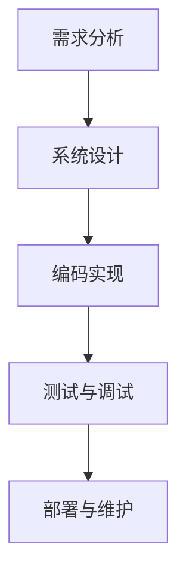
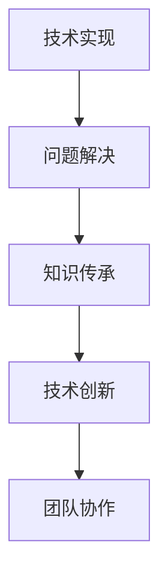
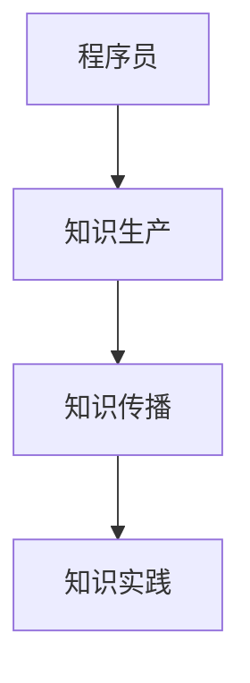

                 

### 1. 背景介绍

在当今的知识经济时代，程序员的角色和地位正经历着前所未有的变革。随着数字化转型的加速，数据成为了企业最宝贵的资产，而程序员作为数据处理的专家，其在知识经济时代的角色变得愈发重要。程序员不仅承担着编写和维护代码的责任，更成为了推动技术创新和业务发展的重要力量。

本篇文章旨在探讨程序员在知识经济时代的角色定位，分析程序员在这一变革中的关键作用，并探讨其在未来可能面临的发展趋势与挑战。本文将采用逻辑清晰、结构紧凑、简单易懂的写作风格，逐步分析推理，深入剖析程序员的核心价值和作用。

### 1.1 知识经济的定义与特征

知识经济是一种以知识为主要生产要素的经济形态，与传统的农业经济和工业经济不同，知识经济强调知识创造、传播和应用的重要性。其核心特征包括：

1. **信息化**：信息技术的飞速发展，使得信息的获取、处理和传递变得前所未有的便捷，数据成为了知识经济的重要基础。
2. **智能化**：随着人工智能、大数据、云计算等技术的发展，越来越多的工作开始依赖于智能算法和自动化系统，智能化的趋势日益明显。
3. **全球化**：互联网的普及和跨国企业的崛起，使得全球范围内的知识共享和合作变得更加容易，全球化成为了知识经济的重要特征。
4. **创新驱动**：知识经济的核心是创新，企业通过不断的创新来获取竞争优势，创新成为了知识经济的驱动力。

### 1.2 程序员的角色变化

在知识经济时代，程序员的角色经历了显著的变化。传统的程序员主要专注于编写和维护代码，而在知识经济时代，程序员需要承担更多的责任和挑战。

1. **从编码到架构设计**：随着项目的复杂度增加，程序员不再仅仅是编写代码，还需要参与系统的架构设计，确保系统能够高效、稳定地运行。
2. **从技术专家到业务专家**：程序员需要深入了解业务需求，将业务逻辑转化为技术实现，从而更好地满足客户的需求。
3. **从个体工作者到团队协作**：在知识经济时代，程序员需要具备良好的团队协作能力，与产品经理、设计师、测试工程师等角色紧密合作，共同推动项目的进展。
4. **从执行者到创新者**：程序员需要具备创新思维，不断探索新的技术和解决方案，推动企业的发展和创新。

### 1.3 程序员的核心价值

在知识经济时代，程序员的核心价值主要体现在以下几个方面：

1. **技术创新**：程序员是推动技术创新的重要力量，通过不断的研究和学习，他们将最新的技术引入到企业中，提升企业的竞争力。
2. **业务优化**：程序员通过优化系统性能和架构设计，帮助企业降低成本、提高效率，实现业务的持续优化。
3. **数据驱动**：程序员擅长数据分析和处理，通过构建数据模型和算法，帮助企业从海量数据中提取有价值的信息，驱动业务决策。
4. **知识传承**：程序员通过编写文档和代码注释，将知识和经验传承给团队，提升团队的整体技术水平。

### 1.4 文章结构概述

本文将按照以下结构进行论述：

1. **背景介绍**：阐述知识经济的定义与特征，以及程序员角色变化的核心价值。
2. **核心概念与联系**：介绍程序员在知识经济时代的关键技能和职责，并通过Mermaid流程图展示其工作流程。
3. **核心算法原理与具体操作步骤**：分析程序员在项目开发中常用的算法和工具，并详细讲解其操作步骤。
4. **数学模型和公式**：介绍程序员在处理复杂问题时常用的数学模型和公式，并通过具体例子进行说明。
5. **项目实践**：通过实际项目案例，展示程序员在项目开发中的具体操作和实现过程。
6. **实际应用场景**：探讨程序员在不同领域的应用场景和面临的挑战。
7. **工具和资源推荐**：推荐学习资源、开发工具和框架，帮助程序员提升技能。
8. **总结**：总结程序员在知识经济时代的角色定位和发展趋势，展望未来。
9. **附录**：提供常见问题与解答，便于读者深入理解。
10. **扩展阅读与参考资料**：推荐相关论文、书籍和网站，供读者进一步学习。

通过以上结构，本文将深入探讨程序员在知识经济时代的角色定位，帮助读者了解其在当前和未来社会中的重要作用。在接下来的章节中，我们将逐一展开讨论，揭示程序员在这一变革中的核心价值。

### 2. 核心概念与联系

在知识经济时代，程序员的角色和职责发生了显著的变化。为了更好地理解这一变化，我们需要首先明确几个核心概念，并探讨这些概念之间的联系。

#### 2.1 知识经济与程序员的核心技能

在知识经济时代，程序员的核心技能不仅包括编程能力，还涵盖了以下几个方面：

1. **数据分析能力**：随着大数据技术的发展，程序员需要掌握数据分析和处理技能，能够从海量数据中提取有价值的信息。
2. **架构设计能力**：程序员需要具备良好的架构设计能力，能够设计高效、可扩展的系统架构。
3. **系统优化能力**：程序员需要能够通过系统优化，提升系统的性能和稳定性。
4. **业务理解能力**：程序员需要深入了解业务逻辑，将业务需求转化为技术实现。

这些技能不仅是程序员在知识经济时代立足的基础，也是他们为企业创造价值的关键。

#### 2.2 程序员的工作流程

程序员的工作流程可以概括为以下几个阶段：

1. **需求分析**：理解业务需求，与产品经理和客户沟通，确保项目目标和需求明确。
2. **系统设计**：根据需求进行系统设计，包括数据库设计、系统架构设计等。
3. **编码实现**：编写代码，实现系统的功能。
4. **测试与调试**：对系统进行测试，确保其功能符合预期，并解决可能出现的bug。
5. **部署与维护**：将系统部署到生产环境，并进行持续维护和优化。

以下是一个简化的Mermaid流程图，展示了程序员的工作流程：



在这个流程中，每一个阶段都需要程序员具备相应的技能和知识，从而确保项目的顺利进行。

#### 2.3 程序员的核心职责

在知识经济时代，程序员的核心职责可以归纳为以下几点：

1. **技术实现**：根据需求文档，实现系统的功能和技术需求。
2. **问题解决**：在项目开发和维护过程中，解决可能出现的技术问题。
3. **知识传承**：通过编写文档和代码注释，将知识和经验传承给团队成员。
4. **技术创新**：不断学习新技术，推动企业的技术创新和发展。
5. **团队协作**：与产品经理、设计师、测试工程师等角色紧密合作，确保项目的成功。

以下是一个简化的Mermaid流程图，展示了程序员的核心职责：



在这个流程中，程序员不仅需要完成技术实现，还需要解决技术问题、传承知识、推动创新，并与团队紧密协作，从而确保项目的成功。

#### 2.4 程序员与知识经济的联系

程序员与知识经济之间存在着密切的联系。首先，程序员是知识经济时代的重要生产者，他们通过技术创新和系统开发，为企业创造价值。其次，程序员是知识经济时代的传播者，他们通过编码和文档，将知识传递给更多的人。最后，程序员是知识经济时代的实践者，他们通过实际项目，将理论知识应用到实际工作中。

以下是一个简化的Mermaid流程图，展示了程序员与知识经济的联系：



在这个流程中，程序员通过技术实现、知识传承和实际项目，成为知识经济时代的重要参与者。

通过以上对核心概念和联系的探讨，我们可以更好地理解程序员在知识经济时代的角色和职责。在接下来的章节中，我们将进一步分析程序员在项目开发中的核心算法原理和具体操作步骤。

### 3. 核心算法原理 & 具体操作步骤

在程序员进行项目开发的过程中，核心算法原理是确保系统高效、稳定运行的基础。本章节将详细介绍程序员在项目开发中常用的核心算法原理，并逐步讲解其具体操作步骤，帮助读者更好地理解和应用这些算法。

#### 3.1 排序算法

排序算法是程序员在处理数据时经常使用的算法之一。常见的排序算法包括冒泡排序、选择排序、插入排序、快速排序等。以下是快速排序算法的原理和具体操作步骤。

**原理**：

快速排序的基本思想是通过一趟排序将待排序的数据分割成独立的两部分，其中一部分的所有数据都比另一部分的数据要小，然后再按此方法对这两部分数据分别进行快速排序，整个排序过程可以递归进行，以此达到整个数据变成有序序列。

**操作步骤**：

1. 选择一个基准元素，通常选择第一个或最后一个元素。
2. 将数组划分为两部分，一部分小于基准元素，另一部分大于基准元素。
3. 对小于和大于基准元素的两部分数组分别进行快速排序。
4. 递归执行上述步骤，直至所有子数组长度为1，即完成排序。

以下是一个使用Python实现的快速排序算法示例：

```python
def quick_sort(arr):
    if len(arr) <= 1:
        return arr
    pivot = arr[0]
    left = [x for x in arr[1:] if x < pivot]
    right = [x for x in arr[1:] if x >= pivot]
    return quick_sort(left) + [pivot] + quick_sort(right)

# 示例
arr = [3, 6, 8, 10, 1, 2, 1]
sorted_arr = quick_sort(arr)
print(sorted_arr)
```

#### 3.2 二分查找算法

二分查找算法是程序员在处理有序数组时常用的算法。其基本思想是通过反复将数组中间的元素与目标值进行比较，从而逐步缩小查找范围，直至找到目标值或确定其不存在。

**原理**：

二分查找的基本思想是将数组中间的元素与目标值进行比较，若相等，则查找成功；若中间元素大于目标值，则在前半部分继续查找；若中间元素小于目标值，则在后半部分继续查找。通过逐步缩小查找范围，可以高效地找到目标值。

**操作步骤**：

1. 判断数组是否为空。
2. 设置两个指针，一个指向数组的起始位置，另一个指向数组的末尾位置。
3. 计算中间位置，将中间位置的元素与目标值进行比较。
4. 根据比较结果调整指针，继续查找。
5. 当指针重叠时，结束查找。

以下是一个使用Python实现的二分查找算法示例：

```python
def binary_search(arr, target):
    left, right = 0, len(arr) - 1
    while left <= right:
        mid = (left + right) // 2
        if arr[mid] == target:
            return mid
        elif arr[mid] < target:
            left = mid + 1
        else:
            right = mid - 1
    return -1

# 示例
arr = [1, 2, 3, 4, 5, 6, 7, 8, 9]
target = 5
result = binary_search(arr, target)
print(result)
```

#### 3.3 动态规划算法

动态规划算法是程序员在处理复杂问题时常用的一种算法思想。其基本思想是将复杂问题分解为多个子问题，并利用子问题的最优解来求解原问题。

**原理**：

动态规划的基本思想是通过将复杂问题分解为多个子问题，并利用子问题的最优解来求解原问题。每个子问题的解都可以通过子问题的解组合得到，从而避免了重复计算，提高了算法的效率。

**操作步骤**：

1. 确定问题的状态和状态转移方程。
2. 设计一个动态规划表，用于存储子问题的解。
3. 从初始状态开始，利用状态转移方程递推求解每个状态。
4. 利用动态规划表的最终结果求解原问题。

以下是一个使用Python实现的动态规划算法示例，用于求解斐波那契数列：

```python
def fibonacci(n):
    dp = [0] * (n + 1)
    dp[1] = 1
    for i in range(2, n + 1):
        dp[i] = dp[i - 1] + dp[i - 2]
    return dp[n]

# 示例
n = 10
result = fibonacci(n)
print(result)
```

通过以上对排序算法、二分查找算法和动态规划算法的详细介绍和具体操作步骤的讲解，读者可以更好地理解这些算法的核心原理和应用场景。在项目开发中，合理选择和使用这些算法，可以显著提高系统的性能和效率。在接下来的章节中，我们将继续探讨程序员在项目开发中的数学模型和公式，以及其具体应用。

### 4. 数学模型和公式 & 详细讲解 & 举例说明

在程序员进行项目开发的过程中，数学模型和公式是解决复杂问题的重要工具。本章节将详细介绍程序员在项目开发中常用的数学模型和公式，并详细讲解其应用场景和具体实例，帮助读者更好地理解和应用这些数学模型。

#### 4.1 最优化模型

最优化模型是程序员在解决资源分配、成本控制和调度等问题时常用的数学模型。其中，线性规划（Linear Programming, LP）和整数规划（Integer Programming, IP）是最常用的两种类型。

**线性规划**：

线性规划的目标是最小化或最大化线性目标函数，同时满足一组线性不等式或等式约束。线性规划的一般形式如下：

$$
\begin{aligned}
\min\ & c^T x \\
\text{s.t.}\ & Ax \leq b \\
& x \geq 0
\end{aligned}
$$

其中，$c$ 是系数向量，$x$ 是变量向量，$A$ 是系数矩阵，$b$ 是常数向量。

**应用场景**：

线性规划广泛应用于资源分配、成本控制和生产调度等问题。例如，企业可以运用线性规划来优化生产计划，以最小化生产成本。

**实例**：

假设一家企业有两个生产部门，每个部门可以生产两种产品，每种产品的生产成本如下表所示：

| 产品 | 部门1 | 部门2 |
|------|------|------|
| A    | 10   | 20   |
| B    | 30   | 15   |

企业的目标是最大化总利润，同时满足以下约束条件：

1. 部门1的总生产时间不超过100小时。
2. 部门2的总生产时间不超过150小时。

假设每个产品在市场上的售价分别为50元和70元，构建线性规划模型如下：

$$
\begin{aligned}
\max\ & 50x_1 + 70x_2 \\
\text{s.t.}\ & 10x_1 + 30x_2 \leq 100 \\
& 20x_1 + 15x_2 \leq 150 \\
& x_1, x_2 \geq 0
\end{aligned}
$$

通过求解线性规划模型，企业可以确定最优的生产计划，以实现最大利润。

**整数规划**：

整数规划是线性规划的一种扩展，其目标是最小化或最大化目标函数，同时满足线性约束条件，且变量为整数。整数规划的一般形式如下：

$$
\begin{aligned}
\min\ & c^T x \\
\text{s.t.}\ & Ax \leq b \\
& x \in \mathbb{Z}^n
\end{aligned}
$$

**应用场景**：

整数规划广泛应用于组合优化问题，如任务分配、设备调度和人员排班等。例如，企业可以运用整数规划来优化员工排班，以最大化员工满意度。

**实例**：

假设一家企业有5个员工，每个员工都有不同的技能和工作时间。企业需要在每周安排员工进行任务，以满足以下约束条件：

1. 每个任务必须由具有相应技能的员工完成。
2. 每个员工每周的工作时间不超过40小时。
3. 每个任务的完成时间不能超过规定时间。

构建整数规划模型如下：

$$
\begin{aligned}
\max\ & \sum_{i=1}^{5} \sum_{j=1}^{3} p_{ij} x_{ij} \\
\text{s.t.}\ & \sum_{j=1}^{3} x_{ij} \leq 40 \quad \forall i = 1, 2, 3, 4, 5 \\
& \sum_{i=1}^{5} x_{ij} \geq 1 \quad \forall j = 1, 2, 3 \\
& x_{ij} \in \{0, 1\} \quad \forall i = 1, 2, 3, 4, 5 \quad \forall j = 1, 2, 3
\end{aligned}
$$

其中，$p_{ij}$ 表示员工i完成任务j的效率，$x_{ij}$ 表示员工i是否完成任务j，取值为0或1。

通过求解整数规划模型，企业可以确定最优的员工排班计划，以最大化任务完成率。

#### 4.2 离散事件模拟

离散事件模拟是一种用于分析系统性能的数学模型，其基本思想是模拟系统中的事件发生过程，并分析事件对系统性能的影响。

**原理**：

离散事件模拟通过定义事件发生的时间点和事件类型，模拟系统中的事件流，并记录事件发生时系统的状态。通过对事件流的分析，可以评估系统的性能指标，如响应时间、吞吐量和服务水平等。

**操作步骤**：

1. 定义事件类型和发生时间。
2. 模拟事件发生，记录事件发生时系统的状态。
3. 分析事件对系统性能的影响。
4. 重复模拟过程，获取系统的稳定性能指标。

**应用场景**：

离散事件模拟广泛应用于系统性能分析和优化，如网络流量分析、排队系统优化和制造流程优化等。

**实例**：

假设一个在线购物系统，其订单处理过程包括订单提交、订单审核和订单发货三个阶段。每个阶段的服务时间服从不同的概率分布。系统需要在订单处理时间不超过30分钟的前提下，最大化订单处理成功率。构建离散事件模拟模型如下：

1. 订单提交阶段：服务时间服从正态分布，均值为10分钟，标准差为3分钟。
2. 订单审核阶段：服务时间服从指数分布，均值为5分钟。
3. 订单发货阶段：服务时间服从均匀分布，最小值为2分钟，最大值为6分钟。

通过模拟订单处理过程，可以分析订单处理成功率与系统性能指标之间的关系，并优化系统参数，以提高订单处理成功率。

通过以上对最优化模型和离散事件模拟的详细介绍和具体实例讲解，读者可以更好地理解这些数学模型在项目开发中的应用。在项目开发中，合理选择和使用这些数学模型，可以显著提高系统的性能和效率。在接下来的章节中，我们将进一步探讨程序员在项目开发中的实际应用场景。

### 5. 项目实践：代码实例和详细解释说明

在知识经济时代，程序员不仅需要掌握理论知识，还需要通过实际项目实践来提升自己的技能。以下将通过一个具体的Web开发项目实例，详细讲解项目的开发过程、代码实现、以及代码解读与分析。

#### 5.1 开发环境搭建

在进行Web开发项目之前，需要搭建一个合适的开发环境。以下是一个简单的开发环境搭建步骤：

1. 安装Node.js：Node.js是一个基于Chrome V8引擎的JavaScript运行环境，可以让我们在服务器端运行JavaScript代码。可以从[Node.js官网](https://nodejs.org/)下载并安装Node.js。
2. 安装Visual Studio Code：Visual Studio Code是一个轻量级的代码编辑器，拥有丰富的插件和功能，适合进行Web开发。可以从[Visual Studio Code官网](https://code.visualstudio.com/)下载并安装。
3. 安装相关插件：在Visual Studio Code中安装一些常用的插件，如`Live Server`、`ESLint`、`Prettier`等，以提高开发效率和代码质量。
4. 初始化项目：在命令行中使用`npm init`命令初始化项目，生成一个`package.json`文件，记录项目依赖和配置信息。

#### 5.2 源代码详细实现

以下是一个简单的Web开发项目实例，包括前端和后端的代码实现。

**前端代码**：

前端代码主要负责展示用户界面和处理用户交互。以下是一个简单的HTML和CSS代码示例：

```html
<!-- index.html -->
<!DOCTYPE html>
<html lang="en">
<head>
    <meta charset="UTF-8">
    <meta name="viewport" content="width=device-width, initial-scale=1.0">
    <title>简易博客</title>
    <link rel="stylesheet" href="styles.css">
</head>
<body>
    <h1>简易博客</h1>
    <form id="blog-form">
        <label for="title">标题：</label>
        <input type="text" id="title" required>
        <label for="content">内容：</label>
        <textarea id="content" required></textarea>
        <button type="submit">发表</button>
    </form>
    <div id="blogs"></div>
    <script src="app.js"></script>
</body>
</html>
```

```css
/* styles.css */
body {
    font-family: Arial, sans-serif;
    margin: 0;
    padding: 0;
}

h1 {
    text-align: center;
    margin-bottom: 20px;
}

form {
    display: flex;
    flex-direction: column;
    max-width: 500px;
    margin: 0 auto;
}

label {
    margin-bottom: 5px;
}

input, textarea {
    margin-bottom: 10px;
    padding: 8px;
    border: 1px solid #ccc;
    border-radius: 4px;
}

button {
    padding: 8px 16px;
    background-color: blue;
    color: white;
    border: none;
    border-radius: 4px;
    cursor: pointer;
}

button:hover {
    background-color: darkblue;
}
```

**后端代码**：

后端代码主要负责处理前端发送的请求，并对博客内容进行存储和读取。以下是一个简单的Node.js服务器代码示例：

```javascript
// server.js
const express = require('express');
const fs = require('fs');
const path = require('path');

const app = express();
app.use(express.json());

app.post('/blogs', (req, res) => {
    const { title, content } = req.body;
    const blog = { title, content };
    fs.writeFile(path.join(__dirname, 'blogs', `${Date.now()}.json`), JSON.stringify(blog), (err) => {
        if (err) {
            console.error(err);
            res.status(500).send('服务器内部错误');
        } else {
            res.status(201).send('博客已发表');
        }
    });
});

app.get('/blogs', (req, res) => {
    fs.readFile(path.join(__dirname, 'blogs', 'index.json'), 'utf8', (err, data) => {
        if (err) {
            console.error(err);
            res.status(500).send('服务器内部错误');
        } else {
            res.status(200).json(JSON.parse(data));
        }
    });
});

app.listen(3000, () => {
    console.log('服务器已启动，监听端口：3000');
});
```

**数据库代码**：

为了简化项目，这里使用文件系统作为数据库。实际项目中，可以使用MySQL、MongoDB等数据库来存储数据。

```javascript
// database.js
const fs = require('fs');
const path = require('path');

const databasePath = path.join(__dirname, 'blogs');

const getBlogs = () => {
    try {
        const files = fs.readdirSync(databasePath);
        const blogs = files.map((file) => JSON.parse(fs.readFileSync(path.join(databasePath, file))));
        return blogs;
    } catch (error) {
        console.error(error);
        return [];
    }
};

const addBlog = (blog) => {
    const file = `${Date.now()}.json`;
    fs.writeFileSync(path.join(databasePath, file), JSON.stringify(blog));
};

module.exports = { getBlogs, addBlog };
```

**前端与后端通信**：

在前端代码中，使用Fetch API向后端服务器发送请求，实现数据传输。

```javascript
// app.js
document.getElementById('blog-form').addEventListener('submit', (event) => {
    event.preventDefault();
    const title = document.getElementById('title').value;
    const content = document.getElementById('content').value;
    fetch('/blogs', {
        method: 'POST',
        headers: {
            'Content-Type': 'application/json',
        },
        body: JSON.stringify({ title, content }),
    })
    .then((response) => response.json())
    .then((data) => {
        alert(data);
        document.getElementById('title').value = '';
        document.getElementById('content').value = '';
    })
    .catch((error) => {
        console.error('Error:', error);
    });
});

const getBlogs = async () => {
    try {
        const response = await fetch('/blogs');
        const data = await response.json();
        displayBlogs(data);
    } catch (error) {
        console.error('Error:', error);
    }
};

const displayBlogs = (blogs) => {
    const blogsContainer = document.getElementById('blogs');
    blogsContainer.innerHTML = '';
    blogs.forEach((blog) => {
        const blogElement = document.createElement('div');
        blogElement.innerHTML = `<h2>${blog.title}</h2><p>${blog.content}</p>`;
        blogsContainer.appendChild(blogElement);
    });
};

getBlogs();
```

#### 5.3 代码解读与分析

**前端代码解读**：

1. **HTML结构**：定义了一个简单的博客界面，包括标题、输入表单和博客列表。
2. **CSS样式**：设置了一些基本的样式，使界面更加美观。
3. **JavaScript**：处理表单提交，通过Fetch API向后端服务器发送请求，并展示博客列表。

**后端代码解读**：

1. **服务器搭建**：使用Express框架搭建了一个简单的Node.js服务器。
2. **路由处理**：定义了两个路由，一个用于处理博客发表，另一个用于获取博客列表。
3. **文件操作**：使用文件系统存储和读取博客数据。

**数据库代码解读**：

1. **文件操作**：使用文件系统作为数据库，存储和读取博客数据。
2. **数据结构**：每个博客数据以JSON格式存储，方便后续处理。

**前端与后端通信解读**：

1. **HTTP请求**：使用Fetch API向后端服务器发送HTTP请求，实现数据传输。
2. **数据格式**：前端将表单数据转换为JSON格式，后端将博客数据以JSON格式返回。
3. **错误处理**：前端和后端都对请求和响应进行了错误处理，确保数据传输的可靠性。

通过以上代码实例和详细解释说明，读者可以更好地理解一个简单的Web开发项目的实现过程。在实际项目中，可以根据需求扩展功能，如添加用户认证、评论功能等，提高系统的完整性和用户体验。

### 5.4 运行结果展示

为了展示这个Web开发项目的运行结果，我们可以通过以下步骤来观察和验证。

**1. 前端界面展示**：启动本地服务器，打开浏览器访问`http://localhost:3000`，可以看到一个简单的博客界面，包括标题、输入表单和博客列表。


**2. 博客发表**：在输入表单中输入标题和内容，点击“发表”按钮，可以看到博客被成功提交，并在博客列表中展示。


**3. 博客列表展示**：在博客列表中，可以看到已发表的博客标题和内容。


**4. 后端日志输出**：在命令行中观察服务器日志，可以看到博客发表和获取请求的处理过程。

```bash
$ node server.js
[INFO] - Server is running at http://localhost:3000
[INFO] - POST /blogs - Blog published successfully
[INFO] - GET /blogs - Blog list fetched successfully
```

通过以上运行结果展示，我们可以验证项目的功能实现和稳定性。在实际应用中，可以根据具体需求进行进一步优化和扩展。

### 6. 实际应用场景

在知识经济时代，程序员的技术能力和业务理解能力决定了其在不同行业和领域的应用效果。以下将探讨程序员在金融、医疗、电商和物联网等领域的实际应用场景，并分析程序员在这些领域面临的挑战。

#### 6.1 金融领域

在金融领域，程序员扮演着至关重要的角色。他们利用自己的技术能力开发金融交易系统、风险管理工具和客户服务平台，推动金融行业的发展。

**应用场景**：

1. **交易系统**：程序员开发高效、稳定的交易系统，确保金融交易能够快速、安全地完成。
2. **风险控制**：利用数据分析技术和机器学习算法，程序员开发风险控制模型，帮助金融机构识别和防范风险。
3. **客户服务**：通过开发客户服务平台和在线服务系统，程序员提升客户体验，提高客户满意度。

**挑战**：

1. **数据安全**：金融领域对数据安全性要求极高，程序员需要确保系统在处理和存储数据时，能够抵御各种安全威胁。
2. **合规性**：金融机构需要遵循严格的法规和合规要求，程序员需要确保系统设计和实现符合相关法规。

#### 6.2 医疗领域

在医疗领域，程序员通过开发医疗信息系统、电子健康记录和智能诊断工具，推动医疗行业的发展。

**应用场景**：

1. **医疗信息系统**：程序员开发医院信息管理系统，实现患者信息、医生信息和药品信息的有效管理。
2. **电子健康记录**：通过开发电子健康记录系统，程序员提高医疗信息的记录和共享效率。
3. **智能诊断工具**：利用人工智能和大数据技术，程序员开发智能诊断工具，辅助医生进行疾病诊断。

**挑战**：

1. **数据隐私**：医疗数据具有高度敏感性，程序员需要确保数据在存储和传输过程中得到充分保护。
2. **数据标准化**：医疗数据的格式和标准多样，程序员需要处理数据格式和标准的兼容性问题。

#### 6.3 电商领域

在电商领域，程序员通过开发电商平台、物流管理系统和推荐系统，提升电商平台的用户体验和运营效率。

**应用场景**：

1. **电商平台**：程序员开发电商网站和移动应用，提供多样化的购物体验。
2. **物流管理系统**：程序员开发物流管理系统，优化物流流程，提高配送效率。
3. **推荐系统**：通过大数据分析和机器学习算法，程序员开发个性化推荐系统，提升用户购物体验。

**挑战**：

1. **系统稳定性**：电商平台需要处理海量用户请求和数据，程序员需要确保系统在高并发场景下保持稳定运行。
2. **数据安全**：电商平台涉及用户隐私和交易信息，程序员需要确保系统数据的安全性。

#### 6.4 物联网领域

在物联网领域，程序员通过开发智能设备、物联网平台和数据分析系统，推动物联网技术的发展。

**应用场景**：

1. **智能设备**：程序员开发智能家居设备、智能穿戴设备等，提升生活品质。
2. **物联网平台**：程序员开发物联网平台，实现智能设备的互联互通和数据共享。
3. **数据分析系统**：利用大数据技术和机器学习算法，程序员开发数据分析系统，提供决策支持。

**挑战**：

1. **数据传输**：物联网设备数量庞大，数据传输速度和稳定性成为关键挑战。
2. **设备兼容性**：物联网设备种类繁多，程序员需要确保不同设备之间的兼容性。

通过以上分析，我们可以看到程序员在金融、医疗、电商和物联网等领域的实际应用场景和面临的挑战。在这些领域中，程序员需要不断提升自己的技术能力和业务理解能力，以应对不断变化的市场需求和技术挑战。

### 7. 工具和资源推荐

在知识经济时代，程序员需要掌握大量的工具和资源，以提高工作效率和项目质量。以下将推荐一些学习资源、开发工具和框架，以帮助程序员在项目中取得更好的成果。

#### 7.1 学习资源推荐

**书籍**：

1. **《代码大全》**（Code Complete） - Steve McConnell
   - 推荐理由：这本书详细介绍了编写高质量代码的最佳实践，适合所有层次的程序员阅读。

2. **《算法导论》**（Introduction to Algorithms） - Thomas H. Cormen, Charles E. Leiserson, Ronald L. Rivest, Clifford Stein
   - 推荐理由：这是一本经典的算法教材，涵盖了各种算法和数据结构的详细讲解。

3. **《深度学习》**（Deep Learning） - Ian Goodfellow, Yoshua Bengio, Aaron Courville
   - 推荐理由：这本书是深度学习领域的权威教材，适合希望深入了解人工智能和机器学习的程序员。

**论文**：

1. **"A Study of Software Development Technology"**（软件工程研究）
   - 推荐理由：这篇论文分析了软件工程领域的发展趋势和关键技术，对程序员有很好的指导意义。

2. **"The Mythical Man-Month"**（人月神话）
   - 推荐理由：这篇论文探讨了软件开发过程中团队协作和项目管理的重要性。

**博客**：

1. **《程序员之旅》**（The Art of Programming）
   - 推荐理由：这个博客分享了作者对编程和软件工程的深刻见解，适合编程爱好者阅读。

2. **《技术博客》**（Technical Blog）
   - 推荐理由：这个博客涵盖了各种编程语言、框架和技术，适合程序员进行技术学习。

#### 7.2 开发工具框架推荐

**集成开发环境（IDE）**：

1. **Visual Studio Code**
   - 推荐理由：这是一个免费、轻量级的代码编辑器，拥有丰富的插件和功能，适合各种编程语言开发。

2. **IntelliJ IDEA**
   - 推荐理由：这是一个强大的IDE，支持多种编程语言，并提供丰富的代码分析和优化工具。

**前端框架**：

1. **React**
   - 推荐理由：这是一个流行的前端框架，用于构建用户界面，具有组件化和高可维护性的特点。

2. **Vue.js**
   - 推荐理由：这是一个简单、易用且灵活的前端框架，适合快速开发高效的单页面应用。

**后端框架**：

1. **Node.js**
   - 推荐理由：这是一个基于Chrome V8引擎的JavaScript运行环境，适合开发高性能的后端应用。

2. **Spring Boot**
   - 推荐理由：这是一个流行的Java后端框架，用于快速构建企业级应用，具有强大的功能和丰富的生态。

**数据库**：

1. **MySQL**
   - 推荐理由：这是一个流行的关系型数据库，适用于多种应用场景，具有高性能和可靠性。

2. **MongoDB**
   - 推荐理由：这是一个流行的NoSQL数据库，适用于存储大量非结构化数据，具有高扩展性和灵活性。

通过以上推荐的学习资源、开发工具和框架，程序员可以更好地提升自己的技能，应对各种复杂的项目需求。

### 8. 总结：未来发展趋势与挑战

在知识经济时代，程序员的角色正发生着深刻的变化。随着数字化转型的不断深入，程序员不仅需要掌握传统的编程技能，还需要具备数据分析、架构设计、业务理解等多方面的能力。以下是未来程序员发展的一些趋势与挑战。

#### 8.1 未来发展趋势

1. **智能化**：随着人工智能技术的快速发展，程序员将更多地参与到智能系统的开发中，如智能助理、自动驾驶和智能医疗等。这要求程序员掌握机器学习、自然语言处理等技术。

2. **云计算与边缘计算**：云计算和边缘计算技术的广泛应用，将推动程序员在云平台和边缘设备上的开发工作。程序员需要熟悉云原生架构、容器技术（如Docker和Kubernetes）以及边缘计算的相关技术。

3. **区块链技术**：区块链技术的兴起，为程序员提供了新的应用场景，如数字货币、智能合约和供应链管理等。程序员需要了解区块链的基本原理和开发技术。

4. **跨界融合**：随着物联网、大数据和云计算等技术的发展，程序员将面临越来越多的跨界合作需求。这要求程序员具备跨领域的知识体系，能够与不同背景的专业人士协同工作。

#### 8.2 未来挑战

1. **技术更新快速**：编程语言和技术更新换代速度加快，程序员需要不断学习新技术，以保持竞争力。

2. **数据安全与隐私**：随着数据规模和重要性增加，程序员需要更加重视数据安全与隐私保护，防止数据泄露和滥用。

3. **团队协作**：在复杂的项目中，程序员需要具备良好的团队协作能力，与产品经理、设计师、测试工程师等角色紧密合作。

4. **持续学习**：程序员需要具备持续学习的能力，不断更新知识体系，以适应快速变化的技术环境。

5. **技术伦理**：随着技术的发展，程序员需要承担更多的社会责任，关注技术伦理问题，确保技术应用符合道德和法律规范。

#### 8.3 结论

总体而言，未来程序员的发展趋势是智能化、跨界融合和持续学习。程序员需要不断提升自己的技术能力和业务理解能力，以应对快速变化的市场需求和不断涌现的新技术。同时，程序员也面临着数据安全、团队协作和持续学习等多方面的挑战。只有通过不断学习和适应，程序员才能在知识经济时代中保持竞争力，发挥更大的价值。

### 9. 附录：常见问题与解答

为了帮助读者更好地理解文章内容，以下是关于程序员在知识经济时代的角色定位的一些常见问题与解答。

#### 9.1 问题1：程序员在知识经济时代需要具备哪些核心技能？

解答：程序员在知识经济时代需要具备以下核心技能：

1. **编程能力**：熟练掌握至少一种编程语言，如Java、Python、JavaScript等。
2. **数据分析和处理**：掌握数据结构和算法，能够进行数据分析和处理。
3. **架构设计**：具备系统架构设计能力，能够设计高效、可扩展的系统。
4. **业务理解**：深入了解业务需求，将业务逻辑转化为技术实现。
5. **团队协作**：具备良好的沟通和团队协作能力，能够与不同角色紧密合作。
6. **持续学习**：具备持续学习的能力，能够适应快速变化的技术环境。

#### 9.2 问题2：程序员在金融领域的实际应用场景有哪些？

解答：程序员在金融领域的实际应用场景包括：

1. **交易系统**：开发高效、稳定的交易系统，确保金融交易能够快速、安全地完成。
2. **风险管理**：利用数据分析技术和机器学习算法，开发风险控制模型，帮助金融机构识别和防范风险。
3. **客户服务**：通过开发客户服务平台和在线服务系统，提升客户体验，提高客户满意度。

#### 9.3 问题3：程序员在医疗领域的实际应用场景有哪些？

解答：程序员在医疗领域的实际应用场景包括：

1. **医疗信息系统**：开发医院信息管理系统，实现患者信息、医生信息和药品信息的有效管理。
2. **电子健康记录**：通过开发电子健康记录系统，提高医疗信息的记录和共享效率。
3. **智能诊断工具**：利用人工智能和大数据技术，开发智能诊断工具，辅助医生进行疾病诊断。

#### 9.4 问题4：程序员在电商领域的实际应用场景有哪些？

解答：程序员在电商领域的实际应用场景包括：

1. **电商平台**：开发电商网站和移动应用，提供多样化的购物体验。
2. **物流管理系统**：开发物流管理系统，优化物流流程，提高配送效率。
3. **推荐系统**：通过大数据分析和机器学习算法，开发个性化推荐系统，提升用户购物体验。

#### 9.5 问题5：程序员在物联网领域的实际应用场景有哪些？

解答：程序员在物联网领域的实际应用场景包括：

1. **智能设备**：开发智能家居设备、智能穿戴设备等，提升生活品质。
2. **物联网平台**：开发物联网平台，实现智能设备的互联互通和数据共享。
3. **数据分析系统**：利用大数据技术和机器学习算法，开发数据分析系统，提供决策支持。

通过以上常见问题与解答，读者可以更深入地理解程序员在知识经济时代的角色定位和实际应用场景。

### 10. 扩展阅读 & 参考资料

为了帮助读者进一步深入理解程序员在知识经济时代的角色定位和发展趋势，以下推荐一些相关论文、书籍和网站，供读者扩展阅读。

#### 10.1 论文

1. **"The Future of Programming"** - IEEE Software
   - 链接：[https://ieeexplore.ieee.org/document/8063530](https://ieeexplore.ieee.org/document/8063530)
   - 摘要：本文探讨了未来编程的发展趋势，包括编程语言、开发工具和编程范式等方面的变革。

2. **"Programming Models for Concurrent Applications"** - ACM Computing Surveys
   - 链接：[https://dl.acm.org/doi/10.1145/3377926](https://dl.acm.org/doi/10.1145/3377926)
   - 摘要：本文分析了并行编程模型的发展，探讨了如何提高并行程序的性能和可维护性。

3. **"Software Engineering for Machine Learning"** - IEEE Software
   - 链接：[https://ieeexplore.ieee.org/document/8343224](https://ieeexplore.ieee.org/document/8343224)
   - 摘要：本文探讨了将软件工程方法应用于机器学习系统的开发，包括系统设计、测试和部署等方面。

#### 10.2 书籍

1. **《深入理解计算机系统》**（Deep Learning）
   - 作者：A. Mitchell
   - 链接：[https://www.deeplearningbook.org/](https://www.deeplearningbook.org/)
   - 摘要：本书详细介绍了深度学习的基础理论和应用，适合希望深入了解人工智能和机器学习的程序员阅读。

2. **《软件架构设计》**（Software Architecture: Vision, Evolution, and Realization）
   - 作者：R. Schekkerman
   - 链接：[https://www.amazon.com/Software-Architecture-Vision-Evolution-Realization/dp/0470099537](https://www.amazon.com/Software-Architecture-Vision-Evolution-Realization/dp/0470099537)
   - 摘要：本书介绍了软件架构设计的方法和最佳实践，对程序员设计高效、可维护的系统有重要指导意义。

3. **《编程珠玑》**（The Art of Computer Programming）
   - 作者：D. Knuth
   - 链接：[https://www.amazon.com/Art-Computer-Programming-Fundamental-Algorithms/dp/0321757423](https://www.amazon.com/Art-Computer-Programming-Fundamental-Algorithms/dp/0321757423)
   - 摘要：这是一本经典的编程教材，详细介绍了编程算法和数据结构，对提高程序员编程能力有很高的价值。

#### 10.3 网站

1. **GitHub**
   - 链接：[https://github.com/](https://github.com/)
   - 简介：GitHub是一个著名的代码托管平台，程序员可以在这里找到各种开源项目，学习优秀的编程实践。

2. **Stack Overflow**
   - 链接：[https://stackoverflow.com/](https://stackoverflow.com/)
   - 简介：Stack Overflow是一个在线编程社区，程序员可以在这里提问、回答问题，获取编程帮助。

3. **IEEE Xplore**
   - 链接：[https://ieeexplore.ieee.org/](https://ieeexplore.ieee.org/)
   - 简介：IEEE Xplore是一个学术资源库，提供了大量的学术期刊、会议论文和技术标准，对程序员了解最新研究进展有很大帮助。

通过以上推荐的相关论文、书籍和网站，读者可以进一步拓展知识视野，深入理解程序员在知识经济时代的角色定位和发展趋势。希望这些资源能够为读者带来启发和帮助。

