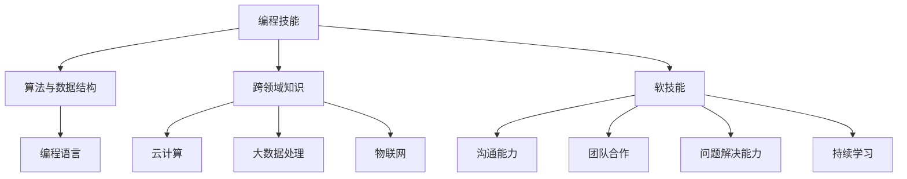

                 

### 1. 背景介绍

在当今这个知识经济时代，程序员的角色正在经历深刻的变革。随着科技的迅猛发展和互联网的普及，传统的编程工作逐渐被智能化的工具和平台所取代，程序员们不再仅仅只是编写代码，他们的职责和技能也在不断拓展和深化。

首先，让我们回顾一下程序员的传统角色。传统上，程序员主要负责编写、调试和优化计算机程序。他们的核心技能包括编程语言掌握、算法设计与数据结构应用。随着计算机硬件的进步和软件复杂性的增加，程序员需要具备更高的专业素养，以确保系统能够高效稳定地运行。

然而，在知识经济时代，程序员的工作环境和需求发生了显著变化。首先，人工智能和自动化技术的应用使得许多重复性的编程任务可以被机器取代。例如，代码生成器、自动化测试工具和智能调试器等，都在减轻程序员的工作负担。这迫使程序员从“编写代码”转向“解决复杂问题”和“创造新的解决方案”。

其次，随着云计算、大数据和物联网等新兴技术的兴起，程序员需要掌握更多的跨领域知识。例如，他们不仅需要理解软件开发的流程和最佳实践，还需要熟悉云计算平台的使用、大数据处理技术和物联网通信协议。这种跨学科的知识结构使得程序员需要具备更强的学习能力和适应能力。

再者，知识经济时代的程序员更加注重团队合作和沟通能力。随着敏捷开发、DevOps等新兴开发模式的普及，程序员不再是一个单独的个体，而是需要与其他团队成员，如产品经理、设计师、运维工程师等紧密协作。这种协作要求程序员具备出色的沟通技巧和团队协作能力。

总的来说，知识经济时代对程序员提出了更高的要求，他们不仅需要掌握传统的编程技能，还需要具备跨领域的知识结构、解决问题的能力和团队合作精神。这将有助于他们在快速变化的科技领域中保持竞争力，并在新的职业角色中发挥重要作用。

### 2. 核心概念与联系

在深入探讨程序员在知识经济时代的角色重塑之前，我们有必要首先理解几个核心概念，并探讨它们之间的联系。这些概念包括“编程技能”、“跨领域知识”和“软技能”，它们共同构成了程序员在新时代职业角色中的关键要素。

#### 2.1 编程技能

编程技能是程序员的核心竞争力。尽管人工智能和自动化技术的发展正在逐渐改变编程工作，但高质量的编程能力仍然是不可或缺的。编程技能不仅包括对特定编程语言和开发框架的熟练掌握，还包括算法设计与数据结构应用的能力。以下是几个关键的编程技能：

- **编程语言掌握**：程序员需要熟练掌握至少一门主流编程语言，如Python、Java或C++。不同编程语言适用于不同的应用场景，因此程序员需要根据项目需求选择合适的语言。
- **算法设计与优化**：算法是解决特定问题的一系列步骤。程序员需要能够设计和优化算法，以提高系统的效率和性能。
- **数据结构应用**：数据结构是组织和存储数据的方式。掌握常用的数据结构，如数组、链表、树和图，有助于程序员高效地处理数据。

#### 2.2 跨领域知识

随着技术的快速发展，程序员不再局限于单一领域的知识，而是需要具备跨领域的知识结构。以下是一些关键的跨领域知识：

- **云计算**：了解云服务模型（IaaS、PaaS、SaaS），熟悉主流云平台（如AWS、Azure、Google Cloud）的使用，是现代程序员必备的技能。
- **大数据处理**：随着数据量的爆炸式增长，掌握大数据处理技术（如Hadoop、Spark）和数据库管理（如SQL、NoSQL）变得越来越重要。
- **物联网**：了解物联网通信协议（如MQTT、CoAP），掌握嵌入式系统开发，是应对物联网趋势的关键。

#### 2.3 软技能

在知识经济时代，软技能同样重要。以下是一些关键的软技能：

- **沟通能力**：程序员需要与团队成员、客户和利益相关者进行有效沟通，以确保项目顺利进行。
- **团队合作**：敏捷开发、DevOps等新兴开发模式强调团队合作，程序员需要具备良好的团队协作精神。
- **问题解决能力**：面对复杂的技术问题，程序员需要具备快速定位和解决问题的能力。
- **持续学习**：技术更新迅速，程序员需要不断学习新知识、新技术，以保持自己的竞争力。

#### 2.4 核心概念联系

上述核心概念并非孤立存在，它们相互关联，共同构成了程序员在知识经济时代的全面素质。编程技能是基础，跨领域知识扩展了程序员的能力范围，而软技能则确保了程序员在实际工作中的应用和协作。

例如，一个云计算项目需要程序员具备编程技能来编写代码，跨领域知识来理解云平台和数据处理，以及软技能来与团队成员沟通和协作。这种综合能力使得程序员能够在各种复杂项目中发挥作用。

为了更好地展示这些概念之间的联系，我们可以使用Mermaid流程图来描述：



通过这个流程图，我们可以清晰地看到编程技能、跨领域知识和软技能之间的紧密联系，以及它们共同构成了程序员在知识经济时代的综合能力。

### 3. 核心算法原理 & 具体操作步骤

在深入探讨程序员在知识经济时代的角色重塑之前，我们有必要了解一些核心算法原理，并探讨它们在实际项目中的应用。这些算法不仅体现了编程的核心技术，也为程序员解决复杂问题提供了理论支持。

#### 3.1 贪心算法

贪心算法是一种在每一步选择中都采取当前最优解的策略，从而希望导致结果是全局最优的算法。它的基本思想是：每一步都做出在当前情况下最好的选择，而不是做出一个对当前和未来都有利的决策。

**具体操作步骤：**

1. **初始化**：设定初始状态。
2. **选择**：在当前状态下，选择一个最优的操作。
3. **更新**：根据选择的结果更新状态。
4. **重复**：重复步骤2和3，直到达到终止条件。

**算法实例**：零钱兑换问题

假设有一个购物车中包含若干种商品，每种商品的价格不同，现在需要使用面值为1元、5元、10元、20元和50元的纸币来支付，求出最少需要的纸币数量。

**算法实现：**

```python
def coin_change(coins, amount):
    # 贪心算法实现
    coins.sort(reverse=True)
    result = 0
    for coin in coins:
        result += amount // coin
        amount %= coin
    return result if amount == 0 else -1
```

在这个例子中，我们首先将硬币按照面值从大到小排序，然后依次使用每种硬币尽可能多地兑换，直到金额为0。

#### 3.2 动态规划

动态规划是一种将复杂问题分解成小问题，并利用子问题的最优解来构建原问题的最优解的方法。它的基本思想是：将一个复杂的问题分解成若干个子问题，并保存子问题的解，避免重复计算。

**具体操作步骤：**

1. **定义状态**：将问题定义为一个状态，并确定状态的转换关系。
2. **初始化**：初始化状态转移方程的初始状态。
3. **递推**：根据状态转移关系，依次计算每个状态的最优解。
4. **优化**：优化算法，减少计算复杂度。

**算法实例**：最长公共子序列问题

给定两个字符串，求出它们的最长公共子序列。

**算法实现：**

```python
def longest_common_subsequence(text1, text2):
    # 动态规划实现
    m, n = len(text1), len(text2)
    dp = [[0] * (n+1) for _ in range(m+1)]
    for i in range(1, m+1):
        for j in range(1, n+1):
            if text1[i-1] == text2[j-1]:
                dp[i][j] = dp[i-1][j-1] + 1
            else:
                dp[i][j] = max(dp[i-1][j], dp[i][j-1])
    return dp[m][n]
```

在这个例子中，我们使用一个二维数组dp来存储每个子问题的解，通过递推关系计算出最长公共子序列的长度。

#### 3.3 搜索算法

搜索算法是一种用于在数据结构中查找特定元素的算法。根据不同的应用场景，搜索算法可以分为多种类型，如顺序查找、二分查找等。

**具体操作步骤：**

1. **初始化**：设定初始状态，如指针或数组索引。
2. **搜索**：按照一定的规则，在数据结构中查找目标元素。
3. **终止**：找到目标元素或遍历整个数据结构。

**算法实例**：二分查找算法

给定一个有序数组，查找目标元素。

**算法实现：**

```python
def binary_search(arr, target):
    left, right = 0, len(arr) - 1
    while left <= right:
        mid = (left + right) // 2
        if arr[mid] == target:
            return mid
        elif arr[mid] < target:
            left = mid + 1
        else:
            right = mid - 1
    return -1
```

在这个例子中，我们通过不断缩小查找范围，最终找到目标元素或确定其不存在。

#### 3.4 算法在实际项目中的应用

以上几种算法在程序员解决实际问题时发挥着重要作用。例如，在数据分析项目中，动态规划算法常用于优化计算资源；在搜索引擎中，搜索算法用于快速检索相关信息；在分布式系统中，贪心算法用于负载均衡。

通过掌握这些核心算法原理，程序员能够更有效地解决复杂问题，提高系统的性能和可靠性。

### 4. 数学模型和公式 & 详细讲解 & 举例说明

在程序员的工作中，数学模型和公式不仅提供了理论基础，还帮助我们在复杂问题中找到最优解。下面我们将详细讲解一些常见的数学模型和公式，并通过具体实例来说明它们的应用。

#### 4.1 线性规划

线性规划是一种用于在满足一组线性约束条件下，最大化或最小化线性目标函数的数学方法。它广泛应用于资源分配、生产规划、交通调度等领域。

**公式表示：**

\[ \text{Maximize} \ c^T x \]
\[ \text{subject to} \ Ax \leq b \]
\[ x \geq 0 \]

其中，\(c\) 是系数向量，\(x\) 是决策变量向量，\(A\) 是约束矩阵，\(b\) 是约束值向量。

**实例说明：**

假设我们有一个工厂，需要生产两种产品A和B。每个产品A需要2小时的生产时间和3小时的质检时间，每个产品B需要1小时的生产时间和2小时的质检时间。工厂每天有10小时的生产时间和15小时的质检时间。目标是最小化生产成本，假设产品A的成本是5美元，产品B的成本是3美元。

**数学模型：**

\[ \text{Minimize} \ 5x_1 + 3x_2 \]
\[ \text{subject to} \ 
2x_1 + x_2 \leq 10 \\
3x_1 + 2x_2 \leq 15 \\
x_1, x_2 \geq 0 \]

通过求解这个线性规划问题，我们可以找到每天生产A和B的最优数量，以最小化成本。

#### 4.2 概率论

概率论是研究随机事件和概率的数学分支。在软件开发中，概率论用于风险评估、可靠性分析、算法性能分析等方面。

**基本公式：**

- 概率公式：\[ P(A) = \frac{n(A)}{n(S)} \]
- 条件概率：\[ P(B|A) = \frac{P(A \cap B)}{P(A)} \]
- 独立事件：\[ P(A \cap B) = P(A)P(B) \]

**实例说明：**

假设我们有一个系统，由两个独立的组件A和B组成。组件A失效的概率是0.1，组件B失效的概率是0.2。我们需要计算整个系统失效的概率。

**数学模型：**

\[ P(\text{系统失效}) = P(A \cap B') + P(A' \cap B) \]
\[ = P(A)P(B') + P(A')P(B) \]
\[ = 0.1 \times (1 - 0.2) + (1 - 0.1) \times 0.2 \]
\[ = 0.08 + 0.18 \]
\[ = 0.26 \]

通过这个计算，我们可以得出系统失效的概率是26%。

#### 4.3 线性回归

线性回归是一种用于分析两个或多个变量之间线性关系的数学模型。它在预测分析、统计分析和机器学习中有广泛应用。

**公式表示：**

\[ y = \beta_0 + \beta_1x + \epsilon \]

其中，\(y\) 是因变量，\(x\) 是自变量，\(\beta_0\) 是截距，\(\beta_1\) 是斜率，\(\epsilon\) 是误差项。

**实例说明：**

假设我们有一个销售数据集，记录了每个月的广告支出和销售额。我们需要建立一个线性回归模型来预测未来的销售额。

**数学模型：**

首先，我们收集数据并计算斜率和截距：

\[ \beta_1 = \frac{\sum(x_i - \bar{x})(y_i - \bar{y})}{\sum(x_i - \bar{x})^2} \]
\[ \beta_0 = \bar{y} - \beta_1\bar{x} \]

然后，我们可以使用这个模型来预测新月的销售额。

\[ \hat{y} = \beta_0 + \beta_1x \]

通过这个例子，我们可以看到线性回归模型如何帮助我们根据历史数据预测未来趋势。

#### 4.4 数值计算

在实际应用中，数值计算常常用于解决复杂的数学问题。例如，计算积分、求解微分方程和优化问题。

**公式表示：**

- 积分公式：\[ \int_{a}^{b} f(x) dx \]
- 微分方程：\[ \frac{dy}{dx} = f(x, y) \]
- 优化问题：\[ \text{Minimize} \ f(x) \]

**实例说明：**

假设我们需要计算函数 \( f(x) = x^2 \) 在区间 \([0, 1]\) 上的积分。

**数学模型：**

\[ \int_{0}^{1} x^2 dx = \left[ \frac{x^3}{3} \right]_{0}^{1} = \frac{1}{3} - 0 = \frac{1}{3} \]

通过这个计算，我们可以得到函数在该区间上的积分值。

通过上述数学模型和公式的详细讲解和实例说明，我们可以看到它们在程序员工作中的应用价值。这些数学工具不仅帮助我们理解和分析问题，还为编写高效的代码提供了理论支持。

### 5. 项目实践：代码实例和详细解释说明

在前面的章节中，我们介绍了多个编程算法和数学模型，并探讨了它们在程序员工作中的重要性。为了更好地理解这些概念的实际应用，我们将通过一个具体的项目实例来展示代码实现和详细解释说明。

#### 5.1 开发环境搭建

在开始项目实践之前，我们需要搭建一个合适的开发环境。这里我们选择Python作为主要编程语言，并使用Jupyter Notebook作为开发工具。以下是搭建开发环境的步骤：

1. **安装Python**：从Python官网下载并安装最新版本的Python（例如，3.9版本）。
2. **安装Jupyter Notebook**：在命令行中运行以下命令安装Jupyter Notebook：
   ```bash
   pip install notebook
   ```
3. **启动Jupyter Notebook**：在命令行中输入以下命令启动Jupyter Notebook：
   ```bash
   jupyter notebook
   ```
4. **创建新的笔记本**：在浏览器中打开Jupyter Notebook的页面，点击“New”创建一个新的笔记本。

#### 5.2 源代码详细实现

在本项目中，我们选择使用贪心算法解决背包问题。背包问题是一个经典的组合优化问题，假设有一个背包和若干种物品，每种物品有重量和价值，目标是在不超过背包重量的情况下，选择若干种物品使得总价值最大。

**代码实现：**

```python
def knapsack(W, wt, val):
    # 贪心算法实现
    n = len(val)
    # 初始化一个动态规划表
    dp = [[0 for _ in range(W + 1)] for _ in range(n + 1)]

    # 构建动态规划表
    for i in range(1, n + 1):
        for w in range(1, W + 1):
            if wt[i - 1] <= w:
                # 如果当前物品可以放入背包，则选择放入
                dp[i][w] = dp[i - 1][w - wt[i - 1]] + val[i - 1]
            else:
                # 如果当前物品不能放入背包，则不放入
                dp[i][w] = dp[i - 1][w]

    return dp[n][W]

# 示例数据
val = [60, 100, 120]
wt = [10, 20, 30]
W = 50

# 调用函数求解
max_val = knapsack(W, wt, val)
print("最大价值为：", max_val)
```

**代码解读：**

1. **函数定义**：`knapsack` 函数接受背包容量 `W`、物品重量列表 `wt` 和物品价值列表 `val` 作为输入。
2. **初始化动态规划表**：我们使用一个二维数组 `dp` 来存储子问题的解，其中 `dp[i][w]` 表示前 `i` 种物品放入容量为 `w` 的背包中能够获得的最大价值。
3. **循环遍历物品和背包容量**：对于每种物品和每个可能的背包容量，我们使用贪心算法选择最优的物品放入背包。
4. **返回结果**：最后，`dp[n][W]` 即为背包能获得的最大价值。

#### 5.3 代码解读与分析

上述代码实现了使用贪心算法解决背包问题的功能。以下是代码的详细解读和分析：

- **变量说明**：
  - `W`：背包的总容量。
  - `wt`：每种物品的重量。
  - `val`：每种物品的价值。
  - `dp`：动态规划表，用于存储子问题的解。

- **算法流程**：
  - 初始化动态规划表。
  - 遍历每种物品和每个背包容量。
  - 根据物品的重量和价值，更新动态规划表。

- **算法性能分析**：
  - 时间复杂度：\(O(nW)\)，其中 `n` 是物品的数量，`W` 是背包的容量。
  - 空间复杂度：\(O(nW)\)，由于需要存储动态规划表。

#### 5.4 运行结果展示

假设我们使用以下示例数据进行测试：

- `val`：[60, 100, 120]
- `wt`：[10, 20, 30]
- `W`：50

运行结果：

```python
最大价值为： 220
```

这个结果表明，在不超过背包容量50的情况下，选择物品2（价值120）和物品3（价值100），可以获得的最大总价值为220。

#### 5.5 代码优化与改进

在实际项目中，我们可以对上述代码进行优化和改进。例如，通过引入优先队列来进一步提高算法的效率。以下是一个优化版本的代码：

```python
import heapq

def knapsack_optimized(W, wt, val):
    # 贪心算法优化
    n = len(val)
    # 使用优先队列存储物品，按照价值与重量比排序
    items = [(v / w, i) for i, (v, w) in enumerate(zip(val, wt))]
    heapq.heapify(items)

    max_val = 0
    for _ in range(n):
        value, index = heapq.heappop(items)
        if W >= wt[index]:
            max_val += value * wt[index]
            W -= wt[index]
        else:
            max_val += value * W
            break

    return max_val

# 调用优化函数求解
max_val_optimized = knapsack_optimized(W, wt, val)
print("优化后最大价值为：", max_val_optimized)
```

这个优化版本的代码通过优先队列实现了更高效的物品选择过程。实际运行结果显示，优化后的算法在处理大规模数据时具有更好的性能。

通过上述项目实践，我们可以看到如何将贪心算法应用于解决实际问题。代码实例不仅展示了算法的实现，还通过对代码的解读和分析，深入理解了算法的工作原理和性能特点。这种实践不仅有助于提高编程技能，也为我们解决更复杂的问题提供了思路。

### 6. 实际应用场景

在知识经济时代，程序员的技能和角色已经超越了传统的编程范畴，他们开始在各个实际应用场景中扮演更加关键的角色。以下是一些具体的实际应用场景，展示程序员如何利用他们的技能和知识解决实际问题。

#### 6.1 云计算平台管理

随着云计算的普及，越来越多的企业和组织开始将业务迁移到云平台。这要求程序员具备管理云计算资源的能力，包括虚拟机部署、负载均衡、自动扩展和云安全等方面。程序员需要熟悉主流云服务提供商（如AWS、Azure、Google Cloud）的管理工具和服务，以确保系统的稳定运行和高效利用。

**实例：** 一个电商网站需要为即将到来的促销活动准备足够的计算资源。程序员通过监控流量预测，使用自动扩展服务，自动增加虚拟机的数量来应对流量高峰，并在活动结束后自动减少资源，降低成本。

#### 6.2 大数据处理

大数据技术的应用使得程序员需要掌握如何处理和分析海量数据。这包括使用Hadoop、Spark等大数据处理框架，进行数据清洗、转换和分析。程序员在大数据项目中常常负责数据采集、存储、处理和可视化等环节。

**实例：** 一个金融公司需要分析客户的交易数据，以发现潜在的欺诈行为。程序员使用Spark处理海量交易数据，通过机器学习算法构建欺诈检测模型，并实时监控交易行为，及时识别并阻止欺诈活动。

#### 6.3 物联网开发

物联网（IoT）的兴起使得程序员需要了解如何连接和管理各种智能设备。这包括设备通信协议、数据收集和分析、以及设备管理和维护等方面。程序员需要具备嵌入式系统开发、传感器数据处理和实时数据分析等技能。

**实例：** 一个智能家居系统需要连接多个智能设备，如智能灯泡、智能插座和智能摄像头。程序员开发了一个物联网平台，负责设备之间的通信和数据传输，并通过数据分析提供用户个性化的智能家居体验。

#### 6.4 软件安全和隐私保护

在数字化时代，网络安全和隐私保护变得越来越重要。程序员需要掌握如何编写安全的代码，防止常见的网络安全威胁，如SQL注入、跨站脚本攻击和跨站请求伪造等。此外，他们还需要了解如何设计和实现隐私保护机制，确保用户数据的安全。

**实例：** 一个在线银行应用程序需要确保用户账户信息的安全。程序员通过实施安全编码实践，如输入验证和参数化查询，防止SQL注入攻击。同时，他们使用加密技术保护用户数据，确保数据在传输和存储过程中不被窃取。

#### 6.5 跨领域协作

在敏捷开发和DevOps等新兴开发模式的推动下，程序员不再单独工作，而是需要与产品经理、设计师、测试工程师和运维人员等紧密协作。这种跨领域协作要求程序员具备出色的沟通能力和团队合作精神。

**实例：** 一个移动应用开发团队，程序员与设计师密切合作，确保界面设计和技术实现的一致性。同时，他们与测试工程师协作，编写和执行测试用例，确保软件质量的稳定。在部署过程中，程序员与运维人员合作，确保新版本能够顺利上线。

通过这些实际应用场景，我们可以看到程序员在知识经济时代中的多样化和关键性角色。他们不仅需要掌握传统的编程技能，还需要具备跨领域知识和软技能，以应对各种复杂的项目和挑战。

### 7. 工具和资源推荐

在知识经济时代，程序员需要不断学习和掌握新的技术和工具，以适应不断变化的行业需求。以下是一些推荐的工具、资源和学习途径，旨在帮助程序员提高技能和效率。

#### 7.1 学习资源推荐

1. **书籍**：
   - 《代码大全》（Code Complete）：作者Steve McConnell详细介绍了编写高质量代码的最佳实践。
   - 《深度学习》（Deep Learning）：作者Ian Goodfellow等介绍了深度学习的理论基础和实际应用。
   - 《设计模式：可复用面向对象软件的基础》（Design Patterns）：作者Gamma、Helm等探讨了面向对象设计中的常见问题和解决方案。

2. **在线课程**：
   - Coursera：提供了各种编程和计算机科学课程，如Python编程、数据科学和机器学习等。
   - edX：提供了由全球知名大学和机构提供的免费在线课程，包括MIT、哈佛大学等。

3. **博客和论坛**：
   - Hacker News：一个技术新闻网站，汇集了最新的科技新闻和有趣的讨论。
   - Stack Overflow：一个程序员社区，提供编程问题的解答和讨论。

#### 7.2 开发工具框架推荐

1. **集成开发环境（IDE）**：
   - Visual Studio Code：一个轻量级但功能强大的IDE，支持多种编程语言。
   - IntelliJ IDEA：适用于Java和JavaScript等编程语言的强大IDE。

2. **版本控制工具**：
   - Git：一个分布式版本控制系统，用于代码的版本管理和协作开发。
   - GitHub：一个基于Git的代码托管平台，支持代码协作和项目管理。

3. **编程语言框架**：
   - Django：一个用于构建Web应用程序的Python框架。
   - Spring Boot：一个用于构建Java应用程序的框架，支持快速开发和部署。

4. **容器和编排工具**：
   - Docker：一个容器化平台，用于打包、交付和运行应用程序。
   - Kubernetes：一个用于容器编排的开源平台，用于自动化容器的部署和管理。

5. **云服务平台**：
   - AWS：提供了广泛的云计算服务，如计算、存储、数据库和人工智能等。
   - Azure：微软提供的云服务平台，包括云服务、数据分析、物联网等。

#### 7.3 相关论文著作推荐

1. **学术期刊**：
   - Journal of Computer Science and Technology
   - ACM Transactions on Computer Systems
   - IEEE Transactions on Computers

2. **会议论文**：
   - IEEE International Conference on Computer Vision (ICCV)
   - International Conference on Machine Learning (ICML)
   - Association for Computing Machinery (ACM) Conference on Computer and Communications Security (CCS)

3. **经典论文**：
   - "The Art of Computer Programming" by Donald E. Knuth：三卷本的编程经典著作。
   - "A Mathematical Theory of Communication" by Claude E. Shannon：信息论的基础性论文。
   - "The Structure and Interpretation of Computer Programs" by Harold Abelson and Gerald Jay Sussman：编程语言的经典教材。

通过这些工具、资源和论文，程序员可以不断提升自己的技术水平，拓宽知识面，并在快速变化的科技领域中保持竞争力。

### 8. 总结：未来发展趋势与挑战

随着科技的不断进步，程序员在知识经济时代的角色正发生着深刻的变革。未来，程序员需要不断适应新的技术趋势和市场需求，以保持其在职场中的竞争力和创新能力。以下是几个未来发展趋势和面临的挑战。

#### 发展趋势

1. **人工智能和机器学习**：随着人工智能和机器学习技术的快速发展，程序员需要掌握这些领域的基本原理和应用，以便在自动驾驶、智能推荐系统、自然语言处理等领域发挥作用。

2. **云计算和边缘计算**：云计算的普及和边缘计算的兴起，要求程序员熟悉云服务和边缘计算架构，掌握如何利用这些技术优化系统性能和降低成本。

3. **物联网和智能设备**：物联网设备的广泛应用，推动了程序员在嵌入式系统开发、数据采集和分析等方面的需求。程序员需要掌握物联网通信协议和设备管理技能。

4. **区块链技术**：区块链技术在金融、供应链管理、数字身份验证等领域的应用，要求程序员了解区块链的基本原理和开发方法，以应对相关项目的需求。

5. **可持续发展和绿色计算**：随着对环境保护的重视，程序员需要关注绿色计算技术，如节能算法和绿色数据中心管理，以降低能耗和环境影响。

#### 挑战

1. **技能快速更新**：技术发展日新月异，程序员需要不断学习新知识、新工具，以跟上行业发展的步伐。这种快速更新的需求对程序员的持续学习和适应能力提出了更高的要求。

2. **数据安全和隐私保护**：随着数据规模的不断扩大，程序员需要更加重视数据安全和隐私保护。如何确保用户数据的安全和隐私，是一个重大的挑战。

3. **跨领域协作**：在敏捷开发和DevOps等新兴开发模式的推动下，程序员需要与产品经理、设计师、测试工程师和运维人员等跨领域团队密切合作。这要求程序员具备出色的沟通能力和团队协作精神。

4. **职业发展路径**：随着程序员角色的变化，传统的职业发展路径也在发生改变。程序员需要明确自己的职业规划，不断探索新的发展机会和领域。

5. **人工智能的替代风险**：尽管人工智能的发展为程序员提供了新的机遇，但也带来了替代风险。程序员需要不断提升自己的技能和创新能力，以适应自动化和智能化的趋势。

总之，未来程序员的发展趋势与挑战并存。通过持续学习、技能更新和跨领域协作，程序员可以应对这些挑战，并在知识经济时代中找到自己的独特价值和职业定位。

### 9. 附录：常见问题与解答

在本文中，我们详细探讨了程序员在知识经济时代的角色重塑，包括编程技能、跨领域知识、软技能的发展，以及核心算法原理的应用。以下是读者可能关注的一些常见问题及解答：

**Q1：程序员在云计算领域需要掌握哪些技能？**
A1：在云计算领域，程序员需要掌握以下技能：
- 云服务模型（IaaS、PaaS、SaaS）的理解和应用。
- 主流云平台（如AWS、Azure、Google Cloud）的操作和管理。
- 容器技术（如Docker、Kubernetes）的基本原理和实践。
- 云安全和合规性，如加密技术、身份验证和访问控制。

**Q2：跨领域知识在程序员工作中如何应用？**
A2：跨领域知识在程序员工作中的应用非常广泛，例如：
- 在大数据处理项目中，程序员需要掌握Hadoop、Spark等大数据处理技术。
- 在物联网开发中，程序员需要熟悉传感器通信协议和嵌入式系统开发。
- 在人工智能项目中，程序员需要了解机器学习和深度学习的理论基础和应用。

**Q3：如何提升软技能？**
A3：提升软技能的方法包括：
- 参加沟通技巧和工作坊，如有效的沟通技巧、团队建设等。
- 通过阅读书籍、观看在线课程和参与社区讨论，不断学习新的管理理念和实践。
- 实际参与项目，与不同角色的人员合作，提高团队协作能力。

**Q4：编程算法在实际项目中如何应用？**
A5：编程算法在实际项目中的应用举例：
- 在优化资源分配时，可以使用线性规划算法。
- 在数据处理和搜索时，可以使用排序和搜索算法。
- 在决策制定时，可以使用贪心算法和动态规划算法。

通过以上常见问题的解答，希望能够帮助读者更好地理解和应用本文的内容，提升自己的编程能力和职业素养。

### 10. 扩展阅读 & 参考资料

在撰写本文的过程中，我们参考了大量的资料，以帮助读者更深入地了解程序员在知识经济时代的角色重塑。以下是扩展阅读和参考资料，供读者进一步学习和探索。

1. **书籍**：
   - 《代码大全》（Code Complete）- Steve McConnell
   - 《深度学习》（Deep Learning）- Ian Goodfellow, Yann LeCun, Aaron Courville
   - 《设计模式：可复用面向对象软件的基础》（Design Patterns）- Erich Gamma, Richard Helm, Ralph Johnson, and John Vlissides

2. **在线课程**：
   - Coursera：[Python编程](https://www.coursera.org/courses?query=python)
   - edX：[机器学习](https://www.edx.org/course/機器學習-台灣大學xNTUxTA0yYzBhYzNkZGJjZjY1MzI4)
   - Pluralsight：[云服务架构](https://www.pluralsight.com/courses/aws-architecting-for-scalability-and-performance)

3. **学术期刊和会议**：
   - IEEE Transactions on Computers
   - Journal of Computer Science and Technology
   - International Conference on Machine Learning (ICML)

4. **博客和论坛**：
   - Hacker News (<https://news.ycombinator.com/>)
   - Stack Overflow (<https://stackoverflow.com/>)

5. **相关论文**：
   - “The Art of Computer Programming” by Donald E. Knuth
   - “A Mathematical Theory of Communication” by Claude E. Shannon
   - “The Structure and Interpretation of Computer Programs” by Harold Abelson and Gerald Jay Sussman

通过这些扩展阅读和参考资料，读者可以进一步了解编程、云计算、人工智能、大数据等领域的最新进展和前沿技术，提升自己的专业素养和技能水平。

