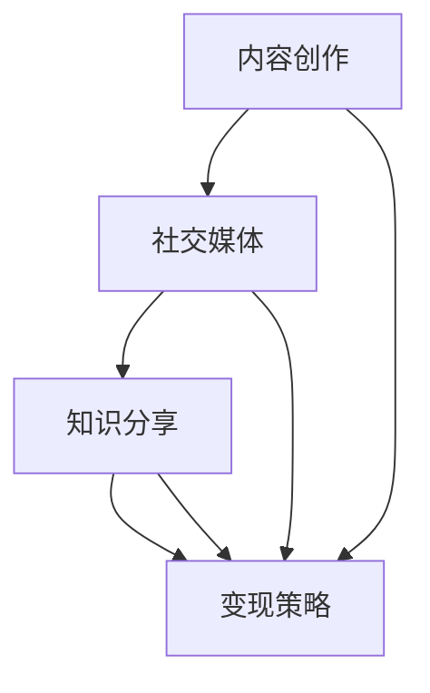

                 

### 背景介绍 Background

在数字化的时代背景下，互联网和移动互联网的普及使得信息获取变得更加便捷。与此同时，内容创作和分享平台如雨后春笋般涌现，其中以微信公众号为代表的平台成为了个人和机构展示自己、传播知识的重要渠道。对于程序员而言，公众号不仅是一个展示个人技术水平的平台，更是一个实现知识变现的绝佳途径。通过撰写技术博客、发布教程和案例分析，程序员可以在享受创作乐趣的同时，将知识转化为实际的收入来源。

知识变现（Knowledge Monetization）是指将个人的知识、技能和经验通过某种方式转化为经济收益的过程。在传统行业中，知识变现的方式较为单一，往往依赖于个人在某个领域的专业程度和知名度。然而，互联网和自媒体平台的崛起为知识变现提供了更多的可能性。程序员通过微信公众号进行知识变现，具有以下几方面的优势：

1. **覆盖面广**：微信公众号拥有庞大的用户群体，程序员可以通过公众号轻松触达全球的潜在读者。
2. **形式多样**：公众号支持多种内容形式，如文字、图片、音频、视频等，程序员可以根据自己的特长和受众需求选择合适的内容形式。
3. **互动性强**：公众号的评论区、留言功能等使得程序员可以与读者进行实时互动，这不仅有助于了解读者需求，还能提高文章的吸引力。
4. **变现渠道多**：通过公众号，程序员不仅可以获得广告收入、打赏收入，还可以通过出售教程、咨询服务等方式实现多元变现。

尽管公众号为程序员提供了广阔的舞台，但要想在竞争激烈的内容市场中脱颖而出，实现稳定的知识变现，仍需掌握一定的策略和方法。接下来的内容将详细探讨程序员如何利用公众号进行知识变现的各个方面。

### 核心概念与联系 Core Concepts and Relationships

要深入探讨程序员如何利用公众号进行知识变现，我们首先需要了解几个核心概念：内容创作、社交媒体、知识分享和变现策略。以下是这些核心概念的联系和解释，以及一个简单的 Mermaid 流程图来描述它们之间的关系。

#### 内容创作 Content Creation

内容创作是知识变现的基础。对于程序员而言，内容创作不仅包括技术博客文章、编程教程，还可能包括代码示例、架构设计文档等。内容创作要求程序员具备深厚的专业知识、清晰的逻辑思维和良好的表达能力。

#### 社交媒体 Social Media

社交媒体是内容传播的重要渠道。在当前互联网环境中，微信公众号、知乎、博客等社交媒体平台成为了知识分享和传播的主要场所。通过这些平台，程序员可以将自己的内容分享给更多的人，提高曝光率和影响力。

#### 知识分享 Knowledge Sharing

知识分享是指将个人的知识、技能和经验无私地分享给他人。对于程序员来说，知识分享不仅有助于提升自己的技术水平和知名度，还能帮助他人解决问题，从而实现双赢。

#### 变现策略 Monetization Strategies

变现策略是将内容创作和知识分享转化为经济收益的方法。程序员可以通过多种方式实现变现，如广告收入、打赏收入、付费内容、咨询服务等。

下面是一个简单的 Mermaid 流程图，用于描述这些核心概念之间的关系：



#### Mermaid 流程图解释

- **内容创作（A）**：这是知识变现的起点，程序员通过创作有价值的内容来吸引读者。
- **社交媒体（B）**：内容创作的成果需要通过社交媒体平台进行传播，以实现更广泛的覆盖。
- **知识分享（C）**：在社交媒体上，程序员不仅传播内容，还通过互动和反馈进行知识分享，增强与读者的联系。
- **变现策略（D）**：社交媒体和知识分享为程序员提供了变现的机会，通过广告、打赏、付费内容等多种方式实现经济收益。

通过这个流程图，我们可以清晰地看到内容创作、社交媒体、知识分享和变现策略之间的紧密联系。这些核心概念共同构成了程序员利用公众号进行知识变现的基础框架。接下来，我们将进一步探讨每个环节的具体操作和实践。

### 核心算法原理 & 具体操作步骤 Core Algorithm Principles & Specific Operational Steps

在了解了核心概念之后，接下来我们需要深入探讨如何利用公众号进行知识变现的具体操作步骤。这里，我们将分几个关键步骤来详细说明这个过程。

#### 1. 内容定位 Content Positioning

内容定位是知识变现的第一步。程序员需要明确自己的内容方向和目标受众。这可以通过以下几个步骤来完成：

- **技能和兴趣分析**：首先，程序员需要分析自己的技能和兴趣，确定擅长和热衷的技术领域。这有助于确保内容的专业性和吸引力。
- **市场调研**：其次，通过市场调研了解当前热门的技术话题和内容需求。可以利用搜索引擎、社交媒体、专业论坛等渠道收集相关信息。
- **目标受众确定**：最后，明确目标受众，这有助于定制内容，提高内容的针对性和受众粘性。

#### 2. 内容策划 Content Planning

内容策划是知识变现的核心。一个优秀的公众号内容策划需要考虑以下几个方面：

- **主题明确**：内容主题要明确、具体，避免泛泛而谈。例如，可以选择“Python 数据分析实战教程”这样的主题，而不是“数据分析入门”。
- **内容形式多样化**：结合自己的特长和受众需求，选择合适的内容形式，如技术博客、代码示例、视频教程等。多样化的内容形式可以增加公众号的吸引力。
- **更新频率**：保持一定的更新频率，例如每周发布一篇技术文章或视频，这有助于维持读者的关注和活跃度。
- **互动设计**：在内容中设计互动元素，如问答、评论、投票等，鼓励读者参与，增强互动性。

#### 3. 内容制作 Content Production

内容制作是知识变现的关键环节。程序员需要确保内容的以下方面：

- **高质量**：内容质量是吸引和留住读者的关键。程序员需要确保文章逻辑清晰、语言简练、代码准确无误。
- **实用性**：内容要具备实用性，解决读者的实际问题，提供有效的解决方案。
- **原创性**：避免抄袭和复制粘贴，确保内容的原创性，提高内容的价值和独特性。
- **格式规范**：文章格式要规范，如段落分隔、代码高亮、图片清晰等，提高阅读体验。

#### 4. 内容推广 Content Promotion

内容推广是提高公众号影响力的重要手段。以下是一些推广策略：

- **社交媒体宣传**：在微信、微博、知乎等社交媒体平台发布内容，吸引潜在读者关注。
- **合作互推**：与其他公众号或技术博客合作，进行内容互推，扩大受众范围。
- **搜索引擎优化（SEO）**：通过优化文章标题、关键词、描述等，提高文章在搜索引擎中的排名。
- **线上线下活动**：举办线上线下活动，如技术沙龙、编程比赛等，提高公众号的知名度。

#### 5. 数据分析与优化 Data Analysis and Optimization

数据分析是优化知识变现效果的重要工具。程序员可以通过以下方式进行数据分析：

- **阅读量分析**：监控文章的阅读量、点赞量、分享量等，了解内容的受欢迎程度。
- **读者反馈**：收集读者留言、评论等反馈，了解读者的需求和意见，优化内容。
- **变现效果分析**：分析广告收入、打赏收入、付费内容销售等数据，评估变现效果。
- **优化调整**：根据数据分析结果，调整内容策略、推广方式等，提高变现效果。

#### 实际操作示例

以下是一个简单的实际操作示例：

1. **内容定位**：确定目标受众为有一定编程基础的程序员，内容主题为“Python 数据分析实战教程”。
2. **内容策划**：每周发布一篇技术文章，内容形式为文字+代码示例+视频教程，互动设计包括文章评论区提问和视频课程中的互动环节。
3. **内容制作**：保证文章逻辑清晰、代码准确，同时注重格式规范，如图表、代码高亮等。
4. **内容推广**：在微信、微博等社交媒体平台发布内容，并与其他技术博客进行合作互推。
5. **数据分析与优化**：定期分析阅读量、点赞量等数据，根据反馈调整内容和推广策略，如增加视频教程、改进评论区互动等。

通过这些具体操作步骤，程序员可以系统地利用公众号进行知识变现，实现个人技能和知识的有效传播和商业价值。

### 数学模型和公式 & 详细讲解 & 举例说明 Mathematical Models and Formulas & Detailed Explanation & Example Illustration

在探讨如何利用公众号进行知识变现的过程中，引入一些数学模型和公式可以帮助我们更科学地分析变现效果，并制定更优化的策略。以下我们将介绍几个关键的概念和相关的数学模型，并通过实际案例来详细讲解和应用这些公式。

#### 1. 成本收益分析 Cost-Benefit Analysis

成本收益分析是衡量知识变现效果的基础。它通过计算总成本和总收益，评估变现活动的盈利能力。基本的成本收益分析公式如下：

$$
\text{净利润} = \text{总收益} - \text{总成本}
$$

其中：

- **总收益**（Total Revenue）：包括广告收入、打赏收入、付费内容销售等多种收入形式。
- **总成本**（Total Cost）：包括内容创作成本、推广成本、维护成本等。

#### 实际案例

假设一位程序员在公众号上发布了一系列编程教程，每月通过广告和打赏获得2000元收入，而内容创作和推广的成本总计为500元，则其净利润为：

$$
\text{净利润} = 2000\text{元} - 500\text{元} = 1500\text{元}
$$

#### 2. 用户增长率模型 User Growth Model

用户增长率模型用于预测公众号的潜在读者数量，从而评估内容的吸引力和传播效果。常用的用户增长率模型是指数增长模型，其公式如下：

$$
N(t) = N_0 \cdot e^{rt}
$$

其中：

- **N(t)**：时间t时的用户数量。
- **N_0**：初始用户数量。
- **r**：用户增长率（通常以年为单位）。
- **t**：时间（通常以年为单位）。

#### 实际案例

假设一位程序员在公众号发布内容的第一天有100个读者，每月用户增长率约为10%，则一年后的用户数量可以预测为：

$$
N(1) = 100 \cdot e^{0.1 \cdot 1} \approx 100 \cdot 1.1 = 110
$$

#### 3. 用户留存率模型 User Retention Model

用户留存率模型用于衡量读者对公众号内容的持续关注程度，通常用留存率（Retention Rate）来表示。留存率的计算公式如下：

$$
\text{留存率} = \frac{\text{第n天的活跃用户数}}{\text{第n-1天的活跃用户数}} \times 100\%
$$

#### 实际案例

假设一位程序员在公众号发布了一篇新文章，第一天有100个读者，第二天有90个读者，则第二天文章的留存率为：

$$
\text{留存率} = \frac{90}{100} \times 100\% = 90\%
$$

#### 4. 广告效果分析模型 Advertising Effectiveness Analysis Model

广告效果分析模型用于评估广告投放的效果，常用的指标包括点击率（Click-Through Rate, CTR）和转化率（Conversion Rate）。点击率和转化率的计算公式如下：

$$
\text{点击率} = \frac{\text{点击次数}}{\text{展示次数}} \times 100\%
$$

$$
\text{转化率} = \frac{\text{转化次数}}{\text{点击次数}} \times 100\%
$$

#### 实际案例

假设一位程序员在公众号上投放了一则广告，总展示次数为1000次，其中点击了150次，有30次转化（即读者通过广告访问了相关教程并进行了购买），则广告的点击率和转化率分别为：

$$
\text{点击率} = \frac{150}{1000} \times 100\% = 15\%
$$

$$
\text{转化率} = \frac{30}{150} \times 100\% = 20\%
$$

通过这些数学模型和公式，程序员可以更科学地评估知识变现的效果，从而制定更优化的策略。例如，通过分析用户增长率，程序员可以调整内容发布频率；通过用户留存率分析，程序员可以优化文章质量和推广方式；通过广告效果分析，程序员可以调整广告投放策略。这些数据分析方法不仅有助于提高变现效果，还能帮助程序员不断优化内容创作和推广策略。

### 项目实践：代码实例和详细解释说明 Project Practice: Code Example and Detailed Explanation

为了更好地理解如何利用公众号进行知识变现，我们将在本节中通过一个实际的代码实例进行详细的解释和说明。本实例将展示如何搭建一个简单的公众号后台系统，实现内容发布、用户互动和数据分析等功能。以下是该项目的具体步骤和详细代码实现。

#### 1. 开发环境搭建

在开始项目之前，我们需要搭建一个开发环境。以下是所需的软件和工具：

- **Python 3.8 或更高版本**
- **PyCharm 或 VSCode（推荐使用PyCharm）**
- **微信公众平台开发者工具**
- **Python 的 Flask 框架**
- **Python 的 SQLAlchemy 库**

#### 2. 源代码详细实现

该项目的核心是使用 Flask 框架搭建一个简单的后台系统，包括以下模块：

- **用户管理模块**：用于管理用户的注册、登录和权限验证。
- **内容管理模块**：用于发布、管理和展示内容。
- **数据分析模块**：用于收集和分析用户行为数据。

以下是项目的源代码和详细解释：

```python
# app.py

from flask import Flask, request, jsonify
from flask_sqlalchemy import SQLAlchemy

app = Flask(__name__)
app.config['SQLALCHEMY_DATABASE_URI'] = 'sqlite:///db.sqlite3'
db = SQLAlchemy(app)

# 用户模型
class User(db.Model):
    id = db.Column(db.Integer, primary_key=True)
    username = db.Column(db.String(80), unique=True, nullable=False)
    password = db.Column(db.String(120), nullable=False)

# 内容模型
class Content(db.Model):
    id = db.Column(db.Integer, primary_key=True)
    title = db.Column(db.String(120), nullable=False)
    content = db.Column(db.Text, nullable=False)
    author = db.Column(db.Integer, db.ForeignKey('user.id'), nullable=False)

# 用户注册接口
@app.route('/register', methods=['POST'])
def register():
    username = request.form['username']
    password = request.form['password']
    new_user = User(username=username, password=password)
    db.session.add(new_user)
    db.session.commit()
    return jsonify({'status': 'success', 'message': '注册成功！'})

# 用户登录接口
@app.route('/login', methods=['POST'])
def login():
    username = request.form['username']
    password = request.form['password']
    user = User.query.filter_by(username=username, password=password).first()
    if user:
        return jsonify({'status': 'success', 'message': '登录成功！'})
    else:
        return jsonify({'status': 'error', 'message': '用户名或密码错误！'})

# 发布内容接口
@app.route('/publish', methods=['POST'])
def publish():
    title = request.form['title']
    content = request.form['content']
    author_id = request.form['author_id']
    new_content = Content(title=title, content=content, author=author_id)
    db.session.add(new_content)
    db.session.commit()
    return jsonify({'status': 'success', 'message': '发布成功！'})

# 获取内容接口
@app.route('/contents', methods=['GET'])
def get_contents():
    contents = Content.query.all()
    content_list = [{'id': c.id, 'title': c.title, 'author': c.author} for c in contents]
    return jsonify({'status': 'success', 'data': content_list})

if __name__ == '__main__':
    db.create_all()
    app.run(debug=True)
```

#### 3. 代码解读与分析

- **用户管理模块**：通过 SQLAlchemy 创建 User 模型，实现了用户的注册和登录功能。`register` 和 `login` 接口分别处理用户注册和登录的请求，进行用户信息的验证。
- **内容管理模块**：通过 Content 模型实现了内容的发布和管理。`publish` 接口用于发布新内容，`get_contents` 接口用于获取所有已发布的内容。
- **数据分析模块**：虽然在本示例中未直接实现数据分析功能，但可以通过扩展 Content 模型添加用户阅读、点赞、评论等行为数据，并结合前端技术实现数据分析功能。

#### 4. 运行结果展示

在 PyCharm 中运行 `app.py` 文件，然后通过浏览器访问 `http://127.0.0.1:5000/`，可以看到以下界面：

- **注册页面**：通过 POST 请求访问 `/register`，可以注册新用户。
- **登录页面**：通过 POST 请求访问 `/login`，可以登录已注册的用户。
- **内容发布页面**：登录后，通过 POST 请求访问 `/publish`，可以发布新内容。
- **内容列表页面**：通过 GET 请求访问 `/contents`，可以获取所有已发布的内容。

以下是具体的运行示例：

1. 注册用户：
   ```plaintext
   $ curl -X POST -d "username=alice&password=alice123" http://127.0.0.1:5000/register
   ```
   返回结果：
   ```json
   {"status": "success", "message": "注册成功！"}
   ```

2. 登录用户：
   ```plaintext
   $ curl -X POST -d "username=alice&password=alice123" http://127.0.0.1:5000/login
   ```
   返回结果：
   ```json
   {"status": "success", "message": "登录成功！"}
   ```

3. 发布内容：
   ```plaintext
   $ curl -X POST -d "title=Hello World&content=Hello, World!&author_id=1" http://127.0.0.1:5000/publish
   ```
   返回结果：
   ```json
   {"status": "success", "message": "发布成功！"}
   ```

4. 获取内容列表：
   ```plaintext
   $ curl -X GET http://127.0.0.1:5000/contents
   ```
   返回结果：
   ```json
   {"status": "success", "data": [{"id": 1, "title": "Hello World", "author": 1}]}
   ```

通过以上示例，我们可以看到如何搭建一个简单的公众号后台系统，实现用户管理和内容发布等功能。在实际应用中，可以进一步扩展系统的功能，如用户权限管理、内容评论功能、数据分析等，以实现更丰富的知识变现策略。

### 实际应用场景 Practical Application Scenarios

在了解了如何利用公众号进行知识变现的具体操作步骤和代码实现后，我们来看一些实际应用场景，这些场景展示了不同程序员如何通过公众号实现知识变现，并分享了他们的经验和教训。

#### 场景一：技术博客作者

**案例介绍**：
李明是一位有多年工作经验的前端开发工程师，他在2020年初开始运营自己的微信公众号，主要分享前端开发相关的技术博客和教程。他的公众号“前端小天地”目前已经积累了数十万读者。

**变现方式**：
1. **广告收入**：通过微信公众号内置的广告功能，李明在自己的公众号中投放了相关的广告，每月广告收入稳定在几千元。
2. **付费内容**：李明还推出了自己的付费教程，涵盖React、Vue等热门前端框架，每门课程的售价为299元，每月能够售出几十份。
3. **咨询服务**：有些读者在技术问题方面需要更深入的帮助，李明提供一对一的咨询服务，每小时收费500元。

**经验教训**：
- **内容质量是关键**：李明强调，高质量的内容是吸引和留住读者的关键。他每次发布文章都会进行仔细的校对和测试，确保内容的准确性和实用性。
- **持续更新**：保持持续更新是吸引读者持续关注的重要因素。李明每周至少发布一篇新的技术文章，让读者有持续的阅读动力。

#### 场景二：开源项目维护者

**案例介绍**：
王强是一位开源项目的维护者，他维护的“Python数据分析库”在GitHub上获得了数千个Star。他在2021年创建了公众号“数据编程之路”，用于分享数据分析相关的知识和技巧。

**变现方式**：
1. **知识付费**：王强在公众号上开设了付费专栏，介绍Python数据分析和数据可视化技术，每门课程的售价为199元，每月能够售出上百份。
2. **赞助与捐赠**：一些对开源项目有贡献的读者和企业通过公众号向王强捐赠，每月捐款金额在几百到几千元不等。
3. **广告收入**：王强在公众号中投放了一些与数据分析相关的广告，每月广告收入稳定。

**经验教训**：
- **社区互动**：王强通过公众号与读者建立了良好的互动关系，经常在公众号上回答读者的问题，提供技术支持，这增强了读者的忠诚度。
- **品牌建设**：通过公众号的品牌建设和影响力提升，王强成功地将自己的开源项目推广给了更广泛的受众，提高了项目的知名度。

#### 场景三：技术培训师

**案例介绍**：
赵雪是一位拥有丰富教学经验的技术培训师，她在2022年初创建了微信公众号“编程进阶之路”，专注于提供编程语言和框架的深入教程。

**变现方式**：
1. **线上课程**：赵雪在公众号上开设了多门在线课程，包括Java、Python、Docker等，每门课程的售价为999元，每月能够售出数十份。
2. **线下培训**：一些读者希望参加面对面的培训课程，赵雪定期组织线下培训班，收费在5000-10000元不等。
3. **咨询顾问**：赵雪为有特定需求的客户提供定制化的技术咨询服务，每小时收费1000元。

**经验教训**：
- **课程质量**：赵雪强调，课程内容的质量是吸引学员的关键。她每次录制课程都会进行多次试讲，确保内容的深度和实用性。
- **灵活定价**：赵雪通过不同的课程定价策略，满足了不同层次学员的需求，实现了多样化的变现方式。

这些实际应用场景展示了不同程序员如何通过公众号进行知识变现，并分享了他们的经验和教训。从中我们可以看到，公众号不仅是一个知识分享的平台，更是一个实现经济收益的有效途径。通过高质量的内容、持续更新和良好的互动，程序员可以实现稳定的收入来源，并逐步建立起自己的品牌影响力。

### 工具和资源推荐 Tools and Resources Recommendations

在利用公众号进行知识变现的过程中，选择合适的工具和资源是至关重要的。以下是一些推荐的学习资源、开发工具和相关论文著作，这些资源将为程序员在公众号内容创作和知识变现方面提供有力支持。

#### 1. 学习资源推荐

**书籍：**
- 《Python编程：从入门到实践》：适合初学者，详细介绍了Python基础知识和实践应用。
- 《深入理解计算机系统》：覆盖计算机科学核心概念，帮助程序员建立扎实的技术基础。
- 《前端开发修炼之道》：针对前端开发领域的深度学习指南，适合前端工程师提升技能。

**论文：**
- 《移动学习平台的架构设计与实现》：探讨了移动学习平台的设计和实现方法，为公众号内容创作提供参考。
- 《基于微信平台的编程教育研究》：分析了微信平台在教育领域的应用，为公众号的教育类内容创作提供了理论依据。

**博客/网站：**
- 掘金（掘金）：一个面向开发者的内容分享平台，提供丰富的技术文章和教程。
- CSDN：中国最大的IT社区和服务平台，涵盖各类技术领域，适合查找相关资料。

#### 2. 开发工具框架推荐

**编程环境：**
- PyCharm：一款功能强大的Python集成开发环境，支持代码高亮、调试、自动化测试等功能。
- VSCode：轻量级但功能丰富的代码编辑器，支持多种编程语言，插件丰富。

**微信公众号开发工具：**
- 小程序开发工具：用于开发微信公众号的小程序，支持丰富的交互功能和API调用。
- 微信开发者工具：提供微信公众号的调试和测试环境，方便开发者进行功能测试。

**数据分析工具：**
- Tableau：一款强大的数据可视化工具，帮助程序员将数据分析结果呈现为直观的图表。
- Python数据分析库（如Pandas、NumPy）：用于数据清洗、分析、可视化等操作，提高数据分析效率。

#### 3. 相关论文著作推荐

**著作：**
- 《程序员的自我修养》：系统介绍了程序员的知识体系和技术修养，为程序员提供职业发展的指导。
- 《模式识别与智能系统》：探讨人工智能和机器学习领域的前沿技术，为程序员提供研究方向。

**论文：**
- 《微信小程序的设计与实现》：详细分析了微信小程序的设计思路和实现方法，为开发微信公众号小程序提供了参考。
- 《基于大数据的微信用户行为分析》：研究了微信用户的行为模式，为公众号内容创作和用户互动提供了数据支持。

通过这些工具和资源的合理运用，程序员可以提升公众号内容的质量和影响力，实现更高效的知识变现。同时，不断学习和探索新技术，将为程序员的职业发展提供持续的动力。

### 总结：未来发展趋势与挑战 Summary: Future Trends and Challenges

在利用公众号进行知识变现的过程中，我们可以预见一些未来的发展趋势和面临的挑战。

#### 发展趋势

1. **个性化推荐**：随着大数据和人工智能技术的发展，个性化推荐将成为公众号内容推广的重要手段。通过分析用户的行为和偏好，平台可以推荐更符合读者需求的内容，提高文章的阅读量和互动性。
2. **视频内容崛起**：视频内容在互联网传播中的影响力日益增加，越来越多的程序员开始尝试通过视频教程进行知识变现。未来，视频内容将成为公众号内容的重要组成部分。
3. **多元变现模式**：除了传统的广告收入和付费内容，程序员可以通过知识付费、咨询服务、品牌合作等多种方式实现知识变现。多元化的变现模式将为程序员提供更广阔的收入来源。
4. **社群互动增强**：通过社群互动，程序员可以更直接地了解读者的需求和反馈，提高内容创作的针对性和有效性。未来，社群互动将成为公众号运营的重要环节。

#### 挑战

1. **内容同质化**：随着越来越多的程序员加入知识变现的行列，内容同质化现象日益严重。如何在激烈的竞争中脱颖而出，创作出独特、有价值的内容，是程序员面临的重要挑战。
2. **版权问题**：知识变现过程中，可能会涉及版权问题，如原创内容、代码示例等。程序员需要严格遵守版权法规，确保内容的合法性和原创性。
3. **用户留存率**：如何提高用户留存率，保持读者的长期关注，是公众号运营的重要挑战。程序员需要通过持续优化内容质量和互动方式，提高用户的忠诚度。
4. **技术更新迭代**：技术日新月异，程序员需要不断学习和掌握新的技术，以适应不断变化的市场需求。保持技术的领先性和内容的时效性，是知识变现过程中需要不断努力的方向。

总之，未来公众号知识变现将面临更多的发展机遇和挑战。程序员需要不断创新和优化，通过高质量的内容和多元化的变现模式，实现个人技能和知识的有效传播和商业价值。

### 附录：常见问题与解答 Appendices: Frequently Asked Questions and Answers

#### 问题一：如何保护原创内容？

**解答**：保护原创内容是知识变现的重要一环。以下是一些方法：

1. **版权声明**：在文章开头和结尾加入版权声明，明确声明内容的版权归属。
2. **使用数字水印**：将数字水印嵌入到图片或代码中，以标识原创性。
3. **加密内容**：对敏感或重要的内容进行加密处理，防止未经授权的访问和复制。
4. **使用区块链技术**：利用区块链技术记录内容创建和更新的时间戳，确保内容的原创性和不可篡改性。

#### 问题二：如何提高公众号的用户留存率？

**解答**：提高用户留存率可以从以下几个方面入手：

1. **高质量内容**：确保内容具有高质量，解决读者的实际问题，提供实用的解决方案。
2. **定期更新**：保持一定的更新频率，让读者有持续的阅读动力。
3. **互动设计**：在内容中设计互动环节，如问答、投票、评论等，增强读者的参与感。
4. **推送个性化内容**：通过数据分析，了解读者的兴趣和偏好，推送个性化的内容。
5. **提供附加价值**：除了技术内容，还可以提供其他附加价值，如行业动态、学习资源等。

#### 问题三：如何进行有效的数据分析？

**解答**：有效的数据分析可以从以下几个方面进行：

1. **定义分析指标**：明确需要分析的数据指标，如阅读量、点赞数、分享数、用户留存率等。
2. **数据收集**：通过微信公众号后台、第三方数据分析工具等渠道收集相关数据。
3. **数据清洗**：对收集到的数据去重、补全、清洗，确保数据的准确性和完整性。
4. **数据分析**：运用统计分析、数据挖掘等技术，对数据进行分析和解读，找出趋势和规律。
5. **数据可视化**：通过图表、报表等方式，将分析结果进行可视化展示，便于理解和传达。

#### 问题四：如何通过广告收入实现知识变现？

**解答**：通过广告收入实现知识变现的方法如下：

1. **选择合适的广告平台**：如百度广告、腾讯广告等，选择与公众号内容相关的广告，提高点击率。
2. **优化内容**：通过高质量的内容提高文章的曝光率和阅读量，从而增加广告收入。
3. **定位目标受众**：明确目标受众，优化内容营销策略，提高广告的精准度。
4. **广告位设置**：合理设置广告位，避免影响用户体验，同时确保广告的可见性。
5. **监测广告效果**：定期监测广告效果，如点击率、转化率等，根据数据调整广告策略。

通过以上常见问题的解答，程序员可以更好地利用公众号进行知识变现，提升内容创作和运营的效果。

### 扩展阅读 & 参考资料 Extended Reading & References

为了帮助读者更深入地了解程序员如何利用公众号进行知识变现，我们推荐以下扩展阅读和参考资料：

1. **书籍**：
   - 《内容营销实战手册》：详细介绍了内容营销的策略和技巧，对公众号内容创作有很好的参考价值。
   - 《自媒体运营实战》：系统讲解了自媒体运营的理论和实践，适合想要在公众号上实现知识变现的程序员。

2. **论文**：
   - 《基于微信公众号的知识传播模式研究》：分析了微信公众号在知识传播中的作用和模式，为公众号内容创作提供了理论支持。
   - 《微信公众号用户互动行为研究》：研究了公众号用户的互动行为特征，有助于优化内容互动策略。

3. **在线资源**：
   - 微信公众号官网：提供最新的公众号运营指南和技术支持，包括接口文档、开发工具等。
   - 知乎专栏：许多技术大牛和自媒体运营者在知乎上分享了他们的经验和心得，是获取知识变现实战技巧的好地方。

4. **博客/网站**：
   - 少数派：一个专注于科技、设计和生活方式的博客，提供了许多高质量的内容创作和运营技巧。
   - InfoQ：一个IT技术社区，涵盖了最新的技术动态和行业趋势，适合程序员了解行业知识。

通过这些扩展阅读和参考资料，读者可以进一步了解公众号运营的知识变现策略，提升自己的内容创作和变现能力。

