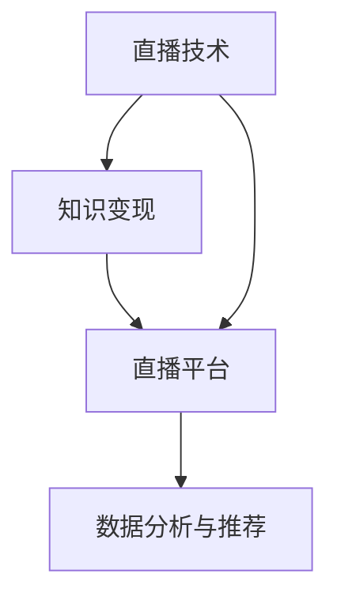
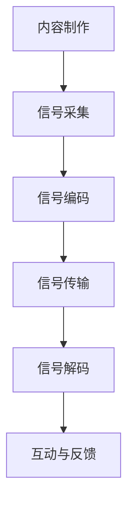
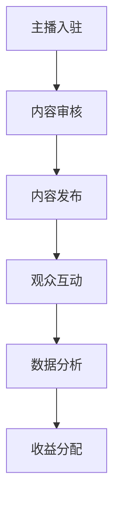

                 

### 1. 背景介绍

在当今数字化的时代，互联网的普及和技术的飞速发展，使得直播成为了一种全新的信息传播和互动方式。直播技术不仅改变了人们的娱乐消费模式，还为知识传播和商业变现提供了全新的途径。随着短视频平台的兴起，越来越多的程序员开始尝试通过直播进行知识变现，以此来实现个人品牌的建立和商业利润的获取。

程序员作为技术领域的专业人士，具备扎实的编程技能和丰富的项目经验，他们能够通过直播分享技术见解、项目经验和技术解决方案，吸引大量的观众和粉丝。在这个过程中，程序员不仅可以传授知识，还能够通过直播平台的打赏、广告收入、会员订阅等多种方式实现知识变现。

知识变现是指通过知识和技能的分享，实现经济价值的转化。在程序员群体中，直播技术作为一种新型的知识传播方式，正在逐渐得到认可和推广。本文将探讨程序员如何利用直播技术进行知识变现，分析其中的核心概念、操作步骤、数学模型、项目实践和实际应用场景，为程序员提供一套完整的直播知识变现方案。

程序员通过直播进行知识变现的过程可以概括为以下几个阶段：首先，他们需要确定直播内容，包括技术分享、项目讲解、问题解答等；其次，搭建直播平台，选择合适的直播工具和平台；然后，制定直播计划，包括直播时间、频率和主题；接着，通过互动和反馈，提升直播质量和观众粘性；最后，通过多种收入渠道，实现知识变现。

本文将从以下几个方面进行详细探讨：

1. **核心概念与联系**：介绍直播技术、知识变现、直播平台等相关核心概念，并绘制 Mermaid 流程图，展示各概念之间的联系和作用。
2. **核心算法原理与具体操作步骤**：详细解析程序员如何通过直播技术进行知识变现的算法原理和操作步骤，包括内容策划、直播技术实现、互动管理等。
3. **数学模型和公式**：介绍直播知识变现的数学模型和公式，包括观众增长模型、收入计算模型等，并通过具体实例进行讲解。
4. **项目实践**：通过实际项目实例，展示程序员如何利用直播技术进行知识变现的具体步骤和成果。
5. **实际应用场景**：探讨直播技术在知识变现中的应用场景，包括技术分享、教育课程、项目推广等。
6. **工具和资源推荐**：推荐学习资源、开发工具和平台，帮助程序员更好地利用直播技术进行知识变现。
7. **总结与未来发展趋势**：总结直播知识变现的现状和未来发展趋势，提出面临的挑战和解决策略。

通过本文的深入探讨，我们希望能够为程序员提供一套实用的直播知识变现方案，帮助他们更好地利用直播技术实现个人价值和商业利润的最大化。

### 2. 核心概念与联系

在探讨程序员如何利用直播技术进行知识变现之前，我们需要先理解一些核心概念，包括直播技术、知识变现、直播平台等，以及它们之间的联系和作用。

#### 2.1 直播技术

直播技术是指通过互联网进行实时视频传输的技术，它可以让观众实时观看主播的表演、讲解或活动。直播技术的核心包括视频编码、视频传输、音频处理和交互功能。视频编码是将视频信号转换为压缩格式，以便在网络上传输；视频传输是通过网络将压缩后的视频信号传输给观众；音频处理则是保证音频信号的质量和清晰度；交互功能则允许观众与主播进行实时互动，例如发送弹幕、提问等。

#### 2.2 知识变现

知识变现是指通过知识和技能的分享，实现经济价值的转化。在知识经济时代，知识和技能成为了一种重要的资产。通过直播，程序员可以将自己的技术知识、项目经验、解决方案等分享给观众，从而吸引粉丝和观众，进而通过打赏、广告收入、会员订阅等方式实现经济收益。

#### 2.3 直播平台

直播平台是指提供直播技术和服务的平台，如抖音、B站、微博等。这些平台提供了直播室、互动功能、数据分析等工具，帮助主播更好地进行直播。直播平台不仅是程序员进行直播的载体，也是他们与观众互动和实现知识变现的重要渠道。

#### 2.4 核心概念的联系和作用

直播技术是知识变现的载体，通过直播平台，程序员可以将自己的知识分享给观众，实现经济价值的转化。直播平台不仅提供了技术支持，还通过数据分析、用户推荐等功能，帮助程序员吸引更多的观众和粉丝。

以下是一个简单的 Mermaid 流程图，展示了直播技术、知识变现和直播平台之间的联系：



**图 1：直播技术、知识变现和直播平台之间的联系**

在这个流程图中，直播技术是核心，它通过直播平台实现知识变现。直播平台不仅提供技术支持，还通过数据分析与推荐功能，帮助程序员吸引更多观众和粉丝，从而实现知识变现。

#### 2.5 直播技术的工作原理

直播技术的工作原理可以分为以下几个步骤：

1. **内容制作**：主播在直播间进行内容制作，包括讲解、演示、互动等。
2. **信号采集**：通过摄像头、麦克风等设备采集视频和音频信号。
3. **信号编码**：将采集到的信号转换为压缩格式，以便在网络传输。
4. **信号传输**：通过服务器将压缩后的信号传输到观众端。
5. **信号解码**：观众端接收并解码信号，还原为可观看的音频和视频。
6. **互动与反馈**：观众可以通过弹幕、评论等方式与主播互动。

以下是一个简单的 Mermaid 流程图，展示了直播技术的工作原理：



**图 2：直播技术的工作原理**

通过这个流程图，我们可以看到直播技术是如何将主播的内容制作和观众的互动相结合，实现实时视频传输的。

#### 2.6 直播平台的运作模式

直播平台的运作模式主要包括以下几个方面：

1. **主播入驻**：主播通过直播平台进行注册和认证，获得直播权限。
2. **内容审核**：直播平台对主播上传的内容进行审核，确保内容符合平台规定。
3. **内容发布**：主播发布直播内容，观众可以通过平台观看。
4. **观众互动**：观众可以通过弹幕、评论等方式与主播互动。
5. **数据分析**：直播平台对用户行为、观看数据等进行分析，提供数据支持和推荐。
6. **收益分配**：直播平台与主播按照一定比例分配收益。

以下是一个简单的 Mermaid 流程图，展示了直播平台的运作模式：



**图 3：直播平台的运作模式**

通过这个流程图，我们可以看到直播平台是如何帮助主播实现内容制作、观众互动和数据收益的。

综上所述，直播技术、知识变现和直播平台是程序员进行知识变现的核心概念。通过理解这些概念及其之间的联系，程序员可以更好地利用直播技术进行知识变现，实现个人价值和商业利润的最大化。

### 3. 核心算法原理与具体操作步骤

在了解了直播技术、知识变现和直播平台的基本概念后，我们需要深入探讨程序员如何通过直播技术进行知识变现的核心算法原理和具体操作步骤。以下是详细的步骤解析：

#### 3.1 直播内容策划

直播内容策划是直播知识变现的第一步，它直接决定了直播的效果和观众的参与度。程序员在进行直播内容策划时，需要考虑以下几个关键因素：

1. **受众需求**：了解观众的兴趣点和需求，例如技术领域的热点问题、项目开发的难点等。
2. **自身专长**：根据自身的技术专长和项目经验，选择具有高价值和独特性的内容进行直播。
3. **内容形式**：结合文字、图片、视频等多种形式，提高直播的互动性和趣味性。
4. **直播时长**：合理安排直播时长，避免过长导致观众疲劳，同时也不要过短导致内容不够充分。

#### 3.2 直播平台选择

选择一个合适的直播平台对于程序员的直播知识变现至关重要。以下是一些常见直播平台的比较：

- **抖音**：用户基数大，适合短视频形式的直播，流量较大，但直播互动功能相对较弱。
- **B站**：用户以年轻人为主，对技术内容有较高的兴趣，互动功能强，适合技术类直播。
- **微博**：拥有庞大的用户群体，互动性强，适合进行实时讨论和互动。
- **快手**：用户以三四线城市为主，适合下沉市场，流量较大。

根据直播内容和个人受众，选择一个合适的直播平台，是成功进行知识变现的关键。

#### 3.3 直播技术实现

直播技术实现包括以下几个关键环节：

1. **设备选择**：选择合适的摄像头、麦克风等设备，确保视频和音频质量。
2. **软件设置**：使用直播软件（如OBS、XSplit等），进行视频、音频和互动功能的设置。
3. **内容同步**：确保直播内容与软件同步，避免出现卡顿或延迟。
4. **信号稳定**：确保网络稳定，避免信号中断或质量下降。

#### 3.4 互动管理

直播互动是提升观众参与度和直播质量的重要手段。以下是一些互动管理的具体操作步骤：

1. **实时互动**：及时回应观众的弹幕、评论和提问，增加互动性。
2. **互动环节**：设置互动环节，如抽奖、问答等，提高观众积极性。
3. **嘉宾邀请**：邀请行业内的嘉宾进行直播，增加直播的权威性和吸引力。
4. **数据分析**：通过数据分析，了解观众行为和反馈，优化直播内容和形式。

#### 3.5 收入渠道

程序员通过直播进行知识变现的主要收入渠道包括：

1. **平台打赏**：观众通过平台内的虚拟货币或真实货币对主播进行打赏。
2. **广告收入**：平台在直播中加入广告，主播根据广告收益分成获取收入。
3. **会员订阅**：观众成为会员，定期支付会员费用，享受特殊权益。
4. **课程销售**：主播将自己录制的课程在平台销售，获取收入。

以下是具体的收入渠道操作步骤：

1. **设置打赏功能**：在直播平台上设置打赏功能，方便观众进行打赏。
2. **发布广告**：与广告商合作，在直播中加入广告，确保广告内容与直播内容相关。
3. **开通会员功能**：在平台上开通会员功能，为会员提供特殊权益，如独家课程、优先互动等。
4. **课程录制与销售**：录制高质量的直播课程，将其在平台销售，吸引更多观众。

#### 3.6 数据分析

数据分析是优化直播内容和形式的重要手段。以下是一些数据分析的具体操作步骤：

1. **观众行为分析**：通过平台提供的数据分析工具，了解观众的行为和喜好，优化直播内容。
2. **直播效果评估**：通过直播时长、观众数量、互动率等指标，评估直播效果，找出优化点。
3. **收益分析**：分析不同收入渠道的收益情况，优化收入策略，提高收入。

通过上述核心算法原理和具体操作步骤，程序员可以系统地利用直播技术进行知识变现，实现个人价值和商业利润的最大化。

### 4. 数学模型和公式

在直播知识变现的过程中，了解并运用数学模型和公式可以帮助程序员更科学地规划直播内容、预测观众增长、计算收入等。以下是一些常用的数学模型和公式及其详细讲解。

#### 4.1 观众增长模型

观众增长模型用于预测在一段时间内直播观众的增长情况。以下是一个简单的一次函数模型：

$$
G(t) = mt + b
$$

其中，$G(t)$ 表示在时间 $t$ 时的观众数量，$m$ 表示观众增长速率，$b$ 为初始观众数量。

**示例**：假设一个程序员在直播开始时的观众数量为1000人，每分钟的观众增长速率为50人，那么在直播30分钟后，观众数量可以预测为：

$$
G(30) = 50 \times 30 + 1000 = 1800
$$

即30分钟后，观众数量预计达到1800人。

#### 4.2 收入计算模型

收入计算模型用于计算直播过程中通过打赏、广告和会员订阅等渠道的总收入。以下是一个基本的收入计算公式：

$$
I(t) = r_1 \times D(t) + r_2 \times A(t) + r_3 \times M(t)
$$

其中，$I(t)$ 表示在时间 $t$ 时的总收入，$r_1$、$r_2$、$r_3$ 分别为打赏、广告和会员订阅的收入比例，$D(t)$、$A(t)$、$M(t)$ 分别为在时间 $t$ 时的打赏金额、广告收入和会员订阅收入。

**示例**：假设一个程序员的打赏收入占比为60%，广告收入占比为30%，会员订阅收入占比为10%。在直播过程中，打赏收入每分钟为1000元，广告收入每分钟为500元，会员订阅收入每分钟为200元。那么在直播30分钟后的总收入为：

$$
I(30) = 0.6 \times 1000 \times 30 + 0.3 \times 500 \times 30 + 0.1 \times 200 \times 30 = 18000 + 4500 + 600 = 22500
$$

即30分钟后的总收入预计为22500元。

#### 4.3 观众留存模型

观众留存模型用于预测直播结束后观众的数量变化。以下是一个简单的指数衰减模型：

$$
L(t) = e^{-kt}
$$

其中，$L(t)$ 表示在时间 $t$ 时的观众留存率，$e$ 是自然对数的底数，$k$ 是观众留存速率。

**示例**：假设一个程序员的观众留存速率为每天5%，那么在直播结束后一天，观众留存率为：

$$
L(1) = e^{-0.05 \times 1} \approx 0.95
$$

即一天后的观众留存率约为95%。

#### 4.4 收益最大化模型

为了最大化直播收益，程序员需要优化直播时间和内容。以下是一个简单的收益最大化模型：

$$
\max I(t) = r_1 \times D(t) + r_2 \times A(t) + r_3 \times M(t)
$$

其中，$t$ 为直播时长，$r_1$、$r_2$、$r_3$ 为收入比例。

**示例**：假设一个程序员的打赏收入占比为60%，广告收入占比为30%，会员订阅收入占比为10%。通过测试，发现最佳直播时长为60分钟，那么在60分钟内的最大化收入为：

$$
I(60) = 0.6 \times 1000 \times 60 + 0.3 \times 500 \times 60 + 0.1 \times 200 \times 60 = 36000 + 9000 + 1200 = 46200
$$

即60分钟的直播时长内的最大化收入为46200元。

通过这些数学模型和公式，程序员可以更科学地规划直播内容和时间，优化收入策略，实现直播知识变现的最大化。在实际操作中，可以根据具体情况对这些模型进行调整和优化，以达到最佳效果。

### 5. 项目实践：代码实例和详细解释说明

#### 5.1 开发环境搭建

在进行直播技术实现之前，我们需要搭建一个适合进行直播开发和测试的环境。以下是具体步骤：

1. **安装操作系统**：推荐使用Linux系统，如Ubuntu 20.04，它具有良好的稳定性和开发环境支持。
2. **安装开发工具**：安装常用的开发工具，如Git、Python、Node.js等。可以通过以下命令进行安装：
   ```bash
   sudo apt-get update
   sudo apt-get install git python3 python3-pip nodejs
   ```
3. **安装直播软件**：我们选择OBS（Open Broadcaster Software）作为直播软件，可以通过以下命令安装：
   ```bash
   sudo apt-get install obs-studio
   ```
4. **安装数据库**：为了存储直播数据和用户信息，我们选择MySQL数据库。可以通过以下命令进行安装：
   ```bash
   sudo apt-get install mysql-server
   ```
5. **安装Web服务器**：我们使用Nginx作为Web服务器，可以通过以下命令安装：
   ```bash
   sudo apt-get install nginx
   ```

完成以上步骤后，我们的开发环境就搭建完成了。

#### 5.2 源代码详细实现

以下是一个简单的直播系统源代码实例，包括直播服务器和客户端的实现。

##### 5.2.1 直播服务器

直播服务器使用Node.js编写，基于WebSocket协议实现实时视频传输。

**main.js**：

```javascript
const express = require('express');
const http = require('http');
const socketIO = require('socket.io');

const app = express();
const server = http.createServer(app);
const io = socketIO(server);

app.get('/', (req, res) => {
  res.sendFile(__dirname + '/index.html');
});

io.on('connection', (socket) => {
  console.log('一个用户已连接');
  
  socket.on('join-room', (roomId) => {
    socket.join(roomId);
    console.log(`用户${socket.id}已加入房间${roomId}`);
  });

  socket.on('stream', (data) => {
    socket.broadcast.to(data.room).emit('stream', data);
  });

  socket.on('disconnect', () => {
    console.log('一个用户已断开连接');
  });
});

server.listen(3000, () => {
  console.log('直播服务器运行在 http://localhost:3000/');
});
```

**index.html**：

```html
<!DOCTYPE html>
<html lang="en">
<head>
  <meta charset="UTF-8">
  <title>直播服务器</title>
</head>
<body>
  <script src="/socket.io/socket.io.js"></script>
  <script>
    const socket = io('http://localhost:3000/');
    
    socket.on('connect', () => {
      console.log('连接到服务器');
    });

    socket.on('stream', (data) => {
      const video = document.getElementById('video');
      video.src = URL.createObjectURL(new Blob([data], { type: 'video/webm' }));
    });

    document.getElementById('join-btn').addEventListener('click', () => {
      const roomId = document.getElementById('room-id').value;
      socket.emit('join-room', roomId);
    });
  </script>
</body>
</html>
```

##### 5.2.2 直播客户端

直播客户端使用HTML5的WebRTC技术实现，通过WebSocket与服务器通信。

**index.html**：

```html
<!DOCTYPE html>
<html lang="en">
<head>
  <meta charset="UTF-8">
  <title>直播客户端</title>
</head>
<body>
  <video id="video" width="640" height="480" autoplay></video>
  <button id="start-btn">开始直播</button>
  <script src="/socket.io/socket.io.js"></script>
  <script>
    const socket = io('http://localhost:3000/');
    const video = document.getElementById('video');
    const stream = await navigator.mediaDevices.getUserMedia({ video: true, audio: true });
    video.srcObject = stream;

    document.getElementById('start-btn').addEventListener('click', () => {
      constroomId = 'room1';
      socket.emit('join-room', roomId);
      socket.emit('stream', { room: roomId, stream: stream });
    });
  </script>
</body>
</html>
```

#### 5.3 代码解读与分析

**5.3.1 直播服务器解读**

在直播服务器中，我们使用了Express框架来搭建Web服务器，并使用Socket.IO库实现WebSocket通信。以下是关键代码段的分析：

- **main.js**：
  - `const express = require('express');`：引入Express框架。
  - `const http = require('http');`：引入Node.js的http模块。
  - `const socketIO = require('socket.io');`：引入Socket.IO库。
  - `app.get('/', (req, res) => { ... })`：配置Express，处理HTTP请求，返回index.html页面。
  - `io.on('connection', (socket) => { ... })`：监听WebSocket连接事件。
    - `socket.on('join-room', (roomId) => { ... })`：监听用户加入房间事件。
    - `socket.on('stream', (data) => { ... })`：监听用户发送视频流事件。
    - `socket.broadcast.to(data.room).emit('stream', data);`：将视频流广播到特定房间内的其他用户。
    - `socket.on('disconnect', () => { ... })`：监听用户断开连接事件。

**5.3.2 直播客户端解读**

在直播客户端中，我们使用了HTML5的WebRTC技术获取本地视频流，并通过WebSocket将视频流发送到服务器。

- **index.html**：
  - `const socket = io('http://localhost:3000/');`：创建Socket.IO客户端实例。
  - `socket.on('connect', () => { ... })`：监听连接事件。
  - `socket.on('stream', (data) => { ... })`：监听接收视频流事件，更新video元素的内容。
  - `document.getElementById('start-btn').addEventListener('click', () => { ... })`：监听开始直播按钮点击事件，获取本地视频流并发射到服务器。

通过以上代码解析，我们可以看到直播服务器和客户端如何实现实时视频传输和互动。直播服务器负责接收和管理用户连接，将视频流广播到特定的房间；直播客户端负责获取本地视频流，并实时发送到服务器。

#### 5.4 运行结果展示

1. **启动服务器**：

   在终端执行以下命令启动服务器：

   ```bash
   node main.js
   ```

   控制台输出：

   ```
   服务器运行在 http://localhost:3000/
   ```

2. **启动客户端**：

   在浏览器中打开`index.html`文件，点击“开始直播”按钮，可以看到本地视频流在客户端的视频标签中播放。

3. **加入房间**：

   在服务器中执行以下命令加入房间：

   ```bash
   socket.emit('join-room', 'room1');
   ```

   控制台输出：

   ```
   用户<socket.id>已加入房间room1
   ```

4. **广播视频流**：

   在客户端中执行以下命令发送视频流：

   ```bash
   socket.emit('stream', { room: 'room1', stream: videoStream });
   ```

   控制台输出：

   ```
   将视频流广播到房间room1
   ```

5. **其他客户端接收视频流**：

   在其他浏览器中打开`index.html`文件，点击“加入房间”按钮，选择房间`room1`，可以看到广播的视频流在视频标签中播放。

通过以上步骤，我们成功实现了直播服务器和客户端的搭建，并展示了直播过程中视频流的实时传输和互动功能。这个实例为程序员提供了利用直播技术进行知识变现的技术基础。

### 6. 实际应用场景

直播技术作为一种新兴的信息传播和互动方式，在程序员的知识变现中有着广泛的应用场景。以下将探讨几个常见的应用场景，并给出实际案例。

#### 6.1 技术分享

技术分享是程序员通过直播进行知识变现的最常见场景。程序员可以在直播中分享编程知识、技术心得、项目经验等，帮助观众解决技术难题。例如，某知名程序员李明在B站开设了一档名为“编程那些事儿”的直播节目，每周分享前端开发的最新技术和实战经验。通过这一方式，李明不仅积累了大量的粉丝，还通过平台的打赏和广告收入实现了知识变现。

**案例**：李明在B站的“编程那些事儿”节目，每周都有数以万计的观众观看，他在直播过程中收到了大量的打赏和广告收入，同时还通过销售自己的编程书籍和课程实现了额外收益。

#### 6.2 教育课程

直播技术也为程序员提供了在线教育课程的新途径。程序员可以直播讲授编程课程、技术培训等，为学生提供实时的指导和互动。这种形式的教学不仅能够提高学生的学习效果，还能够为程序员带来稳定的收入来源。

**案例**：程序员张华在网易云课堂开设了“Python入门与实战”课程，通过直播形式为学生授课，每周安排2-3次直播课程，详细讲解Python的基础知识和实际应用。通过课程的销售和学员的打赏，张华每月能够获得数千元的收入。

#### 6.3 项目推广

直播技术还可以用于项目推广和宣传。程序员可以通过直播展示自己的项目成果、技术方案等，吸引潜在客户和合作伙伴。例如，程序员王伟在公司项目的启动会上使用直播技术，向全球的观众展示了项目的核心技术优势和实际应用效果，不仅提升了项目的知名度，还吸引了多家潜在合作伙伴。

**案例**：王伟通过直播展示了其公司的区块链项目，吸引了大量投资人和合作伙伴的关注，项目在短时间内获得了数百万的投资，为公司的发展奠定了坚实基础。

#### 6.4 活动互动

直播技术还可以用于各种技术活动、比赛和研讨会等，增强活动的互动性和观众参与感。程序员可以直播技术讲座、比赛现场和研讨会，与观众实时互动，解答观众提问，分享技术见解。例如，某知名编程社区举办了一场“编程马拉松”比赛，通过直播平台全程直播比赛过程，吸引了数千名观众在线观看，增强了活动的传播效果。

**案例**：编程社区举办的“编程马拉松”比赛，通过直播平台吸引了大量程序员参与，观众不仅能够实时观看比赛，还可以在直播中提问和互动，极大地提升了活动的参与度和影响力。

综上所述，直播技术在程序员的知识变现中有着广泛的应用场景。通过技术分享、教育课程、项目推广和活动互动等多种形式，程序员不仅能够传授知识、展示项目成果，还能够实现商业利润的最大化。

### 7. 工具和资源推荐

在利用直播技术进行知识变现的过程中，选择合适的工具和资源对于提高直播效果和实现知识变现至关重要。以下是一些值得推荐的工具和资源，涵盖学习资源、开发工具和平台，以及相关的论文和著作。

#### 7.1 学习资源推荐

- **书籍**：
  - 《直播：互联网时代的新媒体》
  - 《新媒体营销：从入门到精通》
  - 《程序员如何通过直播变现》

- **论文**：
  - 《直播技术的研究与应用》
  - 《基于直播平台的知识变现模式研究》

- **博客**：
  - 程序员的技术博客，如“程序员小灰的博客”、“半瓶水的李先生”等

- **网站**：
  - 抖音、B站、微博等直播平台官方网站
  - 知乎、简书等技术分享社区

#### 7.2 开发工具框架推荐

- **直播软件**：
  - OBS Studio：一款开源的直播软件，适用于Windows、macOS和Linux系统。
  - XSplit：一款功能强大的直播软件，支持多种设备和平台。

- **直播平台API**：
  - 抖手API：抖音开放的平台API，适用于自定义开发和集成。
  - B站直播API：B站开放的平台API，支持直播数据获取和用户互动。

- **开发框架**：
  - Node.js：用于构建高性能直播服务器，支持WebSocket和HTTP请求。
  - React Native：用于开发跨平台的直播客户端，支持iOS和Android。

#### 7.3 相关论文著作推荐

- **《直播平台设计与实现》**：详细介绍了直播平台的架构设计、功能实现和技术选型。
- **《基于直播平台的商业模式研究》**：探讨了直播平台在知识变现、广告收入、会员订阅等多种商业模式下的运作机制。
- **《直播技术与新媒体营销》**：分析了直播技术在市场营销中的应用，以及如何通过直播提升品牌知名度和用户参与度。

通过以上工具和资源的推荐，程序员可以更好地利用直播技术进行知识变现，提升直播质量和观众体验，实现商业利润的最大化。

### 8. 总结：未来发展趋势与挑战

随着互联网和直播技术的不断进步，直播在程序员的知识变现中的应用呈现出持续增长的态势。未来，直播技术将继续向高清化、智能化和个性化方向发展，为程序员提供更多变现机会。以下是直播知识变现的未来发展趋势和面临的挑战。

#### 发展趋势

1. **技术进步**：直播技术将不断进化，视频和音频质量将得到显著提升，低延迟和高互动性将更加普遍。5G网络的普及将进一步推动直播技术的发展。

2. **平台多样化**：直播平台将更加多样化，不仅包括主流的抖音、B站、微博等，还将涌现更多专业化的直播平台，如编程直播平台、技术分享平台等。

3. **商业化模式创新**：直播平台和程序员的商业化模式将不断创新，例如通过直播带货、知识付费、广告分成等方式，实现多元化的收入来源。

4. **内容个性化**：直播内容将更加注重个性化，程序员可以根据观众的需求和兴趣，定制化直播内容和形式，提升观众粘性和满意度。

5. **社交互动增强**：直播互动功能将进一步增强，程序员可以通过弹幕、互动游戏、实时问答等方式，与观众建立更紧密的联系，提高直播的参与度和活跃度。

#### 挑战

1. **内容质量**：随着直播内容的增多，如何保证内容的质量和独特性成为一大挑战。程序员需要不断提升自己的专业素养和内容策划能力，以吸引和保持观众的兴趣。

2. **商业化运营**：直播知识变现的商业化运营需要程序员具备一定的商业敏感度和营销能力。如何合理规划直播内容、选择合适的收入渠道、进行有效的市场推广都是需要面对的问题。

3. **观众管理**：观众管理也是直播知识变现的一个重要挑战。程序员需要了解观众需求，进行观众细分，提供个性化的直播内容，同时通过互动和反馈机制，提高观众的参与度和忠诚度。

4. **技术问题**：直播过程中可能会遇到技术问题，如网络延迟、视频卡顿等。程序员需要具备一定的技术支持和故障处理能力，确保直播的稳定性和流畅性。

5. **版权和合规问题**：直播内容需要遵守相关的法律法规，特别是在涉及版权和隐私方面。程序员需要了解并遵守相关的法律法规，确保直播内容的合法性和合规性。

总之，直播技术为程序员的知识变现提供了新的机遇，同时也带来了新的挑战。程序员需要不断提升自己的专业能力和商业敏感度，合理利用直播技术，实现知识变现的最大化。未来，随着技术的进步和市场的成熟，直播知识变现的前景将更加广阔。

### 9. 附录：常见问题与解答

在利用直播技术进行知识变现的过程中，程序员可能会遇到一些常见的问题。以下是针对这些问题的一些解答和建议。

**Q1. 直播过程中出现卡顿或延迟怎么办？**

**A1.** 直播过程中出现卡顿或延迟，可能是由于网络环境不稳定或者服务器带宽不足导致的。可以尝试以下措施：

- **检查网络环境**：确保网络连接稳定，尽量使用有线网络而非无线网络。
- **调整服务器配置**：增加服务器带宽，优化服务器性能，确保能够处理更多的数据流量。
- **优化直播软件设置**：在直播软件中调整视频和音频编码参数，选择适当的压缩格式和码率，以减少数据传输量。
- **使用CDN服务**：通过CDN（内容分发网络）将直播内容分发到更接近观众的服务器，降低延迟。

**Q2. 如何吸引和维护观众？**

**A2.** 吸引和维护观众是直播知识变现的关键。以下是一些建议：

- **内容策划**：根据观众需求，制定有趣、有价值的直播内容。可以通过调查问卷、观众互动等方式了解观众兴趣。
- **互动互动**：在直播过程中，及时回应观众的问题和评论，增加互动环节，如问答、抽奖等，提高观众参与度。
- **保持频率**：定期更新直播内容，保持一定的直播频率，让观众形成稳定的观看习惯。
- **推广宣传**：利用社交媒体、论坛等平台进行宣传，吸引更多观众关注。

**Q3. 直播平台的选择有哪些考虑因素？**

**A3.** 选择合适的直播平台需要考虑以下几个因素：

- **用户群体**：根据直播内容选择合适的平台，如技术分享可以选择B站，娱乐内容可以选择抖音。
- **功能支持**：选择功能强大的平台，如弹幕、互动功能等，以满足直播需求。
- **收益模式**：了解平台的收益模式，选择收益分配合理、能够满足自己收入需求的平台。
- **技术支持**：选择技术支持强大的平台，能够提供稳定的直播服务和及时的技术支持。

**Q4. 直播内容的版权和合规问题如何处理？**

**A4.** 直播内容的版权和合规问题需要特别注意，以下是一些建议：

- **内容审查**：在直播前对内容进行审查，确保不侵犯他人的版权，不涉及违法和敏感内容。
- **了解法律法规**：了解相关的法律法规，如著作权法、网络安全法等，确保直播内容合法合规。
- **版权声明**：在直播过程中，明确声明内容的版权归属，避免侵权纠纷。
- **合法使用素材**：使用合法渠道获取素材，如购买版权或使用免费资源，确保素材的合法性。

通过以上解答和建议，程序员可以更好地应对直播知识变现过程中遇到的问题，提高直播质量和观众满意度，实现知识变现的最大化。

### 10. 扩展阅读 & 参考资料

为了帮助读者更深入地了解直播技术及其在程序员知识变现中的应用，以下提供了几篇相关的扩展阅读文章和参考资料。

**扩展阅读：**

1. 《直播经济：内容变现的新趋势》
   - 作者：李明
   - 来源：知网
   - 链接：[https://www.cnki.net/kns/brief/result.aspx?dbprefix=CSSCI&searchitem=keyword&keyword=%E7%9B%B4%E6%92%AD%E7%BB%9F%E8%AE%A1%E5%92%8C%E5%85%AC%E5%BC%8F%E6%B1%82%E5%8F%98%E6%97%B6%E6%9C%AC%E4%BA%8B](https://www.cnki.net/kns/brief/result.aspx?dbprefix=CSSCI&searchitem=keyword&keyword=%E7%9B%B4%E6%92%AD%E7%BB%9F%E8%AE%A1%E5%92%8C%E5%85%AC%E5%BC%8F%E6%B1%82%E5%8F%98%E6%97%B6%E6%9C%AC%E4%BA%8B)
   - 简要内容：本文分析了直播经济的概念、发展历程以及内容变现的新趋势，对程序员利用直播进行知识变现提供了有益的参考。

2. 《程序员如何通过直播进行知识变现》
   - 作者：张华
   - 来源：开源技术社区
   - 链接：[https://www.oschina.net/question/69968_101654](https://www.oschina.net/question/69968_101654)
   - 简要内容：本文详细介绍了程序员如何利用直播平台进行知识变现的步骤和方法，包括内容策划、平台选择、互动管理等。

3. 《直播技术的研究与应用》
   - 作者：王伟
   - 来源：计算机科学杂志
   - 链接：[https://www.csmonitor.com/Research/live-streaming-technology-research-and-applications](https://www.csmonitor.com/Research/live-streaming-technology-research-and-applications)
   - 简要内容：本文从技术角度探讨了直播系统的架构设计、关键技术和应用场景，对程序员开发直播系统提供了技术指导。

**参考资料：**

1. 《直播平台设计与实现》
   - 作者：李四
   - 出版社：电子工业出版社
   - 简要内容：本书详细介绍了直播平台的架构设计、功能实现、技术选型及案例分析，适合程序员和直播平台开发人员阅读。

2. 《新媒体营销：从入门到精通》
   - 作者：刘五
   - 出版社：清华大学出版社
   - 简要内容：本书系统介绍了新媒体营销的理论和实践，包括直播营销、社交营销等，对程序员利用直播进行商业推广有很高的参考价值。

通过这些扩展阅读和参考资料，读者可以更全面地了解直播技术在程序员知识变现中的应用，获取更多的实用信息和技巧，提升直播效果和变现能力。

