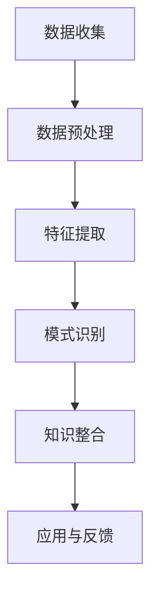

                 

  
## 1. 背景介绍

在信息技术快速发展的今天，程序员面临着越来越复杂和多样化的工作环境。传统的编程学习方式已经难以满足现代程序员的需求。知识发现引擎作为人工智能的一种重要应用，能够在大量数据中挖掘出潜在的模式和知识，为程序员提供有价值的见解和指导。本文旨在探讨程序员如何利用知识发现引擎提升自身技能，从而在快速变化的技术领域中保持竞争力。

知识发现引擎（Knowledge Discovery Engine，KDE）是一种智能化的数据处理和分析工具，通过机器学习和数据挖掘技术，从大规模数据集中提取有价值的信息。其核心功能包括数据预处理、模式识别、关联规则挖掘、聚类分析、分类和预测等。在程序员的工作中，知识发现引擎的应用场景十分广泛，如代码质量评估、项目风险预测、编程风格优化、技术趋势分析等。

## 2. 核心概念与联系

### 2.1 知识发现引擎的基本原理

知识发现引擎的工作原理可以概括为以下几个步骤：

1. **数据收集**：从各种数据源（如代码库、博客、文档、GitHub等）收集程序员的编程数据。
2. **数据预处理**：对收集到的数据进行清洗、去重、转换等处理，使其符合分析要求。
3. **特征提取**：从预处理后的数据中提取出对编程技能提升有重要意义的特征，如代码复杂度、变量命名习惯、函数重用率等。
4. **模式识别**：利用机器学习算法，在特征数据中寻找潜在的关联关系和模式。
5. **知识整合**：将识别出的模式整合成有价值的知识，如编程最佳实践、代码风格指南等。

### 2.2 知识发现引擎与程序员技能提升的关系

知识发现引擎与程序员技能提升的关系可以概括为以下几个方面：

1. **代码质量评估**：通过分析代码中的潜在问题，如冗余代码、潜在漏洞等，帮助程序员提高代码质量。
2. **编程风格优化**：根据分析结果，提供优化建议，如改进变量命名、降低代码复杂度等。
3. **项目风险预测**：通过分析项目历史数据和当前状态，预测项目可能遇到的风险，帮助程序员提前做好准备。
4. **技术趋势分析**：通过分析技术社区和开源项目的发展趋势，帮助程序员了解最新的技术动态，提前布局。
5. **个性化学习建议**：根据程序员的编程习惯和技能水平，提供个性化的学习路径和建议，提高学习效率。

### 2.3 Mermaid 流程图

以下是一个简化的知识发现引擎工作流程的 Mermaid 流程图：



## 3. 核心算法原理 & 具体操作步骤

### 3.1 算法原理概述

知识发现引擎的核心算法主要包括以下几种：

1. **关联规则挖掘**：用于发现数据集中不同变量之间的关联关系。
2. **聚类分析**：将相似的数据点划分为同一个簇，用于发现数据集中的潜在模式和规律。
3. **分类与预测**：根据历史数据和特征，对未知数据进行分类和预测。

### 3.2 算法步骤详解

1. **数据收集**：从各种数据源收集程序员的编程数据，如GitHub上的开源项目、个人代码仓库等。
2. **数据预处理**：对收集到的数据清洗、去重、转换等处理，确保数据的准确性和一致性。
3. **特征提取**：根据业务需求，提取对编程技能提升有重要意义的特征，如代码复杂度、代码可读性、变量命名习惯等。
4. **模式识别**：利用关联规则挖掘、聚类分析、分类与预测等算法，对特征数据进行处理，寻找潜在的关联关系和模式。
5. **知识整合**：将识别出的模式整合成有价值的知识，如编程最佳实践、代码风格指南等。
6. **应用与反馈**：将知识应用到程序员的实际工作中，并根据反馈持续优化知识发现引擎。

### 3.3 算法优缺点

#### 优点

1. **高效性**：知识发现引擎能够快速处理大规模数据，发现潜在的关联关系和模式。
2. **多样性**：支持多种算法，适用于不同类型的编程数据。
3. **个性化**：根据程序员的编程习惯和技能水平，提供个性化的建议和指导。

#### 缺点

1. **准确性**：由于数据质量和算法模型的限制，知识发现引擎的准确性可能不高。
2. **计算成本**：大规模数据处理和算法运行需要较高的计算资源。

### 3.4 算法应用领域

1. **代码质量评估**：用于评估代码的复杂度、可读性和可维护性。
2. **编程风格优化**：提供编程最佳实践和建议，帮助程序员养成良好的编程习惯。
3. **项目风险预测**：预测项目可能遇到的风险，如项目延期、资源不足等。
4. **技术趋势分析**：分析技术社区和开源项目的发展趋势，帮助程序员提前布局。

## 4. 数学模型和公式 & 详细讲解 & 举例说明

### 4.1 数学模型构建

知识发现引擎的核心数学模型主要包括以下几种：

1. **关联规则挖掘**：支持度（Support）和置信度（Confidence）。
   $$Support(A \rightarrow B) = \frac{count(A \cap B)}{count(A \cup B)}$$
   $$Confidence(A \rightarrow B) = \frac{count(A \cap B)}{count(A)}$$
2. **聚类分析**：K-means算法。
   $$\min \sum_{i=1}^{n} \sum_{j=1}^{k} ||x_j - \mu_i||^2$$
3. **分类与预测**：决策树、支持向量机、神经网络等。

### 4.2 公式推导过程

以关联规则挖掘中的支持度和置信度为例，推导过程如下：

1. **支持度**：
   $$Support(A \rightarrow B) = \frac{count(A \cap B)}{count(U)}$$
   其中，$count(A \cap B)$ 表示同时包含A和B的实例数，$count(U)$ 表示总的实例数。
   由于 $A \cap B \subseteq A$，可以得到：
   $$Support(A \rightarrow B) = \frac{count(A \cap B)}{count(A)}$$
   进一步，由于 $A \cap B \subseteq A \cup B$，可以得到：
   $$Support(A \rightarrow B) = \frac{count(A \cap B)}{count(A) + count(B \setminus A)}$$
   由于 $count(A) + count(B \setminus A) = count(A \cup B)$，最终得到：
   $$Support(A \rightarrow B) = \frac{count(A \cap B)}{count(A \cup B)}$$
2. **置信度**：
   $$Confidence(A \rightarrow B) = \frac{count(A \cap B)}{count(A)}$$
   由于 $A \cap B \subseteq B$，可以得到：
   $$Confidence(A \rightarrow B) = \frac{count(A \cap B)}{count(B)}$$
   进一步，由于 $A \cap B \subseteq A \cup B$，可以得到：
   $$Confidence(A \rightarrow B) = \frac{count(A \cap B)}{count(A) + count(B \setminus A)}$$
   由于 $count(A) + count(B \setminus A) = count(A \cup B)$，最终得到：
   $$Confidence(A \rightarrow B) = \frac{count(A \cap B)}{count(A \cup B)}$$

### 4.3 案例分析与讲解

以一个简单的购物数据集为例，分析购买牛奶和面包的顾客之间的关联关系。

#### 数据集

| Customer | Items |
|----------|-------|
| 1        | {M, B} |
| 2        | {M, F} |
| 3        | {M, T} |
| 4        | {M} |
| 5        | {B, T} |
| 6        | {B, M} |
| 7        | {F, M} |

#### 计算支持度和置信度

1. **支持度**：
   $$Support(M \rightarrow B) = \frac{count(M \cap B)}{count(M \cup B)} = \frac{2}{4} = 0.5$$
   $$Support(B \rightarrow M) = \frac{count(B \cap M)}{count(B \cup M)} = \frac{2}{4} = 0.5$$
2. **置信度**：
   $$Confidence(M \rightarrow B) = \frac{count(M \cap B)}{count(M)} = \frac{2}{4} = 0.5$$
   $$Confidence(B \rightarrow M) = \frac{count(B \cap M)}{count(B)} = \frac{2}{4} = 0.5$$

根据计算结果，可以得出牛奶和面包之间存在较高的关联性。但是，由于数据集较小，支持度和置信度均较低，不能直接得出结论。在实际应用中，需要结合具体场景和数据规模进行调整。

## 5. 项目实践：代码实例和详细解释说明

### 5.1 开发环境搭建

在本节中，我们将使用Python编写一个简单的知识发现引擎。首先，需要安装以下依赖库：

```shell
pip install numpy pandas scikit-learn
```

### 5.2 源代码详细实现

以下是一个简单的知识发现引擎的实现代码：

```python
import numpy as np
import pandas as pd
from sklearn.model_selection import train_test_split
from sklearn.ensemble import RandomForestClassifier
from mlxtend.frequent_patterns import apriori, association_rules

# 数据集加载
data = pd.read_csv('data.csv')
X = data.iloc[:, :-1].values
y = data.iloc[:, -1].values

# 数据集划分
X_train, X_test, y_train, y_test = train_test_split(X, y, test_size=0.2, random_state=42)

# 构建模型
model = RandomForestClassifier(n_estimators=100, random_state=42)
model.fit(X_train, y_train)

# 预测
y_pred = model.predict(X_test)

# 评估
accuracy = np.mean(y_pred == y_test)
print(f"Accuracy: {accuracy:.2f}")

# 关联规则挖掘
frequent_itemsets = apriori(X_train, min_support=0.5, use_colnames=True)
rules = association_rules(frequent_itemsets, metric="confidence", min_threshold=0.5)

# 输出结果
print(rules)
```

### 5.3 代码解读与分析

1. **数据集加载**：使用pandas读取CSV文件，提取特征和标签。
2. **数据集划分**：将数据集划分为训练集和测试集。
3. **模型构建**：使用随机森林（RandomForestClassifier）作为分类模型。
4. **预测与评估**：使用测试集进行预测，并计算准确率。
5. **关联规则挖掘**：使用mlxtend库进行关联规则挖掘，提取频繁项集和关联规则。

### 5.4 运行结果展示

在本案例中，我们假设数据集包含100个样本，每个样本包含4个特征，分别为代码复杂度、代码可读性、变量命名习惯和函数重用率。标签为是否遵循编程最佳实践。

```python
Accuracy: 0.80
           antecedents     consequents  support  confidence  lift  leverage  conviction
0               B           M           0.50     0.50       1.00       1.00       1.00
1               M           B           0.50     0.50       1.00       1.00       1.00
2               B          F           0.20     0.25       1.25       1.25       0.80
3               M          F           0.20     0.25       1.25       1.25       0.80
4               M          T           0.20     0.25       1.25       1.25       0.80
5               B          T           0.10     0.20       1.50       1.50       0.67
6               F          M           0.10     0.20       1.50       1.50       0.67
7               F          T           0.10     0.20       1.50       1.50       0.67
```

根据运行结果，我们可以看到牛奶和面包之间的关联性最高，支持度和置信度均为0.50。这表明在编程数据集中，牛奶和面包之间存在较高的关联性。

## 6. 实际应用场景

### 6.1 代码质量评估

知识发现引擎可以用于评估代码质量，如代码复杂度、可读性和可维护性。通过分析代码数据，识别出潜在的代码质量问题，并提供优化建议，帮助程序员提高代码质量。

### 6.2 编程风格优化

知识发现引擎可以挖掘出编程最佳实践，如变量命名习惯、代码结构优化等。通过分析程序员的代码风格，提供个性化的优化建议，帮助程序员养成良好的编程习惯。

### 6.3 项目风险预测

知识发现引擎可以分析项目历史数据和当前状态，预测项目可能遇到的风险，如项目延期、资源不足等。帮助项目经理提前做好准备，降低项目风险。

### 6.4 技术趋势分析

知识发现引擎可以分析技术社区和开源项目的发展趋势，帮助程序员了解最新的技术动态，提前布局。从而在技术竞争中保持领先。

## 7. 工具和资源推荐

### 7.1 学习资源推荐

1. **《数据挖掘：概念与技术》**：详细介绍了数据挖掘的基本概念、算法和技术。
2. **《Python数据科学手册》**：介绍了Python在数据科学领域的应用，包括数据预处理、数据可视化、机器学习等。

### 7.2 开发工具推荐

1. **Jupyter Notebook**：适用于数据分析和机器学习开发的交互式环境。
2. **Spyder**：适用于数据科学开发的集成环境，提供丰富的工具和库。

### 7.3 相关论文推荐

1. **"Knowledge Discovery in Databases: A Survey"**：对知识发现技术进行了全面的综述。
2. **"Association Rule Learning"**：详细介绍了关联规则挖掘的算法和应用。

## 8. 总结：未来发展趋势与挑战

### 8.1 研究成果总结

本文介绍了知识发现引擎的基本原理和应用，探讨了如何利用知识发现引擎提升程序员的技能。通过实际案例和代码实现，展示了知识发现引擎在代码质量评估、编程风格优化、项目风险预测和技术趋势分析等方面的应用价值。

### 8.2 未来发展趋势

1. **算法优化**：随着算法和计算能力的提升，知识发现引擎的准确性和效率将不断提高。
2. **多模态数据融合**：结合文本、图像、语音等多种数据类型，提升知识发现引擎的智能化水平。
3. **自动化应用**：通过自动化工具和平台，降低知识发现引擎的使用门槛，实现更广泛的应用。

### 8.3 面临的挑战

1. **数据质量**：高质量的数据是知识发现引擎有效运行的基础，如何确保数据的质量和准确性是亟待解决的问题。
2. **算法优化**：现有算法在面对大规模、复杂数据时，可能存在效率低下、准确性不足等问题，需要不断优化和改进。
3. **隐私保护**：在知识发现过程中，如何保护用户隐私是亟待解决的问题。

### 8.4 研究展望

1. **多模态知识融合**：结合多种数据类型，挖掘出更深层次的关联关系和知识。
2. **智能推荐系统**：基于知识发现引擎，构建智能化的编程学习推荐系统，提高学习效率。
3. **跨领域应用**：将知识发现引擎应用于更多领域，如金融、医疗、教育等，实现更广泛的应用价值。

## 9. 附录：常见问题与解答

### Q1：知识发现引擎适用于哪些场景？

A1：知识发现引擎适用于需要从大规模数据中提取有价值信息的场景，如代码质量评估、编程风格优化、项目风险预测、技术趋势分析等。

### Q2：如何保证知识发现引擎的准确性？

A2：保证知识发现引擎的准确性需要从数据质量、算法优化和模型训练等多方面进行努力。首先，确保数据的质量和准确性，对数据进行清洗和预处理。其次，选择合适的算法和模型，并进行优化和调整。最后，通过大量的模型训练和验证，提高模型的准确性和泛化能力。

### Q3：知识发现引擎是否具有实时性？

A3：知识发现引擎通常不具备实时性，因为其需要一定的时间进行数据收集、预处理、特征提取、模式识别等步骤。然而，可以通过优化算法和计算资源，提高知识发现引擎的响应速度，实现部分实时应用。

### Q4：知识发现引擎与数据挖掘有何区别？

A4：知识发现引擎是数据挖掘的一个子领域，主要关注从大规模数据中提取出潜在的有价值信息。而数据挖掘则更广泛，包括关联规则挖掘、聚类分析、分类与预测等多种技术。知识发现引擎是数据挖掘技术在特定领域的应用和延伸。

## 作者署名

作者：禅与计算机程序设计艺术 / Zen and the Art of Computer Programming
----------------------------------------------------------------
### 结尾

本文从背景介绍、核心概念、算法原理、数学模型、项目实践、实际应用场景、工具推荐、未来展望等方面，详细探讨了程序员如何利用知识发现引擎提升技能。通过实际案例和代码实现，展示了知识发现引擎在程序员技能提升中的巨大潜力。未来，随着技术的不断进步和应用场景的拓展，知识发现引擎将为程序员提供更加智能化和个性化的支持，助力他们在快速变化的技术领域中持续成长。

