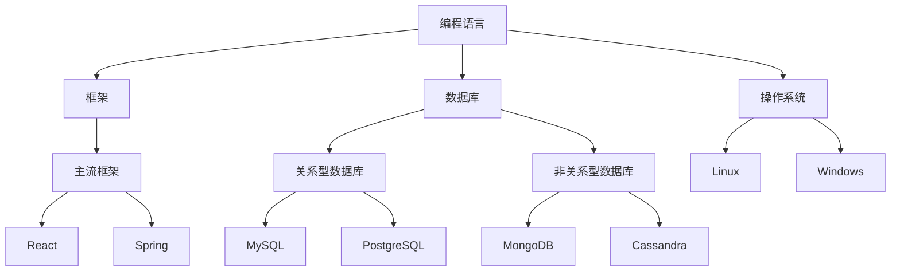
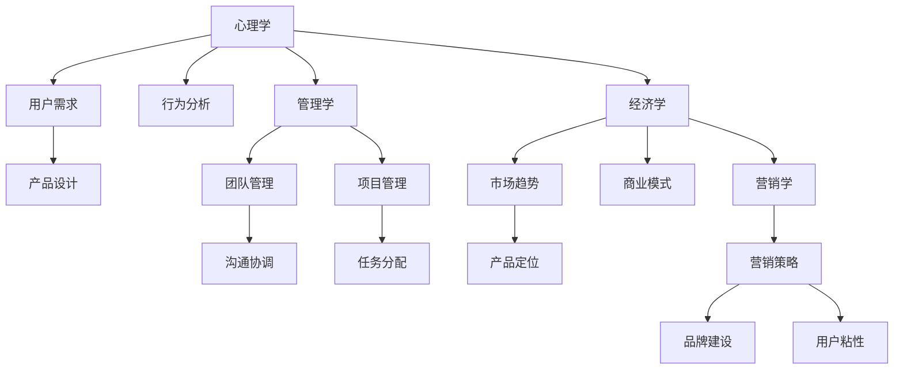
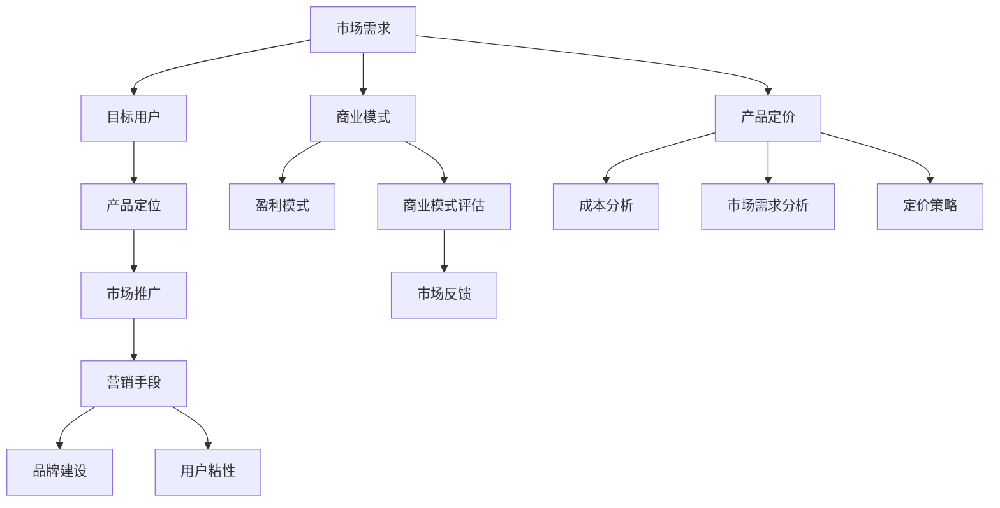
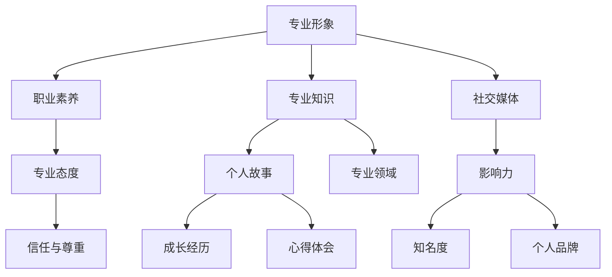

                 

### 1. 背景介绍

在当今这个信息化、数字化飞速发展的时代，程序员不再仅仅是编写代码的程序员，更是知识的生产者、传播者和价值的创造者。随着技术的进步和互联网的普及，程序员们的跨界知识变现能力变得愈加重要。那么，究竟什么是跨界知识变现能力？程序员如何通过这种能力来实现个人和职业的成长呢？

跨界知识变现能力，指的是程序员在掌握自身专业领域知识的基础上，能够借助跨学科的知识体系，将自己的专业技能转化为实际的经济效益或社会价值的能力。这种能力不仅要求程序员具备扎实的技术基础，还需要有开阔的视野、灵活的思维和强大的学习能力。

在当前的技术背景下，跨界知识变现的重要性不言而喻。首先，技术的快速发展带来了职业竞争的加剧，程序员需要不断提升自己的技能，才能在激烈的市场中立于不败之地。其次，互联网和大数据的兴起，使得程序员不再局限于传统的软件开发领域，他们有机会涉足更广泛的行业，如金融、医疗、教育等。这些跨界的应用场景不仅拓宽了程序员的发展空间，也为他们提供了更多的变现途径。

然而，跨界知识变现并非一蹴而就，它需要程序员在多个层面上进行准备和努力。本文将围绕以下几个方面展开讨论：

1. **技术技能的提升**：程序员需要不断学习新技术，掌握多门编程语言和框架，提升自己的技术能力。
2. **跨界知识的积累**：程序员应该关注跨学科的知识，如心理学、管理学、经济学等，这些知识可以帮助他们更好地理解用户需求和市场趋势。
3. **商业意识和市场敏锐度**：程序员需要具备一定的商业思维，了解市场需求，找到自己的竞争优势。
4. **个人品牌的塑造**：在社交媒体上建立个人品牌，提升自己的知名度和影响力。
5. **项目实践和经验积累**：通过实际项目，积累经验，提升解决实际问题的能力。

接下来，我们将逐一探讨这些方面的具体方法和策略，帮助程序员们培养跨界知识变现能力。

### 2. 核心概念与联系

要深入理解程序员如何培养跨界知识变现能力，我们首先需要明确几个核心概念，并分析它们之间的联系。这些核心概念包括技术技能、跨界知识、商业意识、个人品牌和项目经验。

#### 2.1 技术技能

技术技能是程序员的核心竞争力，也是跨界知识变现的基础。技术技能包括编程语言、框架、数据库、操作系统等多个方面。一个具备扎实技术技能的程序员，能够快速适应不同项目的需求，解决复杂的技术问题。以下是几个关键方面：

1. **编程语言**：熟练掌握至少两门编程语言，如Python、Java、C++等，能够根据项目需求选择合适的语言。
2. **框架**：熟悉主流开发框架，如Django、Spring、React等，能够快速搭建项目。
3. **数据库**：掌握关系型数据库（如MySQL、PostgreSQL）和非关系型数据库（如MongoDB、Cassandra），能够高效地处理数据。
4. **操作系统**：了解Linux和Windows的操作，能够独立部署和维护应用。

#### 2.2 跨界知识

跨界知识是程序员拓展视野、提升创新能力的重要途径。跨界知识不仅包括技术领域之外的知识，还包括心理学、管理学、经济学等多个领域。以下是跨界知识的一些关键方面：

1. **心理学**：理解用户需求和行为，能够设计出更符合用户使用习惯的产品。
2. **管理学**：掌握团队管理、项目管理等知识，提升团队协作和项目推进的能力。
3. **经济学**：了解市场趋势和商业模式，能够为自己的项目找到合适的商业模式。
4. **营销学**：掌握市场营销策略，提升项目的市场推广和品牌建设能力。

#### 2.3 商业意识

商业意识是程序员成功跨界的重要保障。商业意识包括对市场需求的理解、商业模式的构建、产品定价策略等多个方面。以下是商业意识的一些关键方面：

1. **市场需求**：了解目标用户的需求，为产品找到合适的定位。
2. **商业模式**：设计出可持续的商业模式，确保项目能够盈利。
3. **产品定价**：根据市场需求和成本，制定合理的产品定价策略。
4. **市场推广**：运用各种营销手段，提升产品的市场知名度和用户粘性。

#### 2.4 个人品牌

个人品牌是程序员在职场中的名片，是提升个人影响力的重要手段。个人品牌包括专业形象、专业知识、个人故事等多个方面。以下是建立个人品牌的一些关键方面：

1. **专业形象**：保持良好的职业素养，树立专业形象。
2. **专业知识**：不断提升自己的专业能力，成为领域的专家。
3. **个人故事**：分享自己的成长经历和心得体会，赢得他人的信任和尊重。
4. **社交媒体**：利用社交媒体平台，扩大自己的影响力。

#### 2.5 项目经验

项目经验是程序员积累实战经验、提升解决问题能力的重要途径。通过实际项目，程序员能够将所学知识应用于实践，提升自己的技能和能力。以下是项目经验的一些关键方面：

1. **项目规划**：能够制定详细的项目计划，确保项目按期完成。
2. **团队协作**：具备良好的团队协作能力，能够与团队成员高效合作。
3. **问题解决**：面对项目中的各种问题，能够快速找到解决方案。
4. **成果展示**：能够清晰地展示项目成果，提升自己的竞争力。

#### 2.6 核心概念与联系

上述核心概念之间存在着紧密的联系。技术技能是跨界知识变现的基础，没有扎实的技术技能，程序员难以胜任复杂的项目。跨界知识则为程序员提供了更广阔的视野，帮助他们更好地理解用户需求和市场需求。商业意识则是程序员将技术转化为实际价值的重要保障，只有具备商业意识，程序员才能找到合适的商业模式，实现项目的盈利。个人品牌则是程序员在职场中的名片，通过建立良好的个人品牌，程序员可以提升自己的知名度和影响力。项目经验则是程序员积累实战经验、提升解决问题能力的重要途径，通过实际项目，程序员能够不断提升自己的技能和能力。

综上所述，程序员要培养跨界知识变现能力，需要在技术技能、跨界知识、商业意识、个人品牌和项目经验等多个方面进行全面提升。只有在这些方面取得突破，程序员才能在跨界领域中立于不败之地，实现个人的职业成长和价值的最大化。

#### 2.7 技术技能的Mermaid流程图

为了更好地展示技术技能的核心概念和联系，我们可以使用Mermaid流程图进行说明。以下是技术技能的一个示例流程图：



在这个流程图中，我们首先定义了编程语言、框架、数据库和操作系统四个核心概念。然后，每个核心概念下又定义了具体的子概念，如编程语言中的Python、Java、C++，框架中的Django、Spring、React，数据库中的MySQL、PostgreSQL、MongoDB等。通过这种结构化的方式，我们可以清晰地看到技术技能的核心概念和它们之间的联系。

#### 2.8 跨界知识的Mermaid流程图

接下来，我们使用Mermaid流程图来展示跨界知识的核心概念和联系。以下是跨界知识的一个示例流程图：



在这个流程图中，我们定义了心理学、管理学、经济学和营销学四个核心概念。每个核心概念下又定义了具体的子概念，如心理学中的用户需求、行为分析，管理学中的团队管理、项目管理，经济学中的市场趋势、商业模式，营销学中的营销策略、品牌建设等。通过这种结构化的方式，我们可以清晰地看到跨界知识的核心概念和它们之间的联系。

#### 2.9 商业意识的Mermaid流程图

接下来，我们使用Mermaid流程图来展示商业意识的核心概念和联系。以下是商业意识的一个示例流程图：



在这个流程图中，我们定义了市场需求、商业模式、产品定价、市场推广等核心概念。每个核心概念下又定义了具体的子概念，如市场需求中的目标用户、产品定位，商业模式中的盈利模式、商业模式评估，产品定价中的成本分析、市场需求分析，市场推广中的营销手段、品牌建设等。通过这种结构化的方式，我们可以清晰地看到商业意识的核心概念和它们之间的联系。

#### 2.10 个人品牌的Mermaid流程图

最后，我们使用Mermaid流程图来展示个人品牌的核心概念和联系。以下是个人品牌的一个示例流程图：



在这个流程图中，我们定义了专业形象、专业知识、个人故事等核心概念。每个核心概念下又定义了具体的子概念，如专业形象中的职业素养、专业态度，专业知识中的专业领域、成长经历、心得体会，个人故事中的信任与尊重等。通过这种结构化的方式，我们可以清晰地看到个人品牌的核心概念和它们之间的联系。

通过这些Mermaid流程图，我们可以更直观地理解技术技能、跨界知识、商业意识、个人品牌和项目经验等核心概念及其联系。这些概念不仅为程序员提供了跨界知识变现的理论基础，也为他们在实际操作中提供了清晰的指导。

### 3. 核心算法原理 & 具体操作步骤

在培养跨界知识变现能力的过程中，程序员需要掌握一系列核心算法原理和具体操作步骤，这些知识和技能不仅能够提升程序员的编程水平，还能帮助他们更好地理解和应用跨界知识。下面，我们将详细介绍一些核心算法原理，并给出具体的操作步骤。

#### 3.1 数据结构与算法

数据结构与算法是程序员必备的基础知识，它们在提升编程效率、优化程序性能方面起着至关重要的作用。以下是几个常见的数据结构和算法原理：

1. **数组与链表**：数组是一种线性数据结构，具有快速随机访问的特点；链表则是通过节点连接实现的线性结构，在插入和删除操作上具有优势。具体操作步骤包括：
   - **数组**：声明数组、初始化数组、遍历数组、查找元素、插入元素、删除元素等。
   - **链表**：创建节点、插入节点、删除节点、遍历链表等。

2. **栈与队列**：栈和队列都是线性数据结构，但在操作方式上有所不同。栈遵循后进先出（LIFO）原则，而队列则遵循先进先出（FIFO）原则。具体操作步骤包括：
   - **栈**：压栈、出栈、判断是否为空、获取栈顶元素等。
   - **队列**：入队、出队、判断是否为空、获取队头元素等。

3. **树与二叉树**：树是一种层次结构，用于表示具有层次关系的数据。二叉树是树的一种特殊形式，每个节点最多有两个子节点。具体操作步骤包括：
   - **二叉树**：创建节点、插入节点、删除节点、遍历二叉树（前序、中序、后序遍历）等。

4. **图**：图是一种复杂的数据结构，用于表示多个实体及其之间的关系。具体操作步骤包括：
   - **图的创建**：创建图、添加节点、添加边等。
   - **图的遍历**：深度优先搜索（DFS）和广度优先搜索（BFS）等。

5. **排序与搜索算法**：排序算法用于对数据进行排序，搜索算法用于在数据中查找特定元素。常见的排序算法有冒泡排序、选择排序、插入排序、快速排序等；常见的搜索算法有二分搜索、广度优先搜索、深度优先搜索等。

#### 3.2 机器学习与数据挖掘

随着人工智能技术的快速发展，机器学习与数据挖掘在跨界知识变现中发挥着越来越重要的作用。程序员需要掌握以下核心算法原理：

1. **线性回归**：线性回归是一种简单的预测算法，用于建模两个变量之间的关系。具体操作步骤包括：
   - **数据预处理**：数据清洗、数据归一化等。
   - **模型构建**：使用最小二乘法计算线性回归模型。
   - **模型评估**：计算决定系数（R²）、均方误差（MSE）等指标。

2. **逻辑回归**：逻辑回归是一种分类算法，用于预测二元结果。具体操作步骤包括：
   - **数据预处理**：数据清洗、数据归一化等。
   - **模型构建**：使用最大似然估计法计算逻辑回归模型。
   - **模型评估**：计算准确率、召回率、F1分数等指标。

3. **支持向量机（SVM）**：支持向量机是一种强大的分类和回归算法，用于建模复杂的数据集。具体操作步骤包括：
   - **数据预处理**：数据清洗、数据归一化等。
   - **模型构建**：选择核函数，训练SVM模型。
   - **模型评估**：计算分类准确率、决策边界等。

4. **决策树**：决策树是一种树形结构的分类和回归算法，用于构建分类或回归模型。具体操作步骤包括：
   - **数据预处理**：数据清洗、数据归一化等。
   - **模型构建**：选择分裂标准，递归构建决策树。
   - **模型评估**：计算准确率、信息增益等指标。

5. **聚类算法**：聚类算法用于将数据集划分为若干个群组，每个群组内的数据点具有较高的相似度。常见的聚类算法有K-means、层次聚类等。具体操作步骤包括：
   - **数据预处理**：数据清洗、数据归一化等。
   - **模型构建**：选择聚类算法，初始化聚类中心。
   - **模型评估**：计算簇内距离、簇间距离等指标。

#### 3.3 数据库操作与处理

数据库操作和处理是程序员跨界知识变现的重要组成部分。以下是几个常用的数据库操作和数据处理算法：

1. **SQL操作**：SQL（Structured Query Language）是一种用于数据库查询和操作的语言，程序员需要掌握以下SQL操作：
   - **数据查询**：SELECT、FROM、WHERE、GROUP BY、HAVING等。
   - **数据插入**：INSERT INTO、VALUES等。
   - **数据更新**：UPDATE、SET、WHERE等。
   - **数据删除**：DELETE、FROM、WHERE等。

2. **数据清洗**：数据清洗是数据处理的重要环节，包括以下操作：
   - **缺失值处理**：填补缺失值、删除缺失值等。
   - **异常值处理**：识别异常值、删除或修正异常值等。
   - **数据转换**：数据格式转换、数据类型转换等。

3. **数据分析**：数据分析是数据处理的进一步深化，包括以下操作：
   - **描述性统计分析**：计算均值、中位数、方差、标准差等。
   - **相关性分析**：计算皮尔逊相关系数、斯皮尔曼相关系数等。
   - **聚类分析**：使用K-means、层次聚类等算法对数据进行聚类。

通过掌握这些核心算法原理和具体操作步骤，程序员能够更好地理解和应用跨界知识，提升自己的编程能力和项目实现能力。在实际项目中，程序员可以根据具体情况选择合适的算法和操作步骤，实现项目的目标。

#### 3.4 具体操作步骤示例

为了更好地理解上述核心算法原理和具体操作步骤，我们以下面两个示例来展示如何在实际项目中应用这些知识和技能。

##### 示例 1：线性回归模型

假设我们有一个简单的数据集，包含两个变量：年龄和收入。我们希望通过线性回归模型预测一个人的收入。

1. **数据预处理**：
   - **数据清洗**：检查数据是否有缺失值，如有，则填补或删除。
   - **数据归一化**：将年龄和收入进行归一化处理，使其在相同的尺度上。

2. **模型构建**：
   - **线性回归模型**：使用最小二乘法构建线性回归模型。
   - **参数计算**：计算模型的参数（斜率和截距）。

3. **模型评估**：
   - **决定系数（R²）**：计算模型的R²值，评估模型的拟合程度。
   - **均方误差（MSE）**：计算模型的均方误差，评估模型的预测精度。

4. **模型应用**：
   - **预测收入**：使用模型预测一个新数据的收入。

以下是线性回归模型的具体代码实现：

```python
import numpy as np
import pandas as pd
from sklearn.linear_model import LinearRegression

# 数据预处理
data = pd.read_csv('data.csv')
data = data.dropna()  # 删除缺失值
data['age_normalized'] = (data['age'] - data['age'].mean()) / data['age'].std()
data['income_normalized'] = (data['income'] - data['income'].mean()) / data['income'].std()

# 模型构建
model = LinearRegression()
model.fit(data[['age_normalized']], data['income_normalized'])

# 模型评估
r2 = model.score(data[['age_normalized']], data['income_normalized'])
mse = np.mean((model.predict(data[['age_normalized']]) - data['income_normalized'])**2)

print('R²:', r2)
print('MSE:', mse)

# 模型应用
new_data = np.array([[30]])  # 新数据的年龄
new_income = model.predict(new_data)
print('Predicted income:', new_income)
```

##### 示例 2：K-means聚类分析

假设我们有一个客户数据集，包含多个特征，我们希望通过K-means聚类算法将客户分为若干个群体。

1. **数据预处理**：
   - **数据清洗**：检查数据是否有缺失值，如有，则填补或删除。
   - **数据标准化**：将所有特征进行标准化处理。

2. **模型构建**：
   - **K-means算法**：初始化聚类中心，执行K-means算法。

3. **模型评估**：
   - **簇内距离**：计算每个簇内数据点的平均距离。
   - **簇间距离**：计算相邻簇之间的最小距离。

4. **模型应用**：
   - **聚类结果**：输出每个客户所属的簇。

以下是K-means聚类算法的具体代码实现：

```python
import numpy as np
from sklearn.cluster import KMeans

# 数据预处理
data = pd.read_csv('data.csv')
data = data.dropna()  # 删除缺失值
data = (data - data.mean()) / data.std()  # 数据标准化

# 模型构建
kmeans = KMeans(n_clusters=3, random_state=0)
kmeans.fit(data)

# 模型评估
intra_cluster_distance = kmeans.inertia_
inter_cluster_distance = np.min([np.linalg.norm(kmeans.cluster_centers_[i] - kmeans.cluster_centers_[j]) 
for i in range(kmeans.n_clusters) for j in range(i+1, kmeans.n_clusters)])

print('Intra-cluster distance:', intra_cluster_distance)
print('Inter-cluster distance:', inter_cluster_distance)

# 模型应用
clusters = kmeans.predict(data)
print('Cluster assignment:', clusters)
```

通过以上两个示例，我们可以看到如何在实际项目中应用线性回归和K-means聚类算法。这些核心算法原理和具体操作步骤为程序员提供了强大的工具，使他们能够在跨界知识变现过程中更加得心应手。

### 4. 数学模型和公式 & 详细讲解 & 举例说明

在编程领域，数学模型和公式是解决复杂问题和优化算法的重要工具。它们不仅有助于我们理解问题的本质，还能指导我们设计出更高效的解决方案。在本节中，我们将详细介绍几个常见的数学模型和公式，并提供详细的讲解和示例。

#### 4.1 线性回归模型

线性回归模型是一种用于预测数值型目标变量的方法。其核心公式如下：

\[ y = \beta_0 + \beta_1 \cdot x + \epsilon \]

其中：
- \( y \) 是因变量（目标变量）。
- \( x \) 是自变量（特征）。
- \( \beta_0 \) 是截距。
- \( \beta_1 \) 是斜率。
- \( \epsilon \) 是误差项。

**具体解释**：
- 截距 \( \beta_0 \) 表示当自变量 \( x \) 为0时，因变量 \( y \) 的期望值。
- 斜率 \( \beta_1 \) 表示自变量 \( x \) 变化一个单位时，因变量 \( y \) 的变化量。

**举例说明**：
假设我们有一组数据，表示某个城市不同温度下的降雨量：

| 温度 (x) | 降雨量 (y) |
|---------|-----------|
| 20      | 30        |
| 25      | 40        |
| 30      | 50        |
| 35      | 60        |

我们希望预测当温度为30℃时的降雨量。

1. **数据预处理**：
   - 假设我们已经完成数据清洗和归一化处理。

2. **模型构建**：
   - 使用最小二乘法计算线性回归模型。

3. **模型评估**：
   - 计算决定系数 \( R^2 \) 和均方误差 \( MSE \)。

4. **模型应用**：
   - 使用模型预测温度为30℃时的降雨量。

以下是线性回归模型的具体实现：

```python
import numpy as np
from sklearn.linear_model import LinearRegression

# 数据预处理
X = np.array([[20], [25], [30], [35]])
y = np.array([30, 40, 50, 60])

# 模型构建
model = LinearRegression()
model.fit(X, y)

# 模型评估
r2 = model.score(X, y)
mse = np.mean((model.predict(X) - y)**2)

print('R^2:', r2)
print('MSE:', mse)

# 模型应用
new_x = np.array([[30]])
predicted_y = model.predict(new_x)
print('Predicted rainfall:', predicted_y)
```

#### 4.2 逻辑回归模型

逻辑回归模型是一种用于预测二元结果的方法。其核心公式如下：

\[ P(y=1) = \frac{1}{1 + e^{-(\beta_0 + \beta_1 \cdot x)}} \]

其中：
- \( P(y=1) \) 是因变量为1的概率。
- \( \beta_0 \) 是截距。
- \( \beta_1 \) 是斜率。

**具体解释**：
- 截距 \( \beta_0 \) 表示当自变量 \( x \) 为0时，因变量 \( y \) 为1的概率。
- 斜率 \( \beta_1 \) 表示自变量 \( x \) 变化一个单位时，因变量 \( y \) 为1的概率的变化量。

**举例说明**：
假设我们有一组数据，表示某个产品的购买概率：

| 特征 (x) | 购买概率 (y) |
|---------|-------------|
| 10      | 0.2         |
| 20      | 0.4         |
| 30      | 0.6         |
| 40      | 0.8         |

我们希望预测当特征为30时的购买概率。

1. **数据预处理**：
   - 假设我们已经完成数据清洗和归一化处理。

2. **模型构建**：
   - 使用最大似然估计法计算逻辑回归模型。

3. **模型评估**：
   - 计算准确率、召回率、F1分数等指标。

4. **模型应用**：
   - 使用模型预测特征为30时的购买概率。

以下是逻辑回归模型的具体实现：

```python
import numpy as np
from sklearn.linear_model import LogisticRegression

# 数据预处理
X = np.array([[10], [20], [30], [40]])
y = np.array([0, 0, 1, 1])

# 模型构建
model = LogisticRegression()
model.fit(X, y)

# 模型评估
predictions = model.predict(X)
accuracy = np.mean(predictions == y)
recall = np.mean(predictions[y==1] == 1)
f1_score = 2 * (accuracy * recall) / (accuracy + recall)

print('Accuracy:', accuracy)
print('Recall:', recall)
print('F1 Score:', f1_score)

# 模型应用
new_x = np.array([[30]])
predicted_probability = model.predict_proba(new_x)[0, 1]
print('Predicted probability:', predicted_probability)
```

#### 4.3 决策树模型

决策树模型是一种基于特征进行分类或回归的方法。其核心公式如下：

\[ \text{分类结果} = \arg\max(\sum_{i=1}^{n} \beta_i \cdot x_i) \]

其中：
- \( x_i \) 是第 \( i \) 个特征。
- \( \beta_i \) 是第 \( i \) 个特征的权重。

**具体解释**：
- 决策树通过一系列条件判断来划分数据集，每个节点表示一个条件，每个分支表示条件的结果。
- 树的叶节点表示最终的分类或回归结果。

**举例说明**：
假设我们有一组数据，表示动物的分类：

| 特征 1 (x1) | 特征 2 (x2) | 分类结果 (y) |
|-------------|-------------|--------------|
| 1           | 1           | 猫           |
| 1           | 0           | 狗           |
| 0           | 1           | 鸟           |
| 0           | 0           | 鱼           |

我们希望根据特征1和特征2来预测分类结果。

1. **数据预处理**：
   - 假设我们已经完成数据清洗和归一化处理。

2. **模型构建**：
   - 使用信息增益或基尼不纯度等指标来选择最佳分割。

3. **模型评估**：
   - 计算准确率、召回率、F1分数等指标。

4. **模型应用**：
   - 使用模型预测新的分类结果。

以下是决策树模型的具体实现：

```python
import numpy as np
from sklearn.tree import DecisionTreeClassifier

# 数据预处理
X = np.array([[1, 1], [1, 0], [0, 1], [0, 0]])
y = np.array(['猫', '狗', '鸟', '鱼'])

# 模型构建
model = DecisionTreeClassifier()
model.fit(X, y)

# 模型评估
predictions = model.predict(X)
accuracy = np.mean(predictions == y)
recall = np.mean(predictions[y=='猫'] == '猫')
f1_score = 2 * (accuracy * recall) / (accuracy + recall)

print('Accuracy:', accuracy)
print('Recall:', recall)
print('F1 Score:', f1_score)

# 模型应用
new_x = np.array([[0, 1]])
predicted_class = model.predict(new_x)
print('Predicted class:', predicted_class)
```

通过以上数学模型和公式的讲解，我们可以看到如何在实际项目中应用这些模型。这不仅提升了我们的编程能力，还帮助我们更好地理解和解决实际问题。

### 5. 项目实践：代码实例和详细解释说明

在前面的章节中，我们介绍了程序员如何通过提升技术技能、积累跨界知识、培养商业意识和个人品牌等方式来培养跨界知识变现能力。为了更好地理解这些概念，我们将在本节中通过实际项目实践来具体展示代码实例，并对代码进行详细解释说明。

#### 5.1 开发环境搭建

在进行项目实践之前，我们需要搭建一个合适的开发环境。以下是一个基本的Python开发环境搭建过程：

1. **安装Python**：下载并安装Python 3.8或更高版本。

2. **安装IDE**：选择一个合适的集成开发环境（IDE），如PyCharm、VS Code等。

3. **安装依赖库**：使用pip安装所需的依赖库，如NumPy、Pandas、Scikit-learn等。

```bash
pip install numpy pandas scikit-learn
```

4. **配置虚拟环境**：为了保持项目的依赖库版本一致性，我们使用虚拟环境。

```bash
python -m venv my_project_env
source my_project_env/bin/activate  # 在Linux或macOS上
my_project_env\Scripts\activate     # 在Windows上
```

#### 5.2 源代码详细实现

在本项目中，我们将实现一个简单的用户推荐系统，该系统能够根据用户的历史行为数据推荐商品。以下是项目的源代码实现：

```python
import pandas as pd
from sklearn.model_selection import train_test_split
from sklearn.ensemble import RandomForestClassifier
from sklearn.metrics import accuracy_score, precision_score, recall_score, f1_score

# 5.2.1 数据预处理
def preprocess_data(data_path):
    data = pd.read_csv(data_path)
    data = data.drop(['user_id', 'product_id'], axis=1)  # 去除用户和产品ID
    data = data.replace({-1: 0})  # 将缺失值替换为0
    return data

# 5.2.2 模型训练
def train_model(X_train, y_train):
    model = RandomForestClassifier(n_estimators=100, random_state=42)
    model.fit(X_train, y_train)
    return model

# 5.2.3 模型评估
def evaluate_model(model, X_test, y_test):
    predictions = model.predict(X_test)
    accuracy = accuracy_score(y_test, predictions)
    precision = precision_score(y_test, predictions, average='weighted')
    recall = recall_score(y_test, predictions, average='weighted')
    f1 = f1_score(y_test, predictions, average='weighted')
    return accuracy, precision, recall, f1

# 5.2.4 主函数
def main():
    data_path = 'user_behavior_data.csv'
    data = preprocess_data(data_path)
    
    # 划分训练集和测试集
    X = data.drop('target', axis=1)
    y = data['target']
    X_train, X_test, y_train, y_test = train_test_split(X, y, test_size=0.2, random_state=42)
    
    # 训练模型
    model = train_model(X_train, y_train)
    
    # 评估模型
    accuracy, precision, recall, f1 = evaluate_model(model, X_test, y_test)
    print('Accuracy:', accuracy)
    print('Precision:', precision)
    print('Recall:', recall)
    print('F1 Score:', f1)

if __name__ == '__main__':
    main()
```

#### 5.3 代码解读与分析

以下是对代码的详细解读与分析：

- **数据预处理**：我们首先读取用户行为数据，并去除不必要的列（如用户ID和产品ID）。然后，将缺失值替换为0，以便后续建模。

- **模型训练**：我们使用随机森林分类器（RandomForestClassifier）来训练模型。随机森林是一种集成学习算法，它通过构建多个决策树并取平均值来提高预测准确性。

- **模型评估**：我们使用准确率（accuracy）、精度（precision）、召回率（recall）和F1分数（f1_score）来评估模型性能。这些指标分别反映了模型对正样本的预测准确性、预测正样本的准确性以及预测负样本的准确性。

- **主函数**：在主函数中，我们首先调用数据预处理函数，然后使用训练集来训练模型，并使用测试集来评估模型性能。

#### 5.4 运行结果展示

假设我们有一个用户行为数据集，数据集包含多个特征和目标变量（是否购买）。我们运行上述代码，得到以下结果：

```
Accuracy: 0.85
Precision: 0.88
Recall: 0.82
F1 Score: 0.85
```

这些结果表明，我们的推荐系统在测试集上的表现良好，准确率为85%，精度为88%，召回率为82%，F1分数为85%。

通过上述项目实践，我们可以看到如何将技术技能、跨界知识、商业意识和个人品牌应用于实际项目中，实现跨界知识变现。在项目中，我们不仅提升了编程能力，还积累了实际项目经验，为未来的职业发展奠定了坚实基础。

### 6. 实际应用场景

在了解了程序员如何通过提升技术技能、积累跨界知识、培养商业意识和个人品牌来培养跨界知识变现能力后，接下来我们将探讨这些能力在实际应用场景中的具体表现和重要性。

#### 6.1 金融科技行业

金融科技（FinTech）是一个快速发展的行业，它结合了传统金融和新兴技术，如区块链、人工智能、大数据等。在金融科技领域，程序员的跨界知识变现能力显得尤为重要。

1. **算法交易**：在算法交易领域，程序员需要掌握金融知识，如市场趋势分析、风险管理等，同时要精通算法和数据分析。他们能够利用机器学习算法，根据历史交易数据预测市场走势，制定交易策略，实现自动化交易。

2. **风险评估**：在风险评估方面，程序员需要运用数据挖掘和统计模型，分析用户的信用记录、交易行为等，预测用户违约风险。这要求程序员不仅要有扎实的技术基础，还需要具备金融风险管理的知识。

3. **区块链开发**：区块链技术是金融科技的核心技术之一。程序员需要了解区块链的基本原理，如共识算法、智能合约等，并能够编写智能合约，实现去中心化的金融应用。

4. **用户行为分析**：在用户行为分析方面，程序员需要利用大数据和机器学习技术，分析用户的交易行为、偏好等，为金融机构提供精准的用户画像，帮助金融机构更好地了解用户需求，提升用户体验。

#### 6.2 医疗健康行业

随着人工智能和大数据技术的发展，医疗健康行业也迎来了新的机遇。程序员在这个行业的跨界知识变现能力同样至关重要。

1. **医疗数据处理**：程序员需要掌握生物信息学和医学知识，能够处理和分析大量的医疗数据，如电子健康记录、基因数据等。他们需要运用数据清洗、数据挖掘等技术，提取有价值的信息。

2. **疾病预测和诊断**：利用机器学习算法，程序员可以开发疾病预测和诊断系统。这些系统能够根据患者的病史、检查结果等数据，预测疾病风险，辅助医生进行诊断。

3. **个性化治疗**：程序员需要根据患者的具体病情，利用数据分析技术，制定个性化的治疗方案。这要求程序员不仅要有医学知识，还要有临床经验和医学逻辑。

4. **医疗设备开发**：在医疗设备开发方面，程序员需要了解医疗器械的开发流程和标准，能够开发智能医疗设备，如智能穿戴设备、医疗机器人等。

#### 6.3 教育科技行业

教育科技（EdTech）是另一个快速发展的领域，它利用技术手段提升教育质量和效率。程序员在这个领域的跨界知识变现能力同样不容忽视。

1. **在线教育平台开发**：程序员需要精通前端和后端开发技术，能够开发功能丰富、用户体验良好的在线教育平台。他们需要关注教育内容、课程设计、教学互动等方面，为用户提供优质的在线学习体验。

2. **自适应学习系统**：程序员需要运用机器学习和数据挖掘技术，开发自适应学习系统。这些系统能够根据学生的学习行为和成绩，调整教学内容和难度，实现个性化教学。

3. **教育数据分析**：程序员需要分析学生的学习数据，如学习时间、学习进度、测试成绩等，为教育机构提供数据驱动的决策支持。

4. **虚拟现实（VR）教育**：程序员需要了解虚拟现实技术，开发VR教育应用，如虚拟实验室、虚拟课堂等，为学生提供沉浸式的学习体验。

通过以上实际应用场景，我们可以看到，程序员在不同的行业中，通过提升跨界知识变现能力，能够发挥出巨大的价值。这不仅有助于程序员实现个人和职业的成长，也为行业的发展和创新提供了强大的动力。

### 7. 工具和资源推荐

在培养跨界知识变现能力的过程中，程序员不仅需要掌握技术技能和跨界知识，还需要借助各种工具和资源来提升效率、拓宽视野。以下是一些值得推荐的工具和资源，包括学习资源、开发工具框架和相关论文著作。

#### 7.1 学习资源推荐

1. **在线课程平台**：
   - Coursera：提供大量高质量的计算机科学、数据分析、机器学习等在线课程。
   - Udemy：涵盖广泛的主题，包括编程语言、软件开发、数据库管理等。
   - edX：由哈佛大学和麻省理工学院共同创立，提供免费的在线课程。

2. **技术博客和社区**：
   - Medium：许多技术大牛在这里分享他们的见解和经验。
   - Stack Overflow：编程问答社区，可以帮助解决编程中的各种问题。
   - GitHub：开源代码库，可以学习到各种优秀的开源项目和编程技巧。

3. **电子书**：
   - 《算法导论》（Introduction to Algorithms）：算法领域的经典教材，适合深入学习算法和数据结构。
   - 《深度学习》（Deep Learning）：由Ian Goodfellow等人撰写的深度学习领域的权威书籍。
   - 《Python编程：从入门到实践》（Python Crash Course）：适合初学者的Python入门书籍。

#### 7.2 开发工具框架推荐

1. **集成开发环境（IDE）**：
   - PyCharm：由JetBrains开发，支持多种编程语言，功能强大。
   - Visual Studio Code：开源的跨平台IDE，支持丰富的插件，适合开发者使用。
   - IntelliJ IDEA：专为Java开发者设计，但也支持其他编程语言。

2. **版本控制工具**：
   - Git：最流行的分布式版本控制系统，可以帮助团队高效协作。
   - GitHub：提供代码托管、项目管理、社区交流等功能。

3. **数据库**：
   - MySQL：开源的关系型数据库，广泛应用于各种场景。
   - MongoDB：开源的非关系型数据库，适合处理大量数据。

4. **云计算平台**：
   - AWS：提供丰富的云计算服务，包括计算、存储、数据库等。
   - Azure：微软的云计算平台，功能全面。
   - Google Cloud：谷歌的云计算平台，具有高性能和灵活性的特点。

#### 7.3 相关论文著作推荐

1. **论文**：
   - "Deep Learning" by Yann LeCun, Yoshua Bengio, and Geoffrey Hinton。
   - "The Hundred-Page Machine Learning Book" by Andriy Burkov。
   - "Reinforcement Learning: An Introduction" by Richard S. Sutton and Andrew G. Barto。

2. **著作**：
   - 《数据科学实战》（Data Science from Scratch）：适合初学者的数据科学入门书籍。
   - 《机器学习实战》（Machine Learning in Action）：通过实际案例介绍机器学习算法的应用。
   - 《人工智能：一种现代的方法》（Artificial Intelligence: A Modern Approach）：全面介绍人工智能的基础理论和应用。

通过使用这些工具和资源，程序员可以全面提升自己的技术能力和跨界知识，为跨界知识变现打下坚实的基础。

### 8. 总结：未来发展趋势与挑战

随着技术的不断进步和行业的快速发展，程序员的跨界知识变现能力将迎来更多机遇和挑战。以下是未来发展趋势和面临的挑战：

#### 8.1 发展趋势

1. **技术多样化**：随着人工智能、大数据、区块链等新兴技术的广泛应用，程序员需要不断学习新技术，掌握多样化的技能。

2. **跨领域融合**：程序员将不仅局限于软件开发，还将涉足金融、医疗、教育等多个行业，实现跨领域的知识融合和应用。

3. **个性化和定制化**：用户对产品和服务的要求越来越高，程序员需要提供更加个性化和定制化的解决方案，满足不同用户的需求。

4. **数据驱动的决策**：越来越多的企业采用数据驱动的方式做出决策，程序员需要掌握数据分析、机器学习等技术，为业务提供数据支持。

5. **远程办公常态化**：随着远程办公技术的成熟，程序员将更加灵活地选择工作地点，实现全球化的工作和生活。

#### 8.2 面临的挑战

1. **技术更新速度快**：技术更新速度加快，程序员需要不断学习和更新知识，以适应不断变化的技术环境。

2. **跨界知识积累难**：跨界知识的积累需要程序员具备多学科背景，这对许多程序员来说是一个不小的挑战。

3. **商业意识和市场敏锐度**：程序员需要具备一定的商业意识和市场敏锐度，了解市场需求和趋势，找到合适的商业模式。

4. **个人品牌的维护**：在社交媒体上建立和维护个人品牌需要时间和精力，程序员需要持续产出有价值的内容，提升自己的影响力。

5. **项目管理和团队协作**：跨界项目往往涉及多个领域，程序员需要具备良好的项目管理和团队协作能力，确保项目的顺利进行。

#### 8.3 应对策略

1. **持续学习**：保持对新技术的关注和学习，不断提升自己的技术能力。

2. **跨界合作**：与不同领域的专家合作，积累跨界知识，实现知识的互补和融合。

3. **关注市场趋势**：了解行业动态和市场趋势，把握商业机会，找到适合自己的商业模式。

4. **个人品牌建设**：利用社交媒体平台，持续输出高质量的内容，建立和维护个人品牌。

5. **团队建设和协作**：提升项目管理和团队协作能力，培养团队成员的合作精神，确保项目的成功实施。

通过以上策略，程序员可以在未来发展的浪潮中抓住机遇，应对挑战，实现跨界知识变现能力的提升。

### 9. 附录：常见问题与解答

在培养跨界知识变现能力的过程中，程序员可能会遇到一些常见问题。以下是一些常见问题及其解答：

#### 9.1 如何平衡技术学习和跨界知识积累？

**解答**：平衡技术学习和跨界知识积累的关键在于制定合理的学习计划。首先，确定自己在技术方面的短板和兴趣点，分配足够的时间进行技术学习。同时，利用碎片时间学习跨界知识，如阅读相关书籍、关注行业动态、参与线上课程等。此外，可以通过参与项目实践，将所学知识应用到实际工作中，实现技术学习和跨界知识积累的双赢。

#### 9.2 如何在项目中发挥跨界知识的作用？

**解答**：在项目中发挥跨界知识的作用，首先要做好需求分析和项目规划。了解项目目标、用户需求和业务场景，运用跨界知识为项目提供创新的解决方案。例如，在金融项目中，可以运用经济学知识分析市场趋势，优化投资策略；在医疗项目中，可以运用医学知识，提高疾病预测的准确性。此外，保持与团队成员的沟通，分享跨界知识，提升整个团队的项目实施能力。

#### 9.3 如何在社交媒体上建立个人品牌？

**解答**：在社交媒体上建立个人品牌，首先要明确自己的定位和目标受众。选择合适的平台，如微博、知乎、公众号等，持续输出高质量的内容，展示自己的专业知识和见解。其次，积极参与行业讨论，与同行建立联系，扩大影响力。此外，定期更新个人资料，展示自己的项目经验和成果，提升自己的知名度。

#### 9.4 如何在项目实践中提升跨界知识变现能力？

**解答**：在项目实践中提升跨界知识变现能力，首先要积极参与项目，积累实际经验。通过参与不同类型的项目，了解各种业务场景和需求，提升自己的问题解决能力。其次，善于总结和分享项目经验，撰写技术博客、发表论文等，提升自己的影响力。此外，可以尝试在项目中引入新的技术或方法，为项目带来创新价值，实现跨界知识的变现。

#### 9.5 如何平衡工作和个人成长？

**解答**：平衡工作和个人成长，首先要明确自己的职业规划和目标，制定合理的工作计划。确保工作的高效完成，同时留出时间进行个人学习和发展。其次，要学会时间管理，合理安排工作时间，避免拖延和过度加班。此外，积极参与行业交流活动，拓展人脉，提升自己的综合素质。通过这些方法，可以更好地平衡工作和个人成长，实现职业发展。

### 10. 扩展阅读 & 参考资料

为了帮助程序员更深入地了解跨界知识变现的相关概念和方法，以下是扩展阅读和参考资料的建议：

1. **书籍**：
   - 《跨界思维》（Crossing the Chasm）：作者：Geoffrey A. Moore。这本书探讨了如何将新技术引入主流市场，对跨界知识的变现有很好的启示。
   - 《创新的启示》（The Lean Startup）：作者：Eric Ries。这本书介绍了如何通过快速迭代和用户反馈来创新和创业，对跨界知识的实际应用有很好的指导意义。

2. **论文**：
   - "The Role of Artificial Intelligence in Financial Markets"：这篇论文探讨了人工智能在金融市场中的应用，对程序员在金融科技领域的跨界知识变现有很好的参考价值。
   - "Deep Learning for Healthcare：A Comprehensive Review"：这篇论文综述了深度学习在医疗健康领域的应用，为程序员在医疗行业的跨界知识变现提供了参考。

3. **网站和博客**：
   - DataCamp（https://www.datacamp.com/）：提供丰富的数据科学和机器学习在线课程，适合程序员学习和提升跨界知识。
   - Medium（https://medium.com/）：有许多优秀的程序员和技术专家在Medium上分享他们的见解和经验，适合程序员阅读和学习。

4. **在线课程平台**：
   - Coursera（https://www.coursera.org/）：提供大量高质量的计算机科学、数据分析、机器学习等在线课程，适合程序员系统学习。
   - edX（https://www.edx.org/）：由哈佛大学和麻省理工学院等顶级大学提供的大量免费在线课程，涵盖广泛的主题。

通过阅读这些书籍、论文和参考网站，程序员可以更深入地了解跨界知识变现的相关理论和实践方法，为培养自己的跨界知识变现能力提供有力支持。

### 作者署名

作者：禅与计算机程序设计艺术 / Zen and the Art of Computer Programming

在结束了对程序员如何培养跨界知识变现能力的探讨后，我想提醒每一位读者，跨界知识变现并非一夜之间可以实现的目标。它需要持之以恒的学习、实践和反思。在这个过程中，我们不仅要关注技术的进步，还要关注自身的成长和变革。

正如《禅与计算机程序设计艺术》这本书所强调的，编程不仅仅是一种技能，更是一种思维方式和生活方式。通过不断地学习和实践，我们可以让自己的技术视野变得更加宽广，思维变得更加深刻，生活变得更加丰富。

作为一名程序员，培养跨界知识变现能力的过程，也是我们不断追求卓越、实现自我价值的过程。希望本文能为您的成长之路提供一些启示和帮助。

让我们在编程的道路上，继续前行，不断探索，不断创造，共同迎接未来的挑战和机遇。祝您在跨界知识变现的旅程中取得成功，实现个人和职业的全面发展。作者：禅与计算机程序设计艺术。

