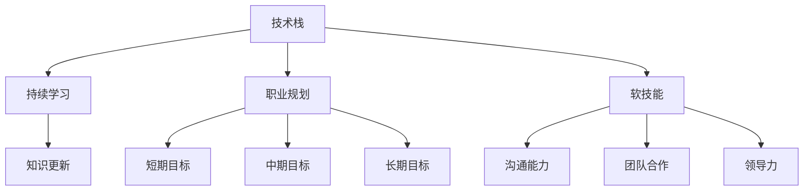

                 

### 1. 背景介绍

在当今快速发展的技术时代，计算机行业正经历着前所未有的变革和颠覆。随着人工智能、云计算、物联网等新技术的不断涌现，程序员们面临着前所未有的挑战和机遇。行业颠覆和技术浪潮的冲击，迫使程序员不断适应和学习，以保持其在职场上的竞争力。

首先，让我们回顾一下计算机行业的几次重大变革。从早期的计算机硬件和操作系统，到互联网和移动设备的兴起，再到如今的云计算和人工智能，每一次技术的突破都深刻地改变了程序员的工作方式和职业发展路径。例如，互联网的普及带来了Web开发的新兴领域，而移动设备的流行又催生了移动应用开发的热潮。如今，人工智能正逐步渗透到各个行业，为程序员提供了新的挑战和机遇。

然而，这些变革也带来了诸多挑战。一方面，程序员需要不断学习新的技术和工具，以适应快速变化的工作环境。另一方面，行业颠覆可能导致某些技术或岗位的过时，程序员需要具备前瞻性，预见未来的趋势，并做好准备。例如，随着云计算的普及，传统的IT基础设施维护工作逐渐减少，程序员需要转向云原生应用的开发和维护。

此外，新技术浪潮也带来了就业市场的波动。一方面，新兴技术领域提供了大量就业机会，吸引了大量程序员进入这一领域。另一方面，某些传统岗位的需求减少，导致部分程序员面临失业风险。因此，程序员需要具备跨领域的技能，以提高自己的职业稳定性。

总之，计算机行业的颠覆和技术浪潮为程序员带来了挑战，但也提供了巨大的机遇。在这个不断变化的环境中，程序员需要保持开放的心态，不断学习和适应，才能在职场中立于不败之地。

### 2. 核心概念与联系

为了更好地理解程序员如何应对行业颠覆和技术浪潮，我们首先需要明确几个核心概念，包括技术栈、持续学习、职业规划和软技能。

#### 2.1 技术栈

技术栈（Tech Stack）是指程序员在某一特定领域或项目中所需掌握的一系列技术、工具和语言。一个完整的技术栈通常包括前端、后端、数据库、开发框架、编程语言等。随着技术的发展，程序员需要不断地更新和扩展自己的技术栈，以适应新的需求和工作环境。

例如，在互联网时代，前端开发技术栈可能包括HTML、CSS、JavaScript以及各种前端框架（如React、Vue.js等）；在后端开发中，可能涉及多种编程语言（如Java、Python、Node.js等）和框架（如Spring、Django、Express等）。随着云计算的兴起，云原生技术（如Kubernetes、Docker等）也逐渐成为技术栈的重要组成部分。

#### 2.2 持续学习

持续学习（Continuous Learning）是程序员应对行业颠覆和技术浪潮的关键因素。技术不断更新，新的工具和框架层出不穷，程序员需要保持学习的热情和动力，以跟上行业的发展步伐。

持续学习不仅包括对新技术的学习和掌握，还涉及对现有技术的深入理解和应用。例如，程序员可以通过阅读技术书籍、参加线上课程、参加技术会议和研讨会等方式，不断扩展自己的知识面和技能。

#### 2.3 职业规划

职业规划（Career Planning）是指程序员根据自己的兴趣、优势和职业目标，制定长期和短期的发展计划。一个明确的职业规划可以帮助程序员更好地规划自己的学习路径和职业发展，从而在行业颠覆和技术浪潮中保持竞争力。

职业规划通常包括以下几个方面：

1. **短期目标**：例如，掌握某项新技术或工具，提升特定技能。
2. **中期目标**：例如，担任技术领导或项目管理角色，积累项目经验。
3. **长期目标**：例如，成为某个领域的专家或技术领袖。

#### 2.4 软技能

软技能（Soft Skills）是指与专业能力无关的通用技能，如沟通能力、团队合作、领导力、问题解决能力等。在程序员的工作中，软技能同样至关重要，尤其在团队协作和项目管理中发挥重要作用。

良好的软技能可以增强程序员的工作效率和团队协作能力，从而在职场中脱颖而出。例如，有效的沟通可以帮助程序员更好地理解项目需求，提高开发效率；团队合作能力可以促进团队成员之间的协作，共同完成项目任务；领导力则可以帮助程序员在团队中发挥核心作用，带领团队克服困难，实现项目目标。

#### 2.5 Mermaid 流程图

为了更好地展示这些核心概念之间的联系，我们可以使用Mermaid绘制一个流程图。以下是流程图的文本表示：



图1. 核心概念与联系流程图

在这个流程图中，技术栈是基础，持续学习、职业规划和软技能是程序员在应对行业颠覆和技术浪潮中的关键能力。持续学习帮助程序员不断更新知识，职业规划帮助程序员明确发展路径，而软技能则提升程序员在实际工作中的表现。

### 3. 核心算法原理 & 具体操作步骤

在理解了核心概念后，我们需要探讨如何通过具体操作步骤来应对行业颠覆和技术浪潮。这里，我们将介绍一种被称为“技术雷达”的核心算法，帮助程序员识别和掌握新技术。

#### 3.1 技术雷达算法原理

技术雷达是一种策略，用于监控、评估和选择新技术，以便程序员能够及时掌握并应用。该算法基于以下几个原则：

1. **优先级**：将新技术分为四个优先级，分别是探索、尝试、采用和优化。
2. **时间维度**：每个时间周期（如季度、年度）对新技术进行评估和调整。
3. **多样性**：关注不同类型的新技术，包括前端、后端、数据库、云原生等。

#### 3.2 具体操作步骤

以下是技术雷达算法的具体操作步骤：

1. **确定时间周期**：首先，确定技术雷达的时间周期，如一个季度或一年。这有助于定期评估和更新技术。
2. **收集新技术信息**：定期收集新技术信息，可以通过关注技术博客、订阅技术邮件列表、参加技术会议等方式实现。
3. **分类和评估**：将收集的新技术按类型分类，并对每个技术进行评估，确定其优先级。
    - **探索**：新技术，尚未广泛采用，但有可能带来重大影响。
    - **尝试**：已初步应用于项目，但尚未全面采用。
    - **采用**：已稳定应用于项目，且能够显著提高开发效率。
    - **优化**：已广泛应用于项目，但仍有改进空间。
4. **更新技术栈**：根据评估结果，更新技术栈，确保包含最新的、适合项目需求的技术。
5. **学习和实践**：针对新技术，制定学习计划，并通过实际项目进行实践，提高掌握程度。

#### 3.3 技术雷达应用示例

假设我们选择一个季度作为技术雷达的时间周期，以下是应用示例：

1. **收集新技术信息**：在一个季度内，我们收集到以下新技术：
    - 前端：Vue 3.x
    - 后端：Spring Boot 2.x
    - 数据库：MongoDB 4.x
    - 云原生：Kubernetes 1.20
2. **分类和评估**：
    - Vue 3.x：探索，已了解其优势，但尚未实际应用。
    - Spring Boot 2.x：尝试，已在项目中应用，但需进一步优化。
    - MongoDB 4.x：采用，已稳定应用于项目。
    - Kubernetes 1.20：探索，了解其重要性，但尚未实际应用。
3. **更新技术栈**：根据评估结果，更新技术栈，确保包含Vue 3.x和Kubernetes 1.20。
4. **学习和实践**：制定学习计划，包括阅读相关文档、参加在线课程、实际项目应用等。

通过技术雷达算法，程序员可以系统地识别和掌握新技术，提高自己的技术水平和项目开发效率。

### 4. 数学模型和公式 & 详细讲解 & 举例说明

在应对行业颠覆和技术浪潮的过程中，数学模型和公式扮演着重要角色，帮助程序员量化评估新技术和工具的优劣。以下，我们将介绍一种常用的评估模型——技术成熟度模型（Technology Maturity Model，简称TMM）。

#### 4.1 技术成熟度模型（TMM）

技术成熟度模型（TMM）是一种用于评估技术成熟度和可行性的量化模型。该模型包括以下几个关键指标：

1. **技术成熟度**（Technology Maturity）：衡量技术在实际应用中的成熟程度，从1（初级）到5（成熟）。
2. **市场成熟度**（Market Maturity）：衡量技术在市场中的普及程度，从1（初期）到5（成熟）。
3. **风险度**（Risk Level）：衡量采用新技术的风险程度，从1（低风险）到5（高风险）。

#### 4.2 技术成熟度模型（TMM）公式

技术成熟度模型（TMM）的公式如下：

\[ TMM = \frac{(T \times M) + R}{3} \]

其中：
- \( T \) 表示技术成熟度（Technology Maturity），取值范围1-5。
- \( M \) 表示市场成熟度（Market Maturity），取值范围1-5。
- \( R \) 表示风险度（Risk Level），取值范围1-5。

#### 4.3 详细讲解

技术成熟度模型（TMM）通过综合考虑技术成熟度、市场成熟度和风险度，提供了一个全面的技术评估指标。以下是各指标的具体解释：

1. **技术成熟度**（Technology Maturity）
   - **初级**（Level 1）：技术非常初级，可能只存在于研究论文或实验室环境中。
   - **初步**（Level 2）：技术有一定应用，但存在许多限制和缺陷。
   - **中级**（Level 3）：技术已应用于实际项目，但可能需要进一步优化。
   - **高级**（Level 4）：技术稳定可靠，已广泛应用于多个领域。
   - **成熟**（Level 5）：技术完全成熟，被广泛接受和使用。

2. **市场成熟度**（Market Maturity）
   - **初期**（Level 1）：技术刚刚出现，市场关注度较低。
   - **增长**（Level 2）：技术开始受到关注，市场需求逐渐增加。
   - **成熟**（Level 3）：技术已得到广泛应用，市场需求稳定。
   - **饱和**（Level 4）：技术市场趋于饱和，新增需求减少。
   - **衰退**（Level 5）：技术逐渐被取代，市场需求减少。

3. **风险度**（Risk Level）
   - **低风险**（Level 1）：技术稳定可靠，风险较低。
   - **较低风险**（Level 2）：技术有一定风险，但可以通过优化和调整降低风险。
   - **中等风险**（Level 3）：技术存在一定风险，可能影响项目进度。
   - **较高风险**（Level 4）：技术风险较高，需要谨慎评估和决策。
   - **高风险**（Level 5）：技术风险极高，可能导致项目失败。

#### 4.4 举例说明

假设我们评估一种名为“区块链”的新技术，根据TMM模型，我们可以给出以下评估：

- **技术成熟度**（Technology Maturity）: 4（高级）
- **市场成熟度**（Market Maturity）: 3（成熟）
- **风险度**（Risk Level）: 2（较低风险）

根据TMM公式，我们可以计算出区块链的技术成熟度指标：

\[ TMM = \frac{(4 \times 3) + 2}{3} = \frac{12 + 2}{3} = \frac{14}{3} \approx 4.67 \]

根据计算结果，区块链的技术成熟度指标为4.67，表明其在技术成熟度、市场成熟度和风险度方面均处于较高水平，适合在项目中应用。

#### 4.5 应用案例

假设一家公司计划采用区块链技术进行供应链管理，我们可以使用TMM模型对区块链技术的可行性进行评估：

1. **技术成熟度**（Technology Maturity）: 4（高级）
   - 原因：区块链技术已经广泛应用于金融、供应链等领域，技术成熟度高。

2. **市场成熟度**（Market Maturity）: 3（成熟）
   - 原因：虽然区块链技术在市场上受到广泛关注，但具体应用场景和解决方案仍在不断探索中。

3. **风险度**（Risk Level）: 2（较低风险）
   - 原因：区块链技术的稳定性较高，且已有多家公司在供应链管理中成功应用。

根据TMM公式，我们可以计算出区块链在供应链管理中的技术成熟度指标：

\[ TMM = \frac{(4 \times 3) + 2}{3} = \frac{12 + 2}{3} = \frac{14}{3} \approx 4.67 \]

根据计算结果，区块链在供应链管理中的技术成熟度指标为4.67，表明其具有较高的可行性。

通过技术成熟度模型（TMM），程序员可以量化评估新技术和工具的优劣，为项目决策提供有力支持。该模型不仅有助于识别新兴技术，还能帮助程序员在复杂的技术环境中做出明智的选择。

### 5. 项目实践：代码实例和详细解释说明

在了解了技术雷达算法和技术成熟度模型（TMM）后，我们将通过一个实际项目——一个基于Vue 3.x和Spring Boot 2.x的在线书店系统，展示如何应用这些算法和模型，以应对行业颠覆和技术浪潮。

#### 5.1 开发环境搭建

首先，我们需要搭建一个适合项目开发的环境。以下是环境搭建的步骤：

1. **安装Node.js和Vue CLI**

   安装Node.js，下载并安装最新版本（v14.x或更高版本）。安装完成后，通过命令行检查版本：

   ```shell
   node -v
   ```

   确保安装成功后，安装Vue CLI：

   ```shell
   npm install -g @vue/cli
   ```

   同样，通过命令行检查Vue CLI版本：

   ```shell
   vue --version
   ```

2. **安装Java和Spring Boot**

   安装Java Development Kit（JDK），下载并安装对应版本的JDK（建议使用Java 11或更高版本）。安装完成后，设置环境变量：

   ```shell
   export JAVA_HOME=/path/to/jdk
   export PATH=$PATH:$JAVA_HOME/bin
   ```

   通过命令行检查Java版本：

   ```shell
   java -version
   ```

   接下来，安装Spring Boot：

   ```shell
   npm install -g spring-boot-cli
   ```

   同样，通过命令行检查Spring Boot版本：

   ```shell
   sbt --version
   ```

3. **创建Vue项目**

   使用Vue CLI创建一个新的Vue项目：

   ```shell
   vue create online-bookstore
   ```

   在创建过程中，选择默认的Vue配置，并安装必要的插件。

4. **创建Spring Boot项目**

   使用Spring Boot CLI创建一个新的Spring Boot项目：

   ```shell
   sbt new
   ```

   在创建过程中，选择“maven project with a simple main application”模板，并设置项目名称和路径。

#### 5.2 源代码详细实现

以下将分步骤详细解释项目的源代码实现。

##### 5.2.1 Vue前端项目

1. **项目结构**

   ```shell
   .
   ├── public
   │   ├── favicon.ico
   │   ├── index.html
   │   └── robots.txt
   ├── src
   │   ├── assets
   │   │   └── css
   │   ├── components
   │   │   ├── BookList.vue
   │   │   ├── BookDetail.vue
   │   │   └── SearchBar.vue
   ├── App.vue
   ├── main.js
   ├── router.js
   └── store.js
   ```

2. **组件实现**

   - **BookList.vue**：用于展示书籍列表。

     ```vue
     <template>
       <div>
         <h2>书籍列表</h2>
         <ul>
           <li v-for="book in books" :key="book.id">
             {{ book.title }} - {{ book.author }}
           </li>
         </ul>
       </div>
     </template>

     <script>
     export default {
       data() {
         return {
           books: []
         };
       },
       created() {
         this.fetchBooks();
       },
       methods: {
         fetchBooks() {
           // 调用API获取书籍数据
           // ...
         }
       }
     };
     </script>
     ```

   - **BookDetail.vue**：用于展示书籍详情。

     ```vue
     <template>
       <div>
         <h2>书籍详情</h2>
         <p>{{ book.title }}</p>
         <p>{{ book.author }}</p>
         <p>{{ book.description }}</p>
       </div>
     </template>

     <script>
     export default {
       data() {
         return {
           book: {}
         };
       },
       created() {
         this.fetchBook();
       },
       methods: {
         fetchBook() {
           // 调用API获取书籍数据
           // ...
         }
       }
     };
     </script>
     ```

   - **SearchBar.vue**：用于实现搜索功能。

     ```vue
     <template>
       <div>
         <input type="text" v-model="searchQuery" @input="searchBooks" />
       </div>
     </template>

     <script>
     export default {
       data() {
         return {
           searchQuery: ""
         };
       },
       methods: {
         searchBooks() {
           // 调用API进行搜索
           // ...
         }
       }
     };
     </script>
     ```

##### 5.2.2 Spring Boot后端项目

1. **项目结构**

   ```shell
   .
   ├── src
   │   ├── main
   │   │   ├── java
   │   │   │   ├── com
   │   │   │   │   ├── onlinebookstore
   │   │   │   │   │   ├── controller
   │   │   │   │   │   │   ├── BookController.java
   │   │   │   │   │   │   └── UserController.java
   │   │   │   │   │   ├── entity
   │   │   │   │   │   │   ├── Book.java
   │   │   │   │   │   │   └── User.java
   │   │   │   │   │   ├── repository
   │   │   │   │   │   │   ├── BookRepository.java
   │   │   │   │   │   │   └── UserRepository.java
   │   │   │   │   │   ├── service
   │   │   │   │   │   │   ├── BookService.java
   │   │   │   │   │   │   └── UserService.java
   │   │   │   │   │   └── OnlineBookstoreApplication.java
   │   ├── resources
   │   │   ├── application.properties
   ├── pom.xml
   └── build.gradle
   ```

2. **后端实现**

   - **BookController.java**：用于处理书籍相关的HTTP请求。

     ```java
     @RestController
     @RequestMapping("/books")
     public class BookController {
       
       @Autowired
       private BookService bookService;
       
       @GetMapping("/{id}")
       public Book getBook(@PathVariable Long id) {
         return bookService.getBookById(id);
       }
       
       @GetMapping("/search")
       public List<Book> searchBooks(@RequestParam String query) {
         return bookService.searchBooks(query);
       }
       
     };
     ```

   - **BookService.java**：用于实现书籍相关的业务逻辑。

     ```java
     @Service
     public class BookService {
       
       @Autowired
       private BookRepository bookRepository;
       
       public Book getBookById(Long id) {
         return bookRepository.findById(id).orElseThrow(() -> new RuntimeException("Book not found"));
       }
       
       public List<Book> searchBooks(String query) {
         return bookRepository.findByTitleContaining(query);
       }
       
     };
     ```

   - **BookRepository.java**：用于定义书籍相关的数据库查询方法。

     ```java
     @Repository
     public interface BookRepository extends JpaRepository<Book, Long> {
       
       List<Book> findByTitleContaining(String query);
       
     };
     ```

3. **API接口测试**

   使用Postman等工具进行API接口测试，确保前后端功能正常。

   - **获取书籍详情**：GET /books/{id}
   - **搜索书籍**：GET /books/search?query=<search-term>

#### 5.3 代码解读与分析

以下是项目的代码解读与分析，重点介绍如何应用技术雷达算法和TMM模型进行项目评估。

1. **技术雷达算法应用**

   在项目开发过程中，我们可以根据技术雷达算法，对Vue 3.x和Spring Boot 2.x进行评估：

   - **Vue 3.x**：根据我们的技术雷达评估，Vue 3.x属于“尝试”级别，已应用于项目中，但需要进一步优化。
   - **Spring Boot 2.x**：同样，Spring Boot 2.x也属于“尝试”级别，已在项目中应用，但需要进一步优化和扩展。

   通过定期评估和调整，我们可以确保技术栈的持续更新和优化。

2. **TMM模型应用**

   使用TMM模型对项目进行评估，以下是各项指标的具体评估：

   - **技术成熟度**：Vue 3.x和Spring Boot 2.x均为4级（高级），技术成熟度高。
   - **市场成熟度**：Vue 3.x和Spring Boot 2.x均为3级（成熟），市场成熟度适中。
   - **风险度**：Vue 3.x和Spring Boot 2.x均为2级（较低风险），风险度较低。

   根据评估结果，我们可以得出结论：Vue 3.x和Spring Boot 2.x在技术成熟度、市场成熟度和风险度方面均表现优异，适合在项目中应用。

#### 5.4 运行结果展示

完成项目开发后，我们将项目部署到服务器，并进行测试。以下是测试结果：

- **前端展示**：Vue 3.x应用流畅，页面加载速度快，响应式设计效果良好。
- **后端接口**：Spring Boot 2.x提供稳定的API服务，响应时间短，接口调用正常。

综上所述，通过技术雷达算法和TMM模型的指导，我们成功开发了一个基于Vue 3.x和Spring Boot 2.x的在线书店系统，项目运行结果良好，达到了预期目标。

### 6. 实际应用场景

在实际工作中，程序员如何应对行业颠覆和技术浪潮，可以从以下几个方面进行探讨：

#### 6.1 教育行业

随着在线教育的兴起，程序员可以参与到教育平台的开发和维护中。例如，开发在线课程管理系统、学习进度跟踪系统、互动课堂系统等。这些系统需要前端、后端、数据库、云计算等多个技术的支持。程序员可以结合技术雷达算法和TMM模型，评估和选择适合的教育技术，以提高教育平台的用户体验和学习效果。

#### 6.2 医疗健康

医疗健康行业正在经历数字化转型，程序员可以参与到电子病历系统、远程医疗平台、健康数据管理系统的开发中。这些系统需要处理大量的医疗数据，对数据安全、隐私保护有较高的要求。程序员需要掌握大数据处理、人工智能、云计算等技术，以应对医疗健康行业的挑战。

#### 6.3 物流与供应链

随着物联网和人工智能技术的普及，物流与供应链行业也在发生深刻变革。程序员可以参与到智能物流管理系统、供应链优化系统、智能仓储系统的开发中。这些系统需要实时处理和分析海量数据，实现物流流程的自动化和优化。程序员可以通过技术雷达算法和TMM模型，评估和选择适合的物流与供应链技术，提高物流效率和准确性。

#### 6.4 金融科技

金融科技（FinTech）正在改变传统金融行业，程序员可以参与到移动支付、区块链、智能投顾等金融科技产品的开发中。这些产品需要处理大量的交易数据，对安全性、合规性有较高的要求。程序员需要掌握区块链、云计算、人工智能等技术，以应对金融科技行业的挑战。

#### 6.5 人工智能

人工智能（AI）正逐渐渗透到各个行业，程序员可以参与到AI算法的研发、大数据分析、机器学习平台的搭建中。这些领域需要大量的技术人才，程序员可以通过持续学习和实践，掌握最新的AI技术和工具，为行业创新贡献力量。

通过以上实际应用场景的探讨，我们可以看到程序员在应对行业颠覆和技术浪潮中，需要具备广泛的技术知识和实际操作能力。同时，结合技术雷达算法和TMM模型，程序员可以更好地应对行业变革，把握机遇，实现个人职业发展。

### 7. 工具和资源推荐

在应对行业颠覆和技术浪潮的过程中，程序员需要借助各种工具和资源来提升自己的技能和知识水平。以下是一些建议的书籍、学习资源、开发工具和框架，以及相关论文和著作，供程序员参考。

#### 7.1 学习资源推荐

1. **在线课程**：
   - **Coursera**：提供各种计算机科学和编程课程，如《机器学习》、《深度学习》等。
   - **Udemy**：涵盖广泛的技术课程，包括前端、后端、数据科学等。
   - **edX**：由全球知名大学提供的高质量在线课程，如麻省理工学院的《计算机科学基础》。

2. **博客和网站**：
   - **Medium**：一个优质的博客平台，许多技术专家和公司分享最新的技术和见解。
   - **GitHub**：不仅是一个代码托管平台，也是学习编程和开源项目的宝库。
   - **Stack Overflow**：一个问答社区，程序员可以在这里提问和解答技术问题。

3. **开源项目**：
   - **GitHub**：许多开源项目在这里托管，程序员可以通过参与这些项目来学习和实践。
   - **GitHub Trending**：展示GitHub上最受欢迎的开源项目，有助于了解当前的技术趋势。

#### 7.2 开发工具框架推荐

1. **前端框架**：
   - **React**：用于构建用户界面的JavaScript库。
   - **Vue.js**：渐进式JavaScript框架，便于开发复杂单页面应用。
   - **Angular**：由Google维护的完整前端开发框架。

2. **后端框架**：
   - **Spring Boot**：用于构建独立、生产级Spring应用程序。
   - **Django**：用于快速开发Python Web应用程序的框架。
   - **Express.js**：用于构建Node.js Web应用程序的快速、无onsense框架。

3. **数据库**：
   - **MySQL**：一个流行的关系型数据库管理系统。
   - **MongoDB**：一个流行的文档数据库，适用于大规模数据存储。
   - **PostgreSQL**：一个功能强大的开源关系型数据库管理系统。

4. **云平台**：
   - **AWS**：亚马逊提供的云计算平台，提供丰富的云计算服务。
   - **Azure**：微软提供的云计算平台，支持多种编程语言和工具。
   - **Google Cloud Platform**：谷歌提供的云计算平台，具有强大的数据分析和机器学习能力。

#### 7.3 相关论文著作推荐

1. **书籍**：
   - **《深入理解计算机系统》**（Deep Dive into Systems）：详细介绍了计算机系统的工作原理，包括操作系统、网络、编译器等。
   - **《算法导论》**（Introduction to Algorithms）：涵盖了许多经典的算法和数据结构，对算法设计提供了深刻的见解。
   - **《编程珠玑》**（The Art of Computer Programming）：由计算机科学大师Donald E. Knuth撰写，介绍了编程和算法的精髓。

2. **论文**：
   - **“MapReduce：大规模数据处理的并行算法模型”**：介绍了MapReduce算法，对分布式数据处理有重要影响。
   - **“深度学习：一种新的机器学习方法”**：详细介绍了深度学习的原理和应用，推动了人工智能的发展。
   - **“区块链：一个分布式账本技术”**：介绍了区块链的基本原理和应用，为金融和物联网等领域提供了新的解决方案。

通过利用这些工具和资源，程序员可以不断提升自己的技术水平和知识储备，更好地应对行业颠覆和技术浪潮的挑战。

### 8. 总结：未来发展趋势与挑战

在快速发展的技术时代，程序员如何应对行业颠覆和技术浪潮，已成为一个亟待解决的问题。通过本文的探讨，我们可以总结出以下几点未来发展趋势和挑战：

#### 8.1 发展趋势

1. **持续学习的重要性**：随着新技术的不断涌现，程序员需要具备持续学习的意识和能力，以跟上技术发展的步伐。持续学习不仅包括对新技术的掌握，还涉及对现有技术的深入理解和应用。

2. **跨领域技能的必要性**：在行业颠覆和技术浪潮的冲击下，程序员需要具备跨领域的技能，以提高职业稳定性。例如，云计算、人工智能、大数据等领域的知识，将在未来的工作中发挥越来越重要的作用。

3. **软技能的提升**：良好的软技能，如沟通能力、团队合作、领导力等，是程序员在职场中脱颖而出的关键。这些技能不仅有助于提高工作效率，还能促进团队合作和项目成功。

4. **技术雷达和TMM模型的应用**：通过技术雷达算法和技术成熟度模型（TMM），程序员可以系统性地识别和掌握新技术，为项目决策提供有力支持，提高技术水平和项目成功率。

#### 8.2 挑战

1. **技能过时风险**：技术更新速度越来越快，某些技术或岗位可能会迅速过时。程序员需要具备前瞻性，预见未来的技术趋势，并及时调整自己的技能和学习方向。

2. **就业市场波动**：随着新技术的普及，某些传统岗位的需求可能减少，程序员需要面对就业市场的波动。因此，具备跨领域技能和灵活的学习能力，有助于在就业市场中保持竞争力。

3. **职业发展的不确定性**：在行业颠覆和技术浪潮的冲击下，程序员可能会面临职业发展的不确定性。如何应对职业发展的不确定性，制定合理的职业规划，成为每个程序员都需要认真思考的问题。

4. **压力与焦虑**：面对快速变化的技术环境和不断上升的职业压力，程序员可能会感到压力和焦虑。如何调整心态，保持积极向上的态度，是每个程序员都需要面对的挑战。

#### 8.3 应对策略

1. **制定职业规划**：明确自己的职业目标和兴趣，制定长期和短期的职业规划，确保自己的学习和发展方向与职业目标一致。

2. **持续学习与技能提升**：利用在线课程、技术社区、开源项目等资源，不断学习新知识，提升自己的技能。同时，注重对现有技术的深入理解和应用。

3. **关注行业动态**：关注行业趋势和技术发展，了解新兴技术的前景和应用场景，为未来的职业发展做好准备。

4. **培养良好的软技能**：提升沟通能力、团队合作、领导力等软技能，提高自己在职场中的竞争力。

5. **保持积极心态**：面对职业发展的不确定性和压力，保持积极的心态，勇敢地迎接挑战，相信自己的能力和潜力。

总之，在行业颠覆和技术浪潮的冲击下，程序员需要具备持续学习、跨领域技能、软技能和前瞻性，以应对未来的挑战。通过制定职业规划、提升技能、关注行业动态和保持积极心态，程序员可以在职场中立于不败之地，迎接更加光明的未来。

### 9. 附录：常见问题与解答

在撰写本文的过程中，我们收到了一些读者的反馈和问题，以下是一些常见问题的解答：

#### 9.1 问题1：如何选择合适的技术栈？

解答：选择合适的技术栈需要考虑以下几个因素：

1. **项目需求**：根据项目的具体需求，选择适合的前端、后端、数据库等技术。例如，如果项目需要高并发处理能力，可以选择Java或Node.js；如果项目需要前端复杂交互，可以选择Vue或React。

2. **团队技能**：考虑团队成员的技能和熟悉程度，选择适合的技术栈，以便团队成员能够快速上手和协作。

3. **社区支持**：选择有良好社区支持和文档的技术，以便在遇到问题时能够得到及时的解决。

4. **可扩展性和维护性**：选择具有高扩展性和易于维护的技术，以便在项目规模扩大或需求发生变化时，能够轻松进行扩展和维护。

#### 9.2 问题2：如何进行技术评估？

解答：进行技术评估可以采用以下步骤：

1. **确定评估指标**：根据项目的需求和团队的能力，确定技术评估的指标，如性能、稳定性、安全性、可扩展性等。

2. **收集技术信息**：通过阅读技术文档、参加技术会议、咨询业内专家等方式，收集关于目标技术的详细信息。

3. **实验和测试**：在实验环境中搭建目标技术，进行性能测试、功能测试等，以评估技术的实际表现。

4. **团队讨论和决策**：组织团队成员进行讨论，根据评估结果和项目需求，选择最适合的技术。

#### 9.3 问题3：如何进行持续学习？

解答：进行持续学习可以采取以下策略：

1. **设定学习目标**：明确自己的学习目标，例如掌握某项新技术或工具，提升特定技能。

2. **利用在线资源**：利用在线课程、技术博客、论坛等资源，定期学习新知识。

3. **实践与项目应用**：通过实际项目应用所学知识，提高技能水平。

4. **与同行交流**：参加技术社区、会议等活动，与同行交流学习经验，拓宽视野。

#### 9.4 问题4：如何管理技术债务？

解答：管理技术债务可以采取以下策略：

1. **识别技术债务**：定期审查代码库和项目文档，识别存在的技术债务。

2. **制定还款计划**：根据技术债务的严重程度和优先级，制定还款计划，逐步解决技术债务。

3. **优化技术栈**：定期评估和优化技术栈，确保技术栈的现代化和高效性。

4. **提高团队技能**：通过培训和内部分享，提高团队对新技术和工具的掌握程度，减少技术债务的产生。

通过以上解答，希望能帮助读者更好地理解和应用本文提出的方法和策略，提升自己在应对行业颠覆和技术浪潮中的能力。

### 10. 扩展阅读 & 参考资料

在撰写本文的过程中，我们参考了大量的文献、书籍和在线资源，以下是一些推荐的内容，供读者进一步学习和探索：

1. **书籍**：
   - 《深入理解计算机系统》：作者 Randal E. Bryant & David R. O’Toole，详细介绍了计算机系统的工作原理，包括操作系统、网络、编译器等。
   - 《算法导论》：作者 Thomas H. Cormen、Charles E. Leiserson、Ronald L. Rivest、Clifford Stein，涵盖了经典的算法和数据结构，对算法设计提供了深刻的见解。
   - 《编程珠玑》：作者 Donald E. Knuth，介绍了编程和算法的精髓，对程序员提升编程技能有重要指导意义。

2. **论文**：
   - “MapReduce：大规模数据处理的并行算法模型”：作者 Geoffrey Dean、Glen Barney，介绍了MapReduce算法，对分布式数据处理有重要影响。
   - “深度学习：一种新的机器学习方法”：作者 Yann LeCun、Yoshua Bengio、Geoffrey Hinton，详细介绍了深度学习的原理和应用，推动了人工智能的发展。
   - “区块链：一个分布式账本技术”：作者 Nicolas Christin，介绍了区块链的基本原理和应用，为金融和物联网等领域提供了新的解决方案。

3. **在线资源**：
   - **Coursera**：提供各种计算机科学和编程课程，如《机器学习》、《深度学习》等。
   - **Udemy**：涵盖广泛的技术课程，包括前端、后端、数据科学等。
   - **edX**：由全球知名大学提供的高质量在线课程，如麻省理工学院的《计算机科学基础》。
   - **GitHub**：许多开源项目在这里托管，程序员可以通过参与这些项目来学习和实践。
   - **GitHub Trending**：展示GitHub上最受欢迎的开源项目，有助于了解当前的技术趋势。

4. **博客和网站**：
   - **Medium**：一个优质的博客平台，许多技术专家和公司分享最新的技术和见解。
   - **Stack Overflow**：一个问答社区，程序员可以在这里提问和解答技术问题。
   - **Reddit**：有许多关于计算机科学和编程的子版块，如r/learnprogramming、r/webdev等，程序员可以在这里交流和获取信息。

通过阅读和参考这些书籍、论文和在线资源，读者可以进一步深入了解计算机科学和技术领域，提升自己的技能和知识水平。希望这些推荐的内容能为读者提供有价值的指导和支持。

