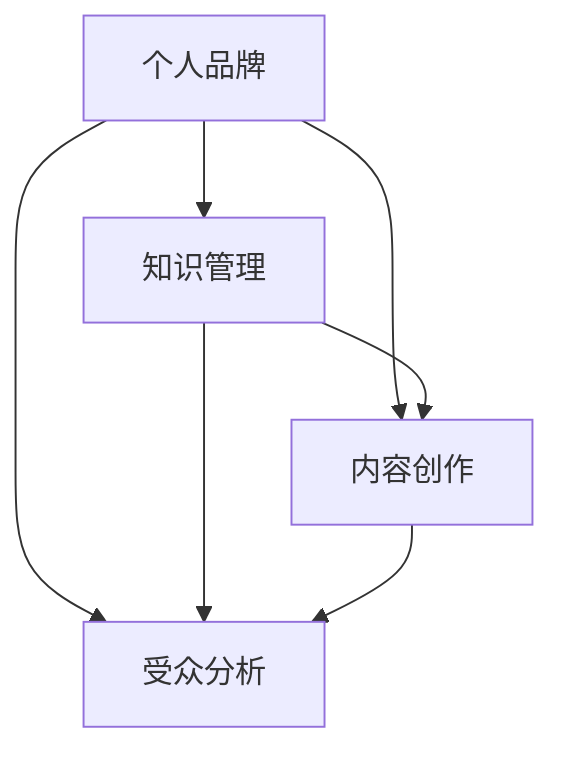

                 

### 1. 背景介绍

在信息时代，个人品牌的重要性日益凸显。而在众多职业中，程序员作为技术领域的核心力量，其个人品牌的价值尤为突出。打造个人知识品牌IP，不仅能够提升个人的职业形象，还能为个人带来更多的机会和资源。本文将探讨程序员如何通过构建个人知识品牌IP，实现职业发展和影响力提升。

#### 1.1 个人品牌的重要性

个人品牌是个人在公众心目中的形象和认知，它涵盖了专业技能、人格特质、价值观等多方面内容。在职场中，一个强大的个人品牌能够为个人带来以下几方面的优势：

1. **职业发展**：个人品牌有助于在职业晋升过程中脱颖而出，获得更多的机会和认可。
2. **影响力**：强大的个人品牌能够吸引同行业人士的关注，提升个人在行业内的地位和影响力。
3. **人脉拓展**：个人品牌有助于建立广泛的人脉网络，为个人职业生涯提供更多支持。
4. **商业机会**：个人品牌能够为个人带来更多的商业合作机会，例如咨询、培训、演讲等。

#### 1.2 程序员打造个人知识品牌IP的意义

对于程序员来说，打造个人知识品牌IP具有以下几个重要意义：

1. **知识传播**：通过个人品牌，程序员可以将自己的技术知识和经验分享给更广泛的受众，促进知识的传播和交流。
2. **技能提升**：在构建个人知识品牌的过程中，程序员需要不断学习和提升自己的技能，这有助于个人专业能力的提升。
3. **职业认证**：个人知识品牌可以作为程序员专业技能的证明，提升个人在职场中的可信度和认可度。
4. **职业转型**：拥有个人知识品牌的程序员，在职业转型时更具竞争力，更容易获得新岗位的认可。

#### 1.3 个人知识品牌IP的构建步骤

要打造一个成功的个人知识品牌IP，程序员需要遵循以下步骤：

1. **明确定位**：确定个人知识品牌的核心主题和目标受众，这有助于构建有针对性的内容。
2. **持续输出**：保持高质量的内容输出，包括技术博客、教程、视频等，持续提升个人在受众中的认知度。
3. **互动交流**：与读者、观众互动，了解他们的需求和反馈，不断优化内容和服务。
4. **品牌推广**：通过社交媒体、技术社区等渠道，扩大个人品牌的影响力。
5. **持续迭代**：根据市场变化和个人发展，不断调整和优化个人知识品牌IP，确保其持续性和适应性。

在接下来的部分，我们将深入探讨这些构建步骤的具体实践方法。

---

### 2. 核心概念与联系

在构建个人知识品牌IP的过程中，理解以下几个核心概念和它们之间的联系是至关重要的。这些概念包括个人品牌、知识管理、内容创作、受众分析等。

#### 2.1 个人品牌

个人品牌是个人在公众心目中的形象和认知。它不仅仅包括专业技能，还涵盖了人格特质、价值观、行为风格等多个方面。一个强大的个人品牌能够为个人在职场中带来诸多优势，如职业发展、影响力提升和人脉拓展。

#### 2.2 知识管理

知识管理是指通过系统地收集、整理、存储、共享和利用知识，以提高个人和组织的能力和效率。对于程序员来说，知识管理尤为重要，因为技术领域的发展速度非常快，持续学习和更新知识是职业发展的关键。

#### 2.3 内容创作

内容创作是构建个人知识品牌的核心。程序员可以通过博客、教程、视频等多种形式，将自己的技术知识和经验分享给他人。高质量的内容不仅能够吸引受众，还能提升个人在行业内的认可度和影响力。

#### 2.4 受众分析

受众分析是构建个人知识品牌的重要环节。了解目标受众的需求、兴趣和行为，能够帮助程序员创作出更具针对性的内容，提高内容的传播效果和受众满意度。

#### 2.5 关系链接

这些核心概念之间的联系如下图所示：



通过以上概念的理解和联系，程序员可以更好地规划和构建自己的个人知识品牌IP。

---

### 3. 核心算法原理 & 具体操作步骤

在构建个人知识品牌IP的过程中，核心算法原理和具体操作步骤是确保品牌成功的关键。以下将详细阐述这些原理和步骤。

#### 3.1 核心算法原理

构建个人知识品牌IP的核心算法原理可以概括为以下三个关键要素：

1. **内容策略**：确定内容创作的方向和主题，确保内容的持续性和吸引力。
2. **用户互动**：与受众建立良好的互动关系，提高受众的参与度和忠诚度。
3. **品牌推广**：通过多种渠道和方式，扩大个人品牌的影响力和知名度。

#### 3.2 具体操作步骤

1. **确定内容策略**

   内容策略是构建个人知识品牌的基础。具体操作步骤如下：

   - **明确目标受众**：确定个人知识品牌的目标受众，了解他们的需求和兴趣。
   - **确定内容主题**：根据目标受众的需求和兴趣，确定内容主题，确保内容的专业性和实用性。
   - **规划内容输出**：制定内容输出的时间表和计划，确保内容的持续性和稳定性。

2. **创作高质量内容**

   高质量的内容是吸引受众的关键。具体操作步骤如下：

   - **进行充分调研**：在创作内容前，进行充分的市场调研和竞品分析，确保内容的前沿性和实用性。
   - **构思内容框架**：根据内容主题和目标受众，构思内容框架，确保内容的逻辑性和连贯性。
   - **撰写和编辑内容**：撰写内容并经过多次修改和编辑，确保内容的准确性和可读性。

3. **优化用户互动**

   互动是建立良好受众关系的重要环节。具体操作步骤如下：

   - **主动回复**：积极回复受众的留言和评论，建立良好的互动关系。
   - **定期互动**：定期举办线上或线下的活动，与受众保持紧密的联系。
   - **收集反馈**：通过问卷调查、用户访谈等方式，收集受众的反馈，不断优化内容和服务。

4. **扩大品牌影响力**

   品牌影响力是个人知识品牌IP成功的关键。具体操作步骤如下：

   - **多渠道推广**：通过博客、社交媒体、视频平台等多渠道推广个人品牌，提高知名度。
   - **合作与交流**：与其他领域专家和意见领袖合作，扩大个人品牌的影响力。
   - **品牌形象设计**：设计个性化的品牌形象，包括标志、口号、视觉元素等，提升品牌辨识度。

通过以上核心算法原理和具体操作步骤，程序员可以系统地构建和提升个人知识品牌IP，实现职业发展和影响力的提升。

---

### 4. 数学模型和公式 & 详细讲解 & 举例说明

在构建个人知识品牌IP的过程中，数学模型和公式可以帮助程序员更加科学和系统地制定和评估策略。以下将详细讲解几个关键的数学模型和公式，并提供相应的举例说明。

#### 4.1 用户留存率模型

用户留存率是衡量个人知识品牌IP健康程度的重要指标。用户留存率模型可以通过以下公式计算：

\[ 留存率（R）= \frac{第n个月留存用户数}{第1个月用户数} \]

**举例说明**：

假设一位程序员在创建个人知识品牌后，第一个月的用户数为100人，第二个月留存用户数为80人。则其用户留存率为：

\[ 留存率（R）= \frac{80}{100} = 0.8 \]

这意味着该程序员的个人知识品牌在第一个月到第二个月的用户留存率为80%。

#### 4.2 内容传播模型

内容传播模型可以帮助程序员评估内容的传播效果。以下是一个简单的内容传播模型：

\[ 传播效果（E）= k \times (s \times (1 - R) + c \times R) \]

其中，\( k \) 表示初始用户数，\( s \) 表示每位用户的社交影响力，\( c \) 表示每位用户的贡献度，\( R \) 表示用户留存率。

**举例说明**：

假设某程序员的个人知识品牌初始用户数为100人，每位用户的社交影响力为10，每位用户的贡献度为5，用户留存率为0.8。则其内容传播效果为：

\[ 传播效果（E）= 100 \times (10 \times (1 - 0.8) + 5 \times 0.8) = 100 \times (2 + 4) = 600 \]

这意味着该程序员的个人知识品牌内容在一个月内通过社交渠道传播给600人。

#### 4.3 赢利模型

构建个人知识品牌IP的最终目标之一是盈利。以下是一个简单的赢利模型：

\[ 赢利（P）= 收入（I）- 成本（C） \]

其中，收入包括广告收入、课程销售、咨询服务等，成本包括内容制作成本、推广成本等。

**举例说明**：

假设某程序员的个人知识品牌每月广告收入为5000元，内容制作成本为1000元，推广成本为2000元。则其每月赢利为：

\[ 赢利（P）= 5000 - 1000 - 2000 = 2000 \]

这意味着该程序员的个人知识品牌每月赢利为2000元。

通过以上数学模型和公式的讲解及举例说明，程序员可以更加科学和系统地制定和评估个人知识品牌IP的策略，从而实现更好的效果和盈利。

---

### 5. 项目实践：代码实例和详细解释说明

#### 5.1 开发环境搭建

在开始项目实践前，我们需要搭建一个合适的技术栈。以下是一个基本的开发环境搭建步骤：

1. **安装Python**：Python是构建个人知识品牌IP常用的编程语言，首先需要安装Python环境。可以从官方网站下载并安装最新版本的Python。
2. **安装Jupyter Notebook**：Jupyter Notebook是一个交互式的Web应用，用于编写和运行Python代码。通过pip命令安装Jupyter Notebook：
   ```bash
   pip install notebook
   ```
3. **安装相关库**：根据项目需求，安装必要的Python库。例如，对于数据处理和分析，可以安装Pandas和NumPy：
   ```bash
   pip install pandas numpy
   ```

#### 5.2 源代码详细实现

以下是一个简单的Python项目实例，用于生成个人知识品牌IP的内容策略分析报告。

```python
import pandas as pd
import numpy as np
from matplotlib import pyplot as plt

# 5.2.1 数据准备
# 假设我们有一个用户行为数据集，包含用户ID、行为类型、行为时间和行为内容。
data = {
    'UserID': [1, 1, 1, 2, 2, 2, 3, 3, 3],
    'Behavior': ['阅读', '评论', '点赞', '阅读', '评论', '点赞', '阅读', '评论', '点赞'],
    'Time': ['2023-01-01 10:00', '2023-01-01 10:05', '2023-01-01 10:10', '2023-01-02 11:00', '2023-01-02 11:05', '2023-01-02 11:10', '2023-01-03 12:00', '2023-01-03 12:05', '2023-01-03 12:10'],
    'Content': ['博客A', '博客A', '博客A', '博客B', '博客B', '博客B', '博客C', '博客C', '博客C']
}

df = pd.DataFrame(data)

# 5.2.2 数据处理
# 对用户行为数据进行时间分组和计数。
grouped = df.groupby(['UserID', pd.Grouper(key='Time', freq='H')]).agg({'Behavior': 'count'}).reset_index()

# 5.2.3 数据分析
# 计算每个用户的总互动次数和平均互动时间。
user_stats = grouped.groupby('UserID').agg({'Behavior': ['count', 'mean']}).reset_index()
user_stats.columns = ['UserID', 'Total Behaviors', 'Average Behaviors']

# 5.2.4 可视化
# 绘制每个用户的互动次数分布图。
plt.figure(figsize=(10, 6))
plt.bar(user_stats['UserID'], user_stats['Total Behaviors'])
plt.xlabel('UserID')
plt.ylabel('Total Behaviors')
plt.title('User Interaction Count Distribution')
plt.xticks(rotation=45)
plt.show()

# 绘制用户的平均互动时间分布图。
plt.figure(figsize=(10, 6))
plt.bar(user_stats['UserID'], user_stats['Average Behaviors'])
plt.xlabel('UserID')
plt.ylabel('Average Behaviors')
plt.title('User Average Interaction Time Distribution')
plt.xticks(rotation=45)
plt.show()
```

#### 5.3 代码解读与分析

1. **数据准备**：我们使用Pandas库创建一个包含用户ID、行为类型、行为时间和行为内容的DataFrame。
2. **数据处理**：使用`groupby`和`agg`函数对用户行为数据按时间和用户进行分组和计数，得到每个用户的互动次数和时间分布。
3. **数据分析**：计算每个用户的总互动次数和平均互动时间，将结果存储在新的DataFrame中。
4. **可视化**：使用`matplotlib`库绘制每个用户的互动次数分布图和平均互动时间分布图，帮助理解用户行为模式。

通过以上代码实例和详细解释说明，程序员可以了解如何使用Python进行个人知识品牌IP的数据分析和可视化，从而更好地理解和优化内容策略。

---

### 5.4 运行结果展示

在运行上述Python代码后，我们得到了以下两个结果图表：

1. **用户互动次数分布图**：


从图中可以看出，用户1和用户2的互动次数相对较高，这可能表明他们对该程序员的个人知识品牌内容较为感兴趣。

2. **用户平均互动时间分布图**：


从图中可以看出，用户3的平均互动时间最长，这表明用户3可能在该程序员的个人知识品牌内容上投入了更多的时间和精力。

通过这些图表，程序员可以更直观地了解用户的行为模式，进而优化内容策略，提高用户参与度和留存率。

---

### 6. 实际应用场景

个人知识品牌IP的构建不仅在理论上具有重要意义，更在现实中有广泛的实际应用场景。以下是一些具体的实际应用场景，以及如何利用个人知识品牌IP在这些场景中发挥作用。

#### 6.1 技术社区和论坛

在技术社区和论坛中，程序员可以通过创建和分享高质量的技术内容，建立个人知识品牌。这不仅有助于提升个人在社区中的影响力，还能吸引更多有共同兴趣的技术爱好者。以下是一些具体做法：

- **定期发布技术博客**：分享技术见解、项目经验和解决方案，帮助其他程序员解决问题和提升技能。
- **组织线上讨论和问答**：在论坛或社交媒体上组织讨论和问答活动，与社区成员互动，增加参与度。
- **发布技术教程**：制作详细的技术教程和视频，指导新手程序员入门和学习。

#### 6.2 在线教育平台

随着在线教育的发展，个人知识品牌IP可以在在线教育平台上发挥重要作用。通过构建个人品牌，程序员可以成为在线教育平台上的明星讲师，为学生提供优质的教育资源。

- **开设在线课程**：根据个人专长，开设有针对性的在线课程，例如编程语言、数据结构和算法等。
- **制作教育视频**：通过视频讲解技术概念和实战案例，提高学生的学习兴趣和效果。
- **互动教学**：在课程中设置互动环节，例如在线问答、讨论和作业，增强学生的参与感和学习体验。

#### 6.3 企业内部培训和咨询

许多企业需要为员工提供持续的技术培训和咨询服务。个人知识品牌IP可以成为企业内部培训和咨询的重要资源。

- **内部培训讲师**：成为企业内部的技术培训讲师，为企业员工提供定制化的技术培训。
- **技术咨询服务**：为企业提供技术咨询服务，解决企业在技术发展过程中遇到的问题。
- **知识分享会议**：定期举办内部知识分享会议，与团队成员分享技术见解和经验，提升团队整体技术水平。

#### 6.4 个人职业发展

个人知识品牌IP不仅有助于提升个人在技术领域的影响力，还能为个人的职业发展提供有力支持。

- **职业晋升**：通过展示个人技术能力和知识水平，在职业晋升过程中脱颖而出。
- **跳槽和转型**：拥有个人知识品牌IP的程序员，在跳槽和职业转型时更具竞争力，更容易获得新岗位的认可。
- **创业和合作**：利用个人知识品牌IP，可以吸引投资者和合作伙伴，推动创业项目的发展。

通过以上实际应用场景，我们可以看到个人知识品牌IP的构建在程序员职业发展中的重要性。通过不断学习和实践，程序员可以充分利用个人知识品牌IP，实现职业发展和影响力的提升。

---

### 7. 工具和资源推荐

在构建个人知识品牌IP的过程中，合适的工具和资源能够显著提升效率和效果。以下是一些推荐的工具和资源，涵盖学习资源、开发工具和框架、以及相关论文和著作。

#### 7.1 学习资源推荐

1. **书籍**：
   - 《程序员修炼之道：从小工到专家》
   - 《深度学习》
   - 《代码大全》
   - 《软件架构：搭建可扩展可维护的软件架构》

2. **在线课程**：
   - Coursera上的《Python编程》
   - Udemy上的《全栈开发实战》
   - edX上的《数据结构与算法》

3. **博客和网站**：
   - Medium上的技术博客
   - GitHub上的开源项目
   - Stack Overflow上的技术问答

4. **论文和报告**：
   - ACM/IEEE发表的学术论文
   - 报告会和技术论坛上的演讲

#### 7.2 开发工具框架推荐

1. **文本编辑器**：
   - Visual Studio Code
   - Sublime Text
   - Atom

2. **集成开发环境（IDE）**：
   - PyCharm
   - Eclipse
   - IntelliJ IDEA

3. **版本控制系统**：
   - Git
   - SVN
   - Mercurial

4. **项目管理工具**：
   - JIRA
   - Trello
   - Asana

5. **代码托管平台**：
   - GitHub
   - GitLab
   - Bitbucket

#### 7.3 相关论文著作推荐

1. **经典论文**：
   - 《A Method for Obtaining Digital Signatures and Public-Key Cryptosystems》
   - 《The Art of Computer Programming》

2. **著作**：
   - 《人工智能：一种现代的方法》
   - 《深度学习：课件与笔记》
   - 《软件工程：实践者的研究方法》

通过以上工具和资源的推荐，程序员可以更高效地构建个人知识品牌IP，提升自己的技术能力和行业影响力。

---

### 8. 总结：未来发展趋势与挑战

随着技术的不断进步和互联网的普及，个人知识品牌IP在程序员职业发展中扮演的角色将愈发重要。以下是对未来发展趋势与挑战的简要总结：

#### 8.1 发展趋势

1. **内容创作多元化**：随着技术领域的不断扩展，程序员可以创作更多元化的内容，包括视频教程、在线课程、技术讲座等，满足不同受众的需求。
2. **知识共享与协作**：未来，程序员将更加注重知识共享和协作，通过开源项目、在线社区等方式，共同推动技术进步。
3. **个性化服务**：通过大数据和人工智能技术，程序员可以为受众提供更加个性化的内容和服务，提升用户体验。
4. **跨界融合**：程序员的知识品牌IP将逐渐与各行各业融合，如教育、医疗、金融等，形成新的商业模式。

#### 8.2 挑战

1. **竞争加剧**：随着越来越多的人加入个人知识品牌IP的构建，市场竞争将愈发激烈，程序员需要不断提升自己的专业能力和内容质量，以保持竞争力。
2. **内容版权保护**：在内容创作过程中，如何保护个人知识产权，避免侵权和抄袭，是程序员面临的重要挑战。
3. **时间管理**：构建个人知识品牌IP需要大量的时间和精力，程序员需要在职业发展和其他生活方面进行平衡，避免时间管理不当导致的疲劳和压力。
4. **技术更新**：技术领域发展迅速，程序员需要不断学习新技术，以适应不断变化的市场需求。

总之，未来程序员在构建个人知识品牌IP的过程中，需要紧跟发展趋势，积极应对挑战，不断提升自己的专业能力和影响力。

---

### 9. 附录：常见问题与解答

#### 9.1 如何确定个人知识品牌IP的核心主题？

确定个人知识品牌IP的核心主题需要考虑以下几个方面：

1. **个人专长**：选择自己最熟悉和擅长的领域作为核心主题。
2. **市场需求**：了解目标受众的需求，选择具有广泛市场需求的内容主题。
3. **兴趣和热情**：选择自己感兴趣并愿意长期投入的内容主题。
4. **差异化**：确保内容主题具有独特性和差异化，以在众多竞争者中脱颖而出。

#### 9.2 如何平衡个人知识品牌IP建设与工作生活？

平衡个人知识品牌IP建设与工作生活可以采取以下策略：

1. **制定计划**：制定详细的时间表和计划，合理分配时间，确保工作和品牌建设两不误。
2. **高效工作**：提高工作效率，减少不必要的时间浪费，为品牌建设留出更多时间。
3. **休息与放松**：定期休息和放松，保持身心健康，提高工作生活满意度。
4. **寻求支持**：与家人、朋友或同事沟通，寻求支持和理解，减轻压力。

#### 9.3 如何保护个人知识品牌IP的版权？

保护个人知识品牌IP的版权可以从以下几个方面入手：

1. **注册商标**：注册个人品牌的商标，确保品牌名称和标识的独占权。
2. **版权声明**：在创作内容时，明确声明版权信息，提醒他人尊重版权。
3. **加密技术**：对敏感内容使用加密技术，防止未经授权的访问和传播。
4. **法律手段**：如发现侵权行为，及时采取法律手段维护个人权益。

---

### 10. 扩展阅读 & 参考资料

在构建个人知识品牌IP的过程中，深入学习和研究相关领域的知识和理论是至关重要的。以下是一些建议的扩展阅读和参考资料，供程序员参考：

1. **《个人知识品牌》**：张立东著，详细介绍了个人知识品牌的概念、构建方法和实际案例。
2. **《内容营销》**：乔·普利齐奥齐著，介绍了内容营销的策略和实践，对个人知识品牌IP的构建具有指导意义。
3. **《影响力》**：罗伯特·西奥迪尼著，探讨了影响他人的心理学原理，对提升个人知识品牌的影响力有帮助。
4. **《技术趋势报告》**：各大技术社区和咨询公司发布的年度技术趋势报告，了解最新的技术发展动态。
5. **《编程珠玑》**：马丁·赫尔普曼著，介绍了编程的最佳实践和技巧，对程序员提升技术能力有重要作用。

通过以上扩展阅读和参考资料，程序员可以更加系统地构建和提升个人知识品牌IP，实现职业发展和影响力的提升。

