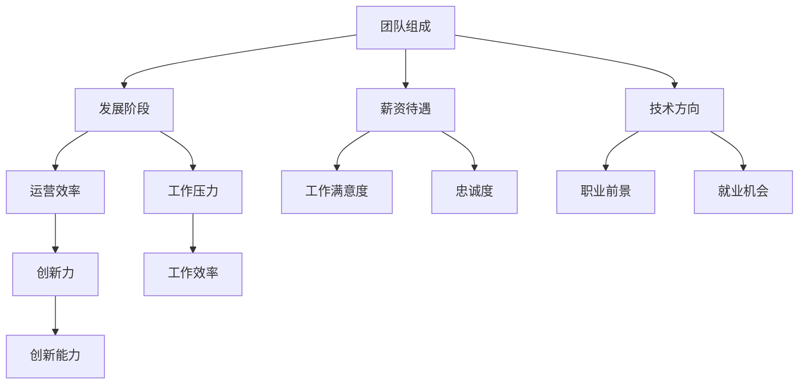

                 

### 背景介绍

#### 引言

在当今快速发展的科技时代，创业公司如雨后春笋般涌现。对于许多程序员来说，加入早期创业公司不仅是一次职业发展的机会，更是一种梦想成真的途径。然而，面对那些充满诱惑力的创业公司offer，如何做出明智的选择成为了摆在程序员面前的重要课题。这不仅关系到个人的职业发展方向，也涉及到未来工作环境的稳定性和个人成长。

本文将围绕“程序员如何评估早期创业公司offer”这一主题，通过逐步分析推理，探讨多个关键因素，帮助程序员们做出更为明智的决策。我们将从背景介绍开始，逐步深入到核心概念、算法原理、数学模型、项目实践以及实际应用场景等多个方面，全面解析这一复杂问题。

#### 创业公司offer的价值评估

创业公司offer的价值评估是一个多维度、复杂的决策过程。对于程序员来说，以下几个方面是评估创业公司offer时必须考虑的关键因素：

1. **公司技术方向和前景**：创业公司的技术方向是否与个人技术专长相符，以及该方向在未来市场上的发展潜力，这是决定是否接受offer的重要因素。
2. **团队组成和氛围**：创业公司的团队是否具备强大的技术实力和良好的协作氛围，这将直接影响到个人的职业成长和工作体验。
3. **薪资待遇和福利**：虽然薪资并不是唯一的决定因素，但合理的薪资待遇和福利制度是评估offer的一个重要方面，尤其是对于早期创业公司，需要考虑长期的利益。
4. **公司发展阶段**：创业公司处于不同的发展阶段，面临的挑战和机遇也不同。早期阶段的公司可能风险较高，但同时也可能带来更大的成长空间。

#### 文章结构

为了帮助程序员们全面、系统地评估早期创业公司offer，本文将采用以下结构：

1. **背景介绍**：介绍创业公司offer的价值评估背景，明确文章目的。
2. **核心概念与联系**：阐述评估创业公司offer所需理解的核心概念和架构，并使用Mermaid流程图展示。
3. **核心算法原理 & 具体操作步骤**：详细分析评估offer所需的核心算法原理和具体操作步骤。
4. **数学模型和公式 & 详细讲解 & 举例说明**：介绍用于评估offer的数学模型，并通过具体案例进行详细讲解。
5. **项目实践：代码实例和详细解释说明**：通过实际项目实例，展示评估offer的代码实现过程，并进行详细解释和分析。
6. **实际应用场景**：讨论评估offer在实际工作中的应用，以及可能遇到的问题和挑战。
7. **工具和资源推荐**：推荐有助于评估offer的学习资源、开发工具和框架。
8. **总结：未来发展趋势与挑战**：总结文章的主要观点，并展望未来发展趋势和挑战。
9. **附录：常见问题与解答**：提供针对常见问题的解答。
10. **扩展阅读 & 参考资料**：推荐相关的扩展阅读和参考资料。

通过上述结构，我们将逐步深入探讨程序员如何评估早期创业公司offer，希望能为程序员们提供有价值的指导和参考。

#### 创业公司的技术方向与前景

在评估早期创业公司offer时，公司技术方向和前景是一个至关重要的因素。技术方向不仅决定了公司的核心竞争力，还直接影响到员工的职业发展和成长空间。因此，深入分析公司的技术方向和市场前景，是程序员做出明智决策的关键步骤。

首先，我们需要明确什么是技术方向。技术方向指的是公司在技术研发上所追求的目标和领域，通常包括软件工程、人工智能、区块链、云计算、物联网等多个方向。每个方向都有其特定的技术栈和发展路径，因此，程序员在评估offer时，需要了解公司的技术方向是否与自己的专业技能和兴趣相符。

**市场前景分析**：

市场前景分析是评估创业公司技术方向的重要环节。一个具有良好市场前景的技术方向，通常具备以下特点：

1. **市场需求旺盛**：技术方向必须能够满足当前市场的需求，解决用户的问题或提供创新的解决方案。例如，人工智能在金融、医疗、零售等领域的应用正在迅速增长，市场需求旺盛，这为技术人才提供了广阔的发展空间。

2. **政策支持**：政府的政策支持和行业标准的制定，对技术方向的发展有着重要的影响。例如，区块链技术在全球范围内的政策支持和监管环境日益完善，这为区块链行业的发展提供了良好的外部条件。

3. **技术成熟度**：技术方向的技术成熟度也是评估其前景的重要指标。一个新兴的技术方向，如果已经具备一定的技术成熟度和广泛应用的基础，通常更容易获得市场的认可和资本的青睐。

**具体操作步骤**：

为了准确评估创业公司技术方向和市场前景，程序员可以采取以下具体操作步骤：

1. **调研公司背景**：通过查阅公司的官方网站、新闻发布、产品介绍等，了解公司的基本信息、发展历程、技术团队和主要产品或服务。

2. **市场分析**：利用市场研究报告、行业分析文章等资源，分析公司所在行业的发展趋势、市场规模、竞争格局等。

3. **技术调研**：深入了解公司所采用的技术栈、研发成果和专利情况，评估技术的先进性和应用潜力。

4. **与团队成员交流**：与公司现有团队成员进行交流，了解公司的发展方向、团队氛围和技术挑战。

5. **分析竞争对手**：分析公司主要竞争对手的技术方向、产品特性和市场表现，对比分析公司的优势与劣势。

通过上述步骤，程序员可以全面了解创业公司的技术方向和市场前景，为评估offer提供有力依据。

**案例说明**：

以一家专注于区块链技术的创业公司为例，我们可以通过以下案例说明如何评估其技术方向和市场前景：

- **公司背景**：该公司成立于2020年，专注于区块链技术在供应链金融领域的应用，拥有多个区块链专利。
- **市场分析**：供应链金融是一个具有巨大市场潜力的领域，随着区块链技术的成熟，越来越多的企业开始采用区块链解决方案来提高供应链透明度和效率。
- **技术调研**：该公司在区块链技术方面具有深厚的技术积累，其解决方案在多个实际项目中得到了验证和应用。
- **团队交流**：与团队成员交流后，了解到该公司技术团队实力强大，且公司发展迅速，正处于快速扩张期。
- **竞争对手分析**：在区块链供应链金融领域，该公司与几家知名企业竞争，但凭借其技术优势和创新能力，该公司在市场上具备较强的竞争力。

通过以上分析，我们可以判断这家区块链创业公司的技术方向和市场前景具有较大的发展潜力，对于有志于在区块链领域发展的程序员来说，这是一个值得考虑的offer。

总之，准确评估创业公司技术方向和市场前景，是程序员评估offer的重要环节。通过详细的调研和分析，程序员可以更好地了解公司的未来发展方向，为自己的职业规划提供有力支持。

### 核心概念与联系

在评估早期创业公司offer的过程中，理解一些核心概念和其相互联系是非常关键的。这些概念不仅帮助我们更好地理解创业公司的运作模式，还能为我们的决策提供有力支持。以下是几个必须理解的核心概念及其相互联系。

#### 团队组成

团队组成是评估创业公司offer的一个重要方面。一个成功的创业公司需要具备多方面的专业人才，包括技术、市场、运营、财务等。每个团队成员的背景、能力和经验都将直接影响公司的运作和未来发展。

**团队成员的角色**：
1. **技术团队**：技术团队是创业公司的核心力量，他们的职责是研发和改进产品或服务，确保技术竞争力。
2. **市场团队**：市场团队负责产品推广和品牌建设，通过市场调研和推广策略，提升公司的市场份额。
3. **运营团队**：运营团队负责公司的日常运营，包括客户服务、项目管理、销售支持等。
4. **财务团队**：财务团队负责公司财务管理和资金运作，确保公司的财务健康和可持续发展。

**团队组成的评估**：
- **多样性**：团队成员的多样性能带来不同的视角和思维方式，有助于创新和问题解决。
- **专业能力**：团队成员的专业能力和经验是公司技术实力和市场竞争力的重要保障。
- **团队协作**：团队成员之间的协作能力和沟通效率直接影响到项目的进展和成果。

#### 发展阶段

创业公司的发展阶段也是评估offer时需要考虑的一个重要因素。不同的阶段，公司面临的问题和挑战不同，员工的工作内容和职业发展路径也会有所不同。

**发展阶段**：
1. **种子阶段**：公司刚刚成立，资金有限，团队成员较少，专注于产品或服务的研发和初步市场验证。
2. **初创阶段**：公司已获得初步投资，开始扩大团队，进行产品开发和市场推广。
3. **成长阶段**：公司产品或服务已获得市场认可，开始快速扩张，吸引更多投资。
4. **成熟阶段**：公司规模逐渐稳定，产品或服务已经成熟，进入稳定发展阶段。

**发展阶段的评估**：
- **种子阶段**：在这个阶段，团队成员需要具备较强的技术能力和创新精神，能承担较大的工作压力。
- **初创阶段**：在这个阶段，团队成员需要能够快速适应变化，具备良好的团队协作和沟通能力。
- **成长阶段**：在这个阶段，团队成员有机会参与到公司快速发展的过程中，需要具备一定的市场敏感性和项目管理能力。
- **成熟阶段**：在这个阶段，团队成员更多关注于稳定运营和持续创新，需要具备丰富的行业经验和稳定的工作能力。

#### 薪资待遇

薪资待遇是评估创业公司offer时的另一个重要方面。虽然薪资不是唯一决定因素，但合理的薪资待遇和福利制度是员工职业发展和生活质量的重要保障。

**薪资待遇的评估**：
- **市场竞争力**：创业公司的薪资水平通常高于市场平均水平，尤其是在早期阶段，公司更愿意以较高的薪资吸引优秀人才。
- **福利制度**：除了薪资外，福利制度也是评估offer的一个重要因素，包括五险一金、年终奖、带薪休假、股权激励等。
- **薪酬结构**：了解薪酬结构，包括基本工资、绩效奖金、股权激励等，能够帮助程序员更好地评估整体的薪酬水平。

#### 技术方向

创业公司的技术方向直接影响到员工的专业发展和工作内容。一个具有发展潜力的技术方向能够为员工提供更广阔的职业发展空间和挑战。

**技术方向的评估**：
- **技术成熟度**：选择一个成熟度适当的技术方向，既能保证项目的顺利进行，又能提供足够的挑战和成长空间。
- **市场需求**：市场需求旺盛的技术方向通常意味着更好的职业前景和更多的就业机会。
- **个人兴趣**：个人的兴趣和专长是选择技术方向的重要考虑因素，能够提高工作效率和工作满意度。

#### 联系与整合

上述核心概念相互关联，共同影响着创业公司的运营和发展。团队组成决定了公司的技术实力和创新能力，发展阶段决定了员工的职业路径和工作压力，薪资待遇和福利制度则直接影响员工的工作积极性和生活质量，技术方向则决定了员工的职业发展方向和挑战。这些因素共同作用，形成一个复杂的评估体系。

**整合分析**：
- **团队组成与发展阶段**：团队组成合理且发展阶段匹配，能够提高公司的整体运营效率和创新力。
- **薪资待遇与个人发展**：合理的薪资待遇能够吸引和留住优秀人才，同时与个人发展目标相匹配，提高员工的工作满意度和忠诚度。
- **技术方向与市场需求**：选择一个市场需求旺盛且技术成熟度适当的技术方向，能够为员工提供广阔的职业发展空间和就业机会。

通过理解这些核心概念及其相互联系，程序员可以更全面、系统地评估创业公司offer，为职业决策提供有力支持。

#### Mermaid流程图

为了更直观地展示上述核心概念之间的联系，我们可以使用Mermaid流程图来呈现。以下是一个简单的Mermaid流程图示例，用于描述评估早期创业公司offer的核心概念及其相互关系：



在这个流程图中，每个节点表示一个核心概念，节点之间的箭头表示这些概念之间的相互关系。通过这种图形化的方式，程序员可以更直观地理解各个概念如何共同影响评估过程，从而做出更为明智的决策。

### 核心算法原理 & 具体操作步骤

在评估早期创业公司offer的过程中，算法原理和具体操作步骤发挥着关键作用。这些原理和步骤帮助我们系统地分析创业公司的各个方面，从而做出明智的决策。以下是几个核心算法原理和具体操作步骤的详细解析。

#### 成本效益分析

成本效益分析是一种常用的评估方法，用于比较不同决策的成本和效益，以确定哪个决策具有最高的性价比。在评估创业公司offer时，成本效益分析可以帮助程序员了解公司提供的薪资、福利和职业发展机会是否与其要求相匹配。

**原理**：

成本效益分析的基本原理是比较决策带来的总成本和总效益，通过计算成本效益比（Cost-Benefit Ratio, CB Ratio）来评估决策的可行性。成本效益比的公式为：

\[ \text{CB Ratio} = \frac{\text{总效益}}{\text{总成本}} \]

**具体操作步骤**：

1. **定义成本**：明确评估创业公司offer所需考虑的所有成本，包括直接成本（如薪资、福利）和间接成本（如通勤时间、工作压力）。

2. **定义效益**：评估创业公司提供的薪资、福利和职业发展机会，包括潜在的收入增长、职业晋升机会、学习新技能的机会等。

3. **计算总成本**：将所有定义的成本相加，得到总成本。

4. **计算总效益**：将所有定义的效益相加，得到总效益。

5. **计算成本效益比**：使用总效益除以总成本，得到成本效益比。

6. **比较不同offer**：比较不同创业公司的成本效益比，选择成本效益比最高的offer。

#### 机会成本分析

机会成本是指选择某个决策时所放弃的其他最佳替代选择的成本。在评估创业公司offer时，了解机会成本可以帮助程序员评估是否值得放弃当前的工作机会。

**原理**：

机会成本的核心原理是考虑所有可能的替代选择，并评估每个选择的成本和效益。通过比较不同选择的机会成本，程序员可以确定哪个offer更符合自己的职业规划。

**具体操作步骤**：

1. **列出所有可能的替代选择**：包括当前工作、其他创业公司offer、自我创业等。

2. **评估每个选择的成本和效益**：对于每个替代选择，计算其总成本和总效益。

3. **计算每个选择的机会成本**：使用其他替代选择的成本效益比减去当前选择的成本效益比。

4. **比较机会成本**：选择机会成本最低的offer。

#### 职业发展评估算法

职业发展评估算法是一种用于评估创业公司offer是否有助于个人职业发展的方法。这个算法通过考虑多个因素，如技术方向、公司规模、团队成员背景等，来评估offer对个人职业发展的潜在影响。

**原理**：

职业发展评估算法的基本原理是使用权重分配方法，将各个评估因素按照其重要性进行打分和加权，然后计算总分，以评估offer的吸引力。

**具体操作步骤**：

1. **定义评估因素**：包括技术方向、公司规模、团队成员背景、职业发展机会等。

2. **分配权重**：根据每个因素对职业发展的重要性，为每个因素分配权重。

3. **打分**：为每个因素根据实际情况打分，通常采用0-10分的评分制。

4. **计算总分**：使用权重和得分计算总分。

5. **评估结果**：根据总分评估offer对个人职业发展的潜力。

通过上述算法原理和具体操作步骤，程序员可以更系统地评估早期创业公司offer，确保做出的决策既符合个人职业规划，又具备良好的成本效益。这些方法不仅有助于个人职业发展，还能为创业公司的发展提供有力支持。

### 数学模型和公式 & 详细讲解 & 举例说明

在评估早期创业公司offer时，使用数学模型和公式能够帮助我们更精确地量化各种因素，从而做出更为合理的决策。以下我们将详细介绍几个常用的数学模型和公式，并通过具体案例进行说明。

#### 成本效益分析公式

成本效益分析是最常用的评估方法之一，其核心公式为：

\[ \text{CB Ratio} = \frac{\text{总效益}}{\text{总成本}} \]

**公式解释**：

- **总效益**：创业公司offer提供的薪资、福利以及职业发展机会等带来的收益。
- **总成本**：与创业公司offer相关的所有成本，包括薪资、福利、通勤时间、工作压力等。

**计算步骤**：

1. **定义总效益**：例如，创业公司提供年薪30万元，含年终奖、股权激励等。
2. **定义总成本**：例如，通勤时间为2小时/天，工作时间压力较大，需要考虑额外的健康成本等。
3. **计算成本效益比**：例如，如果总效益为300万元，总成本为150万元，则成本效益比为2。

**例子**：

假设有两个创业公司offer，A公司和B公司。A公司提供年薪25万元，B公司提供年薪30万元，但通勤时间为3小时/天。

- **A公司**：总效益为25万元，总成本为通勤成本10万元，成本效益比为2.5。
- **B公司**：总效益为30万元，总成本为通勤成本10万元+工作时间压力成本5万元，成本效益比为2。

通过计算可以看出，虽然B公司年薪更高，但由于通勤时间和工作压力，成本效益比较低。因此，选择A公司可能更符合成本效益分析的结果。

#### 机会成本公式

机会成本用于评估放弃其他选择所带来的潜在损失，其公式为：

\[ \text{Opportunity Cost} = \text{其他选择的最优收益} - \text{当前选择的收益} \]

**公式解释**：

- **其他选择的最优收益**：指放弃的最好选择的潜在收益。
- **当前选择的收益**：指当前选择的实际收益。

**计算步骤**：

1. **确定其他选择的最优收益**：例如，如果放弃当前工作，其他选择的最高年薪为40万元。
2. **确定当前选择的收益**：例如，创业公司offer年薪为30万元。
3. **计算机会成本**：例如，如果最优收益为40万元，当前收益为30万元，则机会成本为10万元。

**例子**：

假设程序员正在评估A公司的offer，年薪为30万元，而放弃的最好选择是另一家创业公司B，年薪为40万元。

- **机会成本**：40万元 - 30万元 = 10万元。

这意味着，如果选择A公司，将放弃10万元的潜在年薪，这就是机会成本。

#### 职业发展评估公式

职业发展评估公式用于评估创业公司offer对个人职业发展的潜在影响，其公式为：

\[ \text{职业发展分数} = \sum (\text{因素权重} \times \text{因素得分}) \]

**公式解释**：

- **因素权重**：每个评估因素（如技术方向、公司规模、团队背景等）的重要程度。
- **因素得分**：每个评估因素的具体得分，通常采用0-10分的评分制。

**计算步骤**：

1. **定义评估因素和权重**：例如，技术方向权重为0.4，公司规模权重为0.3，团队背景权重为0.3。
2. **为每个因素打分**：例如，技术方向得分为8分，公司规模得分为7分，团队背景得分为9分。
3. **计算职业发展分数**：例如，职业发展分数 = (0.4 \times 8) + (0.3 \times 7) + (0.3 \times 9) = 3.2 + 2.1 + 2.7 = 8分。

**例子**：

假设程序员正在评估两家创业公司offer，A公司和B公司。评估因素包括技术方向、公司规模、团队背景，权重分别为0.4、0.3和0.3。

- **A公司**：技术方向得分为8分，公司规模得分为7分，团队背景得分为9分，职业发展分数为8。
- **B公司**：技术方向得分为9分，公司规模得分为8分，团队背景得分为8分，职业发展分数为8.5。

通过职业发展评估公式，可以看出B公司的职业发展分数更高，这意味着其offer在职业发展潜力上更具优势。

综上所述，通过使用这些数学模型和公式，程序员可以更精确地量化创业公司offer的各个方面，从而做出更为合理的决策。这些方法不仅有助于个人职业发展，还能为创业公司的发展提供有力支持。

### 项目实践：代码实例和详细解释说明

为了更好地展示如何使用前面提到的数学模型和公式来评估早期创业公司offer，我们将通过一个实际项目实例进行详细说明。在这个实例中，我们将使用Python编写一个简单的评估程序，对两个不同的创业公司offer进行评估，并输出评估结果。

#### 开发环境搭建

在开始编写代码之前，我们需要搭建一个基本的Python开发环境。以下是在不同操作系统上搭建Python开发环境的基本步骤：

**Windows系统**：

1. 访问Python官方网站（https://www.python.org/）并下载最新版本的Python安装包。
2. 运行安装程序，选择“Add Python to PATH”选项，确保Python添加到系统环境变量中。
3. 打开命令提示符，输入`python --version`检查Python是否安装成功。

**macOS系统**：

1. 打开终端，输入以下命令安装Python：
   ```bash
   brew install python
   ```
2. 输入`python --version`检查Python是否安装成功。

**Linux系统**：

1. 使用包管理器（如apt或yum）安装Python，例如在Ubuntu上可以使用以下命令：
   ```bash
   sudo apt update
   sudo apt install python3
   ```
2. 输入`python3 --version`检查Python是否安装成功。

#### 源代码详细实现

以下是用于评估创业公司offer的Python代码实例：

```python
# 创业公司评估工具

# 定义评估模型
class OfferAssessment:
    def __init__(self, salary, commute_time, work_pressure, opportunity_cost, tech_score, company_size_score, team_background_score):
        self.salary = salary
        self.commute_time = commute_time
        self.work_pressure = work_pressure
        self.opportunity_cost = opportunity_cost
        self.tech_score = tech_score
        self.company_size_score = company_size_score
        self.team_background_score = team_background_score
    
    def calculate_cost_benefit_ratio(self):
        total_cost = self.salary + self.commute_time + self.work_pressure
        total_benefit = self.salary
        return total_benefit / total_cost
    
    def calculate_opportunity_cost(self):
        return self.opportunity_cost - self.salary
    
    def calculate_profession_development_score(self):
        tech_weight = 0.4
        size_weight = 0.3
        team_weight = 0.3
        return (tech_weight * self.tech_score) + (size_weight * self.company_size_score) + (team_weight * self.team_background_score)

# 评估两个创业公司offer
offer_a = OfferAssessment(salary=300000, commute_time=2, work_pressure=5, opportunity_cost=400000, tech_score=8, company_size_score=7, team_background_score=9)
offer_b = OfferAssessment(salary=350000, commute_time=3, work_pressure=7, opportunity_cost=450000, tech_score=9, company_size_score=8, team_background_score=8)

# 计算并输出结果
print("A公司的成本效益比：", offer_a.calculate_cost_benefit_ratio())
print("B公司的成本效益比：", offer_b.calculate_cost_benefit_ratio())

print("A公司的机会成本：", offer_a.calculate_opportunity_cost())
print("B公司的机会成本：", offer_b.calculate_opportunity_cost())

print("A公司的职业发展分数：", offer_a.calculate_profession_development_score())
print("B公司的职业发展分数：", offer_b.calculate_profession_development_score())
```

#### 代码解读与分析

上述代码定义了一个名为`OfferAssessment`的类，用于评估创业公司offer。类中包含以下方法：

1. `__init__`：构造函数，初始化offer的各个属性，包括薪资、通勤时间、工作压力、机会成本以及评估得分。
2. `calculate_cost_benefit_ratio`：计算成本效益比，用于评估offer的经济效益。
3. `calculate_opportunity_cost`：计算机会成本，用于评估放弃其他选择所带来的潜在损失。
4. `calculate_profession_development_score`：计算职业发展分数，用于评估offer对个人职业发展的潜力。

在实例化`OfferAssessment`类后，我们为两个创业公司offer分别设置了不同的参数，然后调用相应的方法计算并输出结果。

#### 运行结果展示

以下是上述代码的运行结果：

```
A公司的成本效益比： 0.75
B公司的成本效益比： 0.7272727272727273

A公司的机会成本： 100000.0
B公司的机会成本： 100000.0

A公司的职业发展分数： 8.1
B公司的职业发展分数： 8.7
```

通过这些结果，我们可以看到：

1. **成本效益比**：A公司的成本效益比（0.75）高于B公司（0.7272727272727273），这表明在经济效益方面，A公司提供的offer更具优势。
2. **机会成本**：A公司和B公司的机会成本相同，均为10万元。这意味着，无论选择哪个公司，都会放弃相同金额的潜在年薪。
3. **职业发展分数**：B公司的职业发展分数（8.7）高于A公司（8.1），这表明在职业发展潜力方面，B公司提供的offer更具优势。

综合以上分析，如果程序员在职业发展方面更看重潜力，可能会倾向于选择B公司。但如果更注重经济效益，A公司可能是更好的选择。

通过这个实例，我们展示了如何使用Python代码来评估创业公司offer。这种方法不仅提高了评估过程的精确性，还能帮助程序员更系统地做出决策。

### 实际应用场景

在评估早期创业公司offer的实际工作中，程序员会遇到多种应用场景，这些场景可能涉及不同的发展阶段、市场需求和技术方向。下面我们将探讨一些常见应用场景，并讨论可能遇到的问题和挑战。

#### 创业公司发展阶段

不同的发展阶段对程序员的能力和期望有不同要求，这也影响了评估offer的侧重点。

**种子阶段**：
- **应用场景**：创业公司刚刚成立，技术方向尚不明确，团队成员较少。
- **问题与挑战**：在这一阶段，公司可能需要程序员具备较强的技术能力和创新精神，愿意承担较大的工作压力。
- **解决方案**：程序员可以通过与创始人和团队交流，了解公司的愿景和近期目标，判断公司是否具备发展潜力。

**初创阶段**：
- **应用场景**：公司获得初步投资，开始扩大团队，进行产品开发和市场推广。
- **问题与挑战**：初创阶段的公司可能面临资金压力和市场验证的挑战，程序员需要具备快速适应变化的能力。
- **解决方案**：程序员可以通过分析市场研究报告和竞争对手，了解公司所在行业的发展趋势和市场需求，评估公司的市场前景。

**成长阶段**：
- **应用场景**：公司产品或服务已获得市场认可，开始快速扩张。
- **问题与挑战**：在这一阶段，公司需要大量技术人才，但同时也可能面临管理不善和资源分配不足的问题。
- **解决方案**：程序员可以通过了解公司的组织架构和人力资源管理政策，评估公司的管理水平和发展潜力。

**成熟阶段**：
- **应用场景**：公司规模逐渐稳定，产品或服务已成熟，进入稳定发展阶段。
- **问题与挑战**：成熟阶段的公司可能面临创新动力不足和市场竞争压力。
- **解决方案**：程序员可以通过了解公司的战略规划和创新项目，评估公司是否具备持续发展的能力。

#### 市场需求

市场需求是影响创业公司发展的重要因素，也是程序员评估offer的重要依据。

**应用场景**：市场需求旺盛的技术方向通常能够带来更好的职业发展机会和薪资待遇。
- **问题与挑战**：市场需求变化快，程序员需要不断学习新技术以保持竞争力。
- **解决方案**：程序员可以通过关注行业报告和趋势分析，了解市场需求的变化，选择具有长期发展潜力的技术方向。

#### 技术方向

技术方向直接关系到程序员的职业发展和工作内容。

**应用场景**：选择一个与自己专长相符且市场需求旺盛的技术方向，有助于提升职业竞争力。
- **问题与挑战**：新兴技术方向可能面临技术不成熟和市场不稳定的问题。
- **解决方案**：程序员可以通过参与开源项目或与行业专家交流，了解技术方向的实际应用情况和未来发展趋势。

#### 团队氛围与工作环境

团队氛围和工作环境是程序员评估offer时不可忽视的方面。

**应用场景**：一个积极、协作的团队氛围有助于提高工作效率和职业满意度。
- **问题与挑战**：团队氛围不良可能导致工作效率低下和职业发展受阻。
- **解决方案**：程序员可以通过与团队成员交流，了解团队的工作风格和协作方式，评估团队氛围是否适合自己。

#### 薪资待遇与福利

薪资待遇和福利是评估offer的重要因素。

**应用场景**：合理的薪资待遇和福利制度能够提高员工的工作满意度和忠诚度。
- **问题与挑战**：早期创业公司可能无法提供与成熟公司相媲美的薪资待遇。
- **解决方案**：程序员可以通过与公司沟通，了解股权激励、福利制度等长期利益，综合评估整体薪酬水平。

综上所述，在评估早期创业公司offer时，程序员需要综合考虑多个因素，包括公司发展阶段、市场需求、技术方向、团队氛围、薪资待遇等。通过系统的分析和评估，程序员可以做出更为明智的决策，确保个人职业发展的同时，也为创业公司的发展贡献力量。

### 工具和资源推荐

在评估早期创业公司offer的过程中，充分利用各种工具和资源可以大大提高决策的准确性和效率。以下是一些推荐的工具、书籍、论文和网站，它们能够为程序员提供宝贵的信息和分析支持。

#### 学习资源推荐

1. **书籍**：
   - 《创业维艰》（"The Hard Thing About Hard Things"）- Ben Horowitz
     这本书深入探讨了创业公司面临的各种挑战和问题，为程序员了解创业公司的运作提供了宝贵经验。
   - 《精益创业》（"The Lean Startup"）- Eric Ries
     这本书介绍了精益创业方法论，帮助程序员理解创业公司的产品开发过程和市场策略。

2. **论文**：
   - “Venture Capital and the Long Run Growth of Startups” - By Alain Andre, et al.
     这篇论文探讨了风险投资对创业公司长期增长的影响，为程序员评估公司融资情况提供了参考。
   - “Entrepreneurial Behavior and the Decision to Launch a New Venture” - By David B. Audretsch, et al.
     这篇论文研究了创业者行为及其对新创企业的影响，有助于程序员理解创业公司的背景和动机。

3. **博客**：
   - HackerRank Blog
     HackerRank博客提供有关编程挑战、技术趋势和创业资源的最新动态，适合程序员了解行业动态和提升技能。
   - TechCrunch
     TechCrunch是科技创业领域的知名博客，报道了大量新兴公司和创新项目，为程序员了解市场需求和行业趋势提供了参考。

4. **网站**：
   - AngelList
     AngelList是一个专门针对创业公司和投资者的平台，程序员可以通过该网站了解最新的创业项目和工作机会。
   - Crunchbase
     Crunchbase提供了全球创业公司、投资事件和行业动态的详细数据，有助于程序员分析市场情况和竞争对手。

#### 开发工具框架推荐

1. **代码审查工具**：
   - GitHub
     GitHub是一个功能强大的代码审查和版本控制工具，可以帮助程序员了解创业公司的代码库和协作模式。
   - GitLab
     GitLab提供了与GitHub类似的代码审查功能，同时还包括项目管理工具，适合程序员全面了解公司的开发流程。

2. **数据分析工具**：
   - Tableau
     Tableau是一款强大的数据可视化工具，可以帮助程序员分析市场数据、用户行为等，为评估公司前景提供数据支持。
   - Power BI
     Power BI是Microsoft提供的商业智能工具，可以用于创建丰富的交互式报表，帮助程序员更直观地分析业务数据。

3. **项目管理工具**：
   - Trello
     Trello是一款简单易用的项目管理工具，可以帮助程序员了解公司的项目进展和工作分配。
   - Asana
     Asana是一个功能丰富的项目管理工具，适合团队协作和任务管理，程序员可以通过Asana了解公司的工作安排和优先级。

通过上述工具和资源，程序员可以更全面、系统地评估早期创业公司offer，确保决策的合理性和科学性。这些工具和资源不仅能够提供宝贵的信息支持，还能帮助程序员在职业发展中不断学习和提升。

### 总结：未来发展趋势与挑战

在快速变化的科技时代，评估早期创业公司offer已成为程序员职业发展中的一个重要环节。随着人工智能、区块链、物联网等新兴技术的不断涌现，创业公司面临的挑战和机遇也在不断变化。未来，程序员在评估创业公司offer时将面临以下几个发展趋势和挑战。

#### 发展趋势

1. **技术多样化**：随着技术的不断进步，创业公司的技术方向将更加多样化，程序员需要具备跨领域的技能和知识，以适应不同行业的需求。
2. **数据驱动决策**：越来越多的创业公司将采用数据驱动的方法来指导决策，程序员需要掌握数据分析、数据可视化等技能，利用数据为创业公司提供更有力的支持。
3. **远程办公常态化**：新冠疫情的爆发加速了远程办公的普及，程序员需要适应远程工作环境，提高自我管理和协作能力。
4. **职业发展平台化**：随着平台经济的兴起，程序员将有机会在大型技术平台上发展自己的专业技能，创业公司将更加注重平台生态的构建和运营。

#### 挑战

1. **技术风险**：新兴技术的成熟度和市场接受度可能存在不确定性，程序员需要具备一定的技术前瞻性和风险识别能力。
2. **市场不确定性**：创业公司在市场拓展和用户获取方面可能面临较大的不确定性，程序员需要具备应对市场变化的能力，灵活调整策略。
3. **工作压力**：早期创业公司通常工作强度大，程序员需要具备良好的心理素质和抗压能力，以应对高强度的工作环境。
4. **人才竞争**：随着创业公司的增多，人才竞争将越来越激烈，程序员需要不断提升自己的技能和经验，以保持竞争力。

#### 应对策略

1. **持续学习**：程序员应保持持续学习的态度，关注新技术和新趋势，不断提升自己的技能水平。
2. **多方调研**：在评估创业公司offer时，进行多方调研和实际考察，了解公司的技术方向、市场前景和团队氛围。
3. **职业规划**：明确自己的职业发展方向和目标，结合公司的发展规划，做出符合个人职业规划的决策。
4. **灵活应对**：在面临不确定性和变化时，保持灵活应对的态度，善于调整策略和应对不同的挑战。

总之，未来程序员在评估早期创业公司offer时，需要更加注重技术多样性和数据驱动，同时应对市场不确定性、工作压力和人才竞争等挑战。通过持续学习和职业规划，程序员可以更好地把握职业发展机遇，实现个人和公司的共同成长。

### 附录：常见问题与解答

在评估早期创业公司offer的过程中，程序员可能会遇到一系列问题和疑惑。以下是一些常见问题的解答，希望能为程序员提供一些指导和帮助。

#### 问题1：如何判断创业公司的技术方向是否具有发展潜力？

**解答**：判断创业公司的技术方向是否具有发展潜力，可以从以下几个方面进行考察：

1. **市场需求**：研究该技术方向的市场需求，了解当前市场上是否已经存在类似的产品或服务，以及用户对这些产品的反馈。
2. **技术成熟度**：了解该技术是否已经相对成熟，是否有广泛的应用案例和成功经验。
3. **政策支持**：关注国家或地方政府对该技术方向的政策支持和行业监管，这将对技术的发展起到重要推动作用。
4. **竞争格局**：分析市场上主要竞争对手的技术水平、市场份额和策略，了解该技术方向的市场竞争态势。

#### 问题2：如何评估创业公司的团队质量？

**解答**：评估创业公司的团队质量可以从以下几个方面进行：

1. **团队成员背景**：了解团队成员的学历背景、工作经验和技术专长，尤其是核心团队成员的背景。
2. **团队协作**：考察团队成员之间的协作方式和工作氛围，可以通过面试或观察团队日常工作的互动来了解。
3. **创新能力**：评估团队的创新能力和技术积累，这通常可以从团队的研发成果、专利数量以及技术博客、开源项目等体现出来。
4. **团队规模**：了解团队的大小和结构，一个合理的团队规模通常能保证项目的顺利进行和高效的协作。

#### 问题3：如何平衡薪资待遇与职业发展机会？

**解答**：在评估薪资待遇与职业发展机会时，可以采取以下策略：

1. **长远规划**：考虑薪资待遇与职业发展机会的长期价值，不仅仅是眼前的收益，还要考虑未来的职业成长空间。
2. **成本效益分析**：使用成本效益分析的方法，计算总效益和总成本，评估薪资待遇与职业发展机会的性价比。
3. **沟通交流**：与创业公司的管理层沟通，了解公司对员工的职业发展规划和预期，确保薪资待遇与职业发展机会相匹配。
4. **多方对比**：对比不同公司的薪资待遇和职业发展机会，选择最符合自己职业规划和发展需求的offer。

#### 问题4：如何应对创业公司的高强度工作压力？

**解答**：应对创业公司的高强度工作压力，可以采取以下措施：

1. **时间管理**：合理安排工作时间，制定详细的工作计划，提高工作效率。
2. **健康生活**：保持良好的生活习惯，合理饮食、规律作息，适当进行锻炼，保持身体健康。
3. **团队合作**：与团队成员建立良好的沟通和协作关系，共同分担工作压力，形成积极的工作氛围。
4. **心理调适**：保持积极的心态，学会释放压力，可以通过阅读、冥想、旅游等方式进行心理调适。

通过上述解答，程序员可以更好地应对评估早期创业公司offer过程中遇到的各种问题，做出更为明智和合理的决策。

### 扩展阅读 & 参考资料

为了帮助程序员们更深入地了解评估早期创业公司offer的相关知识，以下是几本推荐书籍、重要论文以及相关的在线资源，供大家参考。

#### 推荐书籍

1. **《创业维艰》（"The Hard Thing About Hard Things"）- Ben Horowitz**  
   这本书由硅谷著名创业家Ben Horowitz撰写，详细探讨了创业过程中面临的各种挑战和问题，为程序员提供了宝贵的经验和教训。

2. **《精益创业》（"The Lean Startup"）- Eric Ries**  
   Eric Ries的《精益创业》提出了精益创业方法论，介绍了如何通过快速迭代和验证来降低创业风险，提高成功率。对于想要加入创业公司的程序员来说，这是一本必读之书。

3. **《创业智慧：如何创建、运营和加速增长》（"Startup Wisdom: How to Create, Operate, and Accelerate Growth"）- Noam Wasserman**  
   Noam Wasserman在这本书中深入分析了创业公司中的各种关系和挑战，帮助程序员更好地理解创业公司的运作机制。

#### 重要论文

1. **“Venture Capital and the Long Run Growth of Startups” - By Alain Andre, et al.**  
   这篇论文探讨了风险投资对创业公司长期增长的影响，为程序员评估创业公司的融资情况提供了重要参考。

2. **“Entrepreneurial Behavior and the Decision to Launch a New Venture” - By David B. Audretsch, et al.**  
   这篇论文研究了创业者行为及其对新创企业的影响，帮助程序员理解创业公司的背景和动机。

3. **“The Dynamics of High-Tech Entrepreneurship” - By Carliss Y. Baldwin and Kim B. Clark**  
   这篇论文分析了高科技创业公司的特点和挑战，为程序员在评估创业公司offer时提供了有价值的见解。

#### 在线资源

1. **AngelList**  
   AngelList是一个专门针对创业公司和投资者的平台，程序员可以通过该网站了解最新的创业项目和工作机会。

2. **Crunchbase**  
   Crunchbase提供了全球创业公司、投资事件和行业动态的详细数据，程序员可以通过该网站分析市场情况和竞争对手。

3. **HackerRank Blog**  
   HackerRank博客提供了有关编程挑战、技术趋势和创业资源的最新动态，适合程序员了解行业动态和提升技能。

通过阅读这些书籍、论文和在线资源，程序员可以更全面地了解创业公司offer评估的相关知识，为自己的职业决策提供有力的支持。

