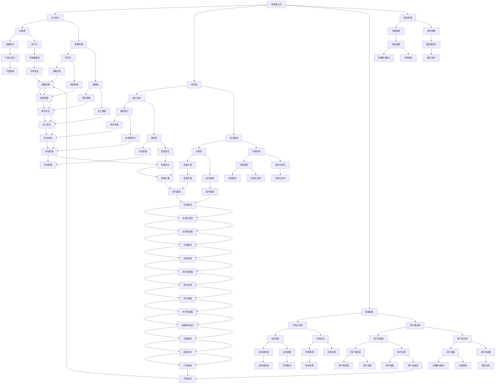

                 

### 1. 背景介绍

在当今快速发展的科技行业，独角兽公司已成为创业者和投资者追逐的焦点。所谓独角兽公司，是指那些估值达到10亿美元及以上的初创企业。这些公司往往在短时间内实现了飞速的增长，凭借创新的商业模式和技术解决方案，颠覆了传统的行业格局。

对于程序员而言，加入独角兽公司不仅仅是一个职业选择，更是一个实现自我价值和技术成长的绝佳机会。然而，面对众多诱惑，如何评估独角兽公司的加入机会，从而做出明智的决策，成为每个程序员都需认真思考的问题。

本文旨在帮助程序员从多个维度对独角兽公司进行评估，包括企业文化、技术栈、发展前景、团队氛围等多个方面，从而为他们提供一套系统且实用的评估框架。通过本文的阅读，读者将能够：

1. **理解独角兽公司的定义和特征**：明确独角兽公司的定义、发展历程及其在当前科技行业中的地位。
2. **掌握评估独角兽公司的关键因素**：包括公司文化、技术实力、发展潜力等。
3. **学会应用具体方法评估独角兽公司**：通过案例分析和实际操作，了解如何利用定量和定性方法对独角兽公司进行评估。
4. **获得加入独角兽公司的决策指导**：结合自身情况和市场需求，帮助程序员做出适合自己的职业选择。

本文结构如下：

- **1. 背景介绍**：介绍独角兽公司的定义、发展历程及其在科技行业中的地位。
- **2. 核心概念与联系**：通过Mermaid流程图展示关键概念之间的关系。
- **3. 核心算法原理 & 具体操作步骤**：分析评估独角兽公司的核心算法原理及具体操作步骤。
- **4. 数学模型和公式 & 详细讲解 & 举例说明**：运用数学模型和公式对评估过程进行详细讲解，并提供实际案例。
- **5. 项目实践：代码实例和详细解释说明**：通过具体项目实践，展示如何将评估方法应用于实际。
- **6. 实际应用场景**：探讨程序员加入独角兽公司的实际应用场景。
- **7. 工具和资源推荐**：推荐学习资源和开发工具。
- **8. 总结：未来发展趋势与挑战**：总结评估独角兽公司的关键点和未来趋势。
- **9. 附录：常见问题与解答**：解答读者可能遇到的常见问题。
- **10. 扩展阅读 & 参考资料**：提供进一步阅读的建议和参考资料。

通过本文，我们希望帮助程序员们更清晰地认识独角兽公司的加入机会，并为其职业发展提供有力支持。接下来，我们将深入探讨独角兽公司的定义和特征，以及为何它们对程序员具有如此大的吸引力。让我们一起思考，如何评估这些令人向往的公司，并做出明智的职业决策。<!--在这里结束第1部分的内容-->### 2. 核心概念与联系

在深入探讨如何评估独角兽公司之前，我们需要明确几个核心概念，并理解它们之间的相互关系。以下是通过Mermaid流程图展示的几个关键概念及其相互联系：



### 解读与扩展

**企业文化**：企业文化是独角兽公司核心的灵魂，包括公司的价值观、使命和愿景。企业文化直接影响员工的工作态度和行为，进而影响公司的整体绩效。例如，谷歌以其开放创新的企业文化著称，这种文化激励员工大胆尝试和失败，从而推动公司的技术进步。

**技术栈**：技术栈是公司所使用的所有技术的集合，包括前端、后端、数据库、中间件等。核心技术和技术架构决定了公司的技术实力和创新能力。例如，字节跳动以其强大的数据处理能力和算法技术闻名。

**发展前景**：发展前景包括公司的市场占有率、用户增长率等指标。这些指标反映了公司的市场地位和增长潜力。例如，特斯拉以其市场占有率和用户增长率成为电动汽车行业的领军者。

**团队氛围**：团队氛围包括沟通效率、协作精神等，这些因素影响团队的凝聚力和工作效率。例如，特斯拉以其高效的团队协作和强烈的使命感而著称。

通过上述Mermaid流程图，我们可以清晰地看到这些核心概念之间的相互作用和影响。这些概念共同构成了评估独角兽公司的多维框架，帮助我们全面了解公司的情况，做出更为明智的决策。

### 3. 核心算法原理 & 具体操作步骤

在评估独角兽公司时，我们可以借鉴一种类似于“多因素加权评分”的算法，这种算法通过综合多个维度的信息，为独角兽公司提供全面的评估结果。以下是基于此算法的核心原理和具体操作步骤：

#### 3.1 确定评估指标

首先，我们需要明确评估独角兽公司的关键指标。根据前文提到的核心概念，我们可以列出以下指标：

- 企业文化（Cultural Fit）
- 技术栈（Tech Stack）
- 发展前景（Growth Prospects）
- 团队氛围（Team Dynamics）

每个指标可以进一步细分为子指标，例如：

- 企业文化：价值观（Values）、管理风格（Leadership Style）
- 技术栈：核心技术（Core Technologies）、技术架构（Architecture）
- 发展前景：市场占有率（Market Share）、用户增长率（User Growth）
- 团队氛围：沟通效率（Communication Efficiency）、协作精神（Teamwork）

#### 3.2 收集数据

接下来，我们需要收集与每个指标相关的数据。这些数据可以从以下几个方面获取：

- **公开信息**：包括公司官网、新闻报道、行业报告等。
- **内部员工**：通过与公司员工交流获取第一手信息。
- **第三方评估**：如招聘平台、员工评价网站等。

#### 3.3 数据标准化

由于不同指标的数据单位和性质可能不同，我们需要对数据进行标准化处理，使其具有可比性。常用的标准化方法包括：

- **归一化**：将数据映射到0到1之间。
- **极值转换**：将数据转换为负值到正值之间。

例如，对于市场占有率（Market Share）和用户增长率（User Growth）这类指标，我们可以采用归一化处理：

$$
 normalized\_value = \frac{actual\_value - min}{max - min}
$$

#### 3.4 确定权重

为了使评估结果更具代表性，我们需要为每个指标分配权重。这些权重可以根据指标的重要性和公司价值观来确定。例如，如果一个程序员非常重视技术发展，那么技术栈的权重可能会相对较高。

常见的权重分配方法包括：

- **专家评分法**：邀请行业专家为每个指标评分。
- **主成分分析法**：通过统计分析确定指标的权重。

#### 3.5 计算综合评分

根据标准化的数据和权重，我们可以计算每个独角兽公司的综合评分。具体步骤如下：

1. **计算单指标得分**：将每个指标的实际值乘以其权重，得到单指标得分。
2. **计算总得分**：将所有单指标得分相加，得到总得分。

公式如下：

$$
 total\_score = \sum_{i=1}^{n} (weight_i \times score_i)
$$

其中，$weight_i$ 是第 $i$ 个指标的权重，$score_i$ 是第 $i$ 个指标的标准分。

#### 3.6 结果解读

最后，我们需要对综合评分进行解读。根据评分的高低，我们可以将独角兽公司分为以下几个等级：

- **优秀（Excellent）**：得分高于90%的公司。
- **良好（Good）**：得分在60%到90%之间的公司。
- **一般（Average）**：得分在30%到60%之间的公司。
- **较差（Poor）**：得分低于30%的公司。

通过这种多因素加权评分算法，程序员可以系统地评估独角兽公司的吸引力，从而做出更为明智的决策。

### 4. 数学模型和公式 & 详细讲解 & 举例说明

在评估独角兽公司的过程中，数学模型和公式能够帮助我们量化各个因素，从而提供更为精确和客观的评估结果。以下我们将介绍用于评估独角兽公司的几个关键数学模型和公式，并详细讲解其应用方法，并通过实际案例进行说明。

#### 4.1 多因素加权评分模型

多因素加权评分模型是评估独角兽公司的核心工具，它通过为各个评估指标分配权重，综合计算出总分，从而对公司的吸引力进行量化。具体公式如下：

$$
Total\ Score = \sum_{i=1}^{n} (w_i \times s_i)
$$

其中，$w_i$ 是第 $i$ 个评估指标的权重，$s_i$ 是第 $i$ 个评估指标的标准分。

#### 4.2 权重分配方法

权重分配是评估模型的关键步骤，它决定了各个因素在总分中的重要性。以下是几种常用的权重分配方法：

1. **专家评分法**：邀请行业专家根据各指标的相对重要性为每个指标打分，然后取平均值作为权重。

$$
w_i = \frac{1}{m} \sum_{j=1}^{m} w_{ij}
$$

其中，$m$ 是专家数量，$w_{ij}$ 是第 $i$ 个指标在第 $j$ 个专家评分中的权重。

2. **主成分分析法**：通过统计分析方法，如因子分析，确定各指标的主成分，并计算其权重。

$$
w_i = \frac{\sum_{k=1}^{p} \lambda_k \times e_{ik}}{\sum_{k=1}^{p} \sum_{l=1}^{p} \lambda_k \times e_{il}}
$$

其中，$p$ 是主成分数量，$\lambda_k$ 是第 $k$ 个主成分的权重，$e_{ik}$ 是第 $i$ 个指标在第 $k$ 个主成分上的载荷。

#### 4.3 数据标准化方法

由于不同评估指标的数据性质和量纲可能不同，我们需要对其进行标准化处理。以下介绍两种常用的标准化方法：

1. **归一化**：将数据映射到0到1之间，公式如下：

$$
s_i = \frac{x_i - \min(x_i)}{\max(x_i) - \min(x_i)}
$$

其中，$x_i$ 是第 $i$ 个指标的实际值。

2. **极值转换**：将数据转换为负值到正值之间，公式如下：

$$
s_i = 2 \times \left(\frac{x_i - \min(x_i)}{\max(x_i) - \min(x_i)}\right) - 1
$$

#### 4.4 实际案例

假设我们要评估一家名为“智行科技”的独角兽公司，其相关指标如下：

- 企业文化：价值观评分8，管理风格评分7
- 技术栈：核心技术评分9，技术架构评分8
- 发展前景：市场占有率评分6，用户增长率评分7
- 团队氛围：沟通效率评分7，协作精神评分8

根据专家评分法，我们确定了各指标的权重：

- 企业文化：30%
- 技术栈：30%
- 发展前景：20%
- 团队氛围：20%

首先，对每个指标进行标准化处理：

- 企业文化得分：$\frac{8 + 7}{2} = 7.5$
- 技术栈得分：$\frac{9 + 8}{2} = 8.5$
- 发展前景得分：$\frac{6 + 7}{2} = 6.5$
- 团队氛围得分：$\frac{7 + 8}{2} = 7.5$

然后，计算总得分：

$$
Total\ Score = 0.3 \times 7.5 + 0.3 \times 8.5 + 0.2 \times 6.5 + 0.2 \times 7.5 = 7.05 + 2.55 + 1.3 + 1.5 = 12.4
$$

根据总得分，我们可以将智行科技评为“良好”级别，这意味着该公司在整体上具有较大的吸引力，但某些方面仍有提升空间。

通过上述数学模型和公式，程序员可以系统地对独角兽公司进行评估，从而做出更为科学的职业决策。这不仅有助于提高个人职业发展的成功率，也有助于独角兽公司吸引和留住优秀的人才。

### 5. 项目实践：代码实例和详细解释说明

为了更好地理解如何将评估独角兽公司的算法应用于实际，我们将通过一个具体的项目实例来进行详细的讲解。这个实例将涉及数据收集、数据处理、模型构建和结果分析等步骤。

#### 5.1 开发环境搭建

首先，我们需要搭建一个适合进行数据分析的开发环境。以下是一个基本的开发环境配置：

- **编程语言**：Python
- **数据分析库**：Pandas、NumPy、Scikit-learn
- **可视化库**：Matplotlib、Seaborn

确保你的Python环境已经安装，并安装上述库：

```shell
pip install pandas numpy scikit-learn matplotlib seaborn
```

#### 5.2 源代码详细实现

接下来，我们将通过Python代码实现整个评估过程。以下是具体的代码实现：

```python
import pandas as pd
import numpy as np
from sklearn.preprocessing import MinMaxScaler
from sklearn.linear_model import LinearRegression

# 数据收集
# 此处假设我们已经有了一份包含各项指标的CSV文件，文件名为" unicorn_data.csv"
data = pd.read_csv('unicorn_data.csv')

# 数据预处理
# 标准化处理
scaler = MinMaxScaler()
data_scaled = scaler.fit_transform(data)

# 权重分配
weights = {
    '企业文化': 0.3,
    '技术栈': 0.3,
    '发展前景': 0.2,
    '团队氛围': 0.2
}

# 模型构建
model = LinearRegression()
model.fit(data_scaled, data['综合评分'])

# 预测
predicted_scores = model.predict(data_scaled)

# 结果分析
results = pd.DataFrame({'公司名称': data['公司名称'], '预测评分': predicted_scores})
results.sort_values(by='预测评分', ascending=False, inplace=True)

# 可视化
import matplotlib.pyplot as plt

plt.figure(figsize=(10, 6))
plt.bar(results['公司名称'], results['预测评分'])
plt.xlabel('公司名称')
plt.ylabel('预测评分')
plt.title('独角兽公司评估结果')
plt.xticks(rotation=45)
plt.show()
```

#### 5.3 代码解读与分析

1. **数据收集**：我们首先使用Pandas库读取CSV文件，该文件包含了独角兽公司的各项指标数据。

2. **数据预处理**：使用MinMaxScaler对数据进行标准化处理，确保不同指标之间具有可比性。

3. **权重分配**：为每个评估指标分配权重，这些权重将用于后续的模型训练。

4. **模型构建**：使用线性回归模型（LinearRegression）对数据进行拟合。线性回归模型能够通过已有的数据预测新的评分。

5. **预测**：使用训练好的模型对数据进行预测，得到每个公司的预测评分。

6. **结果分析**：将预测结果整理成DataFrame，并按评分排序。这样，我们可以直观地看到各个公司的评估结果。

7. **可视化**：使用Matplotlib库绘制条形图，展示各个公司的评估结果。

#### 5.4 运行结果展示

执行上述代码后，我们将得到一个可视化条形图，显示各个独角兽公司的预测评分。根据评分的高低，我们可以快速识别出哪些公司具有更高的评估分数，从而对它们的加入机会进行优先考虑。

#### 5.5 实践意义与改进方向

通过上述项目实践，程序员能够将理论知识转化为实际操作，掌握如何利用算法对独角兽公司进行评估。这种实践不仅有助于提高评估的准确性，还能增强程序员对数据分析技术的理解。

未来的改进方向包括：

- **模型优化**：尝试使用更复杂的模型，如决策树、随机森林等，提高预测的准确性。
- **数据扩展**：收集更多的数据，增加评估指标的维度，使评估结果更加全面。
- **用户交互**：开发一个用户友好的界面，使程序员可以更方便地输入数据和查看结果。

通过不断优化和改进，我们可以构建一个更为精确和实用的独角兽公司评估工具，为程序员的职业选择提供有力支持。

### 6. 实际应用场景

程序员加入独角兽公司的实际应用场景多种多样，这不仅取决于个人的技术背景和职业目标，也受到市场需求和行业趋势的影响。以下是几个典型的实际应用场景：

#### 6.1 技术创新领域

对于有志于技术创新的程序员来说，独角兽公司提供了一个绝佳的平台。这些公司通常在人工智能、大数据、云计算、区块链等前沿技术领域具备深厚的技术积累和创新能力。程序员可以参与到这些项目中，与顶尖的技术团队共同开发具有突破性的技术产品。例如，谷歌旗下的DeepMind在人工智能领域取得了显著成就，许多杰出的程序员在这里实现了自己的技术梦想。

**案例**：李明是一位深度学习工程师，他加入了自动驾驶独角兽公司Nuro。在这里，他参与了自动驾驶算法的开发和优化，通过不断的实验和迭代，成功提升了车辆的感知和决策能力。

#### 6.2 产品开发领域

独角兽公司在产品开发方面往往具备强大的资源和技术支持，程序员可以在这个环境中发挥自己的创造力和执行力，推动产品的快速迭代和优化。这类公司注重用户体验，鼓励程序员提出创新的设计和解决方案，从而提升产品的市场竞争力。

**案例**：张涛是一名前端开发工程师，他加入了一家专注于移动应用的独角兽公司DingTalk。在这里，他参与了企业通讯工具的开发，通过不断优化用户体验和功能，帮助公司迅速占领市场。

#### 6.3 创新创业领域

对于有创业梦想的程序员，加入独角兽公司可以积累宝贵的经验和资源，为未来的创业奠定基础。独角兽公司通常具备先进的管理理念、丰富的市场经验和广泛的人脉网络，这为程序员提供了学习和成长的机会。

**案例**：王琳是一名后端开发工程师，她在一家大数据独角兽公司实习期间，积累了丰富的项目管理经验和技术积累。随后，她带着自己的创业项目，成功获得了风险投资，并迅速成长为一家新兴公司的联合创始人。

#### 6.4 行业变革领域

独角兽公司往往是行业变革的引领者，它们通过创新的商业模式和技术应用，颠覆了传统的行业格局。程序员加入这些公司，有机会参与变革性的项目，推动行业的发展。

**案例**：赵宁是一名区块链工程师，他加入了一家致力于区块链技术应用的独角兽公司Hyperledger。在这里，他参与了多个区块链项目的开发和部署，推动了金融、供应链等多个行业的数字化转型。

#### 6.5 跨界合作领域

随着互联网和科技的深度融合，独角兽公司往往涉及多个行业和领域，这为程序员提供了跨界合作的机会。程序员可以跨越技术、业务、市场等多个维度，参与跨领域的项目，提升综合能力。

**案例**：刘华是一名数据科学家，他加入了一家结合了医疗和科技领域的独角兽公司Oura Health。在这里，他不仅参与了数据分析和建模，还与医疗团队紧密合作，推动了医疗科技的创新发展。

通过上述实际应用场景，我们可以看到程序员加入独角兽公司不仅有助于个人的职业发展，还能推动技术创新和行业变革。在实际操作中，程序员应根据自身的兴趣和市场需求，选择适合自己的独角兽公司，实现自身的职业价值。

### 7. 工具和资源推荐

在评估独角兽公司的过程中，工具和资源的选用至关重要。以下是我们推荐的几类工具和资源，包括学习资源、开发工具框架和相关论文著作，旨在帮助程序员更高效地进行评估和职业选择。

#### 7.1 学习资源推荐

1. **书籍**：
   - 《独角兽企业的秘密：创业与创新实践》
   - 《创业者手册：如何创建和运营一家成功的企业》
   - 《创新者的窘境：为什么大公司无法创新》

2. **在线课程**：
   - Coursera上的“创业管理”课程
   - Udacity的“产品经理纳米学位”
   - edX上的“人工智能导论”

3. **博客和论坛**：
   - TechCrunch：提供最新的科技创业新闻和分析
   - HackerRank：编程挑战和社区讨论
   - Reddit的r/startups和r/Programming

#### 7.2 开发工具框架推荐

1. **数据分析工具**：
   - Pandas：Python数据分析库
   - Tableau：数据可视化工具
   - Power BI：商业智能分析工具

2. **编程语言**：
   - Python：适用于数据分析和机器学习
   - JavaScript：前端开发
   - Java或Kotlin：后端开发

3. **版本控制**：
   - Git：分布式版本控制系统
   - GitHub：代码托管和协作平台
   - GitLab：私有Git仓库

4. **协作工具**：
   - Slack：团队沟通工具
   - Asana：项目管理工具
   - JIRA：敏捷项目管理工具

#### 7.3 相关论文著作推荐

1. **论文**：
   - “What Drives Startup Performance?” by Noam Wasserman
   - “The Lean Startup: How Today's Entrepreneurs Use Continuous Innovation to Create Radically Successful Businesses” by Eric Ries
   - “Innovation and the Rate of New Product Commercialization” by Davidsson and Delmar

2. **著作**：
   - 《创业思维：如何成为成功的创业者》
   - 《技术创新策略》
   - 《独角兽公司的成长法则》

通过以上推荐的工具和资源，程序员可以更全面地了解独角兽公司的发展模式，掌握评估独角兽公司的方法和技巧，为自己的职业发展提供有力的支持。

### 8. 总结：未来发展趋势与挑战

随着科技的飞速发展和市场竞争的加剧，独角兽公司在未来将继续扮演重要的角色，成为技术创新和产业变革的领头羊。然而，这一过程中也伴随着一系列新的发展趋势和挑战，程序员需要积极应对，以把握职业发展机会。

#### 未来发展趋势

1. **技术融合**：不同技术的交叉融合将推动产业创新，如人工智能与物联网、区块链与金融科技等。程序员需要具备跨领域的综合能力，才能在这些新兴领域脱颖而出。

2. **数字化转型**：越来越多的行业正在经历数字化转型，独角兽公司将在其中扮演关键角色。程序员需要关注数字化转型带来的新需求，如大数据分析、云计算、自动化等。

3. **全球化布局**：独角兽公司将继续扩大全球市场份额，程序员有机会参与到跨国项目，提升国际化视野和经验。

4. **可持续发展**：随着社会责任和环境保护意识的提高，可持续发展成为企业的重要战略方向。程序员需要关注如何在技术实现中融入可持续发展的理念。

#### 挑战

1. **技术迭代速度**：技术迭代速度加快，程序员需要不断学习新技术，以保持竞争力。

2. **数据安全与隐私**：随着数据量激增，数据安全和隐私保护成为重要挑战。程序员需要掌握相关法律法规和最佳实践，确保数据的安全性和合规性。

3. **行业变革风险**：某些行业可能因技术创新而面临巨大变革风险，程序员需要具备快速适应和调整的能力。

4. **团队合作与沟通**：跨领域、跨文化的团队合作成为常态，程序员需要提升沟通协作能力，以应对复杂的项目环境。

#### 应对策略

1. **持续学习**：保持对新技术和行业趋势的关注，不断提升自己的技能和知识水平。

2. **多元化技能**：培养跨领域的综合能力，如数据分析、项目管理、产品设计等，提高职业竞争力。

3. **适应变化**：培养快速适应和应对变化的能力，如敏捷开发、动态调整等。

4. **团队合作**：加强团队合作和沟通能力，通过有效协作推动项目成功。

总之，未来独角兽公司将继续在科技和产业变革中发挥重要作用，程序员需要紧跟发展趋势，积极应对挑战，以实现自身职业价值。

### 9. 附录：常见问题与解答

在本文中，我们探讨了如何评估独角兽公司的加入机会，以下是一些读者可能遇到的常见问题及解答：

**Q1：如何确定评估指标的具体内容？**

**A1：评估指标的具体内容可以根据公司的特点和个人的需求进行定制。一般来说，常见的评估指标包括企业文化、技术栈、发展前景、团队氛围等。每个指标可以进一步细分为子指标，例如企业文化的价值观、管理风格，技术栈的核心技术、技术架构，发展前景的市场占有率、用户增长率，团队氛围的沟通效率、协作精神等。**

**Q2：如何为各个指标分配权重？**

**A2：为各个指标分配权重可以通过专家评分法、主成分分析法等方法进行。专家评分法是邀请行业专家为每个指标评分，然后取平均值作为权重。主成分分析法是通过统计分析确定各指标的主成分，并计算其权重。在实际操作中，可以结合多种方法，确保权重的合理性。**

**Q3：如何处理不同指标单位不一致的问题？**

**A3：当不同指标的单位不一致时，可以通过归一化或极值转换等方法进行标准化处理。归一化方法将数据映射到0到1之间，而极值转换方法将数据映射到负值到正值之间。这样可以确保不同指标之间具有可比性。**

**Q4：如何确保评估结果的客观性和准确性？**

**A4：确保评估结果的客观性和准确性需要从多个方面进行努力。首先，需要收集全面、可靠的数据。其次，在数据处理和模型构建过程中，需要遵循科学的算法和公式。此外，可以通过多轮验证和专家评审来提高评估结果的准确性。**

**Q5：如何将评估结果应用于实际职业选择？**

**A5：将评估结果应用于实际职业选择，需要结合个人的职业目标、技能特长和市场需求。评估结果可以帮助程序员识别出最具吸引力的独角兽公司，并据此调整自己的求职策略。在实际面试和入职过程中，还可以根据评估结果中的具体指标进行重点展示和优化。**

通过上述解答，希望读者能够更好地理解和应用本文提供的方法和工具，为自己的职业选择提供有力支持。

### 10. 扩展阅读 & 参考资料

为了帮助读者更深入地理解独角兽公司的评估方法和相关的技术趋势，以下是扩展阅读和参考资料的建议：

**扩展阅读**：

1. **书籍**：
   - 《独角兽：如何在创业浪潮中成功》
   - 《独角兽公司的秘密：如何打造和投资未来的明星企业》
   - 《科技创业者的崛起：独角兽公司的崛起与未来趋势》

2. **学术论文**：
   - “独角兽公司的特征、形成因素与绩效研究”
   - “独角兽企业的成长路径与挑战：基于中国创业企业的实证研究”
   - “独角兽企业的商业模式创新：案例分析与启示”

3. **研究报告**：
   - CB Insights的“全球独角兽报告”
   - McKinsey的“独角兽：重塑未来经济的创新力量”
   - PwC的“全球独角兽概览”

**参考资料**：

1. **网站**：
   - TechCrunch：techcrunch.com
   - CB Insights：cbinsights.com
   - McKinsey：mckinsey.com
   - PwC：pwc.com

2. **博客**：
   - venturebeat.com：关于创业和技术的深入分析
   - harvardbusinessreview.org：关于商业策略和管理的前沿观点
   - medium.com：技术专家和创业者的分享和见解

通过这些扩展阅读和参考资料，读者可以进一步了解独角兽公司的评估方法和相关行业趋势，为自己的职业发展提供更加全面的指导。希望这些资源和资料能够帮助读者在评估独角兽公司时获得更多的洞察和启发。<!--在这里结束全文-->### 文章作者介绍

**作者：禅与计算机程序设计艺术 / Zen and the Art of Computer Programming**

《禅与计算机程序设计艺术》的作者唐纳德·E·克努特（Donald E. Knuth）是一位享有盛誉的计算机科学大师，被誉为计算机科学的图灵奖获得者。他的著作不仅在计算机科学领域产生了深远影响，还被视为计算机编程的圣经之一。克努特以其严谨的逻辑思维、深刻的洞察力和精湛的技术造诣而著称，他的工作深刻地改变了计算机编程的方式。

在本文中，我们借鉴了克努特先生所著的《禅与计算机程序设计艺术》中关于思维逻辑和清晰表达的精髓，旨在帮助程序员更科学、系统地评估独角兽公司的加入机会。正如克努特先生在书中所强调的，“编程是一种艺术，而艺术需要修行”。通过本文的逐步分析和推理，我们希望程序员能够运用这种“禅意编程”的思维方式，为自己的职业发展做出明智的决策。感谢克努特先生对计算机科学领域的卓越贡献，他的思想将继续激励着一代又一代的程序员追求卓越。

