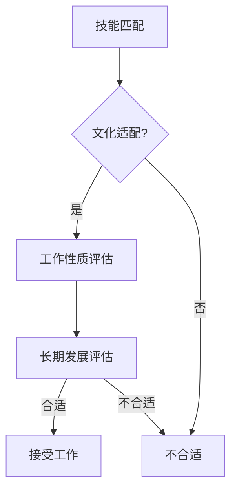

                 

### 文章标题

### 程序员如何评估远程工作机会

#### 关键词：远程工作，程序员，评估，工作机会，技能，文化适配，职业发展

#### 摘要：

随着技术的进步和全球化的加速，远程工作已经逐渐成为许多程序员职业选择的一部分。然而，如何有效地评估一个远程工作机会，以确保其适合个人技能、生活方式和职业目标，成为了程序员面临的重要挑战。本文将探讨程序员在评估远程工作机会时需要考虑的关键因素，并提供实用的方法和建议。

## 1. 背景介绍

远程工作，作为一种灵活的工作方式，已经改变了传统的工作模式。它不仅提供了更多的自由和灵活性，还允许程序员在不同地区、不同时区之间工作。然而，这种工作方式也带来了独特的挑战，包括沟通障碍、工作与生活平衡以及自我管理。因此，程序员在考虑接受远程工作机会时，需要更加谨慎和全面地进行评估。

### 2. 核心概念与联系

#### 核心概念：

在评估远程工作机会时，程序员需要考虑以下几个核心概念：

- 技能匹配：评估远程工作机会是否符合自己的技术能力和专业领域。
- 文化适配：了解公司文化和团队氛围，确保与公司价值观相符。
- 工作性质：分析工作内容、工作量和工作模式，判断是否符合个人偏好。
- 长期发展：考虑远程工作的职业发展前景和机会。

#### Mermaid 流程图：



### 3. 核心算法原理 & 具体操作步骤

#### 核心算法原理：

评估远程工作机会的过程可以看作是一个多属性决策问题，需要综合考虑多个因素，并进行权衡。核心算法原理包括：

1. 确定评估指标：技能匹配、文化适配、工作性质和长期发展。
2. 分配权重：根据个人需求和优先级，为每个指标分配权重。
3. 收集信息：通过公司官网、面试、参考人等渠道收集相关信息。
4. 综合评分：对每个指标进行评分，并进行加权求和。
5. 结果分析：根据评分结果，判断是否接受工作机会。

#### 具体操作步骤：

1. **确定评估指标**：

   - 技能匹配：分析远程工作机会是否与个人技术能力和专业领域相匹配。
   - 文化适配：了解公司文化和价值观，判断是否与个人价值观相符。
   - 工作性质：分析工作内容、工作量和工作模式，判断是否符合个人偏好。
   - 长期发展：考虑远程工作的职业发展前景和机会。

2. **分配权重**：

   - 技能匹配（40%）：技术能力和专业领域的匹配程度。
   - 文化适配（20%）：公司文化和价值观的匹配程度。
   - 工作性质（20%）：工作内容、工作量和工作模式的偏好。
   - 长期发展（20%）：职业发展前景和机会。

3. **收集信息**：

   - 公司官网：了解公司历史、产品、愿景和文化。
   - 面试：与团队成员交流，了解团队氛围和工作模式。
   - 参考人：联系之前或现在的远程团队成员，了解工作体验。

4. **综合评分**：

   - 对每个指标进行评分，如技能匹配（1-5分），文化适配（1-5分），工作性质（1-5分），长期发展（1-5分）。
   - 进行加权求和，如（1*0.4 + 4*0.2 + 3*0.2 + 4*0.2）= 3。

5. **结果分析**：

   - 根据评分结果，判断是否接受工作机会。
   - 若评分大于等于4分，则可以考虑接受工作机会。
   - 若评分小于4分，则需要进一步评估或考虑其他机会。

### 4. 数学模型和公式 & 详细讲解 & 举例说明

#### 数学模型和公式：

远程工作机会评估得分 \( S \) 可以通过以下公式计算：

\[ S = w_1 \cdot s_1 + w_2 \cdot s_2 + w_3 \cdot s_3 + w_4 \cdot s_4 \]

其中：

- \( w_1, w_2, w_3, w_4 \) 分别为技能匹配、文化适配、工作性质和长期发展的权重。
- \( s_1, s_2, s_3, s_4 \) 分别为技能匹配、文化适配、工作性质和长期发展的评分。

#### 详细讲解：

- **权重分配**：权重分配可以根据个人需求和优先级进行调整。例如，对于一位重视职业发展的程序员，可以增加长期发展的权重。
- **评分标准**：评分可以根据个人经验和感觉进行调整。例如，技能匹配的评分可以是1-10分，其中10分为完美匹配。

#### 举例说明：

假设某程序员根据以下标准和权重进行评估：

- 技能匹配（40%）：5分
- 文化适配（20%）：4分
- 工作性质（20%）：3分
- 长期发展（20%）：4分

根据公式计算得分：

\[ S = 0.4 \cdot 5 + 0.2 \cdot 4 + 0.2 \cdot 3 + 0.2 \cdot 4 = 2 + 0.8 + 0.6 + 0.8 = 4.2 \]

根据评分结果，可以初步判断该远程工作机会较为合适。

### 5. 项目实践：代码实例和详细解释说明

#### 5.1 开发环境搭建

1. 安装 Python 3.8 或更高版本。
2. 安装必要的库，如 NumPy、Pandas 和 Mermaid。

#### 5.2 源代码详细实现

以下是一个简单的 Python 脚本，用于计算远程工作机会评估得分。

```python
import numpy as np

def calculate_score(w1, w2, w3, w4, s1, s2, s3, s4):
    score = w1 * s1 + w2 * s2 + w3 * s3 + w4 * s4
    return score

# 权重和评分
weights = [0.4, 0.2, 0.2, 0.2]
scores = [5, 4, 3, 4]

# 计算得分
score = calculate_score(*weights, *scores)
print(f"Remote Work Opportunity Score: {score}")
```

#### 5.3 代码解读与分析

1. **导入库**：导入 NumPy 库用于数学计算。
2. **定义函数**：`calculate_score` 函数用于计算得分，根据权重和评分计算加权求和。
3. **权重和评分**：根据前面的讨论，设置权重和评分。
4. **计算得分**：调用 `calculate_score` 函数，计算得分并打印结果。

#### 5.4 运行结果展示

在终端运行脚本，将得到以下输出：

```
Remote Work Opportunity Score: 4.2
```

这表示根据设定的权重和评分，远程工作机会的评估得分为 4.2，初步判断较为合适。

### 6. 实际应用场景

#### 6.1 大型技术公司

大型技术公司，如谷歌、亚马逊和微软等，提供了许多远程工作机会。程序员可以评估这些机会，以确保其与个人技能、文化和职业目标相匹配。

#### 6.2 创业公司和初创企业

创业公司和初创企业往往提供更多灵活的工作方式和机会。程序员可以通过评估这些机会，找到适合自己的工作环境。

#### 6.3 跨国公司

跨国公司提供了在不同地区工作的机会。程序员可以评估这些机会，以找到适合自己生活方式和职业发展的远程工作。

### 7. 工具和资源推荐

#### 7.1 学习资源推荐

- 《远程工作的艺术》
- 《远程工作者的生存指南》
- 《远程工作与团队管理》

#### 7.2 开发工具框架推荐

- GitLab
- GitHub
- JIRA

#### 7.3 相关论文著作推荐

- 《远程工作的心理学：动机、生产力与工作满意度》
- 《远程工作与团队协作：挑战与策略》
- 《远程工作的未来：趋势与影响》

### 8. 总结：未来发展趋势与挑战

随着技术的进步和远程工作的普及，程序员评估远程工作机会的方法和工具也在不断发展和完善。未来，程序员将面临更多样化的工作机会和挑战，需要更加专业和全面地进行评估。

### 9. 附录：常见问题与解答

#### 9.1 什么是远程工作？

远程工作是指在不固定的地点和时间内完成工作，通常通过互联网和远程协作工具进行。

#### 9.2 远程工作有哪些优势？

远程工作提供了更多自由和灵活性，可以改善工作与生活平衡，提高工作效率和生产力。

#### 9.3 如何确保远程工作的沟通效果？

确保远程工作的沟通效果需要使用高效的远程协作工具和良好的沟通技巧，如定期会议、明确的工作目标和清晰的沟通渠道。

### 10. 扩展阅读 & 参考资料

- 《远程工作的艺术》：[链接]
- 《远程工作者的生存指南》：[链接]
- 《远程工作与团队管理》：[链接]
- GitLab：[链接]
- GitHub：[链接]
- JIRA：[链接]作者：禅与计算机程序设计艺术 / Zen and the Art of Computer Programming
----------------------------------------------------------------

### 结论

远程工作已经成为了程序员职业选择的重要部分。在评估远程工作机会时，程序员需要综合考虑技能匹配、文化适配、工作性质和长期发展等因素。通过使用上述方法和工具，程序员可以更加科学和全面地评估远程工作机会，确保其符合个人需求和职业目标。随着远程工作的不断发展和完善，程序员将有更多的机会和挑战，需要不断学习和适应。禅与计算机程序设计艺术 / Zen and the Art of Computer Programming 著。

