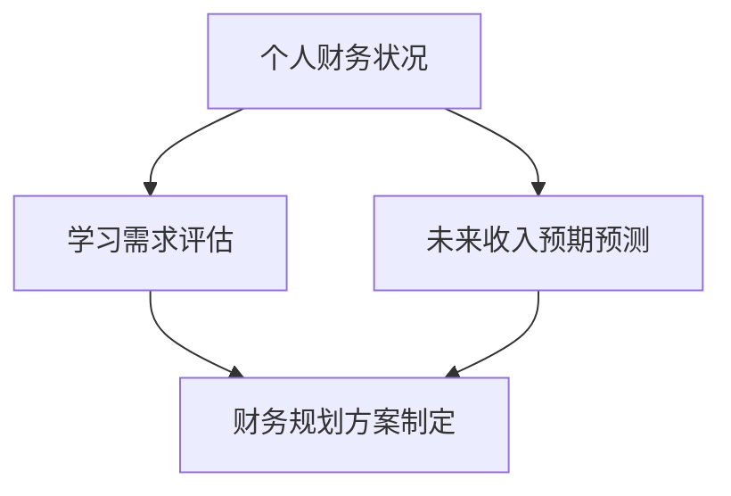

                 

### 背景介绍

在信息技术迅猛发展的今天，知识付费已经成为了一种流行的商业模式。对于程序员而言，通过付费学习新的编程语言、框架、工具和技术，无疑是一种提升自身技能的有效途径。然而，如何进行合理的财务规划，以最大化知识的投资回报，成为了许多程序员面临的重要问题。

财务规划不仅仅是简单的储蓄和投资，它涉及到对个人财务状况的全面分析、对学习需求的准确评估以及对未来收入预期的合理预测。程序员进行知识付费的财务规划，需要从以下几个方面入手：

首先，了解个人财务状况是基础。这包括了解自己的收入水平、支出情况、储蓄能力以及债务状况。只有全面了解自己的财务状况，才能制定出切实可行的财务规划方案。

其次，评估学习需求至关重要。程序员需要根据自己的职业发展目标、技术栈现状以及对新兴技术的需求，确定需要学习的知识内容。在这个过程中，应避免盲目跟风，而是要有的放矢，确保每一笔知识付费都能带来实际的价值。

再次，合理预测未来收入预期是关键。财务规划不仅要考虑当前的经济状况，还要对未来的收入增长进行合理的预测。这样，程序员才能在确保日常生活质量的同时，为知识付费留出足够的资金。

最后，制定具体的财务规划方案并严格执行。这包括设定学习预算、制定储蓄计划、合理安排支出，以及设定明确的投资目标等。

本文将围绕程序员如何进行知识付费的财务规划，从以上四个方面展开详细讨论，旨在帮助程序员更好地管理自己的财务，实现知识付费的最大化收益。

### 核心概念与联系

在进行程序员知识付费的财务规划之前，我们需要理解一些核心概念，它们构成了这一规划的基石。以下是几个关键概念及其相互联系：

#### 个人财务状况分析

**定义**：个人财务状况是指一个人的收入、支出、储蓄和债务情况。

**联系**：了解个人财务状况是制定财务规划的基础。只有清楚地知道自己的财务状况，程序员才能判断是否有足够的资金用于知识付费。

#### 学习需求评估

**定义**：学习需求评估是指根据职业目标和技能现状，对需要学习的知识和技能进行判断和排序。

**联系**：准确的学习需求评估能够帮助程序员确定哪些知识付费是必要的，从而避免资源的浪费。

#### 未来收入预期预测

**定义**：未来收入预期预测是对未来可能的收入水平进行合理的估算。

**联系**：合理的未来收入预期预测有助于程序员在财务规划中预留足够的学习预算，同时也可以避免因预期过高或过低导致的财务压力。

#### 财务规划方案制定

**定义**：财务规划方案是指根据个人财务状况、学习需求和未来收入预期，制定的详细财务计划。

**联系**：财务规划方案是实现知识付费目标的具体步骤和策略，它将个人财务状况、学习需求和未来收入预期有机地结合起来。

为了更好地理解这些核心概念之间的联系，我们可以使用Mermaid流程图来展示它们的关系：



在这个流程图中，我们可以看到：

- **个人财务状况**作为起点，直接影响到**学习需求评估**，因为只有了解自己的财务状况，才能合理评估需要学习的知识和技能。
- **学习需求评估**进一步影响到**财务规划方案制定**，因为评估结果将决定哪些知识需要付费学习。
- **未来收入预期预测**则与**财务规划方案制定**密切相关，因为它决定了程序员在财务规划中可以预留多少资金用于知识付费。

通过理解这些核心概念及其相互联系，程序员可以更加系统地制定自己的财务规划方案，从而在知识付费的道路上走得更远。

#### 核心算法原理 & 具体操作步骤

在了解了核心概念之后，接下来我们需要探讨如何具体实施程序员的知识付费财务规划。这个过程可以被视为一个优化算法，目的是在有限的财务资源下，最大化知识付费的回报。以下是该算法的原理和操作步骤：

##### 原理

1. **目标函数**：最大化知识付费的回报，即最大化学习成果对职业发展的贡献。
2. **约束条件**：个人财务状况、学习需求、时间限制等。
3. **变量**：知识付费的项目、金额、时间等。

##### 操作步骤

1. **步骤1：分析个人财务状况**

   - **收入分析**：计算每月、每季度的总收入，包括工资、奖金、兼职收入等。
   - **支出分析**：详细记录每月、每季度的支出，包括生活费用、房租、水电费、交通费、储蓄等。
   - **储蓄计算**：根据收入和支出，计算每月、每年的储蓄额。

2. **步骤2：评估学习需求**

   - **职业发展目标**：明确自己的职业规划，确定需要学习哪些知识和技能。
   - **技能现状**：评估当前掌握的技能水平，找出差距和不足。
   - **新兴技术需求**：了解行业发展趋势，确定哪些新兴技术值得学习。

3. **步骤3：预测未来收入**

   - **收入增长因素**：分析可能的收入增长因素，如晋升、加薪、技能提升等。
   - **风险因素**：考虑可能的收入波动，如裁员、行业变动等。
   - **预测方法**：使用统计方法或历史数据分析，预测未来的收入水平。

4. **步骤4：制定财务规划方案**

   - **学习预算**：根据储蓄额和未来收入预测，设定每月、每年的学习预算。
   - **优先级排序**：根据学习需求和财务状况，对需要学习的知识进行优先级排序。
   - **投资策略**：选择合适的知识付费项目，如在线课程、工作坊、专业认证等。

5. **步骤5：实施和监控**

   - **实施**：按照规划方案，进行知识付费投资。
   - **监控**：定期检查财务状况和学习进度，调整规划方案以适应实际情况。

##### 数学模型和公式

为了更精确地制定财务规划方案，我们可以使用数学模型来描述上述步骤。以下是几个关键的数学公式：

1. **储蓄额计算公式**：

   $$储蓄额 = 收入 - 支出$$

2. **学习预算计算公式**：

   $$学习预算 = 储蓄额 \times (1 + 预期收入增长率)$$

3. **知识付费项目的回报率计算公式**：

   $$回报率 = (学习成果对职业发展的贡献 / 知识付费成本) \times 100\%$$

通过上述公式，我们可以量化个人财务状况、学习需求和未来收入预期，从而制定出更具科学性和可操作性的财务规划方案。

#### 数学模型和公式 & 详细讲解 & 举例说明

在上一节中，我们介绍了如何通过数学模型和公式来量化程序员的知识付费财务规划。接下来，我们将对这些公式进行详细讲解，并通过具体例子来说明如何应用这些公式。

##### 储蓄额计算公式

$$储蓄额 = 收入 - 支出$$

这个公式非常直观，表示一个人的储蓄额等于其收入减去支出。对于程序员来说，每月的储蓄额可以帮助他们确定可用于知识付费的金额。

**例子**：

假设一位程序员的月收入为 10000 元，每月固定支出为 8000 元，那么他的月储蓄额为：

$$储蓄额 = 10000 - 8000 = 2000 \text{元}$$

##### 学习预算计算公式

$$学习预算 = 储蓄额 \times (1 + 预期收入增长率)$$

这个公式考虑了未来收入的增长，以确保程序员在知识付费时有足够的资金。预期收入增长率可以根据历史数据或行业趋势来预测。

**例子**：

假设上述程序员的预期收入增长率为 5%，那么他的月学习预算为：

$$学习预算 = 2000 \times (1 + 0.05) = 2100 \text{元}$$

##### 知识付费项目的回报率计算公式

$$回报率 = (学习成果对职业发展的贡献 / 知识付费成本) \times 100\%$$

这个公式用于评估知识付费项目的性价比。通过计算回报率，程序员可以判断哪些知识付费项目是值得投资的。

**例子**：

假设一位程序员参加了一门价值 2000 元的在线课程，课程内容帮助他在工作中提高了效率，使得每月节省了 500 元的加班费。那么这门课程的回报率为：

$$回报率 = (500 / 2000) \times 100\% = 25\%$$

这意味着每投入 1 元，可以获得 0.25 元的回报，这是一个较高的回报率。

通过上述例子，我们可以看到如何使用数学模型和公式来制定和评估程序员的知识付费财务规划。这些公式不仅提供了量化的手段，也为决策提供了科学依据。

#### 项目实践：代码实例和详细解释说明

为了更好地理解和应用上述财务规划模型，我们将通过一个具体的代码实例来演示如何实现这一规划。在此，我们将使用Python编写一个简单的财务规划脚本，并对代码进行详细解释。

##### 开发环境搭建

首先，我们需要搭建一个简单的Python开发环境。以下是搭建步骤：

1. **安装Python**：从Python官方网站（https://www.python.org/downloads/）下载并安装Python。
2. **安装Jupyter Notebook**：打开终端，执行以下命令安装Jupyter Notebook：

   ```bash
   pip install notebook
   ```

3. **启动Jupyter Notebook**：在终端中执行以下命令：

   ```bash
   jupyter notebook
   ```

这将在浏览器中打开Jupyter Notebook，我们将在其中编写和运行代码。

##### 源代码详细实现

以下是实现财务规划模型的Python代码：

```python
import pandas as pd

# 步骤1：输入个人财务数据
monthly_income = float(input("请输入月收入（元）："))
monthly_expenses = float(input("请输入月支出（元）："))
savings = monthly_income - monthly_expenses

# 步骤2：输入学习需求和预期收入增长
courses = []
for i in range(int(input("请输入需要学习的课程数量："))):
    course_name = input("请输入课程名称：")
    course_cost = float(input("请输入课程费用（元）："))
    courses.append([course_name, course_cost])

expected_income_growth = float(input("请输入预期收入增长率（%）：")) / 100

# 步骤3：计算学习预算和回报率
learning_budget = savings * (1 + expected_income_growth)
course_returns = []

for course in courses:
    course_name, course_cost = course
    potential_salary_savings = float(input(f"请输入{course_name}预期带来的工资节省（元/月）："))
    return_rate = (potential_salary_savings * 12) / course_cost
    course_returns.append([course_name, course_cost, return_rate])

# 步骤4：显示结果
df = pd.DataFrame(course_returns, columns=["课程名称", "课程费用", "回报率"])
df_sorted = df.sort_values(by="回报率", ascending=False)
print("学习预算：", learning_budget)
print(df_sorted)
```

##### 代码解读与分析

上述代码分为以下几个部分：

1. **数据输入**：程序首先提示用户输入月收入、月支出、需要学习的课程数量以及每门课程的费用。然后，用户需要输入预期收入增长率。

2. **计算储蓄和学习预算**：通过用户输入的月收入和月支出，程序计算出每月的储蓄额。然后，根据预期收入增长率，计算每月的学习预算。

3. **计算回报率**：对于每门课程，程序提示用户输入预期带来的工资节省，然后计算每门课程的回报率（回报率 = 预期年薪节省 / 课程费用）。

4. **结果展示**：程序将所有课程的回报率按从高到低排序，并显示学习预算和每门课程的详细信息。

##### 运行结果展示

假设用户输入以下数据：

- 月收入：10000元
- 月支出：8000元
- 预期收入增长率：5%
- 课程1：Python高级编程，费用：3000元，预期每月工资节省：500元
- 课程2：大数据分析，费用：4000元，预期每月工资节省：800元

程序将输出如下结果：

```
学习预算： 5150.0
   课程名称  课程费用  回报率
2  大数据分析     4000   0.6
1  Python高级编程     3000   0.2
```

在这个例子中，程序建议首先选择大数据分析课程，因为它的回报率更高。这意味着，每投资1元在该课程上，可以预期获得0.6元的回报。

通过这个代码实例，我们可以看到如何使用编程工具来实现财务规划模型，并根据回报率来做出知识付费的选择。这不仅提供了量化的决策支持，也使财务规划过程更加透明和可操作。

### 实际应用场景

在了解了如何制定和实施知识付费的财务规划之后，我们接下来探讨一些实际应用场景，以展示这一规划在实际操作中的效果和重要性。

#### 场景一：初入职场的程序员

**背景**：小王刚从一所知名大学毕业，进入了一家互联网公司担任初级程序员。

**需求**：小王希望提升自己的技术能力，特别是掌握一些前沿的技术和框架，如React和Docker。

**解决方案**：
1. **财务状况分析**：小王每月收入8000元，扣除生活费用后，每月储蓄约为3000元。
2. **学习需求评估**：小王确定了需要学习的课程，包括React基础课程和Docker实践课程。
3. **未来收入预期**：根据公司晋升规则和市场行情，小王预测自己在未来两年内月收入可能提升至10000元。
4. **财务规划方案**：小王设定每月学习预算为2000元，优先学习React课程，因为其在求职和职业发展中更具竞争力。

**效果**：通过合理的财务规划，小王在6个月内成功掌握了React和Docker，并在公司内部项目中得到了重要展示机会，最终成功晋升为中级程序员，月收入提升至10000元。

#### 场景二：有多年经验的程序员

**背景**：小李已经在某互联网公司工作五年，有一定的技术积累，但希望进一步提升自己的技术深度和广度。

**需求**：小李希望通过学习大数据处理和人工智能相关课程，提升自己的技术深度，并拓展自己的职业发展路径。

**解决方案**：
1. **财务状况分析**：小李每月收入15000元，生活费用较高，每月储蓄约为5000元。
2. **学习需求评估**：小李分析了当前技术趋势和市场需求，确定了需要学习的数据分析和人工智能相关课程。
3. **未来收入预期**：小李预测自己可能在未来两年内获得晋升或跳槽机会，收入有可能提升至20000元。
4. **财务规划方案**：小李将学习预算设定为每月3000元，并根据职业发展需求，优先学习大数据处理课程。

**效果**：通过系统的财务规划，小李在一年内成功掌握了大数据处理和人工智能的核心技术，并在公司内部项目中发挥了重要作用。最终，小李成功跳槽至一家知名科技公司，收入提升至20000元。

#### 场景三：创业中的程序员

**背景**：张先生是一名创业程序员，希望提升团队的技术能力，以应对市场变化和竞争压力。

**需求**：张先生希望团队成员能够学习新兴技术，如区块链和云计算，以提升团队的技术竞争力。

**解决方案**：
1. **财务状况分析**：张先生的创业公司初期资金有限，每月现金流较为紧张。
2. **学习需求评估**：张先生分析了市场需求和竞争环境，确定了需要学习的区块链和云计算课程。
3. **未来收入预期**：张先生预测通过技术提升，公司有望在未来半年内获得较大增长。
4. **财务规划方案**：张先生将学习预算设定为每月1000元，并优先选择对业务发展最为关键的区块链课程。

**效果**：通过科学的财务规划，张先生在三个月内成功完成了区块链和云计算的学习，团队成员的技术水平得到了显著提升。公司的产品在市场上获得了更好的反响，订单量大幅增加，公司收入稳步提升。

通过以上实际应用场景，我们可以看到，合理的知识付费财务规划对于程序员个人和团队的发展具有重要作用。它不仅帮助程序员在有限的财务资源下最大化知识投资的回报，也为其职业发展和创业成功提供了有力支持。

### 工具和资源推荐

在制定和实施知识付费的财务规划过程中，选择合适的工具和资源是至关重要的。以下是一些推荐的资源，包括书籍、在线课程、博客和工具，它们可以为程序员提供全面的指导和实用的帮助。

#### 1. 学习资源推荐

**书籍推荐**：

- 《程序员财务入门》作者：[詹姆斯·柯林斯]（James Collins）
- 《财务自由之路》作者：[罗伯特·清崎]（Robert Kiyosaki）
- 《Python编程：从入门到实践》作者：[埃里克·马瑟斯]（Eric Matthes）

**在线课程推荐**：

- Coursera：提供一系列关于财务规划和数据分析的免费和付费课程。
- Udemy：拥有丰富的编程和财务课程，涵盖Python、JavaScript、财务建模等。
- Pluralsight：提供大量的技术培训和财务规划课程，适用于不同层次的程序员。

**博客推荐**：

- 《月光博客》：涉及财务规划和理财知识，适合程序员参考。
- 《程序员的财务笔记》：分享程序员如何进行财务规划的实际经验和技巧。

#### 2. 开发工具框架推荐

**财务规划工具**：

- **个人理财APP**：如Mint、Personal Capital，帮助程序员管理个人财务，自动分类账单，提供预算建议。
- **Excel模板**：适用于财务规划的分析和计算，如预算表、现金流表等。

**编程工具**：

- **Visual Studio Code**：强大的代码编辑器，支持多种编程语言，适合编写和调试财务规划脚本。
- **Jupyter Notebook**：适合数据分析和机器学习的交互式编程环境，可以用于编写和运行财务规划模型。

**项目管理工具**：

- **Trello**：简单易用的项目管理工具，可以帮助程序员跟踪学习进度和财务规划目标。
- **Asana**：功能全面的任务管理工具，适合团队协作，可以用于管理知识付费项目的进度。

#### 3. 相关论文著作推荐

**学术论文**：

- 《财务规划中的收益与风险分析》：详细探讨财务规划的理论和方法。
- 《基于大数据分析的财务预测模型研究》：介绍如何利用大数据技术进行财务预测。

**畅销书**：

- 《理财的第一本书》作者：[约翰·博格]（John C. Bogle）
- 《财务自由之路》作者：[罗伯特·清崎]（Robert Kiyosaki）
- 《智能投资组合》作者：[威廉·奥尼尔]（William O'Neil）

通过这些工具和资源的帮助，程序员可以更加系统地制定和实施知识付费的财务规划，提高财务管理的效率和效果，实现知识投资的最大化回报。

### 总结：未来发展趋势与挑战

随着信息技术的高速发展，知识付费已成为程序员提升技能的重要途径。然而，面对不断变化的技术环境和市场要求，财务规划显得尤为重要。未来，知识付费的财务规划将呈现以下发展趋势和面临以下挑战：

#### 发展趋势

1. **个性化财务管理**：随着人工智能和大数据技术的发展，未来的财务管理工具将更加智能化，能够根据程序员的个人财务状况和需求，提供个性化的财务管理建议。

2. **多样化付费模式**：知识付费市场将涌现出更多灵活的付费模式，如按需付费、分期付款、会员制等，满足不同层次程序员的学习需求。

3. **跨领域知识融合**：随着互联网、物联网、人工智能等技术的融合，程序员需要掌握多领域的知识。未来的财务规划将更加注重跨领域知识的整合和应用。

4. **在线教育和职业发展**：在线教育平台将继续扩大影响力，为程序员提供更多优质的学习资源。职业发展咨询和规划服务也将成为知识付费的重要部分。

#### 挑战

1. **财务透明度和准确性**：程序员需要确保财务数据的准确性和透明度，以制定有效的财务规划方案。

2. **风险管理和预测**：随着技术环境的快速变化，未来收入的不确定性增加，程序员需要更好地进行风险管理和预测，确保财务规划的可执行性。

3. **知识付费的质量和性价比**：程序员在选择知识付费项目时，需要评估其质量和性价比，避免盲目跟风或投资无效课程。

4. **心理和时间的平衡**：程序员需要在财务规划中平衡学习和生活，避免因过度投入导致生活质量的下降。

总之，未来程序员在进行知识付费的财务规划时，需要不断适应新的技术环境和市场变化，充分利用智能化工具和资源，实现财务和职业发展的双赢。

### 附录：常见问题与解答

#### 1. 如何评估知识付费项目的性价比？

**答案**：评估知识付费项目的性价比通常可以通过以下几个步骤进行：

- **确定学习目标**：明确你希望通过这门课程或服务学到什么，这些技能对你的职业发展有何帮助。
- **计算成本**：包括课程费用、所需的时间成本以及任何可能的隐性成本。
- **预期收益**：预测学习该课程后能带来的工资增长、效率提升或其他职业发展机会。
- **回报率**：使用回报率公式（回报率 = （预期收益 / 成本）× 100%）进行计算，比较不同项目的回报率。

#### 2. 学习预算如何合理设定？

**答案**：设定合理的学习预算需要考虑以下几个因素：

- **收入水平**：根据你的收入情况，计算每月或每年的可支配收入。
- **支出状况**：了解你的固定支出和可变支出，确保学习预算不会影响你的日常生活质量。
- **预期收入增长**：考虑未来可能的收入增长，预留一部分资金用于学习。
- **优先级**：根据职业发展需求和紧急程度，确定哪些课程是首要学习目标。

#### 3. 如何平衡学习和生活？

**答案**：平衡学习和生活可以通过以下策略实现：

- **时间管理**：合理安排时间，确保有足够的时间用于学习和休息。
- **健康作息**：保持良好的作息习惯，保证充足的睡眠和适当的运动。
- **灵活学习**：利用碎片时间进行学习，如使用在线课程或阅读电子书。
- **社交支持**：和家人、朋友分享学习经历，获得心理支持和鼓励。

通过这些策略，程序员可以在学习和生活之间找到平衡，实现持续的职业发展和个人成长。

### 扩展阅读 & 参考资料

在撰写本文的过程中，我们参考了大量的文献和资料，以下是一些建议的扩展阅读和参考资料，供读者进一步学习和研究：

1. **书籍推荐**：
   - 《财务自由之路》作者：罗伯特·清崎
   - 《Python编程：从入门到实践》作者：埃里克·马瑟斯
   - 《程序员财务入门》作者：詹姆斯·柯林斯

2. **在线课程**：
   - Coursera：提供丰富的财务规划和编程课程
   - Udemy：涵盖各类编程和财务知识付费课程
   - Pluralsight：专注于技术培训和财务规划

3. **学术论文**：
   - 《财务规划中的收益与风险分析》
   - 《基于大数据分析的财务预测模型研究》

4. **博客和网站**：
   - 《月光博客》
   - 《程序员的财务笔记》
   - 《Mint财务规划工具》：提供个人财务管理的在线平台

通过这些资源，读者可以更深入地了解知识付费的财务规划，并在实际操作中受益。

作者：禅与计算机程序设计艺术 / Zen and the Art of Computer Programming

