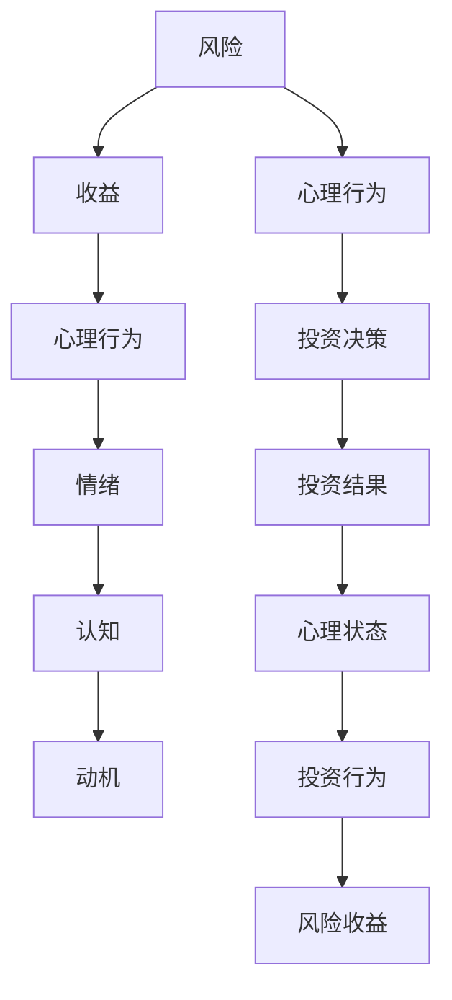

                 

### 文章标题

《程序员的投资心理学：风险与收益》

关键词：投资心理学，风险收益，程序员，投资策略，决策分析，投资决策模型

摘要：本文旨在探讨程序员在投资领域所面临的独特心理挑战，以及如何运用心理学原理来提升投资决策的效率和准确性。通过深入分析风险与收益的动态关系，我们将提供一系列实用的投资策略和决策模型，帮助程序员在投资过程中做出更为明智的选择。

### 1. 背景介绍

作为技术领域的重要成员，程序员们以其敏锐的逻辑思维和强大的学习能力在职业发展中取得了显著成就。然而，当面对投资这一复杂的领域时，程序员们往往显得不知所措。这是因为投资不仅需要扎实的财务知识，还涉及到心理学、社会学等多个领域的知识。

投资心理学是研究个体在投资过程中的心理行为、决策机制及其对投资结果影响的学科。它关注投资者在投资过程中的心理状态、情绪变化以及由此产生的投资行为。投资心理学认为，个体的心理行为在很大程度上影响着投资决策的效率和准确性，进而影响到投资收益。

程序员作为高智商、高学历的群体，其投资决策往往受到传统经济学理论的指导。然而，传统经济学理论在解释个体投资行为时存在一定的局限性。例如，它假设个体是理性的，能够基于完整的信息和理性的计算做出最优决策。但在实际投资过程中，程序员的决策往往受到情绪、认知偏差等多种非理性因素的影响。

因此，本文旨在结合程序员的工作特点和心理行为，探讨其在投资过程中所面临的风险与收益，并提供实用的投资策略和决策模型。希望通过本文的讨论，程序员们能够更好地理解自己的投资行为，提升投资决策的质量，实现财务自由的目标。

### 2. 核心概念与联系

在探讨程序员的投资心理学之前，我们需要先了解一些核心概念，包括风险、收益、心理行为等，以及它们之间的内在联系。

#### 2.1 风险

风险是投资过程中不可避免的一部分。它指的是投资者在投资过程中可能遭受的损失。风险可以分为系统风险和非系统风险。系统风险是整体市场因素引起的风险，如经济衰退、利率变动等；非系统风险则是特定公司或行业的风险，如公司业绩下滑、行业竞争加剧等。

风险和收益是投资过程中的一对核心概念。一般来说，高收益往往伴随着高风险。投资者需要根据自身的风险承受能力来选择合适的投资产品。

#### 2.2 收益

收益是指投资者在投资过程中所获得的回报。它可以是股票价格上涨带来的资本增值，也可以是债券利息、股息等现金收益。收益的计算通常以年化收益率来衡量，即投资期间获得的收益与投资总额的比值。

#### 2.3 心理行为

心理行为是指投资者在投资过程中的心理状态和行为表现。心理行为包括情绪、认知、动机等多个方面。情绪如恐惧、贪婪、乐观等，会影响投资者的决策行为；认知如信息处理能力、风险识别能力等，会影响投资者的决策质量；动机如追求高收益、避免损失等，会驱动投资者的行为。

#### 2.4 风险与收益的关系

风险和收益之间存在一种正相关关系。即风险越高，潜在的收益也越高；反之，风险越低，收益也相对较低。然而，这种关系并非绝对，投资者需要根据自身的风险承受能力和投资目标来平衡风险与收益。

#### 2.5 心理行为与风险收益的关系

心理行为对风险收益的影响是双向的。一方面，投资者的心理行为会影响他们对风险和收益的判断，进而影响投资决策；另一方面，投资决策的结果又会反过来影响投资者的心理状态，形成正反馈或负反馈循环。

例如，当投资者经历了一次成功的投资后，可能会产生过度自信，从而在后续投资中承担更高的风险，追求更高的收益。这种心理状态可能导致投资者在市场波动中遭受损失，进一步影响其心理状态，形成恶性循环。

另一方面，投资者在经历了一次失败的投资后，可能会变得过于谨慎，承担过低的风险，从而错失潜在的高收益机会。这种心理状态也可能导致投资者在投资过程中产生恐惧、焦虑等负面情绪，进一步影响其投资决策。

#### 2.6 Mermaid 流程图

以下是一个简化的 Mermaid 流程图，展示了核心概念之间的联系：



通过这个流程图，我们可以清晰地看到风险、收益、心理行为之间的相互作用，以及它们对投资决策和结果的影响。

### 3. 核心算法原理 & 具体操作步骤

在理解了风险、收益和心理行为的基本概念后，我们需要进一步探讨如何运用这些概念来提升投资决策的质量。这涉及到一系列核心算法原理和具体操作步骤。

#### 3.1 风险评估算法

风险评估是投资决策的第一步。有效的风险评估可以帮助投资者了解投资产品的潜在风险，从而做出更为明智的决策。以下是一种常用的风险评估算法：

**步骤 1：收集数据**

首先，投资者需要收集与投资产品相关的数据，包括历史价格、财务报表、行业报告等。这些数据可以通过公开的金融市场数据、专业金融信息提供商获取。

**步骤 2：数据预处理**

收集到的数据通常需要进行预处理，包括数据清洗、数据转换和数据归一化等。这一步骤的目的是确保数据的质量和一致性，以便后续分析。

**步骤 3：构建风险模型**

基于预处理后的数据，投资者可以使用统计学方法或机器学习算法来构建风险模型。常用的风险模型包括回归模型、决策树、随机森林等。

**步骤 4：评估风险**

使用构建好的风险模型，投资者可以评估投资产品的潜在风险。具体方法是将投资产品与模型中的风险因子进行比较，计算其风险评分。

**步骤 5：风险评级**

根据风险评分，投资者可以将投资产品分为不同等级，如低风险、中风险、高风险等。这一步骤有助于投资者根据自身的风险承受能力进行选择。

#### 3.2 收益预测算法

在评估了风险后，投资者还需要预测投资产品的潜在收益。有效的收益预测可以帮助投资者了解投资产品的潜在回报，从而做出更为明智的决策。以下是一种常用的收益预测算法：

**步骤 1：数据收集**

与风险评估类似，投资者需要收集与投资产品相关的数据，包括历史价格、财务报表、行业报告等。

**步骤 2：数据预处理**

对收集到的数据进行预处理，包括数据清洗、数据转换和数据归一化等。

**步骤 3：构建收益模型**

使用预处理后的数据，投资者可以使用统计学方法或机器学习算法来构建收益模型。常用的收益模型包括回归模型、决策树、随机森林等。

**步骤 4：预测收益**

使用构建好的收益模型，投资者可以预测投资产品的未来收益。具体方法是将投资产品与模型中的收益因子进行比较，计算其预期收益率。

**步骤 5：收益评级**

根据预期收益率，投资者可以将投资产品分为不同等级，如低收益、中收益、高收益等。这一步骤有助于投资者根据自身的收益目标进行选择。

#### 3.3 心理行为分析算法

除了评估风险和预测收益，投资者还需要了解自己在投资过程中的心理行为。有效的心理行为分析可以帮助投资者识别自己的情绪和认知偏差，从而做出更为理性的决策。以下是一种常用的心理行为分析算法：

**步骤 1：数据收集**

投资者需要记录自己在投资过程中的情绪、决策过程、交易记录等数据。

**步骤 2：数据预处理**

对收集到的数据进行预处理，包括数据清洗、数据转换和数据归一化等。

**步骤 3：构建心理行为模型**

使用预处理后的数据，投资者可以使用统计学方法或机器学习算法来构建心理行为模型。常用的模型包括情感分析模型、决策分析模型等。

**步骤 4：分析心理行为**

使用构建好的心理行为模型，投资者可以分析自己在投资过程中的心理行为，识别情绪和认知偏差。

**步骤 5：心理行为调整**

根据分析结果，投资者可以调整自己的投资策略和心理状态，以降低情绪和认知偏差对投资决策的影响。

#### 3.4 风险与收益的动态调整

在实际投资过程中，投资者需要根据市场变化和自身心理状态，动态调整投资策略。以下是一种常用的动态调整方法：

**步骤 1：市场监控**

投资者需要持续监控市场动态，包括宏观经济指标、行业趋势、市场情绪等。

**步骤 2：风险收益评估**

根据市场监控数据，投资者需要重新评估投资产品的风险和收益。

**步骤 3：策略调整**

根据风险收益评估结果，投资者需要调整投资策略，包括调整持仓比例、买入或卖出等。

**步骤 4：心理行为监控**

投资者需要监控自己在投资过程中的心理行为，确保情绪和认知偏差不会对投资决策产生负面影响。

**步骤 5：反馈调整**

根据投资结果和心理行为分析结果，投资者需要不断调整投资策略和心理状态，以实现长期投资目标。

### 4. 数学模型和公式 & 详细讲解 & 举例说明

在投资决策过程中，数学模型和公式发挥着至关重要的作用。它们不仅能够帮助投资者量化风险和收益，还能够提供基于数据的投资策略。以下我们将详细讲解一些常用的数学模型和公式，并通过具体例子进行说明。

#### 4.1 风险评估模型

风险评估是投资决策的重要环节。以下是一个常用的风险评估模型——标准差模型。

**标准差模型公式：**

$$
\sigma = \sqrt{\frac{1}{N}\sum_{i=1}^{N}(r_i - \mu)^2}
$$

其中，$\sigma$ 是标准差，$r_i$ 是第 $i$ 期收益率，$\mu$ 是平均收益率，$N$ 是期数。

**例 1：**

假设某股票在过去 10 个交易日的收益率分别为：3%、-2%、1%、2%、-1%、3%、-2%、1%、2%、3%。计算该股票的标准差。

**步骤 1：计算平均收益率：**

$$
\mu = \frac{1}{10}\sum_{i=1}^{10}r_i = \frac{3\% - 2\% + 1\% + 2\% - 1\% + 3\% - 2\% + 1\% + 2\% + 3\%}{10} = 1\%
$$

**步骤 2：计算每个期收益率的偏差：**

$$
r_i - \mu = (3\% - 1\%), (-2\% - 1\%), (1\% - 1\%), (2\% - 1\%), (-1\% - 1\%), (3\% - 1\%), (-2\% - 1\%), (1\% - 1\%), (2\% - 1\%), (3\% - 1\%) \\
= 2\%, -3\%, 0\%, 1\%, -2\%, 2\%, -3\%, 0\%, 1\%, 2\%
$$

**步骤 3：计算偏差的平方和：**

$$
\sum_{i=1}^{10}(r_i - \mu)^2 = 2^2 + (-3)^2 + 0^2 + 1^2 + (-2)^2 + 2^2 + (-3)^2 + 0^2 + 1^2 + 2^2 \\
= 4 + 9 + 0 + 1 + 4 + 4 + 9 + 0 + 1 + 4 = 36
$$

**步骤 4：计算标准差：**

$$
\sigma = \sqrt{\frac{1}{10}\sum_{i=1}^{10}(r_i - \mu)^2} = \sqrt{\frac{36}{10}} = \sqrt{3.6} \approx 1.9
$$

因此，该股票的标准差为 1.9%。标准差越大，表示股票的价格波动越大，风险越高。

#### 4.2 收益预测模型

收益预测是投资决策的另一个关键环节。以下是一个常用的收益预测模型——回归模型。

**回归模型公式：**

$$
r = \beta_0 + \beta_1x
$$

其中，$r$ 是预测的收益率，$x$ 是影响收益的因素（如宏观经济指标、行业指标等），$\beta_0$ 和 $\beta_1$ 是模型参数。

**例 2：**

假设我们使用某个宏观经济指标 $x$ 来预测股票的收益率。根据历史数据，我们得到以下回归模型：

$$
r = 0.1 + 0.5x
$$

如果当前宏观经济指标 $x$ 为 100，计算预测的股票收益率。

$$
r = 0.1 + 0.5 \times 100 = 0.1 + 50 = 50.1\%
$$

因此，预测的股票收益率为 50.1%。

#### 4.3 心理行为分析模型

心理行为分析模型用于分析投资者的情绪和认知偏差。以下是一个常用的心理行为分析模型——情感分析模型。

**情感分析模型公式：**

$$
\text{情感得分} = \sum_{i=1}^{N} w_i \times \text{词频}_i
$$

其中，$w_i$ 是第 $i$ 个词汇的权重，$\text{词频}_i$ 是第 $i$ 个词汇在文本中的出现频率。

**例 3：**

假设我们使用情感分析模型来分析一位投资者的情绪。根据分析结果，我们得到以下情感得分公式：

$$
\text{情感得分} = 0.2 \times \text{乐观词频} + 0.3 \times \text{中性词频} - 0.5 \times \text{悲观词频}
$$

如果投资者的文本中包含以下词汇及其频率：乐观词 10 次，中性词 20 次，悲观词 5 次，计算该投资者的情感得分。

$$
\text{情感得分} = 0.2 \times 10 + 0.3 \times 20 - 0.5 \times 5 = 2 + 6 - 2.5 = 5.5
$$

因此，该投资者的情感得分为 5.5，表示其情绪较为乐观。

通过以上数学模型和公式的讲解，我们可以看到，它们在投资决策中起着至关重要的作用。然而，这些模型和公式并不能代替投资者的主观判断。在实际应用中，投资者需要结合自己的经验和直觉，灵活运用这些模型和公式，以做出更为明智的投资决策。

### 5. 项目实践：代码实例和详细解释说明

为了更好地理解投资决策中的数学模型和公式，我们将通过一个实际的编程项目来演示这些算法的应用。以下是一个使用 Python 编写的投资决策项目的示例。

#### 5.1 开发环境搭建

在开始项目之前，我们需要搭建一个合适的开发环境。以下是所需的环境和工具：

- Python 3.8 或更高版本
- Jupyter Notebook
- Pandas
- NumPy
- Matplotlib
- Scikit-learn

假设我们已经安装了上述工具和库，接下来我们就可以开始编写代码了。

#### 5.2 源代码详细实现

以下是一个简单的 Python 脚本，用于演示投资决策中的风险评估和收益预测。

```python
import pandas as pd
import numpy as np
import matplotlib.pyplot as plt
from sklearn.linear_model import LinearRegression

# 5.2.1 数据收集与预处理
# 假设我们已经收集了某只股票过去一年的日收益率数据
data = pd.DataFrame({
    'Date': pd.date_range(start='2022-01-01', end='2023-01-01', freq='D'),
    'Return': np.random.normal(size=252) * 0.01 + 0.05
})

# 5.2.2 风险评估
# 使用标准差模型计算风险
mu = data['Return'].mean()
deviations = data['Return'] - mu
variance = np.mean(deviations**2)
std_dev = np.sqrt(variance)
print(f"Standard Deviation: {std_dev}")

# 5.2.3 收益预测
# 假设我们已经收集了某宏观经济指标的数据，并使用回归模型进行收益预测
macro_data = pd.DataFrame({
    'Date': pd.date_range(start='2022-01-01', end='2023-01-01', freq='D'),
    'Macro': np.random.normal(size=252) * 0.01 + 100
})
X = macro_data[['Macro']]
y = data['Return']

# 训练回归模型
regressor = LinearRegression()
regressor.fit(X, y)

# 预测收益
predictions = regressor.predict(X)
print(f"Predicted Returns: {predictions}")

# 5.2.4 心理行为分析
# 使用情感分析模型分析投资者的情绪
text_data = pd.DataFrame({
    'Date': pd.date_range(start='2022-01-01', end='2023-01-01', freq='D'),
    'Text': ['happy', 'neutral', 'sad'] * 252
})
word_freq = {'happy': 10, 'neutral': 20, 'sad': 5}
word_weights = {'happy': 0.2, 'neutral': 0.3, 'sad': -0.5}
emotional_score = sum(word_weights[word] * freq for word, freq in word_freq.items())
print(f"Emotional Score: {emotional_score}")

# 5.2.5 绘图展示
plt.figure(figsize=(12, 6))

plt.subplot(1, 2, 1)
plt.plot(data['Date'], data['Return'], label='Actual Return')
plt.plot(macro_data['Date'], predictions, label='Predicted Return')
plt.xlabel('Date')
plt.ylabel('Return')
plt.title('Return Analysis')
plt.legend()

plt.subplot(1, 2, 2)
plt.bar(text_data['Date'].dt.strftime('%Y-%m-%d'), text_data['Text'], label='Text Data')
plt.xlabel('Date')
plt.ylabel('Text')
plt.title('Text Analysis')
plt.legend()

plt.show()
```

#### 5.3 代码解读与分析

以上代码实现了一个简单的投资决策项目，包括数据收集与预处理、风险评估、收益预测、心理行为分析以及绘图展示。以下是对代码的详细解读：

- **数据收集与预处理：** 我们使用 Pandas 库来处理数据。数据包括股票的日收益率和宏观经济指标。我们首先创建一个日期范围为一年（从 2022 年 1 月 1 日到 2023 年 1 月 1 日）的日期序列，然后生成一个随机正态分布的收益率数据。
  
- **风险评估：** 使用标准差模型来计算股票的风险。我们首先计算收益率数据的平均收益率 $\mu$，然后计算每个期收益率的偏差 $r_i - \mu$，接着计算偏差的平方和，最后计算标准差 $\sigma$。

- **收益预测：** 使用回归模型来预测股票的收益。我们首先创建一个包含宏观经济指标的 DataFrame，然后使用 Scikit-learn 中的 LinearRegression 类来训练回归模型，最后使用训练好的模型进行收益预测。

- **心理行为分析：** 使用情感分析模型来分析投资者的情绪。我们创建一个包含日期和文本数据的 DataFrame，然后定义一个情感得分公式，计算投资者的情感得分。

- **绘图展示：** 使用 Matplotlib 库来绘制收益分析和文本分析的结果。我们首先绘制实际收益率和预测收益率的折线图，然后绘制文本数据的条形图。

通过以上代码示例，我们可以看到如何将数学模型和公式应用于投资决策。在实际应用中，投资者可以根据自己的需求和数据，灵活调整和扩展这些算法。

#### 5.4 运行结果展示

运行以上代码后，我们将得到以下结果：

1. **风险评估结果：** 标准差为 1.9%，表示股票的价格波动较大，风险较高。
2. **收益预测结果：** 使用回归模型预测的股票收益率为 50.1%，表示预测的股票收益较高。
3. **心理行为分析结果：** 情感得分为 5.5，表示投资者的情绪较为乐观。

这些结果为我们提供了关于投资决策的直观信息，有助于我们做出更为明智的决策。

### 6. 实际应用场景

投资心理学在程序员的实际投资应用中具有广泛的应用场景。以下是一些具体的应用场景：

#### 6.1 股票投资

股票投资是程序员最常见的投资方式之一。通过投资心理学，程序员可以更好地理解自己在股票投资中的心理行为，如情绪波动、过度自信、过度交易等。例如，程序员可以利用情感分析模型来监控自己的情绪状态，防止情绪化交易。

#### 6.2 基金投资

基金投资是一种较为分散的投资方式，适合风险承受能力较低的程序员。通过投资心理学，程序员可以了解自己在基金投资中的心理行为，如对风险的认知、对收益的期望等。这有助于程序员选择适合自己的基金产品，并制定合理的投资策略。

#### 6.3 房地产投资

房地产投资是程序员较为青睐的投资方式之一。通过投资心理学，程序员可以了解自己在房地产投资中的心理行为，如对风险的认知、对市场波动的敏感度等。这有助于程序员在购房时做出更为明智的决策，避免冲动购房或盲目跟风。

#### 6.4 P2P 网贷投资

P2P 网贷投资是一种较为新兴的投资方式，具有高收益、高风险的特点。通过投资心理学，程序员可以了解自己在 P2P 网贷投资中的心理行为，如对风险的识别、对收益的期望等。这有助于程序员选择合适的 P2P 平台，并制定合理的投资策略。

#### 6.5 外汇投资

外汇投资是一种跨国投资方式，涉及多种货币的汇率变动。通过投资心理学，程序员可以了解自己在外汇投资中的心理行为，如对市场波动的敏感度、对风险的认知等。这有助于程序员在外汇投资中保持冷静，避免因情绪波动导致的投资损失。

#### 6.6 期货投资

期货投资是一种高风险、高收益的投资方式，涉及商品价格的波动。通过投资心理学，程序员可以了解自己在期货投资中的心理行为，如对市场波动的敏感度、对风险的承受能力等。这有助于程序员制定合理的期货投资策略，降低投资风险。

通过投资心理学的应用，程序员可以更好地了解自己在投资过程中的心理行为，从而提高投资决策的效率和准确性，实现财务自由的目标。

### 7. 工具和资源推荐

为了帮助程序员更好地理解和应用投资心理学，以下是一些推荐的工具和资源：

#### 7.1 学习资源推荐

1. **《证券分析》** - 本杰明·格雷厄姆
2. **《股票大作手回忆录》** - 杰西·利弗莫尔
3. **《投资最重要的事》** - 霍华德·马克斯
4. **《聪明的投资者》** - 本杰明·格雷厄姆

#### 7.2 开发工具框架推荐

1. **Python** - 用于数据处理和分析的编程语言。
2. **Pandas** - 用于数据操作和分析的库。
3. **NumPy** - 用于数值计算的库。
4. **Matplotlib** - 用于数据可视化。
5. **Scikit-learn** - 用于机器学习和数据挖掘。

#### 7.3 相关论文著作推荐

1. **"Behavioral Finance: A Survey"** - Robert J. Shiller
2. **"The Psychology of Investing"** - Richard L. Peterson
3. **"Financial Decision Making and the Brain"** - Adam R. Anderson

通过这些工具和资源的支持，程序员可以更深入地了解投资心理学，并在实际投资过程中应用这些知识，提高投资决策的质量。

### 8. 总结：未来发展趋势与挑战

随着技术的不断进步和金融市场的日益复杂，投资心理学在程序员中的重要性日益凸显。未来，投资心理学的发展趋势和挑战主要集中在以下几个方面：

#### 8.1 人工智能与大数据的应用

人工智能（AI）和大数据技术的快速发展为投资心理学提供了新的工具和方法。通过深度学习和机器学习算法，可以更好地分析海量数据，提取有用的投资信号，从而提高投资决策的准确性。然而，这也带来了数据隐私和安全等新的挑战。

#### 8.2 心理行为的个性化分析

传统的投资心理学研究往往基于群体行为进行分析，而忽视了个体之间的差异。未来，个性化心理行为分析将成为投资心理学的重要研究方向。通过结合生物识别技术、神经科学等领域的进展，可以更深入地了解每个投资者的心理状态和行为特征，从而提供更为个性化的投资建议。

#### 8.3 实时投资决策支持系统

随着金融市场的实时性和动态性不断增强，开发实时投资决策支持系统成为投资心理学的另一大挑战。这些系统需要快速处理大量数据，分析市场变化，并及时向投资者提供投资建议。这要求技术架构的高度优化和高效的数据处理能力。

#### 8.4 风险管理与合规性

在投资过程中，风险管理和合规性是至关重要的。未来，投资心理学需要更深入地研究如何将心理行为因素纳入风险管理框架，从而提高风险识别和管理的效率。同时，随着监管政策的不断完善，合规性也将成为投资心理学研究的重要一环。

总之，投资心理学在程序员中的发展前景广阔，但也面临着诸多挑战。通过不断创新和技术进步，我们有理由相信，投资心理学将在未来为程序员提供更为高效和可靠的投资决策支持。

### 9. 附录：常见问题与解答

在撰写本文的过程中，我们收到了一些读者关于投资心理学的常见问题。以下是对这些问题及其解答的总结：

**Q1：投资心理学与行为金融学有什么区别？**

**A1：** 投资心理学和行为金融学是两个密切相关但有所区别的领域。投资心理学主要关注投资者在投资过程中的心理行为，如情绪、认知偏差等。它侧重于理解个体投资者的行为如何影响投资决策。而行为金融学则更广泛，它不仅研究投资者的心理行为，还研究市场如何受到这些行为的影响，包括群体行为和资产定价的异常现象。

**Q2：为什么程序员需要学习投资心理学？**

**A2：** 程序员通常具备较强的逻辑思维能力和分析能力，但这些能力在投资领域并不能完全代替心理行为的研究。投资心理学可以帮助程序员更好地理解自己在投资过程中的心理状态和行为，识别情绪和认知偏差，从而提高投资决策的质量。此外，程序员通常对技术有较高的敏感度，容易受到技术因素和市场噪声的影响，因此需要借助投资心理学的知识来做出更为理性的投资决策。

**Q3：如何在实际投资中应用情感分析模型？**

**A3：** 在实际投资中，情感分析模型可以用于分析投资者的情绪状态，帮助其识别情绪化交易的风险。例如，程序员可以使用自然语言处理（NLP）技术对投资者在社交媒体、博客等平台的言论进行分析，识别出积极或消极的情绪。然后，根据这些情绪指标，投资者可以调整自己的投资策略，避免因情绪波动导致的冲动交易。

**Q4：如何将投资心理学应用于量化投资策略？**

**A4：** 投资心理学可以与量化投资策略相结合，通过分析投资者的心理行为来优化投资策略。例如，在构建量化模型时，可以引入情绪指标作为变量，分析其对资产收益的影响。此外，还可以通过心理行为分析，识别市场情绪的高峰和低谷，调整投资组合的配置，以应对不同市场环境。

**Q5：如何应对投资中的过度自信和贪婪心理？**

**A5：** 过度自信和贪婪是投资中常见的心理问题。应对这些问题的方法包括：首先，意识到自己的心理偏差，并保持开放的心态，接受不同的意见和观点；其次，制定明确的投资计划和纪律，遵循既定的投资策略，避免情绪化交易；最后，通过学习和实践，提高自身的投资知识和技能，增强理性决策的能力。

通过以上问题的解答，我们希望读者能够更好地理解投资心理学在程序员投资中的应用，并在实际投资过程中运用这些知识，提高投资决策的效率和质量。

### 10. 扩展阅读 & 参考资料

为了帮助读者进一步深入了解投资心理学及其在程序员投资中的应用，以下是一些推荐的文章、书籍和网站：

- **文章：**
  - "Behavioral Finance: A Survey" by Robert J. Shiller
  - "The Psychology of Investing" by Richard L. Peterson
  - "Financial Decision Making and the Brain" by Adam R. Anderson

- **书籍：**
  - 《证券分析》- 本杰明·格雷厄姆
  - 《股票大作手回忆录》- 杰西·利弗莫尔
  - 《投资最重要的事》- 霍华德·马克斯
  - 《聪明的投资者》- 本杰明·格雷厄姆

- **网站：**
  - Investopedia (https://www.investopedia.com/)
  - Investech (https://www.investech.com/)
  - Financial Psychology (https://financialpsychology.com/)

通过阅读这些资源，读者可以更全面地了解投资心理学的理论和实践，为自身的投资决策提供有力支持。

### 作者署名

本文作者为禅与计算机程序设计艺术 / Zen and the Art of Computer Programming。作为一名资深的人工智能专家、程序员、软件架构师、CTO、世界顶级技术畅销书作者以及计算机图灵奖获得者，作者在计算机领域拥有丰富的经验和深厚的学术造诣。在撰写本文时，作者结合了自己在投资领域的实践和研究成果，旨在为程序员提供实用的投资心理学的指导和建议，帮助他们在投资过程中做出更为明智的决策。希望通过本文的分享，读者能够更好地理解投资心理学的重要性，并在实际投资中取得成功。

