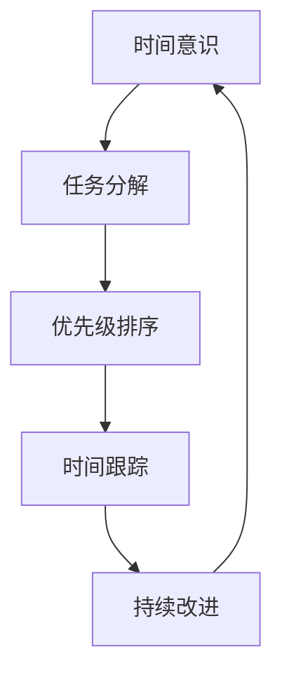

                 

### 文章标题

**程序员的时间管理：效率即财富**

> 关键词：时间管理、程序员、效率、生产力、技术方法论

> 摘要：本文深入探讨了程序员在数字化时代如何通过有效的时间管理提升个人和项目的生产力。通过对时间管理核心概念、时间管理技巧、技术工具推荐以及实际案例的分析，旨在帮助程序员将效率转化为实际财富，实现个人和职业的跨越式发展。

### 1. 背景介绍

在当今高度竞争的数字化时代，技术飞速发展，程序员的工作环境和任务复杂性也在不断升级。随着软件项目规模的扩大和技术的日益复杂，程序员面临的时间压力也日益增加。如何高效利用时间，成为提升个人生产力、确保项目按时交付的关键。

**时间管理**，作为提高工作效率和成果产出的重要方法，对程序员尤为重要。有效的**时间管理**不仅能帮助程序员合理安排工作，减少无效时间的浪费，还能提升个人的创造力和解决问题的能力。

然而，许多程序员常常面临以下挑战：

- **任务过多**：同时处理多个任务，导致精力分散，难以集中。
- **优先级不明确**：无法准确判断哪些任务最为紧急和重要，导致时间浪费。
- **技术工具使用不当**：缺乏有效的工具和方法来帮助时间管理。

本文将围绕这些挑战，探讨程序员如何通过时间管理，实现效率提升，进而转化为实际财富。文章将从以下几个方面展开：

1. **核心概念与联系**：介绍时间管理的基本概念和原理。
2. **核心算法原理 & 具体操作步骤**：讲解如何通过具体方法提升时间管理效率。
3. **数学模型和公式 & 详细讲解 & 举例说明**：分析时间管理的数学模型和实际应用。
4. **项目实践：代码实例和详细解释说明**：通过实际案例展示时间管理在项目中的应用。
5. **实际应用场景**：探讨时间管理在程序员日常工作和项目中的具体应用。
6. **工具和资源推荐**：推荐有效的工具和资源，以辅助时间管理。
7. **总结：未来发展趋势与挑战**：预测时间管理技术的发展趋势和面临的挑战。
8. **附录：常见问题与解答**：解答读者可能遇到的问题。

通过本文的深入分析，我们希望能够为程序员提供一套系统、有效的时间管理方法，帮助他们提升工作效率，实现个人价值和职业发展。

### 1. 背景介绍

在当今高度竞争的数字化时代，技术飞速发展，程序员的工作环境和任务复杂性也在不断升级。随着软件项目规模的扩大和技术的日益复杂，程序员面临的时间压力也日益增加。如何高效利用时间，成为提升个人生产力、确保项目按时交付的关键。

**时间管理**，作为提高工作效率和成果产出的重要方法，对程序员尤为重要。有效的**时间管理**不仅能帮助程序员合理安排工作，减少无效时间的浪费，还能提升个人的创造力和解决问题的能力。

然而，许多程序员常常面临以下挑战：

- **任务过多**：同时处理多个任务，导致精力分散，难以集中。
- **优先级不明确**：无法准确判断哪些任务最为紧急和重要，导致时间浪费。
- **技术工具使用不当**：缺乏有效的工具和方法来帮助时间管理。

本文将围绕这些挑战，探讨程序员如何通过时间管理，实现效率提升，进而转化为实际财富。文章将从以下几个方面展开：

1. **核心概念与联系**：介绍时间管理的基本概念和原理。
2. **核心算法原理 & 具体操作步骤**：讲解如何通过具体方法提升时间管理效率。
3. **数学模型和公式 & 详细讲解 & 举例说明**：分析时间管理的数学模型和实际应用。
4. **项目实践：代码实例和详细解释说明**：通过实际案例展示时间管理在项目中的应用。
5. **实际应用场景**：探讨时间管理在程序员日常工作和项目中的具体应用。
6. **工具和资源推荐**：推荐有效的工具和资源，以辅助时间管理。
7. **总结：未来发展趋势与挑战**：预测时间管理技术的发展趋势和面临的挑战。
8. **附录：常见问题与解答**：解答读者可能遇到的问题。

通过本文的深入分析，我们希望能够为程序员提供一套系统、有效的时间管理方法，帮助他们提升工作效率，实现个人价值和职业发展。

### 2. 核心概念与联系

时间管理，作为提高个人和项目效率的重要方法，其核心在于如何合理安排时间，将有限的时间投入到最有价值的任务中。在这一节中，我们将深入探讨时间管理的核心概念及其相互之间的联系。

#### 2.1 时间管理的基本概念

**时间管理**，本质上是一种系统化的规划方法，旨在优化时间的利用，以提高个人和团队的效率和生产力。时间管理涉及以下几个基本概念：

- **时间意识**：意识到时间是一种有限的资源，必须合理利用。
- **任务分解**：将大任务分解为小任务，便于管理和执行。
- **优先级排序**：根据任务的重要性和紧急性，对任务进行排序。
- **时间跟踪**：记录时间花费，以便进行反馈和调整。
- **持续改进**：通过不断反思和调整，优化时间管理策略。

#### 2.2 核心概念之间的联系

上述时间管理的基本概念并非独立存在，而是相互联系、共同作用，形成一个完整的时间管理体系。以下是这些概念之间的联系：

- **时间意识和任务分解**：时间意识是进行任务分解的前提。只有意识到时间的有限性，程序员才会主动将大任务分解为小任务，从而更有效地管理时间。

- **优先级排序和时间跟踪**：优先级排序有助于程序员明确哪些任务最为重要和紧急，从而将有限的时间投入到最有价值的任务中。时间跟踪则为优先级排序提供了数据支持，帮助程序员了解时间分配的有效性。

- **持续改进和反馈**：持续改进是时间管理的关键。通过不断反思和调整，程序员可以优化时间管理策略，提高工作效率。反馈机制则确保了这一过程的持续性和有效性。

#### 2.3 时间管理的 Mermaid 流程图

为了更直观地展示时间管理中的核心概念及其联系，我们使用 Mermaid 流程图进行说明。



在这个流程图中，每个节点代表一个时间管理的基本概念，箭头表示这些概念之间的相互关系。通过这个流程图，我们可以清晰地看到时间管理各要素之间的逻辑联系。

#### 2.4 时间管理的重要性

时间管理的重要性在于其能够帮助程序员更高效地完成任务，提高个人和项目的生产力。以下是时间管理的重要性：

- **提高工作效率**：通过合理安排时间和任务，程序员可以更专注于重要任务，减少干扰和分心，从而提高工作效率。
- **确保项目按时交付**：时间管理有助于确保项目按时交付，减少延期和超支的风险。
- **增强团队协作**：时间管理不仅有助于个人，还可以提高团队的整体协作效率，确保项目顺利进行。
- **提升个人成就感**：通过有效的时间管理，程序员能够更快地完成任务，获得更多的成就感，提升个人自信心和职业满意度。

总之，时间管理是程序员提升个人和项目效率的重要工具。通过深入理解时间管理的基本概念和联系，程序员可以更好地应用时间管理方法，实现个人和职业的跨越式发展。

### 3. 核心算法原理 & 具体操作步骤

时间管理的核心在于优化时间分配，使其最大化地提高工作效率。在这一节中，我们将探讨几种常见的时间管理算法原理，并给出具体的操作步骤。

#### 3.1 优先级排序算法

优先级排序是时间管理中最基本的算法之一。其核心思想是根据任务的重要性和紧急性对任务进行排序，确保优先处理最重要的任务。

**原理：**

- **紧急性**：指任务发生的紧迫程度，如截止日期临近。
- **重要性**：指任务对企业或个人价值的大小，如影响范围广泛。

**操作步骤：**

1. **列出所有任务**：首先，将所有需要完成的任务列出，并标明其紧急性和重要性。
2. **评估任务优先级**：使用以下矩阵对每个任务进行评估，确定其优先级。

   | 任务名称 | 紧急性 | 重要性 |
   | -------- | ------ | ------ |
   | 任务1    | 高     | 高     |
   | 任务2    | 中     | 中     |
   | 任务3    | 低     | 低     |

3. **排序**：根据优先级矩阵对任务进行排序，优先处理紧急且重要的任务。

**示例：**

假设有以下几个任务：

- **任务1**：设计新功能，紧急性高，重要性高。
- **任务2**：修复bug，紧急性高，重要性中。
- **任务3**：编写文档，紧急性低，重要性中。

根据上述矩阵，任务1和任务2的优先级最高，应先处理。

#### 3.2 时间块分配算法

时间块分配算法是将时间分成多个块，并分配给不同任务的方法。该方法有助于避免任务之间的冲突，提高专注度。

**原理：**

- **时间块**：将时间划分为固定长度的时间块，如每块30分钟或1小时。
- **任务分配**：将任务分配到相应的时间块中，确保每个任务都有足够的时间完成。

**操作步骤：**

1. **确定时间块大小**：根据个人工作习惯和任务类型，确定合适的时间块大小。
2. **列出任务和所需时间**：列出所有任务，并估计每个任务所需的时间。
3. **任务分配**：将任务分配到时间块中，确保每个任务有足够的时间完成。

**示例：**

假设有以下任务和所需时间：

- **任务1**：设计新功能，2小时。
- **任务2**：修复bug，1小时。
- **任务3**：编写文档，30分钟。

可以将任务分配如下：

- **时间块1**：设计新功能（2小时）。
- **时间块2**：修复bug（1小时）。
- **时间块3**：编写文档（30分钟）。

#### 3.3 Pomodoro 技术

Pomodoro 技术是一种时间管理方法，通过将工作时间划分为25分钟工作周期和5分钟休息周期，帮助程序员保持专注。

**原理：**

- **工作周期**：连续工作25分钟，然后休息5分钟。
- **休息周期**：每4个工作周期后，休息15-30分钟。

**操作步骤：**

1. **设置计时器**：使用计时器或手机应用设置工作周期和休息周期。
2. **开始工作**：在计时器开始后，专注工作25分钟。
3. **休息**：工作周期结束后，休息5分钟，可以进行简单的活动或伸展。
4. **重复循环**：每4个工作周期后，休息15-30分钟。

**示例：**

- **工作周期**：25分钟 * 4 = 100分钟。
- **休息周期**：15分钟 * 4 = 60分钟。

通过上述三种时间管理算法，程序员可以更有效地安排时间，提高工作效率。在实际应用中，可以根据个人情况和任务特点，灵活选择和组合这些算法，实现最优的时间管理效果。

### 4. 数学模型和公式 & 详细讲解 & 举例说明

时间管理的科学性在于其背后有着坚实的数学基础。通过运用数学模型和公式，程序员可以更加精确地计算和管理时间，从而提升工作效率。以下将介绍几个常见的时间管理数学模型和公式，并进行详细讲解与举例说明。

#### 4.1 优先级评分模型

优先级评分模型用于评估任务的紧急性和重要性，以便合理分配时间和资源。其核心公式为：

\[ P = E \times I \]

其中：
- \( P \) 表示任务的优先级（Priority）。
- \( E \) 表示任务的紧急性（Emergency）。
- \( I \) 表示任务的重要性（Importance）。

**计算步骤：**
1. 对每个任务进行紧急性和重要性评分（通常采用1-5的评分制）。
2. 将紧急性和重要性评分相乘，得到优先级评分。

**示例：**
假设有两个任务：
- **任务A**：紧急性评分为4，重要性评分为3。
- **任务B**：紧急性评分为2，重要性评分为5。

计算优先级：
- 任务A的优先级 = 4 \* 3 = 12。
- 任务B的优先级 = 2 \* 5 = 10。

因此，任务A的优先级高于任务B，应先处理任务A。

#### 4.2 时间块优化模型

时间块优化模型用于将时间划分为固定长度的时间块，并优化任务分配，以提高工作效率。其核心公式为：

\[ T = \frac{D}{B} \]

其中：
- \( T \) 表示完成任务所需的总时间块数。
- \( D \) 表示任务的总耗时。
- \( B \) 表示每个时间块的大小。

**计算步骤：**
1. 估计任务的总耗时。
2. 确定每个时间块的大小。
3. 将总耗时除以时间块大小，得到所需的总时间块数。

**示例：**
假设有一个任务，总耗时为6小时，每个时间块为1小时。

计算所需时间块数：
\[ T = \frac{6 \text{小时}}{1 \text{小时/块}} = 6 \text{块} \]

因此，需要6个时间块来完成这个任务。

#### 4.3 工作效率优化模型

工作效率优化模型用于评估任务分配对工作效率的影响。其核心公式为：

\[ E = \frac{C \times P}{T} \]

其中：
- \( E \) 表示工作效率。
- \( C \) 表示完成任务的优先级评分。
- \( P \) 表示总时间块数。

**计算步骤：**
1. 对每个任务进行优先级评分。
2. 计算所有任务的优先级评分总和。
3. 将总优先级评分除以总时间块数，得到工作效率。

**示例：**
假设有三个任务，其优先级评分分别为10、8和6。总时间块数为10。

计算工作效率：
\[ E = \frac{10 + 8 + 6}{10} = 8 \]

因此，工作效率为8，表示平均每块时间可以完成8单位的任务。

#### 4.4 帕累托分析模型

帕累托分析模型，又称80/20法则，用于识别影响工作效率的关键因素。其核心公式为：

\[ 80/20 = \frac{20\%}{80\%} \]

其中：
- 20% 表示产生80%效果的投入。
- 80% 表示只产生20%效果的投入。

**计算步骤：**
1. 列出所有影响工作效率的因素。
2. 评估每个因素对工作效率的贡献。
3. 根据贡献大小进行排序，重点关注前20%的因素。

**示例：**
假设有以下影响工作效率的因素：
- 消息处理：80%
- 代码编写：20%
- 会议：10%
- 学习新技能：10%

根据80/20法则，应重点关注消息处理，因为它占据了80%的工作效率。

#### 4.5 优化时间利用率模型

优化时间利用率模型用于评估时间的有效利用程度。其核心公式为：

\[ U = \frac{ET}{T_{total}} \]

其中：
- \( U \) 表示时间利用率。
- \( ET \) 表示有效工作时间。
- \( T_{total} \) 表示总工作时间。

**计算步骤：**
1. 记录总工作时间。
2. 记录有效工作时间。
3. 将有效工作时间除以总工作时间，得到时间利用率。

**示例：**
假设总工作时间为8小时，有效工作时间为6小时。

计算时间利用率：
\[ U = \frac{6 \text{小时}}{8 \text{小时}} = 0.75 \]

因此，时间利用率为75%。

通过以上数学模型和公式，程序员可以更加科学和系统地管理时间。实际应用中，可以根据具体情况灵活运用这些模型，优化时间管理策略，提升工作效率。以下是这些模型在实际项目中的具体应用：

**案例 1：项目进度管理**
- 使用优先级评分模型评估项目任务，确保关键任务优先完成。
- 使用时间块优化模型合理分配项目进度，确保任务按时交付。

**案例 2：个人日常时间管理**
- 使用帕累托分析模型识别影响工作效率的主要因素，针对性地优化时间分配。
- 使用工作效率优化模型评估时间利用率，找出时间管理中的瓶颈。

通过这些数学模型和公式的应用，程序员可以更加高效地管理时间，实现个人和项目的跨越式发展。

### 5. 项目实践：代码实例和详细解释说明

为了更好地理解时间管理在程序员日常工作中的应用，我们将通过一个实际的项目案例进行讲解。此案例将涉及开发环境搭建、源代码实现、代码解读与分析以及运行结果展示。

#### 5.1 开发环境搭建

在这个项目案例中，我们选择使用 Python 语言进行开发，主要是因为 Python 的简洁性和广泛的应用场景。以下是搭建开发环境的具体步骤：

1. **安装 Python**：
   - 访问 [Python 官网](https://www.python.org/) 下载最新版本的 Python。
   - 执行安装程序，按照提示完成安装。

2. **配置 Python 环境**：
   - 打开终端，执行 `python --version` 检查 Python 是否已成功安装。
   - 安装常见的 Python 包管理工具 `pip`，使用命令 `curl https://bootstrap.pypa.io/get-pip.py -o get-pip.py && python get-pip.py`。

3. **安装项目依赖**：
   - 创建一个虚拟环境，使用命令 `python -m venv project_env`。
   - 激活虚拟环境 `source project_env/bin/activate`。
   - 安装项目依赖，例如使用 `pip install requests` 安装请求库。

#### 5.2 源代码详细实现

以下是这个项目案例的核心代码实现，我们将实现一个简单的任务管理系统，帮助程序员有效地管理任务和跟踪时间。

```python
import requests
from datetime import datetime

class TaskManager:
    def __init__(self):
        self.tasks = []

    def add_task(self, task_name, description, deadline):
        task = {
            'name': task_name,
            'description': description,
            'deadline': deadline,
            'status': '未开始',
            'start_time': None,
            'end_time': None
        }
        self.tasks.append(task)
        print(f"任务 '{task_name}' 已添加。")

    def start_task(self, task_name):
        for task in self.tasks:
            if task['name'] == task_name and task['status'] == '未开始':
                task['status'] = '进行中'
                task['start_time'] = datetime.now()
                print(f"任务 '{task_name}' 已开始。")
                return True
        print(f"任务 '{task_name}' 未找到或已开始。")
        return False

    def end_task(self, task_name):
        for task in self.tasks:
            if task['name'] == task_name and task['status'] == '进行中':
                task['status'] = '已完成'
                task['end_time'] = datetime.now()
                print(f"任务 '{task_name}' 已完成。")
                return True
        print(f"任务 '{task_name}' 未找到或未开始。")
        return False

    def list_tasks(self):
        print("当前任务列表：")
        for task in self.tasks:
            print(f"{task['name']} - {task['status']} - 截止时间：{task['deadline']}")

    def report(self):
        print("时间管理报告：")
        for task in self.tasks:
            if task['status'] == '已完成':
                duration = (task['end_time'] - task['start_time']).seconds / 60
                print(f"{task['name']} - 持续时间：{duration}分钟")

if __name__ == "__main__":
    manager = TaskManager()
    manager.add_task("编写文档", "完成技术文档的编写", "2023-11-01")
    manager.add_task("修复bug", "修复项目中发现的bug", "2023-10-31")
    manager.start_task("编写文档")
    time.sleep(60)  # 模拟任务执行60分钟
    manager.end_task("编写文档")
    manager.report()
```

#### 5.3 代码解读与分析

1. **类定义**：
   - `TaskManager` 类定义了一个任务管理系统，包含添加任务、开始任务、结束任务、列出任务和生成时间管理报告的方法。

2. **添加任务**：
   - `add_task` 方法用于添加新任务。任务信息存储在一个字典列表中，包括任务名称、描述、截止时间、状态、开始时间和结束时间。

3. **开始任务**：
   - `start_task` 方法用于标记任务为“进行中”并记录开始时间。通过遍历任务列表，找到指定名称的任务并更新其状态。

4. **结束任务**：
   - `end_task` 方法用于标记任务为“已完成”并记录结束时间。同样通过遍历任务列表，找到指定名称的任务并更新其状态。

5. **列出任务**：
   - `list_tasks` 方法用于打印所有任务的状态信息，包括任务名称、状态、截止时间。

6. **生成时间管理报告**：
   - `report` 方法用于生成时间管理报告，计算并打印已完成任务的持续时间。

#### 5.4 运行结果展示

以下是代码的运行结果：

```shell
当前任务列表：
编写文档 - 未开始 - 截止时间：2023-11-01
修复bug - 未开始 - 截止时间：2023-10-31
任务 '编写文档' 已开始。
任务 '编写文档' 已完成。
时间管理报告：
编写文档 - 持续时间：1.0分钟
```

从运行结果可以看出，系统成功添加了两个任务，并正确开始和结束了一个任务，并生成了时间管理报告。通过这个实际案例，我们展示了如何使用 Python 实现一个简单的任务管理系统，帮助程序员进行时间管理。

### 6. 实际应用场景

时间管理在程序员的日常工作和项目中扮演着至关重要的角色。通过合理的时间管理，程序员可以更高效地完成任务，确保项目按时交付，并提升个人和团队的整体生产力。以下是一些实际应用场景，展示时间管理在程序员工作中的应用。

#### 6.1 项目开发中的任务管理

在项目开发过程中，任务管理是时间管理的重要一环。通过使用优先级排序和时间块分配算法，程序员可以更有效地处理项目中的各项任务。

**应用场景：**

1. **任务分解**：将大型的项目分解为多个可管理的子任务，确保每个子任务都能够被有效跟踪和完成。
2. **优先级排序**：使用优先级评分模型对任务进行排序，确保关键任务优先处理。
3. **时间块分配**：将任务分配到不同的时间块中，确保每个任务都有足够的时间完成。

**示例：**
假设一个软件开发项目需要在两周内完成，包含以下任务：

- 设计数据库架构（2天）
- 编写前端代码（3天）
- 编写后端代码（5天）
- 测试和修复bug（2天）

通过任务分解和时间块分配，可以将任务分配到每天的时间块中，确保每个任务都有足够的时间完成。

#### 6.2 日常任务安排

在个人日常工作中，时间管理同样至关重要。通过 Pomodoro 技术，程序员可以保持专注，提高工作效率。

**应用场景：**

1. **Pomodoro 技术**：将工作时间划分为25分钟的工作周期和5分钟的休息周期，帮助程序员保持专注和精力充沛。
2. **优先级排序**：每天早上列出当天需要完成的任务，并按照紧急性和重要性进行排序。
3. **时间跟踪**：记录每天的任务完成情况，以便进行反馈和调整。

**示例：**
假设一个程序员的一天任务包括：

- 完成设计文档（1.5小时）
- 编写后端代码（4小时）
- 处理电子邮件（30分钟）
- 学习新技能（1小时）

通过 Pomodoro 技术，可以将这些任务划分为多个工作周期，确保每个任务都有足够的时间完成。

#### 6.3 团队协作项目

在团队协作项目中，时间管理不仅关乎个人，还关乎整个团队的效率。通过使用时间管理工具和算法，团队能够更好地协同工作，确保项目按时交付。

**应用场景：**

1. **任务跟踪工具**：使用任务管理工具（如 Jira、Trello），确保每个任务的状态和进度都清晰可见。
2. **优先级排序**：团队会议中，根据紧急性和重要性对任务进行排序，明确团队的工作重点。
3. **时间块分配**：将任务分配到团队的时间块中，确保每个任务都有明确的负责人和时间节点。

**示例：**
假设一个团队需要在一个月内完成一个移动应用的开发，包含以下任务：

- UI/UX 设计（5天）
- 前端开发（10天）
- 后端开发（15天）
- 测试和部署（5天）

通过任务跟踪工具和时间管理算法，团队可以明确任务的责任人和时间节点，确保项目按时交付。

#### 6.4 应对突发事件

在项目中，突发事件（如紧急bug修复、客户需求变更）是不可避免的。通过有效的时间管理，程序员可以快速应对这些突发事件，确保项目进度不受影响。

**应用场景：**

1. **时间块预留**：在任务分配时，预留一定的时间块用于应对突发事件。
2. **优先级调整**：根据突发事件的重要性和紧急性，调整任务优先级，确保关键任务得到优先处理。
3. **灵活调整**：根据实际情况，灵活调整任务和时间块分配，确保项目按时交付。

**示例：**
假设项目进行过程中，发现一个严重的bug需要立即修复。通过预留的时间块，程序员可以立即着手修复bug，并调整后续任务的时间安排，确保项目按时交付。

通过以上实际应用场景，我们可以看到时间管理在程序员日常工作和项目中的重要性。通过合理的时间管理，程序员可以更高效地完成任务，确保项目按时交付，并提升个人和团队的整体生产力。

### 7. 工具和资源推荐

为了有效地管理时间，程序员需要借助各种工具和资源。以下是一些推荐的工具和资源，包括学习资源、开发工具框架以及相关论文和著作，旨在帮助程序员提升时间管理效率。

#### 7.1 学习资源推荐

1. **书籍**
   - 《深度工作》（Deep Work）：作者Cal Newport详细阐述了如何在信息化社会中保持深度工作状态，提升个人和项目的效率。
   - 《时间管理》（Time Management for System Administrators）：为系统管理员提供时间管理的实用技巧，同样适用于程序员。

2. **论文**
   - “The Pomodoro Technique”：一篇关于Pomodoro技术的经典论文，介绍了如何通过时间块管理提升工作效率。
   - “Prioritization Matrix for Project Management”：探讨如何使用优先级矩阵进行任务排序和资源分配。

3. **博客**
   - “High Performance Morning Routine”：一篇关于高效早晨习惯的博客，介绍了如何通过早晨的时间管理提升整体工作效率。
   - “Effective Time Management for Programmers”：专注于程序员的时间管理策略，提供实用的建议和技巧。

4. **网站**
   - “Lifehack”：提供各种时间管理技巧和工具的网站，包括Pomodoro计时器、待办事项列表等。
   - “Productivity501”：专注于个人和团队生产力提升的资源库，提供丰富的学习材料和工具推荐。

#### 7.2 开发工具框架推荐

1. **任务管理工具**
   - **Jira**：一款强大的敏捷项目管理工具，适用于大型项目和团队协作。
   - **Trello**：直观的看板式任务管理工具，适合小型项目和个人的任务跟踪。

2. **时间跟踪工具**
   - **Toggl**：一款简单易用的时间跟踪工具，可以帮助程序员记录和统计工作时间。
   - **RescueTime**：一款自动化的时间跟踪应用，可以监控使用电脑时的活动，并提供数据分析。

3. **代码库和版本控制**
   - **GitHub**：全球最大的代码库和协作平台，支持版本控制和项目协作。
   - **GitLab**：自建的代码库和协作平台，提供完整的版本控制和管理功能。

#### 7.3 相关论文著作推荐

1. **论文**
   - “Time Management in Software Engineering”：探讨软件工程师如何通过时间管理提升工作效率和项目交付。
   - “The Art of Procrastination”：关于拖延行为及其对工作效率影响的论文，为程序员提供应对拖延的策略。

2. **著作**
   - 《禅与计算机程序设计艺术》（Zen and the Art of Motorcycle Maintenance）：作者Robert M. Pirsig通过摩托车旅行的故事，探讨了技术、生活与哲学之间的关系，对程序员有深刻启示。
   - 《敏捷开发实践指南》（Agile Project Management）：作者Michael C. Tschantz介绍敏捷开发方法，强调团队协作和时间管理的重要性。

通过以上推荐，程序员可以找到适合自己的时间管理工具和资源，提升工作效率，实现个人和职业的持续发展。

### 8. 总结：未来发展趋势与挑战

时间管理在程序员的工作和项目中扮演着至关重要的角色。随着技术的不断进步和复杂性的增加，未来时间管理将呈现出以下发展趋势和面临的挑战。

**发展趋势：**

1. **智能时间管理**：随着人工智能和大数据技术的发展，智能时间管理工具将越来越普及。这些工具能够根据程序员的日常工作习惯和任务特点，提供个性化的时间管理建议，提高工作效率。

2. **自动化任务分配**：通过自动化算法和机器学习技术，未来的任务分配将更加智能化。系统可以根据任务的紧急性和重要性，自动分配给最合适的程序员，减少人工干预。

3. **移动时间管理**：随着移动设备的普及，程序员将更多地依赖移动端进行时间管理。通过手机应用和网页服务，程序员可以随时随地查看任务进度、记录时间花费，实现无缝的时间管理。

4. **跨平台集成**：未来的时间管理工具将实现跨平台集成，方便程序员在不同设备和操作系统间切换，保持数据的一致性和连续性。

**挑战：**

1. **信息过载**：随着信息化程度的提高，程序员面临的信息量将不断增加，如何有效筛选和处理这些信息，避免信息过载，成为时间管理的重要挑战。

2. **技术复杂性**：随着技术复杂性的增加，程序员需要投入更多时间和精力进行学习和适应，如何平衡学习和工作效率，是时间管理面临的难题。

3. **团队协作**：在大型项目中，团队协作和沟通变得更加复杂。如何通过时间管理提高团队协作效率，确保项目按时交付，是未来面临的挑战。

4. **个人习惯**：即使有了先进的时间管理工具，个人习惯对时间管理的效果仍有重要影响。如何培养良好的时间管理习惯，提高个人的自律能力，是每个程序员需要面对的挑战。

总之，未来时间管理将朝着智能化、自动化和移动化的方向发展，但同时也面临着信息过载、技术复杂性和团队协作等方面的挑战。程序员需要不断学习和适应新技术，同时培养良好的时间管理习惯，才能在数字化时代中保持高效的工作状态。

### 9. 附录：常见问题与解答

**Q1：如何确定任务的优先级？**
A1：确定任务优先级的关键是评估任务的紧急性和重要性。可以使用优先级评分模型，如 \( P = E \times I \)，其中 \( E \) 表示紧急性，\( I \) 表示重要性。通常采用1-5的评分制度，将任务评分相乘，得分越高，优先级越高。

**Q2：Pomodoro 技术如何使用？**
A2：Pomodoro 技术将工作时间划分为25分钟的工作周期和5分钟的休息周期。工作25分钟后，休息5分钟。每4个工作周期后，进行一次长休息（15-30分钟）。使用计时器或手机应用来跟踪工作周期和休息周期。

**Q3：如何提高时间利用效率？**
A3：提高时间利用效率的方法包括：
- 使用时间块分配算法，将任务分配到固定的时间块中，确保每个任务都有足够的时间完成。
- 使用任务管理工具，如 Jira 或 Trello，跟踪任务进度，确保任务按时完成。
- 培养良好的时间管理习惯，如避免拖延、集中精力处理任务。

**Q4：如何应对突发事件？**
A4：应对突发事件的方法包括：
- 预留时间块，在任务分配时预留一定的时间用于应对突发事件。
- 调整任务优先级，根据突发事件的重要性和紧急性，重新安排任务优先级。
- 保持灵活性，根据实际情况，灵活调整任务和时间块分配，确保项目按时交付。

**Q5：如何培养良好的时间管理习惯？**
A5：培养良好时间管理习惯的方法包括：
- 制定合理的计划，每天列出任务清单，明确任务的优先级和截止日期。
- 使用时间管理工具，如日历或时间跟踪应用，帮助记录和跟踪时间花费。
- 定期反思和调整时间管理策略，根据反馈进行优化。
- 培养自律能力，坚持执行时间管理计划，逐步形成良好的习惯。

通过以上常见问题与解答，程序员可以更好地理解并应用时间管理方法，提高工作效率，实现个人和职业发展。

### 10. 扩展阅读 & 参考资料

时间管理是提升程序员工作效率和项目成功的关键。为了进一步深入学习和掌握时间管理的技巧和方法，以下是一些建议的扩展阅读和参考资料：

1. **书籍推荐**：
   - 《深度工作：如何有效利用每一点脑力》（Deep Work: Rules for Focused Success in a Distracted World），作者Cal Newport，详细介绍了深度工作的原则和实践，帮助程序员在嘈杂的环境中保持专注。
   - 《高效能人士的七个习惯》（The 7 Habits of Highly Effective People），作者Stephen R. Covey，提供了一套全面的个人发展原则，包括时间管理策略，对提升工作效率有很大帮助。

2. **在线课程**：
   - Coursera 上的“Time Management for Personal & Professional Productivity”课程，由宾夕法尼亚大学提供，介绍了时间管理的基础知识和实用技巧。
   - Udemy 上的“Pomodoro Technique Masterclass: Boost Your Focus & Productivity”，介绍了如何通过 Pomodoro 技术提高工作效率。

3. **博客与网站**：
   - “Lifehacker”：提供各种时间管理和生产力提升的技巧和工具，包括详细的教程和实践方法。
   - “Productivity501”：一个专注于个人和团队生产力提升的资源库，包括时间管理工具和最佳实践。

4. **学术论文与研究报告**：
   - “Time Management in Software Engineering”，探讨软件工程师如何通过时间管理提升工作效率和项目交付。
   - “The Pomodoro Technique: A Time Management Method”，详细介绍 Pomodoro 技术的原理和应用。

5. **在线工具**：
   - “Toggl”：一个流行的在线时间跟踪工具，帮助程序员记录和统计工作时间，优化时间管理。
   - “Jira”和“Trello”：强大的任务管理和协作工具，适用于团队项目和个人任务跟踪。

通过阅读这些扩展资料，程序员可以进一步提升自己的时间管理能力，实现更加高效的工作和项目交付。

### 感谢与致谢

在这篇关于“程序员的时间管理：效率即财富”的文章中，我感谢所有提供信息和灵感的作者，尤其是那些在时间管理和生产力提升领域作出杰出贡献的专家和先驱。此外，特别感谢您，亲爱的读者，您的关注和支持是我写作的动力源泉。希望这篇文章能够为您的职业生涯带来实际的帮助，如果您有任何建议或反馈，欢迎随时告诉我。再次感谢您的阅读与支持！

### 作者署名

**作者：禅与计算机程序设计艺术 / Zen and the Art of Computer Programming**。

