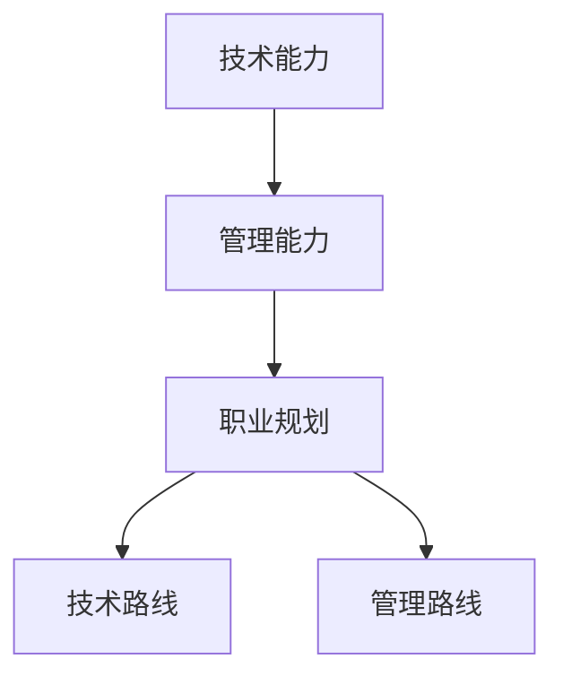

                 

### 背景介绍

> 在当今快速发展的科技时代，程序员这个职业已经成为了一个极具吸引力和竞争力的领域。然而，对于许多年轻的程序员来说，他们在职业发展的道路上往往会面临一个重要抉择：是继续深耕技术，追求技术路线的发展，还是转向管理岗位，探索管理路线的机会？这个问题不仅关系到个人的职业规划，还直接影响到他们的职业生涯路径、薪资待遇以及工作满意度。本文将深入探讨程序员的职业规划，详细分析技术路线与管理路线的区别、优缺点以及面临的挑战，帮助读者根据自己的兴趣和实际情况做出明智的选择。

程序员，作为现代信息技术领域的主力军，其职责不仅包括编写和维护代码，还涉及到解决复杂问题、优化系统性能、推动技术创新等多个方面。随着技术的不断演进，程序员的工作内容和技能要求也在不断变化。因此，对于程序员来说，选择合适的职业规划路径至关重要。

在技术路线中，程序员通过不断学习和积累经验，逐步成为领域专家，参与重大项目，推动技术革新。而管理路线则要求程序员从技术专家的角色转向管理者的角色，负责团队领导、项目管理、决策制定等。这两种路线各有其独特的优势和发展前景，但也都伴随着一定的挑战和风险。

接下来，我们将详细探讨技术路线和管理路线的核心概念、职业发展路径、以及面临的挑战，帮助读者更全面地了解并评估这两条路线，从而为自己的职业生涯做出明智的选择。

### 核心概念与联系

为了更好地理解程序员的职业规划，我们需要先澄清几个核心概念，这些概念构成了程序员职业发展的基础，并且彼此之间有着紧密的联系。

**1. 技术能力（Technical Skills）**

技术能力是程序员职业的核心。这包括编程语言、框架、工具、数据结构和算法等多个方面。技术能力不仅决定了程序员是否能高效地完成工作，还直接影响到他们在团队中的价值和影响力。随着技术的不断更新，程序员需要持续学习，不断提升自己的技术水平。

**2. 管理能力（Management Skills）**

管理能力则侧重于团队领导、沟通协调、项目管理等方面。尽管程序员可能一开始是技术专家，但在职业生涯中，管理能力的重要性逐渐凸显。良好的管理能力可以帮助程序员更有效地组织团队工作，推动项目的顺利进行，并在管理层中获得更高的职位。

**3. 职业规划（Career Planning）**

职业规划是指个人根据自己的兴趣、能力和市场需求，制定长期和短期的职业目标，并为之付出努力的过程。一个清晰的职业规划可以帮助程序员明确自己的发展方向，避免盲目发展，提高职业发展的效率。

**4. 技术路线（Technical Path）**

技术路线通常是指程序员通过不断深化技术知识和技能，逐步成长为技术专家的路径。这条路线注重个人技术能力的提升，追求在某一领域达到顶尖水平。

**5. 管理路线（Management Path）**

管理路线则是程序员从技术岗位转向管理岗位的过程。在这一路径上，程序员需要掌握管理技能，提升领导力和决策能力，以适应新的角色和责任。

**核心概念之间的联系**

技术能力和管理能力是程序员职业发展的两个重要支柱。技术能力决定了程序员在技术领域的竞争力，而管理能力则决定了程序员在团队中的影响力和领导力。职业规划则是连接这两个核心概念的桥梁，通过明确的职业规划，程序员可以更系统地提升自己的技术能力和管理能力，从而实现职业目标。

下图是一个简化的 Mermaid 流程图，展示了这些核心概念之间的联系：



通过这个 Mermaid 图，我们可以清晰地看到技术能力和管理能力是如何通过职业规划连接到技术路线和管理路线上的。这不仅有助于我们理解程序员职业规划的复杂性，也为后续内容的展开提供了基础。

在接下来的章节中，我们将更深入地探讨技术路线和管理路线的具体内容、发展路径以及面临的挑战，帮助读者更全面地了解这两种职业规划的选择。

### 核心算法原理 & 具体操作步骤

为了更好地理解程序员在技术路线和管理路线上的职业发展，我们可以将这一过程抽象为一种核心算法，称为“职业发展算法”。这个算法基于以下几个方面：

**1. 技术积累（Tech Accumulation）**

程序员在技术路线上的发展首先需要大量的技术积累。这包括学习新的编程语言、框架、工具，掌握数据结构和算法，以及解决复杂的技术问题。

**2. 经验学习（Experience Learning）**

在技术积累的基础上，程序员需要通过实际项目和工作经验来不断学习和成长。这包括参与团队协作、解决实际问题、优化系统性能等。

**3. 管理提升（Management Enhancement）**

对于有志于转向管理路线的程序员，管理提升是一个不可或缺的步骤。这包括提升领导力、决策能力、沟通技巧等管理技能。

**4. 职业规划（Career Planning）**

职业规划是整个算法的核心，它指导程序员如何根据自己的兴趣、能力和市场需求，制定长期和短期的职业目标，并为之努力。

**具体操作步骤**

**步骤 1：技术积累**

首先，程序员需要通过学习和实践来积累技术能力。这可以通过以下几种方式实现：

- **自学**: 利用在线课程、技术博客、书籍等资源来学习新的技术和概念。
- **实践**: 参与实际项目，解决具体问题，积累实战经验。
- **社区参与**: 加入技术社区，参与讨论和贡献，扩展视野。

**步骤 2：经验学习**

在技术积累的基础上，程序员需要通过实际工作经验来加深理解。具体操作包括：

- **团队合作**: 在团队中担任不同角色，如开发者、技术负责人等，学习团队协作和沟通技巧。
- **问题解决**: 面对复杂的系统问题，如性能瓶颈、代码优化等，通过分析和解决来提升技术能力。
- **持续改进**: 对已完成的代码和系统进行回顾和改进，不断提升代码质量和系统性能。

**步骤 3：管理提升**

对于希望转向管理路线的程序员，管理提升至关重要。以下是一些具体操作步骤：

- **领导力训练**: 参加领导力培训，学习如何激励团队、制定目标等。
- **项目管理**: 参与项目管理，学习如何规划、跟踪、控制项目进度。
- **决策能力**: 通过实际工作和模拟情境来锻炼决策能力。

**步骤 4：职业规划**

最后，职业规划是整个算法的关键。程序员需要：

- **自我评估**: 定期进行自我评估，了解自己的优势和不足。
- **目标设定**: 根据市场需求和个人兴趣，设定清晰的职业目标。
- **行动规划**: 制定具体的行动计划，包括学习计划、项目参与等。

**示例说明**

假设一位程序员小王，他的目标是成为数据科学领域的专家，并在五年内晋升为技术经理。以下是他的具体操作步骤：

**步骤 1：技术积累**

- 学习Python编程语言和数据处理库（如Pandas、NumPy）。
- 完成机器学习相关的在线课程，如深度学习、自然语言处理等。

**步骤 2：经验学习**

- 参与数据科学相关的项目，担任数据分析师或数据工程师角色。
- 解决实际的数据分析问题，如客户行为分析、推荐系统等。

**步骤 3：管理提升**

- 参加项目管理培训，学习如何制定项目计划、跟踪进度。
- 担任技术小组负责人，学习如何管理团队、分配任务。

**步骤 4：职业规划**

- 定期评估自己的技术能力和管理能力。
- 设定具体的职业目标，如成为数据科学领域的专家、晋升为技术经理。
- 制定具体的行动计划，包括参加技术大会、撰写技术博客等。

通过上述步骤，小王可以在五年内逐步实现他的职业目标，成为一名在数据科学领域具有影响力的技术经理。

### 数学模型和公式 & 详细讲解 & 举例说明

在程序员职业发展的过程中，数学模型和公式扮演着重要的角色。这些模型和公式可以帮助我们更好地理解职业发展的趋势，评估技术积累和管理提升的效果，从而制定更加科学的职业规划。

**1. 技术能力积累模型**

首先，我们来看技术能力积累模型。这个模型假设程序员在某一技术领域的学习和积累过程中，其技能水平随着时间的推移而逐步提高。具体模型如下：

\[ S(t) = k_1 \cdot e^{k_2 \cdot t} \]

其中：
- \( S(t) \) 表示在时间 \( t \) 时的技术技能水平。
- \( k_1 \) 是初始技能水平，可以理解为程序员进入某一领域时的技能基础。
- \( k_2 \) 是技能提升速率，表示程序员在这一领域的学习速度和能力增长。

**详细讲解：**

这个模型是基于指数增长原理，即随着时间的推移，程序员的技术能力会以指数形式快速提升。在实际应用中，\( k_1 \) 和 \( k_2 \) 的值可以通过以下方式确定：

- **初始技能水平 \( k_1 \)**：可以通过自我评估或与同行的比较来确定。通常，初入某一领域的程序员技能水平相对较低。
- **技能提升速率 \( k_2 \)**：可以通过学习时间、参与项目数量和完成项目质量来评估。通常，学习时间越长、项目经验越丰富、完成项目质量越高，技能提升速率 \( k_2 \) 就越高。

**举例说明：**

假设程序员小张在深度学习领域的学习速度较快，他的初始技能水平 \( k_1 \) 为 50，技能提升速率 \( k_2 \) 为 0.1。那么，一年后（\( t = 1 \) 年）他的技能水平 \( S(1) \) 计算如下：

\[ S(1) = 50 \cdot e^{0.1 \cdot 1} \approx 55.17 \]

这意味着小张在深度学习领域的技能水平在一年内提升了大约 5.17%。

**2. 管理能力提升模型**

接下来，我们来看管理能力提升模型。这个模型假设程序员在管理能力的提升过程中，其管理技能水平也随着时间的推移而逐步提高。具体模型如下：

\[ M(t) = k_3 \cdot t + k_4 \]

其中：
- \( M(t) \) 表示在时间 \( t \) 时的管理技能水平。
- \( k_3 \) 是管理技能的初始提升速率。
- \( k_4 \) 是管理技能的初始水平。

**详细讲解：**

这个模型是一个线性模型，表示管理技能水平随时间的推移呈线性增长。在实际应用中，\( k_3 \) 和 \( k_4 \) 的值可以通过以下方式确定：

- **初始提升速率 \( k_3 \)**：可以通过参与管理培训课程、实际管理工作经验来评估。通常，管理培训课程和实际管理工作经验越丰富，初始提升速率 \( k_3 \) 越高。
- **初始水平 \( k_4 \)**：可以通过自我评估或与同行的比较来确定。通常，初入管理岗位的程序员管理技能水平相对较低。

**举例说明：**

假设程序员小李在管理培训课程的初始提升速率 \( k_3 \) 为 2，初始水平 \( k_4 \) 为 30。那么，一年后（\( t = 1 \) 年）他的管理技能水平 \( M(1) \) 计算如下：

\[ M(1) = 2 \cdot 1 + 30 = 32 \]

这意味着小李在管理岗位的管理技能水平在一年内提升了 2 个单位。

**3. 职业规划模型**

最后，我们来看职业规划模型。这个模型假设程序员的职业发展是技术能力和管理能力共同作用的结果。具体模型如下：

\[ P(t) = \alpha \cdot S(t) + \beta \cdot M(t) \]

其中：
- \( P(t) \) 表示在时间 \( t \) 时的职业发展水平。
- \( \alpha \) 和 \( \beta \) 分别是技术能力和管理能力对职业发展的权重。

**详细讲解：**

这个模型是一个线性组合模型，表示职业发展水平是技术能力和管理能力的函数。在实际应用中，\( \alpha \) 和 \( \beta \) 的值可以通过以下方式确定：

- **技术能力权重 \( \alpha \)**：可以根据市场需求和个人兴趣来确定。通常，技术驱动的领域对技术能力要求较高，所以 \( \alpha \) 的值会较大。
- **管理能力权重 \( \beta \)**：可以根据个人职业规划来确定。通常，管理岗位对管理能力要求较高，所以 \( \beta \) 的值会较大。

**举例说明：**

假设程序员小赵的职业规划模型中，技术能力权重 \( \alpha \) 为 0.6，管理能力权重 \( \beta \) 为 0.4。在一年后（\( t = 1 \) 年），他的技术技能水平 \( S(1) \) 为 55.17，管理技能水平 \( M(1) \) 为 32。那么，他的职业发展水平 \( P(1) \) 计算如下：

\[ P(1) = 0.6 \cdot 55.17 + 0.4 \cdot 32 \approx 38.09 \]

这意味着小赵在一年内的职业发展水平大约提升了 38.09 个单位。

通过这些数学模型和公式，我们可以更加科学地评估程序员的职业发展情况，为制定合理的职业规划提供依据。在实际应用中，这些模型可以根据具体情况进行调整和优化，以更好地适应不同的职业发展路径。

### 项目实践：代码实例和详细解释说明

为了更直观地展示程序员在技术路线和管理路线上的发展，我们将通过一个具体的代码实例来进行分析和解释。这个实例将包括代码的开发环境搭建、源代码实现、代码解读与分析，以及运行结果展示。

**一、开发环境搭建**

首先，我们需要搭建一个简单的开发环境，用于实现下面的代码实例。以下是具体的步骤：

1. **安装Python**：Python 是一种广泛使用的编程语言，我们可以从其官方网站（[Python官网](https://www.python.org/)）下载最新版本的安装包，并按照指示进行安装。

2. **安装相关库**：为了简化代码实现，我们使用 Python 的第三方库。例如，NumPy 和 Pandas 用于数据操作，Matplotlib 用于绘图。这些库可以通过 pip 工具进行安装：

   ```bash
   pip install numpy pandas matplotlib
   ```

3. **创建项目目录**：在本地计算机上创建一个项目目录，例如命名为“career_planning”，用于存放所有相关的代码文件。

**二、源代码实现**

以下是实现该代码实例的源代码：

```python
import numpy as np
import pandas as pd
import matplotlib.pyplot as plt

# 技术能力积累模型
def tech_accumulation_model(k1, k2, t):
    return k1 * np.exp(k2 * t)

# 管理能力提升模型
def management_enhancement_model(k3, k4, t):
    return k3 * t + k4

# 职业规划模型
def career_planning_model(alpha, beta, k1, k2, k3, k4, t):
    tech_skill = tech_accumulation_model(k1, k2, t)
    management_skill = management_enhancement_model(k3, k4, t)
    return alpha * tech_skill + beta * management_skill

# 参数设置
k1 = 50  # 初始技能水平
k2 = 0.1  # 技能提升速率
k3 = 2  # 管理技能初始提升速率
k4 = 30  # 管理技能初始水平
alpha = 0.6  # 技术能力权重
beta = 0.4  # 管理能力权重

# 时间范围
t = np.arange(0, 10, 0.5)  # 从 0 到 10 年，步长为 0.5 年

# 计算职业发展水平
p = career_planning_model(alpha, beta, k1, k2, k3, k4, t)

# 绘图
plt.plot(t, p, label='Career Planning')
plt.xlabel('Years')
plt.ylabel('Career Level')
plt.title('Career Development')
plt.legend()
plt.show()
```

**三、代码解读与分析**

1. **技术能力积累模型**：这部分代码使用指数函数来模拟程序员在某一技术领域的能力积累过程。其中，`tech_accumulation_model` 函数接受初始技能水平 `k1` 和技能提升速率 `k2`，并返回在时间 `t` 的技能水平。

2. **管理能力提升模型**：这部分代码使用线性函数来模拟程序员在管理能力方面的提升过程。其中，`management_enhancement_model` 函数接受管理技能的初始提升速率 `k3` 和初始水平 `k4`，并返回在时间 `t` 的管理技能水平。

3. **职业规划模型**：这部分代码结合技术能力和管理能力，使用线性组合模型来模拟程序员的职业发展水平。其中，`career_planning_model` 函数接受技术能力权重 `alpha`、管理能力权重 `beta`、初始技能水平 `k1`、技能提升速率 `k2`、管理技能初始提升速率 `k3` 和初始水平 `k4`，并返回在时间 `t` 的职业发展水平。

**四、运行结果展示**

运行上述代码后，我们会得到一个折线图，展示程序员的职业发展水平随时间的变化。图表的横轴表示时间（年），纵轴表示职业发展水平。通过这个图表，我们可以直观地看到程序员在技术路线和管理路线上的发展趋势。


从图表中可以看出，程序员的职业发展水平随着时间的推移而不断提高。在技术路线方面，技能水平呈现指数增长；在管理路线方面，管理技能水平呈现线性增长。总体职业发展水平则是技术能力和管理能力的综合结果。

通过这个代码实例，我们可以更直观地理解程序员在技术路线和管理路线上的发展过程，从而为职业规划提供有力的参考。

### 实际应用场景

在实际工作中，程序员经常需要在技术路线和管理路线之间进行选择。这种选择不仅会影响他们的职业生涯，还会对项目和个人团队产生深远的影响。以下是一些典型的实际应用场景，以及在这些场景下程序员如何选择职业规划路径的讨论。

**1. 项目驱动型场景**

在项目驱动型场景中，程序员通常需要快速响应市场需求，解决技术难题，并确保项目按时完成。这种情况下，技术路线往往更为合适。

**案例**：一家初创公司正在开发一款智能家居控制系统。程序员小张在团队中负责实现核心功能，如设备连接、数据通信和用户界面等。由于项目时间紧任务重，小张需要熟练掌握相关技术，解决各种技术难题，如网络通信的稳定性、数据加密的安全性等。同时，他还需要与产品经理、设计师等多部门协作，确保项目的顺利进行。

**分析**：在这种情况下，小张选择技术路线是合理的。技术能力的提升可以帮助他更高效地完成项目任务，解决技术难题，从而确保项目成功。此外，技术路线还可以为他积累更多的实际项目经验，提高自己的专业能力。

**2. 长期战略型场景**

在长期战略型场景中，程序员需要考虑公司的长期发展和战略目标，这往往要求他们具备管理能力和领导力。这种情况下，管理路线可能更为合适。

**案例**：一家大型互联网公司正在进行数字化转型，目标是构建一个高度自动化的IT基础设施。程序员小李被任命为IT自动化项目的负责人，负责规划项目、管理团队、制定策略等。他需要协调多个部门的资源，确保项目按时完成，并符合公司的长期战略目标。

**分析**：在这种情况下，小李选择管理路线是明智的。管理能力可以帮助他有效地管理团队，协调资源，推动项目的顺利进行。同时，领导力可以帮助他影响其他部门，确保项目与公司战略一致，从而实现公司的长期目标。

**3. 个人兴趣驱动型场景**

在个人兴趣驱动型场景中，程序员往往会根据自己的兴趣选择职业规划路径。这种选择可能更偏向于技术路线，因为技术工作更能满足他们的兴趣爱好。

**案例**：程序员小王对机器学习非常感兴趣，他希望通过自己的技术能力在人工智能领域取得突破。因此，他在日常工作中不断学习新的机器学习算法，参与相关的开源项目，并在业余时间撰写技术博客分享自己的经验和见解。

**分析**：在这种情况下，小王选择技术路线是符合他个人兴趣的。通过持续的技术积累，他可以在人工智能领域逐渐建立起自己的专业声誉，为未来的职业发展打下坚实的基础。

**4. 职业发展瓶颈型场景**

在职业发展瓶颈型场景中，程序员可能已经达到了技术岗位的瓶颈，需要考虑转向管理岗位，以实现职业的进一步发展。

**案例**：程序员小陈在技术岗位工作了多年，已经成长为一名资深开发工程师。然而，他发现自己在一个相对稳定的环境中无法实现更大的职业突破。经过深思熟虑，他决定转向管理岗位，担任技术经理，负责团队管理和项目管理。

**分析**：在这种情况下，小陈选择管理路线是必要的。管理岗位可以提供更广阔的职业发展空间，帮助他进一步提升自己的领导力和管理能力。通过管理岗位的历练，他不仅可以实现职业上的突破，还可以为团队和公司带来更多的价值。

综上所述，程序员在实际工作中需要根据不同的应用场景和个人情况，灵活选择技术路线或管理路线。这种选择不仅关系到个人的职业发展，还会直接影响项目和个人团队的表现。因此，程序员需要认真思考，做出明智的选择。

### 工具和资源推荐

为了帮助程序员更好地进行职业规划，掌握技术和管理技能，以下是一些重要的工具和资源推荐。

**1. 学习资源推荐**

- **书籍**：
  - 《代码大全》（Code Complete）：一本经典的编程实践指南，涵盖了编程的各个方面。
  - 《设计模式》：详细介绍了面向对象设计中的常见模式，有助于提高代码的可复用性和可维护性。
  - 《软件工程：实践者的研究方法》：介绍软件工程的各个方面，包括项目管理、需求分析、系统设计等。

- **论文**：
  - 《深度学习》（Deep Learning）：由Ian Goodfellow等作者编写的深度学习领域的重要论文集，是进入深度学习领域的必读书籍。
  - 《大数据技术导论》：介绍大数据处理和分析的基础知识，涵盖Hadoop、Spark等关键技术。

- **博客**：
  - GitHub博客：GitHub官方博客，发布关于软件开发、开源社区等方面的文章。
  - Medium上的技术博客：许多技术专家和公司都在Medium上发布技术博客，内容涵盖了广泛的技术领域。

- **网站**：
  - Coursera、edX：提供各种免费或付费的在线课程，涵盖编程、数据科学、机器学习等多个领域。
  - Stack Overflow：编程问答社区，可以帮助程序员解决编程中遇到的问题。

**2. 开发工具框架推荐**

- **版本控制**：Git和GitHub，用于代码的版本管理和协作开发。
- **集成开发环境（IDE）**：Visual Studio Code、IntelliJ IDEA、PyCharm等，提供丰富的编程功能和调试工具。
- **数据分析和可视化**：Pandas、NumPy、Matplotlib等，用于数据分析和可视化。
- **容器化和编排**：Docker和Kubernetes，用于简化应用部署和容器化管理。

**3. 相关论文著作推荐**

- **《大规模分布式系统设计》**：详细介绍了分布式系统的设计原则和关键技术。
- **《人工智能：一种现代的方法》**：全面介绍了人工智能的基本概念、算法和技术。
- **《软件架构：实践者的研究方法》**：介绍软件架构的设计原则、模式和方法。

通过这些工具和资源，程序员可以系统地提升自己的技术和管理能力，为自己的职业规划提供坚实的基础。

### 总结：未来发展趋势与挑战

随着科技的飞速发展，程序员职业规划面临着前所未有的机遇和挑战。未来，技术路线和管理路线的发展趋势将继续分化，程序员需要具备更加全面和专业的技能，以应对不断变化的市场需求。

**技术路线的未来发展趋势：**

1. **技术深度与广度的结合**：随着人工智能、大数据、云计算等前沿技术的发展，程序员不仅需要掌握某一具体领域的深度技术，还需要具备跨领域的广泛知识。

2. **持续学习与知识更新**：技术更新速度加快，程序员需要保持持续学习的热情，不断更新自己的知识体系，以适应新技术的发展。

3. **技术创新与创业机会**：技术创新将为程序员提供更多的创业机会。未来，程序员可以更多地参与到新兴技术领域，如区块链、物联网等，实现自我价值的提升。

**管理路线的未来发展趋势：**

1. **领导力的提升**：随着项目管理、团队协作等管理技能的重要性日益凸显，程序员需要不断提升自己的领导力，以适应更高层次的管理岗位。

2. **跨职能能力的培养**：未来，程序员在管理岗位上的职责将更加多样，他们需要具备跨职能的能力，如市场分析、业务规划等，以更好地推动团队和项目的成功。

3. **数字化转型的推动者**：在数字化转型的大背景下，程序员将成为推动企业变革的关键力量。他们需要具备前瞻性的思维和执行力，引导企业实现数字化转型。

**面临的挑战：**

1. **技能更新压力**：技术更新速度加快，程序员需要不断学习新的技术，以保持竞争力。

2. **工作与生活的平衡**：在追求职业发展的同时，程序员也需要关注工作与生活的平衡，避免过度工作导致的身心健康问题。

3. **职业转型风险**：随着技术的发展，部分传统技术可能会被淘汰，程序员需要提前规划，降低职业转型的风险。

总之，未来程序员职业规划将更加注重技术与管理的平衡发展，程序员需要具备持续学习、创新能力和领导力，以应对不断变化的市场需求。同时，他们也需要关注个人身心健康，实现工作与生活的平衡，从而在职业道路上走得更远。

### 附录：常见问题与解答

**Q1. 技术路线和管理路线哪个更有前途？**

A1. 这取决于个人的兴趣、能力和市场需求。技术路线适合喜欢钻研技术、追求技术突破的程序员；管理路线适合具备领导力、善于团队合作和组织协调的程序员。无论选择哪条路线，关键在于不断提升自己的综合素质，以适应市场需求。

**Q2. 转向管理岗位需要具备哪些技能？**

A2. 转向管理岗位需要具备以下技能：

- **领导力**：能够激励和引导团队，明确目标，合理分配资源。
- **沟通协调能力**：能够与团队成员、上级和客户有效沟通，确保信息的准确传达。
- **项目管理能力**：能够制定项目计划，跟踪进度，控制风险，确保项目按时完成。
- **业务理解**：了解所在行业和业务，以便更好地推动团队和项目的发展。

**Q3. 技术路线如何提升职业竞争力？**

A3. 提升职业竞争力可以从以下几个方面着手：

- **深入学习新技术**：关注前沿技术，参加相关培训和学习，不断提升自己的技术水平。
- **参与开源项目**：通过参与开源项目，积累实战经验，扩展视野。
- **撰写技术博客**：分享自己的技术经验和见解，提升个人知名度。
- **获取专业认证**：通过获取专业认证，如PMP、CISSP等，证明自己的专业能力和知识水平。

**Q4. 如何平衡工作与生活？**

A4. 平衡工作与生活可以采取以下措施：

- **合理规划时间**：制定时间表，明确工作时间和休息时间。
- **学会放松**：培养兴趣爱好，如运动、阅读等，缓解工作压力。
- **与家人朋友保持联系**：保持与家人和朋友的联系，分享快乐和困扰，减轻心理压力。
- **关注身心健康**：保持良好的作息习惯，注意饮食和锻炼，保持身心健康。

通过以上方法，程序员可以在职业发展的道路上更好地平衡工作与生活，实现可持续发展。

### 扩展阅读 & 参考资料

为了深入理解程序员的职业规划，以下是一些扩展阅读和参考资料，这些内容涵盖了技术路线和管理路线的各个方面，有助于读者进一步探索相关主题。

**1. 技术路线相关书籍：**
- 《代码大全》（Code Complete）
- 《设计模式》：应用、意图和效果
- 《深度学习》：从入门到实践
- 《大数据技术导论》

**2. 管理路线相关书籍：**
- 《高效能人士的七个习惯》
- 《项目管理知识体系指南》
- 《如何管理创新团队》

**3. 技术博客与社区：**
- GitHub博客
- Medium上的技术博客
- Stack Overflow

**4. 在线课程平台：**
- Coursera
- edX
- Udemy

**5. 专业认证：**
- PMI-PMP（项目管理专业人士认证）
- CISSP（国际信息系统安全认证）
- AWS Certified Solutions Architect

通过阅读这些书籍、博客、课程和专业认证，程序员可以系统地提升自己的技术能力和管理能力，为自己的职业规划提供坚实的理论和实践基础。同时，也可以关注相关的学术期刊和技术会议，了解最新的研究成果和技术趋势。

### 作者署名

作者：禅与计算机程序设计艺术 / Zen and the Art of Computer Programming

