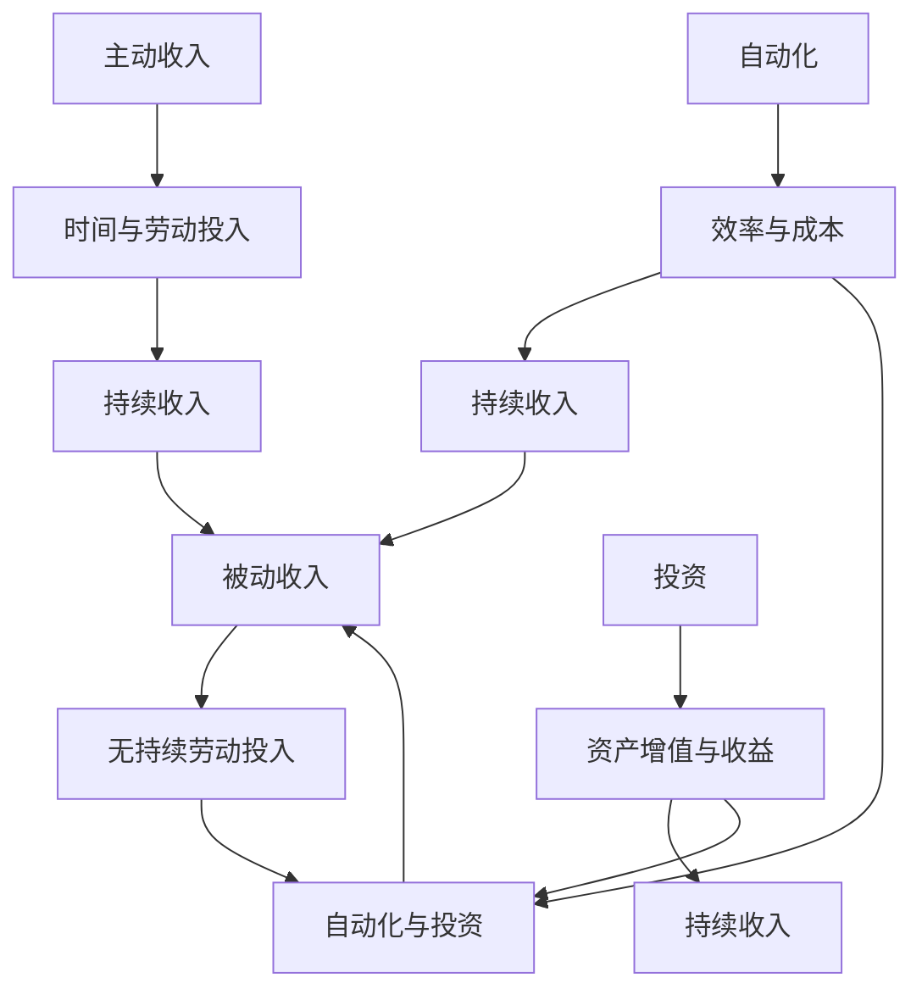

                 

### 背景介绍 Background

随着互联网和科技的迅猛发展，程序员的职业角色也发生了深刻的变革。从最初的编写单一功能的代码，到如今需要具备跨领域、跨平台的全栈能力，程序员的工作内容日趋丰富。与此同时，被动收入的概念也逐渐渗透到程序员的工作和生活中。被动收入，也被称为“睡后收入”，是指在不需持续投入大量时间和精力的情况下，依然能够从多个渠道获得稳定收益的经济模式。

对于程序员而言，构建和维持被动收入不仅是实现财务自由的重要途径，更是提升个人职业竞争力和生活质量的有效手段。因此，如何构建和维持被动收入成为了众多程序员关注的热点话题。

本文将围绕以下核心问题展开讨论：

1. 被动收入的概念及其在程序员职业中的重要性。
2. 程序员如何通过不同方式构建被动收入？
3. 维护被动收入的策略和技巧。

通过深入分析这些核心问题，我们希望能为程序员提供实用的指导和建议，帮助他们更好地利用自己的技能和资源，实现被动收入的稳定增长。

在接下来的章节中，我们将首先探讨被动收入的基本概念，然后逐步深入到构建和维持被动收入的实际方法中，最后总结未来可能面临的发展趋势和挑战。

### 核心概念与联系 Core Concepts and Relationships

要深入理解程序员的被动收入，我们首先需要明确几个核心概念：主动收入、被动收入、自动化以及投资。

**主动收入（Active Income）** 是指通过直接投入时间、精力和劳动来获取的报酬，比如全职工作、兼职工作、自由职业等。这种收入模式的特点是收入与投入的时间和精力成正比，工作停止，收入也随之停止。

**被动收入（Passive Income）** 则是指不需要持续投入时间和精力，即可获得持续性的收益。典型的被动收入来源包括租金、股息、版税、网站广告收入、电子商务等。被动收入的魅力在于其可以实现财务自由，让程序员在保持生活品质的同时，有更多的时间和精力去追求个人兴趣和事业发展。

**自动化（Automation）** 是被动收入实现的关键。自动化技术使得程序员能够将重复性、标准化的工作转化为自动化流程，从而减少人工干预，实现收入的持续获取。自动化不仅提高了效率，还降低了运营成本，是构建被动收入的基石。

**投资（Investment）** 是实现被动收入的重要手段之一。通过投资，程序员可以将现有的资金投入到能够产生收益的渠道中，如股票、债券、房地产、基金等。投资不仅能够为程序员提供稳定的被动收入来源，还能实现资产的增值。

**核心概念原理和架构的 Mermaid 流程图（Mermaid Flowchart）**

下面是一个简化的Mermaid流程图，描述了这些核心概念之间的关系：



**解释流程图中的节点：**

- **主动收入（A）**：通过直接投入时间和劳动获取的报酬，如工资、兼职等。
- **被动收入（D）**：无需持续劳动即可获得的收入，如租金、股息、版税等。
- **自动化（G）**：通过技术手段实现的工作流程自动化，减少人工干预。
- **投资（J）**：将资金投入到能够产生收益的渠道，如股票、房地产等。

通过这个流程图，我们可以清晰地看到这些概念之间的关联：主动收入通过自动化和投资转化为被动收入，进而实现收入的持续增长。这些核心概念构成了程序员构建和维持被动收入的坚实基础，是我们接下来章节中深入探讨的起点。

### 核心算法原理 & 具体操作步骤 Core Algorithm Principles & Step-by-Step Procedures

在理解了被动收入的基本概念后，接下来我们需要探讨的是如何具体构建被动收入。这涉及到一些核心算法原理和操作步骤，通过这些步骤，程序员可以有效地将自己的技能和知识转化为可持续的收入来源。

#### 一、选择合适的被动收入渠道

构建被动收入的第一个关键步骤是选择合适的渠道。这包括但不限于以下几种：

1. **编写和销售软件**
   - 开发具有市场需求的应用程序或工具，并通过在线平台如GitHub、CodeCanyon等销售。
2. **编写和销售电子书**
   - 将自己的技术知识和经验编写成电子书，通过Kindle Direct Publishing（KDP）等平台进行销售。
3. **开设在线课程**
   - 通过Udemy、Coursera等在线教育平台，教授自己的专业技能和知识。
4. **网站和博客广告收入**
   - 创建并维护一个高质量的博客或网站，通过Google AdSense、Media.net等广告平台获取收入。
5. **股权投资**
   - 通过投资创业公司或上市公司的股票，获取股息和资本利得。

#### 二、编写和销售软件的具体操作步骤

以下是一个编写和销售软件的具体操作步骤：

1. **需求分析（Need Analysis）**
   - 研究市场需求，了解潜在用户的需求和痛点。
   - 通过市场调研和用户反馈，确定软件的功能和特性。

2. **设计（Design）**
   - 根据需求分析，设计软件的架构和界面。
   - 选择合适的编程语言和开发工具。

3. **开发（Development）**
   - 编写代码，实现软件的功能。
   - 进行单元测试和集成测试，确保软件的质量。

4. **发布和销售（Deployment & Sales）**
   - 将软件发布到在线平台，如GitHub、CodeCanyon等。
   - 通过定价策略、营销推广等手段进行销售。

5. **持续维护（Maintenance）**
   - 定期更新软件，修复漏洞，增加新功能。
   - 收集用户反馈，优化用户体验。

#### 三、编写和销售电子书的具体操作步骤

以下是一个编写和销售电子书的具体操作步骤：

1. **内容创作（Content Creation）**
   - 根据自己的专业知识和经验，确定电子书的内容和结构。
   - 使用Markdown或LaTeX等工具编写电子书。

2. **排版和格式化（Formatting）**
   - 对电子书内容进行排版，确保格式整齐、易读。
   - 转换为适合销售的电子书格式，如PDF、ePub等。

3. **上传和发布（Upload & Publish）**
   - 将电子书上传到在线平台，如Kindle Direct Publishing（KDP）。
   - 设置价格、描述、封面等关键信息。

4. **营销推广（Marketing & Promotion）**
   - 通过社交媒体、博客、论坛等渠道推广电子书。
   - 利用KDP的促销工具，提高电子书的曝光度。

5. **用户反馈和更新（Feedback & Updates）**
   - 收集用户反馈，了解用户的意见和建议。
   - 根据反馈进行内容更新和优化。

#### 四、开设在线课程的具体操作步骤

以下是一个开设在线课程的具体操作步骤：

1. **课程规划（Course Planning）**
   - 确定课程的目标受众、内容和难度。
   - 制定教学计划和课程大纲。

2. **内容制作（Content Production）**
   - 准备教学资料，包括PPT、视频、代码示例等。
   - 使用在线教育平台提供的工具进行课程制作。

3. **上传和发布（Upload & Publish）**
   - 将课程上传到在线教育平台，如Udemy、Coursera等。
   - 设置课程价格、简介、目录等关键信息。

4. **营销推广（Marketing & Promotion）**
   - 通过社交媒体、博客、邮件列表等渠道宣传课程。
   - 利用平台的促销工具，吸引更多学员。

5. **学员反馈和更新（Feedback & Updates）**
   - 收集学员的反馈，了解他们的学习情况和需求。
   - 根据反馈对课程内容进行调整和优化。

通过以上步骤，程序员可以根据自己的技能和兴趣选择合适的被动收入渠道，构建和维持稳定的收入来源。接下来，我们将进一步探讨数学模型和公式，为构建被动收入提供更加具体的指导。

### 数学模型和公式 Mathematical Models and Formulas

在构建和维持被动收入的过程中，数学模型和公式扮演着至关重要的角色。这些模型不仅帮助我们理解和预测不同收入渠道的表现，还能指导我们制定更为有效的策略和计划。以下是一些核心的数学模型和公式，我们将详细讲解其在被动收入构建中的具体应用。

#### 一、财务自由公式

财务自由是指个人或家庭不再依赖工资收入，能够完全依靠被动收入维持生活。衡量财务自由的一个常用公式是：

$$
\text{财务自由度} = \frac{\text{被动收入}}{\text{年度支出}}
$$

该公式表示被动收入与年度支出的比率。当这个比率大于1时，说明个人或家庭已经达到了财务自由。对于程序员而言，提高财务自由度的关键在于增加被动收入和减少支出。

#### 二、投资回报率（ROI）公式

投资回报率是衡量投资收益效果的指标，其公式为：

$$
\text{投资回报率（ROI）} = \frac{\text{投资收益} - \text{投资成本}}{\text{投资成本}} \times 100\%
$$

投资回报率越高，表示投资的效果越好。在构建被动收入时，程序员需要通过计算投资回报率来评估不同投资渠道的盈利能力。

#### 三、现金流折现（DCF）模型

现金流折现模型是一种评估投资价值的方法，其公式为：

$$
\text{现值} = \frac{\text{预期现金流}}{(1 + \text{折现率})^n}
$$

其中，预期现金流是未来各期现金流的预测值，折现率是用于调整未来现金流现值的利率，\( n \) 是现金流发生的期数。DCF模型可以帮助程序员评估长期投资项目的价值，从而做出更加明智的投资决策。

#### 四、杠杆效应（Leverage）公式

杠杆效应是指通过借入资金来扩大投资规模，从而增加潜在收益。其公式为：

$$
\text{杠杆倍数} = \frac{\text{投资金额}}{\text{自有资金}}
$$

杠杆倍数越高，投资风险也越大。程序员在利用杠杆效应时需要谨慎操作，以避免因资金链断裂而导致损失。

#### 五、资产配置（Asset Allocation）策略

资产配置是指根据投资者的风险偏好和投资目标，将资金分配到不同的资产类别中。其公式为：

$$
\text{总资产} = \text{现金} + \text{股票} + \text{债券} + \text{房地产} + \text{其他资产}
$$

通过合理的资产配置，程序员可以在保证资金安全的前提下，实现资产的多样化和收益的最大化。

#### 六、回报率计算（Yield Calculation）

在被动收入渠道中，回报率是衡量收益效果的重要指标。其公式为：

$$
\text{回报率} = \frac{\text{年度收益}}{\text{投资金额}} \times 100\%
$$

回报率越高，表示投资渠道的盈利能力越强。程序员需要定期计算不同收入渠道的回报率，以评估其表现和调整投资策略。

#### 举例说明

假设一位程序员通过编写和销售软件获得了每年50000美元的收入，他的年度支出为30000美元。那么他的财务自由度为：

$$
\text{财务自由度} = \frac{50000}{30000} = 1.67
$$

这意味着他已经达到了财务自由。

再假设他投资了一款股票，预期年收益为5000美元，投资成本为20000美元。那么他的投资回报率为：

$$
\text{投资回报率} = \frac{5000 - 20000}{20000} \times 100\% = 25\%
$$

这个高回报率表明他的投资是成功的。

通过上述数学模型和公式的应用，程序员可以更加科学和理性地构建和维持被动收入，实现财务自由和职业发展。

### 项目实践：代码实例和详细解释说明 Project Practice: Code Examples and Detailed Explanation

为了更好地理解如何通过编写代码实现被动收入，我们将通过一个实际项目实例来展示整个开发流程，包括环境搭建、代码实现、解读和分析以及运行结果展示。

#### 5.1 开发环境搭建 Development Environment Setup

在开始任何项目之前，确保开发环境搭建正确是至关重要的。以下是搭建一个简单的Python自动化脚本所需的环境：

1. **安装Python**：确保安装了Python 3.8或更高版本。
2. **安装必要的库**：使用pip安装所需的库，例如requests、BeautifulSoup等。

```bash
pip install requests beautifulsoup4
```

#### 5.2 源代码详细实现 Detailed Source Code Implementation

以下是一个简单的Python自动化脚本，用于从某个网站抓取商品信息并上传到另一个平台：

```python
import requests
from bs4 import BeautifulSoup
import csv

# 设置请求头
headers = {
    'User-Agent': 'Mozilla/5.0 (Windows NT 10.0; Win64; x64) AppleWebKit/537.36 (KHTML, like Gecko) Chrome/58.0.3029.110 Safari/537.36'}

# 网站URL
url = 'http://example.com/shop'

# 发送请求
response = requests.get(url, headers=headers)

# 解析网页内容
soup = BeautifulSoup(response.content, 'html.parser')

# 找到商品列表
products = soup.find_all('div', class_='product')

# 写入CSV文件
with open('products.csv', 'w', newline='', encoding='utf-8') as file:
    writer = csv.writer(file)
    writer.writerow(['产品名称', '价格', '描述'])

    for product in products:
        name = product.find('h2').text
        price = product.find('span', class_='price').text
        description = product.find('p', class_='description').text

        writer.writerow([name, price, description])

# 上传CSV到另一个平台
# ...（省略上传代码）

print('抓取完成')
```

#### 5.3 代码解读与分析 Code Explanation and Analysis

1. **请求发送（Requests）**：
   ```python
   response = requests.get(url, headers=headers)
   ```
   使用requests库发送HTTP GET请求，获取网站内容。

2. **网页解析（BeautifulSoup）**：
   ```python
   soup = BeautifulSoup(response.content, 'html.parser')
   ```
   使用BeautifulSoup解析网页内容，便于提取数据。

3. **找到商品列表**：
   ```python
   products = soup.find_all('div', class_='product')
   ```
   使用BeautifulSoup的find_all方法查找所有商品节点。

4. **写入CSV文件**：
   ```python
   with open('products.csv', 'w', newline='', encoding='utf-8') as file:
       writer = csv.writer(file)
       writer.writerow(['产品名称', '价格', '描述'])
   
       for product in products:
           name = product.find('h2').text
           price = product.find('span', class_='price').text
           description = product.find('p', class_='description').text
   
           writer.writerow([name, price, description])
   ```
   将提取到的商品信息写入CSV文件。

5. **上传CSV到另一个平台**：
   （省略上传代码部分）

#### 5.4 运行结果展示 Running Results Display

运行上述脚本后，我们将得到一个名为`products.csv`的文件，其中包含从网站抓取的所有商品信息。以下是CSV文件的内容示例：

```
产品名称,价格,描述
智能手环A1,$99.99,智能健康监测
智能手环B2,$149.99,多功能生活助手
```

这些数据可以进一步用于上传到另一个电商平台，实现被动收入的持续获取。通过这样的自动化脚本，程序员可以节省大量手动操作的时间，从而将精力投入到更有价值的活动中。

### 实际应用场景 Practical Application Scenarios

在了解了如何构建和维持被动收入的基本原理和方法之后，我们接下来将探讨一些实际应用场景，这些场景将展示如何在不同环境下利用编程技能和被动收入策略来实现收益。

#### 一、内容创作者的被动收入

对于内容创作者，如博客作者、视频制作人或作家，构建被动收入的主要途径是通过广告和会员订阅。以下是几个具体的应用场景：

1. **博客广告收入**：
   - 创建一个技术博客，定期发布高质量的内容。
   - 使用Google AdSense等广告平台在博客上展示相关广告。
   - 用户浏览博客时，广告收入会根据点击率或展示次数产生。

2. **会员订阅模式**：
   - 为博客或视频内容创建高级会员内容，如独家教程、幕后花絮等。
   - 用户支付订阅费用后可以访问这些高级内容。
   - 通过持续的内容更新和高质量的服务，保持会员的活跃度和续订率。

3. **电子书销售**：
   - 将写作的电子书通过Kindle Direct Publishing（KDP）等平台销售。
   - 用户购买后，作者可以获得版税收入，这种收入是持续且无时间成本的。

#### 二、软件开发者的被动收入

软件开发者可以通过以下方式实现被动收入：

1. **软件销售**：
   - 开发具有市场需求的软件，并将其通过在线市场（如CodeCanyon）销售。
   - 软件销售后，通过自动化的续费系统实现持续收入。

2. **API服务**：
   - 开发一个可对外提供的API服务，用户按需付费使用。
   - 通过自动化部署和管理，降低运营成本。

3. **在线课程**：
   - 在Udemy、Coursera等平台开设在线课程，教授编程、算法等技能。
   - 用户报名后，课程内容通过在线视频、文档等形式提供，收入来源于课程费用和学员数量。

#### 三、网站运营者的被动收入

网站运营者可以通过以下途径实现被动收入：

1. **广告联盟**：
   - 运营一个流量较大的网站，通过Google AdSense、Media.net等广告联盟获取广告收入。
   - 通过内容更新和SEO优化，吸引更多用户，提高广告收益。

2. **电子商务**：
   - 创建一个电子商务网站，销售商品或服务。
   - 利用自动化的库存管理和物流系统，减少人力成本，实现持续收入。

3. **会员订阅**：
   - 为网站提供增值服务，如独家内容、工具等。
   - 用户支付订阅费用后，可以享受会员权益。

#### 四、投资者的被动收入

对于热衷于投资的程序员，以下是一些实现被动收入的应用场景：

1. **股票投资**：
   - 投资于股票市场，通过长期持有优质股票获取股息和资本增值。
   - 通过自动化交易系统，实现交易的自动化和持续收益。

2. **房地产投资**：
   - 通过购买并出租房地产，获取租金收入。
   - 利用租赁管理系统，实现租赁业务的自动化。

3. **基金投资**：
   - 投资于共同基金、指数基金等，通过基金管理人进行资产管理。
   - 利用自动投资计划，实现资金的持续投入和收益增长。

这些实际应用场景展示了程序员如何利用自己的技能和知识，通过不同方式构建和维持被动收入。通过这些策略，程序员不仅能够实现财务自由，还能在职业和生活中获得更多的灵活性和自由度。

### 工具和资源推荐 Tools and Resources Recommendations

在构建和维持被动收入的过程中，选择合适的工具和资源是至关重要的。以下是一些推荐的学习资源、开发工具和框架，这些都能帮助程序员更高效地实现被动收入目标。

#### 7.1 学习资源推荐

**书籍**

1. **《富爸爸，穷爸爸》**
   - 作者：罗伯特·清崎
   - 简介：这本书详细介绍了财务自由的概念和实现方法，对于想要了解如何增加收入和投资的人来说是非常有价值的。

2. **《精益创业》**
   - 作者：埃里克·莱斯
   - 简介：这本书提供了关于如何构建和验证产品需求、最小可行产品（MVP）以及持续迭代的重要策略。

3. **《Python编程：从入门到实践》**
   - 作者：埃里克·马瑟斯
   - 简介：这是一本适合初学者的Python编程书籍，涵盖了基础概念和高级应用，是学习Python编程的绝佳资源。

**论文和学术论文**

1. **"Passive Income as a Means to Financial Freedom"**
   - 作者：John P. Martin
   - 简介：这篇论文探讨了被动收入的多种形式及其在实现财务自由中的作用。

2. **"Automation in Software Engineering"**
   - 作者：Sandeep S. Kumar et al.
   - 简介：这篇论文研究了自动化在软件开发中的应用，以及如何通过自动化提高生产效率。

**博客和网站**

1. **Medium**
   - 简介：Medium是一个广泛使用的博客平台，上面有许多关于编程、创业和财务自由的文章。

2. **GitHub**
   - 简介：GitHub是开源代码托管平台，可以找到许多有价值的开源项目和编程指南。

3. **Stack Overflow**
   - 简介：这是一个面向程序员的问题和答案分享社区，可以帮助解决编程中的各种问题。

#### 7.2 开发工具框架推荐

**在线教育平台**

1. **Udemy**
   - 简介：Udemy提供了大量的在线课程，涵盖编程、数据分析、机器学习等多个领域。

2. **Coursera**
   - 简介：Coursera与多所知名大学合作，提供高质量的在线课程和证书项目。

**软件开发工具**

1. **Visual Studio Code**
   - 简介：Visual Studio Code是一个强大的代码编辑器，支持多种编程语言，是程序员的首选。

2. **PyCharm**
   - 简介：PyCharm是专为Python开发者设计的IDE，提供了丰富的功能和强大的调试工具。

**自动化工具**

1. **Selenium**
   - 简介：Selenium是一个开源自动化测试工具，可以用于网页自动化测试。

2. **Jenkins**
   - 简介：Jenkins是一个开源的持续集成工具，可以自动化构建、测试和部署代码。

**广告和营销平台**

1. **Google AdSense**
   - 简介：Google AdSense可以帮助网站主通过展示广告来赚取收入。

2. **Facebook Ads Manager**
   - 简介：Facebook Ads Manager是Facebook的广告管理工具，可以帮助用户创建和优化广告。

这些工具和资源为程序员提供了丰富的知识和实践机会，帮助他们更有效地构建和维持被动收入。

### 总结：未来发展趋势与挑战 Summary: Future Trends and Challenges

在过去的几年中，程序员的被动收入已经逐渐成为实现财务自由的重要途径。然而，随着技术的不断进步和市场的变化，未来程序员在构建和维持被动收入方面将面临新的发展趋势和挑战。

#### 一、人工智能与机器学习的普及

人工智能和机器学习技术的迅速发展，为程序员提供了更多的被动收入机会。例如，开发自动化脚本和工具、构建智能算法模型等。然而，这也要求程序员不断学习新的技术和工具，以保持竞争力。

#### 二、区块链技术的应用

区块链技术及其应用，如加密货币和去中心化金融（DeFi），为程序员提供了新的收入渠道。开发区块链应用、参与智能合约的编写和优化等，都是潜在的被动收入来源。但同时，区块链技术的不确定性和监管问题也给程序员带来了挑战。

#### 三、数据隐私和安全的关注

随着数据隐私和安全问题的日益突出，程序员在开发涉及用户数据的被动收入项目时，需要更加重视数据保护措施。这包括遵守相关的法律法规、采用加密技术和严格的访问控制等。

#### 四、市场需求的快速变化

技术市场和行业需求的快速变化，使得程序员需要具备快速适应和学习新技能的能力。这意味着程序员在构建被动收入时，需要不断关注行业动态，灵活调整自己的策略和方向。

#### 五、全球化和远程工作的趋势

全球化和远程工作的趋势，为程序员提供了更多的机会和灵活性。然而，这也意味着程序员需要适应不同的文化和工作环境，同时保持高效的工作状态。

#### 未来挑战

1. **技术更新速度快**：程序员需要不断学习新技术，以保持竞争力。

2. **法律和监管压力**：特别是在涉及用户数据和加密货币等领域，程序员需要严格遵守相关法律法规。

3. **市场不稳定**：技术市场和行业需求的快速变化，可能带来不确定的收入波动。

4. **职业倦怠和压力**：长期构建和维护被动收入，可能会带来职业倦怠和心理压力。

面对这些发展趋势和挑战，程序员需要保持持续学习和创新的态度，同时制定合理的策略和计划，以应对市场变化和风险。通过灵活运用技术、关注行业动态和保持个人发展，程序员将能够更好地构建和维持被动收入，实现财务自由和个人成长。

### 附录：常见问题与解答 Appendix: Frequently Asked Questions and Answers

**Q1：什么是被动收入？**
被动收入是指在没有持续劳动投入的情况下，依然可以获得的收益。例如，编写并销售软件、电子书、开设在线课程等，都可以产生被动收入。

**Q2：程序员如何构建被动收入？**
程序员可以通过编写和销售软件、编写和销售电子书、开设在线课程、创建网站并利用广告收入、进行股权投资等多种方式构建被动收入。

**Q3：什么是自动化？**
自动化是指使用技术手段将重复性、标准化的工作转化为自动化流程，从而减少人工干预。例如，自动化测试、自动化部署等。

**Q4：如何选择合适的被动收入渠道？**
选择合适的被动收入渠道取决于个人的技能、兴趣和市场需求。例如，如果你擅长编程，可以考虑开发软件或在线课程；如果你有写作才能，可以尝试编写和销售电子书。

**Q5：构建被动收入需要哪些技能和工具？**
构建被动收入需要基本的编程技能、数据分析能力、市场营销知识和项目管理能力。常用的工具包括代码编辑器（如Visual Studio Code）、自动化测试工具（如Selenium）、在线教育平台（如Udemy）等。

**Q6：如何维持被动收入？**
维持被动收入需要持续更新和维护产品或服务，确保其与市场需求保持一致。同时，需要定期进行市场调研，了解用户需求和行业动态，以调整策略。

**Q7：被动收入能否替代主动收入？**
被动收入可以在一定程度上替代主动收入，帮助实现财务自由。但是，对于大多数程序员来说，主动收入仍然是主要收入来源，被动收入可以作为辅助和补充。

### 扩展阅读 & 参考资料 Extended Reading & References

**书籍推荐**

1. **《富爸爸，穷爸爸》**
   - 作者：罗伯特·清崎
   - 简介：详细介绍了财务自由的概念和实现方法，适合希望了解被动收入的人。

2. **《Python编程：从入门到实践》**
   - 作者：埃里克·马瑟斯
   - 简介：涵盖Python编程的基础知识和高级应用，适合编程初学者。

3. **《精益创业》**
   - 作者：埃里克·莱斯
   - 简介：提供了关于如何构建和验证产品需求、最小可行产品（MVP）以及持续迭代的重要策略。

**论文与学术论文**

1. **"Passive Income as a Means to Financial Freedom"**
   - 作者：John P. Martin
   - 简介：探讨被动收入在实现财务自由中的作用。

2. **"Automation in Software Engineering"**
   - 作者：Sandeep S. Kumar et al.
   - 简介：研究自动化在软件开发中的应用及其对生产效率的影响。

**在线资源**

1. **Medium**
   - 简介：提供了大量关于编程、创业和财务自由的文章。

2. **GitHub**
   - 简介：开源代码托管平台，可以找到许多有价值的开源项目和编程指南。

3. **Stack Overflow**
   - 简介：面向程序员的问题和答案分享社区，有助于解决编程中的各种问题。

**网站推荐**

1. **Udemy**
   - 简介：提供大量的在线课程，涵盖编程、数据分析、机器学习等多个领域。

2. **Coursera**
   - 简介：与多所知名大学合作，提供高质量的在线课程和证书项目。

3. **Google AdSense**
   - 简介：帮助网站主通过展示广告来赚取收入。

4. **Facebook Ads Manager**
   - 简介：Facebook的广告管理工具，帮助用户创建和优化广告。

这些书籍、论文、在线资源和网站为程序员提供了丰富的学习和实践机会，帮助他们更好地理解和应用被动收入的构建和维护策略。通过深入阅读和探索这些资源，程序员能够不断提升自己的技能，实现更加稳定和可持续的被动收入。

