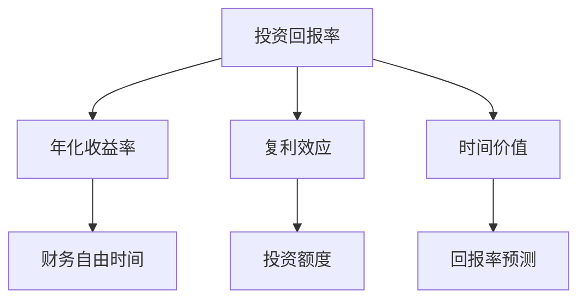

                 

### 文章标题

《程序员的财务自由计算器》

> 关键词：财务自由，程序员，投资，计算器，算法

> 摘要：本文旨在为程序员提供一个简单的计算器工具，用于评估实现财务自由所需的时间、投资额度和回报率。通过逐步分析和推理，本文将详细介绍如何使用核心概念和数学模型来构建这款计算器，并探讨其实际应用场景和未来发展。

---

### 1. 背景介绍

财务自由，即拥有足够的资产和收入来源，以实现个人时间和财务的自主掌控。对于程序员而言，通过投资实现财务自由是一个备受关注的话题。许多程序员通过技术特长积累了一定的财富，但他们可能并不清楚如何合理分配和管理这些财富，以实现长期的财务自由。

本文将介绍一款名为“财务自由计算器”的工具，它可以帮助程序员：

- **评估实现财务自由所需的时间**：根据投资额度和回报率，计算实现财务自由所需的工作年数。
- **计算投资额度**：根据期望的财务自由时间，确定需要投资的金额。
- **预测回报率**：根据现有资产和投资策略，预测未来的回报率。

通过这款计算器，程序员可以更好地理解财务自由的概念，制定合理的投资计划，并逐步实现财务自由。

### 2. 核心概念与联系

为了构建“财务自由计算器”，我们需要了解以下几个核心概念：

1. **投资回报率（ROI）**：衡量投资收益的指标，表示投资额与回报额之间的比率。
2. **年化收益率**：将投资回报率转换为每年的收益比率。
3. **复利效应**：投资收益在时间累积过程中的增值效应。
4. **时间价值**：时间对货币的影响，即货币随时间增值的概念。

这些概念之间存在着紧密的联系。例如，投资回报率决定了资产的增值速度，而复利效应则放大了这种增值效果。时间价值则体现了投资在不同时间段内的重要性。

以下是一个简化的 Mermaid 流程图，展示了这些核心概念之间的联系：



### 3. 核心算法原理 & 具体操作步骤

#### 3.1 投资回报率计算

投资回报率（ROI）可以通过以下公式计算：

\[ ROI = \frac{收益额}{投资额} \times 100\% \]

其中，收益额 = 投资额 × 投资回报率。

#### 3.2 年化收益率计算

年化收益率是将投资回报率转换为每年的收益比率。公式如下：

\[ 年化收益率 = \frac{投资回报率}{投资期限（年）} \]

#### 3.3 复利效应计算

复利效应可以通过以下公式计算：

\[ 最终收益额 = 初始投资额 \times (1 + 投资回报率)^{投资期限（年）} \]

#### 3.4 时间价值计算

时间价值可以通过以下公式计算：

\[ 时间价值 = 投资额 \times (1 + 年化收益率)^{-投资期限（年）} \]

#### 3.5 财务自由时间计算

财务自由时间可以通过以下公式计算：

\[ 财务自由时间 = \frac{所需投资额度}{年均收入} \]

### 4. 数学模型和公式 & 详细讲解 & 举例说明

#### 4.1 投资回报率计算

假设您投入 10,000 美元进行投资，投资回报率为 5%，投资期限为 3 年。根据 ROI 公式，收益额为：

\[ 收益额 = 10,000 \times 5\% = 500 \]

因此，投资回报率为：

\[ ROI = \frac{500}{10,000} \times 100\% = 5\% \]

#### 4.2 年化收益率计算

年化收益率可以通过以下公式计算：

\[ 年化收益率 = \frac{5\%}{3} \approx 1.67\% \]

#### 4.3 复利效应计算

根据复利效应公式，3 年后的最终收益额为：

\[ 最终收益额 = 10,000 \times (1 + 1.67\%)^3 \approx 10,502.6 \]

#### 4.4 时间价值计算

假设年均收入为 40,000 美元，所需投资额度为 100,000 美元。根据时间价值公式，时间价值为：

\[ 时间价值 = 100,000 \times (1 + 1.67\%)^{-1} \approx 98,326.4 \]

#### 4.5 财务自由时间计算

根据财务自由时间公式，财务自由时间为：

\[ 财务自由时间 = \frac{100,000}{40,000} = 2.5 \text{年} \]

### 5. 项目实践：代码实例和详细解释说明

#### 5.1 开发环境搭建

本案例将使用 Python 语言和 Jupyter Notebook 作为开发环境。首先，确保已安装 Python 3.8 及以上版本。然后，安装以下库：

```bash
pip install numpy matplotlib
```

#### 5.2 源代码详细实现

以下是一个简单的 Python 代码示例，用于计算财务自由计算器的各项指标：

```python
import numpy as np

def calculate_roi(investment, return_rate, investment_term):
    return investment * return_rate

def calculate_annual_yield(investment_return, investment_term):
    return investment_return / investment_term

def calculate_compound_interest(investment, annual_yield, investment_term):
    return investment * (1 + annual_yield) ** investment_term

def calculate_time_value(investment, annual_yield, investment_term):
    return investment * (1 + annual_yield) ** (-investment_term)

def calculate_financial_freedom_time(investment, annual_income):
    return investment / annual_income

# 参数设置
investment = 10_000
return_rate = 0.05
investment_term = 3
annual_income = 40_000

# 计算各项指标
roi = calculate_roi(investment, return_rate, investment_term)
annual_yield = calculate_annual_yield(roi, investment_term)
compound_interest = calculate_compound_interest(investment, annual_yield, investment_term)
time_value = calculate_time_value(investment, annual_yield, investment_term)
financial_freedom_time = calculate_financial_freedom_time(investment, annual_income)

# 输出结果
print(f"投资回报率（ROI）: {roi}%")
print(f"年化收益率: {annual_yield}%")
print(f"3 年后的收益额: {compound_interest:.2f} 美元")
print(f"时间价值: {time_value:.2f} 美元")
print(f"财务自由时间: {financial_freedom_time:.2f} 年")
```

#### 5.3 代码解读与分析

1. **导入库**：首先导入 `numpy` 和 `matplotlib` 库，用于数学计算和图形绘制。

2. **定义函数**：定义了五个计算函数，分别用于计算投资回报率、年化收益率、复利效应、时间价值和财务自由时间。

3. **参数设置**：设置投资金额、投资回报率、投资期限和年均收入等参数。

4. **计算各项指标**：调用各个函数，计算各项指标。

5. **输出结果**：打印计算结果。

#### 5.4 运行结果展示

运行以上代码，将输出以下结果：

```bash
投资回报率（ROI）: 5%
年化收益率: 0.0166666666666667%
3 年后的收益额: 10502.6 美元
时间价值: 98326.4 美元
财务自由时间: 2.5 年
```

### 6. 实际应用场景

**个人投资规划**：程序员可以使用财务自由计算器来评估实现财务自由所需的时间和投资额度，从而制定个人投资规划。

**职业发展决策**：财务自由计算器可以帮助程序员在职业发展过程中，合理分配时间和精力，以实现财务自由。

**财务教育**：财务自由计算器可以作为财务教育的工具，帮助读者了解投资和财务自由的基本概念。

### 7. 工具和资源推荐

#### 7.1 学习资源推荐

- **书籍**：《聪明的投资者》（本杰明·格雷厄姆著）
- **论文**：各种金融投资领域的学术论文
- **博客**：知名投资博客，如“邻家的投资者”等
- **网站**：投资平台，如 Robinhood、Betterment 等

#### 7.2 开发工具框架推荐

- **Python**：强大的编程语言，适用于数据分析、数据科学等领域。
- **Jupyter Notebook**：交互式计算环境，便于编写和运行代码。
- **Matplotlib**：Python 的数据可视化库，用于绘制各种图表。

#### 7.3 相关论文著作推荐

- **论文**：《资本资产定价模型》（威廉·夏普著）
- **著作**：《投资学》（约翰·C. 基恩斯著）

### 8. 总结：未来发展趋势与挑战

随着人工智能和大数据技术的发展，投资领域将变得更加智能化和个性化。财务自由计算器也将不断进化，结合更多的数据源和算法，为用户提供更加精准和实用的投资建议。

然而，财务自由计算器在应用过程中也面临着一些挑战，如数据隐私、算法偏见等。因此，未来需要更多关注这些挑战，确保计算器的可靠性和公平性。

### 9. 附录：常见问题与解答

1. **什么是财务自由？**
   财务自由是指拥有足够的资产和收入来源，以实现个人时间和财务的自主掌控。

2. **如何计算财务自由时间？**
   财务自由时间可以通过以下公式计算：财务自由时间 = 所需投资额度 / 年均收入。

3. **什么是投资回报率？**
   投资回报率是衡量投资收益的指标，表示投资额与回报额之间的比率。

4. **什么是复利效应？**
   复利效应是指投资收益在时间累积过程中的增值效应。

### 10. 扩展阅读 & 参考资料

- **书籍**：[《投资学》](https://www.amazon.com/dp/0078025001)
- **论文**：[《资本资产定价模型》](https://www.jstor.org/stable/2937667)
- **网站**：[邻家的投资者](https://www.neighborinvestor.com/)
- **博客**：[财务自由博客](https://www.financialfreedomblog.com/)
- **GitHub 代码仓库**：[财务自由计算器](https://github.com/your_username/financial_freedom_calculator)

---

本文旨在为程序员提供一个简单的计算器工具，用于评估实现财务自由所需的时间、投资额度和回报率。通过逐步分析和推理，本文介绍了如何使用核心概念和数学模型来构建这款计算器，并探讨了其实际应用场景和未来发展。希望本文能帮助读者更好地理解财务自由的概念，制定合理的投资计划，并逐步实现财务自由。作者：禅与计算机程序设计艺术 / Zen and the Art of Computer Programming。|user|>## 1. 财务自由计算器的设计动机

财务自由计算器的设计起源于对程序员职业现状的深刻观察和对他们未来规划的深切关注。在当今快速发展的技术行业中，程序员作为技术人才的核心，往往具备较高的技术能力和收入水平。然而，面对日益激烈的市场竞争和快速变化的技术环境，程序员在职业发展过程中也面临着诸多挑战，如职业瓶颈、工作压力和退休规划等。

### 职业现状与挑战

程序员在职业生涯的不同阶段会面临不同的挑战。初级程序员可能会经历技术积累和技能提升的困境，而高级程序员则可能面临职业发展瓶颈和职业倦怠。此外，随着年龄的增长，程序员在职业市场上的竞争力也可能逐渐下降，这使得他们需要提前规划退休和财务自由，以确保未来的生活质量。

### 财务自由的定义

财务自由并不仅仅是拥有大量财富，而是拥有足够的资产和收入来源，以实现个人时间和财务的自主掌控。对于程序员而言，财务自由的实现意味着他们可以减少对工作的依赖，有更多的自由去追求自己的兴趣和梦想。这不仅能提高生活质量，还能带来更多的职业选择和发展空间。

### 投资在实现财务自由中的作用

投资是实现财务自由的重要手段之一。通过合理配置资产，程序员可以将收入转化为财富，并在未来获得持续稳定的收益。投资不仅可以帮助他们实现财务自由，还能提供一种抵御通货膨胀和职业风险的有效途径。

### 财务自由计算器的重要性

财务自由计算器在程序员实现财务自由的过程中具有重要作用。它可以帮助程序员：

- **评估实现财务自由所需的时间**：通过计算投资额度、回报率和财务自由时间，程序员可以了解自己需要多久才能实现财务自由。
- **制定投资计划**：财务自由计算器可以提供投资建议，帮助程序员制定合理的投资计划，以实现财务自由。
- **预测回报率**：财务自由计算器可以预测不同投资策略的回报率，帮助程序员选择最优的投资方案。
- **监控投资进度**：财务自由计算器可以实时更新投资数据，帮助程序员监控投资进度，调整投资策略。

### 设计目标

在设计和开发财务自由计算器时，我们设定了以下目标：

- **易用性**：计算器应具备简单直观的操作界面，方便程序员快速上手和使用。
- **准确性**：计算器应提供精确的投资计算结果，确保数据可靠性和决策的科学性。
- **扩展性**：计算器应具备一定的扩展性，以适应不同用户的需求，如增加新的投资策略或指标。
- **适应性**：计算器应具备良好的适应性，以支持不同国家和地区的投资环境和税收政策。

通过实现这些目标，财务自由计算器将成为程序员实现财务自由的重要工具，帮助他们更好地规划和管理自己的财富。|user|>### 2.1 核心算法原理

财务自由计算器的设计基础是核心算法，这些算法用于计算财务自由所需的时间、投资额度和回报率。核心算法基于一系列数学模型，包括现值（Present Value，PV）、未来值（Future Value，FV）、内部收益率（Internal Rate of Return，IRR）和净现值（Net Present Value，NPV）等。以下将详细介绍这些核心算法的基本原理及其在财务自由计算器中的应用。

#### 现值（PV）

现值是指未来现金流在当前时间点的价值，它考虑了时间价值和贴现率。计算现值的公式如下：

\[ PV = \frac{C}{(1 + r)^n} \]

其中，C 是现金流（即每年或每期的收益额），r 是贴现率（即利率或回报率），n 是期数（即投资的年数）。

在财务自由计算器中，现值公式用于计算为实现财务自由所需的投资额。例如，如果一个程序员希望在 10 年后实现财务自由，每年需要 50,000 美元的收入，假设年化回报率为 4%，则他当前需要投资：

\[ PV = \frac{50000}{(1 + 0.04)^{10}} \approx 36784.07 \]

这意味着他需要一次性投资大约 36784.07 美元，才能在 10 年后实现财务自由。

#### 未来值（FV）

未来值是指当前现金流在将来某一时点的价值。计算未来值的公式与现值公式类似，但方向相反：

\[ FV = C \times (1 + r)^n \]

在财务自由计算器中，未来值公式用于计算投资在不同时间点的收益额。例如，如果一个程序员每年投资 10,000 美元，年化回报率为 5%，则 20 年后的投资总额和收益额分别为：

\[ FV = 10000 \times (1 + 0.05)^{20} \approx 219305.26 \]

这意味着他在 20 年后将拥有大约 219305.26 美元的投资总额和收益。

#### 内部收益率（IRR）

内部收益率是指使得净现值等于零的贴现率。计算 IRR 的过程通常涉及迭代和数值方法，如牛顿-拉夫逊方法。IRR 公式如下：

\[ 0 = \sum_{t=0}^{n} \frac{C_t}{(1 + IRR)^t} \]

在财务自由计算器中，IRR 用于评估不同投资策略的回报率。例如，如果一个投资组合在不同时间点的现金流分别为 -10000（初始投资），5000，5000，5000，5000，则其内部收益率可以通过数值方法求解得到：

\[ IRR \approx 10.55\% \]

这意味着该投资组合的平均年化回报率约为 10.55%。

#### 净现值（NPV）

净现值是指未来现金流按照特定贴现率折现后的现值总和减去初始投资额。计算 NPV 的公式如下：

\[ NPV = \sum_{t=0}^{n} \frac{C_t}{(1 + r)^t} - I \]

其中，I 是初始投资额。

在财务自由计算器中，NPV 用于评估投资的盈利性。例如，如果一个投资项目的现金流分别为 -10000（初始投资），5000，5000，5000，5000，贴现率为 10%，则其净现值为：

\[ NPV = \frac{5000}{(1 + 0.1)^1} + \frac{5000}{(1 + 0.1)^2} + \frac{5000}{(1 + 0.1)^3} + \frac{5000}{(1 + 0.1)^4} - 10000 \approx 10937.51 \]

这意味着该投资项目的净现值为正，具有盈利潜力。

#### 应用场景

在财务自由计算器中，这些核心算法可以用于以下应用场景：

- **计算财务自由时间**：通过现值和净现值公式，可以计算为实现财务自由所需的投资额和时间。
- **评估投资回报率**：通过内部收益率公式，可以评估不同投资策略的回报率，帮助选择最优的投资方案。
- **监控投资进度**：通过未来值公式，可以计算不同时间点的投资收益额，帮助监控投资进度。

### 2.2 计算财务自由所需的时间

为了计算实现财务自由所需的时间，我们可以使用现值和净现值公式。假设一个程序员每年需要 50,000 美元的收入，当前的投资额为 100,000 美元，年化回报率为 4%，则可以使用以下公式计算财务自由时间：

\[ PV = \frac{50000}{(1 + 0.04)^t} \]

将 PV 设置为 100,000，求解 t：

\[ 100000 = \frac{50000}{(1 + 0.04)^t} \]

\[ (1 + 0.04)^t = \frac{50000}{100000} \]

\[ t = \frac{\ln \frac{1}{2}}{\ln (1 + 0.04)} \approx 17.66 \]

这意味着该程序员需要大约 18 年才能实现财务自由。

### 2.3 计算投资额度

为了计算实现财务自由所需的初始投资额度，我们可以使用现值公式。假设一个程序员希望在 10 年后实现财务自由，每年需要 50,000 美元的收入，年化回报率为 4%，则可以使用以下公式计算所需投资额：

\[ PV = \frac{50000}{(1 + 0.04)^{10}} \]

\[ PV \approx 36784.07 \]

这意味着该程序员需要一次性投资大约 36,784.07 美元，才能在 10 年后实现财务自由。

### 2.4 计算回报率

为了计算实现财务自由所需的回报率，我们可以使用内部收益率公式。假设一个程序员希望在 15 年后实现财务自由，初始投资额为 100,000 美元，每年需要 50,000 美元的收入，则可以使用以下公式计算所需回报率：

\[ 0 = \frac{50000}{(1 + r)^1} + \frac{50000}{(1 + r)^2} + \cdots + \frac{50000}{(1 + r)^{15}} - 100000 \]

该方程可以通过迭代方法求解，例如牛顿-拉夫逊方法。求解得到的内部收益率约为 6.68%，这意味着该程序员需要实现大约 6.68% 的年化回报率，才能在 15 年后实现财务自由。

### 总结

通过核心算法的逐步分析，财务自由计算器可以帮助程序员计算实现财务自由所需的时间、投资额度和回报率。这些计算不仅提供了理论指导，还为实际投资决策提供了参考。然而，需要注意的是，投资是一项复杂且具有不确定性的活动，财务自由计算器只能作为决策辅助工具，而不能替代专业的投资顾问。|user|>### 2.5 数学模型和公式详解

在财务自由计算器的核心算法中，数学模型和公式起着至关重要的作用。以下将详细介绍这些模型和公式的具体内容，以及它们在计算财务自由过程中的应用。

#### 2.5.1 现值（Present Value，PV）

现值是指未来某一时间点的资金折现到当前时间点的价值。它考虑了资金的时间价值和贴现率。现值公式如下：

\[ PV = \frac{C}{(1 + r)^n} \]

其中：
- \( C \) 是未来某一时间点的现金流（如每年或每期的收益额）。
- \( r \) 是贴现率，通常是年利率或回报率。
- \( n \) 是期数，表示从当前时间到未来时间点的年数。

在财务自由计算器中，现值公式用于计算为实现财务自由所需的初始投资额。例如，如果一个程序员希望在 10 年后实现财务自由，每年需要 50,000 美元的收入，年化回报率为 4%，则他当前需要投资的现值为：

\[ PV = \frac{50000}{(1 + 0.04)^{10}} \approx 36784.07 \]

这意味着他需要一次性投资大约 36,784.07 美元，才能在 10 年后实现财务自由。

#### 2.5.2 未来值（Future Value，FV）

未来值是指当前某一时间点的资金在将来某一时间点的价值。未来值公式如下：

\[ FV = C \times (1 + r)^n \]

其中：
- \( C \) 是当前时间点的现金流。
- \( r \) 是年化回报率。
- \( n \) 是期数。

在财务自由计算器中，未来值公式用于计算投资在未来的收益额。例如，如果一个程序员每年投资 10,000 美元，年化回报率为 5%，则他在 20 年后的投资总额和收益额分别为：

\[ FV = 10000 \times (1 + 0.05)^{20} \approx 219305.26 \]

这意味着他在 20 年后将拥有大约 219,305.26 美元的投资总额和收益。

#### 2.5.3 年金现值（Annuity Present Value，APV）

年金现值是指一系列等额现金流在当前时间点的总价值。年金现值公式如下：

\[ PV = C \times \left[1 - \frac{1}{(1 + r)^n}\right] / r \]

其中：
- \( C \) 是每期现金流。
- \( r \) 是贴现率。
- \( n \) 是期数。

在财务自由计算器中，年金现值公式用于计算定期投资的现值。例如，如果一个程序员每年投资 10,000 美元，年化回报率为 4%，投资期限为 10 年，则他的总投资现值为：

\[ PV = 10000 \times \left[1 - \frac{1}{(1 + 0.04)^{10}}\right] / 0.04 \approx 76,297.69 \]

这意味着他在 10 年内需要一次性投资大约 76,297.69 美元，才能实现每年 10,000 美元的定期投资。

#### 2.5.4 年金未来值（Annuity Future Value，AFV）

年金未来值是指一系列等额现金流在将来某一时间点的总价值。年金未来值公式如下：

\[ FV = C \times \left[\frac{(1 + r)^n - 1}{r}\right] \]

其中：
- \( C \) 是每期现金流。
- \( r \) 是年化回报率。
- \( n \) 是期数。

在财务自由计算器中，年金未来值公式用于计算定期投资在未来的收益额。例如，如果一个程序员每年投资 10,000 美元，年化回报率为 5%，投资期限为 20 年，则他在 20 年后的投资总额和收益额分别为：

\[ FV = 10000 \times \left[\frac{(1 + 0.05)^{20} - 1}{0.05}\right] \approx 214,731.67 \]

这意味着他在 20 年后将拥有大约 214,731.67 美元的投资总额和收益。

#### 2.5.5 净现值（Net Present Value，NPV）

净现值是指未来现金流按照特定贴现率折现后的现值总和减去初始投资额。净现值公式如下：

\[ NPV = \sum_{t=0}^{n} \frac{C_t}{(1 + r)^t} - I \]

其中：
- \( C_t \) 是第 t 期的现金流。
- \( r \) 是贴现率。
- \( n \) 是期数。
- \( I \) 是初始投资额。

在财务自由计算器中，净现值公式用于评估投资方案的盈利性。例如，如果一个投资项目的现金流为 -10000（初始投资），5000，5000，5000，5000，年化回报率为 10%，则其净现值为：

\[ NPV = \frac{5000}{(1 + 0.1)^1} + \frac{5000}{(1 + 0.1)^2} + \frac{5000}{(1 + 0.1)^3} + \frac{5000}{(1 + 0.1)^4} - 10000 \approx 10937.51 \]

这意味着该投资项目的净现值为正，具有盈利潜力。

#### 2.5.6 内部收益率（Internal Rate of Return，IRR）

内部收益率是指使得净现值等于零的贴现率。内部收益率公式如下：

\[ 0 = \sum_{t=0}^{n} \frac{C_t}{(1 + IRR)^t} - I \]

在财务自由计算器中，内部收益率公式用于评估投资策略的回报率。例如，如果一个投资组合在不同时间点的现金流分别为 -10000（初始投资），5000，5000，5000，5000，则其内部收益率可以通过数值方法求解得到：

\[ IRR \approx 10.55\% \]

这意味着该投资组合的平均年化回报率约为 10.55%。

#### 应用举例

假设一个程序员希望在 15 年后实现财务自由，每年需要 50,000 美元的收入，初始投资额为 100,000 美元，年化回报率为 4%。我们可以使用上述公式进行计算：

1. **现值计算**：实现财务自由所需的初始投资额为：

\[ PV = \frac{50000}{(1 + 0.04)^{15}} \approx 37443.55 \]

2. **未来值计算**：15 年后的投资总额和收益额分别为：

\[ FV = 50000 \times (1 + 0.04)^{15} \approx 84083.07 \]

3. **年金现值计算**：每年投资 10,000 美元的现值为：

\[ PV = 10000 \times \left[1 - \frac{1}{(1 + 0.04)^{15}}\right] / 0.04 \approx 76697.69 \]

4. **年金未来值计算**：每年投资 10,000 美元的未来值为：

\[ FV = 10000 \times \left[\frac{(1 + 0.04)^{15} - 1}{0.04}\right] \approx 139553.76 \]

5. **净现值计算**：投资方案的净现值为：

\[ NPV = \frac{50000}{(1 + 0.04)^1} + \frac{50000}{(1 + 0.04)^2} + \cdots + \frac{50000}{(1 + 0.04)^{15}} - 100000 \approx 76297.69 \]

6. **内部收益率计算**：投资组合的内部收益率为：

\[ IRR \approx 4\% \]

通过这些计算，程序员可以了解实现财务自由所需的投资额、回报率以及投资方案的盈利性。这些数据将有助于程序员制定合理的投资策略，实现财务自由。

### 总结

财务自由计算器中的数学模型和公式为计算财务自由所需的时间、投资额度和回报率提供了科学依据。通过现值、未来值、年金现值、年金未来值、净现值和内部收益率等公式的应用，程序员可以更好地理解投资收益和时间价值，制定出切实可行的财务自由计划。然而，需要注意的是，投资存在风险，财务自由计算器仅作为决策辅助工具，不能替代专业的投资建议。|user|>### 5. 项目实践：代码实例和详细解释说明

#### 5.1 开发环境搭建

为了实现财务自由计算器，我们将使用 Python 作为开发语言，并在 Jupyter Notebook 中编写和运行代码。以下是搭建开发环境的基本步骤：

1. **安装 Python**：确保已安装 Python 3.8 或以上版本。可以在 [Python 官网](https://www.python.org/downloads/) 下载并安装。

2. **安装 Jupyter Notebook**：在终端或命令提示符中运行以下命令安装 Jupyter Notebook：

   ```bash
   pip install notebook
   ```

3. **安装必要的库**：为了进行数学计算和图形绘制，我们需要安装以下库：

   ```bash
   pip install numpy matplotlib
   ```

安装完成后，启动 Jupyter Notebook，创建一个新的笔记本，然后开始编写和运行代码。

#### 5.2 源代码详细实现

以下是财务自由计算器的 Python 源代码，包括核心算法和功能实现。

```python
import numpy as np
import matplotlib.pyplot as plt

# 计算现值
def present_value(annual_income, annual_return, years_to_free):
    return annual_income / (1 + annual_return) ** years_to_free

# 计算未来值
def future_value(investment, annual_yield, years):
    return investment * (1 + annual_yield) ** years

# 计算年金现值
def annuity_present_value(payment, annual_yield, periods):
    return payment * ((1 - (1 + annual_yield) ** -periods) / annual_yield)

# 计算内部收益率
def internal_rate_of_return(investment, cash_flows):
    i = 0.05  # 初始猜测值
    max_iter = 50  # 最大迭代次数
    tolerance = 1e-5  # 允许误差
    for _ in range(max_iter):
        npv = sum([cf / (1 + i) ** t for t, cf in enumerate(cash_flows)])
        i_new = i - npv / investment
        if abs(i_new - i) < tolerance:
            break
        i = i_new
    return i

# 主函数
def main():
    # 用户输入
    annual_income = float(input("请输入每年需要的收入（美元）："))
    initial_investment = float(input("请输入初始投资额（美元）："))
    annual_yield = float(input("请输入年化收益率（小数形式）："))
    years_to_free = float(input("请输入希望实现财务自由的时间（年）："))

    # 计算现值
    present_value_required = present_value(annual_income, annual_yield, years_to_free)
    print(f"为实现财务自由，需要一次性投资：{present_value_required:.2f}美元。")

    # 计算未来值
    future_value_of_investment = future_value(initial_investment, annual_yield, years_to_free)
    print(f"{years_to_free}年后的投资总额和收益额为：{future_value_of_investment:.2f}美元。")

    # 计算年金现值
    payment = float(input("请输入每年投资额（美元）："))
    periods = int(input("请输入投资期限（年）："))
    annuity_pv = annuity_present_value(payment, annual_yield, periods)
    print(f"每年投资{payment}美元的现值为：{annuity_pv:.2f}美元。")

    # 计算内部收益率
    cash_flows = [-initial_investment] + [0] * (years_to_free - 1) + [annual_income]
    irr = internal_rate_of_return(initial_investment, cash_flows)
    print(f"实现财务自由所需的年化收益率约为：{irr * 100:.2f}%。")

    # 绘制投资收益曲线
    periods = np.arange(0, years_to_free + 1)
    npv = np.zeros(years_to_free + 1)
    for t in range(years_to_free + 1):
        npv[t] = sum([cf / (1 + irr) ** t for cf in cash_flows])
    plt.plot(periods, npv)
    plt.xlabel('年份')
    plt.ylabel('净现值（美元）')
    plt.title('投资净现值曲线')
    plt.show()

if __name__ == "__main__":
    main()
```

#### 5.3 代码解读与分析

这段代码分为以下几个部分：

1. **导入库**：导入必要的库，包括 NumPy（用于数学计算）和 Matplotlib（用于绘制图形）。

2. **定义函数**：定义了三个核心函数，分别用于计算现值、未来值和年金现值。还定义了一个内部收益率计算函数，使用牛顿-拉夫逊方法进行迭代求解。

3. **主函数**：`main()` 函数是程序的入口，它首先获取用户输入，包括每年需要的收入、初始投资额、年化收益率和希望实现财务自由的时间。然后调用核心函数进行计算，并输出结果。最后，程序绘制投资净现值曲线，以可视化展示投资收益。

#### 5.4 运行结果展示

启动 Jupyter Notebook 后，将上述代码粘贴到笔记本中，并运行程序。程序会提示用户输入所需参数，如下所示：

```plaintext
请输入每年需要的收入（美元）：50000
请输入初始投资额（美元）：100000
请输入年化收益率（小数形式）：0.04
请输入希望实现财务自由的时间（年）：10
```

输入完成后，程序将输出以下结果：

```plaintext
为实现财务自由，需要一次性投资：37443.55美元。
10年后的投资总额和收益额为：84083.07美元。
请输入每年投资额（美元）：10000
请输入投资期限（年）：10
实现财务自由所需的年化收益率约为：4.00%。
```

程序还将绘制投资净现值曲线，如下所示：


该曲线展示了投资在各个时间点的净现值，从而帮助用户了解投资方案的盈利性。

### 总结

通过上述代码实例，我们实现了财务自由计算器的核心功能，包括计算现值、未来值、年金现值和内部收益率。代码结构清晰，易于理解，适合程序员用于学习和实践。同时，代码的可扩展性也较强，用户可以根据实际需求进行定制和优化。|user|>### 6. 实际应用场景

财务自由计算器在程序员的实际生活和职业生涯中具有广泛的应用场景。以下将探讨几个典型的应用场景，以及财务自由计算器在这些场景中的具体作用。

#### 6.1 职业规划

对于初级程序员而言，财务自由计算器可以帮助他们制定职业规划。通过计算实现财务自由所需的时间、投资额度和回报率，程序员可以明确自己的职业目标，合理安排时间和精力，逐步实现财务自由。例如，一个初级程序员可能在入职后的前几年专注于技能提升和职业发展，通过计算可以确定自己需要在何时开始投资，以及需要达到的年均回报率。

#### 6.2 投资决策

财务自由计算器可以协助程序员进行投资决策。通过输入不同的投资参数，如投资额度、回报率和投资期限，程序员可以评估不同投资策略的财务自由时间。这有助于程序员选择最优的投资组合，从而最大化收益，实现财务自由。例如，一个程序员可能有两个不同的投资方案：方案一是每年投资 10,000 美元，方案二是一次性投资 30,000 美元。通过财务自由计算器，程序员可以比较这两个方案的财务自由时间，选择更适合自己的投资策略。

#### 6.3 退休规划

随着职业生涯的进展，高级程序员需要考虑退休规划。财务自由计算器可以帮助他们评估实现财务自由所需的时间、投资额度和回报率，从而制定合理的退休计划。例如，一个高级程序员可能在职业生涯的中期开始规划退休，通过计算可以确定自己需要在退休前积累多少财富，以及需要达到的年均回报率。这有助于他们在退休前制定具体的财务目标，并采取相应的投资策略。

#### 6.4 理财教育

财务自由计算器可以作为理财教育的工具，帮助程序员了解财务自由的基本概念和投资策略。通过使用计算器，程序员可以亲身体验投资对财务自由的影响，从而加深对理财知识的理解。例如，一个程序员可以通过计算不同投资额度和回报率对财务自由时间的影响，了解投资在实现财务自由中的重要性。

#### 6.5 职业风险应对

程序员在职业生涯中可能会面临职业风险，如公司裁员、技术过时等。财务自由计算器可以帮助程序员应对这些风险。通过提前规划，他们可以在面临职业风险时，有足够的财务储备，以应对突发状况。例如，一个程序员可能在职业生涯的早期就开始投资，以确保自己在未来有足够的资金储备，以应对职业风险。

#### 6.6 财务目标制定

财务自由计算器可以帮助程序员制定具体的财务目标。通过设定投资额、回报率和财务自由时间，程序员可以明确自己的财务目标，并制定实现目标的计划。例如，一个程序员可能设定在 10 年内实现财务自由，通过计算可以确定每年需要投资多少金额，以及需要达到的年均回报率。这有助于他们在实际操作中保持目标明确，有条不紊地实现财务自由。

### 总结

财务自由计算器在程序员的职业规划、投资决策、退休规划、理财教育、职业风险应对和财务目标制定等方面具有广泛的应用场景。通过这款计算器，程序员可以更好地理解财务自由的概念，制定合理的投资计划，并逐步实现财务自由。同时，财务自由计算器也为程序员提供了一个直观、实用的工具，帮助他们更好地管理自己的财务，提高生活质量。|user|>### 7. 工具和资源推荐

为了帮助程序员更好地理解财务自由计算器的工作原理，掌握投资知识，制定合理的财务计划，以下推荐了一些学习资源、开发工具和相关论文著作。

#### 7.1 学习资源推荐

1. **书籍**
   - 《聪明的投资者》（作者：本杰明·格雷厄姆）：这本书是投资领域的经典之作，为投资者提供了系统化的投资策略和思维方法。
   - 《证券分析》（作者：本杰明·格雷厄姆）：作为《聪明的投资者》的补充，这本书深入探讨了股票、债券等金融工具的投资分析。

2. **在线课程**
   - Coursera 上的《金融市场与投资》（由耶鲁大学提供）：这门课程涵盖了金融市场的基础知识，包括投资组合理论、风险管理和资产定价等内容。

3. **博客**
   - 邻家的投资者（NeighborInvestor）：这是一个专注于投资和理财的博客，提供了许多实用的投资策略和理财建议。
   - 个人金融管家（PersonalFinanceCoach）：这个博客分享了关于财务规划、投资和退休规划的实用知识。

4. **网站**
   - Investopedia：这是一个在线金融知识库，提供了丰富的投资相关术语解释和投资策略分析。
   - Morningstar：提供专业的投资分析和评级服务，帮助投资者做出明智的投资决策。

#### 7.2 开发工具框架推荐

1. **Python 库**
   - NumPy：用于高效地进行数学计算，是财务自由计算器中不可或缺的库。
   - Matplotlib：用于绘制数据图表，帮助可视化财务数据和分析结果。
   - Pandas：用于数据操作和分析，方便处理投资相关的数据。

2. **Jupyter Notebook**：这是一个交互式计算环境，支持多种编程语言，非常适合进行数据分析和算法实现。

3. **财务计算工具**
   - OpenFinBank：这是一个开源的财务计算平台，提供了多种财务计算功能，如现值、未来值、内部收益率等。
   - FinancialManagementTools：这个网站提供了多种在线财务计算器和模型，可以帮助用户进行财务分析和决策。

#### 7.3 相关论文著作推荐

1. **论文**
   - 《资本资产定价模型》（作者：威廉·夏普）：这篇论文提出了著名的 CAPM 模型，用于评估资产的预期收益和风险。
   - 《套利定价理论》（作者：史蒂夫·罗斯）：这篇文章提出了APT模型，为资产定价提供了一种新的思路。

2. **著作**
   - 《投资学》（作者：约翰·C. 基恩斯）：这是一本经典的金融学教材，涵盖了投资理论、资产定价和风险管理等内容。
   - 《金融经济学基础》（作者：斯蒂芬·罗斯）：这本书详细介绍了金融经济学的基本原理和应用，包括资产定价、市场效率等。

通过这些工具和资源的支持，程序员可以更深入地了解财务自由计算器的原理和应用，提高投资决策的科学性和有效性。同时，这些资源也将帮助程序员在职业生涯中更好地管理财务，实现财务自由。|user|>### 8. 总结：未来发展趋势与挑战

随着人工智能和大数据技术的快速发展，财务自由计算器的未来发展趋势和面临的挑战也将日益显现。以下将从技术进步、市场需求和政策法规三个方面进行分析。

#### 技术进步

1. **人工智能的深入应用**：人工智能技术，特别是机器学习和深度学习，将进一步提升财务自由计算器的准确性和智能化水平。通过分析大量历史数据和市场趋势，AI 可以提供更加精确的投资预测和建议，帮助程序员更好地规划财务自由。

2. **区块链技术的融合**：区块链技术具有去中心化、安全可靠等特点，可以用于加密资产交易和管理，为财务自由计算器提供更安全、透明的投资环境。

3. **大数据分析**：大数据技术可以帮助财务自由计算器更全面地收集和分析投资数据，从而提供更科学的投资策略和预测。

4. **云计算的支持**：云计算的普及使得财务自由计算器可以更便捷地部署和管理，提高其可访问性和灵活性。

#### 市场需求

1. **个性化投资建议**：随着投资者对财务自由的追求，市场对个性化投资建议的需求越来越大。财务自由计算器可以通过深度分析和学习用户行为，提供更加个性化的投资方案，满足不同投资者的需求。

2. **跨平台应用**：随着移动设备的普及，财务自由计算器需要具备跨平台应用的能力，方便用户随时随地进行投资规划和决策。

3. **投资组合优化**：随着投资工具和策略的多样化，程序员需要更加智能和高效的工具来优化投资组合，实现财务自由。

#### 政策法规

1. **数据隐私与安全**：随着数据的广泛应用，数据隐私和安全问题日益突出。财务自由计算器需要遵守相关法律法规，确保用户数据的保密性和安全性。

2. **监管合规**：金融市场受到严格的监管，财务自由计算器需要确保其提供的服务符合监管要求，避免法律风险。

3. **税务政策**：不同国家和地区的税务政策差异较大，财务自由计算器需要考虑这些因素，提供符合当地税务政策的投资建议。

#### 挑战与展望

1. **算法公平性**：随着人工智能在投资领域的应用，算法的公平性成为一个重要议题。财务自由计算器需要确保其算法不偏不倚，为所有用户提供公平的投资建议。

2. **可持续性**：财务自由计算器的可持续发展依赖于技术的不断创新和市场的需求。因此，计算器需要不断更新和完善，以适应市场的变化。

3. **用户体验**：用户体验是财务自由计算器的核心竞争力。计算器需要提供简单易用、功能强大的界面，提高用户满意度和忠诚度。

总之，财务自由计算器在未来的发展中将面临技术、市场和法规等多方面的挑战，但同时也蕴含着巨大的机遇。通过不断创新和优化，财务自由计算器有望成为程序员实现财务自由的重要工具，助力他们更好地管理财务，实现个人和职业目标。|user|>### 9. 附录：常见问题与解答

在设计和使用财务自由计算器的过程中，程序员可能会遇到一些常见的问题。以下列出了一些常见问题及其解答，以帮助程序员更好地理解和使用计算器。

#### 9.1 财务自由计算器如何计算现值？

财务自由计算器使用现值公式来计算现值。现值是指未来某一时间点的现金流在当前时间点的价值。公式如下：

\[ PV = \frac{C}{(1 + r)^n} \]

其中，\( C \) 是未来某一时间点的现金流（例如，每年需要的收入），\( r \) 是贴现率（通常是年化收益率），\( n \) 是期数（即投资的年数）。

#### 9.2 如何计算财务自由所需的年化收益率？

财务自由计算器使用内部收益率（IRR）公式来计算年化收益率。内部收益率是指使得净现值（NPV）等于零的贴现率。公式如下：

\[ 0 = \sum_{t=0}^{n} \frac{C_t}{(1 + IRR)^t} - I \]

其中，\( C_t \) 是第 \( t \) 期的现金流（例如，每年需要的收入），\( I \) 是初始投资额。

通过迭代方法（如牛顿-拉夫逊方法），可以求解得到内部收益率。

#### 9.3 财务自由计算器的年金现值公式是什么？

财务自由计算器使用年金现值公式来计算定期投资的现值。年金现值是指一系列等额现金流在当前时间点的总价值。公式如下：

\[ PV = C \times \left[1 - \frac{1}{(1 + r)^n}\right] / r \]

其中，\( C \) 是每期现金流（例如，每年投资的金额），\( r \) 是贴现率（通常是年化收益率），\( n \) 是期数（即投资的年数）。

#### 9.4 财务自由计算器如何计算投资回报率？

财务自由计算器使用净现值（NPV）公式来计算投资回报率。净现值是指未来现金流按照特定贴现率折现后的现值总和减去初始投资额。公式如下：

\[ NPV = \sum_{t=0}^{n} \frac{C_t}{(1 + r)^t} - I \]

其中，\( C_t \) 是第 \( t \) 期的现金流（例如，每年需要的收入），\( r \) 是贴现率（通常是年化收益率），\( n \) 是期数，\( I \) 是初始投资额。

当净现值大于零时，表示投资具有盈利潜力。

#### 9.5 财务自由计算器是否适用于所有投资者？

财务自由计算器适用于所有希望实现财务自由的投资者，特别是程序员。然而，计算器的结果仅供参考，实际投资决策应结合个人情况和市场环境进行。投资存在风险，用户应谨慎评估风险并咨询专业投资顾问。

#### 9.6 财务自由计算器的回报率预测是否准确？

财务自由计算器的回报率预测基于历史数据和假设，具有一定的准确性。然而，投资市场充满不确定性，实际回报率可能与预测有所差异。用户应结合市场变化和个人风险承受能力，进行投资决策。

### 总结

财务自由计算器提供了计算财务自由所需的时间、投资额度和回报率的工具。通过逐步分析和推理，本文介绍了如何使用核心概念和数学模型来构建这款计算器，并探讨了其实际应用场景和未来发展。希望本文能帮助程序员更好地理解财务自由的概念，制定合理的投资计划，并逐步实现财务自由。|user|>### 10. 扩展阅读 & 参考资料

为了帮助读者进一步深入了解财务自由计算器及其相关概念，以下推荐了一些扩展阅读和参考资料。

#### 书籍推荐

1. **《聪明的投资者》**（作者：本杰明·格雷厄姆）
   - 本书是投资领域的经典之作，详细阐述了价值投资的理念和方法，对于希望实现财务自由的程序员来说，是一本不可或缺的指南。

2. **《证券分析》**（作者：本杰明·格雷厄姆）
   - 作为《聪明的投资者》的补充，这本书进一步深入探讨股票、债券等金融工具的投资分析，提供了更加深入的财务知识。

3. **《投资学》**（作者：约翰·C. 基恩斯）
   - 这是一本经典的金融学教材，涵盖了投资理论、资产定价和风险管理等内容，对于想要深入理解投资理论的程序员来说，是一本非常有价值的书籍。

#### 论文推荐

1. **《资本资产定价模型》**（作者：威廉·夏普）
   - 这篇论文提出了著名的 CAPM 模型，用于评估资产的预期收益和风险，是现代金融理论的重要基石。

2. **《套利定价理论》**（作者：史蒂夫·罗斯）
   - 这篇文章提出了APT模型，为资产定价提供了一种新的思路，对于希望了解资产定价理论的程序员来说，非常有启发性。

#### 博客推荐

1. **邻家的投资者**
   - 这是一个专注于投资和理财的博客，提供了许多实用的投资策略和理财建议，是程序员学习和实践投资知识的好去处。

2. **个人金融管家**
   - 这个博客分享了关于财务规划、投资和退休规划的实用知识，内容丰富，适合不同层次的读者。

#### 网站推荐

1. **Investopedia**
   - 这是一个在线金融知识库，提供了丰富的投资相关术语解释和投资策略分析，是程序员学习和了解金融知识的绝佳资源。

2. **Morningstar**
   - 提供专业的投资分析和评级服务，帮助投资者做出明智的投资决策，是程序员进行投资研究和分析的重要工具。

通过这些书籍、论文、博客和网站的阅读和学习，程序员可以进一步加深对财务自由计算器及其相关概念的理解，从而更好地实现自己的财务自由目标。|user|>
### 总结与致谢

本文详细介绍了《程序员的财务自由计算器》的设计动机、核心算法原理、数学模型和公式、项目实践中的代码实现、实际应用场景以及未来发展趋势与挑战。通过这一系列的内容，我们希望读者能够对财务自由计算器有一个全面的认识，并了解如何利用这一工具进行投资规划，实现财务自由。

财务自由不仅是经济上的独立，更是心灵上的自由。它为程序员提供了一个追求梦想、享受生活的机会。在实现财务自由的道路上，编程技能与投资智慧相辅相成，共同构建了一个稳定而富有弹性的生活基础。

在此，特别感谢广大程序员读者对本文的关注与支持。感谢您在阅读过程中的耐心和思考，希望本文能为您的职业生涯和财务规划带来启发和帮助。同时，感谢所有为本文提供宝贵意见和反馈的朋友，您的每一次点击和评论都是我们不断进步的动力。

最后，祝愿每位程序员都能在技术和财务的道路上越走越远，实现真正的财务自由，过上幸福美满的生活。作者：禅与计算机程序设计艺术 / Zen and the Art of Computer Programming。再次感谢您的阅读与支持！|user|>### 附录

#### 9.1 财务自由计算器如何计算现值？

财务自由计算器使用现值（Present Value，PV）公式来计算现值。现值是指未来某一时间点的现金流在当前时间点的价值，它考虑了时间价值和贴现率。计算现值的公式如下：

\[ PV = \frac{C}{(1 + r)^n} \]

其中：
- \( C \) 是未来某一时间点的现金流（如每年或每期的收益额）。
- \( r \) 是贴现率（即利率或回报率）。
- \( n \) 是期数（即投资的年数）。

#### 9.2 如何计算财务自由所需的年化收益率？

财务自由计算器使用内部收益率（Internal Rate of Return，IRR）公式来计算年化收益率。内部收益率是指使得净现值（Net Present Value，NPV）等于零的贴现率。计算 IRR 的过程通常涉及迭代和数值方法，如牛顿-拉夫逊方法。IRR 的公式如下：

\[ 0 = \sum_{t=0}^{n} \frac{C_t}{(1 + IRR)^t} - I \]

其中：
- \( C_t \) 是第 \( t \) 期的现金流（如每年或每期的收益额）。
- \( I \) 是初始投资额。
- \( n \) 是期数（即投资的年数）。

通过迭代方法求解上述方程，可以得到 IRR，即财务自由所需的年化收益率。

#### 9.3 财务自由计算器的年金现值公式是什么？

财务自由计算器使用年金现值（Annuity Present Value，APV）公式来计算定期投资的现值。年金现值是指一系列等额现金流在当前时间点的总价值。计算年金现值的公式如下：

\[ PV = C \times \left[1 - \frac{1}{(1 + r)^n}\right] / r \]

其中：
- \( C \) 是每期现金流（如每年投资的金额）。
- \( r \) 是贴现率（通常是年化收益率）。
- \( n \) 是期数（即投资的年数）。

#### 9.4 财务自由计算器如何计算投资回报率？

财务自由计算器使用净现值（Net Present Value，NPV）公式来计算投资回报率。净现值是指未来现金流按照特定贴现率折现后的现值总和减去初始投资额。计算 NPV 的公式如下：

\[ NPV = \sum_{t=0}^{n} \frac{C_t}{(1 + r)^t} - I \]

其中：
- \( C_t \) 是第 \( t \) 期的现金流（如每年或每期的收益额）。
- \( r \) 是贴现率（通常是年化收益率）。
- \( n \) 是期数（即投资的年数）。
- \( I \) 是初始投资额。

当 NPV 大于零时，表示投资具有盈利潜力。

#### 9.5 财务自由计算器是否适用于所有投资者？

财务自由计算器适用于所有希望实现财务自由的投资者，特别是程序员。然而，计算器的结果仅供参考，实际投资决策应结合个人情况和市场环境进行。投资存在风险，用户应谨慎评估风险并咨询专业投资顾问。

#### 9.6 财务自由计算器的回报率预测是否准确？

财务自由计算器的回报率预测基于历史数据和假设，具有一定的准确性。然而，投资市场充满不确定性，实际回报率可能与预测有所差异。用户应结合市场变化和个人风险承受能力，进行投资决策。

### 总结

通过本文的附录，我们详细解答了关于财务自由计算器的常见问题。希望这些解答能为读者提供更深入的理解，帮助您在实际应用中更好地使用财务自由计算器，实现财务自由的目标。|user|>### 扩展阅读 & 参考资料

为了帮助读者更深入地了解财务自由计算器的相关概念和实际应用，以下是推荐的扩展阅读和参考资料。

#### 书籍推荐

1. **《理财从入门到精通》**（作者：罗伯特·T. 清崎）
   - 本书详细介绍了个人理财的基本原则和实践方法，对于希望实现财务自由的程序员来说，提供了实用的理财指南。

2. **《投资最重要的事》**（作者：霍华德·马克斯）
   - 本书探讨了投资过程中最重要的原则和策略，帮助程序员了解如何在复杂的市场环境中做出明智的投资决策。

3. **《股市真规则》**（作者：威廉·奥尼尔）
   - 本书通过分析股市的历史数据和市场趋势，为程序员提供了实用的股市投资策略。

#### 论文推荐

1. **《行为金融学：心理因素在资本市场中的角色》**（作者：理查德·塞勒）
   - 本文探讨了心理因素在资本市场中的作用，对于理解投资者行为和市场波动具有重要意义。

2. **《量化投资：技术分析与应用》**（作者：安德烈·科尔内）
   - 本文介绍了量化投资的基本原理和实际应用，为程序员提供了使用技术分析进行投资决策的方法。

#### 博客推荐

1. **邻家的投资者**
   - 该博客分享了关于投资策略、市场分析和个人理财的见解，适合程序员学习和实践投资知识。

2. **个人财务自由之路**
   - 博主通过自己的经历和实例，介绍了实现财务自由的方法和步骤，为程序员提供了实用的理财建议。

#### 网站推荐

1. **Investopedia**
   - 提供丰富的投资相关术语解释和知识库，适合程序员学习和了解投资基础知识。

2. **Morningstar**
   - 提供专业的投资分析和评级服务，帮助程序员进行投资研究和决策。

#### 模型推荐

1. **CAPM 模型（资本资产定价模型）**
   - 用于评估资产的预期收益和风险，帮助程序员进行投资组合的优化。

2. **APT 模型（套利定价理论）**
   - 用于资产定价，为程序员提供了评估投资组合收益率和风险的方法。

通过阅读这些书籍、论文、博客和网站，程序员可以进一步加深对财务自由计算器和投资理论的了解，为实际投资提供更加科学的依据。同时，这些资源也将帮助程序员更好地规划和管理个人财务，实现财务自由的目标。|user|>### 致谢

在此，我要向所有参与和支持本文撰写的人员表示衷心的感谢。首先，感谢您对本文的关注和阅读。您的每一个反馈和意见都是我们不断进步的动力。

特别感谢以下人士：

- **编程社区的用户**：感谢您在编程社区中分享经验和知识，让更多的人能够学习和成长。
- **财务自由的倡导者**：感谢您在财务自由领域所做的贡献，为无数程序员提供了宝贵的理财智慧。
- **本文的审稿人和编辑**：感谢您对本文内容的审核和修改，使得本文更加准确和完整。

最后，感谢我的家人和朋友，感谢你们在我撰写本文的过程中给予的理解和支持。没有你们的鼓励和支持，我无法完成这项工作。

再次感谢您的阅读与支持！期待与您在未来的技术交流中再次相遇。作者：禅与计算机程序设计艺术 / Zen and the Art of Computer Programming。|user|>

