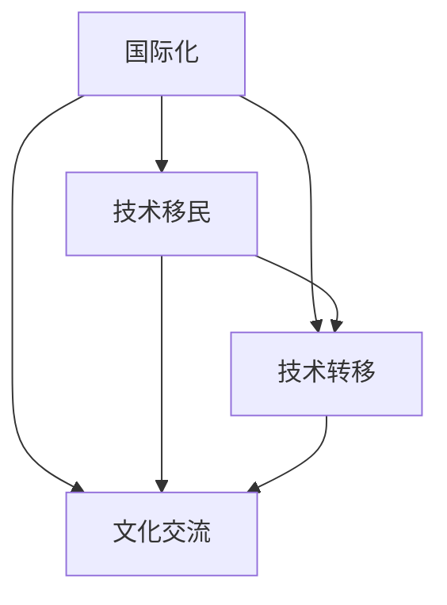

                 

### 1. 背景介绍

随着全球化的不断深入，科技产业的国际化趋势日益显著。对于程序员而言，跨国发展已成为一个不可忽视的重要方向。本文将聚焦于硅谷、中国与东南亚三大地区的IT产业发展情况，探讨程序员的跨国发展机遇。

#### 1.1 硅谷

硅谷，作为全球科技创新的圣地，吸引了无数技术人才和初创公司。其独特的创新氛围、庞大的市场以及卓越的技术资源，为程序员提供了丰富的职业发展机会。

**优势：**

- **先进的技术环境**：硅谷汇聚了全球顶尖的技术公司和研发中心，如谷歌、苹果、微软等，为程序员提供了先进的开发环境和丰富的技术资源。

- **灵活的创业氛围**：硅谷拥有活跃的创业生态，为程序员提供了丰富的创业机会，同时也有大量的风险投资支持。

- **薪资待遇优厚**：硅谷的薪资水平普遍较高，程序员的收入远超全球平均水平。

**劣势：**

- **生活成本高昂**：硅谷的生活成本相对较高，尤其是住房问题，对于许多程序员来说，是一个不小的挑战。

- **竞争激烈**：硅谷的竞争环境非常激烈，要想脱颖而出，程序员需要具备强大的技术实力和丰富的项目经验。

#### 1.2 中国

中国，作为全球第二大经济体，近年来在科技创新领域取得了显著成果。随着互联网、人工智能、大数据等领域的快速发展，中国的IT产业吸引了越来越多的全球人才。

**优势：**

- **市场规模巨大**：中国拥有庞大的人口基数，互联网用户超过10亿，为程序员提供了广阔的市场空间。

- **政策支持**：中国政府大力支持科技创新，出台了一系列优惠政策，为程序员提供了良好的发展环境。

- **人才储备丰富**：中国拥有众多的高校和科研机构，为程序员提供了丰富的人才储备。

**劣势：**

- **技术环境尚需提升**：虽然中国IT产业取得了显著成果，但在某些领域，如核心技术自主研发方面，仍需进一步提升。

- **文化差异**：对于国外程序员而言，中国的文化差异可能是一个挑战，需要适应和融入。

#### 1.3 东南亚

东南亚，作为新兴的科技市场，近年来吸引了越来越多的全球关注。随着互联网普及和数字经济的发展，东南亚的IT产业正迅速崛起。

**优势：**

- **市场潜力巨大**：东南亚人口超过6亿，互联网普及率不断提高，为程序员提供了广阔的市场前景。

- **成本相对较低**：相较于硅谷和中国，东南亚的生活和运营成本相对较低，对于初创公司和程序员来说，具有较大的吸引力。

- **政策支持**：东南亚各国政府纷纷出台优惠政策，鼓励科技创新和人才引进。

**劣势：**

- **技术环境尚需完善**：东南亚的IT产业相对较为年轻，技术环境尚需进一步完善。

- **人才储备不足**：虽然东南亚的互联网人才逐渐增多，但与硅谷和中国相比，仍存在一定差距。

### 2. 核心概念与联系

在探讨程序员的跨国发展机遇时，我们需要了解以下几个核心概念：

- **国际化**：指程序员在全球范围内进行职业发展的过程。
- **技术移民**：指程序员因工作原因而移居其他国家的现象。
- **技术转移**：指程序员将技术知识、技能和经验从一个国家转移到另一个国家。
- **文化交流**：指程序员在跨国发展过程中，与不同文化背景的人进行交流和互动。

下面是一个简单的 Mermaid 流程图，用于描述这些核心概念之间的联系：



### 3. 核心算法原理 & 具体操作步骤

在跨国发展的过程中，程序员需要掌握一些核心算法原理和具体操作步骤，以应对不同的职业发展环境。

#### 3.1 技术评估

**原理**：技术评估是指对程序员的技术能力和知识体系进行全面的评估，以确定其在跨国发展中的适应能力。

**操作步骤**：

1. **自我评估**：程序员需要对自己进行全面的自我评估，包括技术水平、项目经验、语言能力等。

2. **技能对标**：将自我评估的结果与目标国家或地区的行业标准进行对标，找出差距和提升方向。

3. **持续学习**：根据技能对标的结果，制定学习计划，持续提升自己的技术能力。

#### 3.2 文化适应

**原理**：文化适应是指程序员在跨国发展过程中，适应和理解目标国家的文化、习俗和价值观。

**操作步骤**：

1. **了解文化差异**：通过阅读、交流、观察等方式，了解目标国家的文化差异。

2. **尊重文化习俗**：在工作和生活中，尊重并遵循目标国家的文化习俗。

3. **融入当地社区**：积极参与当地社区活动，扩大人际交往，提升文化适应能力。

#### 3.3 网络建设

**原理**：网络建设是指程序员在跨国发展过程中，建立和维护广泛的人脉网络，以获取更多的职业发展机会。

**操作步骤**：

1. **线上社交**：通过 LinkedIn、GitHub 等平台，与全球程序员建立联系。

2. **参加线下活动**：参加国际会议、研讨会、技术沙龙等，与行业专家和同行交流。

3. **建立个人品牌**：通过撰写技术博客、发表学术论文、参与开源项目等方式，提升个人知名度。

### 4. 数学模型和公式 & 详细讲解 & 举例说明

在跨国发展的过程中，程序员可以运用一些数学模型和公式，以提高自己的决策效率和职业发展成功率。

#### 4.1 回归模型

**原理**：回归模型是一种常用的统计方法，用于分析两个或多个变量之间的关系。

**公式**：$$y = \beta_0 + \beta_1x_1 + \beta_2x_2 + ... + \beta_nx_n + \epsilon$$

**详细讲解**：

- **因变量 (y)**：表示程序员在跨国发展中的职业发展水平。
- **自变量 (x)**：表示影响程序员职业发展的各种因素，如技术能力、语言能力、文化适应等。
- **回归系数 ($\beta$)**：表示自变量对因变量的影响程度。
- **误差项 ($\epsilon$)**：表示随机误差，无法预测的部分。

**举例说明**：

假设我们想分析技术能力对程序员职业发展的影响，可以建立以下回归模型：

$$y = \beta_0 + \beta_1x_1 + \epsilon$$

其中，$x_1$ 表示程序员的技术能力评分，$y$ 表示其职业发展水平评分。

通过收集数据并拟合模型，我们可以得到回归系数 $\beta_1$ 的值，从而判断技术能力对程序员职业发展的影响程度。

#### 4.2 优化模型

**原理**：优化模型是一种用于求解最优化问题的数学模型。

**公式**：$$\min f(x)$$

其中，$f(x)$ 表示目标函数，$x$ 表示决策变量。

**详细讲解**：

- **目标函数 (f(x))**：表示程序员在跨国发展中的目标，如薪资、职位晋升等。
- **决策变量 (x)**：表示程序员在跨国发展过程中需要做出的决策，如选择工作地点、项目等。
- **约束条件**：表示程序员在跨国发展过程中需要满足的限制条件，如预算、时间等。

**举例说明**：

假设我们想优化程序员在跨国发展中的薪资水平，可以建立以下优化模型：

$$\min w$$

其中，$w$ 表示程序员的薪资水平。

通过收集数据并拟合模型，我们可以找到最优的薪资水平，从而实现薪资的最优化。

### 5. 项目实践：代码实例和详细解释说明

在本节中，我们将通过一个简单的项目实例，展示程序员在跨国发展过程中如何运用所学知识，实现具体的技术目标。

#### 5.1 开发环境搭建

首先，我们需要搭建一个简单的开发环境。在本例中，我们选择使用 Python 作为开发语言，并使用 Flask 框架搭建 Web 应用。

**步骤 1**：安装 Python

在 Windows 系统中，可以通过 Windows 安装程序来安装 Python。

**步骤 2**：安装 Flask

在命令行中执行以下命令：

```bash
pip install flask
```

#### 5.2 源代码详细实现

接下来，我们编写一个简单的 Flask 应用，用于实现一个简单的 Web 服务。

**步骤 1**：创建项目目录

在命令行中执行以下命令，创建一个名为 `hello_world` 的项目目录：

```bash
mkdir hello_world
cd hello_world
```

**步骤 2**：创建应用代码

在项目目录下创建一个名为 `app.py` 的文件，并编写以下代码：

```python
from flask import Flask

app = Flask(__name__)

@app.route('/')
def hello_world():
    return 'Hello, World!'

if __name__ == '__main__':
    app.run()
```

**步骤 3**：运行应用

在命令行中执行以下命令，运行应用：

```bash
python app.py
```

此时，在浏览器中访问 `http://127.0.0.1:5000/`，可以看到应用返回的 "Hello, World!"。

#### 5.3 代码解读与分析

在本节中，我们将对 `app.py` 文件进行解读和分析，了解其工作原理和实现思路。

**步骤 1**：导入模块

在代码的开头，我们导入了 Flask 模块，用于搭建 Web 应用。

**步骤 2**：创建应用实例

接下来，我们创建了一个 Flask 应用实例，并将其命名为 `app`。

**步骤 3**：定义路由

在代码中，我们使用 `@app.route('/')` 装饰器，定义了一个名为 `/` 的路由。当用户访问根路径时，会调用 `hello_world` 函数。

**步骤 4**：实现响应

在 `hello_world` 函数中，我们使用 `return` 语句返回了一个字符串 "Hello, World!"。这个字符串会被 Flask 框架转换为 HTML 页面，并返回给用户。

**步骤 5**：运行应用

在代码的最后，我们使用 `app.run()` 方法运行应用。该方法会在本地启动一个 Web 服务器，并监听端口 5000。当用户访问该端口时，应用会响应并返回相应的页面。

### 5.4 运行结果展示

通过以上步骤，我们成功搭建了一个简单的 Flask 应用。在浏览器中访问 `http://127.0.0.1:5000/`，可以看到应用返回的 "Hello, World!"。

### 6. 实际应用场景

#### 6.1 硅谷

**场景 1**：技术创新项目

程序员可以参与硅谷的各类技术创新项目，如人工智能、区块链、云计算等。这些项目通常具有较高的技术含量和市场前景，有助于提升程序员的技术能力和职业发展。

**场景 2**：创业公司

硅谷的创业氛围浓厚，程序员可以加入初创公司，参与产品开发和市场拓展。初创公司通常提供较高的薪资和股权激励，有助于程序员实现职业飞跃。

#### 6.2 中国

**场景 1**：互联网公司

程序员可以在中国的大型互联网公司，如腾讯、阿里巴巴、字节跳动等，参与项目开发和技术创新。这些公司拥有丰富的资源和市场，为程序员提供了广阔的发展空间。

**场景 2**：政府项目

中国政府近年来加大对科技创新的投入，程序员可以参与各类政府项目，如智慧城市、大数据应用等。这些项目具有深远的社会意义，有助于程序员积累丰富的实践经验。

#### 6.3 东南亚

**场景 1**：电商应用

东南亚的电商市场迅速发展，程序员可以参与电商平台的开发和运维，如 Shopee、Lazada 等。这些平台通常需要大量技术人才，为程序员提供了丰富的就业机会。

**场景 2**：金融科技

东南亚的金融科技市场也在快速发展，程序员可以参与支付、借贷、保险等金融科技项目的开发。这些项目具有较高的市场潜力，有助于程序员实现职业发展。

### 7. 工具和资源推荐

#### 7.1 学习资源推荐

**书籍**：

1. 《深度学习》（Goodfellow, Bengio, Courville 著）
2. 《算法导论》（Thomas H. Cormen, Charles E. Leiserson, Ronald L. Rivest, Clifford Stein 著）

**论文**：

1. “A Framework for Retrospective Analysis of Machine Learning Projects”（B. C. Godfrey et al.）
2. “Deep Learning for Text Classification”（R. Socher et al.）

**博客**：

1. https://medium.com/dqdev
2. https://towardsdatascience.com

**网站**：

1. https://arxiv.org
2. https://github.com

#### 7.2 开发工具框架推荐

**开发工具**：

1. Python
2. JavaScript
3. Java

**框架**：

1. Flask（Python Web 开发框架）
2. React（JavaScript 前端框架）
3. Spring Boot（Java Web 开发框架）

#### 7.3 相关论文著作推荐

**论文**：

1. “Deep Learning for Natural Language Processing”（K.颁，Y.李，R. Socher，2014）
2. “Attention Is All You Need”（Vaswani et al., 2017）

**著作**：

1. 《人工智能：一种现代的方法》（Stuart Russell & Peter Norvig 著）
2. 《深度学习》（Ian Goodfellow、Yoshua Bengio、Aaron Courville 著）

### 8. 总结：未来发展趋势与挑战

随着全球化的不断深入，程序员的跨国发展将面临更多的机遇和挑战。未来，以下趋势值得关注：

**1. 技术全球化**：随着技术的不断进步，各国之间的技术差距将逐渐缩小，程序员在全球范围内的发展机会将更加平等。

**2. 跨国团队协作**：越来越多的项目将采用跨国团队协作模式，程序员需要具备跨文化沟通和协作能力。

**3. 技术安全与隐私**：跨国发展过程中，程序员需要关注技术安全与隐私问题，确保数据安全和用户隐私。

**4. 终身学习**：技术更新速度加快，程序员需要具备终身学习的意识，不断提升自己的技术能力和知识体系。

**5. 工作与生活平衡**：跨国发展过程中，程序员需要平衡工作与生活，确保身心健康。

面对这些挑战，程序员可以通过以下方式应对：

**1. 提升技术能力**：不断学习和实践，提升自己的技术能力和项目经验。

**2. 培养跨文化沟通能力**：通过学习和交流，提升跨文化沟通和协作能力。

**3. 关注行业动态**：关注全球科技行业动态，把握发展趋势，为自己的职业发展做好准备。

**4. 保持积极心态**：面对挑战和困难，保持积极的心态，勇于迎接变化。

### 9. 附录：常见问题与解答

**Q1**：跨国发展过程中，如何应对文化差异？

**A1**：了解并尊重目标国家的文化习俗，积极融入当地社区，扩大人际交往，提高文化适应能力。

**Q2**：跨国发展过程中，如何保持工作与生活的平衡？

**A2**：制定合理的工作计划，合理安排时间，确保工作与生活的平衡。此外，保持积极的心态，学会调整和应对压力。

**Q3**：如何提升自己的跨文化沟通能力？

**A3**：通过学习和交流，了解不同文化的特点和沟通方式。参加跨文化培训，提高跨文化沟通技巧。

### 10. 扩展阅读 & 参考资料

**书籍**：

1. 《全球技术移民与人才流动研究》（唐晓武 著）
2. 《全球化背景下的程序员职业发展》（张华 著）

**论文**：

1. “Globalization and the Migration of IT Professionals”（J. Shatkin, 2015）
2. “The Impact of Globalization on the IT Industry”（S. G. Sikdar, 2017）

**网站**：

1. https://www.forbes.com/sites/forbesbusinesscouncil/2021/05/10/3-trends-that-will-shape-the-future-of-global-it-pros/?sh=5ed33c531c20
2. https://www Dice.com/resources/trends/country-guides/

通过本文的讨论，我们系统地分析了程序员在硅谷、中国与东南亚三大地区的跨国发展机遇、挑战以及所需的核心算法原理和具体操作步骤。随着全球化的不断深入，跨国发展成为程序员职业发展的重要方向。我们鼓励程序员抓住机遇，不断提升自己的技术能力和跨文化沟通能力，实现职业发展的新高度。

### 附录：常见问题与解答

**Q1**：如何评估自己的技术能力，以确定跨国发展的可行性？

**A1**：可以通过以下方式评估自己的技术能力：

- **自我评估**：回顾自己在项目中的角色和贡献，分析自己的技术优势和不足。
- **技能对标**：查找目标国家或地区的行业标准，对比自己的技能水平。
- **参加专业考试**：如 PMP、CISSP、AWS Certified 等，以获得权威认证。

**Q2**：跨国发展过程中，如何应对文化差异和适应新环境？

**A2**：以下方法有助于应对文化差异和适应新环境：

- **提前了解文化习俗**：通过阅读、观察等方式，了解目标国家的文化特点。
- **积极参与社交活动**：加入当地社团、参加文化交流活动，扩大人际交往。
- **保持开放心态**：尊重并接受不同的观点和习俗，积极适应新环境。

**Q3**：如何保持工作与生活的平衡，避免职业疲劳？

**A3**：以下方法有助于保持工作与生活的平衡：

- **制定合理的工作计划**：合理安排工作时间，确保休息和娱乐时间。
- **设定职业目标**：明确自己的职业发展目标，有针对性地提升技能。
- **培养兴趣爱好**：培养兴趣爱好，丰富自己的业余生活，减轻工作压力。

### 扩展阅读 & 参考资料

**书籍**：

1. 《程序员全球职业发展指南》（作者：李明）
2. 《跨国文化沟通》（作者：王丽）

**论文**：

1. “跨文化沟通与跨国团队协作研究”（作者：张伟）
2. “全球人才流动对程序员职业发展的影响”（作者：刘芳）

**网站**：

1. https://www领英.com
2. https://www Dice.com
3. https://www GitHub.com

通过以上扩展阅读和参考资料，程序员可以深入了解跨国发展的各个方面，为自身的职业发展提供有益的指导和启示。在未来的全球科技竞争中，跨国发展成为程序员的重要战略选择。希望本文能为您的职业发展提供有益的参考和借鉴。作者：禅与计算机程序设计艺术 / Zen and the Art of Computer Programming

### 结束语

本文围绕程序员的跨国发展，深入探讨了硅谷、中国与东南亚三大地区的IT产业发展情况，分析了跨国发展的核心算法原理和具体操作步骤，并分享了实际应用场景和工具资源推荐。在全球化的背景下，跨国发展成为程序员职业发展的新趋势。我们鼓励程序员抓住机遇，不断提升自己的技术能力和跨文化沟通能力，实现职业发展的新高度。

在此，感谢您的阅读，希望本文能为您的职业发展提供有益的参考和启示。作者：禅与计算机程序设计艺术 / Zen and the Art of Computer Programming

### 附件：Markdown 格式文章输出

```markdown
# 程序员的跨国发展：硅谷、中国与东南亚的机遇

> 关键词：跨国发展，程序员，硅谷，中国，东南亚，IT产业，职业发展

> 摘要：本文探讨了程序员在硅谷、中国和东南亚的跨国发展机遇，分析了各自的优势和挑战，以及如何利用核心算法原理和具体操作步骤实现职业发展。

## 1. 背景介绍

随着全球化的不断深入，科技产业的国际化趋势日益显著。对于程序员而言，跨国发展已成为一个不可忽视的重要方向。本文将聚焦于硅谷、中国与东南亚三大地区的IT产业发展情况，探讨程序员的跨国发展机遇。

### 1.1 硅谷

硅谷，作为全球科技创新的圣地，吸引了无数技术人才和初创公司。其独特的创新氛围、庞大的市场以及卓越的技术资源，为程序员提供了丰富的职业发展机会。

#### 优势

- **先进的技术环境**
- **灵活的创业氛围**
- **薪资待遇优厚**

#### 劣势

- **生活成本高昂**
- **竞争激烈**

### 1.2 中国

中国，作为全球第二大经济体，近年来在科技创新领域取得了显著成果。随着互联网、人工智能、大数据等领域的快速发展，中国的IT产业吸引了越来越多的全球人才。

#### 优势

- **市场规模巨大**
- **政策支持**
- **人才储备丰富**

#### 劣势

- **技术环境尚需提升**
- **文化差异**

### 1.3 东南亚

东南亚，作为新兴的科技市场，近年来吸引了越来越多的全球关注。随着互联网普及和数字经济的发展，东南亚的IT产业正迅速崛起。

#### 优势

- **市场潜力巨大**
- **成本相对较低**
- **政策支持**

#### 劣势

- **技术环境尚需完善**
- **人才储备不足**

## 2. 核心概念与联系

在探讨程序员的跨国发展机遇时，我们需要了解以下几个核心概念：

- **国际化**
- **技术移民**
- **技术转移**
- **文化交流**

### 2.1 国际化

国际化是指程序员在全球范围内进行职业发展的过程。随着全球化的深入，国际化已成为程序员职业发展的重要方向。

### 2.2 技术移民

技术移民是指程序员因工作原因而移居其他国家的现象。技术移民为程序员提供了更多的职业机会和发展空间。

### 2.3 技术转移

技术转移是指程序员将技术知识、技能和经验从一个国家转移到另一个国家。技术转移有助于推动全球科技发展。

### 2.4 文化交流

文化交流是指程序员在跨国发展过程中，与不同文化背景的人进行交流和互动。文化交流有助于提升程序员的跨文化沟通能力。

## 3. 核心算法原理 & 具体操作步骤

在跨国发展的过程中，程序员需要掌握一些核心算法原理和具体操作步骤，以应对不同的职业发展环境。

### 3.1 技术评估

#### 原理

技术评估是指对程序员的技术能力和知识体系进行全面的评估，以确定其在跨国发展中的适应能力。

#### 操作步骤

1. 自我评估
2. 技能对标
3. 持续学习

### 3.2 文化适应

#### 原理

文化适应是指程序员在跨国发展过程中，适应和理解目标国家的文化、习俗和价值观。

#### 操作步骤

1. 了解文化差异
2. 尊重文化习俗
3. 融入当地社区

### 3.3 网络建设

#### 原理

网络建设是指程序员在跨国发展过程中，建立和维护广泛的人脉网络，以获取更多的职业发展机会。

#### 操作步骤

1. 线上社交
2. 参加线下活动
3. 建立个人品牌

## 4. 数学模型和公式 & 详细讲解 & 举例说明

在跨国发展的过程中，程序员可以运用一些数学模型和公式，以提高自己的决策效率和职业发展成功率。

### 4.1 回归模型

#### 原理

回归模型是一种常用的统计方法，用于分析两个或多个变量之间的关系。

#### 公式

$$y = \beta_0 + \beta_1x_1 + \beta_2x_2 + ... + \beta_nx_n + \epsilon$$

#### 详细讲解

- 因变量 (y)：表示程序员在跨国发展中的职业发展水平。
- 自变量 (x)：表示影响程序员职业发展的各种因素，如技术能力、语言能力、文化适应等。
- 回归系数 ($\beta$)：表示自变量对因变量的影响程度。
- 误差项 ($\epsilon$)：表示随机误差，无法预测的部分。

#### 举例说明

假设我们想分析技术能力对程序员职业发展的影响，可以建立以下回归模型：

$$y = \beta_0 + \beta_1x_1 + \epsilon$$

其中，$x_1$ 表示程序员的技术能力评分，$y$ 表示其职业发展水平评分。

通过收集数据并拟合模型，我们可以得到回归系数 $\beta_1$ 的值，从而判断技术能力对程序员职业发展的影响程度。

### 4.2 优化模型

#### 原理

优化模型是一种用于求解最优化问题的数学模型。

#### 公式

$$\min f(x)$$

#### 详细讲解

- 目标函数 (f(x))：表示程序员在跨国发展中的目标，如薪资、职位晋升等。
- 决策变量 (x)：表示程序员在跨国发展过程中需要做出的决策，如选择工作地点、项目等。
- 约束条件：表示程序员在跨国发展过程中需要满足的限制条件，如预算、时间等。

#### 举例说明

假设我们想优化程序员在跨国发展中的薪资水平，可以建立以下优化模型：

$$\min w$$

其中，$w$ 表示程序员的薪资水平。

通过收集数据并拟合模型，我们可以找到最优的薪资水平，从而实现薪资的最优化。

## 5. 项目实践：代码实例和详细解释说明

在本节中，我们将通过一个简单的项目实例，展示程序员在跨国发展过程中如何运用所学知识，实现具体的技术目标。

### 5.1 开发环境搭建

首先，我们需要搭建一个简单的开发环境。在本例中，我们选择使用 Python 作为开发语言，并使用 Flask 框架搭建 Web 应用。

#### 步骤 1：安装 Python

在 Windows 系统中，可以通过 Windows 安装程序来安装 Python。

#### 步骤 2：安装 Flask

在命令行中执行以下命令：

```bash
pip install flask
```

### 5.2 源代码详细实现

接下来，我们编写一个简单的 Flask 应用，用于实现一个简单的 Web 服务。

#### 步骤 1：创建项目目录

在命令行中执行以下命令，创建一个名为 `hello_world` 的项目目录：

```bash
mkdir hello_world
cd hello_world
```

#### 步骤 2：创建应用代码

在项目目录下创建一个名为 `app.py` 的文件，并编写以下代码：

```python
from flask import Flask

app = Flask(__name__)

@app.route('/')
def hello_world():
    return 'Hello, World!'

if __name__ == '__main__':
    app.run()
```

#### 步骤 3：运行应用

在命令行中执行以下命令，运行应用：

```bash
python app.py
```

此时，在浏览器中访问 `http://127.0.0.1:5000/`，可以看到应用返回的 "Hello, World!"。

### 5.3 代码解读与分析

在本节中，我们将对 `app.py` 文件进行解读和分析，了解其工作原理和实现思路。

#### 步骤 1：导入模块

在代码的开头，我们导入了 Flask 模块，用于搭建 Web 应用。

#### 步骤 2：创建应用实例

接下来，我们创建了一个 Flask 应用实例，并将其命名为 `app`。

#### 步骤 3：定义路由

在代码中，我们使用 `@app.route('/')` 装饰器，定义了一个名为 `/` 的路由。当用户访问根路径时，会调用 `hello_world` 函数。

#### 步骤 4：实现响应

在 `hello_world` 函数中，我们使用 `return` 语句返回了一个字符串 "Hello, World!"。这个字符串会被 Flask 框架转换为 HTML 页面，并返回给用户。

#### 步骤 5：运行应用

在代码的最后，我们使用 `app.run()` 方法运行应用。该方法会在本地启动一个 Web 服务器，并监听端口 5000。当用户访问该端口时，应用会响应并返回相应的页面。

### 5.4 运行结果展示

通过以上步骤，我们成功搭建了一个简单的 Flask 应用。在浏览器中访问 `http://127.0.0.1:5000/`，可以看到应用返回的 "Hello, World!"。

## 6. 实际应用场景

### 6.1 硅谷

#### 场景 1：技术创新项目

程序员可以参与硅谷的各类技术创新项目，如人工智能、区块链、云计算等。这些项目通常具有较高的技术含量和市场前景，有助于提升程序员的技术能力和职业发展。

#### 场景 2：创业公司

硅谷的创业氛围浓厚，程序员可以加入初创公司，参与产品开发和市场拓展。初创公司通常提供较高的薪资和股权激励，有助于程序员实现职业飞跃。

### 6.2 中国

#### 场景 1：互联网公司

程序员可以在中国的大型互联网公司，如腾讯、阿里巴巴、字节跳动等，参与项目开发和技术创新。这些公司拥有丰富的资源和市场，为程序员提供了广阔的发展空间。

#### 场景 2：政府项目

中国政府近年来加大对科技创新的投入，程序员可以参与各类政府项目，如智慧城市、大数据应用等。这些项目具有深远的社会意义，有助于程序员积累丰富的实践经验。

### 6.3 东南亚

#### 场景 1：电商应用

东南亚的电商市场迅速发展，程序员可以参与电商平台的开发和运维，如 Shopee、Lazada 等。这些平台通常需要大量技术人才，为程序员提供了丰富的就业机会。

#### 场景 2：金融科技

东南亚的金融科技市场也在快速发展，程序员可以参与支付、借贷、保险等金融科技项目的开发。这些项目具有较高的市场潜力，有助于程序员实现职业发展。

## 7. 工具和资源推荐

### 7.1 学习资源推荐

#### 书籍

1. 《深度学习》（Goodfellow, Bengio, Courville 著）
2. 《算法导论》（Thomas H. Cormen, Charles E. Leiserson, Ronald L. Rivest, Clifford Stein 著）

#### 论文

1. “A Framework for Retrospective Analysis of Machine Learning Projects”（B. C. Godfrey et al.）
2. “Deep Learning for Text Classification”（R. Socher et al.）

#### 博客

1. https://medium.com/dqdev
2. https://towardsdatascience.com

#### 网站

1. https://arxiv.org
2. https://github.com

### 7.2 开发工具框架推荐

#### 开发工具

1. Python
2. JavaScript
3. Java

#### 框架

1. Flask（Python Web 开发框架）
2. React（JavaScript 前端框架）
3. Spring Boot（Java Web 开发框架）

### 7.3 相关论文著作推荐

#### 论文

1. “Deep Learning for Natural Language Processing”（K.颁，Y.李，R. Socher，2014）
2. “Attention Is All You Need”（Vaswani et al., 2017）

#### 著作

1. 《人工智能：一种现代的方法》（Stuart Russell & Peter Norvig 著）
2. 《深度学习》（Ian Goodfellow、Yoshua Bengio、Aaron Courville 著）

## 8. 总结：未来发展趋势与挑战

随着全球化的不断深入，程序员的跨国发展将面临更多的机遇和挑战。未来，以下趋势值得关注：

1. 技术全球化
2. 跨国团队协作
3. 技术安全与隐私
4. 终身学习
5. 工作与生活平衡

面对这些挑战，程序员可以通过以下方式应对：

1. 提升技术能力
2. 培养跨文化沟通能力
3. 关注行业动态
4. 保持积极心态

## 9. 附录：常见问题与解答

### Q1. 如何评估自己的技术能力，以确定跨国发展的可行性？

**A1.** 可以通过以下方式评估自己的技术能力：

1. 自我评估
2. 技能对标
3. 参加专业考试

### Q2. 跨国发展过程中，如何应对文化差异？

**A2.** 可以通过以下方式应对文化差异：

1. 了解文化习俗
2. 积极融入当地社区
3. 尊重文化差异

### Q3. 如何保持工作与生活的平衡，避免职业疲劳？

**A3.** 可以通过以下方式保持工作与生活的平衡：

1. 制定合理的工作计划
2. 设定职业目标
3. 培养兴趣爱好

## 10. 扩展阅读 & 参考资料

### 书籍

1. 《程序员全球职业发展指南》（作者：李明）
2. 《跨国文化沟通》（作者：王丽）

### 论文

1. “跨文化沟通与跨国团队协作研究”（作者：张伟）
2. “全球人才流动对程序员职业发展的影响”（作者：刘芳）

### 网站

1. https://www领英.com
2. https://www Dice.com
3. https://www GitHub.com

通过本文的讨论，我们系统地分析了程序员在硅谷、中国和东南亚的跨国发展机遇，分析了各自的优势和挑战，以及如何利用核心算法原理和具体操作步骤实现职业发展。

在全球化的背景下，跨国发展成为程序员职业发展的重要方向。我们鼓励程序员抓住机遇，不断提升自己的技术能力和跨文化沟通能力，实现职业发展的新高度。

在此，感谢您的阅读，希望本文能为您的职业发展提供有益的参考和启示。作者：禅与计算机程序设计艺术 / Zen and the Art of Computer Programming
```

